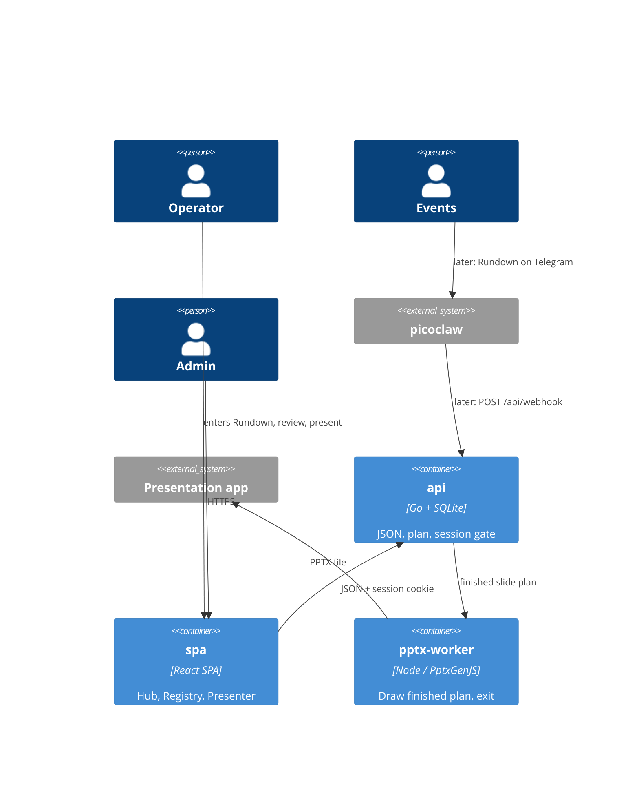

# blueprint

> Generated by `.constitution/method/scripts/validate.py --generate`. MUST NOT be hand-edited.

This is what the owner reads at **G3 Blueprint** — one page, every one of the gate's seven questions answerable from it. Its content is affected by neither `mode` nor `risk_accepted`.

## Use case catalogue

**29 use cases**, 7 marked `critical`. Rendered from `usecases.yaml`.

| id | Use case | Component | Satisfies | critical |
| --- | --- | --- | --- | --- |
| `UC-1` | Events send a Rundown on Telegram and its Service appears | `hub` | `FR-1`, `FR-2` | yes |
| `UC-2` | I paste a Rundown in Hub and a new Service is saved | `hub` | `FR-27`, `FR-2` | yes |
| `UC-3` | I open the dated Service list | `hub` | `FR-8` | no |
| `UC-4` | I follow the worship order from the Run-Sheet | `hub` | `FR-17` | no |
| `UC-5` | I edit Service fields in Hub | `hub` | `FR-11` | yes |
| `UC-6` | I regenerate this Service's Deck | `hub` | `FR-13` | no |
| `UC-7` | I delete this Service and its assets | `hub` | `FR-10` | yes |
| `UC-8` | I preview the Service slides in the browser | `hub` | `FR-9` | no |
| `UC-9` | I manage Operator and Admin accounts | `hub` | `FR-18` | no |
| `UC-10` | I read Hub in my language | `hub` | `FR-25` | no |
| `UC-11` | I present a fullscreen slideshow | `presenter` | `FR-15` | no |
| `UC-12` | I run the two-screen presenter | `presenter` | `FR-16` | no |
| `UC-13` | I display an on-demand verse on the projector | `presenter` | `FR-19`, `FR-22` | no |
| `UC-14` | I change a slide's layout | `registry` | `FR-20`, `FR-30` | no |
| `UC-15` | I reorder slides and deletions stay deleted | `registry` | `FR-21` | yes |
| `UC-16` | I Sync Artifact to a Service already reviewed | `registry` | `FR-21` | no |
| `UC-17` | Events correct one song via Telegram | `hub` | `FR-12` | yes |
| `UC-18` | I download the PPTX for Sabbath | `hub` | `FR-14` | no |
| `UC-19` | I choose one transition for the whole Deck | `hub` | `FR-7` | no |
| `UC-20` | I see a Deck that matches this week's payload | `registry` | `FR-4`, `FR-5`, `FR-6` | no |
| `UC-21` | I manage the announcement list that persists across weeks — RETIRED, superseded by UC-14/UC-15 | `hub` | `FR-3` | no |
| `UC-22` | I browse Song Books and translations by language | `hub` | `FR-23`, `FR-24` | no |
| `UC-23` | My edit is rejected because someone else already saved | `hub` | `FR-28` | no |
| `UC-24` | I add, rename, or remove a song-set entry | `registry` | `FR-29` | no |
| `UC-25` | I maintain the background library and set the global default | `registry` | `FR-31` | no |
| `UC-26` | I enter this week's song numbers, books, and backgrounds for however many songs are configured | `hub` | `FR-32` | no |
| `UC-27` | I switch the live Verse/Reff background during the service | `presenter` | `FR-33` | no |
| `UC-28` | I correct a song's lyrics for this Service, and optionally save the fix back to the Song Book | `hub` | `FR-34` | yes |
| `UC-29` | I control the presenting laptop from my phone while standing away from it | `presenter` | `FR-35` | no |

## Actor list

### hub — Hub

| Actor | Who they are | What they may do |
| --- | --- | --- |
| Operator | Multimedia team | List, create, edit, generate, download, delete, Run-Sheet. **Not announcements** (FR-3 retired, DEC-004) |
| Events | Later: Rundown sender on Telegram | Not a Hub user this phase |
| Admin | Account and settings manager | Accounts, transitions, locale |

### presenter — Presenter

| Actor | Who they are | What they may do |
| --- | --- | --- |
| Operator | On-duty at the venue laptop | Slideshow, presenter, projector, verse |
| Congregation | Screen audience | Do not open this surface |

### registry — Registry

| Actor | Who they are | What they may do |
| --- | --- | --- |
| Admin | Structure editor | Layout, order, add, rename, delete, Sync Artifact |
| Operator | Sees the result | Sees the Deck matching the payload; does not edit Registry |

## Domain model

### hub

### Domain model — Hub

Conceptual. Database column types belong in `.how/`.

| Entity | Meaning | Relations |
| --- | --- | --- |
| Service | One dated worship gathering | 1 weekly payload, 0..1 Snapshot (owned by Registry), 0..N images |
| Account | Per-person account | Admin or Operator role |
| AppSetting | Application settings | transition, ui_locale, default corpus, default Song Book, Background Library default |
| Rundown | Text the Operator enters in Hub this phase; later Events may send it on Telegram | becomes Service payload |
| Hymn | One Song Book entry, identified by book + number | resolved into a Service song block (BR-3) |
| Song Set Weekly Input | One Song Set entry's weekly values for this Service — `<var>_song_number`, `<var>_song_book_name`, `<var>_song_background` | one per Song Set entry the Registry has configured (FR-32); the entry itself is Registry-owned |
| Lyric Override | This Service's edited lyric text for one Song Set entry | scoped to this Service only by default; an explicit save-back action writes it into the Song Book instead (FR-34, DEC-004) |

**AnnouncementItem is retired from Hub (DEC-004).** Announcement composition moved entirely to the Registry's Announcement Set (`.what/registry/03-domain/domain-model.md`); Hub owns no announcement-list entity any more (FR-3 retired, superseded by FR-21).

The Operator form is one raw Rundown plus structured overlays. Physical field names: `.how/hub/05-model/form-fields.md`.

### presenter

### Domain model — Presenter

Has no **persisted** write entities. Reads Service and renders the slide plan owned by Registry.

One piece of state is written and it is deliberately not in this table: a **RemotePairing** (UC-29,
AD-37) — which remote device may drive which presenting client, and until when. It lives in the Go
process's memory and in **no table**, so it needs no schema change and no `data_version` bump, and an
API restart ends every pairing rather than resurrecting one nobody remembers granting. Its lifecycle is
in `state-machines.md`; whether it should survive a page reload is **OQ-55**. It is session state, not
domain data, which is why it claims nothing in `owns:`.

| Entity | Meaning | Relations |
| --- | --- | --- |
| (read) Service | Worship gathering being shown | Hub writes |
| BibleTranslation | Registered translation corpus | 1 : N BibleVerse, 1 : N book names |
| BibleBook | Canonical book identity | N names per translation (AD-27) |
| BibleVerse | Verse text | points at book identity |

### registry

### Domain model — Registry

Conceptual. Database column types belong in `.how/`.

| Entity | Identified by | Meaning | Relations |
| --- | --- | --- | --- |
| ArtifactTemplate | template id | One Deck-order entry on the main spine | kind General / Song Set / ann-set marker; 0..N per Registry |
| ServiceRegistrySnapshot | Service id | Copy of the whole spliced structure (main spine + every Announcement Set it references **+ the shared Title/Verse/Reff trio**) when the Service is created, or re-cloned on Sync | 1 Service : 1 Snapshot. The trio is frozen here, not read live at render time (owner ruling, 2026-08-20 — reverses an earlier live-read draft) |
| Predefined Field Catalog | catalog key | Closed set of weekly-content keys, each an inline `{key}` token inside a text element's content | many text elements may carry the same key; supersedes **Placeholder Catalog**'s whole-element binding (DEC-004) |
| Song Set Entry | `variable_name` | One admin-configured song block on the main spine, with its own name and title; N may exist, no fixed count | identity belongs to the system, never a positional ordinal; at most one row per `variable_name`; every entry shares the one Title/Verse/Reff layout trio; supersedes **SongSet Slot**'s four fixed positions (DEC-004) |
| Announcement Set | ann-set id | An Admin-authored, ordered sequence of General slides, held only in the Registry | 0..N per Registry; a main-spine `ann-set` marker splices exactly one set in at that position; supersedes the row-expands-Hub's-list shape BR-11 used to describe (DEC-004) |
| Background Library | image id | Admin's set of images (no colours, no gradients) selectable as a Verse/Reff background, plus one entry marked the global default | many Song Set entries may reference the same image; one entry per library is the global default |
| Song Book | book code | A selectable lyrics source a Song Set entry may pick, or fall through to the Admin-set global default | many hymns per book; a Song Set entry names at most one book per week (Hub weekly value) |

One Registry holds zero or more ArtifactTemplates (main-spine rows), each Song Set entry shares the one Title/Verse/Reff sequence, and each Announcement Set is its own ordered list independent of every other. After FR-21, one Service has one Snapshot covering the whole spliced structure.

Predefined Field Catalog **coverage floor** (intent, not persisted spelling — Story 20.5 owns the key strings, translated per Supplement S1): `service_date`; `scripture_reference` / `scripture_text` / `scripture_bible_version`; `theme_reference` / `theme_text`; `special_song`; `sermon_title` / `sermon_speaker_name` / `sermon_poster`; `closing_prayer_person`; `family_name` / `family_request` / `family_photo`; `youth_name` / `youth_request` / `youth_photo`. Song Set hymn/lyric values (`song_number`, `song_title`, `verse_number`, `verse_content[]`, `reff[]`) are system expansion from the Song Book, not catalog keys, and are scoped per Song Set entry's `variable_name`.

#### Deferred to G4

The exact persisted shape of Song Set Entry (table vs. column), Announcement Set (its own table vs. a `parent_id` on `ArtifactTemplate`), Background Library, and Song Book selection is component-depth design, not this blueprint's job.

## Business rules binding more than one component

_no `.what/business-rules.md` § Rules yet._

## Invariants — the spine

Rendered from `.how/_platform/ARCHITECTURE-SPINE.md`. G3 asks of every row: does it name the concrete failure it prevents, and would breaking it in one component break another?

| id | Invariant | Binds | Prevents | Rule |
| --- | --- | --- | --- | --- |
| `AD-1` | Web Hub + Offline PPTX (Phase sequencing) [ADOPTED] | Presentation rendering, Operator experience | Dependency on venue internet during Sabbath services | Operators use a zero-install **Web Hub** for review/run-sheet. **Phase 1** presents on Sabbath from a downloadable offline **PPTX**. In-browser Web Slideshow / Presenter Mode are **shipped** (FR-15 / FR-16) but are **not** the hard offline Sabbath guarantee; PPTX download remains primary for venue reliability. A registry or layout change may not make Sabbath rendering depend on hub connectivity. |
| `AD-2` | Single Repository Monolith [ADOPTED] | Code organization, deployment | Operational complexity and synchronization issues for a solo developer | The picoclaw skill integration logic, the Go API, the React SPA, and the Node PPTX worker reside in a single repository and deploy as a cohesive unit. Registry storage, the admin editor UI, and both renderers are part of that unit; there is no separate editor service. (Amended DEC-003: App Router is no longer the UI process.) |
| `AD-3` | Decoupled Ingestion and Presentation [ADOPTED] | Data boundaries, external integrations | Tightly coupled integrations that would make replacing the Telegram/Agent ingestion difficult | The API must expose a standard JSON interface for service generation that is agnostic to the input mechanism (Telegram/picoclaw). The presentation layer consumes this same API. Artifact templates are a presentation-layer concern; webhook/service intake JSON stays agnostic of layout templates. |
| `AD-4` | LiveServer durable paths (home PC production) [ADOPTED] | Deployment, SQLite, announcement uploads | Ephemeral container-only data loss | Production is one always-on **Go API** process on host storage (`presenter.example.org` via Cloudflare Tunnel on LiveServer; `presenter-dev.bic.my.id` on a VPS via systemd for dev). That process ships the SPA static assets and includes a Node runtime **only** so the PPTX worker can be exec'd (AD-30). Host-durable paths for `DB_PATH`, PPTX cache, and `UPLOADS_DIR` (bind mounts or fixed host directories). Do not run multiple API processes against the same SQLite file. Operator details: `.constitution/project/deployment.md`. **First deploy happened on 2026-08-20**: `presenter-dev.bic.my.id` runs under systemd on the VPS and has been redeployed several times since. The production host (`presenter.example.org` above, a deliberate placeholder — the real production hostname MUST NOT enter this public repository) is still a 503 holding vhost with no process. This sentence read "As of 2026-07-30 no deployment exists" until 2026-08-22. That date is load-bearing rather than trivia — AD-18's total-replacement licence and AD-21's released-version freeze both hinge on *until first deploy* — so **the hinge has now tripped, and whether those two licences still apply is the owner's call, not a consequence to be inferred from this corrected date: OQ-50.** The anchor is stated here rather than inferred from this rule's tense. Announcement image refs are remote http(s) (SSRF-hardened) **or** hub-local `/api/uploads/<32-hex>.(jpg\|jpeg\|png\|gif\|webp)` resolved from disk for PPTX. Registry rows and per-service registry snapshots live in that same durable `DB_PATH`; editor image references resolve through the existing `UPLOADS_DIR` / allowlist rules, never new ad-hoc paths. (Amended DEC-003: the unit is no longer a Next.js standalone process. Docker Compose packaging was retired 2026-08-20 in favour of binary + systemd deploy.) |
| `AD-5` | Single request gate on the Go API [ADOPTED] | every HTTP path the Go API serves; authentication and authorization | per-route authorization drift, and privilege that survives demotion, logout, or password change | The Go API has one request gate, and its path matcher **is** the authorization boundary — anything it does not match is served with no session check at all, so a new exclusion ships together with its assertion test in the same change set. The gate re-checks every session against SQLite (deleted account, role demotion, stale `token_version`, revoked `sid`) and **fails closed** if that lookup throws. Privileged routes additionally call `requireSession` / `requireAdminSession`; the cookie's `role` claim is never trusted alone. `/api/webhook` is gated by `WEBHOOK_SECRET` only — 503 when unset, 401 when wrong or missing — never by a cookie. Post-login `next` targets pass through `safeNextPath`. Every gated response carries `Cache-Control: private, no-store` and `Vary: Cookie`, because the hub is published through a Cloudflare Tunnel where an edge cache rule could otherwise serve a private response without the origin — and therefore without this gate — ever running. A signature-only check cannot see a deleted account, a demotion, or a revoked session; for one congregation on a home server the cost of a local SQLite read is accepted. The SPA has no session authority of its own. (Amended DEC-003: the gate is no longer `internal/gate`. As-built until the cutover wave still uses that file; the invariant is one matcher on the always-on API.) |
| `AD-6` | Optimistic concurrency on service edits [ADOPTED] | service mutation APIs, hub edit UI, agent/webhook corrections, registry template writes, Sync Artifact | an operator's edit silently erased by a late correction (last-write-wins) | every service mutation carries the client's `updated_at` as a precondition; a stale value is rejected with HTTP 409 and the client re-reads before retrying. No write path may bypass the precondition. This covers registry writes and the **Sync Artifact** action of AD-16 — the shipped shape is `expectedUpdatedAt` / `RegistryStaleError` in `src/lib/registry/store.ts`. |
| `AD-7` | `buildSlidePlan` is the only slide-order source [ADOPTED] | PPTX generation, web slideshow, presenter + projector | divergent slide order or content between what the operator controls and what the congregation sees | `buildSlidePlan` is the single source of slide order and content for every surface. No surface recomputes order from service fields or keeps its own ordering logic; a rendering or ordering change lands in the plan, never per-surface. AD-12's Fat Payload specializes this rule; AD-16 changes only where the plan reads its templates from, never that there is one order source. |
| `AD-8` | Image references resolve only through shared safety helpers [ADOPTED] | announcement images, hub uploads, registry/asset references, PPTX embedding | a new surface reintroducing SSRF or unsafe content through its own laxer resolver | image references resolve only through the shared helpers in `src/lib` — allowlisted remote http(s) and hub-local `/api/uploads/<32-hex>.(jpg\|jpeg\|png\|gif\|webp)` for announcements, and registry `/assets/...` refs for Artifact templates. A new reference vocabulary extends an existing helper or adds one alongside them with the same fail-closed default; no unit ships an inline resolver. The canvas editor introduces no second resolver and admits no `data:` or arbitrary remote URI. |
| `AD-9` | Schema evolution through startup DDL only [ADOPTED] | SQLite schema, and the bootstrap path it shares with AD-18 | two sources of schema truth between a developer machine and a fresh production container | schema changes go through the Go API's startup DDL when it opens SQLite. No migration framework (Prisma or otherwise) is introduced without an explicit product decision recorded in this spine. Registry tables are created on that same path. **The bootstrap path is shared, and the division is fixed:** this rule owns *schema* — the shape, e.g. adding a column — while **AD-18** owns *value* migration — the contents, e.g. rewriting every row's `base_type`. Neither licenses the other's mechanism: a value change is not a reason to add a framework, and a schema change is not a reason to rewrite data. (Amended DEC-003: not the Next.js `getDb` path.) |
| `AD-10` | One presenter sync channel, client-side only [ADOPTED] | presenter, projector, web slideshow | a split sync topology where the projector follows one controller and ignores another | presenter↔projector sync goes through the single `@/lib/present-channel` `BroadcastChannel` module; no surface opens its own channel name or message shape. No server realtime channel (WebSocket/SSE) is introduced unless product direction changes — keeping the venue path independent of hub connectivity, per AD-1. A registry edit must not add a second channel to push template changes to a live projector. **Every message carries a plan identity** — a fingerprint of the snapshot and resolved announcement set that produced the deck — and a receiver whose own identity differs **refuses to follow the index** and says so on the room-facing screen rather than rendering a slide it cannot vouch for. Presenter and projector are two independent `force-dynamic` renders, each calling `buildSlidePlan` at its own moment, so a bare `index` silently means different slides on the two screens the instant anything structural changes underneath them; since this rule forbids a surface inventing its own message shape, the identity has to live in the shared shape. |
| `AD-11` | Artifact Registry Storage *(was `epic-16 AD-1`)* [ADOPTED] | Database schema, the Canvas Editor's save API, and the startup seed path. | Data loss on ephemeral container filesystems, file-lock concurrency issues, and a seeder that overwrites administrator edits or leaks private seed content. | The live Artifact Registry is stored in SQLite on the durable `DB_PATH` (AD-4). Filesystem JSON serves exclusively as a startup seed: startup inserts missing template IDs and **never** overwrites persisted administrator edits. Canvas Reset discards unsaved in-memory edits back to the last Saved state. Seeded elements are ordinary editable and deletable elements that an administrator may freely modify or delete; they are not locked against removal or modification on save (DEC-014). The seed is two-layered — `data/local/default-registry.json` is git-ignored and **takes precedence over the shipped `data/default-registry.json` example whenever present**; a seeder that reads only the shipped example breaks the mechanism that keeps congregation data out of a public repository. |
| `AD-12` | Slide Plan Data Flow (Fat Payload) *(was `epic-16 AD-2`)* [ADOPTED] | The `buildSlidePlan` return type and all downstream renderers. | The Web (`SlideView`) and PPTX renderers from performing independent database lookups or maintaining their own diverging layout logic. | `buildSlidePlan` outputs a fully hydrated AST (Fat Payload) with exact rendering coordinates, fonts, colors, and resolved text content. Specializes AD-7: the plan is the single order *and* layout source, so a renderer never **reads data from** the registry itself. Importing a shared *helper* that happens to live under `src/lib/registry/` is not such a read — `pptx.ts` importing `isBundledAssetRef` from `registry/asset-safety` is the AD-8 resolver this spine requires, not a data path. |
| `AD-13` | Canvas State Boundary *(was `epic-16 AD-3`)* [ADOPTED] | The React-Fabric integration layer (`src/components/admin/ArtifactEditor.tsx`). | Two-way data binding lag, stuttering drags, and unnecessary React re-renders. | The Canvas Editor uses an Uncontrolled Wrapper pattern. Fabric.js owns the canvas state exclusively; React reads it **only on save**, through `serializeCanvas` over `canvas.getObjects()`, projecting into the registry's own element schema. Not `canvas.toJSON()`: Fabric's serialization format is **not** `ArtifactLayout.elements`, so a second editor surface built on `toJSON()` would fail AD-15's validator on every write. The projection into the registry schema is the boundary, not the canvas library's own format. |
| `AD-14` | Global Template Administration *(was `epic-16 AD-4`)* [ADOPTED] | `/admin/artifacts`, `/api/admin/artifacts/**`, and the registry access layer. | Per-service template drift and operator-level mutation of every service's visual contract. | Artifact templates are global across services. Registry management UI and APIs are admin-only and re-check the current account role from SQLite — a specialization of AD-5, not a separate authorization scheme. `/admin/artifacts` and `/api/admin/artifacts/**` are inside the AD-5 matcher, and adding a registry route outside it requires the same-change-set test update AD-5 demands. Downstream planners and renderers read the registry through server-side modules rather than the management API. |
| `AD-15` | Stable Layout Identity *(was `epic-16 AD-5`)* [ADOPTED] | Seed data, every write path into the registry, hydration, and both renderers. | Unit-specific renderer drift, required-placeholder deletion, and unsafe image references reaching a renderer through an unvalidated back door. | Layouts use a fixed 16:9 canvas with normalized percentage coordinates and stable template/layout/element/placeholder IDs. Coordinates may extend beyond the canvas to preserve intentional source-deck clipping. **Every** write into the registry is untrusted and must pass the same structural and image-reference validation before persistence — the canvas save API, the startup seeder, and any import or asset-extraction script alike. Image refs validate through the shared helper required by AD-8; no write path ships its own check. |
| `AD-16` | Service-Bound Registry Snapshot *(was `epic-16 AD-6`)* [ADOPTED] | service creation, the Sync Artifact action, `buildSlidePlan`'s template input, and every read path a service surface uses. | a live registry edit shifting the structure under a service an operator is preparing right now, and a weekly value entered against one structure being orphaned by a later structural change — and, in the other direction, a service with no way to be brought up to date. | Creating a worship service **clones** the ordered live registry — order, kinds, labels, layouts, placeholder bindings, **and the administrator override records of AD-22** — into a **service-bound snapshot** on the durable `DB_PATH` (AD-4); creation is the only freeze event. The clone is of the *rendered* structure, so anything AD-22 keeps outside the layout travels with it; an override left out of the clone would either never reach the deck or reach it from outside the freeze, and both defeat this decision. A service's plan, Presenter, slideshow and PPTX read that snapshot; a live registry edit reaches an existing service **only** through the explicit **Sync Artifact** action, which replaces the snapshot destructively. Sync is permitted on **any** service, carries the service's `updated_at` precondition (AD-6), and may not alter the service's entered data (*State* convention) — "destructive" means it replaces the snapshot, never that it may overwrite a service someone else has moved underneath it. **Sync is a structural write and is therefore admin-only**, re-checking the role from SQLite exactly as AD-14 requires of every registry management surface, even though it is reached on a service route that `internal/gate` gates for any signed-in account; its route ships with the `tests/go-http-gate.test.mjs` assertion AD-5 demands and an in-route `requireAdminSession`. An operator may see that their snapshot is stale and *request* a sync; they may not perform one. Without this, "permitted on any service" and AD-14's surviving admin-only clause read as licence for an operator to freeze a half-authored layout into the service that presents in fourteen hours — this decision's own *Prevents*, arrived at from the other direction. The clone and the re-clone are write paths and validate under AD-15 like every other. **Announcement membership is not cloned:** the Announcements master list stays live and reaches an existing service at render time (CAP-7). **It is nonetheless scoped per service (`service_id`), matching the clone boundary everywhere else in this decision** — "not cloned" means this week's flyers may still change after the structure is frozen, never that one list is shared across services. The distinction is invisible while only one service is being prepared and decisive the moment two are open at once — a stale service reopened for a correction while next week's is being built — at which point an unscoped list bleeds one service's images onto another's deck. The shipped `announcement_items.service_id` is nullable, so both readings are currently expressible; this rule picks the scoped one. **A later structural change obliges nobody to keep an older snapshot renderable** — what the snapshot protects is the service's entered supporting data, not its ability to regenerate a past deck. The snapshot is the sequence *input*: `buildSlidePlan` remains the single source of order and layout (AD-7, AD-12), and no renderer reads a snapshot directly any more than it read the registry. **One bounded exception, stated as an exception rather than argued away — pre-existing services.** A service created *before* this model ships has no snapshot and renders from the live registry until its first Sync, which is a clone-in-place; from that moment the rule above governs it without qualification. So *"creation is the only freeze event"* holds for every service created under this decision, and the no-snapshot state is a **one-way migration path into** the decision rather than a second mode inside it: nothing may create a new service without a snapshot, and no code may re-enter the state once left. It is called out because every service in the database on day one is in it — `spec-artifact-registry-authoring/SPEC.md:89` assumed exactly this and an earlier draft of this rule forbade it, which would have left three stories free to answer it three ways. The Epic 20 data transition (AD-21) may instead clone a snapshot for every existing service and close the exception outright; that is the preferred landing, and either way the state is finite and dated. **Naming caution:** the shipped `RegistrySnapshot` type (`src/lib/artifacts/registry-snapshot.ts`) means *"the live-registry map assembled for one plan build"* — a different thing from this decision's per-service durable freeze, and the two must not be conflated. |
| `AD-17` | The Seed Is a Bootstrap, Not a Correction Channel *(was `epic-16 AD-7`)* [ADOPTED] | the `getDb` startup path, the registry store's insert path, **every read path that assembles the registry**, the delete verb, the Reset verb, and the registry's ordering column. | an administrator's delete, rename or reorder being silently undone by an unrelated restart. A deleted row leaves no evidence behind, so anything that supplies "missing" IDs cannot tell *deleted on purpose* from *never existed here* — it resurrects the row forever. | The seeder initialises data **from zero only** — first install, first run — and is gated by a marker in `settings`. It is never a gap-filler: after it has run, the administrator owns every row that exists, and the ordered registry is authored data rather than shipped data kept in sync. A gap in a database that already holds data travels as a versioned data migration (AD-18, AD-21), never as a re-seed. **The filesystem seed is read at exactly two moments — the first-boot bootstrap, and an explicit per-template Reset — and at no other.** In particular **no read path may substitute a seed template for a row the database does not hold, and none may substitute one for a row it holds but cannot parse.** An ordered registry of N rows produces a deck built from those N rows and no others; a template id the database does not hold does not exist, and a row whose payload will not validate **fails closed** — no layout, logged with the id and the reason, the same posture AD-5 and AD-8 already take. Both halves matter and the second is the easier one to leave open: `registry-snapshot.ts` **used to** substitute seed content in **one** loop for absent and corrupt rows alike (`parseRow` merely returned `null`, so a corrupt row reached that loop indistinguishable from a missing one), so a rule that closed only the *absent* case left shipped example content silently standing in for an administrator's real layout the moment one row was malformed. That loop is the hazard this Rule forbids; AD-11 records it closed 2026-08-07 (Story 20.1). Closing only the boot door is what let a deleted slide re-materialise into the deck on every plan build, with `rejected.delete(seed.id)` suppressing even the log line. `tests/registry-reseed.test.mjs`'s assertion that a missing row is re-inserted is **inverted, not deleted**, and a second assertion pins that a deleted row does not reappear in a built plan. Restoring shipped content stays possible as an **explicit administrator action** — Reset-from-seed per template, per AD-11 — never as a side effect of a restart, and never as a bulk re-seed of a live database. |
| `AD-18` | Vocabulary and Value Changes Travel as Explicit One-Time Migrations *(was `epic-16 AD-8`)* [ADOPTED] | the `base_type` value set, `ARTIFACT_BASE_TYPES` and the `isCanvasAuthorable` predicate derived from it, the registry validator, and any future change to persisted registry values. | a shipped vocabulary change reaching persisted rows through boot-time re-seed (which AD-17 removed) or not reaching them at all — and the opposite failure, a migration framework arriving by the back door. | AD-9 fixes *schema* evolution on the startup DDL path and is silent on **value** migration; this decision fills that silence rather than weakening it. A shipped change that must reach rows already persisted travels as an **explicit, one-time migration** on the startup path, versioned per AD-21. It is not a migration framework and AD-9's prohibition stands: no Prisma, no versioned migration directory, without an explicit product decision recorded in this spine. **Until first deploy** no production rows exist, so Epic 20's seven-`base_type`-to-three-kind collapse ships as a **total replacement** — no backward compatibility, no migration over live rows — folding into production data version 1 (AD-21); at first deploy that licence ends, and the same change would need a migration over live `artifact_templates` rows. A migration operates on the **live registry** and does **not** rewrite service snapshots — structure reaches an existing service only through Sync Artifact (AD-16), so a migration that rewrote snapshots would be a second structural channel. An older snapshot may therefore stop being renderable, which AD-16 accepts; what must survive is the **entered data**. |
| `AD-19` | A Cross-Boundary Key Is a Server-Owned Value the Administrator Cannot Edit *(was `epic-16 AD-9`)* | the `base_type` enumeration, the Placeholder Catalog key set, the worship-service settings form, and every write path into the registry. (The four predefined SongSet slots this line named until 2026-08-20 are superseded by AD-31, which opens the count to an Admin-configurable list.) | two independently-built units agreeing to disagree about a key — the registry surface and the worship-service settings form picking different handles for the same SongSet slot, and the canvas editor's insert list drifting from what the validator actually admits. | a key referenced across a boundary is **server-owned vocabulary, enforced on every write path**, and it is never administrator configuration. Three properties make it unambiguous rather than merely convenient: the key is **never administrator-editable**, **at most one registry row may carry each slot identity**, and it is a **semantic name, never an ordinal** (`songset1` re-imports the positional reading this decision exists to remove). The recognized set is **closed and complete** — `general`, the four `songset-*` slot identities, `announcement`: six keys over three kinds, and no write path admits a seventh; the Placeholder Catalog's admitted keys are the same class of value and get the same treatment AD-8 and AD-15 gave image references, so *"the UI cannot invent a catalog key"* (CAP-4) is a property of the registry rather than of one client. **The value a key names has exactly one persisted home** — for a slot binding that is the service's own entered data, and the identity is a *key into* it, never a second copy; otherwise a webhook correction (which AD-3 forbids knowing slot keys) rewrites one home while the settings surface owns the other, and the deck renders one hymn while the run sheet and the edit form show another, with no 409, no log, and no screen on which both values appear. A binding whose slot row has been deleted is **inert, not an error**, and the entered number survives in the service's own data. Reordering rows changes the presented sequence (CAP-8) without touching a binding, and renaming a label cannot touch one either. Every spelling here is a persisted binding key, so changing one later is the versioned data migration AD-18 and AD-21 govern, and extending the vocabulary — a fifth slot, a fourth kind — is a code-plus-tests change. |
| `AD-20` | The Planner Injects Nothing the Registry Did Not Ask For [ADOPTED] | `buildSlidePlan`, the registry seed, the ordered registry, and every liturgical rule about which slides exist. | a liturgical decision requiring a code change and a deploy, and the planner keeping a second, invisible source of deck content alongside the registry. | every slide in the deck originates from an ordered registry entry. `buildSlidePlan` **applies** rules; it does not **hold** them. Fixed liturgical content — the standing responses `#671` and `#684`, the closing *We Have This Hope* — is authored as **General** entries and edited by hand, never injected by the planner and never computed from the hymnal. Because a General generates no title slide, the `skipTitle` mechanism is **removed rather than migrated**: there is nothing left to suppress. It shipped at five sites and Story 20.1 deleted them — a removal, not a compatibility shim, and `slide-plan.test.mjs:231` greps the tree to keep it deleted. Changing or adding a liturgical song is a registry edit. |
| `AD-21` | Persisted Data Carries One Version Number, and Unreleased Transitions Compact Into One [ADOPTED] | the persisted data version in `settings`, every data migration on the `getDb` startup path, the release procedure, and the developer database lifecycle. | two builders keying the same change incompatibly — one adding a per-change boolean, another bumping a counter — and a production database accumulating one transition per code change, so that its version history tracks development activity instead of releases. | All persisted data shares **one monotonic version number** in `settings` — one counter for the whole database, never one per table or per domain, so that "which version is production on" has a single answer. A change that must reach data already persisted is declared **explicitly while it is being coded**, as the transition from version *n* to *n+1*; it is never inferred at deploy time. **An unreleased transition is not yet history and may be rewritten:** the whole batch of unreleased transitions is compacted into a single transition before it reaches production, and developer databases are **reset** to the compacted version rather than migrated through the steps it replaces. **A released version is frozen** — once a version has reached production it is never renumbered, re-cut, or folded into another. Small steps are a development convenience and stop at the merge; production sees one transition per release. AD-17's seeding marker and this counter are **distinct**, and neither substitutes for the other: the marker records that bootstrap ran, the counter records which data version is persisted. This is a counter and a convention, not a framework: AD-9's prohibition stands. |
| `AD-22` | Authoring Authority Is Fixed per Kind: Free Canvas, Bounded Config, or Bound to a Set | the canvas editor, the registry validator, and the plan's expansion of one entry into N slides. (The SongSet configuration surface this line named is retired by AD-33, which gives Song Set a free canvas instead.) | the canvas editor and the validator disagreeing about what an administrator may author on a non-General entry — one opening a free canvas on a SongSet row and admitting an extra or rebound placeholder, the other refusing it — and CAP-3's *"General only"* living nowhere but in a capability statement. | authoring authority is fixed per kind, and no surface widens it. **`general` is free canvas:** the administrator composes it from anything, including Placeholder Catalog keys (AD-19). **A `songset-*` row gets a bounded configuration surface, not a canvas:** exactly two background images — one for its title layout, one for its lyric layout, which verse and refrain share — plus font style and font size. Both background references resolve through the shared helper AD-8 requires: this surface is not the canvas editor and introduces no second resolver of its own. Layout composition itself is developer-owned seed data and is not exposed there; it stays registry data hydrated into the plan (AD-11, AD-12), never a coordinate held by a renderer. **Administrator-configured values persist outside the layout**, as an **override record keyed by row and field**, re-applied over the developer layout at hydration: the layout JSON stays developer-owned in full and a migration may replace it wholesale, the override record stays administrator-owned in full and no migration, Reset, or re-seed writes it, and a bounded surface that writes *into* the layout is refused by the validator on every write path (AD-15). An earlier draft left the encoding as "a schema call, not an invariant" — an override record beside the layout *or* a marked field inside it. The two were never equally available: the shipped validator rejects unknown keys against a closed `ALLOWED_LAYOUT_KEYS`, so the in-layout marker cannot ship without a registry-contract change this decision does not authorise, leaving only the unmarked shape — background written straight into `layouts.*.backgroundImage`, font into element `style`, indistinguishable from developer output. Then this decision's own migration clause replaces those layouts and **every background and font size the administrator chose reverts to the shipped default, on all four slots, silently, before anyone opens the hub** — AD-11 keeps no second copy and Reset would discard them too, so the only record of them was the layout just overwritten. The row's placeholder set and its SDAH slot binding are server-defined: nothing may be added, removed or rebound, and the validator refuses it on every write path (AD-15). **An `announcement` row is bound to the Announcements master set**, whose membership is not registry-authored at all (AD-16, CAP-7). Only those two kinds **expand** — a SongSet row into its title and lyric slides, an `announcement` row into N full-bleed images; a General is one slide. Because AD-17 reads the seed once, a developer's later change to a SongSet layout reaches a deployed database only as a versioned data migration (AD-21) — never by restart, and not by Reset. **Reset restores the shipped *layout* and leaves the override record untouched**, which is the whole point of keeping the two apart: before the override record existed, Reset would have discarded the administrator's backgrounds and font sizes along with the layout, and there would have been nowhere to recover them from. A Reset that also cleared administrator configuration would need to say so and does not. |
| `AD-23` | Transition Style Is One Value, Described Once, Consumed Identically [ADOPTED] | PPTX generation, web slideshow, presenter, projector, the admin settings surface | a deck that fades in PowerPoint and cuts on the projector — the same slide sequence behaving differently on the two surfaces the congregation and the operator each watch | transition style is **one app-wide value** in `settings` (`slide_transition`), and each style is described **exactly once**, in `src/lib/transitions.ts`, carrying both its PowerPoint element and its browser animation parameters. Neither renderer holds either half: `pptx.ts` and the browser surfaces all import that table, and **no surface keeps a default of its own** — that, not immutability, is the invariant. The value reaches each surface directly from `settings`, never through the plan (`buildSlidePlan` has no transition concept at all). There is no per-service override. The presenter **may** override the style for the **live browser session**, and that override travels through AD-10's channel so presenter and projector never disagree with each other (`PresenterOperator.tsx`); a PPTX already generated keeps the `settings` value it was built with, because a downloaded file cannot be re-styled after the fact. Adding a style means adding a row in that one table — and only styles that survive a plain `<p:transition>` child without the `p14` extension namespace qualify, so nothing silently degrades to "no transition" when the deck is opened elsewhere. This ratifies a convention the code already states in its own header; it is recorded here because FR-7 (`prd.md:179-180`) makes it a requirement and `prd.md:304` states the cross-surface obligation in as many words — *"the browser transition matches the Deck's configured transition style (FR-7); the two are chosen once and never diverge"* and `docs/architecture.md:61` — a declared source of this spine — used to contradict it by hardcoding a crossfade. That source was reconciled on 2026-07-30 and now states the configured value and cites this `AD`, so the contradiction is closed; the decision stays because FR-7 still needs an owner and because two renderers plus two browser surfaces is exactly the shape that diverges without one. |
| `AD-24` | Operator Chrome State Is Browser-Local, and the Room-Facing Surface Is Closed to It [ADOPTED] | the sibling operator and projected SPA shells, every browser-persisted operator preference, the choice between `settings` and `localStorage` as a storage target, and every full-screen room-facing surface | one hazard with three faces — a preference landing in `settings`, where it silently becomes *every* operator's, or a deck-affecting value landing in `localStorage`, where AD-4's durability, AD-6's concurrency and AD-18/AD-21's migration rules cannot reach it; the root client boundary migrating upward until the whole app is a client tree; and a client-persisted value that **paints** becoming a third structural channel to the congregation's screen, alongside `buildSlidePlan` (AD-7) and the BroadcastChannel (AD-10) | **application state reaches one of three homes and *who must agree on it* picks which.** **Persisted-shared** lives in SQLite on the durable `DB_PATH` (AD-4) as an app-wide `settings` value, the way AD-23 keeps `slide_transition` because both renderers and both screens must agree on it. **Persisted-local** lives in that browser's `localStorage` and nowhere else — not in SQLite, not under `DB_PATH`, and therefore **not backed up** — the way the theme does, because nothing but this operator's own eyes depends on it. **Ephemeral-shared** is not persisted at all and travels over AD-10's channel. The tiers are not interchangeable in either direction. **A chrome provider mounts only on the operator shell.** The SPA therefore has two sibling shells: the operator shell owns metadata, fonts, `ui_locale`, and theme; the projected shell owns the unchanged room-facing URLs and applies the five shell claims exactly: `html.backgroundColor = #000000`, `html.overflow = hidden`, `html.scrollbarGutter = auto`, `body.backgroundColor = #000000`, and `body.overflow = hidden`. It carries no operator provider or theme state. Projected not-found and error screens render generic `#000000`/`#FFFFFF`, vertically scrollable output with no operator link or detail. **The room-facing surface is closed to operator chrome, in any form, under any setting:** the projector, the web slideshow and the PPTX never read it. Every future browser page intended for congregation or OBS output belongs on the projected shell; putting one on the operator shell is an architectural violation, not a story-level placement choice. The projected render tree paints in **literal colours**, carrying no theme token and no theme-coloured edge; a full-screen room-facing client also claims the same shell through one per-document projected-shell helper as a hydrated defensive layer, never as the owner of first paint. The PPTX is closed *structurally* rather than by browser enforcement — it is generated by the worker from a plan the Go API already assembled and cannot read browser state at all. Registry payloads rendered by the projected tree still validate under AD-15; source-tree edits are governed by this closure gate, not by the registry validator. As-built: Vite SPA operator/projected branches plus `spa/projected.html`; `tests/theme-chrome.test.mjs` pins the two shells. |
| `AD-25` | A Shipped Reference Corpus Is a Projection of Its Committed File [ADOPTED] | every table whose content is derived from a committed corpus file — `bible_verses`, the `bible_translations` registry and the per-translation names AD-26 and AD-27 add, and any later corpus's tables — plus the loaders in `src/lib/corpus.ts` and the bible half of the boot path in `src/lib/db/index.ts`. Stated by that test rather than as today's table list, because the list is about to grow and a rule enumerated against the current schema would silently not reach the new rows. `bible_books` is the one exception and AD-27 says why: the canonical identity is application-fixed, not corpus-derived. `hymns` **and** the `song_books` registry row were both bound here until AD-36 (2026-08-20, DEC-005) carved them out together — the song-book half, content rows and registry row alike, is no longer a projection and no longer this decision's to bind | two corpus families answering one architectural question two different ways — and, in the two directions that question fails, a corrected corpus that cannot reach the table at all, or one that reaches it and leaves the withdrawn rows standing | A **shipped reference corpus** — a committed data file the product carries so that a fresh clone resolves a verse and a hymn offline — is **developer-owned data with exactly one writer**, and the committed file is authoritative. Its tables are a **projection** of that file: startup reconciles each table to the corpora it ships, and the reconcile is **complete within the corpus code it names** — a row carrying that code and absent from the file is removed, and a row belonging to a sibling corpus is never touched. Whether startup detects a difference before doing the work — a per-corpus fingerprint, on the `artifact_templates.seed_hash` precedent — or simply reconciles every boot is a story-level call, bounded by the two properties this rule does fix: **a corrected corpus reaches the table with no operator step, and the table does not outlive the file.** That call is also where a growing corpus set is paid for, and the cost lands at **boot**: the first KJV seed writes 31,102 rows in ~258 ms, so reconciling several translations unconditionally on every start is the shape that turns a restart into a wait — on the morning AD-1 exists to protect. **Rebuilding rows is safe to consider, which is not obvious and was checked rather than assumed:** nothing anywhere references the surrogate `hymns.id` or `bible_verses.id` (grepped across `src/` and `tests/`, 2026-08-01), because a service persists a hymn *number* and a passage a *reference*. A reconcile may therefore delete and re-insert without dangling anything — and if that ever stops being true, this sentence is the one to come back to. This is a **third channel, and it is neither of the two it sits between.** It is not AD-17's bootstrap: a bootstrap runs once precisely because an administrator owns what comes after it, and nobody owns a corpus row. It is not AD-18/AD-21's value migration either: a migration exists to carry a change into values somebody persisted deliberately, and every value here is derived from a file already in the commit. AD-9 still owns the **shape** of these tables and AD-18 still owns **value** migration everywhere else; what this decision claims is narrower than it may look — a table whose entire content is derived from a committed file has no values of its own to migrate. **One consequence to take rather than rediscover: a rename inside a projected table is a rebuild, not a migration**, which is what makes AD-26's three renames cheap. **The closure is what makes all of this safe, and it is a property of today's code rather than a promise.** No administrator or operator write path into a corpus table exists — verified 2026-08-01, zero `INSERT` / `UPDATE` / `DELETE` against `hymns`, `bible_verses` or `bible_books` anywhere outside `src/lib/db/index.ts`. **Adding one reopens this decision before it ships**, because from that moment the reconcile is exactly the resurrection AD-17 forbids and a corpus becomes authored data carrying AD-17's, AD-6's and AD-21's obligations in full. A corpus row is therefore never where a choice is persisted; a choice *about* a corpus — which one is the default — is a `settings` value under AD-24, keyed by the corpus code AD-26 fixes. **Where it runs on the `getDb` path:** after data migrations, so a migration never observes rows the reconcile wrote in the same boot — AD-21's own reasoning for placing the bootstrap last, applied to a fourth step AD-21 could not have named. Its order relative to AD-17's bootstrap is free, because the two touch disjoint tables; that is stated so the fixed sequence in AD-21 is not read as forbidding a fourth step. |
| `AD-26` | A Corpus Is a Registered Entity: Its Code Is the Key, Its Locale Is an Attribute | the `bible_translations` and `song_books` registries, `bible_verses.translation_code`, `hymns.song_book_code`, the corpus loaders and their paths, the three `default_*` settings keys, and every endpoint that lists corpora | one corpus code meaning two different books depending on which locale directory it was found in — and the mirror failure, a locale reaching a `WHERE` clause and quietly turning a view default into a data filter | Every installed corpus is a **registered entity** — one row in `bible_translations` or `song_books`, carrying its code, display name, **locale**, licence and provenance. **The corpus code is globally unique across locales, and it is the cross-boundary key**: the class of value AD-19 governs, server-owned and never administrator-editable. `bible_verses.translation_code`, `hymns.song_book_code`, `default_bible_translation`, `default_song_book` and the corpus filename all carry that one code. **Locale is an attribute of the corpus, never part of a key and never part of a lookup.** That is what makes FR-24's never-filter rule **structural rather than disciplinary**: because no key contains a locale, no read path can *need* one, so a `WHERE locale = …` on a corpus lookup is not merely a product violation but a predicate that cannot be necessary. A listing endpoint returns every installed corpus with its locale; `default_data_locale` decides only what a picker opens on. **The file declares; the path merely locates — for the bible family, in full, and for a song book, only up to and including its bootstrap.** A registry row is derived from the corpus file's own declared metadata under AD-25, never from its directory — the loader already refuses a file whose declared code disagrees with the code it was loaded as (`src/lib/corpus.ts:91`, `:176`), and it refuses on the same terms a file whose declared locale disagrees with the directory holding it. Without that second check, copying `data/en/song-book/sdah.json` to `data/id/` gives one code two locales and the registry keeps whichever booted last. **Superseded by AD-36 (2026-08-20, DEC-005), for the `song_books` row and that row alone, the moment its one-time bootstrap has run:** ~~"a registry row is derived from the corpus file's own declared metadata"~~ stops being true of an installed song book — AD-36 makes that row administrator-owned data from bootstrap onward, so a later edit to the committed file's declared name, locale, licence or provenance no longer reaches it at all, and correcting it live is an explicit numbered migration, never a re-derivation on the next boot. Both refusal checks in this paragraph — code-disagreement and locale-disagreement — still gate the bootstrap itself and are untouched; what dies is only the promise that the row keeps tracking the file **after** that bootstrap. **Neither refusal check has anything to gate for an admin-created book (AD-36 Extended):** there is no file and no directory, so "a file whose declared locale disagrees with the directory holding it" has no subject to refuse — the check is inapplicable, not silently passed, because that row's bootstrap never reads a file at all. That row still carries this rule's full shape intact — code, name, **locale**, licence, provenance, the same five fields as any other song book — sourced from the Admin at creation instead of a file's declared metadata; AD-36's Extended clause (OQ-39 closed, 2026-08-20 owner ruling) states that positively, closing the gap this supersession sentence left open rather than leaving the remaining three fields — locale, licence, provenance — an open hole for the admin-created case (`book_code` and name are already Admin-supplied at creation; only those three were ever in question). `bible_translations` carries no such carve-out: for the bible family this sentence, and the two refusal checks, hold exactly as written, on every boot, with no qualification. **The declared field is spelled `locale`**, matching the path segment, the settings keys and this rule; both committed files ship it as `language` today and are corrected in the same change set, because a persisted cross-boundary key gets one spelling chosen once (AD-19) and the files are the source of record, so it is free now and a migration later. **The renames belong to this decision rather than to housekeeping:** `bible_verses.translation` → `translation_code`, and `hymns.book_code` → `song_book_code` because `book_code` names a *song* book in one table while `bible_books` makes *book* mean a Bible book in another — one word, two entities, ambiguous the moment one person reads both families. `isKjvCorpusEmpty()` → `isBibleTranslationEmpty(code)` is the same rule reaching a function signature: **no corpus code survives as a literal in a read path.** All three are rebuilds rather than migrations, per AD-25. **Terminology is fixed, and it stops deliberately at one place:** *bible-translation* and *song-book* are the container terms in paths, tables and prose, while **`hymn` stays the entry term** — the `hymns` table, `/api/hymns`, and the `resolvedHymns` / `failedHymnNumbers` webhook fields keep their names, that last pair being an external contract an outside caller owns and AD-3 keeps agnostic. |
| `AD-27` | Book Identity Is Canonical and Translation-Independent; Every Name Belongs to a Translation | `bible_books`, `bible_verses.book_id`, book-name resolution and display, the bible corpus loader, Story 21.4 | one table with two owners — the last translation seeded renaming every book for every reader — and *"the same passage in another translation"* ceasing to be one query | A book has **one canonical identity, stable across every translation, carrying no display text at all.** Every name and short name **belongs to a translation** and is stored against it. `bible_verses.book_id` points at the identity, which is what keeps a passage one lookup in any translation and lets a translation be added or removed without touching a verse's identity. **A corpus file maps its books onto that identity; it does not define it.** The canonical set is fixed by the application, and a corpus naming a book the canon does not hold is **refused, with the book named** — the fail-closed posture AD-5, AD-8 and AD-17 already take, chosen over a silent partial import because a translation missing four books resolves nothing for them while saying nothing about why. **Two consequences, stated rather than left to be discovered.** The canon that ships is the 66-book Protestant one, so a translation carrying deuterocanonical books is refused rather than truncated, and admitting one is a code-plus-migration change (AD-18, AD-21) rather than dropping a file into `data/`. And **input tolerance is the matcher's concern, never the corpus's**: a translation owns its *names*, while how forgivingly an operator's typing is compared against them — case, punctuation, abbreviation, singular against plural — is the matcher's. The two collapse easily and the collapse is one-way: the moment a corpus file is where an alias goes, names are corpus-owned in name only, and every translation added afterwards inherits the job of listing every way somebody might type its books. **Two things this clause originally said are superseded by AD-28 (2026-08-01), and they are struck here rather than quietly edited out, because this decision is unbuilt — which is exactly the condition under which a half-reversed rule reads as a whole one.** It said the matcher was ~~one server-side matcher **shared by every translation**~~; it is one implementation carrying a **scope**, and on an operator surface that scope is the chosen translation alone. And it treated the four kinds of tolerance as uniform; ~~abbreviation~~ is not — it carries a language and is scoped to a translation, while the other three do not. **The prohibition itself is untouched and AD-28 rests on it:** an alias still never lives in a corpus file. |
| `AD-28` | The Reference Matcher Is One Implementation Carrying a Scope, and Tolerance Carries a Language | book-name resolution in `src/lib/scripture.ts`, the two scripture-split sites in `src/lib/parser.ts`, the suggestion endpoint Story 21.5 consumes, per-translation aliases, and Stories 21.4 and 21.5 | cross-language input returning **through the matcher** once the corpus door is shut — and the mirror failure, the operator surface and the rundown drifting into two resolution rules because their scopes differ | there is **one matcher implementation and the scope is an argument to it, never a fork**. On an **operator surface** the scope is the **chosen translation alone**; on the **rundown** it is **every installed translation**, because a Telegram sender picks none. That scope is a **required, registry-validated corpus code supplied per request** — an unrecognised or absent one is **refused**, and *all-installed* is a property of the rundown surface and never a fallback, because a default silently reinstates the cross-language operator input this decision removes. It is a per-request parameter rather than the `settings` default, since FR-24's never-filter rule lets an operator browse a corpus outside the default locale. **Tolerance that carries a language is scoped with it:** case, punctuation and singular-against-plural are comparison rules owned by the matcher and unscoped, while a **non-prefix alias belongs to a translation** and is **matcher-owned data keyed by translation code, never a corpus-file field** — which is how AD-27's prohibition and this decision's finding hold at once rather than trading off. Resolution compares against **corpus-supplied names** rather than a regex guessing where a book name ends, and an **ambiguous reference is unmapped input (NFR-5), never a guess** — the fail-closed posture AD-5, AD-8, AD-17, AD-25 and AD-27 already take, and it belongs with them because a guess here is silent and reaches the congregation's screen mid-service. Ambiguity is **not scoped to the cross-translation case**: it is measurably intra-translation on the single corpus shipping today, so a builder reading a cross-translation-only rule in a single-corpus install would reasonably take the first match, which is the mis-split this clause exists to prevent. |
| `AD-29` | The Projector Reports Its Own Liveness and Nothing Else, and One Predicate Decides It [ADOPTED] | the `PresentMessage` union in `src/lib/present-channel.ts`, the projector's channel effect, the presenter's message listener and its retained window handle, the liveness verdict and whatever surfaces it, and Story 17.5 | the reverse direction on AD-10's channel becoming a second controller — a projector whose messages the presenter *follows* rather than merely observes — and the mirror failure, two liveness mechanisms with two verdicts, so the operator's surface reports *lost* while acknowledgements are arriving, or *live* while the window is shut, with nothing saying which was authoritative | a projector→presenter message may report **the sender's own condition and nothing else, ever** — the moment one carries a value the presenter would adopt, the projector is a second controller and AD-10's *Prevents* is live again. The observing side is bound the same way: receiving one may move the **liveness verdict** and nothing else. Exactly **one** acknowledgement variant exists, in `@/lib/present-channel` and nowhere else; it carries **no shared state of any kind**, which is what puts it outside that file's header contract rather than in tension with it, and it is **idempotent by construction**, so no sequence number or request/response pairing may be layered over it. The **projector window is its only sender** — admitting a second is a new decision, not an implementation choice, because a state-free message cannot say for itself who sent it and a slideshow tab answering would report a live projector while the second screen is dark. **Liveness is one predicate:** the verdict lives in one evaluator and every signal — the acknowledgement, the retained handle's `closed` read, and any later `pagehide`, `visibilitychange` or second handle — is an **input to it**; a second holder of liveness state is a defect however it is spelled. Its precedence is **asymmetric on purpose**: an acknowledgement is authoritative for `live` whatever the handle says, a handle reading `closed` is authoritative for `lost` immediately without waiting out the freshness window, **neither is authoritative for the other**, and a `null` or stale handle is **no information** rather than evidence of death. Where the predicate cannot be certain it resolves to **`lost`**, because a false `live` is unrecoverable within the service while a false `lost` self-clears on the next acknowledgement — and *no evidence yet* stays a **distinct verdict** from *evidence stopped*, so a presenter opened without a projector is silent rather than alarmed. The heartbeat interval and the freshness window are **one pair, exported once from the evaluator's own module and consumed by both windows**, because two units each picking an honest number independently is exactly how a healthy second screen gets reported dead for the rest of a service. |
| `AD-30` | Process roles: Go API, React SPA, on-demand PPTX worker [ADOPTED] | All; containers `api`, `spa`, `pptx-worker` | a Node.js HTTP server remaining resident in production (the Next.js shape); the PPTX worker opening SQLite or assembling a plan; the SPA talking to SQLite | The Go API is the only always-on server: it owns SQLite, assembles the slide plan, and serves JSON (and, in production, the SPA files). The Operator UI and projector are a React SPA that MUST NOT open SQLite. PptxGenJS runs only as an on-demand Node child that receives an already-finished plan, draws PPTX, and exits; it MUST NOT stay up and MUST NOT open SQLite. Development MAY use a SPA bundler and MAY invoke PptxGenJS the same way; it MUST NOT keep a Node application server as the live API. (DEC-003) |
| `AD-31` | Song Set Entries Are Admin-Authored Data; Announcement Sets Are Admin-Authored Nested Lists *(DEC-004, supersedes AD-19 in part)* | the song-set entry identity (`variable_name` and title), the Announcement Set list, the main-spine entry-kind vocabulary, every write path into the registry. | a liturgical or administrative headcount — how many songs this week, how many announcement blocks — requiring a code change and a deploy. The same shape of concern AD-20 raises for the *choice* of song, applied here to song-set and announcement *count*. | A main-spine row is now one of exactly two remaining server-owned kinds — `general` or a **Song Set entry** — plus an `ann-set` marker that splices in an Announcement Set. `general` keeps AD-19's closed, non-editable treatment exactly as written. A Song Set entry's `variable_name` and title **are** Admin-authored (FR-29): Admin adds, renames, and removes entries directly in the Registry, and a Service with more than four songs is a normal shape the Registry accepts, not a limit worked around. An **Announcement Set** is its own Admin-authored ordered list of General slides (0..N per Registry) — not a fixed kind of main-spine row at all; the spine carries only a marker referencing it. AD-19's uniqueness rule survives in a new shape: at most one live main-spine row may carry a given Song Set `variable_name`, enforced on the write path exactly as AD-19 enforced slot uniqueness — never by a column constraint. |
| `AD-32` | A Predefined Field Is an Inline Token Inside Authored Text, Never a Whole-Element Binding *(DEC-004, supersedes AD-19 in part)* | the Predefined Field catalog (renamed from Placeholder Catalog, Supplement S1), the canvas editor's text elements, hydrate/generate, the registry validator. | a design that can only ever mix fixed prose and weekly content by giving the fixed prose its own separate element — `"Family: {family_name}"` could not previously be one styled line. | A text Predefined Field is a `{key}` token mixed into one text element's own content, styled once per element — no per-token styling inside the same box. An image Predefined Field keeps its own geometry box exactly as AD-19 already had it; only the text case changes. Hydrate substitutes catalog values into the token positions. An unrecognised token renders as empty text and never blocks generation (FR-30); the editor flags it only when the slide is saved, not at generate time. |
| `AD-33` | Song Set Layouts Are a Free-Canvas Trio; an Announcement Set Splices Its Own Registry List *(DEC-004, supersedes AD-22 in part)* | the canvas editor, the Song Set authoring surface, the registry validator, the plan's expansion of a Song Set entry and of an `ann-set` marker. | the editor and the validator disagreeing about authoring authority on a non-General entry — the same hazard AD-22 named, restated for the model this decision ships. | Every Song Set entry, however many exist, shares one authored trio: **Title** is a free canvas with its own background, the same authority as `general`. **Verse** and **Reff** are free canvases too, but authored on a **blank** canvas — no background is chosen at authoring time; background resolves at hydrate/live time through AD-34's order. Because the bounded configuration surface and its AD-22 override record (kept outside the layout so Reset would not discard an administrator's chosen backgrounds and font size) no longer exist for Song Set — the layout **is** the canvas now, the same as a General — that whole mechanism retires with this decision: Reset on a Song Set layout behaves exactly as Reset on a General, with nothing held outside it to preserve. An **Announcement Set** is its own ordered sequence of `general`-kind slides, held only in the Registry; the main-spine `ann-set` marker that splices it in at its position is not itself a canvas, and it does not expand a Hub-owned master list the way AD-22 described. |
| `AD-34` | A Live Background Choice Is a Presenter-Session Override, Never Persisted *(DEC-004)* | the presenter/projector channel (AD-10), the Verse/Reff background resolution order (AD-33), the Service payload, the Registry. | a live convenience quietly becoming a second structural channel to the congregation's screen — the same hazard AD-10 and AD-24 already name for other surfaces — and a background choice that a Sync, or next week's Deck, silently cannot see reverting without anyone deciding it should. | FR-33 lets the Operator change the background of the projected Verse/Reff slide during a live service. The precedent is AD-23, which already lets the presenter override `slide_transition` for the live browser session only, over AD-10's channel, without touching `settings` or a PPTX already built. A live background choice follows the same shape: it travels over AD-10's channel carrying the same plan-identity discipline, is visible immediately on the projector, and touches neither the Service payload nor the Registry nor any table. It does not survive past that session — the next generate, and any Sync, resolves the background through AD-33's normal order (the entry's own weekly choice → the Admin-set global default → blank) exactly as if the live override had never happened. Ownership follows Supplement S11: Admin owns the Background Library and its global default; the Operator owns the moment. |
| `AD-35` | Announcement Sets Are Structural Spine Rows and Are Cloned, Not a Live Membership List *(DEC-004, supersedes AD-16 in part)* | service creation, Sync Artifact, the service-bound snapshot, `buildSlidePlan`'s template input. | the same hazard AD-16 named for the old Announcements master list — a live edit shifting structure under a Service being prepared right now — now applying to Announcement Sets; and the opposite failure, a snapshot that silently drops which sets a Service was actually built against. | An Announcement Set and the `ann-set` marker referencing it on the main spine are structural rows exactly like every General and Song Set row, so they follow AD-16's general rule without exception: **creating a Service clones the whole spliced structure** — the main spine plus every Announcement Set it references — into the service-bound snapshot, and only Sync Artifact replaces it thereafter. There is no separate, unscoped, live-reaching membership list any more. |
| `AD-36` | The Song Book Is Administrator-Owned Data After a One-Time Bootstrap *(DEC-005, supersedes AD-25 in part)* | the `hymns` table (content rows) **and** the `song_books` registry row (AD-26's entity for a song book) — one rule reaching both rather than two rules that happen to agree — plus `upsertHymns` and any successor song-book loader in `src/lib/db/index.ts`, `data/song-book/*.json`, and the "Save to Song Book" write path (UC-28, FR-34). A song book's registry row is bootstrapped and thereafter owned exactly like its hymn rows, because the owner ruling that settles this draws no line between a book's content and the book's own name. | an operator's saved lyric correction (UC-28) being silently discarded on the next restart because the boot path re-applies the shipped file over it — the exact hazard a projection model creates the moment a write path into the projected table exists — and, in the other direction, a song book that never installs on a fresh clone because nothing seeds it once the reconcile is gone. The same hazard, restated for the registry row: an administrator's correction to a song book's display name (fixing a human error in the committed file's declared metadata) silently reverting on the next boot because the registry row is still re-derived from the file. | A song book's rows in `hymns`, **and its own row in `song_books`, are bootstrapped once, from the committed corpus file, and are administrator-owned data from that moment on** — the same posture AD-17 already holds for the Artifact Registry, extended here to a second table family, and to that family's registry entity as well as its content. The bootstrap runs **per song-book code**, gated by a marker (parallel to AD-17's registry marker) recording that this `book_code` has been seeded; in one transaction it inserts every hymn the file declares that the table does not yet hold **and** writes the `song_books` row from the file's declared metadata (name, locale, licence, provenance — the same fields AD-26 lists), and thereafter **never overwrites either** — not a `hymns` row that already exists, whether its current text came from the original seed or from an administrator's later "Save to Song Book" write (UC-28), and not the `song_books` row's fields, whether they still read as seeded or an Admin has since corrected the book's name. Installing a **new** song book — a corpus file for a `book_code` never seen before — still requires no operator step: the bootstrap fires the first time that code is encountered, seeding every hymn row and the one registry row together, exactly as a fresh clone seeds all 695 SDAH hymns and their book's registry entry today. **A gap is never filled by re-reading the file** once a book is bootstrapped: a deleted hymn stays deleted, a corrected book name is never reverted to the file's spelling, and a row the file no longer contains is not resurrected, per AD-17's rule applied to this table and its registry row alike. **A corpus-level correction to an already-installed book — content or its registry metadata — reaches a live database only as an explicit, numbered data migration** under the single `data_version` counter (AD-18, AD-21) — never as a boot-time reconcile and never a second counter. **Deleting a song book's rows, or its registry row, from a live database is an explicit administrator action or a numbered migration, never a side effect of the corpus file disappearing** — there is no reconcile left to notice the file is gone, for either. The "Save to Song Book" write path (UC-28 alternate flow) carries AD-6's precondition discipline: it re-reads the entry's current resolved `(book_code, number)` at the moment of the write and refuses (409) if it has moved since the editor opened (SCN-4). A future "correct this book's name" write path would carry the same discipline, though none ships yet (see *Deferred*). |
| `AD-37` | A remote control device is an input to the presenter, never a second controller *(DEC-006)* [ADOPTED] | the presenter surface, the remote surface, and the Go API's realtime path between them | two things, and the second is the one that would be discovered on a Sabbath rather than in review. First, the projector following two controllers — the failure AD-10's own *Prevents* names and AD-29 guards, which a device that talked to the projector directly would reintroduce. Second, and worse: **the venue path acquiring a dependency on connectivity.** A room screen that stops following the laptop because a phone lost signal, or because the hub is unreachable, has traded the product's offline guarantee for a convenience. | A remote control device sends **intents to the presenting client**, and the presenting client remains the **only** sender the projector follows. The remote never joins AD-10's presenter channel, mints no new message variant — the intent vocabulary already exists: index (inside `sync`), `blank`, `transition`, `background`, `scripture`, `clear-scripture` — and holds no authority the presenter must adopt. **The laptop-to-projector path MUST keep working with the remote closed, asleep, or off the network**, which is the boundary the whole decision is bounded by: a design that puts the server in that path has not implemented AD-37, it has replaced it. Reaching a presenting client is a **deliberate act, not a consequence of authentication**: a signed-in Operator elsewhere MUST NOT be able to drive a screen they did not connect to, so the selection is its own step and AD-5's matcher gates every path it needs with the assertion test in the same change set. Liveness of the remote is **not** liveness of the projector — AD-29 owns that predicate, exactly one acknowledgement variant exists for it, and a remote's silence MUST NOT move it in either direction. |
| `AD-38` | Unified Artifact Canvas Authoring and Direct Spine Composition *(DEC-008)* [ADOPTED] | the Artifact Registry (`src/components/admin/ArtifactEditor.tsx`), canvas engine (`fabric.Textbox`, context menu, drag tools), Main Spine, Song Sets, and Announcement Sets. | (1) Structural deck sequencing fragmented across multiple disparate screens with arbitrary `spine_position` numerical inputs; (2) Inability to place dynamic items (such as a song or an announcement block) in multiple positions across a single presentation; (3) Slow and frustrating slide authoring caused by external textareas, hidden layer controls, placeholder image rendering, and missing background selectors. | 1. **Direct Main Spine Composition:** The main spine is the single authoritative deck sequencer. Slides (General, dynamic Song Set entries, and dynamic Announcement Sets) are added via the "New Slide" dropdown selector and reordered directly in place. Multiple insertions of the same Song Set or Announcement Set are explicitly supported; each placement generates a distinct spine node (`artifact_templates` row) referencing the underlying slot or set. Fixed single-number `spine_position` fields are retired. |

## Containers, and which components live in each

Rendered from `components.yaml` — the table C4 L2 used to carry by hand.

| Container | What | Product Components living in it |
| --- | --- | --- |
| `api` |  | `hub`, `presenter`, `registry` |
| `pptx-worker` |  | `hub` |
| `spa` |  | `hub`, `presenter`, `registry` |

### C4 L2 — `c4-l2-containers.md`

### C4 L2 — Containers

SSOT for the container list: `components.yaml` `containers:`. The matrix below renders `product_components[].containers`.

Amended DEC-003 / AD-30. SQLite is a file inside the `api` process, not a container. Retired name `web` (one Next.js process) is not a container.

#### Elements

| Element | What it is | Notes |
| --- | --- | --- |
| `api` | Go process; `built: true` | Always-on. Owns SQLite. AD-5 gate. Production also serves SPA files. |
| `spa` | React SPA; `built: true` | Browser only. MUST NOT open SQLite (AD-30). |
| `pptx-worker` | Node child; `built: true` | On-demand. MUST NOT stay up or open SQLite (AD-30). One PC (Hub), so no L3. |
| picoclaw | External system | L1; we do not deploy its runtime |
| Presentation app | External system | Plays offline PPTX (AD-1) |

#### Relationships

| From | To | Purpose | Over |
| --- | --- | --- | --- |
| picoclaw | api | Later intake / Rundown correction (CAP-11) | HTTP JSON, `WEBHOOK_SECRET` |
| Operator / Admin | spa | Create Rundown, review, generate, present, Registry | HTTPS + session |
| spa | api | CRUD, plan, scripture | JSON + cookie |
| api | pptx-worker | Generate PPTX | exec + finished plan on stdin/argv; no SQLite |
| pptx-worker | Presentation app | Sabbath guarantee | PPTX file on the laptop |

#### Product Components per container

Product Components per container — see `.control/registry/components.yaml`, each PC's `containers:`.

#### What is deliberately not shown

- SQLite file, PPTX cache, `UPLOADS_DIR` — durable AD-4 paths, not L2 boxes.
- Cloudflare Tunnel — a deploy channel, not our container.
- Operator vs projected shells — SPA internals (AD-24), drawn at L3 `spa`.

## Three inventories

### List of tables — `inventory-db.md`

### Inventory — tables

Derived by `inventory.py` from `CREATE TABLE IF NOT EXISTS` in `src/lib/db/index.ts`. Numbers are stable; new rows take the next number. Numbers 12–13 were never live tables (one-shot rebuild names) and MUST NOT be reused.

#### Rows

| No | Table | Owning component | What it holds | Key columns | Status |
| --- | --- | --- | --- | --- | --- |
| 4 | accounts | hub | Per-person accounts | id | published |
| 3 | announcement_items | hub | Announcement list | id | published |
| 15 | announcement_set_slides | registry | Slides inside an Announcement Set | id | published |
| 16 | announcement_sets | registry | Admin-authored Announcement Sets (DEC-004) | id | published |
| 11 | artifact_templates | registry | Slide order and layout | id | published |
| 17 | background_library_images | registry | Admin-owned background image library (S10) | id | published |
| 18 | bible_book_names | presenter | Book names per translation | translation_code, book_id | published |
| 9 | bible_books | presenter | Book names per translation | id | published |
| 8 | bible_translations | presenter | Translation corpora | code | published |
| 10 | bible_verses | presenter | Verse text | id, book_id, chapter, verse, translation_code | published |
| 2 | hymns | hub | Song Book entries | id, book_code, number | published |
| 5 | login_attempts | hub | Login trail | id | published |
| 6 | revoked_sessions | hub | Revoked sessions | sid | published |
| 14 | service_registry_snapshots | registry | Per-Service frozen registry clone (AD-16) | service_id, template_id | published |
| 19 | service_song_set_layouts | registry | Per-Service frozen copy of the shared trio (S13 R4) | service_id, role | published |
| 1 | services | hub | One dated Service and the week's payload | id | published |
| 7 | settings | hub | Application settings | key | published |
| 20 | song_books | registry | Song book registry rows (DEC-005 / AD-36) | book_code | published |
| 21 | song_set_inputs | hub | Per-Service weekly song-set input: number, book, background, lyric override | service_id, variable_name | published |
| 22 | song_set_layouts | registry | Shared Title / Verse / Reff layout trio (S4) | role | published |

#### Findings

- Rows 12 (`hymns_with_book_code`) and 13 (`bible_verses_with_translation_code`) were catalogued as live tables. They are one-shot rebuild names in the same DDL file, then `RENAME TO` the live tables. Dropped from the rows; those numbers MUST NOT be reused. W1's freeze table is therefore **14**.
- `service_registry_snapshots` is Registry-owned (AD-16). `services.registry_snapshot_at` is a Hub column on table 1, not a separate table.
- **Plan vs code (DEC-004, not yet built):** table 3 (`announcement_items`, hub-owned) is retired by this decision — composition moves to the Registry as Announcement Sets nested inside `artifact_templates` or a sibling table (G4 design call). Song Set Entry, Background Library, and per-Service Lyric Override have no table yet. None are added as rows here: the code that would create them does not exist, and this inventory is derived from what runs, not from a decision not yet implemented.

### List of endpoints — `inventory-api.md`

### Inventory — endpoints

Derived by `inventory.py` from `mux.HandleFunc` in `internal/httpapi/server.go`. Host `api` is the Go container (DEC-003). Numbers are stable; new rows take the next number.

#### Rows

| No | Host | Method | Path | Owning component | Description | Status |
| --- | --- | --- | --- | --- | --- | --- |
| 22 | api | DELETE | `/api/admin/accounts/[id]` | hub | Delete account | published |
| 21 | api | PATCH | `/api/admin/accounts/[id]` | hub | Update account | published |
| 19 | api | GET | `/api/admin/accounts` | hub | List accounts | published |
| 20 | api | POST | `/api/admin/accounts` | hub | Create account | published |
| 39 | api | POST | `/api/admin/announcement-sets/[id]/slides/[slideId]/reset` | registry | Restore an Announcement Set slide to its shipped seed | published |
| 40 | api | DELETE | `/api/admin/announcement-sets/[id]/slides/[slideId]` | registry | Delete an Announcement Set slide — the shared image file survives (DEC-004 Copy / paste) | published |
| 41 | api | GET | `/api/admin/announcement-sets/[id]/slides/[slideId]` | registry | One Announcement Set slide | published |
| 42 | api | PATCH | `/api/admin/announcement-sets/[id]/slides/[slideId]` | registry | Rename an Announcement Set slide | published |
| 43 | api | PUT | `/api/admin/announcement-sets/[id]/slides/[slideId]` | registry | Save an Announcement Set slide layout (AD-6) | published |
| 44 | api | PUT | `/api/admin/announcement-sets/[id]/slides/order` | registry | Reorder slides in an Announcement Set | published |
| 45 | api | GET | `/api/admin/announcement-sets/[id]/slides` | registry | List slides in an Announcement Set | published |
| 46 | api | POST | `/api/admin/announcement-sets/[id]/slides` | registry | Create a slide in an Announcement Set | published |
| 47 | api | DELETE | `/api/admin/announcement-sets/[id]` | registry | Delete Announcement Set — refused while a spine marker references it (S13 R3) | published |
| 48 | api | PATCH | `/api/admin/announcement-sets/[id]` | registry | Rename Announcement Set | published |
| 49 | api | GET | `/api/admin/announcement-sets` | registry | List Announcement Sets | published |
| 50 | api | POST | `/api/admin/announcement-sets` | registry | Create Announcement Set | published |
| 28 | api | POST | `/api/admin/artifacts/[id]/reset` | registry | Restore seed | published |
| 31 | api | DELETE | `/api/admin/artifacts/[id]` | registry | Delete template | published |
| 26 | api | GET | `/api/admin/artifacts/[id]` | registry | One template | published |
| 38 | api | PATCH | `/api/admin/artifacts/[id]` | registry | Rename template | published |
| 27 | api | PUT | `/api/admin/artifacts/[id]` | registry | Save layout | published |
| 32 | api | PUT | `/api/admin/artifacts/order` | registry | Reorder templates | published |
| 25 | api | GET | `/api/admin/artifacts` | registry | List templates | published |
| 37 | api | POST | `/api/admin/artifacts` | registry | Create authored General | published |
| 51 | api | DELETE | `/api/admin/background-library/[id]` | registry | Remove a background image from the library | published |
| 52 | api | PATCH | `/api/admin/background-library/[id]` | registry | Rename a background image | published |
| 53 | api | GET | `/api/admin/background-library` | registry | List the background library | published |
| 54 | api | POST | `/api/admin/background-library` | registry | Add a background image (images only, S10) | published |
| 23 | api | GET | `/api/admin/settings` | hub | Settings | published |
| 24 | api | PUT | `/api/admin/settings` | hub | Update settings | published |
| 55 | api | DELETE | `/api/admin/song-books/[bookCode]` | registry | Delete a song book — not resurrected on a later boot (AD-17) | published |
| 56 | api | PATCH | `/api/admin/song-books/[bookCode]` | registry | Update song book metadata (AD-6) | published |
| 57 | api | GET | `/api/admin/song-books` | registry | List song books | published |
| 58 | api | POST | `/api/admin/song-books` | registry | Create a song book | published |
| 59 | api | DELETE | `/api/admin/song-set-entries/[variableName]` | registry | Delete a Song Set entry — its variable_name may be reused (S13 R2) | published |
| 60 | api | PATCH | `/api/admin/song-set-entries/[variableName]` | registry | Rename a Song Set entry | published |
| 61 | api | GET | `/api/admin/song-set-entries` | registry | List Song Set entries | published |
| 62 | api | POST | `/api/admin/song-set-entries` | registry | Create a Song Set entry | published |
| 63 | api | POST | `/api/admin/song-set-layouts/[role]/reset` | registry | Restore a shared trio layout to its shipped seed | published |
| 64 | api | GET | `/api/admin/song-set-layouts/[role]` | registry | One layout of the shared Title / Verse / Reff trio (S4) | published |
| 65 | api | PUT | `/api/admin/song-set-layouts/[role]` | registry | Save a shared trio layout (AD-6) | published |
| 3 | api | POST | `/api/auth/change-password` | hub | Change password | published |
| 1 | api | POST | `/api/auth/login` | hub | Log in | published |
| 2 | api | POST | `/api/auth/logout` | hub | Log out | published |
| 66 | api | GET | `/api/background-library` | registry | Backgrounds the Operator may switch to during the service (S11) | published |
| 36 | api | GET | `/api/bible-translations` | presenter | Installed bible translations (code, name, locale, licence, provenance) plus resolved default | published |
| 18 | api | GET | `/api/hymns` | hub | Search hymns | published |
| 70 | api | POST | `/api/present/[id]/remote/claim` | presenter | Bind a remote device to one presenting client using the displayed code | published |
| 71 | api | POST | `/api/present/[id]/remote/intent` | presenter | One control intent from the remote — index, blank, transition, background, scripture, clear-scripture | published |
| 72 | api | DELETE | `/api/present/[id]/remote/pair` | presenter | End the pairing deliberately; idempotent | published |
| 73 | api | POST | `/api/present/[id]/remote/pair` | presenter | Claim the presenting role and get a pairing code to display | published |
| 74 | api | GET | `/api/present/[id]/remote/stream` | presenter | Role-scoped SSE stream: intents to the presenting client, mirrored state to the remote | published |
| 29 | api | GET | `/api/scripture` | presenter | Verse lookup (`ref`) and book suggestions (`q`) | published |
| 8 | api | GET | `/api/services/[id]/pptx` | hub | Download PPTX | published |
| 67 | api | POST | `/api/services/[id]/song-sets/[variableName]/save-to-book` | hub | Write edited lyrics back to the song book (S12, UC-28) | published |
| 33 | api | POST | `/api/services/[id]/sync-artifact` | hub | Sync Artifact (AD-16) | published |
| 7 | api | DELETE | `/api/services/[id]` | hub | Delete Service | published |
| 35 | api | GET | `/api/services/[id]` | hub | One Service plus assembled plan | published |
| 6 | api | PUT | `/api/services/[id]` | hub | Update Service (AD-6) | published |
| 9 | api | POST | `/api/services/preview` | hub | Preview | published |
| 4 | api | GET | `/api/services` | hub | List Services | published |
| 5 | api | POST | `/api/services` | hub | Create Service | published |
| 34 | api | GET | `/api/session` | hub | Current session | published |
| 68 | api | GET | `/api/song-books` | registry | Song books the Operator may choose from | published |
| 69 | api | GET | `/api/song-set-entries` | registry | Song Set entries the Service form renders | published |
| 16 | api | POST | `/api/upload/from-url` | hub | Fetch image from URL | published |
| 15 | api | POST | `/api/upload` | hub | Upload image | published |
| 17 | api | GET | `/api/uploads/[filename]` | hub | Read upload | published |
| 30 | api | POST | `/api/webhook` | hub | picoclaw intake / correction | published |

#### Findings

- `GET /api/session` (34) and `GET /api/services/[id]` (35) exist on the Go API so the SPA can read the httpOnly session and consume the assembled plan.
- Plan vs code: `POST /api/webhook` is published (FR-1 / FR-12), while this phase's intake promise is Hub form (FR-27). The row stays — as-built — and CAP-11 is the later product phase. Do not treat the shipped webhook as this phase's handover.
- Plan vs code (DEC-003): Host is `api` (Go). Rows 1–38 are served by `internal/httpapi`.
- W1 added 31 `DELETE /api/admin/artifacts/[id]`, 32 `PUT /api/admin/artifacts/order`, 33 `POST /api/services/[id]/sync-artifact`. Numbers kept; Host renamed `web` → `api` without renumbering.
- `GET /api/bible-translations` (36) lists every installed bible translation with its locale and returns the resolved `default_bible_translation` (Story 21.3). No locale filter on the query (AD-26 / FR-24).
- `GET /api/scripture` (29) accepts `ref` for lookup or `q` for book-name suggestions on the same path (Story 21.5). An omitted `translation` uses `default_bible_translation` (inert if uninstalled). No new row for that query shape.
- `POST /api/admin/artifacts` (37) creates an authored General (`seed_hash` NULL). `PATCH /api/admin/artifacts/[id]` (38) renames any kind, writing column and payload together (AD-18). List summaries include `resettable` from that hash. `PUT /api/admin/artifacts/[id]` (27) validates AD-15 and names the failing property; authored Generals without a planner handler still appear in the deck.
- **Plan vs code (DEC-004, not yet built):** rows 10–14 (`/api/announcements*`) are the as-built Hub announcement-list API and stay published as long as the current code runs; DEC-004 retires the promise behind them (FR-3) and moves announcement composition to the Registry, so these rows are expected to be **removed** and replaced by Registry-side endpoints for Announcement Set / Song Set Entry / Background Library CRUD once that G4 work ships. No new rows are added here yet — none of that code exists, and a plan-only row would be a guess this inventory exists to prevent.

#### Retired

Rows removed from `## Rows` because the endpoint no longer exists in code. Their
numbers are **not** reused (`inventory.py` numbers rows stably).

| No | Method | Path | Retired | Why |
| --- | --- | --- | --- | --- |
| 10 | GET | `/api/announcements` | 2026-08-22 | FR-3 retired: announcement composition moved into the Artifact Registry (DEC-004) |
| 11 | POST | `/api/announcements` | 2026-08-22 | same |
| 12 | PUT | `/api/announcements` | 2026-08-22 | same |
| 13 | PATCH | `/api/announcements/[id]` | 2026-08-22 | same |
| 14 | DELETE | `/api/announcements/[id]` | 2026-08-22 | same |

The `announcement_items` table is deliberately **not** dropped, and the Telegram
webhook still accepts an `announcements[]` field and ignores it. That silence is
an owner question (OQ-42), not a decision recorded here.

### List of screens — `inventory-screen.md`

### Inventory — screens

Derived by `inventory.py` from `<Route>` in `spa/src/App.tsx`. Screen identity is `<spa>/<Component>` (DEC-003). Numbers are stable; new rows take the next number.

#### Rows

| No | Screen | Route | States | Owning component | UC served |
| --- | --- | --- | --- | --- | --- |
| 2 | spa/Dashboard | `/` | — | hub | UC-3 |
| 7 | spa/AdminArtifactsPage | `/admin/artifacts` | — | registry | UC-14, UC-15 |
| 6 | spa/AdminPage | `/admin` | — | hub | UC-9, UC-19, UC-22 |
| 1 | spa/LoginPage | `/login` | — | hub | UC-9 |
| 10 | spa/ProjectorPage | `/services/[id]/present/projector` | — | presenter | UC-12 |
| 9 | spa/PresentPage | `/services/[id]/present` | — | presenter | UC-12, UC-13 |
| 11 | spa/RemotePage | `/services/[id]/remote` | — | presenter | UC-29 |
| 8 | spa/SlideshowPage | `/services/[id]/slideshow` | — | presenter | UC-11 |
| 4 | spa/ServiceRunSheet | `/services/[id]` | — | hub | UC-4, UC-5, UC-6, UC-7, UC-16, UC-18 |
| 3 | spa/CreateServicePage | `/services/new` | — | hub | UC-2 |

#### Findings

- States are not declared on these pages; the `states:` map in frontmatter is empty, so the column is `—`. Empty and error states demanded by the UX guide are not yet named here.
- UC served is a judgement the reader cannot derive from `App.tsx`; values are the prior catalogue mapping, kept in this file, except where that mapping names a UC the page does not run.
- UC-16 (Sync Artifact) is on row 4 (`/services/[id]`), Admin-only control. It is not on row 7.
- Plan vs code (DEC-003): Screen identity prefix is `spa`. Operator and projected shells live under `spa/src/pages`; client trees remain in `src/operator` and `src/projected`.
- **Plan vs code (DEC-004, not yet built):** row 5 (`spa/AnnouncementsPage`, UC-21) is retired by this decision — UC-21 leaves Hub's catalogue and its promise moves to the Registry (row 7, `spa/AdminArtifactsPage`), which is expected to gain the Announcement Set / Song Set Entry / Background Library authoring surfaces (UC-24, UC-25) once built. No new row is added for that surface here; the page does not exist yet.

#### Retired

| No | Screen | Route | Retired | Why |
| --- | --- | --- | --- | --- |
| — | `spa/AnnouncementsPage` | `/announcements` | 2026-08-22 | FR-3 retired: the screen and its nav item are deleted; composition lives in the Artifact Registry (DEC-004). It served UC-21 |

## Error envelope

There is no shared JSON schema beyond `{ error: string }` plus HTTP status. [PARTIAL] — read from several `route.ts` files, not a five-lane spec.

| Status | Meaning for the caller |
| --- | --- |
| 400 | Invalid input (id, body) |
| 401 | Session or `WEBHOOK_SECRET` wrong/absent |
| 403 | Role insufficient (Admin) |
| 404 | Row does not exist |
| 409 | `updated_at` precondition failed (AD-6) |
| 500 | Server failure; generic message to the client |
| 503 | `WEBHOOK_SECRET` not set (webhook path only) |

Session: the Go API gate fails closed if the SQLite lookup throws (AD-5). Gate responses: `Cache-Control: private, no-store`. As-built: `internal/gate` + `internal/httpapi`.

## Glossary

**Admin** — account holder who manages access, Hub settings, and the Artifact Registry. Not the Operator while presenting.

**Announcement Set** — an Admin-authored, ordered sequence of General slides, held and composed only in the Artifact Registry. A Main-spine marker splices one Announcement Set into the deck at that position; 0..N may exist, none mandatory. Supersedes the earlier shape where an Announcement registry row expanded the whole live Hub announcement list (DEC-004).

**Artifact Registry** — ordered set of Artifact Templates; the source of *which slides exist* and *their order*. One Registry for this congregation's flow, not per-church.

**Artifact Template** — one Artifact Registry entry: the layout of one slide (elements, sizes, content bindings). The unit Admin edits.

**Background Library** — Admin's set of images (no colours, no gradients) usable as a Song Set Verse/Reff background, plus one entry marked the global default. A Verse/Reff slide resolves its background: its own weekly choice → the global default → blank.

**Congregation** — the audience of the projection. Never opens the product.

**Data Locale** — the language of a **corpus** (a Bible translation or Song Book). Not UI Locale. Never controls what the Congregation sees.

**Deck** — the presentation generated for one Service, guaranteed as an offline PPTX.

**Events** — a group separate from Operator. Later they hand over the Rundown via Telegram. Not Hub users this phase.

**Hub** — logged-in Service list where the Operator creates, reviews, edits, regenerates, and downloads PPTX. Not a public site.

**Lyric Override** — a Service's own edited text for one Song Set entry's hymn, entered on the Hub form. Scoped to that Service only by default; a separate, explicit action saves the edit back to the Song Book so later Services start from the corrected text. An untouched entry falls through to the Song Book (DEC-004).

**Operator** — a multimedia-team member who logs in, enters this week's Rundown in Hub, reviews the Service, and presents it on Sabbath. The **primary** user.

**picoclaw** — the agent that reads the Rundown on Telegram and calls the API. Last-phase intake. Not the Operator interface.

**PPTX** — the OpenXML file downloaded before worship; the Sabbath guarantee independent of venue internet.

**Predefined Field** — a named weekly-payload key (e.g. `family_name`, `song_number`) that fills an authored slide. A text Predefined Field is a `{key}` token mixed into an authored text element's content, one style per element; an image Predefined Field stays its own geometry box. An unrecognised token renders empty and never blocks generation — the Registry editor flags it at save time. Supersedes **Placeholder Catalog**, whose whole-element `placeholderKey` binding is retired (DEC-004).

**Presenter** — two-screen browser surface (Operator control + Congregation image) plus slideshow; not an offline guarantee.

**Projector Liveness** — verdict on whether the projector window still answers: `none`, `live`, or `lost`. Not a state stored in SQLite.

**Run-Sheet** — web view of one Service's full worship order (roles, names, songs, times) for the Operator, not for the Congregation screen.

**Rundown** — the semi-structured text describing one Service's order. This phase the Operator enters it in Hub; later Events may send it on Telegram.

**Sabbath** — the weekly worship day on which the Deck is presented.

**Service** — one dated worship gathering; the unit the system manages. One Service has one weekly payload, one Deck, one Run-Sheet, and its uploaded images.

**Service Registry Snapshot** — a copy of the Artifact Registry taken when the Service is created, and which it renders afterwards.

**Slide Kind** — authoring-authority category: General, Song Set, or Announcement. Nothing extends a kind's authority.

**Song Book** — lyrics source (title + verse/chorus) shipped as seed, indexed by number in that book. Not a web search result. Admin may keep more than one; a Song Set entry picks its own, or falls back to the Admin-set global default.

**Song Set** — one Main-spine entry that expands into many slides for one week's hymn: a Title slide once, then Verse/Reff slides from the lyrics. Admin defines the Song Set list itself — its own `variable_name` and title per entry, any number of entries, no fixed count — and every entry shares the same Title/Verse/Reff layout trio. Supersedes **SongSet Slot**, whose four fixed positions are retired (DEC-004).

**Sync Artifact** — Admin action that replaces a Service's Snapshot with the live Artifact Registry.

**Telegram** — later-phase intake channel for Events; not the Operator interface and not this phase's handover path.

**UI Locale** — the Operator interface language. Does not reach the Congregation screen.

