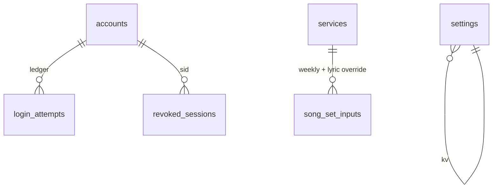
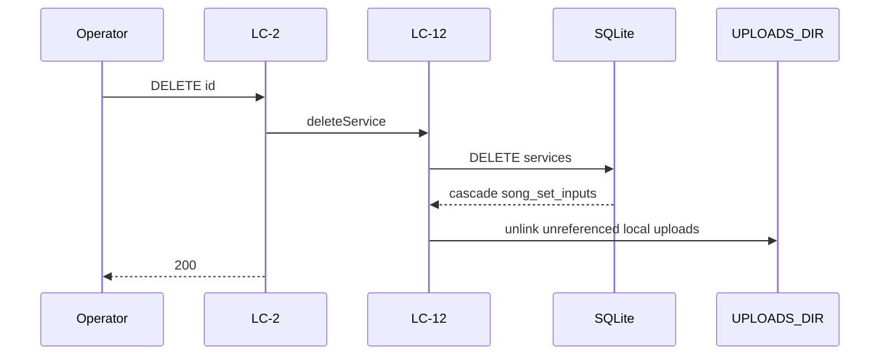
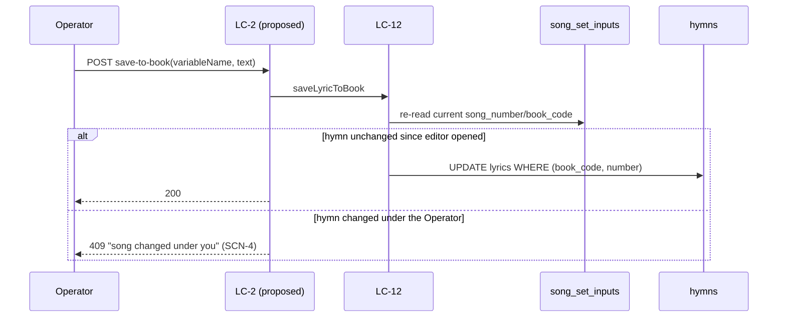
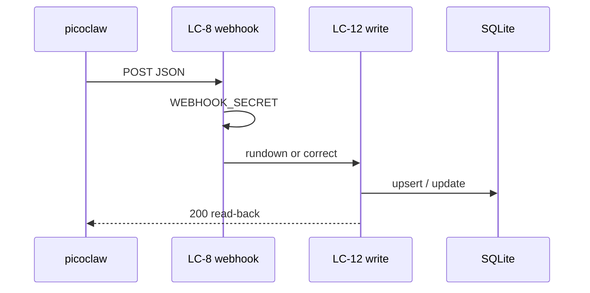

# SDD — Hub

> Generated by `.constitution/method/scripts/validate.py --generate`. MUST NOT be hand-edited.

This is what the owner reads at **G4 Component** for this component.

## What is staked

`mode: deep` · `risk_accepted: medium` · `g4_passed: True`

**risk_note:** congregation personal data in the Service payload and announcement list; Operator accounts

**owns:** `Service`, `Account`, `AppSetting`, `SongSetInput` · **containers:** `api`, `spa`, `pptx-worker`

## Decision Summary

Hub is the Operator SPA surface: Service list, form, Run-Sheet, generate/download PPTX, accounts, settings. This phase's intake is the Operator Hub form (`/services/new`, UC-2). `POST /api/webhook` / LC-8 remains on the Go API as last-phase CAP-11 intake (AD-3: JSON agnostic of picoclaw); it is as-built, not this phase's handover.

**DEC-004 (2026-08-20) narrows and grows Hub's form at once.** Announcement composition leaves Hub
entirely — the form only previews how the Registry's Announcement Sets expand (FR-3 retired). In its
place, two things the form did not do before: a Song Set group per Registry-configured entry, replacing
four hardcoded song fields (FR-32), and an inline per-entry lyric editor with a this-service-only
default and a separate explicit save-to-book action (FR-34) — the latter was blocked on a conflict with
AD-25, now closed by **DEC-005 / AD-36** (see `05-model/data-model.md` § *Resolved*). **Both have
shipped:** the bootstrap-once path landed first, as required, and the route is as-built at
`internal/httpapi/server.go:41` (`POST /api/services/{id}/song-sets/{variableName}/save-to-book`).

Two expensive choices reversed: (1) one authorization gate on the Go API plus a SQLite check per request (AD-5); (2) PPTX as the Sabbath guarantee, not the slideshow (AD-1).

## Structure — Logical Components

Rendered from `components.yaml`.

| id | Name | Type | Container |
| --- | --- | --- | --- |
| `LC-1` | Hub auth API | `—` | `api` |
| `LC-2` | Hub services API | `—` | `api` |
| `LC-3` | Hub announcements API | `—` | `api` |
| `LC-4` | Hub upload API | `—` | `api` |
| `LC-5` | Hub accounts API | `—` | `api` |
| `LC-6` | Hub settings API | `—` | `api` |
| `LC-7` | Hub hymns API | `—` | `api` |
| `LC-8` | Hub webhook API | `—` | `api` |
| `LC-12` | Hub rundown parse and service write | `—` | `api` |
| `LC-13` | Hub PPTX generate | `—` | `pptx-worker` |
| `LC-16` | Slide plan builder | `—` | `api` |

### Dependency direction and responsibilities

| LC | type | Responsibility |
| --- | --- | --- |
| LC-1 | gateway | login / logout / change password |
| LC-2 | gateway | Service CRUD, preview, PPTX, Sync Artifact, Song Set weekly inputs + lyric override (DEC-004) |
| ~~LC-3~~ | ~~gateway~~ | ~~announcement list~~ — **retired** (DEC-004, FR-3 retired); see `02-contracts/03-announcements.md` |
| LC-4 | gateway | upload and read images |
| LC-5 | gateway | Admin accounts |
| LC-6 | gateway | settings (transition, locale, default corpus) |
| LC-7 | gateway | search hymns |
| LC-8 | gateway | picoclaw webhook — CAP-11 later; as-built, still specified |
| LC-12 | service | parse Rundown + write Service |
| LC-13 | job | generate PPTX |
| LC-16 | service | `buildSlidePlan` (also used by Presenter) |

Direction: Hub screens → LC-1…LC-7 → LC-12…; picoclaw → LC-8 is later (CAP-11). All SQLite is in `web`.

Screens (`inventory-screen` 1–6) are not yet `LC` `ui-screen`: that is a `wdi-ux` slot, skipped at the owner's request.

## Inherited Constraints — the spine's invariants

Rendered from `ARCHITECTURE-SPINE.md`. A row marked **yes** binds this component by `Binds:`; the rest are shown so a miss in `Binds:` is visible, not hidden.

| id | Invariant | Binds this component | Prevents | Rule |
| --- | --- | --- | --- | --- |
| `AD-1` | Web Hub + Offline PPTX (Phase sequencing) [ADOPTED] | no | Dependency on venue internet during Sabbath services | Operators use a zero-install **Web Hub** for review/run-sheet. **Phase 1** presents on Sabbath from a downloadable offline **PPTX**. In-browser Web Slideshow / Presenter Mode are **shipped** (FR-15 / FR-16) but are **not** the hard offline Sabbath guarantee; PPTX download remains primary for venue reliability. A registry or layout change may not make Sabbath rendering depend on hub connectivity. |
| `AD-2` | Single Repository Monolith [ADOPTED] | no | Operational complexity and synchronization issues for a solo developer | The picoclaw skill integration logic, the Go API, the React SPA, and the Node PPTX worker reside in a single repository and deploy as a cohesive unit. Registry storage, the admin editor UI, and both renderers are part of that unit; there is no separate editor service. (Amended DEC-003: App Router is no longer the UI process.) |
| `AD-3` | Decoupled Ingestion and Presentation [ADOPTED] | no | Tightly coupled integrations that would make replacing the Telegram/Agent ingestion difficult | The API must expose a standard JSON interface for service generation that is agnostic to the input mechanism (Telegram/picoclaw). The presentation layer consumes this same API. Artifact templates are a presentation-layer concern; webhook/service intake JSON stays agnostic of layout templates. |
| `AD-4` | LiveServer durable paths (home PC production) [ADOPTED] | no | Ephemeral container-only data loss | Production is one always-on **Go API** process on host storage (`presenter.example.org` via Cloudflare Tunnel on LiveServer; `presenter-dev.bic.my.id` on a VPS via systemd for dev). That process ships the SPA static assets and includes a Node runtime **only** so the PPTX worker can be exec'd (AD-30). Host-durable paths for `DB_PATH`, PPTX cache, and `UPLOADS_DIR` (bind mounts or fixed host directories). Do not run multiple API processes against the same SQLite file. Operator details: `.constitution/project/deployment.md`. **First deploy happened on 2026-08-20**: `presenter-dev.bic.my.id` runs under systemd on the VPS and has been redeployed several times since. The production host (`presenter.example.org` above, a deliberate placeholder — the real production hostname MUST NOT enter this public repository) is still a 503 holding vhost with no process. This sentence read "As of 2026-07-30 no deployment exists" until 2026-08-22. That date is load-bearing rather than trivia — AD-18's total-replacement licence and AD-21's released-version freeze both hinge on *until first deploy* — so **the hinge has now tripped, and whether those two licences still apply is the owner's call, not a consequence to be inferred from this corrected date: OQ-50.** The anchor is stated here rather than inferred from this rule's tense. Announcement image refs are remote http(s) (SSRF-hardened) **or** hub-local `/api/uploads/<32-hex>.(jpg\|jpeg\|png\|gif\|webp)` resolved from disk for PPTX. Registry rows and per-service registry snapshots live in that same durable `DB_PATH`; editor image references resolve through the existing `UPLOADS_DIR` / allowlist rules, never new ad-hoc paths. (Amended DEC-003: the unit is no longer a Next.js standalone process. Docker Compose packaging was retired 2026-08-20 in favour of binary + systemd deploy.) |
| `AD-5` | Single request gate on the Go API [ADOPTED] | no | per-route authorization drift, and privilege that survives demotion, logout, or password change | The Go API has one request gate, and its path matcher **is** the authorization boundary — anything it does not match is served with no session check at all, so a new exclusion ships together with its assertion test in the same change set. The gate re-checks every session against SQLite (deleted account, role demotion, stale `token_version`, revoked `sid`) and **fails closed** if that lookup throws. Privileged routes additionally call `requireSession` / `requireAdminSession`; the cookie's `role` claim is never trusted alone. `/api/webhook` is gated by `WEBHOOK_SECRET` only — 503 when unset, 401 when wrong or missing — never by a cookie. Post-login `next` targets pass through `safeNextPath`. Every gated response carries `Cache-Control: private, no-store` and `Vary: Cookie`, because the hub is published through a Cloudflare Tunnel where an edge cache rule could otherwise serve a private response without the origin — and therefore without this gate — ever running. A signature-only check cannot see a deleted account, a demotion, or a revoked session; for one congregation on a home server the cost of a local SQLite read is accepted. The SPA has no session authority of its own. (Amended DEC-003: the gate is no longer `internal/gate`. As-built until the cutover wave still uses that file; the invariant is one matcher on the always-on API.) |
| `AD-6` | Optimistic concurrency on service edits [ADOPTED] | **yes** | an operator's edit silently erased by a late correction (last-write-wins) | every service mutation carries the client's `updated_at` as a precondition; a stale value is rejected with HTTP 409 and the client re-reads before retrying. No write path may bypass the precondition. This covers registry writes and the **Sync Artifact** action of AD-16 — the shipped shape is `expectedUpdatedAt` / `RegistryStaleError` in `src/lib/registry/store.ts`. |
| `AD-7` | `buildSlidePlan` is the only slide-order source [ADOPTED] | no | divergent slide order or content between what the operator controls and what the congregation sees | `buildSlidePlan` is the single source of slide order and content for every surface. No surface recomputes order from service fields or keeps its own ordering logic; a rendering or ordering change lands in the plan, never per-surface. AD-12's Fat Payload specializes this rule; AD-16 changes only where the plan reads its templates from, never that there is one order source. |
| `AD-8` | Image references resolve only through shared safety helpers [ADOPTED] | **yes** | a new surface reintroducing SSRF or unsafe content through its own laxer resolver | image references resolve only through the shared helpers in `src/lib` — allowlisted remote http(s) and hub-local `/api/uploads/<32-hex>.(jpg\|jpeg\|png\|gif\|webp)` for announcements, and registry `/assets/...` refs for Artifact templates. A new reference vocabulary extends an existing helper or adds one alongside them with the same fail-closed default; no unit ships an inline resolver. The canvas editor introduces no second resolver and admits no `data:` or arbitrary remote URI. |
| `AD-9` | Schema evolution through startup DDL only [ADOPTED] | no | two sources of schema truth between a developer machine and a fresh production container | schema changes go through the Go API's startup DDL when it opens SQLite. No migration framework (Prisma or otherwise) is introduced without an explicit product decision recorded in this spine. Registry tables are created on that same path. **The bootstrap path is shared, and the division is fixed:** this rule owns *schema* — the shape, e.g. adding a column — while **AD-18** owns *value* migration — the contents, e.g. rewriting every row's `base_type`. Neither licenses the other's mechanism: a value change is not a reason to add a framework, and a schema change is not a reason to rewrite data. (Amended DEC-003: not the Next.js `getDb` path.) |
| `AD-10` | One presenter sync channel, client-side only [ADOPTED] | no | a split sync topology where the projector follows one controller and ignores another | presenter↔projector sync goes through the single `@/lib/present-channel` `BroadcastChannel` module; no surface opens its own channel name or message shape. No server realtime channel (WebSocket/SSE) is introduced unless product direction changes — keeping the venue path independent of hub connectivity, per AD-1. A registry edit must not add a second channel to push template changes to a live projector. **Every message carries a plan identity** — a fingerprint of the snapshot and resolved announcement set that produced the deck — and a receiver whose own identity differs **refuses to follow the index** and says so on the room-facing screen rather than rendering a slide it cannot vouch for. Presenter and projector are two independent `force-dynamic` renders, each calling `buildSlidePlan` at its own moment, so a bare `index` silently means different slides on the two screens the instant anything structural changes underneath them; since this rule forbids a surface inventing its own message shape, the identity has to live in the shared shape. |
| `AD-11` | Artifact Registry Storage *(was `epic-16 AD-1`)* [ADOPTED] | no | Data loss on ephemeral container filesystems, file-lock concurrency issues, and a seeder that overwrites administrator edits or leaks private seed content. | The live Artifact Registry is stored in SQLite on the durable `DB_PATH` (AD-4). Filesystem JSON serves exclusively as a startup seed: startup inserts missing template IDs and **never** overwrites persisted administrator edits. Reset restores one selected template from that seed. The seed is two-layered — `data/local/default-registry.json` is git-ignored and **takes precedence over the shipped `data/default-registry.json` example whenever present**; a seeder that reads only the shipped example breaks the mechanism that keeps congregation data out of a public repository. |
| `AD-12` | Slide Plan Data Flow (Fat Payload) *(was `epic-16 AD-2`)* [ADOPTED] | **yes** | The Web (`SlideView`) and PPTX renderers from performing independent database lookups or maintaining their own diverging layout logic. | `buildSlidePlan` outputs a fully hydrated AST (Fat Payload) with exact rendering coordinates, fonts, colors, and resolved text content. Specializes AD-7: the plan is the single order *and* layout source, so a renderer never **reads data from** the registry itself. Importing a shared *helper* that happens to live under `src/lib/registry/` is not such a read — `pptx.ts` importing `isBundledAssetRef` from `registry/asset-safety` is the AD-8 resolver this spine requires, not a data path. |
| `AD-13` | Canvas State Boundary *(was `epic-16 AD-3`)* [ADOPTED] | no | Two-way data binding lag, stuttering drags, and unnecessary React re-renders. | The Canvas Editor uses an Uncontrolled Wrapper pattern. Fabric.js owns the canvas state exclusively; React reads it **only on save**, through `serializeCanvas` over `canvas.getObjects()`, projecting into the registry's own element schema. Not `canvas.toJSON()`: Fabric's serialization format is **not** `ArtifactLayout.elements`, so a second editor surface built on `toJSON()` would fail AD-15's validator on every write. The projection into the registry schema is the boundary, not the canvas library's own format. |
| `AD-14` | Global Template Administration *(was `epic-16 AD-4`)* [ADOPTED] | no | Per-service template drift and operator-level mutation of every service's visual contract. | Artifact templates are global across services. Registry management UI and APIs are admin-only and re-check the current account role from SQLite — a specialization of AD-5, not a separate authorization scheme. `/admin/artifacts` and `/api/admin/artifacts/**` are inside the AD-5 matcher, and adding a registry route outside it requires the same-change-set test update AD-5 demands. Downstream planners and renderers read the registry through server-side modules rather than the management API. |
| `AD-15` | Stable Layout Identity *(was `epic-16 AD-5`)* [ADOPTED] | no | Unit-specific renderer drift, required-placeholder deletion, and unsafe image references reaching a renderer through an unvalidated back door. | Layouts use a fixed 16:9 canvas with normalized percentage coordinates and stable template/layout/element/placeholder IDs. Coordinates may extend beyond the canvas to preserve intentional source-deck clipping. **Every** write into the registry is untrusted and must pass the same structural and image-reference validation before persistence — the canvas save API, the startup seeder, and any import or asset-extraction script alike. Image refs validate through the shared helper required by AD-8; no write path ships its own check. |
| `AD-16` | Service-Bound Registry Snapshot *(was `epic-16 AD-6`)* [ADOPTED] | no | a live registry edit shifting the structure under a service an operator is preparing right now, and a weekly value entered against one structure being orphaned by a later structural change — and, in the other direction, a service with no way to be brought up to date. | Creating a worship service **clones** the ordered live registry — order, kinds, labels, layouts, placeholder bindings, **and the administrator override records of AD-22** — into a **service-bound snapshot** on the durable `DB_PATH` (AD-4); creation is the only freeze event. The clone is of the *rendered* structure, so anything AD-22 keeps outside the layout travels with it; an override left out of the clone would either never reach the deck or reach it from outside the freeze, and both defeat this decision. A service's plan, Presenter, slideshow and PPTX read that snapshot; a live registry edit reaches an existing service **only** through the explicit **Sync Artifact** action, which replaces the snapshot destructively. Sync is permitted on **any** service, carries the service's `updated_at` precondition (AD-6), and may not alter the service's entered data (*State* convention) — "destructive" means it replaces the snapshot, never that it may overwrite a service someone else has moved underneath it. **Sync is a structural write and is therefore admin-only**, re-checking the role from SQLite exactly as AD-14 requires of every registry management surface, even though it is reached on a service route that `internal/gate` gates for any signed-in account; its route ships with the `tests/go-http-gate.test.mjs` assertion AD-5 demands and an in-route `requireAdminSession`. An operator may see that their snapshot is stale and *request* a sync; they may not perform one. Without this, "permitted on any service" and AD-14's surviving admin-only clause read as licence for an operator to freeze a half-authored layout into the service that presents in fourteen hours — this decision's own *Prevents*, arrived at from the other direction. The clone and the re-clone are write paths and validate under AD-15 like every other. **Announcement membership is not cloned:** the Announcements master list stays live and reaches an existing service at render time (CAP-7). **It is nonetheless scoped per service (`service_id`), matching the clone boundary everywhere else in this decision** — "not cloned" means this week's flyers may still change after the structure is frozen, never that one list is shared across services. The distinction is invisible while only one service is being prepared and decisive the moment two are open at once — a stale service reopened for a correction while next week's is being built — at which point an unscoped list bleeds one service's images onto another's deck. The shipped `announcement_items.service_id` is nullable, so both readings are currently expressible; this rule picks the scoped one. **A later structural change obliges nobody to keep an older snapshot renderable** — what the snapshot protects is the service's entered supporting data, not its ability to regenerate a past deck. The snapshot is the sequence *input*: `buildSlidePlan` remains the single source of order and layout (AD-7, AD-12), and no renderer reads a snapshot directly any more than it read the registry. **One bounded exception, stated as an exception rather than argued away — pre-existing services.** A service created *before* this model ships has no snapshot and renders from the live registry until its first Sync, which is a clone-in-place; from that moment the rule above governs it without qualification. So *"creation is the only freeze event"* holds for every service created under this decision, and the no-snapshot state is a **one-way migration path into** the decision rather than a second mode inside it: nothing may create a new service without a snapshot, and no code may re-enter the state once left. It is called out because every service in the database on day one is in it — `spec-artifact-registry-authoring/SPEC.md:89` assumed exactly this and an earlier draft of this rule forbade it, which would have left three stories free to answer it three ways. The Epic 20 data transition (AD-21) may instead clone a snapshot for every existing service and close the exception outright; that is the preferred landing, and either way the state is finite and dated. **Naming caution:** the shipped `RegistrySnapshot` type (`src/lib/artifacts/registry-snapshot.ts`) means *"the live-registry map assembled for one plan build"* — a different thing from this decision's per-service durable freeze, and the two must not be conflated. |
| `AD-17` | The Seed Is a Bootstrap, Not a Correction Channel *(was `epic-16 AD-7`)* [ADOPTED] | no | an administrator's delete, rename or reorder being silently undone by an unrelated restart. A deleted row leaves no evidence behind, so anything that supplies "missing" IDs cannot tell *deleted on purpose* from *never existed here* — it resurrects the row forever. | The seeder initialises data **from zero only** — first install, first run — and is gated by a marker in `settings`. It is never a gap-filler: after it has run, the administrator owns every row that exists, and the ordered registry is authored data rather than shipped data kept in sync. A gap in a database that already holds data travels as a versioned data migration (AD-18, AD-21), never as a re-seed. **The filesystem seed is read at exactly two moments — the first-boot bootstrap, and an explicit per-template Reset — and at no other.** In particular **no read path may substitute a seed template for a row the database does not hold, and none may substitute one for a row it holds but cannot parse.** An ordered registry of N rows produces a deck built from those N rows and no others; a template id the database does not hold does not exist, and a row whose payload will not validate **fails closed** — no layout, logged with the id and the reason, the same posture AD-5 and AD-8 already take. Both halves matter and the second is the easier one to leave open: `registry-snapshot.ts` **used to** substitute seed content in **one** loop for absent and corrupt rows alike (`parseRow` merely returned `null`, so a corrupt row reached that loop indistinguishable from a missing one), so a rule that closed only the *absent* case left shipped example content silently standing in for an administrator's real layout the moment one row was malformed. That loop is the hazard this Rule forbids; AD-11 records it closed 2026-08-07 (Story 20.1). Closing only the boot door is what let a deleted slide re-materialise into the deck on every plan build, with `rejected.delete(seed.id)` suppressing even the log line. `tests/registry-reseed.test.mjs`'s assertion that a missing row is re-inserted is **inverted, not deleted**, and a second assertion pins that a deleted row does not reappear in a built plan. Restoring shipped content stays possible as an **explicit administrator action** — Reset-from-seed per template, per AD-11 — never as a side effect of a restart, and never as a bulk re-seed of a live database. |
| `AD-18` | Vocabulary and Value Changes Travel as Explicit One-Time Migrations *(was `epic-16 AD-8`)* [ADOPTED] | no | a shipped vocabulary change reaching persisted rows through boot-time re-seed (which AD-17 removed) or not reaching them at all — and the opposite failure, a migration framework arriving by the back door. | AD-9 fixes *schema* evolution on the startup DDL path and is silent on **value** migration; this decision fills that silence rather than weakening it. A shipped change that must reach rows already persisted travels as an **explicit, one-time migration** on the startup path, versioned per AD-21. It is not a migration framework and AD-9's prohibition stands: no Prisma, no versioned migration directory, without an explicit product decision recorded in this spine. **Until first deploy** no production rows exist, so Epic 20's seven-`base_type`-to-three-kind collapse ships as a **total replacement** — no backward compatibility, no migration over live rows — folding into production data version 1 (AD-21); at first deploy that licence ends, and the same change would need a migration over live `artifact_templates` rows. A migration operates on the **live registry** and does **not** rewrite service snapshots — structure reaches an existing service only through Sync Artifact (AD-16), so a migration that rewrote snapshots would be a second structural channel. An older snapshot may therefore stop being renderable, which AD-16 accepts; what must survive is the **entered data**. |
| `AD-19` | A Cross-Boundary Key Is a Server-Owned Value the Administrator Cannot Edit *(was `epic-16 AD-9`)* | no | two independently-built units agreeing to disagree about a key — the registry surface and the worship-service settings form picking different handles for the same SongSet slot, and the canvas editor's insert list drifting from what the validator actually admits. | a key referenced across a boundary is **server-owned vocabulary, enforced on every write path**, and it is never administrator configuration. Three properties make it unambiguous rather than merely convenient: the key is **never administrator-editable**, **at most one registry row may carry each slot identity**, and it is a **semantic name, never an ordinal** (`songset1` re-imports the positional reading this decision exists to remove). The recognized set is **closed and complete** — `general`, the four `songset-*` slot identities, `announcement`: six keys over three kinds, and no write path admits a seventh; the Placeholder Catalog's admitted keys are the same class of value and get the same treatment AD-8 and AD-15 gave image references, so *"the UI cannot invent a catalog key"* (CAP-4) is a property of the registry rather than of one client. **The value a key names has exactly one persisted home** — for a slot binding that is the service's own entered data, and the identity is a *key into* it, never a second copy; otherwise a webhook correction (which AD-3 forbids knowing slot keys) rewrites one home while the settings surface owns the other, and the deck renders one hymn while the run sheet and the edit form show another, with no 409, no log, and no screen on which both values appear. A binding whose slot row has been deleted is **inert, not an error**, and the entered number survives in the service's own data. Reordering rows changes the presented sequence (CAP-8) without touching a binding, and renaming a label cannot touch one either. Every spelling here is a persisted binding key, so changing one later is the versioned data migration AD-18 and AD-21 govern, and extending the vocabulary — a fifth slot, a fourth kind — is a code-plus-tests change. |
| `AD-20` | The Planner Injects Nothing the Registry Did Not Ask For [ADOPTED] | no | a liturgical decision requiring a code change and a deploy, and the planner keeping a second, invisible source of deck content alongside the registry. | every slide in the deck originates from an ordered registry entry. `buildSlidePlan` **applies** rules; it does not **hold** them. Fixed liturgical content — the standing responses `#671` and `#684`, the closing *We Have This Hope* — is authored as **General** entries and edited by hand, never injected by the planner and never computed from the hymnal. Because a General generates no title slide, the `skipTitle` mechanism is **removed rather than migrated**: there is nothing left to suppress. It shipped at five sites and Story 20.1 deleted them — a removal, not a compatibility shim, and `slide-plan.test.mjs:231` greps the tree to keep it deleted. Changing or adding a liturgical song is a registry edit. |
| `AD-21` | Persisted Data Carries One Version Number, and Unreleased Transitions Compact Into One [ADOPTED] | no | two builders keying the same change incompatibly — one adding a per-change boolean, another bumping a counter — and a production database accumulating one transition per code change, so that its version history tracks development activity instead of releases. | All persisted data shares **one monotonic version number** in `settings` — one counter for the whole database, never one per table or per domain, so that "which version is production on" has a single answer. A change that must reach data already persisted is declared **explicitly while it is being coded**, as the transition from version *n* to *n+1*; it is never inferred at deploy time. **An unreleased transition is not yet history and may be rewritten:** the whole batch of unreleased transitions is compacted into a single transition before it reaches production, and developer databases are **reset** to the compacted version rather than migrated through the steps it replaces. **A released version is frozen** — once a version has reached production it is never renumbered, re-cut, or folded into another. Small steps are a development convenience and stop at the merge; production sees one transition per release. AD-17's seeding marker and this counter are **distinct**, and neither substitutes for the other: the marker records that bootstrap ran, the counter records which data version is persisted. This is a counter and a convention, not a framework: AD-9's prohibition stands. |
| `AD-22` | Authoring Authority Is Fixed per Kind: Free Canvas, Bounded Config, or Bound to a Set | no | the canvas editor and the validator disagreeing about what an administrator may author on a non-General entry — one opening a free canvas on a SongSet row and admitting an extra or rebound placeholder, the other refusing it — and CAP-3's *"General only"* living nowhere but in a capability statement. | authoring authority is fixed per kind, and no surface widens it. **`general` is free canvas:** the administrator composes it from anything, including Placeholder Catalog keys (AD-19). **A `songset-*` row gets a bounded configuration surface, not a canvas:** exactly two background images — one for its title layout, one for its lyric layout, which verse and refrain share — plus font style and font size. Both background references resolve through the shared helper AD-8 requires: this surface is not the canvas editor and introduces no second resolver of its own. Layout composition itself is developer-owned seed data and is not exposed there; it stays registry data hydrated into the plan (AD-11, AD-12), never a coordinate held by a renderer. **Administrator-configured values persist outside the layout**, as an **override record keyed by row and field**, re-applied over the developer layout at hydration: the layout JSON stays developer-owned in full and a migration may replace it wholesale, the override record stays administrator-owned in full and no migration, Reset, or re-seed writes it, and a bounded surface that writes *into* the layout is refused by the validator on every write path (AD-15). An earlier draft left the encoding as "a schema call, not an invariant" — an override record beside the layout *or* a marked field inside it. The two were never equally available: the shipped validator rejects unknown keys against a closed `ALLOWED_LAYOUT_KEYS`, so the in-layout marker cannot ship without a registry-contract change this decision does not authorise, leaving only the unmarked shape — background written straight into `layouts.*.backgroundImage`, font into element `style`, indistinguishable from developer output. Then this decision's own migration clause replaces those layouts and **every background and font size the administrator chose reverts to the shipped default, on all four slots, silently, before anyone opens the hub** — AD-11 keeps no second copy and Reset would discard them too, so the only record of them was the layout just overwritten. The row's placeholder set and its SDAH slot binding are server-defined: nothing may be added, removed or rebound, and the validator refuses it on every write path (AD-15). **An `announcement` row is bound to the Announcements master set**, whose membership is not registry-authored at all (AD-16, CAP-7). Only those two kinds **expand** — a SongSet row into its title and lyric slides, an `announcement` row into N full-bleed images; a General is one slide. Because AD-17 reads the seed once, a developer's later change to a SongSet layout reaches a deployed database only as a versioned data migration (AD-21) — never by restart, and not by Reset. **Reset restores the shipped *layout* and leaves the override record untouched**, which is the whole point of keeping the two apart: before the override record existed, Reset would have discarded the administrator's backgrounds and font sizes along with the layout, and there would have been nowhere to recover them from. A Reset that also cleared administrator configuration would need to say so and does not. |
| `AD-23` | Transition Style Is One Value, Described Once, Consumed Identically [ADOPTED] | no | a deck that fades in PowerPoint and cuts on the projector — the same slide sequence behaving differently on the two surfaces the congregation and the operator each watch | transition style is **one app-wide value** in `settings` (`slide_transition`), and each style is described **exactly once**, in `src/lib/transitions.ts`, carrying both its PowerPoint element and its browser animation parameters. Neither renderer holds either half: `pptx.ts` and the browser surfaces all import that table, and **no surface keeps a default of its own** — that, not immutability, is the invariant. The value reaches each surface directly from `settings`, never through the plan (`buildSlidePlan` has no transition concept at all). There is no per-service override. The presenter **may** override the style for the **live browser session**, and that override travels through AD-10's channel so presenter and projector never disagree with each other (`PresenterOperator.tsx`); a PPTX already generated keeps the `settings` value it was built with, because a downloaded file cannot be re-styled after the fact. Adding a style means adding a row in that one table — and only styles that survive a plain `<p:transition>` child without the `p14` extension namespace qualify, so nothing silently degrades to "no transition" when the deck is opened elsewhere. This ratifies a convention the code already states in its own header; it is recorded here because FR-7 (`prd.md:179-180`) makes it a requirement and `prd.md:304` states the cross-surface obligation in as many words — *"the browser transition matches the Deck's configured transition style (FR-7); the two are chosen once and never diverge"* and `docs/architecture.md:61` — a declared source of this spine — used to contradict it by hardcoding a crossfade. That source was reconciled on 2026-07-30 and now states the configured value and cites this `AD`, so the contradiction is closed; the decision stays because FR-7 still needs an owner and because two renderers plus two browser surfaces is exactly the shape that diverges without one. |
| `AD-24` | Operator Chrome State Is Browser-Local, and the Room-Facing Surface Is Closed to It [ADOPTED] | no | one hazard with three faces — a preference landing in `settings`, where it silently becomes *every* operator's, or a deck-affecting value landing in `localStorage`, where AD-4's durability, AD-6's concurrency and AD-18/AD-21's migration rules cannot reach it; the root client boundary migrating upward until the whole app is a client tree; and a client-persisted value that **paints** becoming a third structural channel to the congregation's screen, alongside `buildSlidePlan` (AD-7) and the BroadcastChannel (AD-10) | **application state reaches one of three homes and *who must agree on it* picks which.** **Persisted-shared** lives in SQLite on the durable `DB_PATH` (AD-4) as an app-wide `settings` value, the way AD-23 keeps `slide_transition` because both renderers and both screens must agree on it. **Persisted-local** lives in that browser's `localStorage` and nowhere else — not in SQLite, not under `DB_PATH`, and therefore **not backed up** — the way the theme does, because nothing but this operator's own eyes depends on it. **Ephemeral-shared** is not persisted at all and travels over AD-10's channel. The tiers are not interchangeable in either direction. **A chrome provider mounts only on the operator shell.** The SPA therefore has two sibling shells: the operator shell owns metadata, fonts, `ui_locale`, and theme; the projected shell owns the unchanged room-facing URLs and applies the five shell claims exactly: `html.backgroundColor = #000000`, `html.overflow = hidden`, `html.scrollbarGutter = auto`, `body.backgroundColor = #000000`, and `body.overflow = hidden`. It carries no operator provider or theme state. Projected not-found and error screens render generic `#000000`/`#FFFFFF`, vertically scrollable output with no operator link or detail. **The room-facing surface is closed to operator chrome, in any form, under any setting:** the projector, the web slideshow and the PPTX never read it. Every future browser page intended for congregation or OBS output belongs on the projected shell; putting one on the operator shell is an architectural violation, not a story-level placement choice. The projected render tree paints in **literal colours**, carrying no theme token and no theme-coloured edge; a full-screen room-facing client also claims the same shell through one per-document projected-shell helper as a hydrated defensive layer, never as the owner of first paint. The PPTX is closed *structurally* rather than by browser enforcement — it is generated by the worker from a plan the Go API already assembled and cannot read browser state at all. Registry payloads rendered by the projected tree still validate under AD-15; source-tree edits are governed by this closure gate, not by the registry validator. As-built: Vite SPA operator/projected branches plus `spa/projected.html`; `tests/theme-chrome.test.mjs` pins the two shells. |
| `AD-25` | A Shipped Reference Corpus Is a Projection of Its Committed File [ADOPTED] | no | two corpus families answering one architectural question two different ways — and, in the two directions that question fails, a corrected corpus that cannot reach the table at all, or one that reaches it and leaves the withdrawn rows standing | A **shipped reference corpus** — a committed data file the product carries so that a fresh clone resolves a verse and a hymn offline — is **developer-owned data with exactly one writer**, and the committed file is authoritative. Its tables are a **projection** of that file: startup reconciles each table to the corpora it ships, and the reconcile is **complete within the corpus code it names** — a row carrying that code and absent from the file is removed, and a row belonging to a sibling corpus is never touched. Whether startup detects a difference before doing the work — a per-corpus fingerprint, on the `artifact_templates.seed_hash` precedent — or simply reconciles every boot is a story-level call, bounded by the two properties this rule does fix: **a corrected corpus reaches the table with no operator step, and the table does not outlive the file.** That call is also where a growing corpus set is paid for, and the cost lands at **boot**: the first KJV seed writes 31,102 rows in ~258 ms, so reconciling several translations unconditionally on every start is the shape that turns a restart into a wait — on the morning AD-1 exists to protect. **Rebuilding rows is safe to consider, which is not obvious and was checked rather than assumed:** nothing anywhere references the surrogate `hymns.id` or `bible_verses.id` (grepped across `src/` and `tests/`, 2026-08-01), because a service persists a hymn *number* and a passage a *reference*. A reconcile may therefore delete and re-insert without dangling anything — and if that ever stops being true, this sentence is the one to come back to. This is a **third channel, and it is neither of the two it sits between.** It is not AD-17's bootstrap: a bootstrap runs once precisely because an administrator owns what comes after it, and nobody owns a corpus row. It is not AD-18/AD-21's value migration either: a migration exists to carry a change into values somebody persisted deliberately, and every value here is derived from a file already in the commit. AD-9 still owns the **shape** of these tables and AD-18 still owns **value** migration everywhere else; what this decision claims is narrower than it may look — a table whose entire content is derived from a committed file has no values of its own to migrate. **One consequence to take rather than rediscover: a rename inside a projected table is a rebuild, not a migration**, which is what makes AD-26's three renames cheap. **The closure is what makes all of this safe, and it is a property of today's code rather than a promise.** No administrator or operator write path into a corpus table exists — verified 2026-08-01, zero `INSERT` / `UPDATE` / `DELETE` against `hymns`, `bible_verses` or `bible_books` anywhere outside `src/lib/db/index.ts`. **Adding one reopens this decision before it ships**, because from that moment the reconcile is exactly the resurrection AD-17 forbids and a corpus becomes authored data carrying AD-17's, AD-6's and AD-21's obligations in full. A corpus row is therefore never where a choice is persisted; a choice *about* a corpus — which one is the default — is a `settings` value under AD-24, keyed by the corpus code AD-26 fixes. **Where it runs on the `getDb` path:** after data migrations, so a migration never observes rows the reconcile wrote in the same boot — AD-21's own reasoning for placing the bootstrap last, applied to a fourth step AD-21 could not have named. Its order relative to AD-17's bootstrap is free, because the two touch disjoint tables; that is stated so the fixed sequence in AD-21 is not read as forbidding a fourth step. |
| `AD-26` | A Corpus Is a Registered Entity: Its Code Is the Key, Its Locale Is an Attribute | no | one corpus code meaning two different books depending on which locale directory it was found in — and the mirror failure, a locale reaching a `WHERE` clause and quietly turning a view default into a data filter | Every installed corpus is a **registered entity** — one row in `bible_translations` or `song_books`, carrying its code, display name, **locale**, licence and provenance. **The corpus code is globally unique across locales, and it is the cross-boundary key**: the class of value AD-19 governs, server-owned and never administrator-editable. `bible_verses.translation_code`, `hymns.song_book_code`, `default_bible_translation`, `default_song_book` and the corpus filename all carry that one code. **Locale is an attribute of the corpus, never part of a key and never part of a lookup.** That is what makes FR-24's never-filter rule **structural rather than disciplinary**: because no key contains a locale, no read path can *need* one, so a `WHERE locale = …` on a corpus lookup is not merely a product violation but a predicate that cannot be necessary. A listing endpoint returns every installed corpus with its locale; `default_data_locale` decides only what a picker opens on. **The file declares; the path merely locates — for the bible family, in full, and for a song book, only up to and including its bootstrap.** A registry row is derived from the corpus file's own declared metadata under AD-25, never from its directory — the loader already refuses a file whose declared code disagrees with the code it was loaded as (`src/lib/corpus.ts:91`, `:176`), and it refuses on the same terms a file whose declared locale disagrees with the directory holding it. Without that second check, copying `data/en/song-book/sdah.json` to `data/id/` gives one code two locales and the registry keeps whichever booted last. **Superseded by AD-36 (2026-08-20, DEC-005), for the `song_books` row and that row alone, the moment its one-time bootstrap has run:** ~~"a registry row is derived from the corpus file's own declared metadata"~~ stops being true of an installed song book — AD-36 makes that row administrator-owned data from bootstrap onward, so a later edit to the committed file's declared name, locale, licence or provenance no longer reaches it at all, and correcting it live is an explicit numbered migration, never a re-derivation on the next boot. Both refusal checks in this paragraph — code-disagreement and locale-disagreement — still gate the bootstrap itself and are untouched; what dies is only the promise that the row keeps tracking the file **after** that bootstrap. **Neither refusal check has anything to gate for an admin-created book (AD-36 Extended):** there is no file and no directory, so "a file whose declared locale disagrees with the directory holding it" has no subject to refuse — the check is inapplicable, not silently passed, because that row's bootstrap never reads a file at all. That row still carries this rule's full shape intact — code, name, **locale**, licence, provenance, the same five fields as any other song book — sourced from the Admin at creation instead of a file's declared metadata; AD-36's Extended clause (OQ-39 closed, 2026-08-20 owner ruling) states that positively, closing the gap this supersession sentence left open rather than leaving the remaining three fields — locale, licence, provenance — an open hole for the admin-created case (`book_code` and name are already Admin-supplied at creation; only those three were ever in question). `bible_translations` carries no such carve-out: for the bible family this sentence, and the two refusal checks, hold exactly as written, on every boot, with no qualification. **The declared field is spelled `locale`**, matching the path segment, the settings keys and this rule; both committed files ship it as `language` today and are corrected in the same change set, because a persisted cross-boundary key gets one spelling chosen once (AD-19) and the files are the source of record, so it is free now and a migration later. **The renames belong to this decision rather than to housekeeping:** `bible_verses.translation` → `translation_code`, and `hymns.book_code` → `song_book_code` because `book_code` names a *song* book in one table while `bible_books` makes *book* mean a Bible book in another — one word, two entities, ambiguous the moment one person reads both families. `isKjvCorpusEmpty()` → `isBibleTranslationEmpty(code)` is the same rule reaching a function signature: **no corpus code survives as a literal in a read path.** All three are rebuilds rather than migrations, per AD-25. **Terminology is fixed, and it stops deliberately at one place:** *bible-translation* and *song-book* are the container terms in paths, tables and prose, while **`hymn` stays the entry term** — the `hymns` table, `/api/hymns`, and the `resolvedHymns` / `failedHymnNumbers` webhook fields keep their names, that last pair being an external contract an outside caller owns and AD-3 keeps agnostic. |
| `AD-27` | Book Identity Is Canonical and Translation-Independent; Every Name Belongs to a Translation | no | one table with two owners — the last translation seeded renaming every book for every reader — and *"the same passage in another translation"* ceasing to be one query | A book has **one canonical identity, stable across every translation, carrying no display text at all.** Every name and short name **belongs to a translation** and is stored against it. `bible_verses.book_id` points at the identity, which is what keeps a passage one lookup in any translation and lets a translation be added or removed without touching a verse's identity. **A corpus file maps its books onto that identity; it does not define it.** The canonical set is fixed by the application, and a corpus naming a book the canon does not hold is **refused, with the book named** — the fail-closed posture AD-5, AD-8 and AD-17 already take, chosen over a silent partial import because a translation missing four books resolves nothing for them while saying nothing about why. **Two consequences, stated rather than left to be discovered.** The canon that ships is the 66-book Protestant one, so a translation carrying deuterocanonical books is refused rather than truncated, and admitting one is a code-plus-migration change (AD-18, AD-21) rather than dropping a file into `data/`. And **input tolerance is the matcher's concern, never the corpus's**: a translation owns its *names*, while how forgivingly an operator's typing is compared against them — case, punctuation, abbreviation, singular against plural — is the matcher's. The two collapse easily and the collapse is one-way: the moment a corpus file is where an alias goes, names are corpus-owned in name only, and every translation added afterwards inherits the job of listing every way somebody might type its books. **Two things this clause originally said are superseded by AD-28 (2026-08-01), and they are struck here rather than quietly edited out, because this decision is unbuilt — which is exactly the condition under which a half-reversed rule reads as a whole one.** It said the matcher was ~~one server-side matcher **shared by every translation**~~; it is one implementation carrying a **scope**, and on an operator surface that scope is the chosen translation alone. And it treated the four kinds of tolerance as uniform; ~~abbreviation~~ is not — it carries a language and is scoped to a translation, while the other three do not. **The prohibition itself is untouched and AD-28 rests on it:** an alias still never lives in a corpus file. |
| `AD-28` | The Reference Matcher Is One Implementation Carrying a Scope, and Tolerance Carries a Language | no | cross-language input returning **through the matcher** once the corpus door is shut — and the mirror failure, the operator surface and the rundown drifting into two resolution rules because their scopes differ | there is **one matcher implementation and the scope is an argument to it, never a fork**. On an **operator surface** the scope is the **chosen translation alone**; on the **rundown** it is **every installed translation**, because a Telegram sender picks none. That scope is a **required, registry-validated corpus code supplied per request** — an unrecognised or absent one is **refused**, and *all-installed* is a property of the rundown surface and never a fallback, because a default silently reinstates the cross-language operator input this decision removes. It is a per-request parameter rather than the `settings` default, since FR-24's never-filter rule lets an operator browse a corpus outside the default locale. **Tolerance that carries a language is scoped with it:** case, punctuation and singular-against-plural are comparison rules owned by the matcher and unscoped, while a **non-prefix alias belongs to a translation** and is **matcher-owned data keyed by translation code, never a corpus-file field** — which is how AD-27's prohibition and this decision's finding hold at once rather than trading off. Resolution compares against **corpus-supplied names** rather than a regex guessing where a book name ends, and an **ambiguous reference is unmapped input (NFR-5), never a guess** — the fail-closed posture AD-5, AD-8, AD-17, AD-25 and AD-27 already take, and it belongs with them because a guess here is silent and reaches the congregation's screen mid-service. Ambiguity is **not scoped to the cross-translation case**: it is measurably intra-translation on the single corpus shipping today, so a builder reading a cross-translation-only rule in a single-corpus install would reasonably take the first match, which is the mis-split this clause exists to prevent. |
| `AD-29` | The Projector Reports Its Own Liveness and Nothing Else, and One Predicate Decides It [ADOPTED] | no | the reverse direction on AD-10's channel becoming a second controller — a projector whose messages the presenter *follows* rather than merely observes — and the mirror failure, two liveness mechanisms with two verdicts, so the operator's surface reports *lost* while acknowledgements are arriving, or *live* while the window is shut, with nothing saying which was authoritative | a projector→presenter message may report **the sender's own condition and nothing else, ever** — the moment one carries a value the presenter would adopt, the projector is a second controller and AD-10's *Prevents* is live again. The observing side is bound the same way: receiving one may move the **liveness verdict** and nothing else. Exactly **one** acknowledgement variant exists, in `@/lib/present-channel` and nowhere else; it carries **no shared state of any kind**, which is what puts it outside that file's header contract rather than in tension with it, and it is **idempotent by construction**, so no sequence number or request/response pairing may be layered over it. The **projector window is its only sender** — admitting a second is a new decision, not an implementation choice, because a state-free message cannot say for itself who sent it and a slideshow tab answering would report a live projector while the second screen is dark. **Liveness is one predicate:** the verdict lives in one evaluator and every signal — the acknowledgement, the retained handle's `closed` read, and any later `pagehide`, `visibilitychange` or second handle — is an **input to it**; a second holder of liveness state is a defect however it is spelled. Its precedence is **asymmetric on purpose**: an acknowledgement is authoritative for `live` whatever the handle says, a handle reading `closed` is authoritative for `lost` immediately without waiting out the freshness window, **neither is authoritative for the other**, and a `null` or stale handle is **no information** rather than evidence of death. Where the predicate cannot be certain it resolves to **`lost`**, because a false `live` is unrecoverable within the service while a false `lost` self-clears on the next acknowledgement — and *no evidence yet* stays a **distinct verdict** from *evidence stopped*, so a presenter opened without a projector is silent rather than alarmed. The heartbeat interval and the freshness window are **one pair, exported once from the evaluator's own module and consumed by both windows**, because two units each picking an honest number independently is exactly how a healthy second screen gets reported dead for the rest of a service. |
| `AD-30` | Process roles: Go API, React SPA, on-demand PPTX worker [ADOPTED] | no | a Node.js HTTP server remaining resident in production (the Next.js shape); the PPTX worker opening SQLite or assembling a plan; the SPA talking to SQLite | The Go API is the only always-on server: it owns SQLite, assembles the slide plan, and serves JSON (and, in production, the SPA files). The Operator UI and projector are a React SPA that MUST NOT open SQLite. PptxGenJS runs only as an on-demand Node child that receives an already-finished plan, draws PPTX, and exits; it MUST NOT stay up and MUST NOT open SQLite. Development MAY use a SPA bundler and MAY invoke PptxGenJS the same way; it MUST NOT keep a Node application server as the live API. (DEC-003) |
| `AD-31` | Song Set Entries Are Admin-Authored Data; Announcement Sets Are Admin-Authored Nested Lists *(DEC-004, supersedes AD-19 in part)* | no | a liturgical or administrative headcount — how many songs this week, how many announcement blocks — requiring a code change and a deploy. The same shape of concern AD-20 raises for the *choice* of song, applied here to song-set and announcement *count*. | A main-spine row is now one of exactly two remaining server-owned kinds — `general` or a **Song Set entry** — plus an `ann-set` marker that splices in an Announcement Set. `general` keeps AD-19's closed, non-editable treatment exactly as written. A Song Set entry's `variable_name` and title **are** Admin-authored (FR-29): Admin adds, renames, and removes entries directly in the Registry, and a Service with more than four songs is a normal shape the Registry accepts, not a limit worked around. An **Announcement Set** is its own Admin-authored ordered list of General slides (0..N per Registry) — not a fixed kind of main-spine row at all; the spine carries only a marker referencing it. AD-19's uniqueness rule survives in a new shape: at most one live main-spine row may carry a given Song Set `variable_name`, enforced on the write path exactly as AD-19 enforced slot uniqueness — never by a column constraint. |
| `AD-32` | A Predefined Field Is an Inline Token Inside Authored Text, Never a Whole-Element Binding *(DEC-004, supersedes AD-19 in part)* | no | a design that can only ever mix fixed prose and weekly content by giving the fixed prose its own separate element — `"Family: {family_name}"` could not previously be one styled line. | A text Predefined Field is a `{key}` token mixed into one text element's own content, styled once per element — no per-token styling inside the same box. An image Predefined Field keeps its own geometry box exactly as AD-19 already had it; only the text case changes. Hydrate substitutes catalog values into the token positions. An unrecognised token renders as empty text and never blocks generation (FR-30); the editor flags it only when the slide is saved, not at generate time. |
| `AD-33` | Song Set Layouts Are a Free-Canvas Trio; an Announcement Set Splices Its Own Registry List *(DEC-004, supersedes AD-22 in part)* | no | the editor and the validator disagreeing about authoring authority on a non-General entry — the same hazard AD-22 named, restated for the model this decision ships. | Every Song Set entry, however many exist, shares one authored trio: **Title** is a free canvas with its own background, the same authority as `general`. **Verse** and **Reff** are free canvases too, but authored on a **blank** canvas — no background is chosen at authoring time; background resolves at hydrate/live time through AD-34's order. Because the bounded configuration surface and its AD-22 override record (kept outside the layout so Reset would not discard an administrator's chosen backgrounds and font size) no longer exist for Song Set — the layout **is** the canvas now, the same as a General — that whole mechanism retires with this decision: Reset on a Song Set layout behaves exactly as Reset on a General, with nothing held outside it to preserve. An **Announcement Set** is its own ordered sequence of `general`-kind slides, held only in the Registry; the main-spine `ann-set` marker that splices it in at its position is not itself a canvas, and it does not expand a Hub-owned master list the way AD-22 described. |
| `AD-34` | A Live Background Choice Is a Presenter-Session Override, Never Persisted *(DEC-004)* | no | a live convenience quietly becoming a second structural channel to the congregation's screen — the same hazard AD-10 and AD-24 already name for other surfaces — and a background choice that a Sync, or next week's Deck, silently cannot see reverting without anyone deciding it should. | FR-33 lets the Operator change the background of the projected Verse/Reff slide during a live service. The precedent is AD-23, which already lets the presenter override `slide_transition` for the live browser session only, over AD-10's channel, without touching `settings` or a PPTX already built. A live background choice follows the same shape: it travels over AD-10's channel carrying the same plan-identity discipline, is visible immediately on the projector, and touches neither the Service payload nor the Registry nor any table. It does not survive past that session — the next generate, and any Sync, resolves the background through AD-33's normal order (the entry's own weekly choice → the Admin-set global default → blank) exactly as if the live override had never happened. Ownership follows Supplement S11: Admin owns the Background Library and its global default; the Operator owns the moment. |
| `AD-35` | Announcement Sets Are Structural Spine Rows and Are Cloned, Not a Live Membership List *(DEC-004, supersedes AD-16 in part)* | no | the same hazard AD-16 named for the old Announcements master list — a live edit shifting structure under a Service being prepared right now — now applying to Announcement Sets; and the opposite failure, a snapshot that silently drops which sets a Service was actually built against. | An Announcement Set and the `ann-set` marker referencing it on the main spine are structural rows exactly like every General and Song Set row, so they follow AD-16's general rule without exception: **creating a Service clones the whole spliced structure** — the main spine plus every Announcement Set it references — into the service-bound snapshot, and only Sync Artifact replaces it thereafter. There is no separate, unscoped, live-reaching membership list any more. |
| `AD-36` | The Song Book Is Administrator-Owned Data After a One-Time Bootstrap *(DEC-005, supersedes AD-25 in part)* | no | an operator's saved lyric correction (UC-28) being silently discarded on the next restart because the boot path re-applies the shipped file over it — the exact hazard a projection model creates the moment a write path into the projected table exists — and, in the other direction, a song book that never installs on a fresh clone because nothing seeds it once the reconcile is gone. The same hazard, restated for the registry row: an administrator's correction to a song book's display name (fixing a human error in the committed file's declared metadata) silently reverting on the next boot because the registry row is still re-derived from the file. | A song book's rows in `hymns`, **and its own row in `song_books`, are bootstrapped once, from the committed corpus file, and are administrator-owned data from that moment on** — the same posture AD-17 already holds for the Artifact Registry, extended here to a second table family, and to that family's registry entity as well as its content. The bootstrap runs **per song-book code**, gated by a marker (parallel to AD-17's registry marker) recording that this `book_code` has been seeded; in one transaction it inserts every hymn the file declares that the table does not yet hold **and** writes the `song_books` row from the file's declared metadata (name, locale, licence, provenance — the same fields AD-26 lists), and thereafter **never overwrites either** — not a `hymns` row that already exists, whether its current text came from the original seed or from an administrator's later "Save to Song Book" write (UC-28), and not the `song_books` row's fields, whether they still read as seeded or an Admin has since corrected the book's name. Installing a **new** song book — a corpus file for a `book_code` never seen before — still requires no operator step: the bootstrap fires the first time that code is encountered, seeding every hymn row and the one registry row together, exactly as a fresh clone seeds all 695 SDAH hymns and their book's registry entry today. **A gap is never filled by re-reading the file** once a book is bootstrapped: a deleted hymn stays deleted, a corrected book name is never reverted to the file's spelling, and a row the file no longer contains is not resurrected, per AD-17's rule applied to this table and its registry row alike. **A corpus-level correction to an already-installed book — content or its registry metadata — reaches a live database only as an explicit, numbered data migration** under the single `data_version` counter (AD-18, AD-21) — never as a boot-time reconcile and never a second counter. **Deleting a song book's rows, or its registry row, from a live database is an explicit administrator action or a numbered migration, never a side effect of the corpus file disappearing** — there is no reconcile left to notice the file is gone, for either. The "Save to Song Book" write path (UC-28 alternate flow) carries AD-6's precondition discipline: it re-reads the entry's current resolved `(book_code, number)` at the moment of the write and refuses (409) if it has moved since the editor opened (SCN-4). A future "correct this book's name" write path would carry the same discipline, though none ships yet (see *Deferred*). |
| `AD-37` | A remote control device is an input to the presenter, never a second controller *(DEC-006)* [ADOPTED] | no | two things, and the second is the one that would be discovered on a Sabbath rather than in review. First, the projector following two controllers — the failure AD-10's own *Prevents* names and AD-29 guards, which a device that talked to the projector directly would reintroduce. Second, and worse: **the venue path acquiring a dependency on connectivity.** A room screen that stops following the laptop because a phone lost signal, or because the hub is unreachable, has traded the product's offline guarantee for a convenience. | A remote control device sends **intents to the presenting client**, and the presenting client remains the **only** sender the projector follows. The remote never joins AD-10's presenter channel, mints no new message variant — the intent vocabulary already exists: index (inside `sync`), `blank`, `transition`, `background`, `scripture`, `clear-scripture` — and holds no authority the presenter must adopt. **The laptop-to-projector path MUST keep working with the remote closed, asleep, or off the network**, which is the boundary the whole decision is bounded by: a design that puts the server in that path has not implemented AD-37, it has replaced it. Reaching a presenting client is a **deliberate act, not a consequence of authentication**: a signed-in Operator elsewhere MUST NOT be able to drive a screen they did not connect to, so the selection is its own step and AD-5's matcher gates every path it needs with the assertion test in the same change set. Liveness of the remote is **not** liveness of the projector — AD-29 owns that predicate, exactly one acknowledgement variant exists for it, and a remote's silence MUST NOT move it in either direction. |
| `AD-38` | Unified Artifact Canvas Authoring and Direct Spine Composition *(DEC-008)* [ADOPTED] | no | (1) Structural deck sequencing fragmented across multiple disparate screens with arbitrary `spine_position` numerical inputs; (2) Inability to place dynamic items (such as a song or an announcement block) in multiple positions across a single presentation; (3) Slow and frustrating slide authoring caused by external textareas, hidden layer controls, placeholder image rendering, and missing background selectors. | 1. **Direct Main Spine Composition:** The main spine is the single authoritative deck sequencer. Slides (General, dynamic Song Set entries, and dynamic Announcement Sets) are added via the "New Slide" dropdown selector and reordered directly in place. Multiple insertions of the same Song Set or Announcement Set are explicitly supported; each placement generates a distinct spine node (`artifact_templates` row) referencing the underlying slot or set. Fixed single-number `spine_position` fields are retired. |

## Failure Behaviour

Hub does not retry a failed call; the Operator (or picoclaw) must press again. Process timeout is the Go API default — [ASSUMED], never read as a number. The `route.ts` files that phrase once referred to are gone: DEC-003 retired the Next.js shape and the operator UI is a Vite SPA under `spa/` with shared modules in `src/`. The one named timeout is `POST /api/upload/from-url`: `REMOTE_IMAGE_TIMEOUT_MS = 8000` in `src/lib/remote-image.ts`.

This phase's create boundary is `/services/new` (UC-2). `POST /api/webhook` is as-built CAP-11 later; do not treat it as this phase's handover.

Every Hub-owned row in `.how/_platform/inventory-api.md` — **24 rows** after the 2026-08-22 refresh
(commit `0b24d5e`) — plus `inventory-screen.md` 1–6. Rows 10–14 (`/api/announcements*`) are retired
(DEC-004, FR-3) and now sit in that file's `## Retired` section. Save-to-book is **numbered 67**; the
separate Song Set PUT this design proposed was never built (see its row below).

| Boundary | Slow | Absent | Lying | What the user sees | What is logged |
| --- | --- | --- | --- | --- | --- |
| POST `/api/auth/login` | Browser waits until the process default | 500 `{ error: Internal Server Error }` | Wrong user/password → 401 same `Invalid username or password`; lockout → 429 + `Retry-After`; short `AUTH_SECRET` → 503 | Sign-in form: failed credentials, wait message, or host-not-ready | 500: `Login error:` (`internal/httpapi`). 503: `AUTH_SECRET is missing or shorter than 16 characters`. 401/429: not logged |
| POST `/api/auth/logout` | Browser waits | Revocation write fails → 500 `Logout failed`; cookie **kept** so the browser is still signed in | Already signed out: still 200/303 and cookie cleared | JSON `{ ok: true }` or redirect to `/login`. On 500: still on Hub, still signed in | `Logout revocation failed:` (`internal/httpapi`) |
| POST `/api/auth/change-password` | Browser waits | 500 `{ error }` | Wrong current password → 401 `Current password is incorrect`; lockout → 429 + `Retry-After`; no session → 401 from gate | Form shows that message; password hash unchanged | `Password change error:` on 500 (`internal/httpapi`) |
| GET `/api/services` | List JSON delayed | 500 `{ error: Internal Server Error }` | Search `q` is a substring filter; a corrupt row still appears in the list | Hub list spinner then rows, or a failed fetch — not a silent empty Hub pretending there are no Services | `Error listing services:` (`internal/httpapi`) |
| POST `/api/services` | Timeout; a 201 retry may already have inserted | 500 | No date / empty paste → 400, no row (OQ-21). Same date without `allowSecond` → 409 + `existingId` (OQ-8). Unparseable body **with** a date → 201 and `failedHymnNumbers` (NFR-5, OQ-22) | Form: miss named, or existing Service offered, or incomplete Service saved | `Error creating service:` on 500. 400/409: not logged |
| PUT `/api/services/[id]` | Timeout; no write if the gate already 401'd | Row gone → 404 `Service not found` (UC-7; do not recreate, OQ-23) | Stale `updated_at` → 409, no write (BR-4). Bad id → 400 | Run-Sheet: conflict alert then refresh; gone → not-found page after refresh; session expiry → 401, fields not stored | `Error updating service:` on 500. 409/404: not logged |
| DELETE `/api/services/[id]` | Timeout; a successful delete already unlinked files | 404 `Service not found` | Bad id → 400. Session expiry → 401 **before** the handler; no partial write (OQ-23) | Confirm dialog then list without the row, or `Error deleting service` alert | `Error deleting service:` on 500 (`internal/httpapi`). Unlink misses: `Error unlinking service upload:` (`src/lib/services/queries.ts`) |
| GET `/api/services/[id]/pptx` | Generate waits (UC-6 / UC-18); does **not** edit the Service (OQ-20) | 404 `Service not found or not parsed` | Corrupt `parsed_data` → 500 `Corrupt parsed data`. Bad id → 400 | Browser download fails; Sabbath keeps any earlier cached file | `Error generating PPTX:` on 500. Cache write miss: `PPTX cache write/cleanup failed:` (`internal/httpapi`) |
| POST `/api/services/preview` | Plan build waits; no Service write (OQ-20) | 500 | No date / empty `raw_payload` → 400. Bad image URL → 400 | Preview pane empty or last good preview; form not saved | `Error generating preview:` (`internal/httpapi`) |
| ~~GET/POST/PUT/PATCH/DELETE `/api/announcements*`~~ | — | — | — | **Retired** (DEC-004, FR-3). See `02-contracts/03-announcements.md`. | — |
| ~~PUT `/api/services/[id]/song-sets`~~ (**never built** — the weekly inputs ride the Service mutation instead: `internal/httpapi/services.go:207` upserts `song_set_inputs` inside the create/update path, so AD-6's precondition is the Service's own `updated_at` and there is no second token. The row is kept because this design predicted a separate endpoint and the build chose otherwise) | Timeout; retry may double-apply an upsert (idempotent by `(service_id, variable_name)` PK) | 500 | Unknown `variableName` written anyway (inert row, AD-19/AD-31 posture) — no 400 for that case; same posture for a `songBookCode` naming a book no longer in `song_books` (written anyway, inert, resolved at render time per `05-model/form-fields.md`); bad song number format → 400 | Form: song/book/background stays as last saved on failure | `Error updating song set inputs:` (proposed logging site) |
| POST `/api/services/[id]/song-sets/[variableName]/save-to-book` (**as-built**, platform row 67; `internal/httpapi/server.go:41`. Its precondition held: the AD-36 bootstrap-once path landed first) | Timeout; a successful write already landed in `hymns` | 500 | Hymn moved under the Operator → 409 (SCN-4); no resolvable hymn → 400 | Editor shows the conflict or the failure; the Service's own override is unaffected either way | `Error saving lyric to song book:` (proposed logging site) |
| POST `/api/upload` | Large file waits | Disk fail → 500 `Failed to upload image` | No file / not an image / bad ext → 400 | Upload widget shows failed; no new ref | `Upload error:` (`internal/httpapi`) |
| POST `/api/upload/from-url` | Aborts at 8000 ms → 504 `That host took too long to answer.` | Unreachable / HTTP error / empty → 502 with that host message | Allowlist/SSRF/malformed/redirect/not-an-image → 400; too large → 413 | Fetch failed with that sentence; no new ref | `Image fetch refused (reason) for <url>:` (`internal/httpapi`) |
| GET `/api/uploads/[filename]` | File read waits | Missing file or unresolved name → 404 `Not Found` | Name that is not a local upload ref → 404 (resolver refuses) | Broken image in Hub / PPTX | nothing on 404 (`internal/httpapi`) |
| GET `/api/hymns` | Search waits | 500 | Malformed `limit` / `numbers` tokens ignored; empty `q` returns the first page, not 400 | Picker: no rows, or a page of the index | `Error searching hymns:` on 500 (`internal/httpapi`). Empty corpus: 200 `{ hymns: [] }` |
| GET `/api/admin/accounts` | List waits | 500 | Not Admin → 403 `Forbidden` (gate or `requireAdminSession`) | Admin page forbidden or failed load | `Error listing accounts:` on 500 (`internal/httpapi`) |
| POST `/api/admin/accounts` | Timeout | 500 | Duplicate username / bad role / empty password → 400; not Admin → 403 | Form keeps the typed values; no new account | `Error creating account:` on 500 |
| PATCH `/api/admin/accounts/[id]` | Timeout | 404 via client message | Last admin demote refused → 400; bad id → 400; not Admin → 403 | Message on the form; row unchanged | `Error updating account:` on 500 (`internal/httpapi`) |
| DELETE `/api/admin/accounts/[id]` | Timeout | 404 | Last admin delete refused → 400 | Account remains if refused; gone if 200 | `Error deleting account:` on 500 |
| GET `/api/admin/settings` | Read waits | 500 if settings helpers throw | Not Admin → 403 | Previous chrome language / transition stay on screen | helper `console.error` in `src/lib/settings.ts` if a read throws |
| PUT `/api/admin/settings` | Timeout | 500 | Unknown transition / locale → 400; `pptx_retention_days` present and not a non-negative integer → 400; not Admin → 403. Keys written: `pptx_retention_days`, `slide_transition`, `ui_locale` | Previous settings remain | `Error updating settings:` (`internal/httpapi`) |
| POST `/api/webhook` | Timeout is on picoclaw; Hub does not retry | Secret unset → 503. Agent down: Hub silent | Wrong secret → 401 (secret not logged). Bad JSON → 400. Specified: no date → no row (OQ-21); images attach or fail visibly (OQ-22) | CAP-11 later: Events get no read-back. Operator sees Hub. Not this phase's handover | `Error processing webhook:` on 500 (`internal/httpapi`). Does not log the secret |
| `/login` | Waits on POST login | Login API 500 → form error | Wrong credentials → same 401 copy | Login form; never Hub | none on the page (client shows the API body) |
| `/` | List fetch waits on the API | Uncaught DB throw → framework error page | Corrupt `parsed_data` still listed by date | Dated list, or error page — not a silent empty Hub | none in `spa/src/pages/ServicesListPage.tsx`; API list logs as above if the client refetch fails |
| `/services/new` | Preview POST may lag on each paste | Preview 500 → empty preview pane | No date → 400, no row. Partial parse with date → save what was readable (OQ-22) | Form names the miss (UC-2). Cards: Bible Talk → Divine Worship → Sermon → Family → Youth, each Song Set entry rendering its own group (FR-32) with an inline lyric editor (UC-28). No Announcement Flyers card (DEC-004, FR-3 retired). Live Slide Preview only | `Preview error:` in `src/operator/CreateForm.tsx` |
| POST `/api/services/[id]/sync-artifact` | Clone until browser timeout | 403 Operator; 404 missing; 400 missing token | Stale `updated_at` → 409 + current token | Run-Sheet stays on the previous freeze until success; entered fields unchanged | `Error syncing artifact registry:` on 500 |
| `/services/[id]` | Detail fetch + PUT save wait | Missing row → `notFound()` | Stale save → 409 then refresh. Gone after reject → UC-7 not-found (OQ-23). Session expiry at save → 401, no partial write. Save-to-book race → 409 (SCN-4), Service-level fields still save normally | Same form cards as create. Chrome: Preview, Present, Delete Service, Download PPTX, Live Slide Preview, read-only Deck preview strip (renamed from the old announcement strip; no "Manage list" — DEC-004). Admin: Sync Artifact. No Order of Service card | `Preview error:` / save `console.error` in `EditForm.tsx`; delete `console.error` in `DeleteButton.tsx` |
| ~~`/announcements`~~ | — | — | — | **Retired** (DEC-004, FR-3). Composing announcement content moved to the Artifact Registry. | — |
| `/admin` | Admin fetch waits | Not Admin → 403 `Forbidden` from the gate | Bad settings body → 400; previous values remain | Accounts, transition, locale, retention | accounts/settings `console.error` as above |

## Robustness Analysis

`critical` UCs only. Objects are not repeated in the SRS.

| UC | Boundary in | Control | Entity | Boundary out |
| --- | --- | --- | --- | --- |
| UC-1 | LC-8 webhook — later CAP-11 | LC-12 | Service, Hymn | JSON to picoclaw |
| UC-2 | `/services/new` + LC-2 POST — this phase | LC-12 | Service | Hub list |
| UC-5 | Run-Sheet + LC-2 PUT | LC-12 | Service | 200 or 409; 404 if gone (OQ-23) |
| UC-7 | LC-2 DELETE | LC-12 | Service → absent; local files unreferenced | list without the row |
| UC-17 | LC-8 `correct` — later CAP-11; named date, no nearest-Sabbath fallback (OQ-21) | LC-12 | Service | read-back |
| UC-28 | Service form lyric editor + LC-2 PUT (override) / LC-2 save-to-book (proposed, designed — closed by DEC-005/AD-36) | LC-12, LC-16 (resolution order) | Service (`song_set_inputs`), Hymn (`hymns.lyrics` on save-to-book only) | Deck reads the override (this Service) or the corrected book (future Services) |

`01-ux/` is not written: the owner skipped `wdi-ux`. Contracts: `02-contracts/`. Integration: picoclaw. Risky technical flows: `06-flows/webhook-intake.md`, `delete-service.md`, `lyric-save-to-book.md` (designed; the AD-25 conflict is closed by DEC-005/AD-36 — the remaining gate is build-order, not policy).

## Evidence

| Claim | Label | Read to decide | Disposition |
| --- | --- | --- | --- |
| Hub route verbs match the inventory | verified | `internal/httpapi` 2026-08-18 | — |
| GET `/api/services/[id]` | verified | `internal/httpapi` `GET /api/services/{id}` | SPA consumes plan + transition |
| Not all four Service mutation paths have 409 | [PARTIAL] | spine AD-6 *Not yet closed*; `_bmad-output/implementation-artifacts/deferred-work.md` | debt, not a G4 fix |
| Numeric timeout per Hub route (`maxDuration`) | [ASSUMED] | grep 2026-08-19: no `maxDuration` in `src/` | platform default. Do not invent a number |
| Named timeout on remote image fetch | verified | `src/lib/remote-image.ts` `REMOTE_IMAGE_TIMEOUT_MS = 8000` | from-url 504 |
| LC-12 parse+write | verified | `src/lib/parser.ts`, `src/lib/services/create-service.ts`, `src/lib/services/update-service.ts` | Hub POST same date is 409 unless `allowSecond`; webhook upsert is CAP-11 |
| LC-13 PPTX on-demand; does not UPDATE `services` | verified | `internal/httpapi` GET; `src/lib/pptx.ts` | OQ-20: generate is not a payload edit |
| POST preview does not write Service | verified | `internal/httpapi` | OQ-20 |
| Sync Artifact is Admin-only Hub route | verified | `internal/httpapi`; `tests/go-http-gate.test.mjs`; `tests/registry-sync-artifact.test.mjs` | UC-16 / AD-16 |
| Create clones a snapshot in the same transaction | verified | `src/lib/services/create-service.ts` → `cloneRegistryToNewService` | AD-16 |
| LC-16 `buildSlidePlan` | verified (pre-DEC-004 shape) | `src/lib/slide-plan.ts` | lyric join/chorus: `src/lib/lyrics.ts` (BR-6 as amended by DEC-004 S7 — the char-budget/continuous-prose join this row's original claim described is retired by that amendment, not by anything read new this pass) |
| Song number overlays are positional (`song1Number`..`song4Number`, slot 0..3 into `items`), not list-driven | verified | `src/lib/worship-form-fields.ts:6-9`, `internal/parse/fields.go:11-16`, `internal/httpapi/services.go:745-748`, `src/lib/parsed-fields.ts:20-23` | [MISSING] against FR-32 — this is exactly the hardcode DEC-004/G3 identified; build replaces it with `song_set_inputs`, not this SDD |
| `familyPrayerRequest` / `youthPrayerRequest` already split from legacy `familyYouth`; `themeVerse` already independent of `verseReading`; `verseReading.translation` already exists | verified | `src/lib/parsed-fields.ts` (`coerceScripture`, `normalizeParsedRundown`), `src/lib/worship-form-fields.ts` (`verseTranslation`) | Corrects DEC-004 Supplement S1's claim that `scripture_bible_version` and the scripture/theme split are new work — they are renames of as-built fields, not new fields (see `05-model/data-model.md`) |
| `song_set_inputs` exists, carrying the per-service lyric override | verified | `internal/db/schema.sql:186` (`lyric_override TEXT`); mirrored in `src/lib/db/index.ts:722`; written by `internal/httpapi/services.go:207` | **Corrected 2026-08-22.** This row read "No `song_set_inputs` table, no per-service lyric override anywhere in `internal/db/schema.sql`" and labelled it `[MISSING]`, which was true when written and false once the table shipped. Kept rather than deleted per the evidence ladder |
| A write path into `hymns` exists: save-to-book | verified | `internal/httpapi/server.go:41` → `saveSongSetToBook`; flow in `06-flows/lyric-save-to-book.md` | **Corrected 2026-08-22.** This row read "No write path into `hymns` exists today", which is how the AD-25 vs FR-34 conflict was proved real rather than misread. DEC-005/AD-36 closed the conflict and the route then shipped, so the sentence is now history and is kept as such |
| Create/edit field set | verified | `CreateForm.tsx` / `EditForm.tsx` | `.how/hub/05-model/form-fields.md` |
| Deleting a Service unlinks unreferenced local uploads | verified | `src/lib/services/queries.ts` `deleteService`; `tests/services-lib.test.mjs` | OQ-7 |
| Session expiry at PUT/DELETE refuses before the handler | verified | `internal/gate` `unauthorized` 401 JSON for `/api/` | OQ-23: no partial write |
| PUT gone → 404, page `notFound()`, EditForm does not POST create | verified | `src/lib/services/update-service.ts`; `spa/src/pages/ServiceDetailPage.tsx`; `EditForm.tsx` | OQ-23: UC-7 not-found, do not recreate |
| Hub create refuses when `parsedData.date` is missing | verified | `src/lib/services/create-service.ts` | OQ-21 on UC-2 |
| Webhook rundown with no date still inserts using `localIsoDate()` | [MISSING] specified OQ-21 refuse | `internal/httpapi` `parsedData.date \|\| localIsoDate()` | planned CAP-11 (OQ-27) — not a `BUG-` row this wave. Sentence kept |
| Telegram correction has no nearest-Sabbath lookup | verified | `internal/httpapi` `findServiceByDateOrId` / `handleCorrection` | OQ-21: document used to claim nearest Sabbath; code already rejects. Correction of the claim, not a new lookup |
| Telegram images attach or fail visibly | [MISSING] | `src/lib/images.ts` `coerceImageUrls` filters unsafe/non-string entries; webhook stores the filtered array with no per-URL failure in the read-back | planned CAP-11 (OQ-27, OQ-22) — not a `BUG-` row this wave. Sentence kept |
| Hymns empty corpus | verified | `internal/httpapi` returns 200 `{ hymns: [] }` | Was once specified as a loud miss; contract now matches as-built empty array |

---

## Contracts — `02-contracts/`

### `00-inventory.md`

### Inventory — endpoints of Hub

Numbers match `.how/_platform/inventory-api.md` for Hub-owned rows. Spec per resource, not per verb.

#### Rows

| No | Method | Path | Spec file | Status |
| --- | --- | --- | --- | --- |
| 1 | POST | `/api/auth/login` | `01-auth.md` | published |
| 2 | POST | `/api/auth/logout` | `01-auth.md` | published |
| 3 | POST | `/api/auth/change-password` | `01-auth.md` | published |
| 4 | GET | `/api/services` | `02-services.md` | published |
| 5 | POST | `/api/services` | `02-services.md` | published |
| 6 | PUT | `/api/services/[id]` | `02-services.md` | published |
| 7 | DELETE | `/api/services/[id]` | `02-services.md` | published |
| 8 | GET | `/api/services/[id]/pptx` | `02-services.md` | published |
| 30 | POST | `/api/webhook` | `08-webhook.md` | published |
| 33 | POST | `/api/services/[id]/sync-artifact` | `02-services.md` | published |
| 11 | POST | `/api/announcements` | `03-announcements.md` | retired |
| 12 | PUT | `/api/announcements` | `03-announcements.md` | retired |
| 13 | PATCH | `/api/announcements/[id]` | `03-announcements.md` | retired |
| 14 | DELETE | `/api/announcements/[id]` | `03-announcements.md` | retired |
| N/A | PUT | `/api/services/[id]/song-sets` (proposed) | `02-services.md` | proposed — needs a number in `.how/_platform/inventory-api.md` (out of this component's scope, reported) |
| N/A | POST | `/api/services/[id]/song-sets/[variableName]/save-to-book` (proposed) | `02-services.md` | proposed — same numbering gap; designed, not blocked — the AD-25 drift note in `05-model/data-model.md` is closed by DEC-005/AD-36, with one build-order constraint (the AD-36 bootstrap-once migration must land first) |
| 15 | POST | `/api/upload` | `04-upload.md` | published |
| 16 | POST | `/api/upload/from-url` | `04-upload.md` | published |
| 17 | GET | `/api/uploads/[filename]` | `04-upload.md` | published |
| 18 | GET | `/api/hymns` | `05-hymns.md` | published |
| 19 | GET | `/api/admin/accounts` | `06-accounts.md` | published |
| 20 | POST | `/api/admin/accounts` | `06-accounts.md` | published |
| 21 | PATCH | `/api/admin/accounts/[id]` | `06-accounts.md` | published |
| 22 | DELETE | `/api/admin/accounts/[id]` | `06-accounts.md` | published |
| 23 | GET | `/api/admin/settings` | `07-settings.md` | published |
| 24 | PUT | `/api/admin/settings` | `07-settings.md` | published |
| 30 | POST | `/api/webhook` | `08-webhook.md` | published |

#### Findings

- Numbers 25–29 and 31–32 belong to Registry/Presenter in the platform inventory; not used here. 33 is Hub Sync Artifact (UC-16).
- No OpenAPI; prose contracts. Source: `internal/httpapi`.
- POST `/api/webhook` (30) is as-built CAP-11 later; this phase's create path is POST `/api/services` (UC-2).
- **DEC-004 (2026-08-20):** rows 11–14 (`/api/announcements*`) retire with FR-3 — see
  `03-announcements.md`. Two new operations are needed for FR-32/FR-34 (Song Set weekly inputs and
  the explicit lyric save-to-book action) but have no number yet: this component cannot assign one
  without editing `.how/_platform/inventory-api.md`, which is out of scope here and is reported to the
  platform/blueprint owner instead.

### `01-auth.md`

### Contract — Auth

#### Source of truth

`none` — prose. `internal/httpapi`, `src/lib/auth/rate-limit.ts`.

#### Purpose

UC-9. Log in, log out, change password.

#### Operations

| Operation | Purpose | Realizes |
| --- | --- | --- |
| POST `/api/auth/login` | Session cookie | UC-9 |
| POST `/api/auth/logout` | Revoke session | UC-9 |
| POST `/api/auth/change-password` | Change password | UC-9 |

#### Five lanes

| Lane | Answer |
| --- | --- |
| Authentication | Login without a session. Logout/change password: valid session (AD-5). The `role` cookie is not trusted on its own. |
| Validation | JSON object; username ≤96, password ≤128; empty = generic 401 |
| Error handling | `{ error }` envelope in `cross-cutting.md`. Same 401 credentials message for wrong user and wrong password. 503 if `AUTH_SECRET` is short. 429 lockout text. |
| Rate limiting | 5 failures per (username, IP) / 15 minutes; 20 failures per IP / 15 minutes. `Retry-After` when limited. [verified] `rate-limit.ts` |
| Idempotency | Logging in again overwrites the cookie. Logging out again is safe. Change password is not idempotent (hash changes). |

#### Error behaviour

| Condition | Response | Caller should |
| --- | --- | --- |
| Corrupt JSON | 400 | Fix the body |
| Wrong credentials / disguised lockout | 401 `Invalid username or password` | Do not enumerate accounts |
| Too many attempts | 429 lockout message + Retry-After | Wait for the window |
| AUTH_SECRET absent | 503 | Fix the host |

#### Compatibility

Changing the disguised 401 text, or adding a required login field, is breaking for form clients.

#### Constraints

Timeout = Node default. No special body-size limit on this route.

### `02-services.md`

### Contract — Services

#### Source of truth

`none`. `internal/httpapi`, `src/lib/services/*`.

#### Purpose

UC-2, UC-3, UC-5, UC-6, UC-7, UC-8, UC-16, UC-18, UC-23, UC-28.

#### Operations

| Operation | Purpose | Realizes |
| --- | --- | --- |
| GET `/api/services` | List | UC-3 |
| POST `/api/services` | Create from rundown/form; clones the live registry spine plus every Announcement Set it splices in, into a service-bound snapshot (AD-16, AD-35) | UC-2 |
| PUT `/api/services/[id]` | Update — body now carries `songSets: { [variableName]: { songNumber, songBookCode, background, lyricText } }` in place of the retired `song1Number`..`song4Number` and `announcements[]` (DEC-004); an entry's `lyricText` here is always the this-service-only override (UC-28 main flow) | UC-5 · UC-23 · UC-28 |
| DELETE `/api/services/[id]` | Delete the row + that week's local files + its `song_set_inputs` rows (cascade) | UC-7 |
| GET `/api/services/[id]/pptx` | Generate on download | UC-6 · UC-18 |
| POST `/api/services/preview` | Preview plan from the **live** registry (no Service id) | UC-8 |
| POST `/api/services/[id]/sync-artifact` | Admin-only destructive re-clone of the live registry spine (incl. Announcement Sets, AD-35) onto that Service (AD-16) | UC-16 (OQ-B) |
| PUT `/api/services/[id]/song-sets` (proposed, unnumbered — see `00-inventory.md`) | Read-modify-write of one or more Song Set Weekly Inputs without touching the rest of the Service payload; a thinner alternative to folding `songSets` into the general PUT above, if build finds the general PUT too coarse for autosave-per-entry UX | UC-5 · FR-32 |
| POST `/api/services/[id]/song-sets/[variableName]/save-to-book` (proposed, unnumbered — see `00-inventory.md`; designed, ships only with the AD-36 bootstrap migration, see Constraints) | The explicit, separate "Save to Song Book" action (UC-28 alternate flow, BR-7, DEC-004 S12) | UC-28 |

#### Five lanes

| Lane | Answer |
| --- | --- |
| Authentication | Operator/Admin session (AD-5). Without a session: the gate refuses before the route. Sync Artifact re-checks Admin in-route (`requireAdminSession`); Operator → 403. |
| Validation | Service id integer; PUT and POST sync-artifact require the client's `updated_at` (AD-6). GET pptx and POST preview do not take `updated_at` (OQ-20). POST create requires a readable date (OQ-21). |
| Error handling | Envelope in `cross-cutting.md`. 409 stale (UC-5 and UC-16). 404 missing (UC-7 not-found; do not recreate, OQ-23). 400 id/body / no date / missing sync token. 401 gate: session expiry, no partial write (OQ-23). 403 Operator on sync. 500 PPTX generate. Save-to-book: 409 when the hymn number moved under the Operator (SCN-4), 500 on a corpus write failure that does not touch the Service's own override. |
| Rate limiting | `none` — one congregation, home PC; not a public API. |
| Idempotency | GET list is safe. GET pptx / POST preview generate a Deck/plan and do **not** edit the Service payload (OQ-20, UC-6). DELETE again → 404. POST same date without override → 409 + `existingId` (UC-2, OQ-8); with explicit override a second row is inserted — not an upsert. Webhook upsert is CAP-11 (`08-webhook.md`). Stale PUT or stale Sync does not write. A second Sync with a fresh token re-clones. Save-to-book is not idempotent by design — a second press with the same text writes `hymns.lyrics` again, harmlessly. |

#### Error behaviour

| Condition | Response | Caller should |
| --- | --- | --- |
| Stale `updated_at` | 409 | RSC again, merge, PUT or Sync again (SCN-2) |
| Sync: not Admin | 403 | Operator may request; only Admin performs |
| Sync: missing `updated_at` | 400 | Send the Service token |
| Sync: Service gone | 404 | Treat as UC-7 |
| Service gone on PUT | 404 | Treat as UC-7; do not POST a replacement (OQ-23) |
| Date already exists, no override | 409 + `existingId` | Open the existing Service, or confirm a second row |
| No date / empty Rundown | 400 | Fix the paste; no row (OQ-21) |
| Unparseable body with a date | 201 + `failedHymnNumbers` | Show the miss; Service exists (NFR-5, OQ-22) |
| Session expired on PUT/DELETE | 401 from `internal/gate` | Sign in; no partial write (OQ-23) |
| Not found | 404 | Refresh the list |
| Plan/PPTX failed | 500 | Retry; Sabbath uses the old file if one exists |
| Save-to-book: hymn number moved under the Operator | 409 | Re-open the editor against the new hymn (SCN-4); the Service's own override already saved separately and is unaffected |
| Save-to-book: `variableName` has no `song_set_inputs` row or no resolvable hymn | 400 | Nothing to save back; edit and save the Service first |

#### Compatibility

Removing `updated_at` from PUT or from POST sync-artifact is breaking (AD-6). Changing the parsed payload shape is breaking for the Hub form. Sync must not rewrite `parsed_data` or Song Set Weekly Inputs / Lyric Overrides — those are entered data (AD-16's "State" convention), not structure; Sync only replaces the cloned spine (AD-35). The old constraint here read "announcement membership (BR-10, BR-11)" — BR-11 is retired by DEC-004 (announcement membership is no longer a Hub-owned thing to protect); BR-10 is a `business-rules.md` cross-component rule this component does not own and cannot amend — reported, not edited.

#### Constraints

PPTX generate (GET) may be slow; it does not bump `services.updated_at` (OQ-20). No `maxDuration` in the route [ASSUMED] Node default. A future Node worker (brief addendum) is not this contract. The save-to-book operation was **blocked**: it is a write into what AD-25 called a projected corpus table. That conflict is closed — DEC-005 / AD-36 make the song book administrator-owned data after a one-time bootstrap, the song-book half of AD-25 superseded. The route is now designed rather than blocked, with one build-order constraint: it MUST NOT ship ahead of the AD-36 bootstrap-once migration to `upsertHymns` (`06-flows/lyric-save-to-book.md` § Migration, AD-21) — shipping the route first would let the next restart silently discard an Operator's saved correction.

### `03-announcements.md`

### Contract — Announcements (RETIRED)

#### Retirement

**DEC-004** (accepted 2026-08-20) withdraws UC-21 and retires FR-3. Hub no longer composes, orders,
or stores any announcement/flyer list. Composing announcement content — what used to be this
contract's whole job — is now exclusively an Admin action in the Artifact Registry, as N independent
Announcement Sets (`offline-deck` FR-21; see `.how/registry/**`, out of this component's scope).

This file is kept, marked `retired`, rather than deleted outright: it is the record of what a build
must remove, and `00-inventory.md` still needs a Registry/platform-side renumbering pass this
component cannot make (`.how/_platform/inventory-api.md` is out of scope here — reported, not edited).

#### What is removed

| Operation | Was | Fate |
| --- | --- | --- |
| GET `/api/announcements` | List | Removed — no Hub-owned announcement list survives to list |
| POST `/api/announcements` | Add | Removed |
| PUT `/api/announcements` | Order | Removed |
| PATCH `/api/announcements/[id]` | Update item | Removed |
| DELETE `/api/announcements/[id]` | Delete item | Removed |

The `/announcements` Hub screen (`inventory-screen.md`) retires with it — see `05-model/form-fields.md`
for the replacement: a read-only Deck preview strip on `/services/[id]`, no edit affordance.

#### What survives, and where it actually lives now

The one property of the old contract that mattered to the Operator — **a flyer image is not
re-uploaded every week** — is carried forward, but the responsibility moves:

- The **image files themselves** (`/api/uploads/<32-hex>.(jpg|jpeg|png|gif|webp)`, AD-8) are untouched
  by this retirement. Hub's upload contract (`04-upload.md`) is unaffected.
- **Reuse across weeks** is now a property of how the Registry's Announcement Set canvases reference
  those same URLs — copy/paste with shared image refs (DEC-004 §Copy/paste) — not of anything Hub
  stores. Hub has no ongoing responsibility for announcement asset reuse at all after this retirement;
  it only continues to serve the uploaded files it always served.
- The `announcement_items` table's data-migration and drop timeline is `05-model/data-model.md` §
  *Retirement of `announcement_items`*.

#### Constraints carried forward

Deleting a Service (UC-7) MUST stop cascading `announcement_items` rows the moment this contract
retires — that cascade existed to keep one-off items from outliving their Service, and there is no
Hub-owned one-off item left to cascade (`06-flows/delete-service.md`).

### `04-upload.md`

### Contract — Upload

#### Source of truth

`none`. `internal/httpapi`, `src/lib` image helpers.

#### Purpose

Store announcement/asset images in `UPLOADS_DIR` (AD-4, AD-8).

#### Operations

| Operation | Purpose | Realizes |
| --- | --- | --- |
| POST `/api/upload` | Upload file | UC-21 · Service form |
| POST `/api/upload/from-url` | Fetch remote URL | UC-1 images |
| GET `/api/uploads/[filename]` | Read 32-hex | PPTX / Hub |

#### Five lanes

| Lane | Answer |
| --- | --- |
| Authentication | POST: session. GET `/api/uploads/[filename]`: session required (inside the AD-5 matcher; not a public static path). |
| Validation | jpeg/png/gif/webp; GET name = 32 hex; remote URL SSRF allowlist |
| Error handling | 400 type/URL; 404 name; POST from-url also 413 (too large), 502 (upstream), 504 (timeout); 500 disk |
| Rate limiting | `none` — session + home PC; uploads limited by type/size in validation, not a per-minute quota. |
| Idempotency | GET is safe. POST upload always a new object |

#### Error behaviour

| Condition | Response | Caller should |
| --- | --- | --- |
| SSRF / host not allowed | 400 | Do not feed an internal URL |
| Name not a local upload ref / missing file | 404 | Do not guess the path |
| Remote fetch too large | 413 | Smaller image |
| Remote host error | 502 | Retry later |
| Remote fetch timeout | 504 | Retry; 8s named timeout |

#### Compatibility

A new inline resolver on this route is forbidden by AD-8.

#### Constraints

Durable path `UPLOADS_DIR`. Deleting a Service (FR-10 / UC-7) unlinks local refs that are no longer used. Not age-based retention like the PPTX cache (FR-26).

### `05-hymns.md`

### Contract — Hymns

#### Source of truth

`none`. `internal/httpapi`. Corpus = files in `data/song-book/`, seeding `hymns` once per book code
(AD-36); the table is administrator-owned data thereafter, not a reconciled projection.

#### Purpose

UC-22, FR-2, FR-23, FR-24. Number/title search, not a book-upload machine.

#### Operations

| Operation | Purpose | Realizes |
| --- | --- | --- |
| GET `/api/hymns` | Search / list by book | UC-22 |

#### Five lanes

| Lane | Answer |
| --- | --- |
| Authentication | Session |
| Validation | Query string; book code is server-owned (AD-26) |
| Error handling | Shared envelope. Unknown `book_code` (not registered in `song_books` at all) → 404, the fail-closed posture `05-song-books.md`'s PATCH/DELETE already use for the same condition — a typo or a stale reference must not look like a book with no hymns. A registered `book_code` with zero rows for it (an admin-created book not yet authored) → 200 `{ hymns: [] }`, and the picker shows an explicit "This book has no hymns yet" state, not a bare empty list. Malformed query tokens are ignored, not 400. |
| Rate limiting | `none` — Operator session, one host; not a public API. |
| Idempotency | GET is safe |

#### Error behaviour

| Condition | Response | Caller should |
| --- | --- | --- |
| `book_code` not registered in `song_books` at all | 404 `Song book not found` | Refresh the book list — same fail-closed posture as an unknown `book_code` on PATCH/DELETE (`05-song-books.md`) |
| `book_code` registered, zero `hymns` rows for it | 200 `{ hymns: [] }` | Picker shows "This book has no hymns yet", distinct from a bare empty result; default setting is not rewritten (AD-26 inert) |

#### Compatibility

Silently filtering by locale in `WHERE` is breaking (AD-26 / FR-24).

#### Constraints

This API (`GET /api/hymns`) does not write the `hymns` table — it is search/list only, same as before.
The table itself is no longer a pure projection of `data/song-book/` for every corpus code: since
DEC-005 / AD-36, `hymns` is bootstrapped once per `book_code` and is administrator-owned thereafter, so
a write path now exists elsewhere — the Services contract's "Save to Song Book" operation
(`02-services.md`, UC-28) — but it is not this endpoint, and this endpoint's own read behaviour is
unchanged. The bible corpus (`bible_verses` etc.) remains a pure projection under AD-25, untouched.

### `06-accounts.md`

### Contract — Accounts

#### Source of truth

`none`. `internal/httpapi`.

#### Purpose

UC-9, FR-18.

#### Operations

| Operation | Purpose | Realizes |
| --- | --- | --- |
| GET `/api/admin/accounts` | List | UC-9 |
| POST `/api/admin/accounts` | Create | UC-9 |
| PATCH `/api/admin/accounts/[id]` | Update | UC-9 |
| DELETE `/api/admin/accounts/[id]` | Delete | UC-9 |

#### Five lanes

| Lane | Answer |
| --- | --- |
| Authentication | `requireAdminSession` + AD-5 gate |
| Validation | unique username ≤64; role `admin`\|`operator`; password not empty |
| Error handling | 400 client message (username/role/last admin); 404; 403 not Admin |
| Rate limiting | `none` — Admin-only on one host; not a login surface. |
| Idempotency | DELETE again 404. POST same username → 400 |

#### Error behaviour

| Condition | Response | Caller should |
| --- | --- | --- |
| Delete / demote the last admin | 400 | Leave one Admin |
| Username taken | 400 | Pick another |

#### Compatibility

Adding a new role without an AD-18 migration is breaking.

#### Constraints

Deleting an account bumps `token_version` / revokes the session so privilege does not survive (AD-5).

### `07-settings.md`

### Contract — Settings

#### Source of truth

`none`. `internal/httpapi`. Keys in the `settings` table.

#### Purpose

UC-10, UC-19. Transition (AD-23), `ui_locale` (AD-24, FR-25), PPTX cache days. Default corpus is not a key on this route (AD-26 inert lives on the hymn picker, not here). **Open note (DEC-004 Supplement S3):** a global default Song Book setting (`default_song_book`, already named in AD-26's key list) is required by FR-23/FR-32's fallback order but has no confirmed home — this route's existing exclusion of "default corpus" keys, or the hymn picker surface `05-hymns.md` already carries the exclusion for, or a new surface. Not decided in this pass; flagged rather than guessed.

#### Operations

| Operation | Purpose | Realizes |
| --- | --- | --- |
| GET `/api/admin/settings` | Read | UC-19 · UC-10 |
| PUT `/api/admin/settings` | Write | UC-19 · FR-25 |

#### Five lanes

| Lane | Answer |
| --- | --- |
| Authentication | Admin only |
| Validation | Known keys: `pptx_retention_days` (non-negative integer), `slide_transition` (a `transitions.ts` row), `ui_locale` |
| Error handling | 400 key/value; 403 |
| Rate limiting | `none` — Admin-only on one host. |
| Idempotency | PUT same value is safe |

#### Error behaviour

| Condition | Response | Caller should |
| --- | --- | --- |
| Transition not in the table | 400 | Pick a shipped style |
| `pptx_retention_days` present and not a non-negative integer | 400 | Send an integer ≥ 0 |

#### Compatibility

Adding a key that reaches the room-facing screen is an AD-24 violation, not merely additive.

#### Constraints

`ui_locale` is persisted-shared. Theme chrome is not here.

### `08-webhook.md`

### Contract — Webhook

#### Source of truth

`none`. `internal/httpapi`. Call shape: picoclaw skill (not copied here).

#### Purpose

Later CAP-11: UC-1, UC-17. As-built JSON agnostic of Telegram (AD-3). Not this phase's create path (that is UC-2).

#### Operations

| Operation | Purpose | Realizes |
| --- | --- | --- |
| POST `/api/webhook` rundown | Upsert Service by date | UC-1 — CAP-11 later |
| POST `/api/webhook` `action: correct` | Correct an existing Service | UC-17 — CAP-11 later |
| POST `/api/webhook` other `action` | If `text` present: rundown. Else 400 | — |

#### Five lanes

| Lane | Answer |
| --- | --- |
| Authentication | `WEBHOOK_SECRET` only; 503 unset, 401 wrong (AD-5). Not a cookie. |
| Validation | If `action === 'correct'` → correction. Else require rundown `text` or 400. Specified: no readable date → no insert (OQ-21). ISO date if present. `announcements` is **accepted and ignored** — see below. |
| Error handling | Shared envelope. 400 JSON/text. Specified: no date → no row (OQ-21). Partial parse **with** a date → 200 with failed hymn numbers (NFR-5), not a silent 500. Images: attach or fail visibly (OQ-22) — as-built still filters silently ([MISSING] in SDD Evidence). |
| Rate limiting | `none` on Hub — picoclaw is the caller. Not a public internet API without the secret. |
| Idempotency | POST same date updates (OQ-8). Correction to a missing Service does not create a new row and does not fall back to nearest Sabbath (SCN-3, OQ-21). |

#### Error behaviour

| Condition | Response | Caller should |
| --- | --- | --- |
| Secret unset | 503 | Set the host env |
| Wrong secret | 401 | Match the secret |
| No readable date on rundown | specified: no insert (OQ-21) | Send a dated Rundown. As-built still inserts via `localIsoDate()` — SDD Evidence, OQ-27 |
| Correction without a target | visible error; no nearest-Sabbath fallback (OQ-21) | Send a full rundown (UC-1) or name a date that has a Service |
| Image URL unsafe / unusable | specified: fail visibly (OQ-22) | Do not drop in silence. As-built `coerceImageUrls` filters — SDD Evidence, OQ-27 |
| `action` set and not `correct`, and no rundown `text` | 400 | Send a rundown or `action: correct` |
| Hymn number failed | 200 + `failedHymnNumbers` | SCN-1 |

#### Compatibility

Binding layout/slot fields to webhook JSON is breaking AD-3.

#### Constraints

Timeout is on the caller side. No retry on Hub. See `.how/hub/03-integrations/picoclaw.md`.

#### `announcements` is accepted and ignored (2026-08-21)

FR-3 retired: the five `/api/announcements` routes are deleted and announcement composition is
Registry-owned. This route no longer writes `announcement_items`, and `announcementsAdded` in the
response reports `0`.

The field is still **accepted**, and deliberately so: an external Telegram sender is outside this
team's release cycle, so rejecting a field it has always sent would break a caller nobody here can
redeploy. A stray or malformed `announcements` value is ignored rather than refused — the same posture
`/api/services` takes for a stray `announcements[]` in its own body. Verified:
`internal/httpapi/webhook.go`, with a Go test asserting a payload carrying the field succeeds and
writes zero `announcement_items` rows.

`announcement_items` itself is deliberately **not** dropped (`05-model/data-model.md` §
*Retirement of `announcement_items`*), and since migration 9→10 a Service delete no longer cascades
into it. Whether the webhook should stop accepting the field at all is the owner's call, not this
contract's: **OQ-42**.

## Integrations — `03-integrations/`

### `picoclaw.md`

### Integration — picoclaw

picoclaw is **last-phase intake** (CAP-11, UC-1, UC-17). It is not this phase's handover — that is the Operator Hub form (UC-2). As-built `POST /api/webhook` stays specified below.

#### Who owns it

| | |
| --- | --- |
| Provider | Bot / agent operator outside this product team |
| Our contact | Repo owner; a person's name is not recorded here |
| Where credentials live | `WEBHOOK_SECRET` in the host `.env` (not in git) |
| Notice we get before a breaking change | none |

#### What we use it for

Later CAP-11: FR-1, FR-12, UC-1, UC-17. picoclaw reads the Rundown on Telegram and calls our JSON. Not this phase's create path.

#### What we send and receive

The surface we publish: `POST /api/webhook`. Call shape is in the picoclaw skill, not a copy of their spec.

| Direction | Operation | Carries | Contains personal data |
| --- | --- | --- | --- |
| inbound | POST rundown / correction | Rundown text, image URLs, structured fields | yes — names, prayer requests, photos |

Specified (OQ-22): Telegram images attach or fail visibly; they are not dropped. As-built `coerceImageUrls` still filters silently — SDD Evidence `[MISSING]`, OQ-27.

#### When it changes without telling us

| Change | How we notice | Blast radius | What we do |
| --- | --- | --- | --- |
| JSON field added/removed | Hub parser / NFR-5; Events or Operator sees missing fields | That week's intake | Operator pastes in Hub (FR-27) |
| Secret rotated on one side only | Consecutive 401s | All Telegram sends | Set the same secret on host and agent |
| Bot stops | No new Service in Hub | Events | Hub form |

No dedicated watchdog beyond the Operator opening Friday's list. [PARTIAL]

#### When it is slow, absent, or lying

| Failure | Timeout | Retry | What the user sees | What is logged |
| --- | --- | --- | --- | --- |
| Slow | HTTP timeout on the caller side (we are not the one retried) | No retry on Hub | Events do not get a timely read-back | Request error in the process log |
| Absent | — | — | No new Service | Silent on our side |
| Lying (other JSON) | — | no | Parse failure visible, or 400 | Console / route log |
| Lying (image URLs) | — | no | Specified: fail visibly (OQ-22). As-built: URLs filtered, read-back `imagesCount` on the survivors only | `coerceImageUrls` has no miss log |
| Wrong secret | — | no | 401 to the caller | does not log the secret |
| Secret unset | — | no | 503 to the caller | AD-5 |

#### What we would do without them

This phase already uses Hub form (FR-27). When CAP-11 is live, losing picoclaw returns intake to that same form; the Telegram feature stops, the product does not.

## Components — `04-components/`

### `LC-12-service-write.md`

### LC-12 — Hub rundown parse and service write

#### Responsibility

Interpret the Rundown, resolve hymns, and write `services` rows.

- **Write paths:** Hub create with date-collision 409 unless explicit second row; webhook date upsert later CAP-11; correction; edit with `updated_at`.
- **Create validation:** Hub create refuses when no date is readable (OQ-21).
- **Create snapshot:** clones the live registry spine, plus every Announcement Set it splices in, into that Service's snapshot in the same transaction (AD-16, AD-35 — Announcement Sets are cloned structure now, not a live membership list).
- **Generate:** not this LC (OQ-20).
- **Delete Service:** cascade `song_set_inputs` (planned table, DEC-004) + unlink unreferenced local uploads; no longer cascades `announcement_items` once `03-announcements.md` retires.

**DEC-004 additions (FR-32, FR-34):** this LC also upserts `song_set_inputs` — one row per Song Set entry `variable_name`, keyed `(service_id, variable_name)` — on every Service save, replacing the old positional `song1Number`..`song4Number` overlay-into-`items` mechanism (`applySongOverlay` / `insertHymnInSection`, both slot-indexed 0..3). The entry list itself is read from the Registry's live `artifact_templates` rows (`base_type = 'song-set-entry'`), same-process, no new HTTP boundary. A `variable_name` no longer on the live spine leaves its `song_set_inputs` row inert, never an error (same posture as AD-19/AD-31 for a deleted slot binding); the same inert-not-error posture applies to a `song_book_code` no longer present in `song_books` — LC-12 writes it unchanged, without validating it against the live book list (see `05-model/form-fields.md`).

#### Depends on

LC-7 (Song Book)

#### Called from

LC-2 (Hub HTTP, this phase) · LC-8 (webhook in, CAP-11 later)

#### Interface

`parseRundown` + `updateService` / insert. Not slide order.

#### Notes

As-built: `src/lib/parser.ts`, `src/lib/services/create-service.ts`, `src/lib/services/update-service.ts`. Webhook rundown still falls back to `localIsoDate()` when the parse has no date — specified OQ-21 forbids that (SDD Evidence, OQ-27).

### `LC-13-pptx.md`

### LC-13 — Hub PPTX generate

#### Responsibility

Draw the plan into PPTX on-demand at download (UC-6 / UC-18). Does not invent order itself. Does not edit the Service payload and does not take `updated_at` (OQ-20, BR-4).

#### Depends on

LC-16 (plan) · LC-4 (images)

#### Interface

GET pptx → OpenXML file.

#### Notes

As-built (DEC-003 / AD-30): Node child exec'd by the Go API from `src/lib/pptx.ts` / `workers/pptx/`. Receives a finished plan, draws PPTX, exits. MUST NOT open SQLite.

### `LC-16-slide-plan.md`

### LC-16 — Slide plan builder

#### Responsibility

Single source of order and hydrated layout (AD-7, AD-12). Used by preview, PPTX, Presenter. A persisted Service reads `service_registry_snapshots`; preview (no Service) still reads the live registry.

#### Depends on

LC-15 (read templates) logically; code `buildSlidePlan`.

#### Interface

Plan AST. Renderer does not look up Registry.

Lyric slides (FR-5, BR-6 — **amended, DEC-004 Supplement S7**; the text below replaces this LC's prior
description, which cited an as-built shape the Supplement corrects): `src/lib/lyrics.ts` /
`internal/plan/lyrics.go` (hand-mirrored ports; DEC-004 S7 requires each to carry a header comment
naming the other, so an edit to one is visibly incomplete until the other matches).

- Refrain headers: `Reff` or `Chorus`, with or without a trailing number (`Reff 2`, `Chorus 3`) — both accepted (S7 L1).
- A refrain with its own body is used verbatim for the verse it follows; different refrains per verse are preserved, never collapsed to the first one (S7 L2).
- A refrain header with no body inherits the nearest preceding non-empty refrain (S7 L3).
- Slide order follows the lyric database's own order; the parser does not rebuild sequence (S7 L4).
- **A blank line inside a section is a hard slide break** — one paragraph, one slide (S7 L5). This is also how the Operator's inline lyric edit (UC-28) decides where slides break: moving a paragraph break in the editor moves the slide boundary, with no separate splitting control.
- **Character-count splitting is retired.** `CONTINUOUS_CHAR_BUDGET = 320` no longer governs anything; the lyric text alone decides slide breaks (S7 L6). `maxLinesPerSlide` was already inert on the production path and retires with it.
- `skipTitle` is gone (AD-20).

**Lyric source resolution (FR-34, UC-28, BR-7):** for a Song Set entry, this LC reads
`song_set_inputs.lyric_override` for that `(service_id, variable_name)` first; if it is null (never
edited this Service), it falls through to `hymns.lyrics` for the entry's resolved
`(song_book_code, song_number)`. The override, once set, wins for that Service regardless of any later
change to the Song Book row — the two only reconverge if the Operator uses "Save to Song Book" (which
this LC does not perform; it only reads the result) or edits the override again.

**Song Set expansion is list-driven, not four fixed cases (DEC-004 Supplement S2, AD-31).** This LC's
plan builder must expand **every** currently-configured Song Set entry through the one shared Title /
Verse / Reff trio (AD-33) — replacing the four named plan paths (`bt-opening-song`, `bt-closing-song`,
`ds-opening-song`, `ds-closing-song`) with a loop over the Registry's live entry list, the same shape
the existing `song-set` / `dsMiddle` case in `internal/plan/plan.go` already uses for "extra" songs
beyond the four. A Service with more than four Song Set entries is the normal shape, not an edge case
(Supplement S2).

**Background resolution (Supplement S4, AD-33, AD-34):** a Verse/Reff slide's background is the entry's
own weekly `song_set_inputs.background_id`, else the Admin global default, else blank — and a **live**
in-service change to that background (AD-34) is a presenter-session override this LC never reads or
persists; it exists only on the presenter/projector channel.

#### Notes

Registered on Hub because Hub generate/preview is the on-request write-time caller. Presenter only consumes.

## Data model — `05-model/`

### `data-model.md`

### Model — Hub (physical)

Source: `src/lib/db/index.ts` startup DDL. [verified] plus one planned table below (DEC-004, not yet
in the DDL — [MISSING], see Invariants).

#### Entities

| Entity | Table | Identified by |
| --- | --- | --- |
| Service | `services` | `id` |
| Song Set Weekly Input / Lyric Override | `song_set_inputs` (planned, DEC-004) | `(service_id, variable_name)` |
| Account | `accounts` | `id` / `username` |
| AppSetting | `settings` | `key` |
| Hymn (corpus) | `hymns` | `(book_code, number)` |

**`AnnouncementItem` / `announcement_items` is retired from Hub's domain (DEC-004, FR-3 retired).**
The table's physical fate is a build-time decision, not decided here — see *Retirement of
`announcement_items`* below; it MUST NOT be dropped before the residual-reuse caution in that section
is satisfied.

#### Relationships

One Service has zero or many uploads in the JSON payload and zero or one `song_set_inputs` row per
Song Set entry the Registry currently defines (`variable_name` is a soft reference — no `FOREIGN KEY`
to a Registry table, since the entry list is Registry-owned data in a different table family;
`ON DELETE CASCADE` still applies to `service_id`). One Account one role.

#### Data dictionary

| Table | Column | Type | Meaning |
| --- | --- | --- | --- |
| services | id | INTEGER PK | Service row identity |
| services | date | TEXT | Worship date `YYYY-MM-DD` |
| services | raw_payload | TEXT | Raw Rundown |
| services | parsed_data | TEXT | Parser-result JSON |
| services | images_payload | TEXT | Events image-URL JSON |
| services | participants_payload | TEXT | Role JSON |
| services | created_at | DATETIME | Row created time |
| services | updated_at | DATETIME | AD-6 precondition |
| services | registry_snapshot_at | TEXT | When this Service last cloned the live registry (AD-16) |
| hymns | id | INTEGER PK | Hymn row identity |
| hymns | book_code | TEXT | Book key (AD-26) |
| hymns | number | INTEGER | Number in that book |
| hymns | title | TEXT | Hymn title in the Song Book |
| hymns | lyrics | TEXT | Verse/refrain lyrics; the "Save to Song Book" action (UC-28) is the only planned write path here besides the bootstrap-once loader — see *Migration* below (AD-36) |
| song_set_inputs (planned) | service_id | INTEGER, FK → services.id ON DELETE CASCADE | Owning Service |
| song_set_inputs (planned) | variable_name | TEXT | Which Song Set entry this row is for (Registry-owned identity, DEC-004 Supplement S2); soft reference, not a DB foreign key |
| song_set_inputs (planned) | song_number | INTEGER NULL | This week's hymn number for the entry (FR-32) |
| song_set_inputs (planned) | song_book_code | TEXT NULL | This week's Song Book choice; null falls back to `settings.default_song_book` (Supplement S3) |
| song_set_inputs (planned) | background_id | TEXT NULL | This week's Verse/Reff background choice from the Background Library; null falls back to the Admin global default (Supplement S4); never the **live** override, which AD-34 keeps unpersisted |
| song_set_inputs (planned) | lyric_override | TEXT NULL | This Service's edited lyric text (FR-34); null = untouched, falls through to `hymns.lyrics` (BR-7) |
| song_set_inputs (planned) | updated_at | TEXT | Optimistic concurrency token, same discipline as the rest of the Service row (AD-6) |
| ~~announcement_items~~ | ~~id~~ | ~~INTEGER PK~~ | Retired from Hub's write paths (DEC-004); table's physical fate below |
| accounts | id | INTEGER PK | Account identity |
| accounts | username | TEXT UNIQUE | Sign-in name |
| accounts | password_hash | TEXT | Password hash |
| accounts | role | TEXT | `admin` \| `operator` |
| accounts | token_version | INTEGER | Revoke session |
| accounts | created_at | DATETIME | Row created time |
| login_attempts | id | INTEGER PK | Ledger row |
| login_attempts | scope | TEXT | `user-ip` \| `ip` |
| login_attempts | key | TEXT | Lockout-window key |
| login_attempts | attempted_at | INTEGER | unix s |
| revoked_sessions | sid | TEXT PK | Revoked session id |
| revoked_sessions | expires_at | INTEGER | End of revocation |
| settings | key | TEXT PK | including `slide_transition`, `ui_locale`, `data_version` |
| settings | value | TEXT | Settings string value |

#### Invariants

- `UNIQUE(book_code, number)`
- `PRIMARY KEY (service_id, variable_name)` on `song_set_inputs` (planned) — one row per entry per Service, upsert not insert
- Deleting a Service cascades `song_set_inputs` (planned) — same `ON DELETE CASCADE` shape as the retired `announcement_items.service_id`
- Schema only through startup DDL (AD-9); `song_set_inputs` is a **numbered migration** (AD-21), never a reseed (AD-17) — existing Services get empty rows, not a synthetic backfill, except the one Family/Youth/song-number JSON-key migration named below, which is a normalize-on-read change to the *contents* of `parsed_data`, not a schema migration

#### Migration — `song_set_inputs` (new table, DEC-004 / FR-32 / FR-34)

`CREATE TABLE IF NOT EXISTS song_set_inputs` per the dictionary above, at the next startup-DDL
version (AD-9, AD-21). **Assumption (smallest reasonable choice, not owner-confirmed):** existing
Services' four positional hymn overlays (`song1Number`..`song4Number`, embedded today as `hymn` items
in `parsed_data.items` rather than a named column — see `worship-form-fields.ts`) are, on this same
migration, copied one-time into four rows keyed by the seed's default `variable_name`s
(`opening_song_bt`, `closing_song_bt`, `opening_song_dw`, `closing_song_dw` — DEC-004 Supplement S2's
named default seed). If the Registry has not seeded those exact four names by the time this migration
runs, the copy is a no-op and existing Services simply start with no Song Set Weekly Input rows — never
a crash, per AD-17's fail-closed posture for a gap in existing data.

#### Migration — Family/Youth split and Scripture/Theme (DEC-004 Supplement S1)

`parsed_data` is a schemaless JSON blob (`services.parsed_data TEXT`) — the precedent for evolving its
shape is already **normalize-on-read**, not a DDL migration: `normalizeParsedRundown()` already carries
the legacy combined `familyYouth` text forward into `familyPrayerRequest` when the split fields are
empty. The same pattern extends here, not a new mechanism:

- `familyYouth` (legacy combined) → `family_request` (renamed target of `familyPrayerRequest`) as-is,
  exactly once, the first time a row is read after this change ships; `family_name` starts empty (no
  source value ever existed for it — DEC-004 Supplement S1).
- `youthPrayerRequest` renames to `youth_request` the same way; `youth_name` starts empty.
- `scripture_bible_version` is **not** a new key to invent — it already exists as-built,
  `verseReading.translation` (`ParsedScripture.translation` / form field `verseTranslation`). DEC-004
  Supplement S1 calls it new; that claim does not match the code read for this SDD (`src/lib/parsed-fields.ts`
  `coerceScripture`, `src/lib/worship-form-fields.ts` `verseTranslation`) and is corrected here rather
  than repeated. Only the catalog **key name** changes (`verseTranslation` → `scripture_bible_version`
  as the Predefined Field token), not the underlying field.
- `theme_reference` / `theme_text` are already independent of `scripture_reference` / `scripture_text`
  as-built (`parsed.themeVerse` is its own `ParsedScripture`, separate from `parsed.verseReading`) — no
  migration needed there; DEC-004's "split" language describes work already done.

#### Retirement of `announcement_items`

Hub's write paths onto this table retire with FR-3 (contract: `02-contracts/03-announcements.md`).
**The table itself MUST NOT be dropped in the same change that retires the API.** The residual
responsibility DEC-004 calls out — weekly image *asset reuse* must survive — sits entirely with the
**image files on disk** (`/api/uploads/<32-hex>.(jpg|jpeg|png|gif|webp)`, AD-8), not with this table's
rows: those files are unaffected by anything here, and the Registry's Announcement Set canvases can
reference the same URLs directly (an image Predefined Field / manual image element pointing at an
existing upload) with no re-upload. What the table's rows carried — which flyer belonged to which
week, in what order — has no automatic transform into Registry Announcement Sets; an Admin re-authors
that structure by hand in the Registry, optionally picking the same already-uploaded image. Once that
one-time re-authoring is done and confirmed, a later numbered migration (AD-21) may drop the table;
until then it is dead but harmless, and Hub's delete-Service cascade (`06-flows/delete-service.md`)
must stop touching it the moment the API retires, so a deleted Service does not silently remove rows
an Admin has not yet migrated off of.

#### Resolved — AD-25 vs. "Save to Song Book" (FR-34, UC-28), closed by DEC-005 / AD-36

AD-25 used to state there was **no** administrator or operator write path into a corpus table, and
that adding one "reopens this decision before it ships." DEC-004 Supplement S12 requires exactly that
write path into `hymns.lyrics`. This conflict is now closed: the owner ratified (2026-08-20) that the
song book becomes administrator-owned data after a one-time bootstrap, recorded in **DEC-005** and
landed as the living rule **AD-36**, which supersedes AD-25 in part — the song-book half only. The
bible family (`bible_verses`, `bible_books`, `bible_translations`, `bible_book_names`) stays fully
under AD-25, unaffected.

**Consequence for this table.** `hymns` is no longer a projection of `data/song-book/*.json` once a
book's rows have been bootstrapped: `upsertHymns` must become insert-only-for-absent-rows, gated by a
per-book-code marker (AD-36), so the `save-to-book` write survives a restart instead of being
overwritten by the next boot's reconcile. Build MUST land that bootstrap-once change in the same
numbered `data_version` migration (AD-21) that ships the `save-to-book` route — see
`06-flows/lyric-save-to-book.md` § *Migration* for the exact step. Until that migration lands, the
route MUST NOT ship: shipping the write path first, with the old unconditional reconcile still
running, would silently discard the Operator's correction on the very next restart.

#### Physical notes

One SQLite file `DB_PATH`, WAL, `busy_timeout` 5000, FK on. Not a separate container.

### `form-fields.md`

### Form fields — Hub create and edit

As-built in `CreateForm.tsx` and `EditForm.tsx`. Same field set and card order on `/services/new` and
`/services/[id]` (Hub SRS Constraints). Not copied from `_bmad-output` specs.

Parse fills overlays from **Raw Rundown Text**. The Operator may then change overlays; save writes
`raw_payload` plus `applyStructuredFields()`.

**DEC-004 change from the prior shape:** the four hardcoded song fields
(`song1Number`..`song4Number`) are retired, replaced by one repeating group per Song Set entry the
Registry has configured (FR-32). The Announcement Flyers card and the `announcements[]` field are
retired outright (FR-3 retired) — the Registry composes Announcement Sets; Hub shows a read-only
preview of how they expand, nothing editable. Family/Youth text splits into name + request (DEC-004
Supplement S1). Scripture and Theme become independent inputs. A Closing Prayer copy-from-speaker
checkbox is added (Supplement S6).

#### Cards (order)

Bible Talk → Divine Worship → Sermon → Family of the Week → Youth of the Week.

The Announcement Flyers card is removed. The former read-only announcement strip becomes a **Deck
preview strip only** — how the Registry's Announcement Sets expand into this week's Deck — with no
"Manage list" affordance; composing announcement content happens only in the Artifact Registry
(DEC-004 §Service form vs Registry).

#### Fields

| Control | Form name | Lands in |
| --- | --- | --- |
| Raw Rundown Text | `payload` | `services.raw_payload` |
| Song Set group — repeated once per configured entry, in the Registry's entry order | `songSets[<variableName>]` → `songNumber`, `songBookCode`, `background`, `lyricText` | `song_set_inputs` row keyed `(service_id, variable_name)` (new table, see `05-model/data-model.md`) |
| Bible Talk scripture reading | `scripture_reference`, `scripture_text`, `scripture_bible_version` | `parsed_data.verseReading` (existing `ParsedScripture` shape; `scripture_bible_version` renames the already-shipped `verseReading.translation` / `verseTranslation` field — DEC-004 Supplement S1 names this as new, but it is already as-built, see Evidence note in `SDD-hub.md`) |
| Divine Worship theme contemplation | `theme_reference`, `theme_text` | `parsed_data.themeVerse` (already independent of `verseReading` as-built; no change) |
| Special Song | `specialSong` | `parsed_data`; empty or `-` → null |
| Sermon speaker | `sermonSpeaker` | `parsed_data.sermon.speaker` |
| Closing prayer person | `closingPrayerPerson` | `parsed_data.closingPrayerPerson` |
| Closing prayer "same as speaker" | `closingPrayerCopiesSpeaker` (checkbox, client-only convenience — not itself persisted) | Checking it copies the current `sermonSpeaker` value into `closingPrayerPerson` once; it is not a live binding — editing the speaker afterward does not retroactively move the checked value (Supplement S6 corrects the reference-deck row 29 authoring slip, which reused `sermon_speaker_name` live) |
| Sermon graphic | `sermonGraphicUrl` | `images_payload` |
| Family name / photo / request | `family_name`, `familyPhotoUrl`, `family_request` | `parsed_data.familyName` (new) / images / `parsed_data.familyPrayerRequest` (renamed target key `family_request`; DEC-004 Supplement S1 splits the old combined `familyText`) |
| Youth name / photo / request | `youth_name`, `youthPhotoUrl`, `youth_request` | `parsed_data.youthName` (new) / images / `parsed_data.youthPrayerRequest` (renamed target key `youth_request`) |

#### Song Set group — physical shape

For each Song Set entry the Registry currently has configured (read via the shared `artifact_templates`
table, `base_type = 'song-set-entry'`, ordered by `position` — same-process read, no new HTTP contract to
Registry needed since Hub and Registry share one Go process and one SQLite file per AD-30 / AD-2):

| Sub-field | Control | Lands in |
| --- | --- | --- |
| `songNumber` | Hymn picker (same autocomplete as today's `song1Number`..`song4Number`, generalised); the resolved book (explicitly picked or defaulted) may have zero `hymns` rows — an admin-created book nobody has authored yet, or a default pointed at one — in which case the picker shows an explicit "This book has no hymns yet" state, never a bare empty list with no explanation (`02-contracts/05-hymns.md`) | `song_set_inputs.song_number` |
| `songBookCode` | Song Book picker | `song_set_inputs.song_book_code`; empty → falls back to the global default (`settings.default_song_book`, DEC-004 Supplement S3). A non-empty stored code no longer present in the live `song_books` list is written back unchanged on save (inert, same posture as an unknown `variable_name`, AD-19/AD-31 — see `04-components/LC-12-service-write.md`) and is rendered distinctly as "this book no longer exists" rather than silently replaced by the default — the Operator sees the reference is stale instead of a quiet fallback (`02-contracts/05-song-books.md`) |
| `background` | Background Library picker (image only, Supplement S10) | `song_set_inputs.background_id`; empty → falls back to Admin's global default background (Supplement S4 resolution order); this is the **weekly** choice, distinct from the **live** in-service override (AD-34), which Hub never persists |
| `lyricText` | Editable multi-line text area, prefilled from this Service's override if one exists, else the Song Book's lyrics for the resolved `(songBookCode, songNumber)` | `song_set_inputs.lyric_override` (UC-28, BR-7) |
| "Save to Song Book" | Explicit button beside the lyric text area, never a side effect of typing | writes `lyricText` into `hymns.lyrics` for that `(book_code, number)` — the AD-25 drift note in `SDD-hub.md` is closed by DEC-005/AD-36; this route MUST NOT ship ahead of the AD-36 bootstrap-once migration (`06-flows/lyric-save-to-book.md` § Migration) |

The Registry's live entry list can change between visits (Admin adds/removes an entry) — the form
always renders against whatever list is current when the page loads (FR-32's proof of done: "adding or
removing an entry changes what the form shows without a deploy"). A `song_set_inputs` row for a
`variable_name` no longer present on the Registry's live spine is inert, not an error or a forced
delete — the same posture AD-19/AD-31 already takes for a deleted slot binding.

#### Edit-only chrome (`/services/[id]`)

Kept: Preview (slideshow), Present, Delete Service, Download PPTX, Live Slide Preview, a read-only
**Deck preview strip** (renamed from the old announcement strip — shows how every Announcement Set on
this Service's spine snapshot expands; no edit affordance of any kind). There is no separate Order of
Service card.

Create has Live Slide Preview and does not include those service actions.

## Flows — `06-flows/`

### `delete-service.md`

### Flow — Delete Service

#### Realizes

UC-7. Irreversible.

#### Participants

LC-2 → LC-12 → SQLite (cascade `song_set_inputs`, DEC-004 — see Note) → unlink `UPLOADS_DIR` that is no
longer referenced.

**DEC-004 change.** The old cascade target was `announcement_items` (one-off rows; recurring rows with
`service_id` null survived, BR-5). That table retires from Hub's write paths with `03-announcements.md`
— this flow MUST stop touching it the moment that contract retires, per the caution in
`05-model/data-model.md` § *Retirement of `announcement_items`* (an Admin has not necessarily finished
re-authoring that content into Registry Announcement Sets yet, so this flow deleting rows out from
under that migration would be a second, undocumented way to lose the same data). The new cascade
target is the planned `song_set_inputs` table (`ON DELETE CASCADE` on `service_id`).

#### Happy path

1. Operator DELETE `/api/services/[id]` (session). Gate 401 if the session is expired — no unlink, no row delete (OQ-23).
2. LC-12 collects `/api/uploads/…` refs belonging to this Service.
3. LC-12 deletes the Service row.
4. FK cascades `song_set_inputs` rows with that `service_id`.
5. LC-12 unlinks files that are no longer referenced by another Service.
6. Registry Announcement Sets and their images are untouched — they are Registry-owned structure, not Service-scoped (BR-5).

#### Sequence diagram

#### Failure modes

| Hop | Failure | System does | Safe to retry |
| --- | --- | --- | --- |
| session | expired | 401 from `internal/gate`; no partial write (OQ-23) | yes after sign-in |
| id | missing | 404 | yes (idempotent after success) |
| DB | 500 mid-way | does not claim success | yes |
| File unlink | fs failed | row already gone; error in log | no via DELETE (404) |

#### Guarantees

Successful DELETE then retry → 404. No undo. That week's local files leave `UPLOADS_DIR` unless still
referenced by another Service's upload or by an Announcement Set canvas in the Registry (image refs
are shared by reference, DEC-004 §Copy/paste — Hub's unlink check must widen from "another Service" to
also cover a live Registry reference before this cascade ships, or a delete could remove a file an
Announcement Set still points at).

### `lyric-save-to-book.md`

### Flow — Save lyric edit to Song Book

#### Realizes

UC-28 alternate flow. BR-7. DEC-004 Supplement S12.

#### Unblocked (DEC-005 / AD-36)

This flow was **blocked**: it is the one write path this document proposes into what was, until now,
a projected corpus table, and AD-25 ("A Shipped Reference Corpus Is a Projection of Its Committed
File") stated no administrator or operator write path into `hymns` existed, and that adding one
"reopens this decision before it ships." The owner ratified that the song book becomes
administrator-owned data after a one-time bootstrap (DEC-005), recorded as a living rule in AD-36,
which supersedes AD-25 in part — the song-book half only; the bible family is untouched. This flow is
therefore designed rather than blocked, with one precondition build must satisfy first: `upsertHymns`
(`src/lib/db/index.ts:63-81`) must be the bootstrap-once shape AD-36 requires (insert-if-absent,
gated by a marker, no more unconditional `title`/`lyrics` overwrite on every boot) before this write
path ships, or a restart would silently discard the very correction this flow exists to persist. See
*Migration* below for how that change reaches the running schema.

#### Participants

Operator → LC-2 (new route, unnumbered — `00-inventory.md`) → LC-12 (reads current `song_set_inputs`
row for precondition) → SQLite `hymns` (the write) and `song_set_inputs` (read-only here — the
Service's own override already saved via the ordinary PUT before this button is even shown as usable,
per `05-model/form-fields.md`).

#### Happy path

1. Operator has already saved the Service with an edited `lyricText` for one Song Set entry (UC-28 main flow, steps 1–4) — the ordinary override write.
2. Operator presses "Save to Song Book" beside that entry's editor.
3. LC-12 re-reads the entry's **current** resolved hymn `(song_book_code, song_number)` at the moment of the press — not trusted from the page's last-loaded state (SCN-4).
4. If the resolved hymn matches what the editor was showing, LC-12 writes the edited text into `hymns.lyrics` for that `(book_code, number)`.
5. Every future Service that has not itself overridden this hymn's lyrics now resolves to the corrected text (LC-16 resolution order, BR-7).

#### Sequence diagram

#### Failure modes

| Hop | Failure | System does | Safe to retry |
| --- | --- | --- | --- |
| precondition | resolved hymn moved since the editor opened | 409; the Service's own override is unaffected (already saved separately) | yes, after re-reading the current hymn |
| entry state | `variable_name` has no resolvable hymn (no song number, or unknown number) | 400; nothing to save back to | no — fix the song number first |
| corpus write | disk/DB error writing `hymns` | 500; Service-level override stands regardless — the week's Deck is correct either way | yes |
| session | expired | 401 before the handler; no partial write | yes after sign-in |

#### Guarantees

A successful save-to-book never fires against a hymn number the Operator did not actually see in the
editor at the moment of the press (SCN-4). A failed save-to-book never touches the Service's own
Lyric Override — that field's correctness for *this week's* Deck never depends on whether the corpus
write succeeds.

#### Migration (AD-21) — landing the bootstrap-once shape before this write path ships

Two changes travel together in one numbered `data_version` step (AD-18, AD-21), because the second is
unsafe without the first:

1. **`upsertHymns` becomes a bootstrap.** Replace the unconditional `ON CONFLICT DO UPDATE SET title =
   excluded.title, lyrics = excluded.lyrics` with an insert-only-if-absent write (`ON CONFLICT DO
   NOTHING`, or an existence check before insert), gated by a per-book-code marker in `settings`
   (parallel to `ARTIFACT_REGISTRY_BOOTSTRAP_KEY`, AD-17) so a book already seeded is never
   re-bootstrapped and a book seen for the first time still seeds every row with no operator step
   (AD-36).
2. **This route ships.** `POST /api/services/[id]/song-sets/[variableName]/save-to-book` goes live
   only in the same release as (1) — landing the write path first, with the old reconcile still
   running, would let the very next restart silently discard the Operator's correction, exactly the
   hazard AD-36 exists to close.

Both land at the next `data_version` bump. No column changes: the existing `hymns(book_code, number,
title, lyrics)` shape is unchanged — only the write discipline around it changes, which is why this is
a behavioural migration on the boot path rather than a schema migration on `hymns` itself.

### `webhook-intake.md`

### Flow — Webhook intake and correction

Later **CAP-11**. As-built in `internal/httpapi`. Not this phase's handover (that is UC-2 / `/services/new`). Do not delete this flow.

#### Realizes

UC-1 new rundown/upsert; UC-17 `action: correct` — both CAP-11 later. Third party: picoclaw.

#### Participants

LC-8 → LC-12 → SQLite. Read-back to picoclaw.

#### Happy path

1. picoclaw POST LC-8 with the secret.
2. LC-8 refuses 503/401 if the secret fails.
3. LC-12 parse + resolve hymns. Specified: no readable date → no insert (OQ-21). As-built rundown still uses `localIsoDate()` — SDD Evidence `[MISSING]`, OQ-27.
4. LC-12 upserts `services` by date, or corrects an existing row. Correction with a named date and no Service does not create and does not fall back to nearest Sabbath (OQ-21, SCN-3). Images: specified attach or fail visibly (OQ-22); as-built `coerceImageUrls` filters — SDD Evidence `[MISSING]`, OQ-27.
5. JSON read-back (titles, `failedHymnNumbers`).

#### Sequence diagram

#### Failure modes

| Hop | Failure | System does | Safe to retry |
| --- | --- | --- | --- |
| Secret | wrong / unset | 401 / 503 | yes after the secret is correct |
| Parse | no date | specified: no insert (OQ-21). As-built: `localIsoDate()` insert | yes after a dated body |
| Parse | bad text with a date | failure visible; row saved (NFR-5) | yes |
| Write | 500 mid-way | does not claim success | yes for same-date upsert |
| Correction | target missing | error, not insert; no nearest-Sabbath fallback (OQ-21) | no as correct |
| Images | unsafe URL | specified: fail visibly (OQ-22). As-built: dropped by `coerceImageUrls` | yes after a usable URL |

#### Guarantees

Per-date upsert is safe at-least-once. Correction is not create and does not fall back to nearest Sabbath (OQ-21). Specified: no readable date → no insert. No Hub timeout toward picoclaw.

