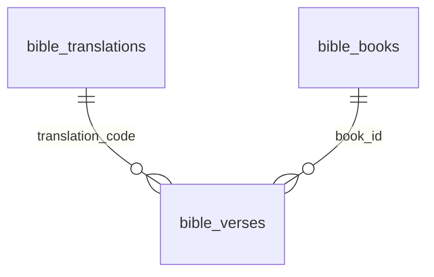

# SDD — Presenter

> Generated by `.constitution/method/scripts/validate.py --generate`. MUST NOT be hand-edited.

This is what the owner reads at **G4 Component** for this component.

## What is staked

`mode: deep` · `risk_accepted: medium` · `g4_passed: True`

**risk_note:** displays names and verses on the room screen; does not write the weekly payload

**owns:** `BibleTranslation`, `BibleBook`, `BibleVerse`, `BibleBookName` · **containers:** `api`, `spa`

## Decision Summary

Presenter is three URLs: slideshow and projector on the projected SPA shell, plus presenter controls on the operator shell. Presenter↔projector sync is client `BroadcastChannel`, no WebSocket (AD-10); slideshow does not join the channel. On-demand verses use the local corpus via the Go API.

Expensive choice: one channel module `@/lib/present-channel`; Operator chrome does not paint the room screen (AD-24).

A live Verse/Reff background choice (UC-27, FR-33, AD-34) rides the same channel and the same shape as the
existing live transition override (AD-23): a session-only value, never persisted, resolved fresh from AD-33's
normal order on every new generate or Sync. No new boundary, no new table — LC-10 carries one more message
variant and LC-14 holds one more piece of session state.

**A remote control device (UC-29, FR-35, AD-37, DEC-006) is the first thing here that needs a server.**
`BroadcastChannel` reaches only tabs of one browser on one device, so a phone cannot join it — and that
is deliberate, not a gap. DEC-006 admits a server realtime channel for the **remote-to-laptop leg
only**, and the design's whole job is to keep that admission from leaking: the phone sends intents to
the presenting client, the presenting client stays the only sender the projector follows, and the
laptop-to-projector path keeps working with the remote closed, asleep, or off the network. Two new
boundaries land on `api` (LC-17, LC-18) — **not** on `spa`, because a relay between two browsers cannot
live in either of them. Nothing about the existing channel changes and no new intent is minted; the six
the remote sends already exist on `PresentMessage`.

## Structure — Logical Components

Rendered from `components.yaml`.

| id | Name | Type | Container |
| --- | --- | --- | --- |
| `LC-9` | Presenter scripture API | `—` | `api` |
| `LC-10` | Presenter sync channel | `—` | `spa` |
| `LC-14` | Presenter session | `—` | `spa` |
| `LC-17` | Presenter remote relay | `—` | `api` |
| `LC-18` | Remote pairing registry | `—` | `api` |

### Dependency direction and responsibilities

| LC | type | Responsibility |
| --- | --- | --- |
| LC-9 | gateway | `GET /api/scripture` |
| LC-10 | gateway | presenter↔projector `BroadcastChannel` |
| LC-14 | service | index / blank / overlay / liveness session |
| LC-17 | gateway | remote↔presenting-client relay: pair, claim, stream, intent (`api`, new — `[MISSING]`) |
| LC-18 | service | which remote may drive which presenting client, and for how long (`api`, new — `[MISSING]`) |

Direction: Operator controls → LC-14 → LC-10 → projector. **Remote path, and it converges rather than
forking:** remote → LC-17 → LC-18 authorises → LC-17 streams the intent to the presenting client →
LC-14 → LC-10 → projector. The remote's intent enters at the same place the Operator's own hand does,
which is what keeps AD-10's single controller literally true instead of merely intended. LC-17 and
LC-18 are on `api` because a relay between two browsers cannot live in either browser. Slideshow is a separate projected page; it does not join LC-10 and must not ack. LC-9 from the controls. Plan from LC-16 (Hub), which for a persisted Service reads the AD-16 snapshot and is served to both shells on `GET /api/services/[id]` (inventory row 35). Does not write Registry.

## Inherited Constraints — the spine's invariants

Rendered from `ARCHITECTURE-SPINE.md`. A row marked **yes** binds this component by `Binds:`; the rest are shown so a miss in `Binds:` is visible, not hidden.

| id | Invariant | Binds this component | Prevents | Rule |
| --- | --- | --- | --- | --- |
| `AD-1` | Web Hub + Offline PPTX (Phase sequencing) [ADOPTED] | no | Dependency on venue internet during Sabbath services | Operators use a zero-install **Web Hub** for review/run-sheet. **Phase 1** presents on Sabbath from a downloadable offline **PPTX**. In-browser Web Slideshow / Presenter Mode are **shipped** (FR-15 / FR-16) but are **not** the hard offline Sabbath guarantee; PPTX download remains primary for venue reliability. A registry or layout change may not make Sabbath rendering depend on hub connectivity. |
| `AD-2` | Single Repository Monolith [ADOPTED] | no | Operational complexity and synchronization issues for a solo developer | The picoclaw skill integration logic, the Go API, the React SPA, and the Node PPTX worker reside in a single repository and deploy as a cohesive unit. Registry storage, the admin editor UI, and both renderers are part of that unit; there is no separate editor service. (Amended DEC-003: App Router is no longer the UI process.) |
| `AD-3` | Decoupled Ingestion and Presentation [ADOPTED] | no | Tightly coupled integrations that would make replacing the Telegram/Agent ingestion difficult | The API must expose a standard JSON interface for service generation that is agnostic to the input mechanism (Telegram/picoclaw). The presentation layer consumes this same API. Artifact templates are a presentation-layer concern; webhook/service intake JSON stays agnostic of layout templates. |
| `AD-4` | LiveServer durable paths (home PC production) [ADOPTED] | no | Ephemeral container-only data loss | Production is one always-on **Go API** process on host storage (`presenter.example.org` via Cloudflare Tunnel on LiveServer; `presenter-dev.bic.my.id` on a VPS via systemd for dev). That process ships the SPA static assets and includes a Node runtime **only** so the PPTX worker can be exec'd (AD-30). Host-durable paths for `DB_PATH`, PPTX cache, and `UPLOADS_DIR` (bind mounts or fixed host directories). Do not run multiple API processes against the same SQLite file. Operator details: `.constitution/project/deployment.md`. **First deploy happened on 2026-08-20**: `presenter-dev.bic.my.id` runs under systemd on the VPS and has been redeployed several times since. The production host (`presenter.example.org` above, a deliberate placeholder — the real production hostname MUST NOT enter this public repository) is still a 503 holding vhost with no process. This sentence read "As of 2026-07-30 no deployment exists" until 2026-08-22. That date is load-bearing rather than trivia — AD-18's total-replacement licence and AD-21's released-version freeze both hinge on *until first deploy* — so **the hinge has now tripped, and whether those two licences still apply is the owner's call, not a consequence to be inferred from this corrected date: OQ-50.** The anchor is stated here rather than inferred from this rule's tense. Announcement image refs are remote http(s) (SSRF-hardened) **or** hub-local `/api/uploads/<32-hex>.(jpg\|jpeg\|png\|gif\|webp)` resolved from disk for PPTX. Registry rows and per-service registry snapshots live in that same durable `DB_PATH`; editor image references resolve through the existing `UPLOADS_DIR` / allowlist rules, never new ad-hoc paths. (Amended DEC-003: the unit is no longer a Next.js standalone process. Docker Compose packaging was retired 2026-08-20 in favour of binary + systemd deploy.) |
| `AD-5` | Single request gate on the Go API [ADOPTED] | no | per-route authorization drift, and privilege that survives demotion, logout, or password change | The Go API has one request gate, and its path matcher **is** the authorization boundary — anything it does not match is served with no session check at all, so a new exclusion ships together with its assertion test in the same change set. The gate re-checks every session against SQLite (deleted account, role demotion, stale `token_version`, revoked `sid`) and **fails closed** if that lookup throws. Privileged routes additionally call `requireSession` / `requireAdminSession`; the cookie's `role` claim is never trusted alone. `/api/webhook` is gated by `WEBHOOK_SECRET` only — 503 when unset, 401 when wrong or missing — never by a cookie. Post-login `next` targets pass through `safeNextPath`. Every gated response carries `Cache-Control: private, no-store` and `Vary: Cookie`, because the hub is published through a Cloudflare Tunnel where an edge cache rule could otherwise serve a private response without the origin — and therefore without this gate — ever running. A signature-only check cannot see a deleted account, a demotion, or a revoked session; for one congregation on a home server the cost of a local SQLite read is accepted. The SPA has no session authority of its own. (Amended DEC-003: the gate is no longer `internal/gate`. As-built until the cutover wave still uses that file; the invariant is one matcher on the always-on API.) |
| `AD-6` | Optimistic concurrency on service edits [ADOPTED] | no | an operator's edit silently erased by a late correction (last-write-wins) | every service mutation carries the client's `updated_at` as a precondition; a stale value is rejected with HTTP 409 and the client re-reads before retrying. No write path may bypass the precondition. This covers registry writes and the **Sync Artifact** action of AD-16 — the shipped shape is `expectedUpdatedAt` / `RegistryStaleError` in `src/lib/registry/store.ts`. |
| `AD-7` | `buildSlidePlan` is the only slide-order source [ADOPTED] | **yes** | divergent slide order or content between what the operator controls and what the congregation sees | `buildSlidePlan` is the single source of slide order and content for every surface. No surface recomputes order from service fields or keeps its own ordering logic; a rendering or ordering change lands in the plan, never per-surface. AD-12's Fat Payload specializes this rule; AD-16 changes only where the plan reads its templates from, never that there is one order source. |
| `AD-8` | Image references resolve only through shared safety helpers [ADOPTED] | no | a new surface reintroducing SSRF or unsafe content through its own laxer resolver | image references resolve only through the shared helpers in `src/lib` — allowlisted remote http(s) and hub-local `/api/uploads/<32-hex>.(jpg\|jpeg\|png\|gif\|webp)` for announcements, and registry `/assets/...` refs for Artifact templates. A new reference vocabulary extends an existing helper or adds one alongside them with the same fail-closed default; no unit ships an inline resolver. The canvas editor introduces no second resolver and admits no `data:` or arbitrary remote URI. |
| `AD-9` | Schema evolution through startup DDL only [ADOPTED] | no | two sources of schema truth between a developer machine and a fresh production container | schema changes go through the Go API's startup DDL when it opens SQLite. No migration framework (Prisma or otherwise) is introduced without an explicit product decision recorded in this spine. Registry tables are created on that same path. **The bootstrap path is shared, and the division is fixed:** this rule owns *schema* — the shape, e.g. adding a column — while **AD-18** owns *value* migration — the contents, e.g. rewriting every row's `base_type`. Neither licenses the other's mechanism: a value change is not a reason to add a framework, and a schema change is not a reason to rewrite data. (Amended DEC-003: not the Next.js `getDb` path.) |
| `AD-10` | One presenter sync channel, client-side only [ADOPTED] | **yes** | a split sync topology where the projector follows one controller and ignores another | presenter↔projector sync goes through the single `@/lib/present-channel` `BroadcastChannel` module; no surface opens its own channel name or message shape. No server realtime channel (WebSocket/SSE) is introduced unless product direction changes — keeping the venue path independent of hub connectivity, per AD-1. A registry edit must not add a second channel to push template changes to a live projector. **Every message carries a plan identity** — a fingerprint of the snapshot and resolved announcement set that produced the deck — and a receiver whose own identity differs **refuses to follow the index** and says so on the room-facing screen rather than rendering a slide it cannot vouch for. Presenter and projector are two independent `force-dynamic` renders, each calling `buildSlidePlan` at its own moment, so a bare `index` silently means different slides on the two screens the instant anything structural changes underneath them; since this rule forbids a surface inventing its own message shape, the identity has to live in the shared shape. |
| `AD-11` | Artifact Registry Storage *(was `epic-16 AD-1`)* [ADOPTED] | no | Data loss on ephemeral container filesystems, file-lock concurrency issues, and a seeder that overwrites administrator edits or leaks private seed content. | The live Artifact Registry is stored in SQLite on the durable `DB_PATH` (AD-4). Filesystem JSON serves exclusively as a startup seed: startup inserts missing template IDs and **never** overwrites persisted administrator edits. Canvas Reset discards unsaved in-memory edits back to the last Saved state. Seeded elements are ordinary editable and deletable elements that an administrator may freely modify or delete; they are not locked against removal or modification on save (DEC-014). The seed is two-layered — `data/local/default-registry.json` is git-ignored and **takes precedence over the shipped `data/default-registry.json` example whenever present**; a seeder that reads only the shipped example breaks the mechanism that keeps congregation data out of a public repository. |
| `AD-12` | Slide Plan Data Flow (Fat Payload) *(was `epic-16 AD-2`)* [ADOPTED] | **yes** | The Web (`SlideView`) and PPTX renderers from performing independent database lookups or maintaining their own diverging layout logic. | `buildSlidePlan` outputs a fully hydrated AST (Fat Payload) with exact rendering coordinates, fonts, colors, and resolved text content. Specializes AD-7: the plan is the single order *and* layout source, so a renderer never **reads data from** the registry itself. Importing a shared *helper* that happens to live under `src/lib/registry/` is not such a read — `pptx.ts` importing `isBundledAssetRef` from `registry/asset-safety` is the AD-8 resolver this spine requires, not a data path. |
| `AD-13` | Canvas State Boundary *(was `epic-16 AD-3`)* [ADOPTED] | no | Two-way data binding lag, stuttering drags, and unnecessary React re-renders. | The Canvas Editor uses an Uncontrolled Wrapper pattern. Fabric.js owns the canvas state exclusively; React reads it **only on save**, through `serializeCanvas` over `canvas.getObjects()`, projecting into the registry's own element schema. Not `canvas.toJSON()`: Fabric's serialization format is **not** `ArtifactLayout.elements`, so a second editor surface built on `toJSON()` would fail AD-15's validator on every write. The projection into the registry schema is the boundary, not the canvas library's own format. |
| `AD-14` | Global Template Administration *(was `epic-16 AD-4`)* [ADOPTED] | no | Per-service template drift and operator-level mutation of every service's visual contract. | Artifact templates are global across services. Registry management UI and APIs are admin-only and re-check the current account role from SQLite — a specialization of AD-5, not a separate authorization scheme. `/admin/artifacts` and `/api/admin/artifacts/**` are inside the AD-5 matcher, and adding a registry route outside it requires the same-change-set test update AD-5 demands. Downstream planners and renderers read the registry through server-side modules rather than the management API. |
| `AD-15` | Stable Layout Identity *(was `epic-16 AD-5`)* [ADOPTED] | no | Unit-specific renderer drift, required-placeholder deletion, and unsafe image references reaching a renderer through an unvalidated back door. | Layouts use a fixed 16:9 canvas with normalized percentage coordinates and stable template/layout/element/placeholder IDs. Coordinates may extend beyond the canvas to preserve intentional source-deck clipping. **Every** write into the registry is untrusted and must pass the same structural and image-reference validation before persistence — the canvas save API, the startup seeder, and any import or asset-extraction script alike. Image refs validate through the shared helper required by AD-8; no write path ships its own check. |
| `AD-16` | Service-Bound Registry Snapshot *(was `epic-16 AD-6`)* [ADOPTED] | no | a live registry edit shifting the structure under a service an operator is preparing right now, and a weekly value entered against one structure being orphaned by a later structural change — and, in the other direction, a service with no way to be brought up to date. | Creating a worship service **clones** the ordered live registry — order, kinds, labels, layouts, placeholder bindings, **and the administrator override records of AD-22** — into a **service-bound snapshot** on the durable `DB_PATH` (AD-4); creation is the only freeze event. The clone is of the *rendered* structure, so anything AD-22 keeps outside the layout travels with it; an override left out of the clone would either never reach the deck or reach it from outside the freeze, and both defeat this decision. A service's plan, Presenter, slideshow and PPTX read that snapshot; a live registry edit reaches an existing service **only** through the explicit **Sync Artifact** action, which replaces the snapshot destructively. Sync is permitted on **any** service, carries the service's `updated_at` precondition (AD-6), and may not alter the service's entered data (*State* convention) — "destructive" means it replaces the snapshot, never that it may overwrite a service someone else has moved underneath it. **Sync is a structural write and is therefore admin-only**, re-checking the role from SQLite exactly as AD-14 requires of every registry management surface, even though it is reached on a service route that `internal/gate` gates for any signed-in account; its route ships with the `tests/go-http-gate.test.mjs` assertion AD-5 demands and an in-route `requireAdminSession`. An operator may see that their snapshot is stale and *request* a sync; they may not perform one. Without this, "permitted on any service" and AD-14's surviving admin-only clause read as licence for an operator to freeze a half-authored layout into the service that presents in fourteen hours — this decision's own *Prevents*, arrived at from the other direction. The clone and the re-clone are write paths and validate under AD-15 like every other. **Announcement membership is not cloned:** the Announcements master list stays live and reaches an existing service at render time (CAP-7). **It is nonetheless scoped per service (`service_id`), matching the clone boundary everywhere else in this decision** — "not cloned" means this week's flyers may still change after the structure is frozen, never that one list is shared across services. The distinction is invisible while only one service is being prepared and decisive the moment two are open at once — a stale service reopened for a correction while next week's is being built — at which point an unscoped list bleeds one service's images onto another's deck. The shipped `announcement_items.service_id` is nullable, so both readings are currently expressible; this rule picks the scoped one. **A later structural change obliges nobody to keep an older snapshot renderable** — what the snapshot protects is the service's entered supporting data, not its ability to regenerate a past deck. The snapshot is the sequence *input*: `buildSlidePlan` remains the single source of order and layout (AD-7, AD-12), and no renderer reads a snapshot directly any more than it read the registry. **One bounded exception, stated as an exception rather than argued away — pre-existing services.** A service created *before* this model ships has no snapshot and renders from the live registry until its first Sync, which is a clone-in-place; from that moment the rule above governs it without qualification. So *"creation is the only freeze event"* holds for every service created under this decision, and the no-snapshot state is a **one-way migration path into** the decision rather than a second mode inside it: nothing may create a new service without a snapshot, and no code may re-enter the state once left. It is called out because every service in the database on day one is in it — `spec-artifact-registry-authoring/SPEC.md:89` assumed exactly this and an earlier draft of this rule forbade it, which would have left three stories free to answer it three ways. The Epic 20 data transition (AD-21) may instead clone a snapshot for every existing service and close the exception outright; that is the preferred landing, and either way the state is finite and dated. **Naming caution:** the shipped `RegistrySnapshot` type (`src/lib/artifacts/registry-snapshot.ts`) means *"the live-registry map assembled for one plan build"* — a different thing from this decision's per-service durable freeze, and the two must not be conflated. |
| `AD-17` | The Seed Is a Bootstrap, Not a Correction Channel *(was `epic-16 AD-7`)* [ADOPTED] | no | an administrator's delete, rename or reorder being silently undone by an unrelated restart. A deleted row leaves no evidence behind, so anything that supplies "missing" IDs cannot tell *deleted on purpose* from *never existed here* — it resurrects the row forever. | The seeder initialises data **from zero only** — first install, first run — and is gated by a marker in `settings`. It is never a gap-filler: after it has run, the administrator owns every row that exists, and the ordered registry is authored data rather than shipped data kept in sync. A gap in a database that already holds data travels as a versioned data migration (AD-18, AD-21), never as a re-seed. **The filesystem seed is read at exactly two moments — the first-boot bootstrap, and an explicit per-template Reset — and at no other.** In particular **no read path may substitute a seed template for a row the database does not hold, and none may substitute one for a row it holds but cannot parse.** An ordered registry of N rows produces a deck built from those N rows and no others; a template id the database does not hold does not exist, and a row whose payload will not validate **fails closed** — no layout, logged with the id and the reason, the same posture AD-5 and AD-8 already take. Both halves matter and the second is the easier one to leave open: `registry-snapshot.ts` **used to** substitute seed content in **one** loop for absent and corrupt rows alike (`parseRow` merely returned `null`, so a corrupt row reached that loop indistinguishable from a missing one), so a rule that closed only the *absent* case left shipped example content silently standing in for an administrator's real layout the moment one row was malformed. That loop is the hazard this Rule forbids; AD-11 records it closed 2026-08-07 (Story 20.1). Closing only the boot door is what let a deleted slide re-materialise into the deck on every plan build, with `rejected.delete(seed.id)` suppressing even the log line. `tests/registry-reseed.test.mjs`'s assertion that a missing row is re-inserted is **inverted, not deleted**, and a second assertion pins that a deleted row does not reappear in a built plan. Restoring shipped content stays possible as an **explicit administrator action** — Reset-from-seed per template, per AD-11 — never as a side effect of a restart, and never as a bulk re-seed of a live database. |
| `AD-18` | Vocabulary and Value Changes Travel as Explicit One-Time Migrations *(was `epic-16 AD-8`)* [ADOPTED] | no | a shipped vocabulary change reaching persisted rows through boot-time re-seed (which AD-17 removed) or not reaching them at all — and the opposite failure, a migration framework arriving by the back door. | AD-9 fixes *schema* evolution on the startup DDL path and is silent on **value** migration; this decision fills that silence rather than weakening it. A shipped change that must reach rows already persisted travels as an **explicit, one-time migration** on the startup path, versioned per AD-21. It is not a migration framework and AD-9's prohibition stands: no Prisma, no versioned migration directory, without an explicit product decision recorded in this spine. **Until first deploy** no production rows exist, so Epic 20's seven-`base_type`-to-three-kind collapse ships as a **total replacement** — no backward compatibility, no migration over live rows — folding into production data version 1 (AD-21); at first deploy that licence ends, and the same change would need a migration over live `artifact_templates` rows. A migration operates on the **live registry** and does **not** rewrite service snapshots — structure reaches an existing service only through Sync Artifact (AD-16), so a migration that rewrote snapshots would be a second structural channel. An older snapshot may therefore stop being renderable, which AD-16 accepts; what must survive is the **entered data**. |
| `AD-19` | A Cross-Boundary Key Is a Server-Owned Value the Administrator Cannot Edit *(was `epic-16 AD-9`)* | no | two independently-built units agreeing to disagree about a key — the registry surface and the worship-service settings form picking different handles for the same SongSet slot, and the canvas editor's insert list drifting from what the validator actually admits. | a key referenced across a boundary is **server-owned vocabulary, enforced on every write path**, and it is never administrator configuration. Three properties make it unambiguous rather than merely convenient: the key is **never administrator-editable**, **at most one registry row may carry each slot identity**, and it is a **semantic name, never an ordinal** (`songset1` re-imports the positional reading this decision exists to remove). The recognized set is **closed and complete** — `general`, the four `songset-*` slot identities, `announcement`: six keys over three kinds, and no write path admits a seventh; the Placeholder Catalog's admitted keys are the same class of value and get the same treatment AD-8 and AD-15 gave image references, so *"the UI cannot invent a catalog key"* (CAP-4) is a property of the registry rather than of one client. **The value a key names has exactly one persisted home** — for a slot binding that is the service's own entered data, and the identity is a *key into* it, never a second copy; otherwise a webhook correction (which AD-3 forbids knowing slot keys) rewrites one home while the settings surface owns the other, and the deck renders one hymn while the run sheet and the edit form show another, with no 409, no log, and no screen on which both values appear. A binding whose slot row has been deleted is **inert, not an error**, and the entered number survives in the service's own data. Reordering rows changes the presented sequence (CAP-8) without touching a binding, and renaming a label cannot touch one either. Every spelling here is a persisted binding key, so changing one later is the versioned data migration AD-18 and AD-21 govern, and extending the vocabulary — a fifth slot, a fourth kind — is a code-plus-tests change. |
| `AD-20` | The Planner Injects Nothing the Registry Did Not Ask For [ADOPTED] | no | a liturgical decision requiring a code change and a deploy, and the planner keeping a second, invisible source of deck content alongside the registry. | every slide in the deck originates from an ordered registry entry. `buildSlidePlan` **applies** rules; it does not **hold** them. Fixed liturgical content — the standing responses `#671` and `#684`, the closing *We Have This Hope* — is authored as **General** entries and edited by hand, never injected by the planner and never computed from the hymnal. Because a General generates no title slide, the `skipTitle` mechanism is **removed rather than migrated**: there is nothing left to suppress. It shipped at five sites and Story 20.1 deleted them — a removal, not a compatibility shim, and `slide-plan.test.mjs:231` greps the tree to keep it deleted. Changing or adding a liturgical song is a registry edit. |
| `AD-21` | Persisted Data Carries One Version Number, and Unreleased Transitions Compact Into One [ADOPTED] | no | two builders keying the same change incompatibly — one adding a per-change boolean, another bumping a counter — and a production database accumulating one transition per code change, so that its version history tracks development activity instead of releases. | All persisted data shares **one monotonic version number** in `settings` — one counter for the whole database, never one per table or per domain, so that "which version is production on" has a single answer. A change that must reach data already persisted is declared **explicitly while it is being coded**, as the transition from version *n* to *n+1*; it is never inferred at deploy time. **An unreleased transition is not yet history and may be rewritten:** the whole batch of unreleased transitions is compacted into a single transition before it reaches production, and developer databases are **reset** to the compacted version rather than migrated through the steps it replaces. **A released version is frozen** — once a version has reached production it is never renumbered, re-cut, or folded into another. Small steps are a development convenience and stop at the merge; production sees one transition per release. AD-17's seeding marker and this counter are **distinct**, and neither substitutes for the other: the marker records that bootstrap ran, the counter records which data version is persisted. This is a counter and a convention, not a framework: AD-9's prohibition stands. |
| `AD-22` | Authoring Authority Is Fixed per Kind: Free Canvas, Bounded Config, or Bound to a Set | no | the canvas editor and the validator disagreeing about what an administrator may author on a non-General entry — one opening a free canvas on a SongSet row and admitting an extra or rebound placeholder, the other refusing it — and CAP-3's *"General only"* living nowhere but in a capability statement. | authoring authority is fixed per kind, and no surface widens it. **`general` is free canvas:** the administrator composes it from anything, including Placeholder Catalog keys (AD-19). **A `songset-*` row gets a bounded configuration surface, not a canvas:** exactly two background images — one for its title layout, one for its lyric layout, which verse and refrain share — plus font style and font size. Both background references resolve through the shared helper AD-8 requires: this surface is not the canvas editor and introduces no second resolver of its own. Layout composition itself is developer-owned seed data and is not exposed there; it stays registry data hydrated into the plan (AD-11, AD-12), never a coordinate held by a renderer. **Administrator-configured values persist outside the layout**, as an **override record keyed by row and field**, re-applied over the developer layout at hydration: the layout JSON stays developer-owned in full and a migration may replace it wholesale, the override record stays administrator-owned in full and no migration, Reset, or re-seed writes it, and a bounded surface that writes *into* the layout is refused by the validator on every write path (AD-15). An earlier draft left the encoding as "a schema call, not an invariant" — an override record beside the layout *or* a marked field inside it. The two were never equally available: the shipped validator rejects unknown keys against a closed `ALLOWED_LAYOUT_KEYS`, so the in-layout marker cannot ship without a registry-contract change this decision does not authorise, leaving only the unmarked shape — background written straight into `layouts.*.backgroundImage`, font into element `style`, indistinguishable from developer output. Then this decision's own migration clause replaces those layouts and **every background and font size the administrator chose reverts to the shipped default, on all four slots, silently, before anyone opens the hub** — AD-11 keeps no second copy and Reset would discard them too, so the only record of them was the layout just overwritten. The row's placeholder set and its SDAH slot binding are server-defined: nothing may be added, removed or rebound, and the validator refuses it on every write path (AD-15). **An `announcement` row is bound to the Announcements master set**, whose membership is not registry-authored at all (AD-16, CAP-7). Only those two kinds **expand** — a SongSet row into its title and lyric slides, an `announcement` row into N full-bleed images; a General is one slide. Because AD-17 reads the seed once, a developer's later change to a SongSet layout reaches a deployed database only as a versioned data migration (AD-21) — never by restart, and not by Reset. **Reset restores the shipped *layout* and leaves the override record untouched**, which is the whole point of keeping the two apart: before the override record existed, Reset would have discarded the administrator's backgrounds and font sizes along with the layout, and there would have been nowhere to recover them from. A Reset that also cleared administrator configuration would need to say so and does not. |
| `AD-23` | Transition Style Is One Value, Described Once, Consumed Identically [ADOPTED] | **yes** | a deck that fades in PowerPoint and cuts on the projector — the same slide sequence behaving differently on the two surfaces the congregation and the operator each watch | transition style is **one app-wide value** in `settings` (`slide_transition`), and each style is described **exactly once**, in `src/lib/transitions.ts`, carrying both its PowerPoint element and its browser animation parameters. Neither renderer holds either half: `pptx.ts` and the browser surfaces all import that table, and **no surface keeps a default of its own** — that, not immutability, is the invariant. The value reaches each surface directly from `settings`, never through the plan (`buildSlidePlan` has no transition concept at all). There is no per-service override. The presenter **may** override the style for the **live browser session**, and that override travels through AD-10's channel so presenter and projector never disagree with each other (`PresenterOperator.tsx`); a PPTX already generated keeps the `settings` value it was built with, because a downloaded file cannot be re-styled after the fact. Adding a style means adding a row in that one table — and only styles that survive a plain `<p:transition>` child without the `p14` extension namespace qualify, so nothing silently degrades to "no transition" when the deck is opened elsewhere. This ratifies a convention the code already states in its own header; it is recorded here because FR-7 (`prd.md:179-180`) makes it a requirement and `prd.md:304` states the cross-surface obligation in as many words — *"the browser transition matches the Deck's configured transition style (FR-7); the two are chosen once and never diverge"* and `docs/architecture.md:61` — a declared source of this spine — used to contradict it by hardcoding a crossfade. That source was reconciled on 2026-07-30 and now states the configured value and cites this `AD`, so the contradiction is closed; the decision stays because FR-7 still needs an owner and because two renderers plus two browser surfaces is exactly the shape that diverges without one. |
| `AD-24` | Operator Chrome State Is Browser-Local, and the Room-Facing Surface Is Closed to It [ADOPTED] | no | one hazard with three faces — a preference landing in `settings`, where it silently becomes *every* operator's, or a deck-affecting value landing in `localStorage`, where AD-4's durability, AD-6's concurrency and AD-18/AD-21's migration rules cannot reach it; the root client boundary migrating upward until the whole app is a client tree; and a client-persisted value that **paints** becoming a third structural channel to the congregation's screen, alongside `buildSlidePlan` (AD-7) and the BroadcastChannel (AD-10) | **application state reaches one of three homes and *who must agree on it* picks which.** **Persisted-shared** lives in SQLite on the durable `DB_PATH` (AD-4) as an app-wide `settings` value, the way AD-23 keeps `slide_transition` because both renderers and both screens must agree on it. **Persisted-local** lives in that browser's `localStorage` and nowhere else — not in SQLite, not under `DB_PATH`, and therefore **not backed up** — the way the theme does, because nothing but this operator's own eyes depends on it. **Ephemeral-shared** is not persisted at all and travels over AD-10's channel. The tiers are not interchangeable in either direction. **A chrome provider mounts only on the operator shell.** The SPA therefore has two sibling shells: the operator shell owns metadata, fonts, `ui_locale`, and theme; the projected shell owns the unchanged room-facing URLs and applies the five shell claims exactly: `html.backgroundColor = #000000`, `html.overflow = hidden`, `html.scrollbarGutter = auto`, `body.backgroundColor = #000000`, and `body.overflow = hidden`. It carries no operator provider or theme state. Projected not-found and error screens render generic `#000000`/`#FFFFFF`, vertically scrollable output with no operator link or detail. **The room-facing surface is closed to operator chrome, in any form, under any setting:** the projector, the web slideshow and the PPTX never read it. Every future browser page intended for congregation or OBS output belongs on the projected shell; putting one on the operator shell is an architectural violation, not a story-level placement choice. The projected render tree paints in **literal colours**, carrying no theme token and no theme-coloured edge; a full-screen room-facing client also claims the same shell through one per-document projected-shell helper as a hydrated defensive layer, never as the owner of first paint. The PPTX is closed *structurally* rather than by browser enforcement — it is generated by the worker from a plan the Go API already assembled and cannot read browser state at all. Registry payloads rendered by the projected tree still validate under AD-15; source-tree edits are governed by this closure gate, not by the registry validator. As-built: Vite SPA operator/projected branches plus `spa/projected.html`; `tests/theme-chrome.test.mjs` pins the two shells. |
| `AD-25` | A Shipped Reference Corpus Is a Projection of Its Committed File [ADOPTED] | no | two corpus families answering one architectural question two different ways — and, in the two directions that question fails, a corrected corpus that cannot reach the table at all, or one that reaches it and leaves the withdrawn rows standing | A **shipped reference corpus** — a committed data file the product carries so that a fresh clone resolves a verse and a hymn offline — is **developer-owned data with exactly one writer**, and the committed file is authoritative. Its tables are a **projection** of that file: startup reconciles each table to the corpora it ships, and the reconcile is **complete within the corpus code it names** — a row carrying that code and absent from the file is removed, and a row belonging to a sibling corpus is never touched. Whether startup detects a difference before doing the work — a per-corpus fingerprint, on the `artifact_templates.seed_hash` precedent — or simply reconciles every boot is a story-level call, bounded by the two properties this rule does fix: **a corrected corpus reaches the table with no operator step, and the table does not outlive the file.** That call is also where a growing corpus set is paid for, and the cost lands at **boot**: the first KJV seed writes 31,102 rows in ~258 ms, so reconciling several translations unconditionally on every start is the shape that turns a restart into a wait — on the morning AD-1 exists to protect. **Rebuilding rows is safe to consider, which is not obvious and was checked rather than assumed:** nothing anywhere references the surrogate `hymns.id` or `bible_verses.id` (grepped across `src/` and `tests/`, 2026-08-01), because a service persists a hymn *number* and a passage a *reference*. A reconcile may therefore delete and re-insert without dangling anything — and if that ever stops being true, this sentence is the one to come back to. This is a **third channel, and it is neither of the two it sits between.** It is not AD-17's bootstrap: a bootstrap runs once precisely because an administrator owns what comes after it, and nobody owns a corpus row. It is not AD-18/AD-21's value migration either: a migration exists to carry a change into values somebody persisted deliberately, and every value here is derived from a file already in the commit. AD-9 still owns the **shape** of these tables and AD-18 still owns **value** migration everywhere else; what this decision claims is narrower than it may look — a table whose entire content is derived from a committed file has no values of its own to migrate. **One consequence to take rather than rediscover: a rename inside a projected table is a rebuild, not a migration**, which is what makes AD-26's three renames cheap. **The closure is what makes all of this safe, and it is a property of today's code rather than a promise.** No administrator or operator write path into a corpus table exists — verified 2026-08-01, zero `INSERT` / `UPDATE` / `DELETE` against `hymns`, `bible_verses` or `bible_books` anywhere outside `src/lib/db/index.ts`. **Adding one reopens this decision before it ships**, because from that moment the reconcile is exactly the resurrection AD-17 forbids and a corpus becomes authored data carrying AD-17's, AD-6's and AD-21's obligations in full. A corpus row is therefore never where a choice is persisted; a choice *about* a corpus — which one is the default — is a `settings` value under AD-24, keyed by the corpus code AD-26 fixes. **Where it runs on the `getDb` path:** after data migrations, so a migration never observes rows the reconcile wrote in the same boot — AD-21's own reasoning for placing the bootstrap last, applied to a fourth step AD-21 could not have named. Its order relative to AD-17's bootstrap is free, because the two touch disjoint tables; that is stated so the fixed sequence in AD-21 is not read as forbidding a fourth step. |
| `AD-26` | A Corpus Is a Registered Entity: Its Code Is the Key, Its Locale Is an Attribute | no | one corpus code meaning two different books depending on which locale directory it was found in — and the mirror failure, a locale reaching a `WHERE` clause and quietly turning a view default into a data filter | Every installed corpus is a **registered entity** — one row in `bible_translations` or `song_books`, carrying its code, display name, **locale**, licence and provenance. **The corpus code is globally unique across locales, and it is the cross-boundary key**: the class of value AD-19 governs, server-owned and never administrator-editable. `bible_verses.translation_code`, `hymns.song_book_code`, `default_bible_translation`, `default_song_book` and the corpus filename all carry that one code. **Locale is an attribute of the corpus, never part of a key and never part of a lookup.** That is what makes FR-24's never-filter rule **structural rather than disciplinary**: because no key contains a locale, no read path can *need* one, so a `WHERE locale = …` on a corpus lookup is not merely a product violation but a predicate that cannot be necessary. A listing endpoint returns every installed corpus with its locale; `default_data_locale` decides only what a picker opens on. **The file declares; the path merely locates — for the bible family, in full, and for a song book, only up to and including its bootstrap.** A registry row is derived from the corpus file's own declared metadata under AD-25, never from its directory — the loader already refuses a file whose declared code disagrees with the code it was loaded as (`src/lib/corpus.ts:91`, `:176`), and it refuses on the same terms a file whose declared locale disagrees with the directory holding it. Without that second check, copying `data/en/song-book/sdah.json` to `data/id/` gives one code two locales and the registry keeps whichever booted last. **Superseded by AD-36 (2026-08-20, DEC-005), for the `song_books` row and that row alone, the moment its one-time bootstrap has run:** ~~"a registry row is derived from the corpus file's own declared metadata"~~ stops being true of an installed song book — AD-36 makes that row administrator-owned data from bootstrap onward, so a later edit to the committed file's declared name, locale, licence or provenance no longer reaches it at all, and correcting it live is an explicit numbered migration, never a re-derivation on the next boot. Both refusal checks in this paragraph — code-disagreement and locale-disagreement — still gate the bootstrap itself and are untouched; what dies is only the promise that the row keeps tracking the file **after** that bootstrap. **Neither refusal check has anything to gate for an admin-created book (AD-36 Extended):** there is no file and no directory, so "a file whose declared locale disagrees with the directory holding it" has no subject to refuse — the check is inapplicable, not silently passed, because that row's bootstrap never reads a file at all. That row still carries this rule's full shape intact — code, name, **locale**, licence, provenance, the same five fields as any other song book — sourced from the Admin at creation instead of a file's declared metadata; AD-36's Extended clause (OQ-39 closed, 2026-08-20 owner ruling) states that positively, closing the gap this supersession sentence left open rather than leaving the remaining three fields — locale, licence, provenance — an open hole for the admin-created case (`book_code` and name are already Admin-supplied at creation; only those three were ever in question). `bible_translations` carries no such carve-out: for the bible family this sentence, and the two refusal checks, hold exactly as written, on every boot, with no qualification. **The declared field is spelled `locale`**, matching the path segment, the settings keys and this rule; both committed files ship it as `language` today and are corrected in the same change set, because a persisted cross-boundary key gets one spelling chosen once (AD-19) and the files are the source of record, so it is free now and a migration later. **The renames belong to this decision rather than to housekeeping:** `bible_verses.translation` → `translation_code`, and `hymns.book_code` → `song_book_code` because `book_code` names a *song* book in one table while `bible_books` makes *book* mean a Bible book in another — one word, two entities, ambiguous the moment one person reads both families. `isKjvCorpusEmpty()` → `isBibleTranslationEmpty(code)` is the same rule reaching a function signature: **no corpus code survives as a literal in a read path.** All three are rebuilds rather than migrations, per AD-25. **Terminology is fixed, and it stops deliberately at one place:** *bible-translation* and *song-book* are the container terms in paths, tables and prose, while **`hymn` stays the entry term** — the `hymns` table, `/api/hymns`, and the `resolvedHymns` / `failedHymnNumbers` webhook fields keep their names, that last pair being an external contract an outside caller owns and AD-3 keeps agnostic. |
| `AD-27` | Book Identity Is Canonical and Translation-Independent; Every Name Belongs to a Translation | no | one table with two owners — the last translation seeded renaming every book for every reader — and *"the same passage in another translation"* ceasing to be one query | A book has **one canonical identity, stable across every translation, carrying no display text at all.** Every name and short name **belongs to a translation** and is stored against it. `bible_verses.book_id` points at the identity, which is what keeps a passage one lookup in any translation and lets a translation be added or removed without touching a verse's identity. **A corpus file maps its books onto that identity; it does not define it.** The canonical set is fixed by the application, and a corpus naming a book the canon does not hold is **refused, with the book named** — the fail-closed posture AD-5, AD-8 and AD-17 already take, chosen over a silent partial import because a translation missing four books resolves nothing for them while saying nothing about why. **Two consequences, stated rather than left to be discovered.** The canon that ships is the 66-book Protestant one, so a translation carrying deuterocanonical books is refused rather than truncated, and admitting one is a code-plus-migration change (AD-18, AD-21) rather than dropping a file into `data/`. And **input tolerance is the matcher's concern, never the corpus's**: a translation owns its *names*, while how forgivingly an operator's typing is compared against them — case, punctuation, abbreviation, singular against plural — is the matcher's. The two collapse easily and the collapse is one-way: the moment a corpus file is where an alias goes, names are corpus-owned in name only, and every translation added afterwards inherits the job of listing every way somebody might type its books. **Two things this clause originally said are superseded by AD-28 (2026-08-01), and they are struck here rather than quietly edited out, because this decision is unbuilt — which is exactly the condition under which a half-reversed rule reads as a whole one.** It said the matcher was ~~one server-side matcher **shared by every translation**~~; it is one implementation carrying a **scope**, and on an operator surface that scope is the chosen translation alone. And it treated the four kinds of tolerance as uniform; ~~abbreviation~~ is not — it carries a language and is scoped to a translation, while the other three do not. **The prohibition itself is untouched and AD-28 rests on it:** an alias still never lives in a corpus file. |
| `AD-28` | The Reference Matcher Is One Implementation Carrying a Scope, and Tolerance Carries a Language | no | cross-language input returning **through the matcher** once the corpus door is shut — and the mirror failure, the operator surface and the rundown drifting into two resolution rules because their scopes differ | there is **one matcher implementation and the scope is an argument to it, never a fork**. On an **operator surface** the scope is the **chosen translation alone**; on the **rundown** it is **every installed translation**, because a Telegram sender picks none. That scope is a **required, registry-validated corpus code supplied per request** — an unrecognised or absent one is **refused**, and *all-installed* is a property of the rundown surface and never a fallback, because a default silently reinstates the cross-language operator input this decision removes. It is a per-request parameter rather than the `settings` default, since FR-24's never-filter rule lets an operator browse a corpus outside the default locale. **Tolerance that carries a language is scoped with it:** case, punctuation and singular-against-plural are comparison rules owned by the matcher and unscoped, while a **non-prefix alias belongs to a translation** and is **matcher-owned data keyed by translation code, never a corpus-file field** — which is how AD-27's prohibition and this decision's finding hold at once rather than trading off. Resolution compares against **corpus-supplied names** rather than a regex guessing where a book name ends, and an **ambiguous reference is unmapped input (NFR-5), never a guess** — the fail-closed posture AD-5, AD-8, AD-17, AD-25 and AD-27 already take, and it belongs with them because a guess here is silent and reaches the congregation's screen mid-service. Ambiguity is **not scoped to the cross-translation case**: it is measurably intra-translation on the single corpus shipping today, so a builder reading a cross-translation-only rule in a single-corpus install would reasonably take the first match, which is the mis-split this clause exists to prevent. |
| `AD-29` | The Projector Reports Its Own Liveness and Nothing Else, and One Predicate Decides It [ADOPTED] | **yes** | the reverse direction on AD-10's channel becoming a second controller — a projector whose messages the presenter *follows* rather than merely observes — and the mirror failure, two liveness mechanisms with two verdicts, so the operator's surface reports *lost* while acknowledgements are arriving, or *live* while the window is shut, with nothing saying which was authoritative | a projector→presenter message may report **the sender's own condition and nothing else, ever** — the moment one carries a value the presenter would adopt, the projector is a second controller and AD-10's *Prevents* is live again. The observing side is bound the same way: receiving one may move the **liveness verdict** and nothing else. Exactly **one** acknowledgement variant exists, in `@/lib/present-channel` and nowhere else; it carries **no shared state of any kind**, which is what puts it outside that file's header contract rather than in tension with it, and it is **idempotent by construction**, so no sequence number or request/response pairing may be layered over it. The **projector window is its only sender** — admitting a second is a new decision, not an implementation choice, because a state-free message cannot say for itself who sent it and a slideshow tab answering would report a live projector while the second screen is dark. **Liveness is one predicate:** the verdict lives in one evaluator and every signal — the acknowledgement, the retained handle's `closed` read, and any later `pagehide`, `visibilitychange` or second handle — is an **input to it**; a second holder of liveness state is a defect however it is spelled. Its precedence is **asymmetric on purpose**: an acknowledgement is authoritative for `live` whatever the handle says, a handle reading `closed` is authoritative for `lost` immediately without waiting out the freshness window, **neither is authoritative for the other**, and a `null` or stale handle is **no information** rather than evidence of death. Where the predicate cannot be certain it resolves to **`lost`**, because a false `live` is unrecoverable within the service while a false `lost` self-clears on the next acknowledgement — and *no evidence yet* stays a **distinct verdict** from *evidence stopped*, so a presenter opened without a projector is silent rather than alarmed. The heartbeat interval and the freshness window are **one pair, exported once from the evaluator's own module and consumed by both windows**, because two units each picking an honest number independently is exactly how a healthy second screen gets reported dead for the rest of a service. |
| `AD-30` | Process roles: Go API, React SPA, on-demand PPTX worker [ADOPTED] | no | a Node.js HTTP server remaining resident in production (the Next.js shape); the PPTX worker opening SQLite or assembling a plan; the SPA talking to SQLite | The Go API is the only always-on server: it owns SQLite, assembles the slide plan, and serves JSON (and, in production, the SPA files). The Operator UI and projector are a React SPA that MUST NOT open SQLite. PptxGenJS runs only as an on-demand Node child that receives an already-finished plan, draws PPTX, and exits; it MUST NOT stay up and MUST NOT open SQLite. Development MAY use a SPA bundler and MAY invoke PptxGenJS the same way; it MUST NOT keep a Node application server as the live API. (DEC-003) |
| `AD-31` | Song Set Entries Are Admin-Authored Data; Announcement Sets Are Admin-Authored Nested Lists *(DEC-004, supersedes AD-19 in part)* | no | a liturgical or administrative headcount — how many songs this week, how many announcement blocks — requiring a code change and a deploy. The same shape of concern AD-20 raises for the *choice* of song, applied here to song-set and announcement *count*. | A main-spine row is now one of exactly two remaining server-owned kinds — `general` or a **Song Set entry** — plus an `ann-set` marker that splices in an Announcement Set. `general` keeps AD-19's closed, non-editable treatment exactly as written. A Song Set entry's `variable_name` and title **are** Admin-authored (FR-29): Admin adds, renames, and removes entries directly in the Registry, and a Service with more than four songs is a normal shape the Registry accepts, not a limit worked around. An **Announcement Set** is its own Admin-authored ordered list of General slides (0..N per Registry) — not a fixed kind of main-spine row at all; the spine carries only a marker referencing it. AD-19's uniqueness rule survives in a new shape: at most one live main-spine row may carry a given Song Set `variable_name`, enforced on the write path exactly as AD-19 enforced slot uniqueness — never by a column constraint. |
| `AD-32` | A Predefined Field Is an Inline Token Inside Authored Text, Never a Whole-Element Binding *(DEC-004, supersedes AD-19 in part)* | no | a design that can only ever mix fixed prose and weekly content by giving the fixed prose its own separate element — `"Family: {family_name}"` could not previously be one styled line. | A text Predefined Field is a `{key}` token mixed into one text element's own content, styled once per element — no per-token styling inside the same box. An image Predefined Field keeps its own geometry box exactly as AD-19 already had it; only the text case changes. Hydrate substitutes catalog values into the token positions. An unrecognised token renders as empty text and never blocks generation (FR-30); the editor flags it only when the slide is saved, not at generate time. |
| `AD-33` | Song Set Layouts Are a Free-Canvas Trio; an Announcement Set Splices Its Own Registry List *(DEC-004, supersedes AD-22 in part)* | no | the editor and the validator disagreeing about authoring authority on a non-General entry — the same hazard AD-22 named, restated for the model this decision ships. | Every Song Set entry, however many exist, shares one authored trio: **Title** is a free canvas with its own background, the same authority as `general`. **Verse** and **Reff** are free canvases too, but authored on a **blank** canvas — no background is chosen at authoring time; background resolves at hydrate/live time through AD-34's order. Because the bounded configuration surface and its AD-22 override record (kept outside the layout so Reset would not discard an administrator's chosen backgrounds and font size) no longer exist for Song Set — the layout **is** the canvas now, the same as a General — that whole mechanism retires with this decision: Reset on a Song Set layout behaves exactly as Reset on a General, with nothing held outside it to preserve. An **Announcement Set** is its own ordered sequence of `general`-kind slides, held only in the Registry; the main-spine `ann-set` marker that splices it in at its position is not itself a canvas, and it does not expand a Hub-owned master list the way AD-22 described. |
| `AD-34` | A Live Background Choice Is a Presenter-Session Override, Never Persisted *(DEC-004)* | **yes** | a live convenience quietly becoming a second structural channel to the congregation's screen — the same hazard AD-10 and AD-24 already name for other surfaces — and a background choice that a Sync, or next week's Deck, silently cannot see reverting without anyone deciding it should. | FR-33 lets the Operator change the background of the projected Verse/Reff slide during a live service. The precedent is AD-23, which already lets the presenter override `slide_transition` for the live browser session only, over AD-10's channel, without touching `settings` or a PPTX already built. A live background choice follows the same shape: it travels over AD-10's channel carrying the same plan-identity discipline, is visible immediately on the projector, and touches neither the Service payload nor the Registry nor any table. It does not survive past that session — the next generate, and any Sync, resolves the background through AD-33's normal order (the entry's own weekly choice → the Admin-set global default → blank) exactly as if the live override had never happened. Ownership follows Supplement S11: Admin owns the Background Library and its global default; the Operator owns the moment. |
| `AD-35` | Announcement Sets Are Structural Spine Rows and Are Cloned, Not a Live Membership List *(DEC-004, supersedes AD-16 in part)* | no | the same hazard AD-16 named for the old Announcements master list — a live edit shifting structure under a Service being prepared right now — now applying to Announcement Sets; and the opposite failure, a snapshot that silently drops which sets a Service was actually built against. | An Announcement Set and the `ann-set` marker referencing it on the main spine are structural rows exactly like every General and Song Set row, so they follow AD-16's general rule without exception: **creating a Service clones the whole spliced structure** — the main spine plus every Announcement Set it references — into the service-bound snapshot, and only Sync Artifact replaces it thereafter. There is no separate, unscoped, live-reaching membership list any more. |
| `AD-36` | The Song Book Is Administrator-Owned Data After a One-Time Bootstrap *(DEC-005, supersedes AD-25 in part)* | no | an operator's saved lyric correction (UC-28) being silently discarded on the next restart because the boot path re-applies the shipped file over it — the exact hazard a projection model creates the moment a write path into the projected table exists — and, in the other direction, a song book that never installs on a fresh clone because nothing seeds it once the reconcile is gone. The same hazard, restated for the registry row: an administrator's correction to a song book's display name (fixing a human error in the committed file's declared metadata) silently reverting on the next boot because the registry row is still re-derived from the file. | A song book's rows in `hymns`, **and its own row in `song_books`, are bootstrapped once, from the committed corpus file, and are administrator-owned data from that moment on** — the same posture AD-17 already holds for the Artifact Registry, extended here to a second table family, and to that family's registry entity as well as its content. The bootstrap runs **per song-book code**, gated by a marker (parallel to AD-17's registry marker) recording that this `book_code` has been seeded; in one transaction it inserts every hymn the file declares that the table does not yet hold **and** writes the `song_books` row from the file's declared metadata (name, locale, licence, provenance — the same fields AD-26 lists), and thereafter **never overwrites either** — not a `hymns` row that already exists, whether its current text came from the original seed or from an administrator's later "Save to Song Book" write (UC-28), and not the `song_books` row's fields, whether they still read as seeded or an Admin has since corrected the book's name. Installing a **new** song book — a corpus file for a `book_code` never seen before — still requires no operator step: the bootstrap fires the first time that code is encountered, seeding every hymn row and the one registry row together, exactly as a fresh clone seeds all 695 SDAH hymns and their book's registry entry today. **A gap is never filled by re-reading the file** once a book is bootstrapped: a deleted hymn stays deleted, a corrected book name is never reverted to the file's spelling, and a row the file no longer contains is not resurrected, per AD-17's rule applied to this table and its registry row alike. **A corpus-level correction to an already-installed book — content or its registry metadata — reaches a live database only as an explicit, numbered data migration** under the single `data_version` counter (AD-18, AD-21) — never as a boot-time reconcile and never a second counter. **Deleting a song book's rows, or its registry row, from a live database is an explicit administrator action or a numbered migration, never a side effect of the corpus file disappearing** — there is no reconcile left to notice the file is gone, for either. The "Save to Song Book" write path (UC-28 alternate flow) carries AD-6's precondition discipline: it re-reads the entry's current resolved `(book_code, number)` at the moment of the write and refuses (409) if it has moved since the editor opened (SCN-4). A future "correct this book's name" write path would carry the same discipline, though none ships yet (see *Deferred*). |
| `AD-37` | A remote control device is an input to the presenter, never a second controller *(DEC-006)* [ADOPTED] | **yes** | two things, and the second is the one that would be discovered on a Sabbath rather than in review. First, the projector following two controllers — the failure AD-10's own *Prevents* names and AD-29 guards, which a device that talked to the projector directly would reintroduce. Second, and worse: **the venue path acquiring a dependency on connectivity.** A room screen that stops following the laptop because a phone lost signal, or because the hub is unreachable, has traded the product's offline guarantee for a convenience. | A remote control device sends **intents to the presenting client**, and the presenting client remains the **only** sender the projector follows. The remote never joins AD-10's presenter channel, mints no new message variant — the intent vocabulary already exists: index (inside `sync`), `blank`, `transition`, `background`, `scripture`, `clear-scripture` — and holds no authority the presenter must adopt. **The laptop-to-projector path MUST keep working with the remote closed, asleep, or off the network**, which is the boundary the whole decision is bounded by: a design that puts the server in that path has not implemented AD-37, it has replaced it. Reaching a presenting client is a **deliberate act, not a consequence of authentication**: a signed-in Operator elsewhere MUST NOT be able to drive a screen they did not connect to, so the selection is its own step and AD-5's matcher gates every path it needs with the assertion test in the same change set. Liveness of the remote is **not** liveness of the projector — AD-29 owns that predicate, exactly one acknowledgement variant exists for it, and a remote's silence MUST NOT move it in either direction. |
| `AD-38` | Unified Artifact Canvas Authoring and Direct Spine Composition *(DEC-008)* [ADOPTED] | no | (1) Structural deck sequencing fragmented across multiple disparate screens with arbitrary `spine_position` numerical inputs; (2) Inability to place dynamic items (such as a song or an announcement block) in multiple positions across a single presentation; (3) Slow and frustrating slide authoring caused by external textareas, hidden layer controls, placeholder image rendering, and missing background selectors. | 1. **Direct Main Spine Composition:** The main spine is the single authoritative deck sequencer. Slides (General, dynamic Song Set entries, and dynamic Announcement Sets) are added via the "New Slide" dropdown selector and reordered directly in place. Multiple insertions of the same Song Set or Announcement Set are explicitly supported; each placement generates a distinct spine node (`artifact_templates` row) referencing the underlying slot or set. Fixed single-number `spine_position` fields are retired. |

## Failure Behaviour

Process timeout: the Go API default. The "Next/Node default" this line used to name is gone — DEC-003 retired the Next.js shape and these three screens are Vite SPA routes under `spa/src/pages/`. Presenter does not retry to the client; the Operator presses again. No numeric per-route timeout was read [ASSUMED].

| Boundary | Slow | Absent | Lying | User | Logged |
| --- | --- | --- | --- | --- | --- |
| GET /api/scripture | Overlay waits. After timeout, fail closed (SCN-4); no retry | 500; empty corpus → 503 reported as absent (FR-22) | Ambiguous / not found → no guess (NFR-5, SCN-4). Empty `ref` → 400 (SCN-4, not a silent no-op). No session → 401. Unknown translation → 400 | Verse does not appear; Deck stays; Operator sees lookup failed | `console.error` on 500 (`internal/httpapi`) |
| LC-10 channel | Delayed message; no spinner on the room screen | Projector `lost` (AD-29). `BroadcastChannel` missing → no sync | Another tab on the same name; plan identity mismatch refuses the index (AD-10) | Control: `lost` verdict. Congregation: room-facing refuse copy, not an offset slide | — |
| LC-10 background override (UC-27) | Delayed message; projector keeps its last-known background until the message lands | No projector live yet: choice is held in LC-14 session state and applied on the projector's first sync (same shape as index/blank/transition) | Background Library empty → resolution falls through to AD-33's normal order, no error; plan identity mismatch refuses the override exactly as it refuses an index | Congregation: no visible change until a projector is live. Operator: no error — the choice is simply pending | — |
| /services/[id]/slideshow | Slow first load. After load, in-memory show may continue (OQ-5) | Required: missing Service → Hub, slideshow does not open (UC-11). As-built: `notFound()` → projected "Slides unavailable" [PARTIAL] | Plan failed | Required: Hub; PPTX remains the guarantee (OQ-26). As-built: black failure copy on this URL with run-sheet links [PARTIAL] | `console.error` on plan fail (`spa/src/pages/SlideshowPage.tsx`) |
| /services/[id]/present | Slow first load | Required: missing Service or plan → Hub as UC-11; presenter does not open (OQ-26). As-built: missing Service → `notFound()` [PARTIAL] | Plan failed | Required: Hub. As-built: error card on this URL (run-sheet / PPTX); `PresenterOperator` does not mount [PARTIAL] | `console.error` on plan fail (`spa/src/pages/PresentPage.tsx`) |
| /services/[id]/present/projector | Slow first load | Window closed → `lost`. Presenter open with no projector yet → AD-29 `no evidence yet` (silent), not `lost`. Missing Service → projected not-found | Slideshow tab answering as projector; a second projector window | Forbidden by AD-29; only one projector window may ack. Plan fail: black "Slides unavailable", no Operator chrome | `console.error` on plan fail (`spa/src/pages/ProjectorPage.tsx`) |

| POST `/api/present/[id]/remote/pair` (**`[MISSING]`**) | Presenting client waits; no code shown yet, and it keeps presenting throughout | 403 not signed in; 404 no such Service | A pairing already live → 409 rather than replacing it, because two remotes is two controllers by another route | A short-lived code on the laptop, or a failure message beside a service that never stopped | server-side on 500 |
| POST `/api/present/[id]/remote/claim` (**`[MISSING]`**) | Remote waits; nothing is bound until it answers | 403 not signed in; wrong, expired or reused code → 400 with no hint which of the three | Claiming a pairing already held → 409; claiming a Service the caller is not presenting → 404, not 403, so a probe learns nothing about what exists | Remote either shows the presenter view or says the code did not work | server-side on 500; **never the code itself** |
| GET `/api/present/[id]/remote/stream` (**`[MISSING]`**) | The stream *is* a wait; that is not a failure. Silence past the agreed window is a lost verdict on that leg only | 403 not signed in; no live pairing → 409 with pair-again | Another tab on the same pairing and role → the older stream is closed, so exactly one holder per role | Remote: a lost badge and input refused. **Room screen: nothing at all** — the laptop keeps driving (AD-37) | reconnect and close server-side; not per message |
| POST `/api/present/[id]/remote/intent` (**`[MISSING]`**) | Remote waits; the room does not change until it lands | 403; no live pairing → 409; presenting stream gone → 409 pair-again | Unknown `type` → 400, never a silent drop, because a dropped intent looks like a dead remote. `planIdentity` mismatch → refused (AD-10): the phone may be looking at a deck the laptop no longer has | The room screen follows, or the remote says the intent did not land. Either way the laptop's own control is unaffected | server-side on 500 |
| DELETE `/api/present/[id]/remote/pair` (**`[MISSING]`**) | Either side waits | 403; already gone → 204, ending is idempotent | — | Remote stops controlling; the service continues | — |

**The property that outranks every row above:** none of these failures reaches the congregation. The
relay is not in the laptop-to-projector path, so a relay that is slow, down, restarted, or deleted
outright leaves the room screen exactly as it was (AD-37, and AD-1's offline guarantee behind it). A
test for this feature that does not include unplugging the remote mid-service has not tested it.

Intents are **intended values, not deltas** — `blank: true`, an absolute index — so a duplicate is
harmless and a lost one is corrected by the next. That is what makes an unreliable phone network
survivable with no queue and no replay, and replaying a stale intent is the failure that queue would
introduce: a slide advanced three minutes ago is not an instruction any more.

No server retry. Operator re-opens the URL or the projector from control.

## Robustness Analysis

Presenter has no `critical` UC. ABCE below is for the UCs this component has (presenting), so `deep` is not empty on the design side.

| UC | Boundary in | Control | Entity | Boundary out |
| --- | --- | --- | --- | --- |
| UC-11 | `/slideshow` | slideshow page (not LC-14) | (read) Service + plan | projected screen; miss → Hub |
| UC-12 | `/present` + projector | LC-14 | ProjectorLiveness | LC-10 (index, overlay, blank) |
| UC-13 | verse form | LC-14 | BibleVerse (read) | projector overlay; refuse if projector not live |
| UC-27 | Background Library picker on presenter control | LC-14 | (read) session-only background override; no entity — never persisted (AD-34) | LC-10 background message → every live projector window |
| UC-29 | Remote presenter view on a second device → LC-17 | LC-18 authorises, then LC-14 applies the intent as if it were local | RemotePairing — which remote may drive which presenting client, and until when. Session-scoped, not a Service row | LC-10 → projector, unchanged. The remote is upstream of the single controller, never beside it |

Contracts: `02-contracts/` (`00-inventory`, `01-scripture`, `02-present-channel`, and `03-remote-control` new). No `06-flows/` — not money, not delete, not a third party. `01-ux/` skipped with `wdi-ux`, which is where the remote's own screen would be designed.

## Evidence

| Claim | Label | Read to decide | Disposition |
| --- | --- | --- | --- |
| One GET scripture | verified | `internal/httpapi` scripture handler | empty `ref` → 400; 401 is the gate, not this file |
| Plan identity on PresentMessage | [MISSING] | spine AD-10 *Not yet closed*; `src/lib/present-channel.ts` `PresentMessage` union has no identity field | planned: AD-10 / OQ-26 / deferred-work; not a BUG until a wave closes it |
| Overlay on `sync` / request-sync resend of overlay | [MISSING] | `PresentMessage` `sync` is `index`, `blank`, `transition` only; `PresenterOperator` `currentState()` matches; `ProjectorClient` `setOverlay(null)` on `sync` | planned: OQ-25; not a BUG until a wave closes it |
| Unblank reveals overlay if still open | verified | `ProjectorClient.tsx` blank is a covering `z-50` layer; overlay state is not cleared by blank | matches OQ-25 / BR-6 |
| No projector → refuse verse lookup | [MISSING] | `PresenterOperator.pushScripture` fetches and broadcasts with no liveness check | planned: OQ-26 |
| Missing Service/plan → Hub | [PARTIAL] | `spa/src/pages/PresentPage.tsx`, `spa/src/pages/SlideshowPage.tsx`: missing Service → `notFound()`; plan fail → error card / black copy, `PresenterOperator` does not mount | required UC-11/OQ-26 is Hub; as-built is not a redirect |
| Presenter scripture fetch omits `translation` | [PARTIAL] | `PresenterOperator.pushScripture` query is `ref` only; route falls back to `DEFAULT_TRANSLATION` | AD-28 required param not yet on this caller |
| Projected shell is literal black | verified | AD-24; `tests/theme-chrome.test.mjs` guards it | — |
| LC-14 session in window memory | verified | `src/lib/present-channel.ts`; `PresenterOperator` refs; not a table | — |
| Live background override on `PresentMessage` | [MISSING] | `src/lib/present-channel.ts` union has no `background` variant; `transition` is the nearest existing shape it should mirror | planned: UC-27 / FR-33 / AD-34; not a BUG until a wave closes it |
| Background Library read by Presenter | [MISSING] | No Background Library reader exists yet in `src/lib/` at any layer this component can cite | planned: UC-27; Presenter only consumes a resolved image reference, it does not own the library (Admin/Registry's lane, DEC-004 S10/S11) |
| The remote relay, its pairing store, and every path in `02-contracts/03-remote-control.md` | `[MISSING]` | `internal/httpapi/server.go` has no `/api/present/*` route; no `text/event-stream`, WebSocket or `EventSource` anywhere under `internal/`, `src/`, `spa/` | FR-35 promised and unbuilt. Planned work, not a `BUG-`. The transport choice is this document's (G4) and is recorded in the contract |
| Plan identity is on every shared-state message | verified | `src/lib/present-channel.ts` — `planIdentity` on `sync`, `blank`, `transition`, `background`, `scripture`, `clear-scripture` | **Corrected 2026-08-22.** An earlier revision of this SDD and of `02-contracts/02-present-channel.md` both called it unbuilt; AD-10's own *Not yet closed* records that it shipped |
| The live background variant exists on `PresentMessage`, and `sync` resends it | verified | `src/lib/present-channel.ts` — `background` variant, and `background?` on `sync` | **Corrected 2026-08-22.** The contract labelled it `[MISSING]` and planned for a later wave; it landed with UC-27 |
| Overlay is still absent from `sync`, so a projector reload clears it | verified | `sync` carries index, blank, transition, background and planIdentity — no overlay field | Still open: **OQ-25**. This is the one of the three that the correction above does *not* close |
| Group markers (Song Set, Announcement Set) never carry a slide number | [MISSING] | `src/operator/present/presenter-model.ts` groups contiguous SongSet children into one row today; an Announcement Set group row does not exist yet on this reader | planned: BR-9 / DEC-004 AD-35. The shared `@/lib/artifacts/preview-model.ts` labelling this reads from is also consumed by Hub's Service-form preview (`src/operator/CreateForm.tsx`, `EditForm.tsx`); a change there is cross-component drift, reported to Hub's G4, not made here |

---

## Contracts — `02-contracts/`

### `00-inventory.md`

### Inventory — endpoints of Presenter

#### Rows

| No | Method | Path | Spec file | Status |
| --- | --- | --- | --- | --- |
| 29 | GET | `/api/scripture` | `01-scripture.md` | published |
| pending | POST | `/api/present/[id]/remote/pair` | `03-remote-control.md` | designed (DEC-006, G4) |
| pending | DELETE | `/api/present/[id]/remote/pair` | `03-remote-control.md` | designed (DEC-006, G4) |
| pending | POST | `/api/present/[id]/remote/claim` | `03-remote-control.md` | designed (DEC-006, G4) |
| pending | GET | `/api/present/[id]/remote/stream` | `03-remote-control.md` | designed (DEC-006, G4) |
| pending | POST | `/api/present/[id]/remote/intent` | `03-remote-control.md` | designed (DEC-006, G4) |

The `BroadcastChannel` is not HTTP; spec in `02-present-channel.md`.

#### Findings

- Number 29 follows the platform inventory.
- The five remote-control rows carry `pending` deliberately. `.how/_platform/inventory-api.md` is
  `derived_from: code` in this product, so a planned row there would immediately read as a
  plan-versus-code gap — the same 45 gaps that were closed on 2026-08-22. They take platform numbers
  from `wdi-blueprint` when the wave that builds them lands, and numbering is never assigned here.

### `01-scripture.md`

### Contract — Scripture

#### Source of truth

No separate OpenAPI file. As-built: `internal/httpapi`, `src/lib/scripture.ts`.

#### Purpose

UC-13, FR-19, FR-22. Verse overlay. Matcher scoped to the chosen translation (AD-28).

#### Operations

| Operation | Purpose | Realizes |
| --- | --- | --- |
| GET `/api/scripture` | Reference lookup (`ref`) or book suggestions (`q`) | UC-13 |
| GET `/api/bible-translations` | Every installed translation with locale; resolved default | UC-13 / FR-24 |

#### Five lanes

| Lane | Answer |
| --- | --- |
| Authentication | Operator session (AD-5). Without a session the gate returns 401 `{ error: Unauthorized }` before the route. Overlay fails visible; Deck unchanged. |
| Validation | Translation code required when present, registry-validated; absent `translation` resolves to `default_bible_translation` (inert if that setting names an uninstalled corpus — AD-26). Empty `ref` and empty `q` → 400 (SCN-4). `q` returns `{ suggestions, translation }` and does not look up a verse. `PresenterOperator` sends `ref` on Push and `q` from autocomplete, both with the session translation. |
| Error handling | Envelope in `.how/_platform/cross-cutting.md`. Ambiguous / not found → unmapped, not a guess (NFR-5, SCN-4). Absent corpus → 503. Timeout at the caller → fail closed (SCN-4); this route does not retry. |
| Rate limiting | `none` — Operator session at the venue; local corpus lookup, not a public API. |
| Idempotency | GET is safe; same `ref` + translation returns the same passage; does not write Service (BR-7). |

#### Error behaviour

| Condition | Response | Caller should |
| --- | --- | --- |
| Empty `ref` and empty `q` | 400 | Fail closed (SCN-4). Do not push overlay. Not a silent no-op. |
| No session | 401 | Sign in again; Deck unchanged |
| Ambiguous / not found | 404, visible error, not a verse | Fix the typing |
| Translation not installed | Request `?translation=` → 400 unknown, or 503 empty corpus. A `default_bible_translation` naming an uninstalled corpus is inert: lookup uses the shipped default and the setting is not rewritten. | Pick an installed one; do not rewrite the default |
| Lookup timeout | Caller abort; no overlay | SCN-4; Operator retries |
| Projector not live | Caller must not call this | UC-13 refuse (OQ-26) |

#### Compatibility

A silent fallback to "all translations" on the Operator surface is breaking AD-28.

#### Constraints

Does not change the Service payload (BR-7). Timeout = Node default on the server; the browser fetch has no AbortController today [PARTIAL].

### `02-present-channel.md`

### Contract — Present channel

#### Source of truth

`src/lib/present-channel.ts` — `PresentMessage` union. Not HTTP.

#### Purpose

UC-12, UC-13, UC-27, AD-10, AD-29. Session display: showing / blanked / overlay (OQ-25). Slideshow (UC-11) does not use this channel.

#### Operations

| Operation | Purpose | Realizes |
| --- | --- | --- |
| index / blank / overlay | Controls → projector | UC-12 · UC-13 |
| transition | Live-session override of app-wide style (AD-23); PPTX does not follow | UC-12 |
| background | Live-session override of the current Verse/Reff background (AD-34), same shape as `transition`: a value the sender intends, not a toggle; resends on `sync` so a reload does not lose it. Neither the Service payload nor the Registry follow. **Shipped** — `PresentMessage` carries a `background` variant and `sync` resends it (`src/lib/present-channel.ts`). This row read `[MISSING]` until 2026-08-22 | UC-27 |
| clear-scripture | Dismiss overlay | UC-13 |
| request-sync | Projector asks for state; answer resends index, overlay, and blank (OQ-25) | UC-12 |
| liveness ack | Projector → presenter, own condition only | AD-29 |

#### Five lanes

| Lane | Answer |
| --- | --- |
| Authentication | Same-origin BroadcastChannel; not a server session |
| Validation | Only the shape in the shared module; a surface may not open another channel name (AD-10) |
| Error handling | Plan identity: **shipped** — every shared-state variant carries `planIdentity` and a receiver whose own identity differs refuses the index (`src/lib/present-channel.ts`, 8 occurrences). `background` on `sync`: **shipped** — `sync` carries `background?` so a reload resends the current override. Overlay on `sync`: still **not** on the message, so a projector reload clears the overlay [MISSING] (OQ-25) — the one of the three that is still open. The first two read `[MISSING]` here until 2026-08-22 |
| Rate limiting | Heartbeat interval exported once from the liveness evaluator (`PROJECTOR_HEARTBEAT_INTERVAL_MS`); not unbounded and not silent. No HTTP quota — this is not an HTTP API. |
| Idempotency | Intended values on the wire (`blank`, `index`, `transition`, overlay text). Ack idempotent by construction (AD-29). `request-sync` may be answered twice with the same triple. |

#### Error behaviour

| Condition | Response | Caller should |
| --- | --- | --- |
| Projector closed | `lost` verdict | Re-open from the controls |
| Slideshow tab ack | Forbidden — projector window only | Do not add a sender |
| Second projector window | Forbidden — one projector on the channel | Close the extra window |
| Control or projector reload | Resend index, overlay, and blank (OQ-25); planned: also resend the live background override | Do not treat reload as a new index |
| Background Library empty, or no live override chosen | No `background` message sent | Projector resolves through AD-33's normal order (weekly → global default → blank) |

#### Compatibility

A new variant outside `@/lib/present-channel` is an AD-10 violation.

#### Constraints

Ephemeral; not `localStorage` (AD-24). No liveness notice on the Congregation screen. Plan identity stays deferred (AD-10, OQ-26); the [MISSING] on `PresentMessage` is not deleted. `background` follows AD-34: never written to the Service payload, the Registry, or any table; it does not survive past the presenter session, and the next generate or Sync resolves through AD-33's normal order as if it had never happened.

### `03-remote-control.md`

### Contract — Remote control relay

#### Source of truth

Nothing yet. **Every row below is `[MISSING]`** — FR-35 is promised and unbuilt, and this file is a
design, not an as-built record. The transport is this document's choice to make (G4); DEC-006 left it
open on purpose and `.what/_prd/operator-turn/addendum.md` § *FR-35* carries the candidate.

#### Purpose

UC-29, FR-35, AD-37. Carries an Operator's control intents from a remote device to **the presenting
client**, which stays the only sender the projector follows. It is **not** a second presenter channel:
the remote never joins `BroadcastChannel`, and AD-10's laptop-to-projector leg is untouched by
everything here.

#### The shape chosen, and why

**Server-Sent Events for server-to-client, ordinary POST for client-to-server.** Two streams, one per
role, both bounded by AD-37:

- The **presenting client** holds an open `GET` stream and receives intents.
- The **remote** POSTs an intent, and holds its own `GET` stream to receive the mirrored session state
  so the phone shows the same presenter view.

Chosen over WebSocket because it needs nothing beyond the Go standard library, survives nginx and
Cloudflare without upgrade configuration, and is one-directional per stream — which is the same shape
as a topology with exactly one controller. WebSocket remains available if bidirectional low latency is
ever shown to be needed; that would be a new decision, not a refactor.

Rejected: polling. An Operator advancing a slide expects the room to follow now, and an interval short
enough to feel immediate is a stream with extra steps.

#### Operations

| Operation | Purpose | Realizes |
| --- | --- | --- |
| `POST /api/present/{id}/remote/pair` | The presenting client claims the **presenting role** for this Service and receives a short-lived code to display. Claiming the role is what makes it *the* presenting client — see *Who is the presenting client* below | UC-29 |
| `POST /api/present/{id}/remote/claim` | The remote presents that code and is bound to **one** presenting client | UC-29 · AD-37 |
| `GET /api/present/{id}/remote/stream` | The role-scoped SSE stream: intents to the presenting client, mirrored state to the remote | UC-29 |
| `POST /api/present/{id}/remote/intent` | The remote sends one intent: index, `blank`, `transition`, `background`, `scripture`, `clear-scripture` | UC-29 |
| `DELETE /api/present/{id}/remote/pair` | Either side ends the pairing deliberately | UC-29 |

**No new intent vocabulary is minted.** Those six are exactly the `PresentMessage` variants that
already exist (`src/lib/present-channel.ts`); the relay carries them, it does not extend them. A
seventh intent is a change to that module first, under AD-10, and only then to this contract.

#### Five lanes

| Lane | Answer |
| --- | --- |
| Authentication | AD-5's gate matcher covers all five paths, and the assertion test ships in the same change set. Signed in as Operator is **necessary and not sufficient**: an intent is accepted only from a remote holding a live pairing for that presenting client. AD-37 states this — reaching a screen is a deliberate act, never a consequence of authentication. **The code is the only thing that authorises a claim.** An earlier draft of this contract said a claim from someone *not presenting* is refused, which is incoherent: the remote is by definition not the presenting client, and the server cannot tell two devices of one account apart. What a claim proves is possession of a code that was displayed on the screen being driven — which is exactly the deliberate act AD-37 asks for, and it is why the code's lifetime is a security parameter and not a convenience one (OQ-53). |
| Validation | The intent body must be one of the six existing variants, shape-checked against the shared module's union. An unknown `type` is 400, not ignored — a silently dropped intent looks to the Operator like a dead remote. `planIdentity` travels with every intent and a mismatch is refused (AD-10, unchanged): the remote may be looking at a deck the laptop no longer has. |
| Error handling | **The room screen is never a casualty.** A relay that is slow, down, or restarted changes nothing about the laptop-to-projector path (AD-37): the presenting client keeps its `BroadcastChannel` and keeps driving. The remote shows its own connection as lost and stops accepting input rather than queueing intents to replay later — a slide advanced three minutes ago is not an instruction any more. A pairing whose presenting stream has gone is refused with 409 and the remote is told to pair again. |
| Rate limiting | One pairing per presenting client at a time; a second claim on a live pairing is refused rather than silently taking over, because two remotes is two controllers by another route (OQ-54). **A second `pair` while a code is already outstanding replaces it and invalidates the first** — two live codes for one screen is two keys to one door, and the older one is the one nobody is watching any more. Codes are single-use and expire; the window is short and exported once so both ends agree on one number, the same discipline AD-29 sets for the heartbeat pair. |
| Idempotency | Intents are **intended values**, not deltas — `blank: true`, an absolute index — so a duplicate POST is harmless and a lost one is corrected by the next. This is the property that makes an unreliable phone network survivable without a queue, and it is why no sequence number or ack pairing is layered on (AD-29's reasoning, applied to this leg). |

#### Who is the presenting client

Nothing in the URL answers this, and it has to be answered before any of the above is buildable: two
laptops may both open `/services/{id}/present` for the same Service, and AD-29 already paid for the
neighbouring version of this problem — a slideshow tab answering as the projector would report a live
second screen while the hall was dark.

**The presenting role is claimed, not inferred.** `POST …/remote/pair` claims it for the caller and its
stream; a second client claiming it takes the role and the first is told it lost it, rather than both
believing they hold it. The pairing is keyed to that **role**, not to a stream connection, which is what
lets a remote's own network drop and return without re-pairing while a **presenting** client that goes
away ends the pairing. That asymmetry is deliberate: the remote is disposable and the presenting client
is the thing the projector follows.

Whether a presenting client reloading its page keeps the role is the narrow open question: **OQ-55**.

#### Where the pairing lives

In the Go process's **memory**, in no table. It needs no startup DDL (AD-9) and no `data_version` bump
(AD-21), and an API restart ends every pairing rather than resurrecting one nobody remembers granting.
That is a deliberate trade: a restart mid-service costs the Operator a walk to the laptop, and the
alternative — a durable pairing table — buys convenience with a migration and a row that outlives the
session it describes. Whether a pairing should survive the presenting client's own page reload is a
narrower question and is open: **OQ-55**.

#### What this contract MUST NOT become

- A path from the remote to the projector. The projector follows the presenting client and nothing else
  (AD-10 *Prevents*, AD-29).
- A way to edit a Service, the Registry, or a weekly value. It carries live control intents only.
- A dependency of the venue. If this whole file were deleted at runtime the service would continue.

#### Evidence

| Claim | Label | Read to decide | Disposition |
| --- | --- | --- | --- |
| Every path, handler, stream and pairing store above | `[MISSING]` | `internal/httpapi/server.go` — no `/api/present/*` route exists; no SSE anywhere in the tree | FR-35 is promised and unbuilt. Planned work, not a `BUG-` |
| The six intents already exist as `PresentMessage` variants | verified | `src/lib/present-channel.ts` | Nothing new is minted; the relay carries them |
| No realtime transport exists in the repository today | verified | no match for `text/event-stream`, WebSocket, or `EventSource` under `internal/`, `src/`, `spa/` | DEC-006 admits the first one |

## Components — `04-components/`

### `LC-14-session.md`

### LC-14 — Presenter session

#### Responsibility

Coordinate index, blank, overlay, live background override, and liveness between the controls and the
projector.

#### Depends on

LC-10 (channel) · LC-9 (verse) · LC-16 (plan, owned by Hub)

#### Interface

State in window memory + channel messages. Not a table.

Blank covers overlay without clearing it. Required (OQ-25): `request-sync` answers with index, overlay, and blank. Required (OQ-26): verse lookup is refused while liveness is not `live`. As-built: overlay-on-sync and no-projector refuse are [MISSING] — see SDD Evidence. Plan identity is not on the message (AD-10, OQ-26).

Required (UC-27, FR-33, AD-34): the session holds one live background override, applying to every Verse/Reff
slide for the rest of the session; it is never written anywhere durable, and `request-sync` must resend it
exactly as it resends index/overlay/blank. As-built: no `background` variant exists on `PresentMessage` yet
— [MISSING], see SDD Evidence.

#### Notes

`src/lib/present-channel.ts`, AD-29 liveness evaluator. Overlay-on-sync, no-projector refuse, and the live
background override are [MISSING] in code; see SDD Evidence.

## Data model — `05-model/`

### `data-model.md`

### Model — Presenter (physical)

Presenter **does not write** these tables. Boot reconcile (AD-25) writes them.

#### Entities

| Entity | Table | Identified by |
| --- | --- | --- |
| BibleTranslation | `bible_translations` | `code` |
| BibleBook | `bible_books` | `id` 1..66 |
| BibleVerse | `bible_verses` | `(book_id, chapter, verse, translation_code)` |

#### Data dictionary

| Table | Column | Type | Meaning |
| --- | --- | --- | --- |
| bible_translations | code | TEXT PK | AD-26 key |
| bible_translations | name | TEXT | Translation display name |
| bible_translations | locale | TEXT | Attribute, not a key |
| bible_translations | licence | TEXT | Corpus licence |
| bible_translations | provenance | TEXT | File origin |
| bible_translations | content_hash | TEXT | Detect file vs table drift |
| bible_books | id | INTEGER PK | Canonical identity |
| bible_books | name | TEXT | [PARTIAL] AD-27: name should be per translation |
| bible_books | short_name | TEXT | same |
| bible_verses | book_id | INTEGER FK | Canonical book |
| bible_verses | chapter | INTEGER | Chapter |
| bible_verses | verse | INTEGER | Verse |
| bible_verses | verse_text | TEXT | Verse content |
| bible_verses | translation_code | TEXT | default KJV |

#### Invariants

No write API. File → table reconcile. Global book names are still AD-27 debt.

#### Physical notes

Presenter session is not in SQLite (AD-24 ephemeral-shared).

