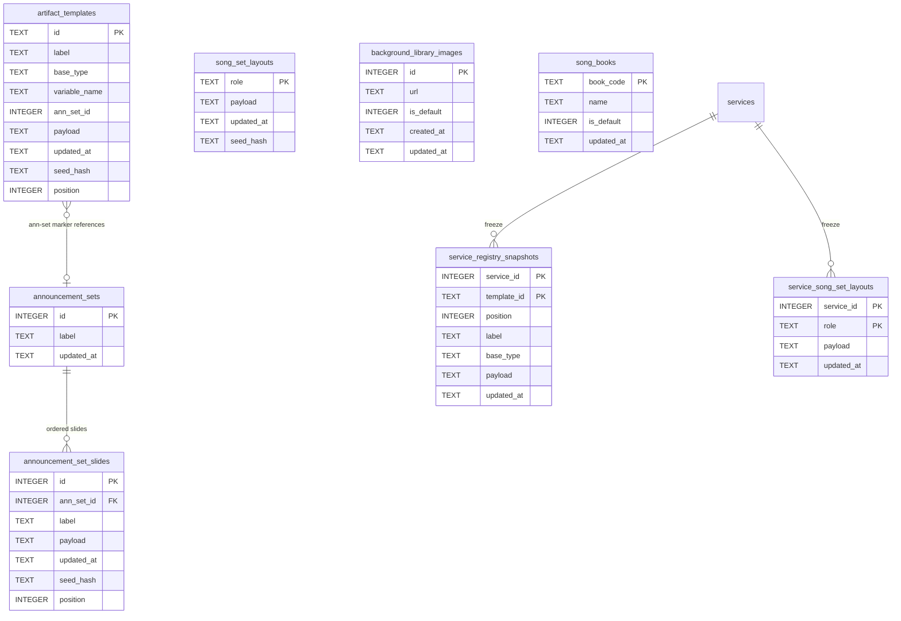
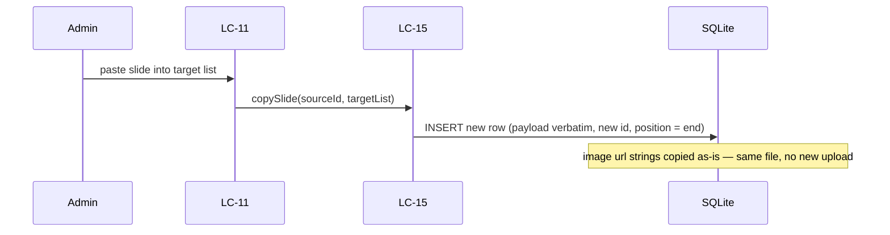

# SDD — Registry

> Generated by `.constitution/method/scripts/validate.py --generate`. MUST NOT be hand-edited.


This is what the owner reads at **G4 Component** for this component.


## What is staked

`mode: deep` · `risk_accepted: medium` · `g4_passed: True`

**risk_note:** Deck structure; deleting an entry is irreversible; not weekly content

**owns:** `ArtifactTemplate`, `ServiceRegistrySnapshot`, `AnnouncementSet`, `AnnouncementSetSlide`, `BackgroundImage`, `SongBook`, `SongSetLayout`, `ServiceSongSetLayout` · **containers:** `api`, `spa`


## Decision Summary

Registry is `/admin/artifacts` plus its API. The main spine stays one ordered list, but a spine
row is now one of exactly two server-owned kinds — `general` or a **Song Set entry** — plus an
`ann-set` marker splicing in an Admin-authored **Announcement Set** (its own ordered list of
Generals, held in its own tables). Every Song Set entry, however many Admin has defined, shares
one canvas trio (Title/Verse/Reff) that lives **outside** the spine, in its own singleton table.
Like every other registry structure, the trio is **frozen into the per-service snapshot at Service
creation** (AD-16, reversed 2026-08-20 from an earlier live-read design — see below); it is not
read live at render time.
Two more Admin-maintained collections join the component: a **Background Library** (images only,
one global default) and a **Song Book** list (one global default), both referenced by weekly/live
choices elsewhere but owned and CRUD'd here. A Predefined Field is now a `{key}` token mixed into
a text element's own content — the closed catalog vocabulary is still a code list (AD-19), not a
table, and an unrecognised token never blocks generation (BR-13); it is flagged only when the
slide is saved.

Two surfaces, unchanged: this component does not take weekly hymn numbers, Song Book choices,
backgrounds, lyric corrections, or live background switches — those are Hub/Presenter (FR-32,
FR-33, FR-34). Announcement composition lives only here now (FR-3 retired, DEC-004); the old
Hub-owned live master list (CAP-7 as-built) is retired by AD-35.

**Physical-shape decision (left open at G3, closed here):** own tables per new concept, not one
overloaded discriminator row. `artifact_templates` keeps carrying the main spine (`general` /
`song-set-entry` / `ann-set-marker`); the shared Title/Verse/Reff trio, an Announcement Set's own
slide list, the Background Library, and the Song Book list each get a dedicated table. Reasoning:
the shared trio is not spine-ordered at all (one Title/Verse/Reff exists no matter how many
entries reference it) and an Announcement Set's slides are ordered *within that set*, not within
the spine — folding either into `artifact_templates`'s single `position` column would make
`position` mean two different things depending on a row's kind, which is exactly the ambiguity
AD-15's stable-id discipline exists to prevent. One overloaded table also cannot express
"exactly 3 rows, never more" for the trio without an application-level rule doing the work a
schema could do for free.

Expensive choices carried forward and one added: seed is bootstrap + Reset only (AD-17); a
deleted row (any of the five tables below) is not revived by restart or Reset (OQ-24). **New:**
Song Set `variable_name` uniqueness and Announcement Set / marker referential integrity are
enforced on the write path in code, never by a DB `UNIQUE`/`FOREIGN KEY` constraint — the same
discipline AD-19 already set for slot identity, extended by AD-31 to the new shape.

Screens (`inventory-screen` row 7) are not an `LC` `ui-screen`: that is a `wdi-ux` slot, skipped.


## Structure — Logical Components

Rendered from `components.yaml`.

| id | Name | Type | Container |
| --- | --- | --- | --- |
| `LC-11` | Registry artifacts API | `—` | `api` |
| `LC-15` | Registry store | `—` | `api` |


### Dependency direction and responsibilities

| LC | type | Responsibility |
| --- | --- | --- |
| LC-11 | gateway | GET/PUT/DELETE artifacts, POST reset, PUT order (as-built) **+** CRUD for Song Set entries, Announcement Sets and their slides, Background Library, Song Books (new — same gateway, wider surface, not a new `LC`) |
| LC-15 | service | SQLite store + AD-15 validation + snapshot clone (as-built) **+** the five new tables' store logic, `variable_name`/referential checks, migration runner (new — same service, wider surface) |

Direction unchanged: Admin screen → LC-11 → LC-15 → SQLite. Hub/Presenter render through LC-16
(Slide plan builder), not this API. No new `LC` is registered by this design: every new HTTP
surface below is one more resource family under the existing Registry gateway (LC-11), and every
new table is one more responsibility of the existing Registry store (LC-15) — same trust boundary,
same container (`api`), same caller. Registration of any new endpoint row belongs to
`.how/_platform/inventory-api.md` / `inventory-screen.md`, owned by `wdi-blueprint`; this SDD
does not write there. Those rows were landed by that skill on 2026-08-22 (commit `0b24d5e`);
registry now owns platform rows 25–28, 31–32 and 37–69. This sentence previously pointed at a
"Drift" section that does not exist in this document.


## Inherited Constraints — the spine's invariants

Rendered from `ARCHITECTURE-SPINE.md`. A row marked **yes** binds this component by `Binds:`; the rest are shown so a miss in `Binds:` is visible, not hidden.

| id | Invariant | Binds this component | Prevents | Rule |
| --- | --- | --- | --- | --- |
| `AD-1` | Web Hub + Offline PPTX (Phase sequencing) [ADOPTED] | no | Dependency on venue internet during Sabbath services | Operators use a zero-install **Web Hub** for review/run-sheet. **Phase 1** presents on Sabbath from a downloadable offline **PPTX**. In-browser Web Slideshow / Presenter Mode are **shipped** (FR-15 / FR-16) but are **not** the hard offline Sabbath guarantee; PPTX download remains primary for venue reliability. A registry or layout change may not make Sabbath rendering depend on hub connectivity. |
| `AD-2` | Single Repository Monolith [ADOPTED] | no | Operational complexity and synchronization issues for a solo developer | The picoclaw skill integration logic, the Go API, the React SPA, and the Node PPTX worker reside in a single repository and deploy as a cohesive unit. Registry storage, the admin editor UI, and both renderers are part of that unit; there is no separate editor service. (Amended DEC-003: App Router is no longer the UI process.) |
| `AD-3` | Decoupled Ingestion and Presentation [ADOPTED] | no | Tightly coupled integrations that would make replacing the Telegram/Agent ingestion difficult | The API must expose a standard JSON interface for service generation that is agnostic to the input mechanism (Telegram/picoclaw). The presentation layer consumes this same API. Artifact templates are a presentation-layer concern; webhook/service intake JSON stays agnostic of layout templates. |
| `AD-4` | LiveServer durable paths (home PC production) [ADOPTED] | no | Ephemeral container-only data loss | Production is one always-on **Go API** process on host storage (`presenter.example.org` via Cloudflare Tunnel on LiveServer; `presenter-dev.bic.my.id` on a VPS via systemd for dev). That process ships the SPA static assets and includes a Node runtime **only** so the PPTX worker can be exec'd (AD-30). Host-durable paths for `DB_PATH`, PPTX cache, and `UPLOADS_DIR` (bind mounts or fixed host directories). Do not run multiple API processes against the same SQLite file. Operator details: `.constitution/project/deployment.md`. **First deploy happened on 2026-08-20**: `presenter-dev.bic.my.id` runs under systemd on the VPS and has been redeployed several times since. The production host (`presenter.example.org` above, a deliberate placeholder — the real production hostname MUST NOT enter this public repository) is still a 503 holding vhost with no process. This sentence read "As of 2026-07-30 no deployment exists" until 2026-08-22. That date is load-bearing rather than trivia — AD-18's total-replacement licence and AD-21's released-version freeze both hinge on *until first deploy* — so **the hinge has now tripped, and whether those two licences still apply is the owner's call, not a consequence to be inferred from this corrected date: OQ-50.** The anchor is stated here rather than inferred from this rule's tense. Announcement image refs are remote http(s) (SSRF-hardened) **or** hub-local `/api/uploads/<32-hex>.(jpg\|jpeg\|png\|gif\|webp)` resolved from disk for PPTX. Registry rows and per-service registry snapshots live in that same durable `DB_PATH`; editor image references resolve through the existing `UPLOADS_DIR` / allowlist rules, never new ad-hoc paths. (Amended DEC-003: the unit is no longer a Next.js standalone process. Docker Compose packaging was retired 2026-08-20 in favour of binary + systemd deploy.) |
| `AD-5` | Single request gate on the Go API [ADOPTED] | no | per-route authorization drift, and privilege that survives demotion, logout, or password change | The Go API has one request gate, and its path matcher **is** the authorization boundary — anything it does not match is served with no session check at all, so a new exclusion ships together with its assertion test in the same change set. The gate re-checks every session against SQLite (deleted account, role demotion, stale `token_version`, revoked `sid`) and **fails closed** if that lookup throws. Privileged routes additionally call `requireSession` / `requireAdminSession`; the cookie's `role` claim is never trusted alone. `/api/webhook` is gated by `WEBHOOK_SECRET` only — 503 when unset, 401 when wrong or missing — never by a cookie. Post-login `next` targets pass through `safeNextPath`. Every gated response carries `Cache-Control: private, no-store` and `Vary: Cookie`, because the hub is published through a Cloudflare Tunnel where an edge cache rule could otherwise serve a private response without the origin — and therefore without this gate — ever running. A signature-only check cannot see a deleted account, a demotion, or a revoked session; for one congregation on a home server the cost of a local SQLite read is accepted. The SPA has no session authority of its own. (Amended DEC-003: the gate is no longer `internal/gate`. As-built until the cutover wave still uses that file; the invariant is one matcher on the always-on API.) |
| `AD-6` | Optimistic concurrency on service edits [ADOPTED] | **yes** | an operator's edit silently erased by a late correction (last-write-wins) | every service mutation carries the client's `updated_at` as a precondition; a stale value is rejected with HTTP 409 and the client re-reads before retrying. No write path may bypass the precondition. This covers registry writes and the **Sync Artifact** action of AD-16 — the shipped shape is `expectedUpdatedAt` / `RegistryStaleError` in `src/lib/registry/store.ts`. |
| `AD-7` | `buildSlidePlan` is the only slide-order source [ADOPTED] | no | divergent slide order or content between what the operator controls and what the congregation sees | `buildSlidePlan` is the single source of slide order and content for every surface. No surface recomputes order from service fields or keeps its own ordering logic; a rendering or ordering change lands in the plan, never per-surface. AD-12's Fat Payload specializes this rule; AD-16 changes only where the plan reads its templates from, never that there is one order source. |
| `AD-8` | Image references resolve only through shared safety helpers [ADOPTED] | **yes** | a new surface reintroducing SSRF or unsafe content through its own laxer resolver | image references resolve only through the shared helpers in `src/lib` — allowlisted remote http(s) and hub-local `/api/uploads/<32-hex>.(jpg\|jpeg\|png\|gif\|webp)` for announcements, and registry `/assets/...` refs for Artifact templates. A new reference vocabulary extends an existing helper or adds one alongside them with the same fail-closed default; no unit ships an inline resolver. The canvas editor introduces no second resolver and admits no `data:` or arbitrary remote URI. |
| `AD-9` | Schema evolution through startup DDL only [ADOPTED] | no | two sources of schema truth between a developer machine and a fresh production container | schema changes go through the Go API's startup DDL when it opens SQLite. No migration framework (Prisma or otherwise) is introduced without an explicit product decision recorded in this spine. Registry tables are created on that same path. **The bootstrap path is shared, and the division is fixed:** this rule owns *schema* — the shape, e.g. adding a column — while **AD-18** owns *value* migration — the contents, e.g. rewriting every row's `base_type`. Neither licenses the other's mechanism: a value change is not a reason to add a framework, and a schema change is not a reason to rewrite data. (Amended DEC-003: not the Next.js `getDb` path.) |
| `AD-10` | One presenter sync channel, client-side only [ADOPTED] | no | a split sync topology where the projector follows one controller and ignores another | presenter↔projector sync goes through the single `@/lib/present-channel` `BroadcastChannel` module; no surface opens its own channel name or message shape. No server realtime channel (WebSocket/SSE) is introduced unless product direction changes — keeping the venue path independent of hub connectivity, per AD-1. A registry edit must not add a second channel to push template changes to a live projector. **Every message carries a plan identity** — a fingerprint of the snapshot and resolved announcement set that produced the deck — and a receiver whose own identity differs **refuses to follow the index** and says so on the room-facing screen rather than rendering a slide it cannot vouch for. Presenter and projector are two independent `force-dynamic` renders, each calling `buildSlidePlan` at its own moment, so a bare `index` silently means different slides on the two screens the instant anything structural changes underneath them; since this rule forbids a surface inventing its own message shape, the identity has to live in the shared shape. |
| `AD-11` | Artifact Registry Storage *(was `epic-16 AD-1`)* [ADOPTED] | no | Data loss on ephemeral container filesystems, file-lock concurrency issues, and a seeder that overwrites administrator edits or leaks private seed content. | The live Artifact Registry is stored in SQLite on the durable `DB_PATH` (AD-4). Filesystem JSON serves exclusively as a startup seed: startup inserts missing template IDs and **never** overwrites persisted administrator edits. Canvas Reset discards unsaved in-memory edits back to the last Saved state. Seeded elements are ordinary editable and deletable elements that an administrator may freely modify or delete; they are not locked against removal or modification on save (DEC-014). The seed is two-layered — `data/local/default-registry.json` is git-ignored and **takes precedence over the shipped `data/default-registry.json` example whenever present**; a seeder that reads only the shipped example breaks the mechanism that keeps congregation data out of a public repository. |
| `AD-12` | Slide Plan Data Flow (Fat Payload) *(was `epic-16 AD-2`)* [ADOPTED] | **yes** | The Web (`SlideView`) and PPTX renderers from performing independent database lookups or maintaining their own diverging layout logic. | `buildSlidePlan` outputs a fully hydrated AST (Fat Payload) with exact rendering coordinates, fonts, colors, and resolved text content. Specializes AD-7: the plan is the single order *and* layout source, so a renderer never **reads data from** the registry itself. Importing a shared *helper* that happens to live under `src/lib/registry/` is not such a read — `pptx.ts` importing `isBundledAssetRef` from `registry/asset-safety` is the AD-8 resolver this spine requires, not a data path. |
| `AD-13` | Canvas State Boundary *(was `epic-16 AD-3`)* [ADOPTED] | no | Two-way data binding lag, stuttering drags, and unnecessary React re-renders. | The Canvas Editor uses an Uncontrolled Wrapper pattern. Fabric.js owns the canvas state exclusively; React reads it **only on save**, through `serializeCanvas` over `canvas.getObjects()`, projecting into the registry's own element schema. Not `canvas.toJSON()`: Fabric's serialization format is **not** `ArtifactLayout.elements`, so a second editor surface built on `toJSON()` would fail AD-15's validator on every write. The projection into the registry schema is the boundary, not the canvas library's own format. |
| `AD-14` | Global Template Administration *(was `epic-16 AD-4`)* [ADOPTED] | **yes** | Per-service template drift and operator-level mutation of every service's visual contract. | Artifact templates are global across services. Registry management UI and APIs are admin-only and re-check the current account role from SQLite — a specialization of AD-5, not a separate authorization scheme. `/admin/artifacts` and `/api/admin/artifacts/**` are inside the AD-5 matcher, and adding a registry route outside it requires the same-change-set test update AD-5 demands. Downstream planners and renderers read the registry through server-side modules rather than the management API. |
| `AD-15` | Stable Layout Identity *(was `epic-16 AD-5`)* [ADOPTED] | **yes** | Unit-specific renderer drift, required-placeholder deletion, and unsafe image references reaching a renderer through an unvalidated back door. | Layouts use a fixed 16:9 canvas with normalized percentage coordinates and stable template/layout/element/placeholder IDs. Coordinates may extend beyond the canvas to preserve intentional source-deck clipping. **Every** write into the registry is untrusted and must pass the same structural and image-reference validation before persistence — the canvas save API, the startup seeder, and any import or asset-extraction script alike. Image refs validate through the shared helper required by AD-8; no write path ships its own check. |
| `AD-16` | Service-Bound Registry Snapshot *(was `epic-16 AD-6`)* [ADOPTED] | no | a live registry edit shifting the structure under a service an operator is preparing right now, and a weekly value entered against one structure being orphaned by a later structural change — and, in the other direction, a service with no way to be brought up to date. | Creating a worship service **clones** the ordered live registry — order, kinds, labels, layouts, placeholder bindings, **and the administrator override records of AD-22** — into a **service-bound snapshot** on the durable `DB_PATH` (AD-4); creation is the only freeze event. The clone is of the *rendered* structure, so anything AD-22 keeps outside the layout travels with it; an override left out of the clone would either never reach the deck or reach it from outside the freeze, and both defeat this decision. A service's plan, Presenter, slideshow and PPTX read that snapshot; a live registry edit reaches an existing service **only** through the explicit **Sync Artifact** action, which replaces the snapshot destructively. Sync is permitted on **any** service, carries the service's `updated_at` precondition (AD-6), and may not alter the service's entered data (*State* convention) — "destructive" means it replaces the snapshot, never that it may overwrite a service someone else has moved underneath it. **Sync is a structural write and is therefore admin-only**, re-checking the role from SQLite exactly as AD-14 requires of every registry management surface, even though it is reached on a service route that `internal/gate` gates for any signed-in account; its route ships with the `tests/go-http-gate.test.mjs` assertion AD-5 demands and an in-route `requireAdminSession`. An operator may see that their snapshot is stale and *request* a sync; they may not perform one. Without this, "permitted on any service" and AD-14's surviving admin-only clause read as licence for an operator to freeze a half-authored layout into the service that presents in fourteen hours — this decision's own *Prevents*, arrived at from the other direction. The clone and the re-clone are write paths and validate under AD-15 like every other. **Announcement membership is not cloned:** the Announcements master list stays live and reaches an existing service at render time (CAP-7). **It is nonetheless scoped per service (`service_id`), matching the clone boundary everywhere else in this decision** — "not cloned" means this week's flyers may still change after the structure is frozen, never that one list is shared across services. The distinction is invisible while only one service is being prepared and decisive the moment two are open at once — a stale service reopened for a correction while next week's is being built — at which point an unscoped list bleeds one service's images onto another's deck. The shipped `announcement_items.service_id` is nullable, so both readings are currently expressible; this rule picks the scoped one. **A later structural change obliges nobody to keep an older snapshot renderable** — what the snapshot protects is the service's entered supporting data, not its ability to regenerate a past deck. The snapshot is the sequence *input*: `buildSlidePlan` remains the single source of order and layout (AD-7, AD-12), and no renderer reads a snapshot directly any more than it read the registry. **One bounded exception, stated as an exception rather than argued away — pre-existing services.** A service created *before* this model ships has no snapshot and renders from the live registry until its first Sync, which is a clone-in-place; from that moment the rule above governs it without qualification. So *"creation is the only freeze event"* holds for every service created under this decision, and the no-snapshot state is a **one-way migration path into** the decision rather than a second mode inside it: nothing may create a new service without a snapshot, and no code may re-enter the state once left. It is called out because every service in the database on day one is in it — `spec-artifact-registry-authoring/SPEC.md:89` assumed exactly this and an earlier draft of this rule forbade it, which would have left three stories free to answer it three ways. The Epic 20 data transition (AD-21) may instead clone a snapshot for every existing service and close the exception outright; that is the preferred landing, and either way the state is finite and dated. **Naming caution:** the shipped `RegistrySnapshot` type (`src/lib/artifacts/registry-snapshot.ts`) means *"the live-registry map assembled for one plan build"* — a different thing from this decision's per-service durable freeze, and the two must not be conflated. |
| `AD-17` | The Seed Is a Bootstrap, Not a Correction Channel *(was `epic-16 AD-7`)* [ADOPTED] | **yes** | an administrator's delete, rename or reorder being silently undone by an unrelated restart. A deleted row leaves no evidence behind, so anything that supplies "missing" IDs cannot tell *deleted on purpose* from *never existed here* — it resurrects the row forever. | The seeder initialises data **from zero only** — first install, first run — and is gated by a marker in `settings`. It is never a gap-filler: after it has run, the administrator owns every row that exists, and the ordered registry is authored data rather than shipped data kept in sync. A gap in a database that already holds data travels as a versioned data migration (AD-18, AD-21), never as a re-seed. **The filesystem seed is read at exactly two moments — the first-boot bootstrap, and an explicit per-template Reset — and at no other.** In particular **no read path may substitute a seed template for a row the database does not hold, and none may substitute one for a row it holds but cannot parse.** An ordered registry of N rows produces a deck built from those N rows and no others; a template id the database does not hold does not exist, and a row whose payload will not validate **fails closed** — no layout, logged with the id and the reason, the same posture AD-5 and AD-8 already take. Both halves matter and the second is the easier one to leave open: `registry-snapshot.ts` **used to** substitute seed content in **one** loop for absent and corrupt rows alike (`parseRow` merely returned `null`, so a corrupt row reached that loop indistinguishable from a missing one), so a rule that closed only the *absent* case left shipped example content silently standing in for an administrator's real layout the moment one row was malformed. That loop is the hazard this Rule forbids; AD-11 records it closed 2026-08-07 (Story 20.1). Closing only the boot door is what let a deleted slide re-materialise into the deck on every plan build, with `rejected.delete(seed.id)` suppressing even the log line. `tests/registry-reseed.test.mjs`'s assertion that a missing row is re-inserted is **inverted, not deleted**, and a second assertion pins that a deleted row does not reappear in a built plan. Restoring shipped content stays possible as an **explicit administrator action** — Reset-from-seed per template, per AD-11 — never as a side effect of a restart, and never as a bulk re-seed of a live database. |
| `AD-18` | Vocabulary and Value Changes Travel as Explicit One-Time Migrations *(was `epic-16 AD-8`)* [ADOPTED] | **yes** | a shipped vocabulary change reaching persisted rows through boot-time re-seed (which AD-17 removed) or not reaching them at all — and the opposite failure, a migration framework arriving by the back door. | AD-9 fixes *schema* evolution on the startup DDL path and is silent on **value** migration; this decision fills that silence rather than weakening it. A shipped change that must reach rows already persisted travels as an **explicit, one-time migration** on the startup path, versioned per AD-21. It is not a migration framework and AD-9's prohibition stands: no Prisma, no versioned migration directory, without an explicit product decision recorded in this spine. **Until first deploy** no production rows exist, so Epic 20's seven-`base_type`-to-three-kind collapse ships as a **total replacement** — no backward compatibility, no migration over live rows — folding into production data version 1 (AD-21); at first deploy that licence ends, and the same change would need a migration over live `artifact_templates` rows. A migration operates on the **live registry** and does **not** rewrite service snapshots — structure reaches an existing service only through Sync Artifact (AD-16), so a migration that rewrote snapshots would be a second structural channel. An older snapshot may therefore stop being renderable, which AD-16 accepts; what must survive is the **entered data**. |
| `AD-19` | A Cross-Boundary Key Is a Server-Owned Value the Administrator Cannot Edit *(was `epic-16 AD-9`)* | **yes** | two independently-built units agreeing to disagree about a key — the registry surface and the worship-service settings form picking different handles for the same SongSet slot, and the canvas editor's insert list drifting from what the validator actually admits. | a key referenced across a boundary is **server-owned vocabulary, enforced on every write path**, and it is never administrator configuration. Three properties make it unambiguous rather than merely convenient: the key is **never administrator-editable**, **at most one registry row may carry each slot identity**, and it is a **semantic name, never an ordinal** (`songset1` re-imports the positional reading this decision exists to remove). The recognized set is **closed and complete** — `general`, the four `songset-*` slot identities, `announcement`: six keys over three kinds, and no write path admits a seventh; the Placeholder Catalog's admitted keys are the same class of value and get the same treatment AD-8 and AD-15 gave image references, so *"the UI cannot invent a catalog key"* (CAP-4) is a property of the registry rather than of one client. **The value a key names has exactly one persisted home** — for a slot binding that is the service's own entered data, and the identity is a *key into* it, never a second copy; otherwise a webhook correction (which AD-3 forbids knowing slot keys) rewrites one home while the settings surface owns the other, and the deck renders one hymn while the run sheet and the edit form show another, with no 409, no log, and no screen on which both values appear. A binding whose slot row has been deleted is **inert, not an error**, and the entered number survives in the service's own data. Reordering rows changes the presented sequence (CAP-8) without touching a binding, and renaming a label cannot touch one either. Every spelling here is a persisted binding key, so changing one later is the versioned data migration AD-18 and AD-21 govern, and extending the vocabulary — a fifth slot, a fourth kind — is a code-plus-tests change. |
| `AD-20` | The Planner Injects Nothing the Registry Did Not Ask For [ADOPTED] | **yes** | a liturgical decision requiring a code change and a deploy, and the planner keeping a second, invisible source of deck content alongside the registry. | every slide in the deck originates from an ordered registry entry. `buildSlidePlan` **applies** rules; it does not **hold** them. Fixed liturgical content — the standing responses `#671` and `#684`, the closing *We Have This Hope* — is authored as **General** entries and edited by hand, never injected by the planner and never computed from the hymnal. Because a General generates no title slide, the `skipTitle` mechanism is **removed rather than migrated**: there is nothing left to suppress. It shipped at five sites and Story 20.1 deleted them — a removal, not a compatibility shim, and `slide-plan.test.mjs:231` greps the tree to keep it deleted. Changing or adding a liturgical song is a registry edit. |
| `AD-21` | Persisted Data Carries One Version Number, and Unreleased Transitions Compact Into One [ADOPTED] | no | two builders keying the same change incompatibly — one adding a per-change boolean, another bumping a counter — and a production database accumulating one transition per code change, so that its version history tracks development activity instead of releases. | All persisted data shares **one monotonic version number** in `settings` — one counter for the whole database, never one per table or per domain, so that "which version is production on" has a single answer. A change that must reach data already persisted is declared **explicitly while it is being coded**, as the transition from version *n* to *n+1*; it is never inferred at deploy time. **An unreleased transition is not yet history and may be rewritten:** the whole batch of unreleased transitions is compacted into a single transition before it reaches production, and developer databases are **reset** to the compacted version rather than migrated through the steps it replaces. **A released version is frozen** — once a version has reached production it is never renumbered, re-cut, or folded into another. Small steps are a development convenience and stop at the merge; production sees one transition per release. AD-17's seeding marker and this counter are **distinct**, and neither substitutes for the other: the marker records that bootstrap ran, the counter records which data version is persisted. This is a counter and a convention, not a framework: AD-9's prohibition stands. |
| `AD-22` | Authoring Authority Is Fixed per Kind: Free Canvas, Bounded Config, or Bound to a Set | **yes** | the canvas editor and the validator disagreeing about what an administrator may author on a non-General entry — one opening a free canvas on a SongSet row and admitting an extra or rebound placeholder, the other refusing it — and CAP-3's *"General only"* living nowhere but in a capability statement. | authoring authority is fixed per kind, and no surface widens it. **`general` is free canvas:** the administrator composes it from anything, including Placeholder Catalog keys (AD-19). **A `songset-*` row gets a bounded configuration surface, not a canvas:** exactly two background images — one for its title layout, one for its lyric layout, which verse and refrain share — plus font style and font size. Both background references resolve through the shared helper AD-8 requires: this surface is not the canvas editor and introduces no second resolver of its own. Layout composition itself is developer-owned seed data and is not exposed there; it stays registry data hydrated into the plan (AD-11, AD-12), never a coordinate held by a renderer. **Administrator-configured values persist outside the layout**, as an **override record keyed by row and field**, re-applied over the developer layout at hydration: the layout JSON stays developer-owned in full and a migration may replace it wholesale, the override record stays administrator-owned in full and no migration, Reset, or re-seed writes it, and a bounded surface that writes *into* the layout is refused by the validator on every write path (AD-15). An earlier draft left the encoding as "a schema call, not an invariant" — an override record beside the layout *or* a marked field inside it. The two were never equally available: the shipped validator rejects unknown keys against a closed `ALLOWED_LAYOUT_KEYS`, so the in-layout marker cannot ship without a registry-contract change this decision does not authorise, leaving only the unmarked shape — background written straight into `layouts.*.backgroundImage`, font into element `style`, indistinguishable from developer output. Then this decision's own migration clause replaces those layouts and **every background and font size the administrator chose reverts to the shipped default, on all four slots, silently, before anyone opens the hub** — AD-11 keeps no second copy and Reset would discard them too, so the only record of them was the layout just overwritten. The row's placeholder set and its SDAH slot binding are server-defined: nothing may be added, removed or rebound, and the validator refuses it on every write path (AD-15). **An `announcement` row is bound to the Announcements master set**, whose membership is not registry-authored at all (AD-16, CAP-7). Only those two kinds **expand** — a SongSet row into its title and lyric slides, an `announcement` row into N full-bleed images; a General is one slide. Because AD-17 reads the seed once, a developer's later change to a SongSet layout reaches a deployed database only as a versioned data migration (AD-21) — never by restart, and not by Reset. **Reset restores the shipped *layout* and leaves the override record untouched**, which is the whole point of keeping the two apart: before the override record existed, Reset would have discarded the administrator's backgrounds and font sizes along with the layout, and there would have been nowhere to recover them from. A Reset that also cleared administrator configuration would need to say so and does not. |
| `AD-23` | Transition Style Is One Value, Described Once, Consumed Identically [ADOPTED] | no | a deck that fades in PowerPoint and cuts on the projector — the same slide sequence behaving differently on the two surfaces the congregation and the operator each watch | transition style is **one app-wide value** in `settings` (`slide_transition`), and each style is described **exactly once**, in `src/lib/transitions.ts`, carrying both its PowerPoint element and its browser animation parameters. Neither renderer holds either half: `pptx.ts` and the browser surfaces all import that table, and **no surface keeps a default of its own** — that, not immutability, is the invariant. The value reaches each surface directly from `settings`, never through the plan (`buildSlidePlan` has no transition concept at all). There is no per-service override. The presenter **may** override the style for the **live browser session**, and that override travels through AD-10's channel so presenter and projector never disagree with each other (`PresenterOperator.tsx`); a PPTX already generated keeps the `settings` value it was built with, because a downloaded file cannot be re-styled after the fact. Adding a style means adding a row in that one table — and only styles that survive a plain `<p:transition>` child without the `p14` extension namespace qualify, so nothing silently degrades to "no transition" when the deck is opened elsewhere. This ratifies a convention the code already states in its own header; it is recorded here because FR-7 (`prd.md:179-180`) makes it a requirement and `prd.md:304` states the cross-surface obligation in as many words — *"the browser transition matches the Deck's configured transition style (FR-7); the two are chosen once and never diverge"* and `docs/architecture.md:61` — a declared source of this spine — used to contradict it by hardcoding a crossfade. That source was reconciled on 2026-07-30 and now states the configured value and cites this `AD`, so the contradiction is closed; the decision stays because FR-7 still needs an owner and because two renderers plus two browser surfaces is exactly the shape that diverges without one. |
| `AD-24` | Operator Chrome State Is Browser-Local, and the Room-Facing Surface Is Closed to It [ADOPTED] | no | one hazard with three faces — a preference landing in `settings`, where it silently becomes *every* operator's, or a deck-affecting value landing in `localStorage`, where AD-4's durability, AD-6's concurrency and AD-18/AD-21's migration rules cannot reach it; the root client boundary migrating upward until the whole app is a client tree; and a client-persisted value that **paints** becoming a third structural channel to the congregation's screen, alongside `buildSlidePlan` (AD-7) and the BroadcastChannel (AD-10) | **application state reaches one of three homes and *who must agree on it* picks which.** **Persisted-shared** lives in SQLite on the durable `DB_PATH` (AD-4) as an app-wide `settings` value, the way AD-23 keeps `slide_transition` because both renderers and both screens must agree on it. **Persisted-local** lives in that browser's `localStorage` and nowhere else — not in SQLite, not under `DB_PATH`, and therefore **not backed up** — the way the theme does, because nothing but this operator's own eyes depends on it. **Ephemeral-shared** is not persisted at all and travels over AD-10's channel. The tiers are not interchangeable in either direction. **A chrome provider mounts only on the operator shell.** The SPA therefore has two sibling shells: the operator shell owns metadata, fonts, `ui_locale`, and theme; the projected shell owns the unchanged room-facing URLs and applies the five shell claims exactly: `html.backgroundColor = #000000`, `html.overflow = hidden`, `html.scrollbarGutter = auto`, `body.backgroundColor = #000000`, and `body.overflow = hidden`. It carries no operator provider or theme state. Projected not-found and error screens render generic `#000000`/`#FFFFFF`, vertically scrollable output with no operator link or detail. **The room-facing surface is closed to operator chrome, in any form, under any setting:** the projector, the web slideshow and the PPTX never read it. Every future browser page intended for congregation or OBS output belongs on the projected shell; putting one on the operator shell is an architectural violation, not a story-level placement choice. The projected render tree paints in **literal colours**, carrying no theme token and no theme-coloured edge; a full-screen room-facing client also claims the same shell through one per-document projected-shell helper as a hydrated defensive layer, never as the owner of first paint. The PPTX is closed *structurally* rather than by browser enforcement — it is generated by the worker from a plan the Go API already assembled and cannot read browser state at all. Registry payloads rendered by the projected tree still validate under AD-15; source-tree edits are governed by this closure gate, not by the registry validator. As-built: Vite SPA operator/projected branches plus `spa/projected.html`; `tests/theme-chrome.test.mjs` pins the two shells. |
| `AD-25` | A Shipped Reference Corpus Is a Projection of Its Committed File [ADOPTED] | **yes** | two corpus families answering one architectural question two different ways — and, in the two directions that question fails, a corrected corpus that cannot reach the table at all, or one that reaches it and leaves the withdrawn rows standing | A **shipped reference corpus** — a committed data file the product carries so that a fresh clone resolves a verse and a hymn offline — is **developer-owned data with exactly one writer**, and the committed file is authoritative. Its tables are a **projection** of that file: startup reconciles each table to the corpora it ships, and the reconcile is **complete within the corpus code it names** — a row carrying that code and absent from the file is removed, and a row belonging to a sibling corpus is never touched. Whether startup detects a difference before doing the work — a per-corpus fingerprint, on the `artifact_templates.seed_hash` precedent — or simply reconciles every boot is a story-level call, bounded by the two properties this rule does fix: **a corrected corpus reaches the table with no operator step, and the table does not outlive the file.** That call is also where a growing corpus set is paid for, and the cost lands at **boot**: the first KJV seed writes 31,102 rows in ~258 ms, so reconciling several translations unconditionally on every start is the shape that turns a restart into a wait — on the morning AD-1 exists to protect. **Rebuilding rows is safe to consider, which is not obvious and was checked rather than assumed:** nothing anywhere references the surrogate `hymns.id` or `bible_verses.id` (grepped across `src/` and `tests/`, 2026-08-01), because a service persists a hymn *number* and a passage a *reference*. A reconcile may therefore delete and re-insert without dangling anything — and if that ever stops being true, this sentence is the one to come back to. This is a **third channel, and it is neither of the two it sits between.** It is not AD-17's bootstrap: a bootstrap runs once precisely because an administrator owns what comes after it, and nobody owns a corpus row. It is not AD-18/AD-21's value migration either: a migration exists to carry a change into values somebody persisted deliberately, and every value here is derived from a file already in the commit. AD-9 still owns the **shape** of these tables and AD-18 still owns **value** migration everywhere else; what this decision claims is narrower than it may look — a table whose entire content is derived from a committed file has no values of its own to migrate. **One consequence to take rather than rediscover: a rename inside a projected table is a rebuild, not a migration**, which is what makes AD-26's three renames cheap. **The closure is what makes all of this safe, and it is a property of today's code rather than a promise.** No administrator or operator write path into a corpus table exists — verified 2026-08-01, zero `INSERT` / `UPDATE` / `DELETE` against `hymns`, `bible_verses` or `bible_books` anywhere outside `src/lib/db/index.ts`. **Adding one reopens this decision before it ships**, because from that moment the reconcile is exactly the resurrection AD-17 forbids and a corpus becomes authored data carrying AD-17's, AD-6's and AD-21's obligations in full. A corpus row is therefore never where a choice is persisted; a choice *about* a corpus — which one is the default — is a `settings` value under AD-24, keyed by the corpus code AD-26 fixes. **Where it runs on the `getDb` path:** after data migrations, so a migration never observes rows the reconcile wrote in the same boot — AD-21's own reasoning for placing the bootstrap last, applied to a fourth step AD-21 could not have named. Its order relative to AD-17's bootstrap is free, because the two touch disjoint tables; that is stated so the fixed sequence in AD-21 is not read as forbidding a fourth step. |
| `AD-26` | A Corpus Is a Registered Entity: Its Code Is the Key, Its Locale Is an Attribute | no | one corpus code meaning two different books depending on which locale directory it was found in — and the mirror failure, a locale reaching a `WHERE` clause and quietly turning a view default into a data filter | Every installed corpus is a **registered entity** — one row in `bible_translations` or `song_books`, carrying its code, display name, **locale**, licence and provenance. **The corpus code is globally unique across locales, and it is the cross-boundary key**: the class of value AD-19 governs, server-owned and never administrator-editable. `bible_verses.translation_code`, `hymns.song_book_code`, `default_bible_translation`, `default_song_book` and the corpus filename all carry that one code. **Locale is an attribute of the corpus, never part of a key and never part of a lookup.** That is what makes FR-24's never-filter rule **structural rather than disciplinary**: because no key contains a locale, no read path can *need* one, so a `WHERE locale = …` on a corpus lookup is not merely a product violation but a predicate that cannot be necessary. A listing endpoint returns every installed corpus with its locale; `default_data_locale` decides only what a picker opens on. **The file declares; the path merely locates — for the bible family, in full, and for a song book, only up to and including its bootstrap.** A registry row is derived from the corpus file's own declared metadata under AD-25, never from its directory — the loader already refuses a file whose declared code disagrees with the code it was loaded as (`src/lib/corpus.ts:91`, `:176`), and it refuses on the same terms a file whose declared locale disagrees with the directory holding it. Without that second check, copying `data/en/song-book/sdah.json` to `data/id/` gives one code two locales and the registry keeps whichever booted last. **Superseded by AD-36 (2026-08-20, DEC-005), for the `song_books` row and that row alone, the moment its one-time bootstrap has run:** ~~"a registry row is derived from the corpus file's own declared metadata"~~ stops being true of an installed song book — AD-36 makes that row administrator-owned data from bootstrap onward, so a later edit to the committed file's declared name, locale, licence or provenance no longer reaches it at all, and correcting it live is an explicit numbered migration, never a re-derivation on the next boot. Both refusal checks in this paragraph — code-disagreement and locale-disagreement — still gate the bootstrap itself and are untouched; what dies is only the promise that the row keeps tracking the file **after** that bootstrap. **Neither refusal check has anything to gate for an admin-created book (AD-36 Extended):** there is no file and no directory, so "a file whose declared locale disagrees with the directory holding it" has no subject to refuse — the check is inapplicable, not silently passed, because that row's bootstrap never reads a file at all. That row still carries this rule's full shape intact — code, name, **locale**, licence, provenance, the same five fields as any other song book — sourced from the Admin at creation instead of a file's declared metadata; AD-36's Extended clause (OQ-39 closed, 2026-08-20 owner ruling) states that positively, closing the gap this supersession sentence left open rather than leaving the remaining three fields — locale, licence, provenance — an open hole for the admin-created case (`book_code` and name are already Admin-supplied at creation; only those three were ever in question). `bible_translations` carries no such carve-out: for the bible family this sentence, and the two refusal checks, hold exactly as written, on every boot, with no qualification. **The declared field is spelled `locale`**, matching the path segment, the settings keys and this rule; both committed files ship it as `language` today and are corrected in the same change set, because a persisted cross-boundary key gets one spelling chosen once (AD-19) and the files are the source of record, so it is free now and a migration later. **The renames belong to this decision rather than to housekeeping:** `bible_verses.translation` → `translation_code`, and `hymns.book_code` → `song_book_code` because `book_code` names a *song* book in one table while `bible_books` makes *book* mean a Bible book in another — one word, two entities, ambiguous the moment one person reads both families. `isKjvCorpusEmpty()` → `isBibleTranslationEmpty(code)` is the same rule reaching a function signature: **no corpus code survives as a literal in a read path.** All three are rebuilds rather than migrations, per AD-25. **Terminology is fixed, and it stops deliberately at one place:** *bible-translation* and *song-book* are the container terms in paths, tables and prose, while **`hymn` stays the entry term** — the `hymns` table, `/api/hymns`, and the `resolvedHymns` / `failedHymnNumbers` webhook fields keep their names, that last pair being an external contract an outside caller owns and AD-3 keeps agnostic. |
| `AD-27` | Book Identity Is Canonical and Translation-Independent; Every Name Belongs to a Translation | no | one table with two owners — the last translation seeded renaming every book for every reader — and *"the same passage in another translation"* ceasing to be one query | A book has **one canonical identity, stable across every translation, carrying no display text at all.** Every name and short name **belongs to a translation** and is stored against it. `bible_verses.book_id` points at the identity, which is what keeps a passage one lookup in any translation and lets a translation be added or removed without touching a verse's identity. **A corpus file maps its books onto that identity; it does not define it.** The canonical set is fixed by the application, and a corpus naming a book the canon does not hold is **refused, with the book named** — the fail-closed posture AD-5, AD-8 and AD-17 already take, chosen over a silent partial import because a translation missing four books resolves nothing for them while saying nothing about why. **Two consequences, stated rather than left to be discovered.** The canon that ships is the 66-book Protestant one, so a translation carrying deuterocanonical books is refused rather than truncated, and admitting one is a code-plus-migration change (AD-18, AD-21) rather than dropping a file into `data/`. And **input tolerance is the matcher's concern, never the corpus's**: a translation owns its *names*, while how forgivingly an operator's typing is compared against them — case, punctuation, abbreviation, singular against plural — is the matcher's. The two collapse easily and the collapse is one-way: the moment a corpus file is where an alias goes, names are corpus-owned in name only, and every translation added afterwards inherits the job of listing every way somebody might type its books. **Two things this clause originally said are superseded by AD-28 (2026-08-01), and they are struck here rather than quietly edited out, because this decision is unbuilt — which is exactly the condition under which a half-reversed rule reads as a whole one.** It said the matcher was ~~one server-side matcher **shared by every translation**~~; it is one implementation carrying a **scope**, and on an operator surface that scope is the chosen translation alone. And it treated the four kinds of tolerance as uniform; ~~abbreviation~~ is not — it carries a language and is scoped to a translation, while the other three do not. **The prohibition itself is untouched and AD-28 rests on it:** an alias still never lives in a corpus file. |
| `AD-28` | The Reference Matcher Is One Implementation Carrying a Scope, and Tolerance Carries a Language | no | cross-language input returning **through the matcher** once the corpus door is shut — and the mirror failure, the operator surface and the rundown drifting into two resolution rules because their scopes differ | there is **one matcher implementation and the scope is an argument to it, never a fork**. On an **operator surface** the scope is the **chosen translation alone**; on the **rundown** it is **every installed translation**, because a Telegram sender picks none. That scope is a **required, registry-validated corpus code supplied per request** — an unrecognised or absent one is **refused**, and *all-installed* is a property of the rundown surface and never a fallback, because a default silently reinstates the cross-language operator input this decision removes. It is a per-request parameter rather than the `settings` default, since FR-24's never-filter rule lets an operator browse a corpus outside the default locale. **Tolerance that carries a language is scoped with it:** case, punctuation and singular-against-plural are comparison rules owned by the matcher and unscoped, while a **non-prefix alias belongs to a translation** and is **matcher-owned data keyed by translation code, never a corpus-file field** — which is how AD-27's prohibition and this decision's finding hold at once rather than trading off. Resolution compares against **corpus-supplied names** rather than a regex guessing where a book name ends, and an **ambiguous reference is unmapped input (NFR-5), never a guess** — the fail-closed posture AD-5, AD-8, AD-17, AD-25 and AD-27 already take, and it belongs with them because a guess here is silent and reaches the congregation's screen mid-service. Ambiguity is **not scoped to the cross-translation case**: it is measurably intra-translation on the single corpus shipping today, so a builder reading a cross-translation-only rule in a single-corpus install would reasonably take the first match, which is the mis-split this clause exists to prevent. |
| `AD-29` | The Projector Reports Its Own Liveness and Nothing Else, and One Predicate Decides It [ADOPTED] | no | the reverse direction on AD-10's channel becoming a second controller — a projector whose messages the presenter *follows* rather than merely observes — and the mirror failure, two liveness mechanisms with two verdicts, so the operator's surface reports *lost* while acknowledgements are arriving, or *live* while the window is shut, with nothing saying which was authoritative | a projector→presenter message may report **the sender's own condition and nothing else, ever** — the moment one carries a value the presenter would adopt, the projector is a second controller and AD-10's *Prevents* is live again. The observing side is bound the same way: receiving one may move the **liveness verdict** and nothing else. Exactly **one** acknowledgement variant exists, in `@/lib/present-channel` and nowhere else; it carries **no shared state of any kind**, which is what puts it outside that file's header contract rather than in tension with it, and it is **idempotent by construction**, so no sequence number or request/response pairing may be layered over it. The **projector window is its only sender** — admitting a second is a new decision, not an implementation choice, because a state-free message cannot say for itself who sent it and a slideshow tab answering would report a live projector while the second screen is dark. **Liveness is one predicate:** the verdict lives in one evaluator and every signal — the acknowledgement, the retained handle's `closed` read, and any later `pagehide`, `visibilitychange` or second handle — is an **input to it**; a second holder of liveness state is a defect however it is spelled. Its precedence is **asymmetric on purpose**: an acknowledgement is authoritative for `live` whatever the handle says, a handle reading `closed` is authoritative for `lost` immediately without waiting out the freshness window, **neither is authoritative for the other**, and a `null` or stale handle is **no information** rather than evidence of death. Where the predicate cannot be certain it resolves to **`lost`**, because a false `live` is unrecoverable within the service while a false `lost` self-clears on the next acknowledgement — and *no evidence yet* stays a **distinct verdict** from *evidence stopped*, so a presenter opened without a projector is silent rather than alarmed. The heartbeat interval and the freshness window are **one pair, exported once from the evaluator's own module and consumed by both windows**, because two units each picking an honest number independently is exactly how a healthy second screen gets reported dead for the rest of a service. |
| `AD-30` | Process roles: Go API, React SPA, on-demand PPTX worker [ADOPTED] | no | a Node.js HTTP server remaining resident in production (the Next.js shape); the PPTX worker opening SQLite or assembling a plan; the SPA talking to SQLite | The Go API is the only always-on server: it owns SQLite, assembles the slide plan, and serves JSON (and, in production, the SPA files). The Operator UI and projector are a React SPA that MUST NOT open SQLite. PptxGenJS runs only as an on-demand Node child that receives an already-finished plan, draws PPTX, and exits; it MUST NOT stay up and MUST NOT open SQLite. Development MAY use a SPA bundler and MAY invoke PptxGenJS the same way; it MUST NOT keep a Node application server as the live API. (DEC-003) |
| `AD-31` | Song Set Entries Are Admin-Authored Data; Announcement Sets Are Admin-Authored Nested Lists *(DEC-004, supersedes AD-19 in part)* | **yes** | a liturgical or administrative headcount — how many songs this week, how many announcement blocks — requiring a code change and a deploy. The same shape of concern AD-20 raises for the *choice* of song, applied here to song-set and announcement *count*. | A main-spine row is now one of exactly two remaining server-owned kinds — `general` or a **Song Set entry** — plus an `ann-set` marker that splices in an Announcement Set. `general` keeps AD-19's closed, non-editable treatment exactly as written. A Song Set entry's `variable_name` and title **are** Admin-authored (FR-29): Admin adds, renames, and removes entries directly in the Registry, and a Service with more than four songs is a normal shape the Registry accepts, not a limit worked around. An **Announcement Set** is its own Admin-authored ordered list of General slides (0..N per Registry) — not a fixed kind of main-spine row at all; the spine carries only a marker referencing it. AD-19's uniqueness rule survives in a new shape: at most one live main-spine row may carry a given Song Set `variable_name`, enforced on the write path exactly as AD-19 enforced slot uniqueness — never by a column constraint. |
| `AD-32` | A Predefined Field Is an Inline Token Inside Authored Text, Never a Whole-Element Binding *(DEC-004, supersedes AD-19 in part)* | **yes** | a design that can only ever mix fixed prose and weekly content by giving the fixed prose its own separate element — `"Family: {family_name}"` could not previously be one styled line. | A text Predefined Field is a `{key}` token mixed into one text element's own content, styled once per element — no per-token styling inside the same box. An image Predefined Field keeps its own geometry box exactly as AD-19 already had it; only the text case changes. Hydrate substitutes catalog values into the token positions. An unrecognised token renders as empty text and never blocks generation (FR-30); the editor flags it only when the slide is saved, not at generate time. |
| `AD-33` | Song Set Layouts Are a Free-Canvas Trio; an Announcement Set Splices Its Own Registry List *(DEC-004, supersedes AD-22 in part)* | **yes** | the editor and the validator disagreeing about authoring authority on a non-General entry — the same hazard AD-22 named, restated for the model this decision ships. | Every Song Set entry, however many exist, shares one authored trio: **Title** is a free canvas with its own background, the same authority as `general`. **Verse** and **Reff** are free canvases too, but authored on a **blank** canvas — no background is chosen at authoring time; background resolves at hydrate/live time through AD-34's order. Because the bounded configuration surface and its AD-22 override record (kept outside the layout so Reset would not discard an administrator's chosen backgrounds and font size) no longer exist for Song Set — the layout **is** the canvas now, the same as a General — that whole mechanism retires with this decision: Reset on a Song Set layout behaves exactly as Reset on a General, with nothing held outside it to preserve. An **Announcement Set** is its own ordered sequence of `general`-kind slides, held only in the Registry; the main-spine `ann-set` marker that splices it in at its position is not itself a canvas, and it does not expand a Hub-owned master list the way AD-22 described. |
| `AD-34` | A Live Background Choice Is a Presenter-Session Override, Never Persisted *(DEC-004)* | no | a live convenience quietly becoming a second structural channel to the congregation's screen — the same hazard AD-10 and AD-24 already name for other surfaces — and a background choice that a Sync, or next week's Deck, silently cannot see reverting without anyone deciding it should. | FR-33 lets the Operator change the background of the projected Verse/Reff slide during a live service. The precedent is AD-23, which already lets the presenter override `slide_transition` for the live browser session only, over AD-10's channel, without touching `settings` or a PPTX already built. A live background choice follows the same shape: it travels over AD-10's channel carrying the same plan-identity discipline, is visible immediately on the projector, and touches neither the Service payload nor the Registry nor any table. It does not survive past that session — the next generate, and any Sync, resolves the background through AD-33's normal order (the entry's own weekly choice → the Admin-set global default → blank) exactly as if the live override had never happened. Ownership follows Supplement S11: Admin owns the Background Library and its global default; the Operator owns the moment. |
| `AD-35` | Announcement Sets Are Structural Spine Rows and Are Cloned, Not a Live Membership List *(DEC-004, supersedes AD-16 in part)* | no | the same hazard AD-16 named for the old Announcements master list — a live edit shifting structure under a Service being prepared right now — now applying to Announcement Sets; and the opposite failure, a snapshot that silently drops which sets a Service was actually built against. | An Announcement Set and the `ann-set` marker referencing it on the main spine are structural rows exactly like every General and Song Set row, so they follow AD-16's general rule without exception: **creating a Service clones the whole spliced structure** — the main spine plus every Announcement Set it references — into the service-bound snapshot, and only Sync Artifact replaces it thereafter. There is no separate, unscoped, live-reaching membership list any more. |
| `AD-36` | The Song Book Is Administrator-Owned Data After a One-Time Bootstrap *(DEC-005, supersedes AD-25 in part)* | **yes** | an operator's saved lyric correction (UC-28) being silently discarded on the next restart because the boot path re-applies the shipped file over it — the exact hazard a projection model creates the moment a write path into the projected table exists — and, in the other direction, a song book that never installs on a fresh clone because nothing seeds it once the reconcile is gone. The same hazard, restated for the registry row: an administrator's correction to a song book's display name (fixing a human error in the committed file's declared metadata) silently reverting on the next boot because the registry row is still re-derived from the file. | A song book's rows in `hymns`, **and its own row in `song_books`, are bootstrapped once, from the committed corpus file, and are administrator-owned data from that moment on** — the same posture AD-17 already holds for the Artifact Registry, extended here to a second table family, and to that family's registry entity as well as its content. The bootstrap runs **per song-book code**, gated by a marker (parallel to AD-17's registry marker) recording that this `book_code` has been seeded; in one transaction it inserts every hymn the file declares that the table does not yet hold **and** writes the `song_books` row from the file's declared metadata (name, locale, licence, provenance — the same fields AD-26 lists), and thereafter **never overwrites either** — not a `hymns` row that already exists, whether its current text came from the original seed or from an administrator's later "Save to Song Book" write (UC-28), and not the `song_books` row's fields, whether they still read as seeded or an Admin has since corrected the book's name. Installing a **new** song book — a corpus file for a `book_code` never seen before — still requires no operator step: the bootstrap fires the first time that code is encountered, seeding every hymn row and the one registry row together, exactly as a fresh clone seeds all 695 SDAH hymns and their book's registry entry today. **A gap is never filled by re-reading the file** once a book is bootstrapped: a deleted hymn stays deleted, a corrected book name is never reverted to the file's spelling, and a row the file no longer contains is not resurrected, per AD-17's rule applied to this table and its registry row alike. **A corpus-level correction to an already-installed book — content or its registry metadata — reaches a live database only as an explicit, numbered data migration** under the single `data_version` counter (AD-18, AD-21) — never as a boot-time reconcile and never a second counter. **Deleting a song book's rows, or its registry row, from a live database is an explicit administrator action or a numbered migration, never a side effect of the corpus file disappearing** — there is no reconcile left to notice the file is gone, for either. The "Save to Song Book" write path (UC-28 alternate flow) carries AD-6's precondition discipline: it re-reads the entry's current resolved `(book_code, number)` at the moment of the write and refuses (409) if it has moved since the editor opened (SCN-4). A future "correct this book's name" write path would carry the same discipline, though none ships yet (see *Deferred*). |
| `AD-37` | A remote control device is an input to the presenter, never a second controller *(DEC-006)* [ADOPTED] | no | two things, and the second is the one that would be discovered on a Sabbath rather than in review. First, the projector following two controllers — the failure AD-10's own *Prevents* names and AD-29 guards, which a device that talked to the projector directly would reintroduce. Second, and worse: **the venue path acquiring a dependency on connectivity.** A room screen that stops following the laptop because a phone lost signal, or because the hub is unreachable, has traded the product's offline guarantee for a convenience. | A remote control device sends **intents to the presenting client**, and the presenting client remains the **only** sender the projector follows. The remote never joins AD-10's presenter channel, mints no new message variant — the intent vocabulary already exists: index (inside `sync`), `blank`, `transition`, `background`, `scripture`, `clear-scripture` — and holds no authority the presenter must adopt. **The laptop-to-projector path MUST keep working with the remote closed, asleep, or off the network**, which is the boundary the whole decision is bounded by: a design that puts the server in that path has not implemented AD-37, it has replaced it. Reaching a presenting client is a **deliberate act, not a consequence of authentication**: a signed-in Operator elsewhere MUST NOT be able to drive a screen they did not connect to, so the selection is its own step and AD-5's matcher gates every path it needs with the assertion test in the same change set. Liveness of the remote is **not** liveness of the projector — AD-29 owns that predicate, exactly one acknowledgement variant exists for it, and a remote's silence MUST NOT move it in either direction. |
| `AD-38` | Unified Artifact Canvas Authoring and Direct Spine Composition *(DEC-008)* [ADOPTED] | no | (1) Structural deck sequencing fragmented across multiple disparate screens with arbitrary `spine_position` numerical inputs; (2) Inability to place dynamic items (such as a song or an announcement block) in multiple positions across a single presentation; (3) Slow and frustrating slide authoring caused by external textareas, hidden layer controls, placeholder image rendering, and missing background selectors. | 1. **Direct Main Spine Composition:** The main spine is the single authoritative deck sequencer. Slides (General, dynamic Song Set entries, and dynamic Announcement Sets) are added via the "New Slide" dropdown selector and reordered directly in place. Multiple insertions of the same Song Set or Announcement Set are explicitly supported; each placement generates a distinct spine node (`artifact_templates` row) referencing the underlying slot or set. Fixed single-number `spine_position` fields are retired. |


## Failure Behaviour

Boundaries = the 38 rows `.how/_platform/inventory-api.md` attributes to `registry`, numbers 25–28,
31–32, 37–69. Every family below now carries a platform number: `wdi-blueprint` refreshed the three
inventories from code on 2026-08-22 (commit `0b24d5e`), which retired this section's earlier claim
that "none has a platform inventory row yet". Process timeout: Go API. Registry does not retry to
the client; Admin presses again.

Three Operator-facing reads are **not** covered below — `GET /api/song-books` (68),
`GET /api/background-library` (66) and `GET /api/song-set-entries` (69). They became registry-owned
in the same refresh and their failure behaviour is unwritten: **OQ-49**.

As-built rows, restored here rather than left to this file's git history — a section a reader cannot
read is not a section:

| Boundary | Slow | Absent | Lying | What the user sees | What is logged |
| --- | --- | --- | --- | --- | --- |
| GET `/api/admin/artifacts` (25) | List fetch until browser timeout | 403 | A corrupt row still appears as a label rather than breaking the list | Ordered spine with each row's label and kind | console.error on 500 |
| GET `/api/admin/artifacts/[id]` (26) | Fetch until browser timeout | 403; missing or gone → 404 | Invalid stored layout surfaces at save, not at read | The canvas as stored | console.error on 500 |
| PUT `/api/admin/artifacts/[id]` (27) | Save until browser timeout | 403; missing → 404 | Invalid layout (AD-15) → 400; stale `updatedAt` → 409 | Layout saved, or a stale-write message with a re-read | console.error on 500 |
| POST `/api/admin/artifacts/[id]/reset` (28) | Reset until browser timeout | 403; gone id → 404 **before** any seed lookup, so Reset never undeletes (OQ-24) | Stale `updatedAt` → 409 | Row returns to its shipped seed, label included (OQ-15) | console.error on 500 |
| DELETE `/api/admin/artifacts/[id]` (31) | Delete until browser timeout | 403; missing → 404 | Stale `updatedAt` → 409 | Row gone, and gone survives restart (SCN-5); `position` compacted to `0..N-1` in the same transaction (OQ-31) | console.error on 500 |
| PUT `/api/admin/artifacts/order` (32) | Reorder until browser timeout | 403 | An id not in the live list → 400; stale `updatedAt` → 409 | New order, dense positions | console.error on 500 |
| POST `/api/admin/artifacts` (37) | Create until browser timeout | 403; empty label → 400 | — | Authored General appended; it exposes no Reset, `seed_hash` being NULL (OQ-15) | console.error on 500 |
| PATCH `/api/admin/artifacts/[id]` (38) | Rename until browser timeout | 403; missing → 404 | Stale `updatedAt` → 409 | Label updates; the stable id never does (AD-15) | console.error on 500 |

New surfaces:

| Boundary (proposed path) | Slow | Absent | Lying | What the user sees | What is logged |
| --- | --- | --- | --- | --- | --- |
| GET `/api/admin/song-set-entries` | List fetch until browser timeout | 403 | Corrupt row still appears as a label, same discipline as artifacts | Every entry's `variable_name` + title | console.error on 500 |
| POST `/api/admin/song-set-entries` | Create until browser timeout | 403; empty `variable_name`/title → 400 | Duplicate `variable_name` on a live entry → 409 (AD-31, checked in code) | New entry appended to the spine | console.error on 500 |
| PATCH `/api/admin/song-set-entries/[variable_name]` | Rename until browser timeout | 403; missing → 404 | Stale `updatedAt` → 409 | Title updates; `variable_name` immutable (PATCH cannot change it) | console.error on 500 |
| DELETE `/api/admin/song-set-entries/[variable_name]` | Delete until browser timeout | 403; missing → 404 | Stale `updatedAt` → 409 | Entry removed from spine; Hub's weekly values for that name stay stored, inert | console.error on 500 |
| GET/PUT `/api/admin/song-set-layouts/[role]` (`role` = title\|verse\|reff) | Fetch/save until browser timeout | 403; unknown role → 404 | Invalid layout (AD-15) → 400; stale `updatedAt` → 409 | Shared trio edit reflected for every **new** Service created after the save, and for any **existing** Service only after an explicit Sync Artifact (AD-16, reversed 2026-08-20 — frozen, not live) | console.error on 500 |
| POST `/api/admin/song-set-layouts/[role]/reset` | Reset until browser timeout | 403; unknown role → 404 | Stale `updatedAt` → 409 | Layout returns to seed; same Reset semantics as a General (AD-33 retires the old override record) | console.error on 500 |
| GET `/api/admin/announcement-sets` | List fetch until browser timeout | 403 | Corrupt slide still appears as a label within its set | Sets and their slide counts | console.error on 500 |
| POST `/api/admin/announcement-sets` | Create until browser timeout | 403; empty label → 400 | — | New empty set; a marker is added separately (UC-15/UC-24-style add on the spine) | console.error on 500 |
| DELETE `/api/admin/announcement-sets/[id]` | Delete until browser timeout | 403; missing → 404; still referenced by a live marker → 409 | Stale `updatedAt` → 409 | Set removed only when no live marker points at it | console.error on 500 |
| PATCH `/api/admin/announcement-sets/[id]` (48) | Rename until browser timeout | 403; missing → 404 | Stale `updatedAt` → 409 | Set label updates; its id and its markers are untouched | console.error on 500 |
| GET/POST/PUT/PATCH/DELETE `/api/admin/announcement-sets/[id]/slides*` (39–46) | Same shape as `/api/admin/artifacts*` (§ as-built), scoped to one set | 403; missing set/slide → 404 | Same validation/version conflicts as a General | Same as editing any General, scoped to that set's own ordered list | console.error on 500 |
| PUT `/api/admin/announcement-sets/[id]/slides/order` (44) | Reorder until browser timeout | 403; missing set → 404 | A slide id outside this set → 400; stale `updatedAt` → 409 | New order **within that set only**; the spine's own order is untouched | console.error on 500 |
| POST `/api/admin/announcement-sets/[id]/slides/[slideId]/reset` (39) | Reset until browser timeout | 403; missing set/slide → 404 | Stale `updatedAt` → 409 | Slide returns to its shipped seed; a gone slide is 404 and is not undeleted (OQ-24) | console.error on 500 |
| GET `/api/admin/background-library` | List fetch until browser timeout | 403 | — | Image list + which one is default | console.error on 500 |
| POST `/api/admin/background-library` | Upload/add until browser timeout | 403; non-image (AD-8) → 400 | — | New image appended | console.error on 500 |
| PATCH `/api/admin/background-library/[id]` (set default) | Save until browser timeout | 403; missing → 404 | Stale `updatedAt` → 409 | Exactly one image is default | console.error on 500 |
| DELETE `/api/admin/background-library/[id]` | Delete until browser timeout | 403; missing → 404 | Stale `updatedAt` → 409 | Any weekly/live reference to it falls through to blank (AD-33/AD-34); binary itself untouched (share-by-reference discipline extends to this library) | console.error on 500 |
| GET `/api/admin/song-books` | List fetch until browser timeout | 403 | — | Books + which one is default | console.error on 500 |
| POST `/api/admin/song-books` | Add until browser timeout | 403; empty `book_code`/name → 400 | Duplicate `book_code` → 409 | New book appended | console.error on 500 |
| PATCH `/api/admin/song-books/[book_code]` (rename / set default) | Save until browser timeout | 403; missing → 404 | Stale `updatedAt` → 409 | Name or default flag updates | console.error on 500 |
| DELETE `/api/admin/song-books/[book_code]` | Delete until browser timeout | 403; missing → 404 | In use by a hymn row (`hymns.book_code`, S3) → 409, do not orphan hymn rows | Book removed only when no hymn references it | console.error on 500 |

Plan read (Hub LC-16, `loadRegistrySnapshot` or the service freeze): a corrupt row in any of the
new tables is omitted from the Deck and logged with id + reason, same as today (AD-17) — never
silently re-seeded. An unrecognised `{key}` token (AD-32, BR-13) is not a failure at generate time
at all: it renders empty and the Deck still completes; the editor's save-time flag is the only
place it is visible before then. Sync Artifact (UC-16) remains Hub's route; it now also clones
every referenced Announcement Set's slides (AD-35). Do not invent a Registry Sync route.


## Robustness Analysis

**ABCE pass** (Boundary → Control → Entity → Behaviour), new for this revision:

| Object | Kind | Realizes | Notes |
| --- | --- | --- | --- |
| `/admin/artifacts` (extended) | Boundary (screen) | UC-14, UC-15, UC-24, UC-25 | One screen gains song-set-entry, background-library, and song-book panels; `01-ux/` is `wdi-ux`'s slot, skipped here |
| `/api/admin/song-set-entries*` | Boundary (gateway, LC-11) | UC-24 | — |
| `/api/admin/song-set-layouts/[role]*` | Boundary (gateway, LC-11) | UC-14 | — |
| `/api/admin/announcement-sets*` | Boundary (gateway, LC-11) | UC-15, UC-24-style add/remove | — |
| `/api/admin/background-library*` | Boundary (gateway, LC-11) | UC-25 | — |
| `/api/admin/song-books*` | Boundary (gateway, LC-11) | UC-25 (S3 extends its scope) | S3 names Song Book selection as part of registry's admin surface |
| Registry store (LC-15, extended) | Control | All of the above | Validation, uniqueness, referential checks, snapshot clone, migration runner |
| `SongSetEntry` | Entity | UC-24 | `variable_name` identity (AD-31) |
| `SongSetLayoutTrio` (title/verse/reff rows) | Entity | UC-14 | Singleton set of 3, shared (AD-33); the live table Admin edits — a Service reads its own frozen copy in `service_registry_snapshots`, never this table directly (AD-16, reversed 2026-08-20) |
| `AnnouncementSet` / `AnnouncementSetSlide` | Entity | UC-15 | 0..N sets, each its own ordered slide list (AD-33, BR-12) |
| `BackgroundLibraryImage` | Entity | UC-25 | Images only (S10), one default |
| `SongBook` | Entity | UC-25 (S3) | One default, referenced by `hymns.book_code` |
| Deck hydrate (Hub LC-16) | Behaviour | UC-20 | Reads the Service's frozen snapshot (spine, trio, referenced Announcement Sets — AD-16), plus the always-live Background Library and Song Book lookups; substitutes tokens; resolves background order (AD-33/34); never writes back |

| UC | Boundary in | Control | Entity | Boundary out |
| --- | --- | --- | --- | --- |
| UC-15 | `/admin/artifacts` + LC-11 | LC-15 | ArtifactTemplate, AnnouncementSet, AnnouncementSetSlide | ordered list; gone survives boot |
| UC-24 | `/admin/artifacts` (song-set panel) + LC-11 | LC-15 | SongSetEntry | spine gains/loses an entry; Hub form (FR-32) reflects it without a deploy |
| UC-25 | `/admin/artifacts` (library panels) + LC-11 | LC-15 | BackgroundLibraryImage, SongBook | weekly/live surfaces resolve through the new default |

UC-14 and UC-16 are not `critical`. UC-20 is Operator-facing plan consume (Hub/Presenter);
Registry supplies entries only (AD-7, AD-12). UC-16 is a Hub surface; do not invent a Registry
Sync route. Delete flow: `06-flows/delete-template.md`. New flows: `06-flows/copy-paste-share-by-reference.md`,
`06-flows/predefined-field-migration.md`, `06-flows/song-set-physical-shape-migration.md`. `01-ux/`
canvas belongs to `wdi-ux` (skipped).


## Evidence

| Claim | Label | Read to decide | Disposition |
| --- | --- | --- | --- |
| `artifact_templates` table exists | verified | `src/lib/db/index.ts` | — |
| Per-Service snapshot table | verified | `service_registry_snapshots`; clone in `src/lib/registry/service-snapshot.ts` | W1 / AD-16 |
| `song_set_layouts`, `announcement_sets`, `announcement_set_slides`, `background_library_images`, `song_books` tables | verified | `internal/db/schema.sql` (all five present); migrations `internal/db/migrate_song_book_metadata.go` (8→9) and `internal/db/migrate_announcement_items_cascade.go` (9→10) | **Corrected 2026-08-21.** This row read `[MISSING]` — "none exist yet" — which was true when the design was written and false once W3/W4 shipped. Kept rather than deleted per the evidence ladder: the sentence is the only record that the design once predicted them. `data_version` is now 11 |
| Song Set is a singular `base_type: 'song-set'` today (the `songset-*` per-slot extension the code comments anticipate was never built), and the shipped seed carries **five** such rows, not four — the fifth (`id: "song-set"`) drives Hub's `case "song-set":` loop over `c.dsMiddle`, not a fixed slot | verified | `src/lib/registry/types.ts:2-29` (`ARTIFACT_BASE_TYPES`, `kindOf`); `data/default-registry.json` (5 `base_type: "song-set"` rows, positions 4/9/15/20/25); `internal/plan/plan.go:354-359` | AD-31 retires this; migration designed in full — `06-flows/song-set-physical-shape-migration.md` |
| Predefined Field is a whole-element `placeholderKey` binding today | verified | `src/lib/registry/placeholder-catalog.ts:15-28` | AD-32 retires this; `06-flows/predefined-field-migration.md` |
| `hymns.book_code` is the lookup key: every hymn resolves on the pair `(book_code, number)` | verified | one resolver with a documented fallback (weekly `song_set_inputs.song_book_code` → the global default in `song_books` → the shipped constant); `internal/plan/snapshot.go` JOIN, `internal/httpapi/hymns.go`, `src/lib/lyrics.ts` | **Corrected 2026-08-21.** Previously "exists but nothing reads it". The number-only JOIN meant two installed books answered for each other |
| `song_books` selection table exists, with `locale`, `licence` and `provenance` | verified | `internal/db/schema.sql`; AD-26 metadata columns added by migration 8→9 | **Corrected 2026-08-21.** Previously "No `song_books` selection table exists". The handler validated `locale` and discarded it until the columns landed — that gap is closed |
| Announcement composition is Registry-owned; Hub owns none of it | verified | the five `/api/announcements` routes and their handler are deleted; `src/lib/announcements.ts` keeps only URL hardening, still used by `src/lib/slide-plan.ts` | **Corrected 2026-08-21.** Previously "a Hub-owned live list today". `announcement_items` is deliberately **not** dropped and no longer cascades from a Service delete (migration 9→10); the webhook still accepts `announcements[]` and ignores it (OQ-42) |
| Sync Artifact HTTP route | verified | `internal/httpapi` | Hub surface; not a Registry inventory row |
| Reset on a gone id does not revive | verified | `internal/httpapi` returns 404 before seed lookup | OQ-24; same discipline extends to every new table |
| `RegistrySnapshot` in code is the live map, not the AD-16 freeze | [PARTIAL] | `src/lib/artifacts/registry-snapshot.ts` | do not mix the names |
| `zIndex` is persisted only on a real reorder of existing elements | verified | `src/lib/registry/canvas-utils.ts` (`isOrderModified` is `hasReorderedExisting \|\| hasReorderedAdded`); guards AC-06 and AC-07 in `tests/artifact-editor-controls.test.mjs` | Insert gives the new element a `zIndex` above the maximum and leaves siblings' stored values untouched; delete leaves every survivor's untouched. Insert, reorder and delete are three separate triggers and a guard on one covers neither other — an unconditional rewrite renumbered the 40 seed layouts whose stored `zIndex` is not dense, twice, before this was closed. Both the PPTX exporter and the slideshow paint in `zIndex` order, so this decides what reaches the congregation |
| Preview row titles resolve through four sources before a fallback | verified | `src/components/SlidePreviewList.tsx`; `previewLabel`/`kindChipLabel` in `src/lib/artifacts/preview-model.ts`; source-scan guard in `tests/artifact-preview.test.mjs` | `slide.title` → `entry.label` → the kind chip → `slide.kind` → a translated last-resort string. A label blank after trimming falls through rather than rendering an empty row. The hardcoded `Untitled Slide` literal is gone — it was also the one untranslated user-facing string on this surface |
| The preview row **badge** is a closed vocabulary, separate from the title cell | verified | `resolvePreviewBadge` in `src/lib/artifacts/preview-model.ts`; badge assertions in `tests/artifact-preview.test.mjs`; `tests/translator-guard.test.mjs` | `general` for a row outside any set, `song-set-N`, `ann-set-N`, or — for a song-set child — its localized lyric role (`title`, `verse N`, `reff`, `chorus`). A slide's internal kind never appears in the badge, and the title cell is left empty when the badge already carries the role. Two defects shipped here on 2026-08-22 and both are guarded now: the badge and the title both resolved to `entry.label`, so a row printed the same text twice; and the verse number was never substituted, because this project's translator is `(key) => string` and the params object was dropped, putting a literal `VERSE {N}` on the Operator's screen. `translator-guard` fails on any second argument passed to `t` across `src/` and `spa/src/` |
| Sync Artifact reports success and refreshes the preview in place | verified | `src/operator/SyncArtifactButton.tsx`; `tests/no-router-refresh-guard.test.mjs` | Its old confirmation promised announcement flyers would survive, which FR-3's retirement made false. Success now raises a toast and the parent re-fetches, never `router.refresh()` or `navigate(0)` — those remount the route and blank the page. A refresh that fails after a successful sync is currently swallowed: **OQ-45** |
| Numeric timeout per route | [ASSUMED] | did not read `maxDuration` | platform default |
| A gone `variable_name` may be reused by a later entry with no special guard | [ASSUMED] | DEC-004/S2 is silent | smallest reasonable choice; report at G4 close (see Report) |
| A gone `AnnouncementSet` still referenced by a live marker is rejected on delete, marker must go first | [ASSUMED] | DEC-004/AD-35 does not state the guard explicitly | smallest reasonable choice; state-machines.md, this SDD |
| `reference`/`text` split (S1) cannot be told apart from the payload alone between scripture vs theme purpose | resolved | S1 gives the target keys; disambiguation rule is per-slide `artifact_templates.id`, verified executable against `data/default-registry.json` (`verse-reading` line ~331, `bible-verse-contemplation` line ~804) | Owner ruling 2026-08-20, resolved inline — `06-flows/predefined-field-migration.md` § Disambiguation; never filed as a `wdi-question` (none exists in `.control/questions/`), so the earlier `[NEEDS CONFIRMATION]`/routing note in this row was stale and is corrected here |

---


## Contracts — `02-contracts/`


### `00-inventory.md`

### Inventory — endpoints of Registry

#### Rows

| No | Method | Path | Spec file | Status |
| --- | --- | --- | --- | --- |
| 25 | GET | `/api/admin/artifacts` | `01-artifacts.md` | published |
| 26 | GET | `/api/admin/artifacts/[id]` | `01-artifacts.md` | published |
| 27 | PUT | `/api/admin/artifacts/[id]` | `01-artifacts.md` | published |
| 28 | POST | `/api/admin/artifacts/[id]/reset` | `01-artifacts.md` | published |
| 31 | DELETE | `/api/admin/artifacts/[id]` | `01-artifacts.md` | published |
| 32 | PUT | `/api/admin/artifacts/order` | `01-artifacts.md` | published |
| 37 | POST | `/api/admin/artifacts` | `01-artifacts.md` | published |
| 38 | PATCH | `/api/admin/artifacts/[id]` | `01-artifacts.md` | published |
| 61,62,60,59 | GET/POST/PATCH/DELETE | `/api/admin/song-set-entries*` | `02-song-set-entries.md` | published |
| 64,65,63 | GET/PUT/POST | `/api/admin/song-set-layouts/[role]*` | `02-song-set-entries.md` | published |
| 69 | GET | `/api/song-set-entries` | `02-song-set-entries.md` | published |
| 49,50,48,47 | GET/POST/PATCH/DELETE | `/api/admin/announcement-sets*` | `03-announcement-sets.md` | published |
| 45,46,43,42,40,44,39 | GET/POST/PUT/PATCH/DELETE | `/api/admin/announcement-sets/[id]/slides*` | `03-announcement-sets.md` | published |
| 53,54,52,51 | GET/POST/PATCH/DELETE | `/api/admin/background-library*` | `04-background-library.md` | published |
| 66 | GET | `/api/background-library` | `04-background-library.md` | published |
| 57,58,56,55 | GET/POST/PATCH/DELETE | `/api/admin/song-books*` | `05-song-books.md` | published |
| 68 | GET | `/api/song-books` | `05-song-books.md` | published |

#### Findings

- Sync Artifact (UC-16) is not a Registry HTTP row. It is Hub `POST /api/services/[id]/sync-artifact` (platform 33). Do not invent a Registry Sync path.
- POST reset is live→live only. A gone id is 404 `Template not found` and does not undelete (OQ-24).
- Numbers 31–32 and 37–38 match `.how/_platform/inventory-api.md`. 29 is Presenter scripture; 30 is Hub webhook; 36 is bible translations.
- **Numbered and published 2026-08-22.** These six families carried `pending` while
  `.how/_platform/inventory-api.md` had no numbers for them. `wdi-blueprint` refreshed the three
  platform inventories from code that day (commit `0b24d5e`) and every row now has its platform
  number, read from that file rather than assigned here — numbering is `wdi-blueprint`'s and stays so.
  Registry owns 38 platform rows: 25–28, 31–32, 37–69.
- Three of those rows are Operator-facing reads whose failure behaviour is still unwritten in
  `SDD-registry.md`: 66, 68 and 69 (**OQ-49**). Admin CRUD of song books is served but no `FR` or
  `UC` promises it (**OQ-48**).
- `.how/_platform/inventory-api.md` rows 10–14 (`/api/announcements*`) **were removed** on 2026-08-22
  and now sit in that file's `## Retired` section with their reason. Their numbers are not reused.
  This component did not remove them; they were Hub-owned rows and `wdi-blueprint` retired them.


### `01-artifacts.md`

### Contract — Artifacts

#### Source of truth

No separate OpenAPI file. As-built: `internal/httpapi`, `src/lib/registry/store.ts`.

#### Purpose

UC-14, UC-15. Admin-only (AD-14).

#### Operations

| Operation | Purpose | Realizes |
| --- | --- | --- |
| GET `/api/admin/artifacts` | Ordered list (`resettable` from `seed_hash IS NOT NULL`) | UC-15 |
| POST `/api/admin/artifacts` | Create an authored General (`seed_hash` NULL) | UC-15 |
| GET `/api/admin/artifacts/[id]` | One payload | UC-14 |
| PUT `/api/admin/artifacts/[id]` | Save layout | UC-14 |
| PATCH `/api/admin/artifacts/[id]` | Rename any kind (column + payload, AD-18) | UC-15 |
| POST `/api/admin/artifacts/[id]/reset` | Restore seed on a still-live **seeded** row | UC-15 |
| DELETE `/api/admin/artifacts/[id]` | Remove a live entry; compact `position` to `0..N-1`; bump every survivor's token | UC-15 (OQ-A) |
| PUT `/api/admin/artifacts/order` | Replace the whole ordered list in one transaction | UC-15 (OQ-A) |

Static `/order` is not a template id (the seed does not ship `order`; create refuses that id).

#### Five lanes

| Lane | Answer |
| --- | --- |
| Authentication | Admin + AD-5 matcher. No session / not Admin → 403 Forbidden. |
| Validation | AD-15 structure + AD-8 images; kind does not widen (AD-22). Create body is `{ label }` (optional `id` for tests). PUT, PATCH, Reset, and DELETE require `updatedAt`. A rejected PUT names the failing property (`Unknown field: template.x`, `layouts.default.elements[0].style.fontSize must be positive`). An image placeholder element must still bind a key from the Placeholder Catalog (AD-19, AD-32 unchanged for images); a text element's inline `{key}` tokens are instead checked against the Predefined Field Catalog (AD-32, BR-13) — same validator, same rule as `announcement_set_slides` (`03-announcement-sets.md`). Reorder body is `{ items: [{ id, updatedAt }, ...] }` covering every live row exactly once. Reset requires a still-live **seeded** row (OQ-24, OQ-15). Authored origin is `seed_hash IS NULL`. |
| Error handling | Envelope in `cross-cutting.md`. Fail closed on a corrupt row (AD-17). 400 validation / membership mismatch / authored Reset. 404 id. Stale write: 409. Duplicate create id: 409. Reset on a gone id: 404, not a revive. |
| Rate limiting | `none` — Admin-only on one host; not a public surface. |
| Idempotency | GET is safe. PUT same value is safe. Repeated Reset to the same seed is safe on a still-live seed row. Reset on a gone id is 404, not undelete. DELETE of a gone id is 404. PUT order with the same membership and tokens is a write that still refreshes tokens. |

#### Error behaviour

| Condition | Response | Caller should |
| --- | --- | --- |
| Payload does not parse | fail closed, not a seed substitute | Fix the row or Reset (Reset only if the row is still live and has a seed) |
| Unknown field or invalid property on PUT | 400 naming the property | Fix the named field |
| Placeholder rebound outside authority | 400 | Restore the server-owned set |
| Stale `updatedAt` on PUT, PATCH, Reset, DELETE, or order | 409 | Re-read, then retry |
| Empty create/rename label | 400 `label is required` | Send a 1–80 character label |
| Duplicate create id | 409 `Template id already exists` | Pick another id |
| Reset on a gone id | 404 `Template not found` | Leave gone; do not treat as undelete (OQ-24) |
| Reset on an authored row (`seed_hash` NULL) | 400 `Authored templates cannot be reset` | Leave the authored row (OQ-15) |
| DELETE missing `updatedAt` | 400 `updatedAt is required` | Send the list token |
| DELETE unknown id | 404 | Refresh the list |
| PUT order length ≠ live count, unknown id, or duplicate id | 400 | Reload the list (concurrent membership) |

#### Compatibility

Adding a kind through the API without a code+test change is breaking AD-19. Removing DELETE or whole-list reorder is breaking UC-15.

#### Constraints

Deck render does not call this API (AD-14 server-side read / plan). Sync Artifact is a Hub route (`02-services.md`), not a Registry path.


### `02-song-set-entries.md`

### Contract — Song Set Entries and the shared layout trio

#### Source of truth

None yet — designed at G4, not built. Backing tables: `artifact_templates` (rows with
`base_type = 'song-set-entry'`), `song_set_layouts`.

#### Purpose

UC-24 (entry list), UC-14 (trio layout edit). Admin-only (AD-14).

#### Operations

| Operation | Purpose | Realizes |
| --- | --- | --- |
| GET `/api/admin/song-set-entries` | Ordered list of live entries (`variable_name`, title, position) | UC-24 |
| POST `/api/admin/song-set-entries` | Add an entry (`{ variable_name, title }`), appended to the spine | UC-24 |
| PATCH `/api/admin/song-set-entries/[variable_name]` | Rename title and/or `variable_name` (migrating `song_set_inputs` atomically per SPEC-13-06 Option A) | UC-24 |
| DELETE `/api/admin/song-set-entries/[variable_name]` | Remove the entry from the spine; Hub's weekly values for that name stay stored, inert until reused or replaced | UC-24 (UC-15 shape) |
| GET `/api/admin/song-set-layouts/[role]` | One trio layout (`role` = `title`\|`verse`\|`reff`) | UC-14 |
| PUT `/api/admin/song-set-layouts/[role]` | Save that layout | UC-14 |
| POST `/api/admin/song-set-layouts/[role]/reset` | Restore that layout to seed | UC-14 |

**Wire spelling.** This contract names the field `variable_name` throughout, which is the DB
column name (`artifact_templates.variable_name`). On the wire the shipped handler reads and writes
it as **`variableName`**, camelCase, like every other JSON field in this API. Both spellings name
one thing; a client MUST send `variableName`.

Add/remove/reorder of a Song Set entry's *position on the spine* reuses the existing
`/api/admin/artifacts` order endpoint (`01-artifacts.md`) — an entry is still one spine row; this
contract only adds the entry-identity fields the artifacts contract does not carry.

#### Five lanes

| Lane | Answer |
| --- | --- |
| Authentication | Admin + AD-5 matcher. No session / not Admin → 403 Forbidden. |
| Validation | `variable_name`: 1–80 chars, code-checked pattern (kebab/snake, no spaces), unique among **live** entries only (AD-31; not a DB `UNIQUE` — a `gone` entry's name is not reserved and MAY be reused by a later entry, no tombstone — owner ruling, 2026-08-20). Title: 1–120 chars. Trio layouts: AD-15 structure, same validator as a General; `verse`/`reff` payload MUST NOT carry a background-image element (AD-33's blank-canvas rule) — rejected as a validation error naming the field, not silently stripped. |
| Error handling | Envelope in `cross-cutting.md`. 400 validation. 404 unknown `variable_name` or `role`. 409 duplicate `variable_name` on create, or stale `updatedAt` on PATCH/DELETE/PUT/reset. |
| Rate limiting | `none` — Admin-only on one host. |
| Idempotency | GET safe. PUT same trio value is safe. Repeated Reset on the same seed role is safe. DELETE of an already-gone `variable_name` is 404, not a silent success. |

#### Error behaviour

| Condition | Response | Caller should |
| --- | --- | --- |
| `variable_name` collides with a live entry | 409 `Song set entry already exists` | Pick another name (a name freed by deleting a prior entry is not a collision and MAY be reused on create; on rename, any existing inert weekly inputs under that name are replaced by the renamed entry's active inputs) |
| Rename attempts invalid `variable_name` pattern | 400 `Invalid variableName` | Correct pattern (kebab/snake lowercase, 1–80 chars) |
| Trio `verse`/`reff` PUT includes a background image element | 400 naming the offending element (`layouts.verse.elements[n] must not set a background image`) | Remove the background; it resolves at hydrate/live time instead (AD-33) |
| Reset on `role` with no seed (should not happen — all 3 roles ship seeded) | 500, logged as a defect | Report; not a normal user path |
| DELETE missing `updatedAt` | 400 `updatedAt is required` | Send the list token |
| Stale `updatedAt` anywhere | 409 | Re-read, then retry |

#### Compatibility

Removing DELETE or rename is breaking UC-24. Widening `song_set_layouts` beyond 3 fixed roles, or
letting `verse`/`reff` carry an authored background, is breaking AD-33.

#### Constraints

Deck render does not call this API (AD-14 server-side read / plan). The Hub weekly form (FR-32)
reads the entry list to render its own inputs — it calls this GET, it does not write here.

**Trio propagation is frozen, not live (owner ruling, 2026-08-20).** A PUT here changes only the
live `song_set_layouts` row this endpoint owns. It does **not** reach any existing Service's Deck —
a Service reads its own frozen copy in `service_song_set_layouts`, cloned at creation and replaced
only by an explicit Sync Artifact (AD-16). Only a Service created after this PUT sees the new
layout by default. This reverses an earlier design where the trio was read live at generate time.


### `03-announcement-sets.md`

### Contract — Announcement Sets and their slides

#### Source of truth

None yet — designed at G4, not built. Backing tables: `announcement_sets`,
`announcement_set_slides`, and `artifact_templates` rows with `base_type = 'ann-set-marker'`.

#### Purpose

UC-15 (compose/reorder/delete within a set; add/remove a marker on the spine). Admin-only (AD-14).

#### Operations

| Operation | Purpose | Realizes |
| --- | --- | --- |
| GET `/api/admin/announcement-sets` | List of sets (id, label, slide count) | UC-15 |
| POST `/api/admin/announcement-sets` | Create an empty set | UC-15 |
| PATCH `/api/admin/announcement-sets/[id]` | Rename the set's label | UC-15 |
| DELETE `/api/admin/announcement-sets/[id]` | Remove the set; **refused** (never cascaded) if a live marker on the main spine still references it — owner ruling, 2026-08-20 | UC-15 |
| GET `/api/admin/announcement-sets/[id]/slides` | Ordered list of that set's slides | UC-15 |
| POST `/api/admin/announcement-sets/[id]/slides` | Add an authored General-shaped slide to the set | UC-15 |
| GET `/api/admin/announcement-sets/[id]/slides/[slideId]` | One slide's payload | UC-14 (General-shaped edit) |
| PUT `/api/admin/announcement-sets/[id]/slides/[slideId]` | Save that slide's layout | UC-14 |
| PATCH `/api/admin/announcement-sets/[id]/slides/[slideId]` | Rename that slide | UC-15 |
| POST `/api/admin/announcement-sets/[id]/slides/[slideId]/reset` | Restore a seeded slide (reference-deck sets) | UC-15 |
| DELETE `/api/admin/announcement-sets/[id]/slides/[slideId]` | Remove a slide; compact `position` | UC-15 |
| PUT `/api/admin/announcement-sets/[id]/slides/order` | Replace the set's whole slide order | UC-15 |

A marker (`ann-set-marker` row on the spine, referencing `ann_set_id`) is created/deleted/reordered
through the existing `/api/admin/artifacts` create/delete/order endpoints (`01-artifacts.md`) — a
marker is still one spine row. This contract's create/delete for the **set itself** is a separate
step: Admin creates the set here, then adds a marker referencing it on the spine (or the UI does
both in one action; that sequencing is a `wdi-ux` concern, not specified here).

#### Five lanes

| Lane | Answer |
| --- | --- |
| Authentication | Admin + AD-5 matcher. No session / not Admin → 403 Forbidden. |
| Validation | Set label 1–80 chars. Slide payload: AD-15 structure, same validator as a General, including inline `{key}` token checks against the Predefined Field Catalog (BR-13). Slide `position` unique/sequential per `ann_set_id`. |
| Error handling | Envelope in `cross-cutting.md`. 400 validation. 404 unknown set or slide id. 409 stale `updatedAt`, or set delete refused while a live marker still references it (never cascaded — owner ruling, 2026-08-20). |
| Rate limiting | `none` — Admin-only on one host. |
| Idempotency | GET safe. PUT same slide value is safe. Repeated Reset to the same seed slide is safe. DELETE of an already-gone set or slide is 404. |

#### Error behaviour

| Condition | Response | Caller should |
| --- | --- | --- |
| DELETE set while a live spine marker references it | 409 `Announcement set is still referenced by a marker on the main artifact registry — remove the marker first` | Admin removes the marker from the main artifact registry first (`01-artifacts.md` DELETE), then retries the set DELETE. The system never cascades the delete to the marker on the caller's behalf |
| Slide carries a `{key}` the catalog does not recognise | 200 (save succeeds) with a warning list naming the key (BR-13, mirrors `01-artifacts.md`'s Placeholder-authority validation) | Fix the token, or accept it renders empty at generate |
| Reset on a slide with no `seed_hash` (authored, not from the shipped reference sets) | 400 `Slide has no seed to reset to` | Leave the authored slide unchanged |
| Reorder body's ids do not exactly match the set's live slide ids | 400 | Reload the set's slide list (concurrent membership) |
| Stale `updatedAt` anywhere | 409 | Re-read, then retry |

#### Compatibility

Removing per-set slide CRUD, or collapsing sets back into one shared list, is breaking BR-12 and
AD-33/AD-35. A set delete that does not check for a referencing marker would silently break a
Service still pointing at it — never ship that shortcut. Making set delete **cascade** into
removing the referencing marker automatically is equally out of bounds — the owner ruled
(2026-08-20) that this path is refused, not cascaded; the Admin must remove the marker first.

#### Constraints

Deck render does not call this API; Hub LC-16 reads the frozen snapshot (service-bound) or the
live tables (preview), never this write path (AD-12, AD-14).


### `04-background-library.md`

### Contract — Background Library

#### Source of truth

None yet — designed at G4, not built. Backing table: `background_library_images`.

#### Purpose

UC-25. Admin-only (AD-14). Read by Hub's weekly Song Set inputs (FR-32) and by Presenter's live
switch (FR-33, UC-27) — those are read paths into this list, not writes; see Constraints.

#### Operations

| Operation | Purpose | Realizes |
| --- | --- | --- |
| GET `/api/admin/background-library` | List images and which one (if any) is default | UC-25 |
| POST `/api/admin/background-library` | Add an image (images only, S10) | UC-25 |
| PATCH `/api/admin/background-library/[id]` | Mark this image the global default (clears the prior default) | UC-25 |
| DELETE `/api/admin/background-library/[id]` | Remove an image; any weekly/live reference falls through to the next step of AD-33's resolution order | UC-25 |

#### Five lanes

| Lane | Answer |
| --- | --- |
| Authentication | Admin + AD-5 matcher. No session / not Admin → 403 Forbidden. |
| Validation | Image reference resolves through the shared helpers (AD-8) — same MIME/allowlist rule as any other Registry image. No colour or gradient value is ever accepted (S10) — a non-image body is a 400, not silently coerced. |
| Error handling | Envelope in `cross-cutting.md`. 400 non-image / invalid reference. 404 unknown id. 409 stale `updatedAt`. |
| Rate limiting | `none` — Admin-only on one host. |
| Idempotency | GET safe. Re-marking the same image default twice is safe (second call is a no-op success). DELETE of an already-gone id is 404. |

#### Error behaviour

| Condition | Response | Caller should |
| --- | --- | --- |
| POST body is not an image reference | 400 `Background must be an image` | Send an image URL/upload reference |
| PATCH targets an unknown id | 404 | Refresh the list |
| DELETE the current default | 200 — allowed; no default remains until Admin marks a new one | Mark a new default, or accept blank-canvas fallback (AD-33) |
| Stale `updatedAt` on PATCH/DELETE | 409 | Re-read, then retry |

#### Compatibility

Widening this table to accept solid colours or gradients is breaking S10. Removing the
single-default invariant is breaking AD-33/AD-34's resolution order (weekly choice → global
default → blank) — a second implicit default would make that order ambiguous.

#### Constraints

This contract does not expose a live/session write path — the Operator's live background switch
(FR-33, UC-27) travels over the Presenter session channel (AD-10, AD-34), not this API; it is
read-only against this library, never a mutation of it. Deleting an image never deletes the
underlying file (share-by-reference, BR-12's discipline extended to this library); an orphan-file
purge tool is later Admin work, not designed here.


### `05-song-books.md`

### Contract — Song Books

#### Source of truth

None yet — designed at G4, not built. Backing table: `song_books`. Reads `hymns.book_code` and
`song_set_inputs.song_book_code` (both Hub-owned) at delete time only, to refuse orphaning a book
still in use or still referenced by a Service's weekly input.

#### Purpose

UC-25 (S3 extends its scope to Song Book selection). Admin-only (AD-14). Read by Hub's weekly
Song Set inputs, which pick a book per entry per Service, falling back to this table's global
default (S3).

#### Operations

| Operation | Purpose | Realizes |
| --- | --- | --- |
| GET `/api/admin/song-books` | List of books and which one is default | UC-25 |
| POST `/api/admin/song-books` | Add a book (`{ book_code, name, locale, licence?, provenance? }`) with no corpus file behind it — allowed (owner ruling, 2026-08-20, OQ-38 closed; AD-36 extended, not reversed). AD-26 requires every song book to carry code, name, locale, licence and provenance; for a corpus-backed book those come from the file's declared metadata (AD-26/AD-36), but an admin-created book has no file to declare them from, so this body carries all three itself (owner ruling, 2026-08-20, OQ-39 closed) | UC-25 |
| PATCH `/api/admin/song-books/[book_code]` | Rename, mark this book the global default, or correct its `locale`/`licence`/`provenance` (`{ name?, locale?, licence?, provenance?, is_default? }`) — the same post-bootstrap correction path AD-36 already gives every song-book field, corpus-backed or admin-created alike | UC-25 |
| DELETE `/api/admin/song-books/[book_code]` | Remove a book; rejected if any `hymns` row still carries that `book_code`, or if any `song_set_inputs.song_book_code` (Hub-owned) still references it | UC-25 |

**Wire spelling.** The operation bodies above are written in the snake_case of the `song_books`
columns. The shipped handler accepts both that spelling and the camelCase this API uses elsewhere
(`bookCode`, `isDefault`, `updatedAt`); new clients SHOULD send camelCase.

#### Five lanes

| Lane | Answer |
| --- | --- |
| Authentication | Admin + AD-5 matcher. No session / not Admin → 403 Forbidden. |
| Validation | `book_code` 1–20 chars, unique among live books (code-checked, mirrors AD-31's discipline — not a bare DB `UNIQUE` alone). Name 1–120 chars. `locale` required, 1–20 chars (AD-26 — every corpus row carries a locale, corpus-backed or admin-created; the field this axis rests on is never optional). `licence` and `provenance` optional/nullable free text — nothing downstream depends on either being present for a song book (OQ-39, closed 2026-08-20). |
| Error handling | Envelope in `cross-cutting.md`. 400 validation. 404 unknown `book_code`. 409 duplicate `book_code` on create, book still referenced by `hymns` or `song_set_inputs.song_book_code` on delete, or stale `updatedAt`. |
| Rate limiting | `none` — Admin-only on one host. |
| Idempotency | GET safe. Re-marking the same book default twice is safe. DELETE of an already-gone `book_code` is 404. |

#### Error behaviour

| Condition | Response | Caller should |
| --- | --- | --- |
| `book_code` collides with a live book | 409 `Song book already exists` | Pick another code |
| DELETE a book still used by a `hymns` row | 409 `Song book is still in use` | Reassign or remove the hymn rows first (Hub's hymn corpus, out of this contract's write authority) |
| DELETE a book still referenced by a Service's `song_set_inputs.song_book_code` | 409 `Song book is still in use` | Same posture as an Announcement Set still referenced by a live marker — refuse, never cascade; the Service must stop pointing at this book first (Hub-owned data, out of this contract's write authority) |
| DELETE the current default book (allowed when no `hymns` row and no `song_set_inputs.song_book_code` reference it — including an admin-created book with zero hymns) | 200 — allowed; no default remains until Admin marks a new one | Mark a new default; until then, Hub's weekly form and hymn lookup fall back exactly as they do with no `song_books` row marked default at all (same posture as `04-background-library.md`'s current-default delete) |
| PATCH targets an unknown `book_code` | 404 | Refresh the list |
| Stale `updatedAt` on PATCH/DELETE | 409 | Re-read, then retry |

#### Compatibility

Removing the single-default invariant is breaking S3's "falls back to the Admin-set global
default" promise — ambiguity here cascades into hymn lookup resolving on the wrong pair
(`book_code`, `number`). Deleting a book without checking `hymns.book_code` usage would silently
orphan hymn rows — never ship that shortcut. The same shortcut risk applies to
`song_set_inputs.song_book_code`: deleting a book a Service still references would leave that
Service's weekly input pointing at nothing. DELETE MUST check both tables, never one alone.

#### Constraints

**General posture.** This contract does not write `hymns` rows. Under AD-36 (DEC-005) a song book's
rows are seeded once from its committed corpus file and are administrator-owned thereafter — the write
authority for lyric text sits with Hub's save-to-book route (UC-28), not here. AD-25 still governs the
bible family, but no longer binds `hymns`. This contract only manages the selectable list of books,
and the one global default that Hub's weekly form and hymn lookup read.

**Admin-created book ruling.** An admin-created book has no corpus file behind it (owner ruling,
2026-08-20, OQ-38 closed; AD-36 extended, not reversed). POST here may create a `song_books` row for a
`book_code` that no committed corpus file declares. That row starts with zero `hymns` rows — there is
nothing to seed from — and is filled only by an administrator authoring hymns into it afterward (one
at a time today; a bulk JSON import is a named-but-undesigned future capability, see the spine's
*Deferred* ledger, not this contract). Creating the row sets AD-36's per-`book_code` bootstrap marker
immediately, exactly as a corpus bootstrap would.

**Admin-created book's remaining fields (owner ruling, 2026-08-20, OQ-39 closed).** AD-26 requires
every song book to carry code, name, locale, licence and provenance, whichever writer creates the row.
`book_code` and `name` are already Admin-supplied at creation (POST body above); this ruling settles
the other three the same way — **locale, licence and provenance are filled in by the Admin**, not
derived from a file, because none exists for this row to declare them from. Nothing about AD-26's
five-field shape is relaxed for an admin-created book; only the source moves from a corpus file's
declared metadata to the Admin's own input. Thereafter those three fields are corrected exactly like
any other post-bootstrap field under AD-36 — PATCH, never re-derived, because there is still nothing
to re-derive them from.

**Marker granularity.** The bootstrap marker gates corpus-seeding only — whether a shipped file's
hymns get bulk-inserted for that `book_code` — and never gates an administrator's own per-row write.
An Admin authoring hymns one at a time into an admin-created book, and the "Save to Song Book" write
(UC-28), both work exactly the same whether the marker is set or not; the marker's only job is
refusing a second bulk seed of the same code.

**Collision.** If a corpus file later ships declaring this same `book_code`, the marker already shows
it seeded, so AD-36's existing rule applies unchanged — the file's hymns are never inserted and the
row's fields are never touched. The `book_code` stays permanently claimed by the admin-created row;
the corpus file is inert for that code from then on.


## Components — `04-components/`


### `LC-15-store.md`

### LC-15 — Registry store

#### Responsibility

Read/write `artifact_templates`, Reset, delete, whole-list reorder, `position` compact, AD-15
validation. Service-bound freeze clone lives in `src/lib/registry/service-snapshot.ts` (same store
boundary; Hub LC-2 calls it) — **extended (owner ruling, 2026-08-20, reversing an earlier live-read
draft)** to also clone the shared Title/Verse/Reff trio into `service_song_set_layouts` at the same
create/Sync moment, so the trio freezes exactly like the rest of the structure instead of being
read live at plan-build time.

**Extended (DEC-004, G4-registry — built and shipped 2026-08-21, waves W3/W4):** the same store also owns `song_set_layouts`
(3-row singleton, Reset per role), `announcement_sets` / `announcement_set_slides` (set CRUD,
per-set ordered slide CRUD, referential check before a set delete), `background_library_images`
(single-default enforcement), and `song_books` (single-default enforcement, in-use check against
`hymns.book_code` before delete). `variable_name` uniqueness for `song-set-entry` rows is enforced
here, in code, never by a column constraint (AD-31) — the same pattern this store already uses for
AD-19 slot uniqueness. The predefined-field migration runner (`06-flows/predefined-field-migration.md`)
is also this store's responsibility, gated by `data_version` (AD-21), run once on startup (AD-18).

#### Depends on

SQLite in `api`. LC-11 calls this; this does not call LC-11.

#### Interface

`src/lib/registry/store.ts`. The plan (LC-16) reads the result, not the Admin API. New table
access is expected to live beside it in the same module family (implementation detail, not
specified further here).

#### Persistence invariants

`position` is persisted and asserted contiguous after every delete and reorder, on the spine and
within each Announcement Set.

`zIndex` is different and the difference is load-bearing: it is persisted **only when the operator
actually reorders existing elements**. Inserting an element gives the new one a `zIndex` above the
current maximum and leaves every existing element's stored value untouched; deleting one leaves every
survivor's untouched. Insert, reorder and delete are three separate triggers on layout membership, and
a guard covering one covers neither of the others.

Why it matters here rather than only in a test: both the PPTX exporter and the web slideshow paint in
`zIndex` order, so this rule decides what reaches the congregation — and `data/default-registry.json`
holds 40 layouts whose stored `zIndex` is not dense (`[1,1,1]`, `[0,0,1,1]`). An unconditional rewrite
renumbered all of them on any save. That shipped twice before it was closed, once through the
untouched-save path and once through insert, which is why the invariant is stated where the next agent
reads it. Verified: `src/lib/registry/canvas-utils.ts`; guards AC-06 and AC-07 in
`tests/artifact-editor-controls.test.mjs`.

#### Notes

Seed is bootstrap + Reset only (AD-17), extended to every new table's own seed rows (the trio, the
two reference-deck Announcement Sets). `position` is persisted and asserted contiguous after every
delete and reorder, both on the spine and within each Announcement Set. Reset updates a still-live
row; it is not undelete (OQ-24). A set delete is rejected while any live spine marker still
references it — checked here, not left to a DB `FOREIGN KEY` (no cross-table constraint exists;
see data-model.md Invariants).


## Data model — `05-model/`


### `data-model.md`

### Model — Registry (physical)

**Physical-shape decision (DEC-004, closed at G4):** own tables per new concept — not one
overloaded discriminator row on `artifact_templates`. See SDD Decision Summary for why. None of
the five new tables below exist yet ([MISSING] throughout); `artifact_templates` and
`service_registry_snapshots` are as-built.



`services` and `hymns` are Hub-owned; every table above is Registry-owned (AD-16, AD-31, AD-33).
Diagram columns match the dictionary. `hymns.book_code` (Hub-owned, S3) is not redrawn here — it
is a plain TEXT column that a Song Book's `book_code` is expected to match, never a DB foreign
key across the two components' tables (no cross-component FK; checked in code where it matters,
same discipline as AD-31's write-path uniqueness).

#### Entities

| Entity | Table | Identified by |
| --- | --- | --- |
| ArtifactTemplate | `artifact_templates` | `id` TEXT |
| ServiceRegistrySnapshot | `service_registry_snapshots` | `(service_id, template_id)` |
| SongSetLayoutTrio (role) | `song_set_layouts` | `role` TEXT (`title`\|`verse`\|`reff`) — the **live** table Admin edits |
| ServiceSongSetLayoutTrio (role) | `service_song_set_layouts` | `(service_id, role)` — the **frozen** per-service copy (AD-16, reversed 2026-08-20) |
| AnnouncementSet | `announcement_sets` | `id` INTEGER |
| AnnouncementSetSlide | `announcement_set_slides` | `id` INTEGER |
| BackgroundLibraryImage | `background_library_images` | `id` INTEGER |
| SongBook | `song_books` | `book_code` TEXT |

#### Data dictionary

| Table | Column | Type | Meaning |
| --- | --- | --- | --- |
| artifact_templates | id | TEXT PK | Stable spine-row identity |
| artifact_templates | label | TEXT | List label; for a Song Set entry this is its title (AD-18) |
| artifact_templates | base_type | TEXT | `general` \| `song-set-entry` \| `ann-set-marker` (AD-31; was `general`\|`song-set`\|`announcement`) |
| artifact_templates | variable_name | TEXT NULL | Set only when `base_type = 'song-set-entry'`; the entry's cross-boundary identity (AD-31). Uniqueness enforced among **live** rows only (LC-15, never a column constraint) — a `gone` row's `variable_name` MAY be reused by a later entry (owner ruling, 2026-08-20); no reservation, no tombstone |
| artifact_templates | ann_set_id | INTEGER NULL | Set only when `base_type = 'ann-set-marker'`; references `announcement_sets.id` in code (no DB `FOREIGN KEY`, same discipline) |
| artifact_templates | payload | TEXT | Canvas layout JSON; NULL for `song-set-entry` and `ann-set-marker` rows — they carry no canvas of their own (AD-33) |
| artifact_templates | updated_at | TEXT | Optimistic-concurrency token |
| artifact_templates | seed_hash | TEXT | Whether Reset to shipped seed is available; NULL for `song-set-entry`/`ann-set-marker` rows (nothing to reset — a rename is the only mutable field) |
| artifact_templates | position | INTEGER | Spine order 0..N-1 with no gap |
| song_set_layouts | role | TEXT PK | `title` \| `verse` \| `reff` — exactly 3 rows, seeded once, never added to or removed from |
| song_set_layouts | payload | TEXT | Canvas layout JSON; `verse`/`reff` are authored on a blank canvas (no background field at authoring time, AD-33) |
| song_set_layouts | updated_at | TEXT | Optimistic-concurrency token |
| song_set_layouts | seed_hash | TEXT | Reset availability, same semantics as `artifact_templates` |
| announcement_sets | id | INTEGER PK | Set identity |
| announcement_sets | label | TEXT | Admin's name for the set (e.g. "Announcement 1") |
| announcement_sets | updated_at | TEXT | Optimistic-concurrency token for set-level edits (label rename) |
| announcement_set_slides | id | INTEGER PK | Slide identity within its set |
| announcement_set_slides | ann_set_id | INTEGER | Owning set |
| announcement_set_slides | label | TEXT | List label |
| announcement_set_slides | payload | TEXT | Canvas layout JSON — same shape and validation as a General (AD-15) |
| announcement_set_slides | updated_at | TEXT | Optimistic-concurrency token |
| announcement_set_slides | seed_hash | TEXT | Reset availability for the shipped seed sets (reference deck ann-set-1/2) |
| announcement_set_slides | position | INTEGER | Order 0..N-1 within `ann_set_id`, no gap |
| background_library_images | id | INTEGER PK | Image identity |
| background_library_images | url | TEXT | Resolves through the same shared helpers as any other Registry image (AD-8); images only (S10) — no colour/gradient row shape exists |
| background_library_images | is_default | INTEGER (0/1) | At most one row is 1 at a time, enforced in LC-15, never a partial-unique-index-only design (defense in depth: a code check runs regardless) |
| background_library_images | created_at | TEXT | Add time |
| background_library_images | updated_at | TEXT | Optimistic-concurrency token |
| song_books | book_code | TEXT PK | Matches `hymns.book_code` (Hub-owned); e.g. `SDAH` |
| song_books | name | TEXT | Display name |
| song_books | is_default | INTEGER (0/1) | At most one row is 1 at a time, same discipline as Background Library default |
| song_books | updated_at | TEXT | Optimistic-concurrency token |
| service_registry_snapshots | service_id | INTEGER PK | Hub Service; CASCADE on delete |
| service_registry_snapshots | template_id | TEXT PK | Frozen spine-row identity (may be a `general` or `song-set-entry` id) |
| service_registry_snapshots | position | INTEGER | Frozen order 0..N-1 |
| service_registry_snapshots | label | TEXT | Frozen list label |
| service_registry_snapshots | base_type | TEXT | Frozen entry key; no `slot`/`kind` column (AD-19) |
| service_registry_snapshots | payload | TEXT | Frozen layout JSON |
| service_registry_snapshots | updated_at | TEXT | Token copied from the live row at clone time |
| service_song_set_layouts | service_id | INTEGER PK | Hub Service; CASCADE on delete, same discipline as `service_registry_snapshots` |
| service_song_set_layouts | role | TEXT PK | `title` \| `verse` \| `reff` — frozen copy of `song_set_layouts.role`, exactly 3 rows per Service |
| service_song_set_layouts | payload | TEXT | Frozen trio layout JSON, copied from the live `song_set_layouts` row at freeze time |
| service_song_set_layouts | updated_at | TEXT | Token copied from the live row at clone time |

**Snapshot scope, extended by AD-35 and reversed for the trio (owner ruling, 2026-08-20).**
Creating or Syncing a Service clones `artifact_templates` (the spine) into
`service_registry_snapshots` exactly as before, **and now also** clones every
`announcement_set_slides` row belonging to a set any live marker on that spine references, into a
parallel `service_announcement_set_slides` table (same shape as `service_registry_snapshots`, keyed
`(service_id, ann_set_id, slide_id)`) — [MISSING], this design's own addition, not read from code.

**The shared `song_set_layouts` trio is now snapshotted too**, into a parallel
`service_song_set_layouts` table keyed `(service_id, role)` — [MISSING], this design's own
addition. An earlier draft of this design left the trio unfrozen, read live at generate/render time
the same way the plan reads other shared, non-per-service structure (AD-12); the owner ruled
freezing is better, so the trio now follows the same clone-on-create / Sync-only-replace discipline
as every other structural piece AD-16 clones. Editing the live trio today therefore does **not**
reach any existing Service — only a new Service created after the edit, or an existing Service
after an explicit Sync Artifact, sees it. This closes the inconsistency the earlier draft flagged
against UC-20 (`04-usecases/UC-20-deck-matches-payload.md`), which already described the trio as
part of "the Service's frozen structure" — that use case was right, and this data model now
matches it.

#### Invariants

- Live `artifact_templates.position` unique and sequential after bootstrap, delete, and reorder
- Live `announcement_set_slides.position` unique and sequential per `ann_set_id`
- Exactly 3 `song_set_layouts` rows exist at all times (`title`, `verse`, `reff`); no add/remove path
- Exactly 3 `service_song_set_layouts` rows exist per Service after its snapshot freezes (`title`,
  `verse`, `reff`); cloned at creation, replaced whole on Sync — same discipline as
  `service_registry_snapshots` (AD-16, reversed 2026-08-20)
- At most one live `artifact_templates` row per `variable_name` (AD-31, code-enforced); a `gone`
  row's `variable_name` does not count toward this and MAY be reused by a later live row (owner
  ruling, 2026-08-20)
- At most one `background_library_images.is_default = 1` row at a time (code-enforced)
- At most one `song_books.is_default = 1` row at a time (code-enforced)
- `ann_set_id` on a live `ann-set-marker` row must reference a live `announcement_sets.id`, checked in code (no DB `FOREIGN KEY`); a live marker referencing it blocks that set's own delete
- Snapshot `position` sequential per `service_id` (and per `ann_set_id` in the new service-side
  Announcement Set slide table) after clone/Sync
- `base_type`/`label` columns must agree with the payload on the same write (AD-18; agreement tests still debt)
- Seeder does not fill a missing live id after bootstrap, on any of the six live tables (AD-17)
- No `slot`/`kind` column on any table (AD-19)

#### Physical notes

`RegistrySnapshot` in `src/lib/artifacts/registry-snapshot.ts` is the **live** map assembled per
plan build — a name clash with the `service_registry_snapshots` freeze; unchanged by this design.
Persisted Service plans read the frozen tables. Preview (no Service exists yet, so no snapshot
exists to read) reads the live tables directly, including `song_set_layouts` — the live table
itself never holds a frozen copy (that lives in `service_song_set_layouts`, see above). Every
Service that does have a snapshot reads its own `service_song_set_layouts` row, never
`song_set_layouts` directly.


## Flows — `06-flows/`


### `canvas-authoring-controls.md`

### Flow — Canvas authoring controls

#### Source of truth

As-built, shipped in wave W3. DEC-004 § *Registry UI (product expectations)* named these three as gaps
against the as-built canvas: *"insert image, explicit layer order, bold/italic/(underline) controls."*
The persistence for all of them already existed — `imageRef` and `zIndex` in `allowedElementKeys`,
`fontWeight` and `fontStyle` in `allowedStyleKeys` (`internal/plan/validate_artifact.go`). Only the UI
was missing, so nothing here widens the payload.

The canvas surface itself is `01-ux/`'s to describe and is not written here. This flow records the three
behaviours that reach persistence, because that is LC-15's boundary.

#### Insert image

An image element is added with its own geometry box carrying `imageRef`, placed with the same cascade
offset the existing text and shape inserts use. The file arrives through the existing upload path
(`src/components/ImageUploadField.tsx`, `POST /api/upload`); no new endpoint exists.

**Deleting the element never deletes the file.** Images are shared by reference (DEC-004 § *Copy /
paste*), so one binary may back an element on the spine, an element inside an Announcement Set, and a
copy of either. `tests/copy-paste-share-by-reference.test.mjs` pins this.

The consequence, recorded rather than solved: an upload whose slide is never saved leaves an
unreferenced file, and nothing reclaims it. DEC-004 defers the orphan-purge Admin tool, so there is no
owner for that file today — **OQ-43**.

#### Explicit layer order

Bring forward, send backward, bring to front, send to back, on the selected element. They rewrite
`zIndex`, and the rule governing when that write happens is LC-15's persistence invariant, stated there
rather than repeated here: `zIndex` persists **only on a real reorder of existing elements**.

#### Bold and italic

Toggles writing `fontWeight` and `fontStyle`, and both are written **only when the operator sets them**.
`ArtifactEditor.tsx` records why at the construction defaults: Fabric dies in `Cache.getFontCache` when
`fontStyle` is undefined, and every shipped seed element omits it — so writing the key unconditionally
would rewrite every seed layout's payload on first save. `serializeTextStyle`'s `setIfMeaningful`
discipline governs, and AC-04 in `tests/artifact-editor-controls.test.mjs` pins it: a seed layout opened
and saved without touching a style control produces no new style keys.

**Underline is not available**, and this is a deliberate absence rather than an oversight.
`textDecoration` is absent from `allowedStyleKeys`, so a control for it could not survive a save — the
server would reject the payload. Adding it is a spine-level change to the allowed style keys plus both
render paths (PPTX and projector), which no wave has taken. **OQ-41**.

#### What an operator sees when a save is refused

The five lanes for the underlying route are `02-contracts/01-artifacts.md`'s, not restated here. The one
canvas-specific case: a payload carrying a key outside `allowedElementKeys` or `allowedStyleKeys` is
rejected whole, and the editor surfaces the server's message against the named element rather than a
bare failure — the same posture the layout trio takes for a background image on `verse`/`reff`
(`02-contracts/02-song-set-entries.md`).


### `copy-paste-share-by-reference.md`

### Flow — Copy a slide between Main and an Announcement Set (or between sets)

#### Realizes

UC-15's copy/paste alternate flow (BR-12, DEC-004). Full copy of text/shape/style/geometry/tokens
into a new row in the target list; an image element's reference is **shared**, never duplicated.

#### Participants

LC-11 → LC-15 → `artifact_templates` / `announcement_set_slides`.

#### Happy path

1. Admin copies one slide (a General on the spine, or a slide inside an Announcement Set) and
   pastes it into a target list — the spine, or any Announcement Set, including the one it came
   from.
2. LC-15 deep-copies the source `payload` JSON verbatim into a new row in the target table, with a
   **new id** and `position` appended to the target's end. Every image element's `url` string is
   copied byte-for-byte — the same file reference, not a new upload.
3. The new row is independently editable and independently deletable from that point on; editing
   or deleting it never touches the source row, and never touches the shared image file.

#### Sequence diagram



#### Failure modes

| Hop | Failure | System does | Safe to retry |
| --- | --- | --- | --- |
| No session / not Admin | 403 | does not write | after sign-in as Admin |
| Target list is a set that was deleted between copy and paste | 404 | does not write | re-read set list, retry |
| Source payload will not parse | Refuses to copy a corrupt row rather than propagating the corruption | no partial paste | fix the source row first |
| Later: source row is deleted | Target's copy is unaffected — it is a full independent copy, not a reference to the source row | n/a | — |
| Later: the shared image file is deleted from the Background Library or uploads | Any slide (source or copy) still holding that `url` string resolves it the same way any dangling image reference already resolves (existing AD-8 behaviour); this flow does not change that | n/a | — |

#### Guarantees

Deleting a slide (source or any copy) never deletes an image another slide — anywhere in Main or
any Announcement Set — still references (BR-12). No cascade from a slide's `DELETE` to the
uploads store or the Background Library exists anywhere in this store. Finding and removing an
image nothing references any more is a **later Admin tool**, named here as deferred and not
designed further — it is not this wave's job (DEC-004 Cost section, S-series is silent on its
shape).


### `delete-template.md`

### Flow — Delete a Registry entry

#### Realizes

UC-15 delete. Delete is terminal (`gone`). Reset is live→live only on a still-live seed row; it does not undelete (OQ-24).

#### Participants

LC-11 → LC-15 → `artifact_templates`.

#### Happy path

1. Admin confirms delete on `/admin/artifacts`. LC-11 `DELETE /api/admin/artifacts/[id]` with `{ updatedAt }`.
2. LC-15 deletes the row, compacts `position` to `0..N-1`, and bumps every survivor's `updated_at` in one transaction.
3. The next boot does not insert that id (AD-17, SCN-5).

#### Sequence diagram

```mermaid
sequenceDiagram
  participant A as Admin
  participant G as LC-11
  participant S as LC-15
  participant D as SQLite
  A->>G: DELETE /api/admin/artifacts/[id] { updatedAt }
  G->>S: deleteArtifactTemplate
  S->>D: DELETE artifact_templates; compact position
  Note over D: seeder does not fill the gap (AD-17)
```

#### Failure modes

| Hop | Failure | System does | Safe to retry |
| --- | --- | --- | --- |
| No session / not Admin | 403 | does not write | after sign-in as Admin |
| Missing `updatedAt` | 400 | does not write | yes |
| Stale `updatedAt` | 409 | does not write | re-read list, retry |
| id | 404 | does not write | yes |
| last live row deleted | list empty; seeder must not refill (AD-17, UC-15 N=0) | yes — empty Deck is allowed |
| songset-* / `song-set` row deleted | Registry row gone; Hub hymn field stays stored and inert (AD-19) | yes |
| Reset while live payload will not parse | `getArtifactTemplate` throw → 500 before gone/no-seed 404 | no — fix the row or wait |
| Boot | seeder fills the gap | **defect** AD-17 | not a user retry |

#### Guarantees

Delete + restart = still gone. Plan does not substitute seed for a missing id. Existing Services keep the frozen id until Sync Artifact.

#### Extended by DEC-004 (G4, not yet built)

The same delete discipline (gone is terminal, restart does not revive, Sync freezes the frozen
copy) extends to every new table:

- A **Song Set entry** delete removes its spine row; Hub's stored weekly values for that
  `variable_name` stay stored and inert — not deleted, not cleared (UC-24).
- An **Announcement Set** delete is rejected with 409 while a live spine marker still references
  it (`03-announcement-sets.md`) — the marker must be removed or repointed first, never a
  cascading delete of a still-referenced set.
- A **slide inside an Announcement Set** deletes exactly like a General on the spine: its own row
  goes `gone`, `position` compacts within that set only, and any image it referenced is untouched
  (`copy-paste-share-by-reference.md`).
- A **Background Library image** or **Song Book** delete never cascades to a weekly/live reference
  still pointing at it — it falls through the resolution order instead (AD-33/AD-34, S3).


### `predefined-field-migration.md`

### Flow — Predefined Field vocabulary migration (Supplement S1)

#### Realizes

The old→new predefined-field key translation (DEC-004 Supplement S1) and AD-32's shape change
(whole-element `placeholderKey` binding → inline `{key}` token in text content). A **numbered,
one-time migration on the startup path** (AD-18), gated by `data_version` (AD-21) — never a
reseed (AD-17 forbids overwriting authored content). Runs **second**, `data_version` 4→5, after
`06-flows/song-set-physical-shape-migration.md` (3→4) — that document's *Sequencing* section
states why the order is fixed this way.

#### Scope — what this migration owns, and what it does not

This migration rewrites **Registry-owned canvas payloads** (`artifact_templates.payload`) that
still carry the as-built whole-element `placeholderKey` binding shape. It does **not** touch any
Hub-owned stored value (`services` table / `internal/parse` structured fields — e.g. the persisted
`familyYouth`, `familyPrayerRequest`, `youthPrayerRequest` values a Service already has entered).
That is a separate, Hub-owned migration this design cannot write (`.how/hub/**` is out of this
component's scope fence) — **reported, not designed here**: see this component's G4 handover.

#### Per-key mapping (S1, restated for the migration's own logic)

| Old key | Old shape | New key(s) | Migration action |
| --- | --- | --- | --- |
| `date` | element bound via `placeholderKey` | `service_date` | Rename the key; convert the element to a text element whose `content` is `{service_date}` |
| `reference` | element bound via `placeholderKey` | `scripture_reference` **or** `theme_reference` **or** `scripture_reference` + `needs-review` | Resolved **per slide identity** — see Disambiguation below |
| `text` | element bound via `placeholderKey` | `scripture_text` **or** `theme_text` **or** `scripture_text` + `needs-review` | Same per-slide resolution as `reference` |
| `performer` | element bound via `placeholderKey` | `special_song` | Rename + shape-convert, as `date` |
| `title` | element bound via `placeholderKey` | `sermon_title` | Rename + shape-convert |
| `speaker` | element bound via `placeholderKey` | `sermon_speaker_name` | Rename + shape-convert |
| `imageUrl` | image element, own geometry box | `sermon_poster` | Rename only — image elements keep their own box (AD-32 unchanged for images) |
| `person` | element bound via `placeholderKey` | `closing_prayer_person` | Rename + shape-convert |
| `familyText` | element bound via `placeholderKey` | `family_request` | Rename + shape-convert. `family_name` is **not** created — it never existed as a bound element; Admin authors a new element for it separately (new authoring, not a migration concern) |
| `youthText` | element bound via `placeholderKey` | `youth_request` | Same as `familyText` → `family_request` |
| `familyPhoto` | image element | `family_photo` | Rename only |
| `youthPhoto` | image element | `youth_photo` | Rename only |

Song-set expansion keys (`hymnNumber`→`song_number`, `songTitle`→`song_title`, `label`→
`verse_number`/`verse_total`, `lyrics`→`verse_content[]`/`reff[]`) are not Predefined Field Catalog
keys (domain-model.md) and are not migrated by this flow — they belong to the new
`song_set_layouts` trio, which is migrated (`title`/`verse`) or seeded (`reff`, which never had an
authored equivalent) from an existing song-set row's payload by the sibling migration this one
runs after: `06-flows/song-set-physical-shape-migration.md` — see that document's *Vocabulary
carried into the trio* for the key rename and *The hardest question* for which row's payload is
kept. An earlier draft of this sentence said the whole trio was seeded fresh with no migrated
content at all; that was written before the sibling migration existed and is corrected here.

#### Disambiguation — `reference` / `text` split (owner ruling, 2026-08-20)

S1 identifies the split (one key served two purposes by fallback) but the payload alone carries no
field recording "this was the Bible Talk scripture reading" vs "this was the Divine Worship theme
verse." The owner ruled this is **not** a blanket default — it is **determinable per slide
identity**, because the shipped seed (`data/default-registry.json`) carries exactly two General
slides that bind these keys, and each one's purpose is unambiguous from its own `id`/`label`:

| Slide identity (`artifact_templates.id` / seed `label`) | `reference` becomes | `text` becomes |
| --- | --- | --- |
| `verse-reading` / "Verse Reading" (seed line ~331) | `scripture_reference` | `scripture_text` |
| `bible-verse-contemplation` / "Theme Verse", the Call For Scripture Contemplation slide (seed line ~804) | `theme_reference` | `theme_text` |
| Any other slide bound to `reference`/`text` — i.e. an admin-authored custom slide that is neither of the two above | `scripture_reference` | `scripture_text` — **and** the row is flagged `needs-review: true` |

The blanket "default to `scripture_*` plus a review flag for every row" design is dropped. The flag
now applies **only** to the third case — a custom slide the migration cannot identify by name — not
to the two known shipped slides, which resolve with certainty and are never flagged.

- The migration log records, per affected `artifact_templates.id`: old key, slide identity matched
  (`verse-reading` / `bible-verse-contemplation` / "unmatched"), new key chosen, and whether
  `needs-review` was set.
- A flagged row still generates correctly in the meantime — `scripture_reference`/`scripture_text`
  are valid catalog keys; the row simply may be pointing at the wrong one of the two purposes until
  Admin confirms it (or corrects it to `theme_reference`/`theme_text` by hand, an ordinary UC-14
  edit).
- The identity match is by the row's own template `id` (not label text, which Admin may have
  renamed) — if a future custom slide happens to reuse the id `verse-reading` or
  `bible-verse-contemplation`, it is treated as that slide for migration purposes; this is accepted
  as the smallest reasonable choice, since template `id` is otherwise treated as a stable identity
  throughout this component's design.

#### Migration steps

1. On startup, before serving traffic, the Go API checks `settings.data_version` (AD-21).
2. If this migration's version has not yet run: for every `artifact_templates` row, parse
   `payload`; for every element still carrying the old whole-element `placeholderKey` shape, apply
   the per-key mapping table above — rename the key and convert the element to the new inline-token
   text shape (or rename-only for an image element).
3. Any element bound to `reference` or `text` is resolved by the row's template `id` (see
   Disambiguation): `verse-reading` -> `scripture_*`, `bible-verse-contemplation` -> `theme_*`; any
   other template `id` -> `scripture_*` **and** logged with `needs-review: true`.
4. The row is re-validated against AD-15 after conversion before it is written back; a row that
   fails re-validation is **not** written — it is logged (id + reason) and left in its pre-migration
   shape, surfaced the same way a corrupt row already surfaces at plan-read time (AD-17's
   fail-closed discipline extends to migration failures, not just runtime reads).
5. `settings.data_version` is bumped once, atomically with the writes, so this migration never
   runs twice (AD-21) and never re-touches a row Admin has since re-authored under the new
   vocabulary.

#### Sequence diagram

```mermaid
sequenceDiagram
  participant API as Go API (startup)
  participant S as settings
  participant D as artifact_templates
  API->>S: read data_version
  alt migration not yet applied
    API->>D: SELECT all rows
    loop each row with old-shape placeholderKey
      API->>API: map key, convert shape, re-validate (AD-15)
      alt valid
        API->>D: UPDATE payload
      else invalid
        API->>API: log id + reason; leave row untouched
      end
    end
    API->>S: bump data_version
  else already applied
    API->>API: skip
  end
```

#### Failure modes

| Hop | Failure | System does | Safe to retry |
| --- | --- | --- | --- |
| A row's payload does not parse at all | Logged, left untouched, `data_version` still bumps once the pass completes | Admin fixes the row by hand afterward; migration does not re-run for it |
| Converted element fails AD-15 re-validation | Same as above — logged, left untouched | Same |
| Process crashes mid-migration | `data_version` has not bumped yet, so the next startup re-runs the whole pass; already-converted rows are idempotent to re-convert **only if** the runner checks for the old shape before converting (it does — a row already in the new shape has no `placeholderKey` left to find) | Yes — restart is safe |
| An element carries `reference`/`text` on template `id` `verse-reading` | Migrated to `scripture_reference`/`scripture_text`, no flag | Not a failure — a certain match |
| An element carries `reference`/`text` on template `id` `bible-verse-contemplation` | Migrated to `theme_reference`/`theme_text`, no flag | Not a failure — a certain match |
| An element carries `reference`/`text` on any other template `id` (admin-authored custom slide) | Migrated to `scripture_reference`/`scripture_text`, flagged `needs-review` (Disambiguation) | Not a failure — a flagged success |

#### Guarantees

Every existing authored canvas keeps rendering after this migration — a converted element fills
the same weekly value it always did, under its new name. No Registry row is silently reseeded
(AD-17). The migration runs at most once (AD-21). Hub's own persisted values under the old
structured-field names are **not** touched by this flow and need their own migration, reported
separately (see Scope, above).


### `song-set-physical-shape-migration.md`

### Flow — Song Set physical-shape migration (DEC-004, AD-31/AD-33)

#### Realizes

AD-31's collapse of the four fixed `songset-*` slots into an Admin-configurable list of
`song-set-entry` rows, and AD-33's extraction of one shared Title/Verse/Reff canvas trio out of
those rows and into its own table (`song_set_layouts`). A **numbered, one-time migration on the
startup path** (AD-18), gated by `data_version` (AD-21) — never a reseed (AD-17 forbids overwriting
authored content). This is the migration the kernel's Evidence table and AD-18 compliance row
already assert exists; until this document, nothing designed it.

#### Scope — what this migration owns, and what it does not

This migration rewrites **Registry-owned rows in `artifact_templates`** whose `base_type` is the
old singular `'song-set'` (`src/lib/registry/types.ts:2-11`), and populates the new
`song_set_layouts` table (AD-33, `05-model/data-model.md`). It does not touch
`service_registry_snapshots` — per AD-18's own governing rule ("a migration operates on the live
registry and does not rewrite service snapshots... an older snapshot may therefore stop being
renderable, which AD-16 accepts") — a pre-existing service's frozen rows are left exactly as they
are; see *Existing service snapshots*, below. It does not touch Hub's `internal/plan/plan.go`
`case "song-set":` loop over `c.dsMiddle` — that Go-side retirement of the old "repeat one generic
template N times for the Divine Service's middle songs" mechanism is Hub-owned (`.how/hub/**` is
out of this component's scope fence) and is **reported, not designed here**: see this component's
G4 handover.

#### What exists today — verified, not assumed

Verified against `src/lib/registry/types.ts:2-29`, `data/default-registry.json`, and
`internal/plan/plan.go:354-359` (2026-08-20):

- `ARTIFACT_BASE_TYPES` / `ARTIFACT_ENTRY_KEYS` carry a **singular** `'song-set'` — not the
  `songset-*` per-slot identities the code's own comment anticipates ("Story 20.7 extends this
  with `songset-*` slot identities"); that extension was never built. Every song-set row's
  `base_type` in the shipped seed reads literally `"song-set"`, distinguished only by its `id`.
- The shipped seed carries **five** `base_type: "song-set"` rows, not four:

  | Spine position | `id` | `label` | Fixed slot in `plan.go`? |
  | --- | --- | --- | --- |
  | 4 | `bt-opening-song` | Bible Talk Opening Song | Yes — `case "bt-opening-song"`, `c.bibleTalkHymns[0]` |
  | 9 | `bt-closing-song` | Bible Talk Closing Song | Yes — `case "bt-closing-song"`, `c.bibleTalkHymns[1]` |
  | 15 | `ds-opening-song` | Divine Service Opening Song | Yes — `case "ds-opening-song"`, `c.dsOpening` |
  | 20 | `song-set` | Divine Service Song Set | **No** — `case "song-set"` loops `c.dsMiddle` (0..N hymns), reusing this one template id per iteration (`plan.go:354-359`) |
  | 25 | `ds-closing-song` | Divine Service Closing Song | Yes — `case "ds-closing-song"`, `c.dsClosing` |

  The task brief that opened this design names "four fixed slots"; the fifth (`id: "song-set"`) is
  a genuine finding, not an oversight to fold silently into the four — DEC-004 S2 itself hints at
  it, naming `song_service_1` beside the four defaults as an example of an entry beyond the
  default seed. This migration treats it on its own terms (see *Migration steps*, step 4).
- Every one of the five rows' `title` and `lyric` layouts is **byte-identical** to the others
  (verified by hashing each row's serialised `layouts.title` and `layouts.lyric`,
  2026-08-20) — there is no divergence to reconcile in the shipped seed. A live database an
  administrator has since customised may differ; the algorithm below does not assume identity, it
  verifies it (*The hardest question*, step 1).
- Today's layout has exactly two authored surfaces per row — `title` (`hymnNumber` +
  `songTitle` placeholders) and `lyric` (`label` + `lyrics` placeholders, one canvas reused for
  every verse and refrain slide by swapping the values, not the layout). There is **no** third,
  independently-authored `reff` surface today — AD-33's three-way Title/Verse/Reff split is new.
- `artifact_templates` (SQLite, `src/lib/db/index.ts`) is the only live store today; no
  `song_set_layouts`, `service_song_set_layouts`, or any of the other four AD-33/AD-35 tables
  exist yet (`[MISSING]` throughout the SDD Evidence table).

#### Target shape (05-model/data-model.md, restated for this migration's own logic)

- `artifact_templates` rows that were `base_type = 'song-set'` and are **kept** become
  `base_type = 'song-set-entry'`, gain a `variable_name`, and their `payload` column is set to
  `NULL` — a `song-set-entry` row carries no canvas of its own (AD-33; the data dictionary is
  explicit that `payload` is `NULL` for this kind).
- One shared `song_set_layouts` table holds exactly three rows (`title` / `verse` / `reff`),
  authored once, referenced by every `song-set-entry` regardless of how many exist (AD-33).
- Every Service gets its own frozen copy in `service_song_set_layouts`, cloned at creation /
  Sync exactly as `service_registry_snapshots` already clones the spine (AD-16, reversed
  2026-08-20 — the trio is frozen, not read live).

#### Default seed variable names (owner-fixed, DEC-004 S2)

| Existing `id` | New `base_type` | `variable_name` |
| --- | --- | --- |
| `bt-opening-song` | `song-set-entry` | `opening_song_bt` |
| `bt-closing-song` | `song-set-entry` | `closing_song_bt` |
| `ds-opening-song` | `song-set-entry` | `opening_song_dw` |
| `ds-closing-song` | `song-set-entry` | `closing_song_dw` |

These four are the mapping for rows the migration recognises by fixed `id` — the shipped, unmoved
identities DEC-004 S2 names directly. Any other live `base_type = 'song-set'` row (an
administrator's own copy-pasted song-set row, `06-flows/copy-paste-share-by-reference.md`; or the
seed's own fifth row, `id: "song-set"`) is handled by the general rule in *Migration steps*, step 4,
never folded into this table.

#### The hardest question — how the shared trio is derived from what exists

Today every song-set row carries its **own** `title` and `lyric` layout content; the new model has
**one** shared trio for every entry. The candidates are not equal by convenience alone — the
migration must pick one deterministically, verify the others agree, and flag rather than guess
where they do not.

**Rule: the live `base_type = 'song-set'` row with the lowest spine `position` is the trio's
source.** In the shipped seed that is `bt-opening-song` (position 4) — this is a property of spine
order, not a hardcoded id, so it holds however an administrator has since reordered, added, or
deleted song-set rows before this migration runs.

1. **Divergence check, before any write.** For every *other* row in the snapshot, compare its
   `layouts.title` against the source row's `layouts.title` (structural equality, not byte
   equality — coordinates and styles, ignoring nothing), and the same for `layouts.lyric`. A row
   in the snapshot with **no** `layouts.title` or no `layouts.lyric` at all counts as diverging on
   that layout, exactly like one whose content differs — a missing layout is not silently treated
   as "nothing to compare" and skipped. In the shipped seed every row agrees and none is missing
   either layout (verified, above), so this check passes silently on a fresh install. On a live
   database where it does **not** agree, the migration does not silently prefer the lowest-position
   row and discard the rest: it still writes the lowest-position row's content as the trio (a
   decision has to land somewhere, and "lowest spine position" is stated and stable), but every
   disagreeing row's `id` and which layout (`title`/`lyric`) diverged is logged with
   `needs-review: true`, in the same spirit as the sibling S1 migration's `reference`/`text`
   disambiguation flag — an administrator is told exactly which entry's authored content did not
   survive verbatim into the new trio and can re-author Verse/Reff/Title by hand afterward if the
   lost divergence mattered.
2. `song_set_layouts.title.payload` ← the source row's `layouts.title` (no shape conversion needed
   today — `title`'s only placeholders, `hymnNumber` and `songTitle`, are song-set expansion keys,
   out of S1's scope, and AD-33 makes Title a free canvas exactly as before), with its bindings
   renamed per *Vocabulary carried into the trio*, below.
3. `song_set_layouts.verse.payload` ← the source row's `layouts.lyric`, same treatment.
4. `song_set_layouts.reff.payload` — **no independent `reff` layout has ever existed**; today's
   single `lyric` canvas is reused for every verse *and* every refrain slide by swapping the
   `label`/`lyrics` values at generate time, never authored separately. There is nothing in the
   corpus to migrate `reff` from. **Assumption (stated, not hidden):** `reff` is seeded as a copy
   of the just-derived `verse` payload before its own rename — same starting canvas an
   administrator can then diverge from Verse by editing it, which is exactly the capability AD-33
   adds. This is a migration-time *seed*, not a *migrated value* — there is no prior `reff` value
   for AD-17's reseed prohibition to protect.

#### Vocabulary carried into the trio

`Song-set expansion keys are not Predefined Field Catalog keys`
(`.what/registry/03-domain/domain-model.md:25`), and S1's own flow explicitly excludes them from
its per-key mapping — nobody's migration renamed them until now. This migration is their only
owner, and does the rename as it writes the trio (DEC-004 S2's translation table,
`.control/decisions/DEC-004-nested-artifact-registries.md:352-354`):

| Old element binding | Trio role | New binding | Note |
| --- | --- | --- | --- |
| `hymnNumber` | `title` | `song_number` | Rename only, same element |
| `songTitle` | `title` | `song_title` | Rename only, same element |
| `label` | `verse` | `verse_number` | Rename only, same element. `verse_total` (DEC-004's other half of the `label` split) has no authored element today and gets none — it is system-computed at hydrate time from the Song Book lookup, not an authored value, so there is nothing for this migration to create or migrate for it |
| `lyrics` | `verse` | `verse_content[]` | Rename only, same element |
| `label` (on the cloned `reff` copy) | `reff` | — | **Dropped, not renamed.** A refrain carries no verse number; the clone's `label` element loses its placeholder binding and becomes plain static text (empty by default), left for the administrator to author or delete — DEC-004's mapping table gives `label` no `reff`-side target, so there is nothing to rename it to |
| `lyrics` (on the cloned `reff` copy) | `reff` | `reff[]` | Rename only, same element |

Every rename above is a key-name change on an existing element's `placeholderKey`, not a shape
change — AD-32's inline-token shape governs the Predefined Field Catalog specifically and song-set
expansion keys are outside that catalog (same domain-model.md line), so the element stays a
whole-element binding exactly as it is today; nothing here reopens AD-32.

#### Migration steps

This migration is one step under AD-21's single `data_version` counter (3→4), run in the Go API's
startup sequence after schema DDL (AD-9) creates the five new tables (`song_set_layouts`,
`announcement_sets`, `announcement_set_slides`, `background_library_images`, `song_books`) and
before this migration reads any of them. The numbered list below is this one step's own internal
sequence, not a second counter.

The whole pass — reads, the trio derivation, every row conversion/removal, and the version bump —
runs inside **one** SQLite transaction (`BEGIN`/`COMMIT`), the same discipline AD-6's precondition
writes already use elsewhere in this component, so a crash between any two writes below leaves no
partial state (step 6's `COMMIT` is the only moment any of it becomes durable). Two distinct
failure classes inside that one transaction are **not** treated alike: the trio (step 3) is a hard
dependency for every entry that will ever reference it, so a trio that fails AD-15 re-validation
aborts the **whole** transaction — no `song_set_layouts` half-written, no rows converted against a
trio that does not exist. A single row failing its own re-validation in step 4, by contrast, is a
**controlled skip** — that one row's write is simply omitted from the transaction (logged, left in
its pre-migration shape) while every other row's write and the trio still commit; it is not treated
as a reason to abort the whole step.

1. On startup, before serving traffic, the Go API checks `settings.data_version` (AD-21;
   `src/lib/registry/seed.ts` currently reports `CURRENT_DATA_VERSION = 3`).
2. If this migration's version has not yet run: read every live `artifact_templates` row where
   `base_type = 'song-set'` (old vocabulary), ordered by `position` ascending, into an **in-memory
   snapshot** — every later step reads this snapshot, never a fresh `SELECT`, so a row whose
   `payload` step 4 nulls out later in this same pass is still available in full for the trio
   derivation and the divergence check that read it earlier in program order.

   **Zero live `song-set` rows.** If the snapshot is empty, this migration **refuses** rather than
   guesses: there is no candidate to derive the mandatory `song_set_layouts` trio from, and AD-33's
   invariant ("exactly 3 `song_set_layouts` rows exist at all times") cannot be satisfied by
   invention. The whole transaction is rolled back, `data_version` is **not** bumped, and the
   condition is logged plainly ("no live song-set row to migrate from") so an administrator sees
   why every boot keeps retrying it. This is expected to be unreachable in practice — AD-17's
   bootstrap always seeds at least the shipped five — and is stated here only because "every live
   row was deleted by hand before this ships" is a real, if remote, precondition to close off
   rather than leave undefined.
3. Apply the trio-derivation rule (below) against the **snapshot**: write `song_set_layouts`
   (`title`, `verse`, `reff`). This happens **before** any row in the snapshot is converted or
   removed, precisely so the source row's own conversion (step 4) can never race its own
   derivation — the trio is fixed from the read-only snapshot regardless of what step 4
   subsequently does to that same row, including a conversion that step 5 later rejects.
4. Partition the snapshot and write each row:
   - The (up to four) rows whose `id` matches the Default seed variable names table above →
     convert in place: `base_type = 'song-set-entry'`, `variable_name` set per the table,
     `payload = NULL`, `seed_hash = NULL` (nothing left to Reset — AD-33 retires the per-row Reset
     semantics for this kind), `label` and `position` unchanged. Fewer than four may be present (an
     administrator may already have renamed or deleted one before this migration runs); the
     migration converts whichever of the four it finds and does not manufacture the others —
     **zero surviving `song-set-entry` rows after this step is an accepted end state**, not a
     failure: AD-31 already treats the count of Song Set entries as administrator-owned ("Admin
     adds, renames, and removes entries directly"), and the trio itself was already safely derived
     in step 3 regardless of how many (or how few) entries survive to reference it.
   - The seed's own `id: "song-set"` row, if present in the snapshot — the generic "repeat this
     template once per middle song" mechanism (`plan.go:354-359`, `c.dsMiddle`), not a fixed slot
     with a Service-facing identity of its own. It is **not** converted into a `song-set-entry`: it
     is removed from `artifact_templates`, exactly as AD-17's fail-closed discipline already treats
     a retired kind — an explicit, logged, numbered removal, never a silent drop. Its retirement
     pairs with the Hub-side removal of the `case "song-set":` loop (out of scope, reported above);
     this half — the row disappearing from the live registry — is this migration's to make.
   - Any other live `song-set` row in the snapshot — an administrator-added custom row under a
     self-chosen `id` (a copy-pasted entry, `06-flows/copy-paste-share-by-reference.md`) — is
     treated like the generic row for conversion purposes: it becomes a `song-set-entry`, but has
     no natural default `variable_name`. The migration derives one from its `label`
     (lower-`snake_case`, ASCII-folded, truncated to 40 chars), seeding its de-duplication set with
     the four reserved names above **and** every `variable_name` already live on the spine before
     this pass began — a derived name is never allowed to collide with a reserved default or an
     existing entry, only with another derived name in the same pass (`_2`, `_3`, … on that
     narrower collision). A label that folds to an empty string (no ASCII-representable
     characters — e.g. emoji-only, or a script with no ASCII transliteration) falls back to
     `song_set_entry_<id>` using the row's own stable `id`, so the derivation never produces a
     blank or invalid identifier. Every derived row sets `needs-review: true` so the administrator
     confirms or renames it — a machine-derived identity is not treated as equivalent to DEC-004's
     owner-named four.
5. Every row written in step 3 or step 4 is re-validated under AD-15 before being written; a row
   that fails re-validation is **not** written — it is logged (id + reason) and left in its
   pre-migration shape, the same fail-closed posture the sibling S1 migration and AD-17 already
   take. Because the trio (step 3) is derived from the snapshot rather than from a row's
   post-conversion state, a row conversion (step 4) failing re-validation never invalidates or
   changes the trio already written for it.
6. `settings.data_version` is bumped once, atomically with every write in this step (the same
   transaction), so it never runs twice and never re-touches a row an administrator has since
   re-authored under the new shape.

**Concurrent boot.** Two Go API processes racing this migration against the same SQLite file is
not a new hazard this migration introduces — AD-4 already forbids running multiple API processes
against one `DB_PATH` project-wide, and this migration adds no exception to that rule. It is not
re-solved here.

**Interaction with S1.** After this migration completes, four rows carry `payload = NULL` and one
row is gone. S1's own per-row scan (`06-flows/predefined-field-migration.md`, step 2) parses
`payload` looking for the old whole-element `placeholderKey` shape; a `NULL` payload has nothing to
parse and is treated as **nothing to migrate for that row**, not a parse failure to log — the same
distinction S1 already draws between "does not parse" (logged) and "already in the new shape, or
has no payload at all" (silently skipped, since there is no old shape left to find).

##### Existing service snapshots

A `service_registry_snapshots` row cloned before this migration ran still carries the **old**
shape — `base_type = 'song-set'`, its own embedded `title`/`lyric` payload — because AD-18's own
rule forbids a migration from rewriting service snapshots: *"a migration operates on the live
registry and does not rewrite service snapshots... an older snapshot may therefore stop being
renderable, which AD-16 accepts."* This migration honours that literally: it does **not** touch
`service_registry_snapshots`, and it does **not** backfill a `service_song_set_layouts` row for a
pre-existing service either — there is no prior per-service trio to backfill from, and inventing
one would be exactly the kind of migration-time authorship AD-17 forbids.

The consequence, stated rather than left implicit: a service created before this migration keeps
rendering from its own old-shape snapshot rows precisely as it always did — self-consistent, not
broken, because the old shape was always self-sufficient (each entry carried its own layout). It
gains nothing from the new shared trio and needs nothing from it. Only an explicit **Sync
Artifact** on that service (AD-16) reaches the new shape: Sync re-clones the live spine (now
`song-set-entry` rows with `variable_name`s) **and** freezes the live `song_set_layouts` trio into
a fresh `service_song_set_layouts` row for that service, in the same transaction — ordinary
post-migration Sync behaviour (`04-components/LC-15-store.md`), not a special migration-time step.
Hub's plan builder (LC-16) necessarily reads both shapes side by side until every pre-existing
service has been synced; that reconciliation is Hub-owned and reported, not designed, here (Scope,
above).

#### Sequencing against the S1 vocabulary migration

**This migration runs first** (`data_version` 3→4); the Predefined Field vocabulary migration
(Supplement S1, `06-flows/predefined-field-migration.md`) runs second (4→5).

Reasoning:

- The two migrations are not textually coupled — S1's own per-key mapping table explicitly
  excludes every song-set expansion key (`hymnNumber`, `songTitle`, `label`, `lyrics`): "Song-set
  expansion keys... are not migrated by this flow." Running either one first leaves the other's
  precondition untouched — no ordering is forced by data dependency.
- Where a tie-break is needed, structural-shape migrations precede vocabulary/content migrations,
  the same ordering AD-9 already gives schema-before-value evolution project-wide (the bible
  corpus reconcile is explicitly placed "after data migrations" for the same reason — a later step
  should not observe a shape a still-pending earlier step has not yet settled).
- Running this migration first also **shrinks** S1's own workload: after this step, four of the
  five former song-set rows carry `payload = NULL` and the fifth is gone, so S1's per-row payload
  scan (`06-flows/predefined-field-migration.md`, step 2 — "for every `artifact_templates` row,
  parse `payload`") has strictly fewer elements to walk, for no cost, since S1 was already skipping
  every song-set key by name.
- Nothing in either flow requires the reverse order; this is a stated design choice, not a
  discovered constraint, and it is recorded here as one so a future migration is sequenced against
  a known, explained order rather than an arbitrary one.

`src/lib/registry/seed.ts`'s `CURRENT_DATA_VERSION` moves from `3` to `5` across both steps, run in
the same startup pass, each bumping the counter once as it completes (AD-21 forbids a version
being claimed before its writes land).

#### Sequence diagram

```mermaid
sequenceDiagram
  participant API as Go API (startup)
  participant S as settings
  participant D as artifact_templates
  participant T as song_set_layouts
  API->>S: read data_version
  alt migration (v3->v4) not yet applied
    API->>API: BEGIN transaction
    API->>D: SELECT base_type='song-set' ORDER BY position (in-memory snapshot)
    alt snapshot is empty
      API->>API: ROLLBACK; log "no live song-set row to migrate from"; data_version NOT bumped
    else at least one row
      API->>API: pick lowest-position row as trio source; diff every other row's title/lyric against it (missing layout counts as diverging)
      API->>T: INSERT title, verse (from source); reff (cloned from verse); rename bindings per vocabulary table
    loop each song-set row (from snapshot)
      alt id matches one of the four default seeds
        API->>D: UPDATE base_type='song-set-entry', variable_name=<seed map>, payload=NULL
      else generic "song-set" id (plan.go dsMiddle loop)
        API->>D: DELETE row (retired; layout already consumed as trio source)
      else admin-added custom song-set row
        API->>D: UPDATE base_type='song-set-entry', variable_name=<derived, needs-review>, payload=NULL
      end
      alt re-validation (AD-15) fails
        API->>API: log id + reason; leave row untouched; skip this row's write
      end
    end
    API->>S: bump data_version to 4
    API->>API: COMMIT transaction
    end
  else already applied
    API->>API: skip
  end
```

#### Failure modes

| Hop | Failure | System does | Safe to retry |
| --- | --- | --- | --- |
| A song-set row's payload does not parse at all | Logged, left untouched (kept as `base_type='song-set'`, old shape); `data_version` still bumps once the pass completes | Admin fixes or re-authors the row by hand afterward; migration does not re-run for it | Yes |
| Converted `song-set-entry` row fails AD-15 re-validation (e.g. `variable_name` collides with a live entry already assigned in this same pass) | Logged, left as `base_type='song-set'` | An administrator resolves the collision by hand (rename one entry); a future boot does not retry this row automatically | Restart is safe for every other row; this row stays pending |
| Trio write (`title`/`verse`/`reff`) fails AD-15 re-validation | The whole migration step is refused for this data_version transition — a trio with an invalid canvas is worse than no trio, since every song-set-entry depends on the one shared trio existing | Investigate the source row's payload directly; this is expected only if the shipped seed itself were corrupted | Yes — `data_version` has not bumped, next boot retries the whole step |
| Process crashes mid-migration | `data_version` has not bumped yet, so the next startup re-runs the whole pass; a row already converted to `song-set-entry` (`payload=NULL`) is idempotent to re-visit because the runner filters on `base_type='song-set'`, which that row no longer is | Yes — restart is safe |
| Divergence found between the trio source and another live song-set row's `title`/`lyric` | Migration proceeds with the lowest-position row's content (stated rule); the diverging row's `id` and which layout diverged is logged with `needs-review: true` | Not a failure — a flagged, deterministic choice; administrator reviews afterward |
| A custom song-set row's derived `variable_name` collides with another custom row's derived name in the same pass | De-duplicated by appending `_2`, `_3`, … in scan order; both rows get `needs-review: true` | Not a failure — administrator renames either entry afterward, an ordinary UC-24 edit |
| A pre-existing service's `service_registry_snapshots` rows are read by Hub's plan builder before that service has synced | Renders from the old per-entry embedded payload exactly as before — no `service_song_set_layouts` row exists for it and none is expected until Sync | Not a failure — see *Existing service snapshots*, above |
| Zero live `base_type='song-set'` rows exist when this step runs (every one already deleted by hand) | Refused: whole transaction rolls back, `data_version` not bumped, logged "no live song-set row to migrate from" | Yes — every boot retries until at least one live song-set row exists again (e.g. Reset, or an admin re-authors one) |
| A candidate row in the divergence check has no `layouts.title` or no `layouts.lyric` at all | Treated as diverging on that layout, same as differing content — logged with `needs-review: true`, never silently skipped | Not a failure — a flagged, deterministic choice |

#### Guarantees

Every song-set entry an administrator relied on before this migration keeps rendering after it —
under its new `song-set-entry` shape if it was one of the four (or a custom) fixed identities, or
via its still-untouched old-shape service snapshot if the service predates the migration. No
authored content is silently discarded: the one row whose content is dropped from the live spine
(the generic `id: "song-set"` row) is verified byte-identical to the trio actually kept, and any
live divergence found elsewhere is flagged, never silently overwritten. The migration runs at most
once (AD-21), in a fixed, stated order relative to S1 (this migration first). Hub's own retirement
of the `case "song-set":` middle-song loop is **not** touched by this flow and needs its own
change, reported separately (see Scope, above).

#### Assumptions made

Each is argued in full where it is first made; this list is the index, not a second telling.

- `reff` seeded as a copy of `verse`, not migrated from any prior value (*The hardest question*,
  step 4).
- Trio-source tie-break is "lowest live spine `position`" (*The hardest question*, opening rule).
- A custom row's derived `variable_name` is a `needs-review` placeholder, never presented as
  settled (*Migration steps*, step 4, third bullet).
- This migration precedes S1, `data_version` 3→4 then 4→5 (*Sequencing against the S1 vocabulary
  migration*).

