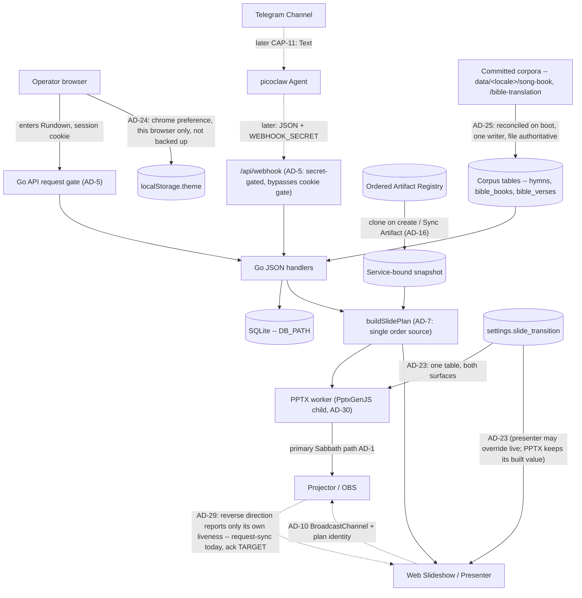
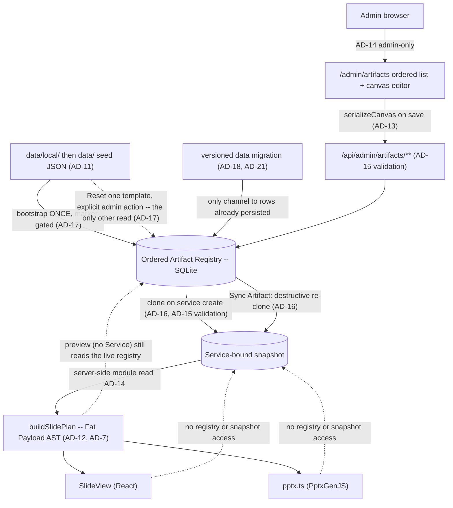

# Architecture Spine — Worship Presenter Web

Welded from the as-built spine 2026-07-10…2026-08-09. AD-n numbers are **not renumbered**. DEC-003 (2026-08-19) made Go API + React SPA + on-demand Node PPTX worker binding; AD-30 is the process split; AD-2 / AD-4 / AD-5 / AD-9 / AD-24 were amended in the same apply. As-built: Go (`cmd/api`) is the always-on API; the operator UI is the Vite SPA in `spa/`; shared React and the PPTX worker live in `src/`.

**One spine per project.** The Epic 16 child spine was folded in on 2026-07-30 — see *AD map* below. Rationale for AD-11..AD-19 lives in that fold-in's run record (DEC-001 retired the archive that held it).

## Design Paradigm

**Single-repository Go API + React SPA (AD-2, AD-30)**
One cohesive unit: a Go process is the always-on API (SQLite, slide plan, JSON); a React SPA is the Operator Hub and projector; PptxGenJS runs only as an on-demand Node child that draws a finished plan (AD-30). The SPA has sibling operator and projected shells: the operator shell carries theme, the projected shell is a literal black room-facing surface with no operator chrome (AD-24). Operators enter this week's Rundown in Hub (FR-27). The picoclaw skill remains the later Telegram caller of `POST /api/webhook` (CAP-11, skill docs, not an in-process runtime). **Offline PPTX remains the primary Sabbath path**; in-browser slideshow / presenter are also shipped (FR-15 / FR-16).

**Within it: data-driven presentation rendering with a decoupled editor** (AD-11..AD-23). Slide layout is a JSON layout AST rather than hardcoded switch-statements; an uncontrolled canvas editor owns the design, and both renderers (React web, PptxGenJS) are dumb consumers of pre-hydrated ASTs. Epic 20 turns that registry from a template catalog into the **ordered** surface where the deck itself is authored.

## AD map — the 2026-07-30 fold-in

The Epic 16 spine numbered its own decisions from 1, so folding it in required renumbering. Old citations resolve through this table, and every affected `AD-n` heading below carries its former identity inline. `AGENTS.md`'s standing rule — never renumber an existing `AD-n` — was waived once, by the owner, for this merge only.

**Reading an old citation.** Treat any `AD-n` citation in a document dated before 2026-07-30 as requiring this table before it can be read. Dated run records — readiness reports, review reports, sprint change proposals — keep their contemporaneous citation form and were deliberately not rewritten, so several still use `INIT AD-n` / `epic-16 AD-n`. One case a dangling-reference check cannot catch: `sprint-change-proposal-2026-07-29.md:85` cites **bare** `AD-2..AD-5` in an epic-16 context, where those numbers now resolve to four entirely different decisions.

| Was | Now | Decision |
| --- | --- | --- |
| `epic-16 AD-1` | **AD-11** | Artifact Registry Storage |
| `epic-16 AD-2` | **AD-12** | Slide Plan Data Flow (Fat Payload) |
| `epic-16 AD-3` | **AD-13** | Canvas State Boundary |
| `epic-16 AD-4` | **AD-14** | Global Template Administration |
| `epic-16 AD-5` | **AD-15** | Stable Layout Identity |
| `epic-16 AD-6` | **AD-16** | Service-Bound Registry Snapshot |
| `epic-16 AD-7` | **AD-17** | The Seed Is a Bootstrap |
| `epic-16 AD-8` | **AD-18** | Vocabulary and Value Changes |
| `epic-16 AD-9` | **AD-19** | Cross-Boundary Binding Keys |

`INIT AD-n` was the old citation form for AD-1..AD-10 of this file. Those numbers did not change; drop the prefix. The fold-in also removes a real hazard: `AD-6` and `AD-9` each used to mean two different decisions depending on which document you were reading.


## Invariants & Rules

`[ADOPTED]` means the mechanism this decision fixes exists in `src/` and governs it, with any
unclosed half named in the block and tracked as debt in `_bmad-output/implementation-artifacts/deferred-work.md`; an untagged `AD` is
equally binding but has **no** mechanism in the code yet, so there is nothing to read and nothing to
build against until the story that lands it ships.

### AD-1 — Web Hub + Offline PPTX (Phase sequencing) [ADOPTED]
- **Binds:** Presentation rendering, Operator experience
- **Prevents:** Dependency on venue internet during Sabbath services
- **Rule:** Operators use a zero-install **Web Hub** for review/run-sheet. **Phase 1** presents on Sabbath from a downloadable offline **PPTX**. In-browser Web Slideshow / Presenter Mode are **shipped** (FR-15 / FR-16) but are **not** the hard offline Sabbath guarantee; PPTX download remains primary for venue reliability. A registry or layout change may not make Sabbath rendering depend on hub connectivity.

### AD-2 — Single Repository Monolith [ADOPTED]
- **Binds:** Code organization, deployment
- **Prevents:** Operational complexity and synchronization issues for a solo developer
- **Rule:** The picoclaw skill integration logic, the Go API, the React SPA, and the Node PPTX worker reside in a single repository and deploy as a cohesive unit. Registry storage, the admin editor UI, and both renderers are part of that unit; there is no separate editor service. (Amended DEC-003: App Router is no longer the UI process.)

### AD-3 — Decoupled Ingestion and Presentation [ADOPTED]
- **Binds:** Data boundaries, external integrations
- **Prevents:** Tightly coupled integrations that would make replacing the Telegram/Agent ingestion difficult
- **Rule:** The API must expose a standard JSON interface for service generation that is agnostic to the input mechanism (Telegram/picoclaw). The presentation layer consumes this same API. Artifact templates are a presentation-layer concern; webhook/service intake JSON stays agnostic of layout templates.

### AD-4 — LiveServer durable paths (home PC production) [ADOPTED]
- **Binds:** Deployment, SQLite, announcement uploads
- **Prevents:** Ephemeral container-only data loss
- **Rule:** Production is one always-on **Go API** process on host storage (`presenter.example.org` via Cloudflare Tunnel on LiveServer; `presenter-dev.bic.my.id` on a VPS via systemd for dev). That process ships the SPA static assets and includes a Node runtime **only** so the PPTX worker can be exec'd (AD-30). Host-durable paths for `DB_PATH`, PPTX cache, and `UPLOADS_DIR` (bind mounts or fixed host directories). Do not run multiple API processes against the same SQLite file. Operator details: `.constitution/project/deployment.md`. **As of 2026-07-30 no deployment exists** — the tooling ships and is configured, and nothing is running (owner-corrected 2026-07-29). That date is load-bearing rather than trivia: AD-18's total-replacement licence and AD-21's released-version freeze both hinge on *until first deploy*, so they need an anchor stated here instead of inferred from this rule's tense. Announcement image refs are remote http(s) (SSRF-hardened) **or** hub-local `/api/uploads/<32-hex>.(jpg|jpeg|png|gif|webp)` resolved from disk for PPTX. Registry rows and per-service registry snapshots live in that same durable `DB_PATH`; editor image references resolve through the existing `UPLOADS_DIR` / allowlist rules, never new ad-hoc paths. (Amended DEC-003: the unit is no longer a Next.js standalone process. Docker Compose packaging was retired 2026-08-20 in favour of binary + systemd deploy.)

### AD-5 — Single request gate on the Go API [ADOPTED]
- **Binds:** every HTTP path the Go API serves; authentication and authorization
- **Prevents:** per-route authorization drift, and privilege that survives demotion, logout, or password change
- **Rule:** The Go API has one request gate, and its path matcher **is** the authorization boundary — anything it does not match is served with no session check at all, so a new exclusion ships together with its assertion test in the same change set. The gate re-checks every session against SQLite (deleted account, role demotion, stale `token_version`, revoked `sid`) and **fails closed** if that lookup throws. Privileged routes additionally call `requireSession` / `requireAdminSession`; the cookie's `role` claim is never trusted alone. `/api/webhook` is gated by `WEBHOOK_SECRET` only — 503 when unset, 401 when wrong or missing — never by a cookie. Post-login `next` targets pass through `safeNextPath`. Every gated response carries `Cache-Control: private, no-store` and `Vary: Cookie`, because the hub is published through a Cloudflare Tunnel where an edge cache rule could otherwise serve a private response without the origin — and therefore without this gate — ever running. A signature-only check cannot see a deleted account, a demotion, or a revoked session; for one congregation on a home server the cost of a local SQLite read is accepted. The SPA has no session authority of its own. (Amended DEC-003: the gate is no longer `internal/gate`. As-built until the cutover wave still uses that file; the invariant is one matcher on the always-on API.)

### AD-6 — Optimistic concurrency on service edits [ADOPTED]
- **Binds:** service mutation APIs, hub edit UI, agent/webhook corrections, registry template writes, Sync Artifact
- **Prevents:** an operator's edit silently erased by a late correction (last-write-wins)
- **Rule:** every service mutation carries the client's `updated_at` as a precondition; a stale value is rejected with HTTP 409 and the client re-reads before retrying. No write path may bypass the precondition. This covers registry writes and the **Sync Artifact** action of AD-16 — the shipped shape is `expectedUpdatedAt` / `RegistryStaleError` in `src/lib/registry/store.ts`.
- **Not yet closed:** none. The four bypasses shipped with Story 25.1: intake that would overwrite an existing date is HTTP 409 carrying the hub's current content; a correction carries `updated_at`; `DELETE /api/services/{id}` and `PATCH`/`DELETE /api/announcements/{id}` take the same token. Story 25.2 moved the stamp to sub-second `strftime('%Y-%m-%d %H:%M:%f','now')` (data version 3) so two edits in the same second no longer both pass.

### AD-7 — `buildSlidePlan` is the only slide-order source [ADOPTED]
- **Binds:** PPTX generation, web slideshow, presenter + projector
- **Prevents:** divergent slide order or content between what the operator controls and what the congregation sees
- **Rule:** `buildSlidePlan` is the single source of slide order and content for every surface. No surface recomputes order from service fields or keeps its own ordering logic; a rendering or ordering change lands in the plan, never per-surface. AD-12's Fat Payload specializes this rule; AD-16 changes only where the plan reads its templates from, never that there is one order source.

### AD-8 — Image references resolve only through shared safety helpers [ADOPTED]
- **Binds:** announcement images, hub uploads, registry/asset references, PPTX embedding
- **Prevents:** a new surface reintroducing SSRF or unsafe content through its own laxer resolver
- **Rule:** image references resolve only through the shared helpers in `src/lib` — allowlisted remote http(s) and hub-local `/api/uploads/<32-hex>.(jpg|jpeg|png|gif|webp)` for announcements, and registry `/assets/...` refs for Artifact templates. A new reference vocabulary extends an existing helper or adds one alongside them with the same fail-closed default; no unit ships an inline resolver. The canvas editor introduces no second resolver and admits no `data:` or arbitrary remote URI.

### AD-9 — Schema evolution through startup DDL only [ADOPTED]
- **Binds:** SQLite schema, and the bootstrap path it shares with AD-18
- **Prevents:** two sources of schema truth between a developer machine and a fresh production container
- **Rule:** schema changes go through the Go API's startup DDL when it opens SQLite. No migration framework (Prisma or otherwise) is introduced without an explicit product decision recorded in this spine. Registry tables are created on that same path. **The bootstrap path is shared, and the division is fixed:** this rule owns *schema* — the shape, e.g. adding a column — while **AD-18** owns *value* migration — the contents, e.g. rewriting every row's `base_type`. Neither licenses the other's mechanism: a value change is not a reason to add a framework, and a schema change is not a reason to rewrite data. (Amended DEC-003: not the Next.js `getDb` path.)

### AD-10 — One presenter sync channel, client-side only [ADOPTED]
- **Binds:** presenter, projector, web slideshow
- **Prevents:** a split sync topology where the projector follows one controller and ignores another
- **Rule:** presenter↔projector sync goes through the single `@/lib/present-channel` `BroadcastChannel` module; no surface opens its own channel name or message shape. No server realtime channel (WebSocket/SSE) is introduced unless product direction changes — keeping the venue path independent of hub connectivity, per AD-1. A registry edit must not add a second channel to push template changes to a live projector. **Every message carries a plan identity** — a fingerprint of the snapshot and resolved announcement set that produced the deck — and a receiver whose own identity differs **refuses to follow the index** and says so on the room-facing screen rather than rendering a slide it cannot vouch for. Presenter and projector are two independent `force-dynamic` renders, each calling `buildSlidePlan` at its own moment, so a bare `index` silently means different slides on the two screens the instant anything structural changes underneath them; since this rule forbids a surface inventing its own message shape, the identity has to live in the shared shape.
- **Not yet closed:** none. The plan-identity clause shipped: `PresentMessage` shared-state variants carry `planIdentity`, assembled by `plan.Identity` over the Go-built deck and returned on `GET /api/services/{id}` as `plan_identity`. A receiver whose own identity differs refuses the index and says so on the room-facing screen. Projector-originated variants remain state-free (AD-29).
- **Extended by AD-29 (2026-08-05), and nothing here is narrowed.** This channel also carries a **projector→presenter** message, and it always has — `request-sync` travels that way — which the *Prevents* above can be misread as forbidding. AD-29 fixes what the reverse direction may carry: **the sender's own condition and nothing else**, so the single-controller property above is unchanged by the addition. It also states that the plan-identity clause is not partly implemented while a new variant is added to `PresentMessage`.

### AD-11 — Artifact Registry Storage *(was `epic-16 AD-1`)* [ADOPTED]
- **Superseded in part by AD-17 (2026-07-30):** the *"startup inserts missing template IDs"* clause only. Storage target, the two-layer seed precedence, Reset-from-seed, and "never overwrites administrator edits" all stand as written.
- **Binds:** Database schema, the Canvas Editor's save API, and the startup seed path.
- **Prevents:** Data loss on ephemeral container filesystems, file-lock concurrency issues, and a seeder that overwrites administrator edits or leaks private seed content.
- **Rule:** The live Artifact Registry is stored in SQLite on the durable `DB_PATH` (AD-4). Filesystem JSON serves exclusively as a startup seed: startup inserts missing template IDs and **never** overwrites persisted administrator edits. Reset restores one selected template from that seed. The seed is two-layered — `data/local/default-registry.json` is git-ignored and **takes precedence over the shipped `data/default-registry.json` example whenever present**; a seeder that reads only the shipped example breaks the mechanism that keeps congregation data out of a public repository.
- ~~**The gap in *"exclusively a startup seed"* (2026-07-30):** `registry-snapshot.ts:85-90` reads the seed at **plan-build** time and substitutes shipped content for any row the database does not hold, so a deleted template still reaches the deck.~~ **Closed 2026-08-07 (Story 20.1, AC-7), and this decision is `[ADOPTED]` for the first time.** `loadRegistrySnapshot` (`registry-snapshot.ts:76-92`) is now `SELECT` → `parseRow` → `set` with **no substitution loop at all**, so the seed is read at exactly the two moments AD-17 permits and a deleted row stays deleted through a plan build. Verified in this worktree rather than taken from the story. Kept rather than deleted for the reason the entry itself turned out to demonstrate: this rule carried the word *"exclusively"* the whole time the read path was contradicting it, and what closed the gap was **naming the read path** — the prose was never the thing that was wrong. **The story's own Gate did not list this among the four statements it staled** — it named the *Deferred* bullet that tracked the same code and not the `AD` clause above it — which is why an Update run reads the change set rather than the hand-off list. The two-layer precedence still has one shipped override: `WPW_USE_SHIPPED_REGISTRY=1` inverts it (`seed.ts:48`, cited as `:39` until this run) for tests and fidelity smokes, and nothing else may.

### AD-12 — Slide Plan Data Flow (Fat Payload) *(was `epic-16 AD-2`)* [ADOPTED]
- **Binds:** The `buildSlidePlan` return type and all downstream renderers.
- **Prevents:** The Web (`SlideView`) and PPTX renderers from performing independent database lookups or maintaining their own diverging layout logic.
- **Rule:** `buildSlidePlan` outputs a fully hydrated AST (Fat Payload) with exact rendering coordinates, fonts, colors, and resolved text content. Specializes AD-7: the plan is the single order *and* layout source, so a renderer never **reads data from** the registry itself. Importing a shared *helper* that happens to live under `src/lib/registry/` is not such a read — `pptx.ts` importing `isBundledAssetRef` from `registry/asset-safety` is the AD-8 resolver this spine requires, not a data path.

### AD-13 — Canvas State Boundary *(was `epic-16 AD-3`)* [ADOPTED]
- **Binds:** The React-Fabric integration layer (`src/components/admin/ArtifactEditor.tsx`).
- **Prevents:** Two-way data binding lag, stuttering drags, and unnecessary React re-renders.
- **Rule:** The Canvas Editor uses an Uncontrolled Wrapper pattern. Fabric.js owns the canvas state exclusively; React reads it **only on save**, through `serializeCanvas` over `canvas.getObjects()`, projecting into the registry's own element schema. Not `canvas.toJSON()`: Fabric's serialization format is **not** `ArtifactLayout.elements`, so a second editor surface built on `toJSON()` would fail AD-15's validator on every write. The projection into the registry schema is the boundary, not the canvas library's own format.

### AD-14 — Global Template Administration *(was `epic-16 AD-4`)* [ADOPTED]
- **Superseded in part by AD-16 (2026-07-30):** the *"global across services"* clause only — a service now reads its own cloned snapshot. The admin-only authorization clause and the read-through-server-side-modules clause are **untouched** and still bind; the second now points at the snapshot instead of the live registry. Not to be confused with AD-4 (LiveServer durable paths), which is a different decision and is not affected.
- **Binds:** `/admin/artifacts`, `/api/admin/artifacts/**`, and the registry access layer.
- **Prevents:** Per-service template drift and operator-level mutation of every service's visual contract.
- **Rule:** Artifact templates are global across services. Registry management UI and APIs are admin-only and re-check the current account role from SQLite — a specialization of AD-5, not a separate authorization scheme. `/admin/artifacts` and `/api/admin/artifacts/**` are inside the AD-5 matcher, and adding a registry route outside it requires the same-change-set test update AD-5 demands. Downstream planners and renderers read the registry through server-side modules rather than the management API.

### AD-15 — Stable Layout Identity *(was `epic-16 AD-5`)* [ADOPTED]
- **Binds:** Seed data, every write path into the registry, hydration, and both renderers.
- **Prevents:** Unit-specific renderer drift, required-placeholder deletion, and unsafe image references reaching a renderer through an unvalidated back door.
- **Rule:** Layouts use a fixed 16:9 canvas with normalized percentage coordinates and stable template/layout/element/placeholder IDs. Coordinates may extend beyond the canvas to preserve intentional source-deck clipping. **Every** write into the registry is untrusted and must pass the same structural and image-reference validation before persistence — the canvas save API, the startup seeder, and any import or asset-extraction script alike. Image refs validate through the shared helper required by AD-8; no write path ships its own check.

### AD-16 — Service-Bound Registry Snapshot *(was `epic-16 AD-6`)* [ADOPTED]
- **Supersedes:** the *"global across services"* clause of AD-14, and nothing else in it. Recorded as a separate decision so the reversal stays visible.
- **Superseded in part by AD-35 (2026-08-20, DEC-004):** the *"Announcement membership is not cloned... the Announcements master list stays live"* clause below, only. Every other clause of this decision stands, including *"creation is the only freeze event"* and the pre-existing-services exception.
- **Superseded in part by AD-33 (2026-08-20, DEC-004):** the Rule's *"and the administrator override records of AD-22"* clause, and the following sentence's *"anything AD-22 keeps outside the layout travels with it; an override left out of the clone would either never reach the deck or reach it from outside the freeze, and both defeat this decision"* clause — both only as applied to Song Set rows, since AD-33 retires the AD-22 override-record mechanism entirely for that kind. Cloning order, kinds, labels, layouts and placeholder bindings, the freeze-on-creation model, Sync Artifact, and the pre-existing-services exception are untouched.
- **Binds:** service creation, the Sync Artifact action, `buildSlidePlan`'s template input, and every read path a service surface uses.
- **Prevents:** a live registry edit shifting the structure under a service an operator is preparing right now, and a weekly value entered against one structure being orphaned by a later structural change — and, in the other direction, a service with no way to be brought up to date.
- **Rule:** Creating a worship service **clones** the ordered live registry — order, kinds, labels, layouts, placeholder bindings, **and the administrator override records of AD-22** — into a **service-bound snapshot** on the durable `DB_PATH` (AD-4); creation is the only freeze event. The clone is of the *rendered* structure, so anything AD-22 keeps outside the layout travels with it; an override left out of the clone would either never reach the deck or reach it from outside the freeze, and both defeat this decision. A service's plan, Presenter, slideshow and PPTX read that snapshot; a live registry edit reaches an existing service **only** through the explicit **Sync Artifact** action, which replaces the snapshot destructively. Sync is permitted on **any** service, carries the service's `updated_at` precondition (AD-6), and may not alter the service's entered data (*State* convention) — "destructive" means it replaces the snapshot, never that it may overwrite a service someone else has moved underneath it. **Sync is a structural write and is therefore admin-only**, re-checking the role from SQLite exactly as AD-14 requires of every registry management surface, even though it is reached on a service route that `internal/gate` gates for any signed-in account; its route ships with the `tests/go-http-gate.test.mjs` assertion AD-5 demands and an in-route `requireAdminSession`. An operator may see that their snapshot is stale and *request* a sync; they may not perform one. Without this, "permitted on any service" and AD-14's surviving admin-only clause read as licence for an operator to freeze a half-authored layout into the service that presents in fourteen hours — this decision's own *Prevents*, arrived at from the other direction. The clone and the re-clone are write paths and validate under AD-15 like every other. **Announcement membership is not cloned:** the Announcements master list stays live and reaches an existing service at render time (CAP-7). **It is nonetheless scoped per service (`service_id`), matching the clone boundary everywhere else in this decision** — "not cloned" means this week's flyers may still change after the structure is frozen, never that one list is shared across services. The distinction is invisible while only one service is being prepared and decisive the moment two are open at once — a stale service reopened for a correction while next week's is being built — at which point an unscoped list bleeds one service's images onto another's deck. The shipped `announcement_items.service_id` is nullable, so both readings are currently expressible; this rule picks the scoped one. **A later structural change obliges nobody to keep an older snapshot renderable** — what the snapshot protects is the service's entered supporting data, not its ability to regenerate a past deck. The snapshot is the sequence *input*: `buildSlidePlan` remains the single source of order and layout (AD-7, AD-12), and no renderer reads a snapshot directly any more than it read the registry. **One bounded exception, stated as an exception rather than argued away — pre-existing services.** A service created *before* this model ships has no snapshot and renders from the live registry until its first Sync, which is a clone-in-place; from that moment the rule above governs it without qualification. So *"creation is the only freeze event"* holds for every service created under this decision, and the no-snapshot state is a **one-way migration path into** the decision rather than a second mode inside it: nothing may create a new service without a snapshot, and no code may re-enter the state once left. It is called out because every service in the database on day one is in it — `spec-artifact-registry-authoring/SPEC.md:89` assumed exactly this and an earlier draft of this rule forbade it, which would have left three stories free to answer it three ways. The Epic 20 data transition (AD-21) may instead clone a snapshot for every existing service and close the exception outright; that is the preferred landing, and either way the state is finite and dated. **Naming caution:** the shipped `RegistrySnapshot` type (`src/lib/artifacts/registry-snapshot.ts`) means *"the live-registry map assembled for one plan build"* — a different thing from this decision's per-service durable freeze, and the two must not be conflated.
- **Closed 2026-08-19 (W1):** the freeze is table `service_registry_snapshots` keyed by `(service_id, template_id)`; `services.registry_snapshot_at` stamps the clone. Create clones in the same transaction. Sync is Hub `POST /api/services/[id]/sync-artifact` with the Service `updated_at` precondition. The AD-21 1→2 transition cloned every pre-existing Service and closed the no-snapshot exception (OQ-C). Preview (no Service id) still reads the live map. AD-22 override records are still not a table; the clone copies validated live payloads.

### AD-17 — The Seed Is a Bootstrap, Not a Correction Channel *(was `epic-16 AD-7`)* [ADOPTED]
- **Supersedes:** the *"startup inserts missing template IDs"* clause of AD-11, and — as of 2026-07-30 — the *"exclusively a startup seed"* clause too. The substitution loop named in the Rule was the forbidden pattern; AD-11 records it closed 2026-08-07 (Story 20.1). The Rule stands: no read path may substitute seed content for an absent or unparsable row.
- **Binds:** the `getDb` startup path, the registry store's insert path, **every read path that assembles the registry**, the delete verb, the Reset verb, and the registry's ordering column.
- **Prevents:** an administrator's delete, rename or reorder being silently undone by an unrelated restart. A deleted row leaves no evidence behind, so anything that supplies "missing" IDs cannot tell *deleted on purpose* from *never existed here* — it resurrects the row forever.
- **Rule:** The seeder initialises data **from zero only** — first install, first run — and is gated by a marker in `settings`. It is never a gap-filler: after it has run, the administrator owns every row that exists, and the ordered registry is authored data rather than shipped data kept in sync. A gap in a database that already holds data travels as a versioned data migration (AD-18, AD-21), never as a re-seed. **The filesystem seed is read at exactly two moments — the first-boot bootstrap, and an explicit per-template Reset — and at no other.** In particular **no read path may substitute a seed template for a row the database does not hold, and none may substitute one for a row it holds but cannot parse.** An ordered registry of N rows produces a deck built from those N rows and no others; a template id the database does not hold does not exist, and a row whose payload will not validate **fails closed** — no layout, logged with the id and the reason, the same posture AD-5 and AD-8 already take. Both halves matter and the second is the easier one to leave open: `registry-snapshot.ts` **used to** substitute seed content in **one** loop for absent and corrupt rows alike (`parseRow` merely returned `null`, so a corrupt row reached that loop indistinguishable from a missing one), so a rule that closed only the *absent* case left shipped example content silently standing in for an administrator's real layout the moment one row was malformed. That loop is the hazard this Rule forbids; AD-11 records it closed 2026-08-07 (Story 20.1). Closing only the boot door is what let a deleted slide re-materialise into the deck on every plan build, with `rejected.delete(seed.id)` suppressing even the log line. `tests/registry-reseed.test.mjs`'s assertion that a missing row is re-inserted is **inverted, not deleted**, and a second assertion pins that a deleted row does not reappear in a built plan. Restoring shipped content stays possible as an **explicit administrator action** — Reset-from-seed per template, per AD-11 — never as a side effect of a restart, and never as a bulk re-seed of a live database.
- **An authored row has no seed, and is validated against itself.** The stability baseline for a save is the row's currently persisted state; the shipped seed is a baseline only for rows the bootstrap wrote. A row with no seed origin therefore **exposes no Reset** — Reset is defined only where shipped content exists to restore — and the registry records, per row, whether it originated from the bootstrap or from an administrator, because three verbs (save validation, Reset, and any future re-seed) all need that answer and none can infer it. Without this, the shipped `assertStableAgainstSeed` path answers a brand-new General with `404 Unknown template` on a row the administrator is looking at, and Story 20.4's *"a rejected Save names the property"* cannot be met, because the failure is not about a property.
- **Closed 2026-08-20 (Story 20.3):** per-row origin is `seed_hash IS NULL` (authored) versus a stamped hash (seed). Create writes NULL. Save skips `assertStableAgainstSeed` when NULL. Reset on NULL is 400 and the editor hides the button. No extra origin column (AD-18).

### AD-18 — Vocabulary and Value Changes Travel as Explicit One-Time Migrations *(was `epic-16 AD-8`)* [ADOPTED]
- **Superseded in part by AD-21 (2026-07-30):** the *"marker-gated"* mechanism clause only — one version counter replaces the per-change boolean. Everything else stands: values reach persisted rows only through an explicit migration on the startup path, and no framework arrives with it.
- **Binds:** the `base_type` value set, `ARTIFACT_BASE_TYPES` and the `isCanvasAuthorable` predicate derived from it, the registry validator, and any future change to persisted registry values.
- **Prevents:** a shipped vocabulary change reaching persisted rows through boot-time re-seed (which AD-17 removed) or not reaching them at all — and the opposite failure, a migration framework arriving by the back door.
- **Rule:** AD-9 fixes *schema* evolution on the startup DDL path and is silent on **value** migration; this decision fills that silence rather than weakening it. A shipped change that must reach rows already persisted travels as an **explicit, one-time migration** on the startup path, versioned per AD-21. It is not a migration framework and AD-9's prohibition stands: no Prisma, no versioned migration directory, without an explicit product decision recorded in this spine. **Until first deploy** no production rows exist, so Epic 20's seven-`base_type`-to-three-kind collapse ships as a **total replacement** — no backward compatibility, no migration over live rows — folding into production data version 1 (AD-21); at first deploy that licence ends, and the same change would need a migration over live `artifact_templates` rows. A migration operates on the **live registry** and does **not** rewrite service snapshots — structure reaches an existing service only through Sync Artifact (AD-16), so a migration that rewrote snapshots would be a second structural channel. An older snapshot may therefore stop being renderable, which AD-16 accepts; what must survive is the **entered data**.
- **A value persisted in more than one place has exactly one authoritative copy, and it is named here:** the row's `payload` JSON is authoritative for every template field, and any column duplicating a payload field — `label`, `base_type`, and any slot discriminator — is a **derived index** maintained by the same write. A value migration therefore rewrites the payload and re-derives the columns **in the same statement**, and a migration that writes a column alone is refused by a test asserting column and payload agree for every row. This is not pedantry about storage: the admin list reads the column (`store.ts:74-92`, and derives `editable` from it) while the plan and the editor read the payload (`store.ts:35-38`, `registry-snapshot.ts:41-64`), so a column-only migration leaves the administrator's screen and the congregation's screen disagreeing about what kind every row is — with nothing logged and nothing to 409.
- **Not yet closed — the agreement guard.** Every shipped write does set the column and the payload in one statement (`src/lib/registry/store.ts:268-291`, `:341-349`), so the derived-index rule holds in code; the **test** this clause requires, asserting column and payload agree for every row, does not exist. Tracked in `_bmad-output/implementation-artifacts/deferred-work.md`.

### AD-19 — A Cross-Boundary Key Is a Server-Owned Value the Administrator Cannot Edit *(was `epic-16 AD-9`)*
- **Superseded in part by AD-31 (2026-08-20, DEC-004):** the *"closed and complete... six keys over three kinds"* clause and the *"never administrator-editable"* clause, both only as applied to the song-set and announcement identities. **Superseded in part by AD-32 (2026-08-20, DEC-004):** the whole-element `placeholderKey`-binding shape given to the Placeholder Catalog (renamed Predefined Field Catalog). Everything else below stands, including `general`'s own closed and non-editable treatment.
- **Binds:** the `base_type` enumeration, the Placeholder Catalog key set, the worship-service settings form, and every write path into the registry. (The four predefined SongSet slots this line named until 2026-08-20 are superseded by AD-31, which opens the count to an Admin-configurable list.)
- **Prevents:** two independently-built units agreeing to disagree about a key — the registry surface and the worship-service settings form picking different handles for the same SongSet slot, and the canvas editor's insert list drifting from what the validator actually admits.
- **Rule:** a key referenced across a boundary is **server-owned vocabulary, enforced on every write path**, and it is never administrator configuration. Three properties make it unambiguous rather than merely convenient: the key is **never administrator-editable**, **at most one registry row may carry each slot identity**, and it is a **semantic name, never an ordinal** (`songset1` re-imports the positional reading this decision exists to remove). The recognized set is **closed and complete** — `general`, the four `songset-*` slot identities, `announcement`: six keys over three kinds, and no write path admits a seventh; the Placeholder Catalog's admitted keys are the same class of value and get the same treatment AD-8 and AD-15 gave image references, so *"the UI cannot invent a catalog key"* (CAP-4) is a property of the registry rather than of one client. **The value a key names has exactly one persisted home** — for a slot binding that is the service's own entered data, and the identity is a *key into* it, never a second copy; otherwise a webhook correction (which AD-3 forbids knowing slot keys) rewrites one home while the settings surface owns the other, and the deck renders one hymn while the run sheet and the edit form show another, with no 409, no log, and no screen on which both values appear. A binding whose slot row has been deleted is **inert, not an error**, and the entered number survives in the service's own data. Reordering rows changes the presented sequence (CAP-8) without touching a binding, and renaming a label cannot touch one either. Every spelling here is a persisted binding key, so changing one later is the versioned data migration AD-18 and AD-21 govern, and extending the vocabulary — a fifth slot, a fourth kind — is a code-plus-tests change.
- **The key's persisted home is the `base_type` column, and no discriminator sits beside it.** An entry key is written to `base_type` and to the authoritative `payload.baseType` in one statement, as AD-18's derived-index rule requires, and neither `artifact_templates` **nor any clone of it** — AD-16's service-bound snapshot included — gains a `slot`, `songset_slot` or `kind` column. **A row's kind is not persisted anywhere** — it is derived from the entry key by one exported pure function (`src/lib/registry/types.ts:24`), which is what stops the kind becoming a second persisted fact AD-18 would then have to arbitrate; AD-16's clone therefore carries kinds by carrying the entry keys they are derived from, and a snapshot that froze a `kind` of its own would reintroduce that second fact one table over, where no migration could reconcile it. A `songset-*` identity replaces `song-set` as an *entry* value in that same column, and widening the entry set from three keys to the six above is a table edit rather than the schema change AD-9 governs. **One consequence, because fixing the identity into a shared column forecloses the obvious enforcement:** *at most one row per slot identity* is enforced **on the write path**, never by a column constraint — `general` legitimately repeats down this column, so uniqueness is a property of the `songset-*` values alone and no `UNIQUE` index can express it. Decided by Story 20.2; Story 20.7 inherits it with the four slot identities, and the create verb (Story 20.3) is bound by it the moment a second entry key exists.

### AD-20 — The Planner Injects Nothing the Registry Did Not Ask For [ADOPTED]
- **Binds:** `buildSlidePlan`, the registry seed, the ordered registry, and every liturgical rule about which slides exist.
- **Prevents:** a liturgical decision requiring a code change and a deploy, and the planner keeping a second, invisible source of deck content alongside the registry.
- **Rule:** every slide in the deck originates from an ordered registry entry. `buildSlidePlan` **applies** rules; it does not **hold** them. Fixed liturgical content — the standing responses `#671` and `#684`, the closing *We Have This Hope* — is authored as **General** entries and edited by hand, never injected by the planner and never computed from the hymnal. Because a General generates no title slide, the `skipTitle` mechanism is **removed rather than migrated**: there is nothing left to suppress. It shipped at five sites and Story 20.1 deleted them — a removal, not a compatibility shim, and `slide-plan.test.mjs:231` greps the tree to keep it deleted. Changing or adding a liturgical song is a registry edit.
- **The two halves of *Prevents* are separated, and only the second is closed.** `buildRequestPlan` walks `orderedTemplateIds` — the snapshot's own `position` order — and looks each row up in a handler table, so swapping two positions in the database changes the deck and the planner holds no sequence of its own (`slide-plan.ts:296-302`, `:724-731`, `:834-836`). The four liturgical lyric pages are General rows in the seed (`intercessory-671-lyric-1`, `intercessory-684-lyric-1`, `hope-lyric-1`, `hope-lyric-2`), so nothing is injected and nothing is computed from the hymnal.
- **Not yet closed — the *first* half of *Prevents* is still live.** Five handlers keyed on hardcoded row ids still decide **which hymn** from the parsed rundown fills each slot, so *"every slide originates from a registry entry"* holds while *"a liturgical decision does not require a code change"* does not. The distinction matters to a reader deciding what is safe to build on: the *order* is data today and may be relied on; the *choice of song* is not, and a story that treats it as data will find five ids in a lookup table. Tracked in `_bmad-output/implementation-artifacts/deferred-work.md`.

### AD-21 — Persisted Data Carries One Version Number, and Unreleased Transitions Compact Into One [ADOPTED]
- **Supersedes:** the mechanism clause of AD-18 — the per-change boolean marker, precedent `artifact_seed_hash_backfilled`. AD-18's rule that persisted rows change only through an explicit migration, and its prohibition on a migration framework, stand untouched.
- **Binds:** the persisted data version in `settings`, every data migration on the `getDb` startup path, the release procedure, and the developer database lifecycle.
- **Prevents:** two builders keying the same change incompatibly — one adding a per-change boolean, another bumping a counter — and a production database accumulating one transition per code change, so that its version history tracks development activity instead of releases.
- **Rule:** All persisted data shares **one monotonic version number** in `settings` — one counter for the whole database, never one per table or per domain, so that "which version is production on" has a single answer. A change that must reach data already persisted is declared **explicitly while it is being coded**, as the transition from version *n* to *n+1*; it is never inferred at deploy time. **An unreleased transition is not yet history and may be rewritten:** the whole batch of unreleased transitions is compacted into a single transition before it reaches production, and developer databases are **reset** to the compacted version rather than migrated through the steps it replaces. **A released version is frozen** — once a version has reached production it is never renumbered, re-cut, or folded into another. Small steps are a development convenience and stop at the merge; production sees one transition per release. AD-17's seeding marker and this counter are **distinct**, and neither substitutes for the other: the marker records that bootstrap ran, the counter records which data version is persisted. This is a counter and a convention, not a framework: AD-9's prohibition stands.
- **The counter's absence is not version 0.** A database created by the AD-17 bootstrap is stamped with the current data version **by the bootstrap itself, in the same transaction as the seeding marker**, and declares itself already migrated; a database holding registry rows and no version key is a *pre-counter* database and takes exactly one recorded repair transition. Because this decision insists the marker and the counter are distinct, nothing else would make writing the counter anybody's job on a fresh install — and a fresh install that reports version 0 re-runs history it was never part of.
- **The order on the `getDb` path is fixed, and asserted by a test:** startup DDL (AD-9) → data migrations (AD-18) → first-boot bootstrap (AD-17). A migration never observes rows the bootstrap wrote in the same boot. Left unstated, the reverse order is equally compliant and strictly worse: the Epic 20 collapse, whose mapping table is keyed on the seven retired `base_type` values, would run *over freshly seeded `songset-*` rows* and either refuse to boot — at 08:40 on a Sabbath — or fall through to a default that rewrites all four slots to `general`, destroying AD-19's one-row-per-slot uniqueness by migration and dropping three songs from the deck.
- **`schemaVersion` is not this counter and never answers for it.** The per-row payload discriminator (`types.ts:83`, pinned at `validate.ts:449-450`, re-stamped at `:505`) describes the *shape* of one template and a transition may raise it; *"which version is production on"* has exactly one answer and it is the `settings` counter. A change that bumps one without deciding about the other is the ambiguity this decision's *Prevents* names, one level further in than it first looked.
- **Ratified against `src/` (Story 20.1, AC-9 / AC-10).** The counter is `data_version` in `settings` (`seed.ts:16`) at `CURRENT_DATA_VERSION = 1` (`:19`), stamped by the bootstrap **in the same transaction** as the bootstrap marker (`:115`, `:118`), with `repairPreCounterArtifactRegistry` (`db/index.ts:300-318`) running at most once and the fixed step order asserted in both directions (`registry-reseed.test.mjs:304`, `:319`, `:363`, `:386`). *"A released version is frozen"* and *"unreleased transitions compact before release"* describe a **release event this project has never had** (AD-4), so they are unenforceable — that is a missing release procedure, which *Deferred* owns as a dimension, not a missing mechanism.

### AD-22 — Authoring Authority Is Fixed per Kind: Free Canvas, Bounded Config, or Bound to a Set
- **Superseded in part by AD-33 (2026-08-20, DEC-004):** the *"a `songset-*` row gets a bounded configuration surface, not a canvas"* clause (the two-backgrounds-plus-font-style surface and its outside-the-layout override record), the *"an `announcement` row is bound to the Announcements master set"* clause, and — because AD-33 grants Song Set the same free-canvas authority as General — the Rule's *"the row's placeholder set and its SDAH slot binding are server-defined: nothing may be added, removed or rebound"* clause, as applied to `songset-*` rows only. The `general`-is-free-canvas clause, and every validation/image-resolution clause, stand untouched.
- **Binds:** the canvas editor, the registry validator, and the plan's expansion of one entry into N slides. (The SongSet configuration surface this line named is retired by AD-33, which gives Song Set a free canvas instead.)
- **Prevents:** the canvas editor and the validator disagreeing about what an administrator may author on a non-General entry — one opening a free canvas on a SongSet row and admitting an extra or rebound placeholder, the other refusing it — and CAP-3's *"General only"* living nowhere but in a capability statement.
- **Rule:** authoring authority is fixed per kind, and no surface widens it. **`general` is free canvas:** the administrator composes it from anything, including Placeholder Catalog keys (AD-19). **A `songset-*` row gets a bounded configuration surface, not a canvas:** exactly two background images — one for its title layout, one for its lyric layout, which verse and refrain share — plus font style and font size. Both background references resolve through the shared helper AD-8 requires: this surface is not the canvas editor and introduces no second resolver of its own. Layout composition itself is developer-owned seed data and is not exposed there; it stays registry data hydrated into the plan (AD-11, AD-12), never a coordinate held by a renderer. **Administrator-configured values persist outside the layout**, as an **override record keyed by row and field**, re-applied over the developer layout at hydration: the layout JSON stays developer-owned in full and a migration may replace it wholesale, the override record stays administrator-owned in full and no migration, Reset, or re-seed writes it, and a bounded surface that writes *into* the layout is refused by the validator on every write path (AD-15). An earlier draft left the encoding as "a schema call, not an invariant" — an override record beside the layout *or* a marked field inside it. The two were never equally available: the shipped validator rejects unknown keys against a closed `ALLOWED_LAYOUT_KEYS`, so the in-layout marker cannot ship without a registry-contract change this decision does not authorise, leaving only the unmarked shape — background written straight into `layouts.*.backgroundImage`, font into element `style`, indistinguishable from developer output. Then this decision's own migration clause replaces those layouts and **every background and font size the administrator chose reverts to the shipped default, on all four slots, silently, before anyone opens the hub** — AD-11 keeps no second copy and Reset would discard them too, so the only record of them was the layout just overwritten. The row's placeholder set and its SDAH slot binding are server-defined: nothing may be added, removed or rebound, and the validator refuses it on every write path (AD-15). **An `announcement` row is bound to the Announcements master set**, whose membership is not registry-authored at all (AD-16, CAP-7). Only those two kinds **expand** — a SongSet row into its title and lyric slides, an `announcement` row into N full-bleed images; a General is one slide. Because AD-17 reads the seed once, a developer's later change to a SongSet layout reaches a deployed database only as a versioned data migration (AD-21) — never by restart, and not by Reset. **Reset restores the shipped *layout* and leaves the override record untouched**, which is the whole point of keeping the two apart: before the override record existed, Reset would have discarded the administrator's backgrounds and font sizes along with the layout, and there would have been nowhere to recover them from. A Reset that also cleared administrator configuration would need to say so and does not.

### AD-23 — Transition Style Is One Value, Described Once, Consumed Identically [ADOPTED]
- **Binds:** PPTX generation, web slideshow, presenter, projector, the admin settings surface
- **Prevents:** a deck that fades in PowerPoint and cuts on the projector — the same slide sequence behaving differently on the two surfaces the congregation and the operator each watch
- **Rule:** transition style is **one app-wide value** in `settings` (`slide_transition`), and each style is described **exactly once**, in `src/lib/transitions.ts`, carrying both its PowerPoint element and its browser animation parameters. Neither renderer holds either half: `pptx.ts` and the browser surfaces all import that table, and **no surface keeps a default of its own** — that, not immutability, is the invariant. The value reaches each surface directly from `settings`, never through the plan (`buildSlidePlan` has no transition concept at all). There is no per-service override. The presenter **may** override the style for the **live browser session**, and that override travels through AD-10's channel so presenter and projector never disagree with each other (`PresenterOperator.tsx`); a PPTX already generated keeps the `settings` value it was built with, because a downloaded file cannot be re-styled after the fact. Adding a style means adding a row in that one table — and only styles that survive a plain `<p:transition>` child without the `p14` extension namespace qualify, so nothing silently degrades to "no transition" when the deck is opened elsewhere. This ratifies a convention the code already states in its own header; it is recorded here because FR-7 (`prd.md:179-180`) makes it a requirement and `prd.md:304` states the cross-surface obligation in as many words — *"the browser transition matches the Deck's configured transition style (FR-7); the two are chosen once and never diverge"* and `docs/architecture.md:61` — a declared source of this spine — used to contradict it by hardcoding a crossfade. That source was reconciled on 2026-07-30 and now states the configured value and cites this `AD`, so the contradiction is closed; the decision stays because FR-7 still needs an owner and because two renderers plus two browser surfaces is exactly the shape that diverges without one.

### AD-24 — Operator Chrome State Is Browser-Local, and the Room-Facing Surface Is Closed to It [ADOPTED]
- **Binds:** the sibling operator and projected SPA shells, every browser-persisted operator preference, the choice between `settings` and `localStorage` as a storage target, and every full-screen room-facing surface
- **Prevents:** one hazard with three faces — a preference landing in `settings`, where it silently becomes *every* operator's, or a deck-affecting value landing in `localStorage`, where AD-4's durability, AD-6's concurrency and AD-18/AD-21's migration rules cannot reach it; the root client boundary migrating upward until the whole app is a client tree; and a client-persisted value that **paints** becoming a third structural channel to the congregation's screen, alongside `buildSlidePlan` (AD-7) and the BroadcastChannel (AD-10)
- **Rule:** **application state reaches one of three homes and *who must agree on it* picks which.** **Persisted-shared** lives in SQLite on the durable `DB_PATH` (AD-4) as an app-wide `settings` value, the way AD-23 keeps `slide_transition` because both renderers and both screens must agree on it. **Persisted-local** lives in that browser's `localStorage` and nowhere else — not in SQLite, not under `DB_PATH`, and therefore **not backed up** — the way the theme does, because nothing but this operator's own eyes depends on it. **Ephemeral-shared** is not persisted at all and travels over AD-10's channel. The tiers are not interchangeable in either direction. **A chrome provider mounts only on the operator shell.** The SPA therefore has two sibling shells: the operator shell owns metadata, fonts, `ui_locale`, and theme; the projected shell owns the unchanged room-facing URLs and applies the five shell claims exactly: `html.backgroundColor = #000000`, `html.overflow = hidden`, `html.scrollbarGutter = auto`, `body.backgroundColor = #000000`, and `body.overflow = hidden`. It carries no operator provider or theme state. Projected not-found and error screens render generic `#000000`/`#FFFFFF`, vertically scrollable output with no operator link or detail. **The room-facing surface is closed to operator chrome, in any form, under any setting:** the projector, the web slideshow and the PPTX never read it. Every future browser page intended for congregation or OBS output belongs on the projected shell; putting one on the operator shell is an architectural violation, not a story-level placement choice. The projected render tree paints in **literal colours**, carrying no theme token and no theme-coloured edge; a full-screen room-facing client also claims the same shell through one per-document projected-shell helper as a hydrated defensive layer, never as the owner of first paint. The PPTX is closed *structurally* rather than by browser enforcement — it is generated by the worker from a plan the Go API already assembled and cannot read browser state at all. Registry payloads rendered by the projected tree still validate under AD-15; source-tree edits are governed by this closure gate, not by the registry validator. As-built: Vite SPA operator/projected branches plus `spa/projected.html`; `tests/theme-chrome.test.mjs` pins the two shells.
- **Three boundaries the tier question gets wrong unless they are named.** **The session cookie is not a fourth tier:** `src/lib/auth/session.ts` persists a signed cookie, but that is **credential transport governed by AD-5**, and the distinction is load-bearing rather than pedantic — a cookie is the one browser-persisted home the *server* can read, so moving a chrome preference there (the standard fix for a first-paint theme flash) would hand a room-facing server render access to operator chrome. A chrome preference does not go in a cookie. **Persisted-local holds a view preference and nothing else** — no registry payload, no service data, no unsaved domain draft — because `localStorage` sits outside AD-15's validation, AD-6's precondition and AD-21's counter, all three defined over SQLite; the *who must agree* question alone does not catch this, since the honest answer for an unsaved draft is *nobody yet*, and an `ArtifactLayout` parked there would pass every word of the tier test while escaping the entire registry write contract. Unsaved editor state stays in memory, per AD-13. **And `localStorage` is a cross-window channel, which does not make it AD-10's:** writing a key fires a `storage` event in every other same-origin window, so persisted-local propagates without opening a `BroadcastChannel` or inventing a message shape — slipping past both of AD-10's prohibitions while doing AD-10's job. Anything one surface writes so that *another surface* will act on it travels over AD-10's channel and carries its plan identity.
- **`ui_locale` is persisted-shared, and the tier question returns the wrong answer for it unless this says so (FR-25).** Asked naively, *who must agree on the language of the interface?* answers *nobody but this operator*, routing it to persisted-local exactly where the theme went. The product decided otherwise: FR-25 makes it an **Admin** setting and PRD §4.12 names it as a `settings` key, so the hub has one language rather than one per browser. One consequence to see before it surprises somebody: every write path into `settings` is `requireAdminSession`, so an Operator cannot change the interface language at all. What does **not** change is the closure — `ui_locale` reaches the operator's screen and the document `lang` attribute, never a room-facing surface. There is deliberately no `projection_locale` (PRD §4.12): projected text is authored registry data (AD-20, AD-22), so a language setting reaching the deck would be the fourth structural channel *Prevents* already forbids.
- **The two surfaces that pin `.dark` on their own wrapper are operator surfaces, not room-facing.** `PresenterOperator.tsx` and `SlideGridDialog.tsx` — both under `src/operator/present/`, not `src/components/` — opt out of the operator's choice deliberately and win for their own subtree. That is not a violation of this rule, and this rule does not license removing those wrappers.
- **Shell closure ratified 2026-08-09 by Story 17.7, mechanism amended DEC-003.** The two-shell closure (operator vs projected) still binds. As-built: the Vite SPA mounts ThemeProvider only on operator routes; room-facing first paint is `spa/projected.html`. Public URLs, authentication behaviour, and slide content contract are unchanged.

### AD-25 — A Shipped Reference Corpus Is a Projection of Its Committed File [ADOPTED]
- **Superseded in part by AD-36 (2026-08-20, DEC-005): the song-book half only, and that half now
  covers both the content rows and the registry row.** Everything in this decision — the projection
  model, the reconcile-with-removal shape, `upsertHymns`/`reconcileBibleCorpus` both being named as
  the same class of corpus, and the closure verification below — continues to bind the **bible
  family** (`bible_verses`, `bible_books`, `bible_translations`, `bible_book_names`) in full, with no
  qualification. It no longer binds `hymns`, the song-book loaders, or the `song_books` registry row:
  once a song book has bootstrapped, both its hymn rows and its own registry row are administrator-owned
  authored data under AD-36, not a projection of `data/song-book/<code>.json` or of the file's declared
  metadata. The paragraph below headed *"Not yet closed — the song-book half"* is therefore closed by
  AD-36, not by finishing the reconcile it describes — the reconcile-with-removal shape it calls for
  was never built for hymns, and DEC-005 is why it now never will be, for the registry row either.
- **Supersedes nothing, and that has to be said rather than inferred from a `Binds` list.** AD-17's *"a gap in a database that already holds data travels as a versioned data migration, never as a re-seed"* is written without a qualifier, and this decision does precisely what that sentence forbids. It is not a conflict: AD-17 is scoped to the registry by its own `Binds`, and every word of it is about rows **an administrator owns**. Nothing in AD-17 is narrowed, weakened or carved out here. A reader who takes that sentence as universal will think otherwise, which is the entire reason this line exists.
- **Binds:** every table whose content is derived from a committed corpus file — `bible_verses`, the `bible_translations` registry and the per-translation names AD-26 and AD-27 add, and any later corpus's tables — plus the loaders in `src/lib/corpus.ts` and the bible half of the boot path in `src/lib/db/index.ts`. Stated by that test rather than as today's table list, because the list is about to grow and a rule enumerated against the current schema would silently not reach the new rows. `bible_books` is the one exception and AD-27 says why: the canonical identity is application-fixed, not corpus-derived. `hymns` **and** the `song_books` registry row were both bound here until AD-36 (2026-08-20, DEC-005) carved them out together — the song-book half, content rows and registry row alike, is no longer a projection and no longer this decision's to bind
- **Prevents:** two corpus families answering one architectural question two different ways — and, in the two directions that question fails, a corrected corpus that cannot reach the table at all, or one that reaches it and leaves the withdrawn rows standing
- **Rule:** A **shipped reference corpus** — a committed data file the product carries so that a fresh clone resolves a verse and a hymn offline — is **developer-owned data with exactly one writer**, and the committed file is authoritative. Its tables are a **projection** of that file: startup reconciles each table to the corpora it ships, and the reconcile is **complete within the corpus code it names** — a row carrying that code and absent from the file is removed, and a row belonging to a sibling corpus is never touched. Whether startup detects a difference before doing the work — a per-corpus fingerprint, on the `artifact_templates.seed_hash` precedent — or simply reconciles every boot is a story-level call, bounded by the two properties this rule does fix: **a corrected corpus reaches the table with no operator step, and the table does not outlive the file.** That call is also where a growing corpus set is paid for, and the cost lands at **boot**: the first KJV seed writes 31,102 rows in ~258 ms, so reconciling several translations unconditionally on every start is the shape that turns a restart into a wait — on the morning AD-1 exists to protect. **Rebuilding rows is safe to consider, which is not obvious and was checked rather than assumed:** nothing anywhere references the surrogate `hymns.id` or `bible_verses.id` (grepped across `src/` and `tests/`, 2026-08-01), because a service persists a hymn *number* and a passage a *reference*. A reconcile may therefore delete and re-insert without dangling anything — and if that ever stops being true, this sentence is the one to come back to. This is a **third channel, and it is neither of the two it sits between.** It is not AD-17's bootstrap: a bootstrap runs once precisely because an administrator owns what comes after it, and nobody owns a corpus row. It is not AD-18/AD-21's value migration either: a migration exists to carry a change into values somebody persisted deliberately, and every value here is derived from a file already in the commit. AD-9 still owns the **shape** of these tables and AD-18 still owns **value** migration everywhere else; what this decision claims is narrower than it may look — a table whose entire content is derived from a committed file has no values of its own to migrate. **One consequence to take rather than rediscover: a rename inside a projected table is a rebuild, not a migration**, which is what makes AD-26's three renames cheap. **The closure is what makes all of this safe, and it is a property of today's code rather than a promise.** No administrator or operator write path into a corpus table exists — verified 2026-08-01, zero `INSERT` / `UPDATE` / `DELETE` against `hymns`, `bible_verses` or `bible_books` anywhere outside `src/lib/db/index.ts`. **Adding one reopens this decision before it ships**, because from that moment the reconcile is exactly the resurrection AD-17 forbids and a corpus becomes authored data carrying AD-17's, AD-6's and AD-21's obligations in full. A corpus row is therefore never where a choice is persisted; a choice *about* a corpus — which one is the default — is a `settings` value under AD-24, keyed by the corpus code AD-26 fixes. **Where it runs on the `getDb` path:** after data migrations, so a migration never observes rows the reconcile wrote in the same boot — AD-21's own reasoning for placing the bootstrap last, applied to a fourth step AD-21 could not have named. Its order relative to AD-17's bootstrap is free, because the two touch disjoint tables; that is stated so the fixed sequence in AD-21 is not read as forbidding a fourth step.
- **What is not a corpus, because "a committed data file with a locale in its path" is about to describe something else entirely.** FR-25's UI string catalogue is **not** a reference corpus and does not go into the database at all: it is interface text read at render and versioned with the code that renders it, with no row, no reconcile and no registry entry. A corpus is *lookup data a service resolves against* — a verse by reference, a hymn by number — and that is the test, not the file extension or the directory shape. Named because Epic 24 lands beside Epics 21 and 22 and will ship `<locale>`-keyed data files within weeks of this decision; persisting them would give the same string two homes and hand a redeploy the job of a migration.
- **A missing or unreadable corpus file is not an empty corpus, and this clause is the whole reason the rule above is safe to state as bluntly as it is.** *"Rows absent from the file are removed"* has a literal reading in which a file that fails to open contributes no rows and the reconcile therefore deletes every hymn in the book — 695 rows, on a boot, from one corrupted download or one bad merge. That reading is **forbidden**. A corpus whose file is missing, unparseable, or refused by validation **does not reconcile at all**: the table is left exactly as it stands, and the failure is loud — named corpus, named reason — the same fail-closed posture AD-5, AD-8 and AD-17 already take, and the one the shipped loader already reaches for by throwing (`src/lib/corpus.ts:64-79`). Removal is what the reconcile does when it has **read a good file and that file does not contain the row**; it is never what it does when it has read nothing. **The corpus is the atomic unit:** its registry row (AD-26) and its content rows are reconciled in one transaction, so a boot that fails partway leaves neither half applied and never a content row whose corpus is not registered.
- **Not yet closed — the song-book half.** The channel is complete for the bible family and absent for the song book. `reconcileBibleCorpus` (`src/lib/db/index.ts:122`) reconciles on every boot with no early return, removes the rows carrying its own corpus code that the file no longer holds, and writes the registry row with the content rows in one transaction (Story 21.2). `upsertHymns` (`:63-81`) still re-applies `title` and `lyrics` from the corpus on every boot — the reconcile without the removal — and no song-book registry exists. See *Deferred*. **Closed by AD-36 (2026-08-20, DEC-005) — not by finishing this reconcile, but by deciding the song book never gets one; see AD-36 below.**

### AD-26 — A Corpus Is a Registered Entity: Its Code Is the Key, Its Locale Is an Attribute
- **Binds:** the `bible_translations` and `song_books` registries, `bible_verses.translation_code`, `hymns.song_book_code`, the corpus loaders and their paths, the three `default_*` settings keys, and every endpoint that lists corpora
- **Prevents:** one corpus code meaning two different books depending on which locale directory it was found in — and the mirror failure, a locale reaching a `WHERE` clause and quietly turning a view default into a data filter
- **Rule:** Every installed corpus is a **registered entity** — one row in `bible_translations` or `song_books`, carrying its code, display name, **locale**, licence and provenance. **The corpus code is globally unique across locales, and it is the cross-boundary key**: the class of value AD-19 governs, server-owned and never administrator-editable. `bible_verses.translation_code`, `hymns.song_book_code`, `default_bible_translation`, `default_song_book` and the corpus filename all carry that one code. **Locale is an attribute of the corpus, never part of a key and never part of a lookup.** That is what makes FR-24's never-filter rule **structural rather than disciplinary**: because no key contains a locale, no read path can *need* one, so a `WHERE locale = …` on a corpus lookup is not merely a product violation but a predicate that cannot be necessary. A listing endpoint returns every installed corpus with its locale; `default_data_locale` decides only what a picker opens on. **The file declares; the path merely locates — for the bible family, in full, and for a song book, only up to and including its bootstrap.** A registry row is derived from the corpus file's own declared metadata under AD-25, never from its directory — the loader already refuses a file whose declared code disagrees with the code it was loaded as (`src/lib/corpus.ts:91`, `:176`), and it refuses on the same terms a file whose declared locale disagrees with the directory holding it. Without that second check, copying `data/en/song-book/sdah.json` to `data/id/` gives one code two locales and the registry keeps whichever booted last. **Superseded by AD-36 (2026-08-20, DEC-005), for the `song_books` row and that row alone, the moment its one-time bootstrap has run:** ~~"a registry row is derived from the corpus file's own declared metadata"~~ stops being true of an installed song book — AD-36 makes that row administrator-owned data from bootstrap onward, so a later edit to the committed file's declared name, locale, licence or provenance no longer reaches it at all, and correcting it live is an explicit numbered migration, never a re-derivation on the next boot. Both refusal checks in this paragraph — code-disagreement and locale-disagreement — still gate the bootstrap itself and are untouched; what dies is only the promise that the row keeps tracking the file **after** that bootstrap. **Neither refusal check has anything to gate for an admin-created book (AD-36 Extended):** there is no file and no directory, so "a file whose declared locale disagrees with the directory holding it" has no subject to refuse — the check is inapplicable, not silently passed, because that row's bootstrap never reads a file at all. That row still carries this rule's full shape intact — code, name, **locale**, licence, provenance, the same five fields as any other song book — sourced from the Admin at creation instead of a file's declared metadata; AD-36's Extended clause (OQ-39 closed, 2026-08-20 owner ruling) states that positively, closing the gap this supersession sentence left open rather than leaving the remaining three fields — locale, licence, provenance — an open hole for the admin-created case (`book_code` and name are already Admin-supplied at creation; only those three were ever in question). `bible_translations` carries no such carve-out: for the bible family this sentence, and the two refusal checks, hold exactly as written, on every boot, with no qualification. **The declared field is spelled `locale`**, matching the path segment, the settings keys and this rule; both committed files ship it as `language` today and are corrected in the same change set, because a persisted cross-boundary key gets one spelling chosen once (AD-19) and the files are the source of record, so it is free now and a migration later. **The renames belong to this decision rather than to housekeeping:** `bible_verses.translation` → `translation_code`, and `hymns.book_code` → `song_book_code` because `book_code` names a *song* book in one table while `bible_books` makes *book* mean a Bible book in another — one word, two entities, ambiguous the moment one person reads both families. `isKjvCorpusEmpty()` → `isBibleTranslationEmpty(code)` is the same rule reaching a function signature: **no corpus code survives as a literal in a read path.** All three are rebuilds rather than migrations, per AD-25. **Terminology is fixed, and it stops deliberately at one place:** *bible-translation* and *song-book* are the container terms in paths, tables and prose, while **`hymn` stays the entry term** — the `hymns` table, `/api/hymns`, and the `resolvedHymns` / `failedHymnNumbers` webhook fields keep their names, that last pair being an external contract an outside caller owns and AD-3 keeps agnostic.
- **Two things a rule saying *"globally unique"* leaves to be answered twice unless it names them.** **Who enforces the uniqueness:** two corpus files declaring the same code make the boot **refuse**, naming both paths — not last-wins, which is precisely what AD-19 forbids for the slot identity it calls the same class of key. The locale-directory check above catches the common case (a file copied between locales keeps its declared locale and is refused for disagreeing with its new directory) and does not catch two files that each honestly declare their own; only the uniqueness check does. **An admin-created code is inside this same uniqueness, never outside it** (OQ-39 closed, 2026-08-20 owner ruling): `song_books.book_code` is one column with one constraint, whichever writer reaches it, so the registry can never hold two rows for one code regardless of which side is admin-created. What differs is the **enforcement moment and its failure mode**, because an admin write has no boot to refuse at. Creating a book whose code an installed row already holds is refused by the write path itself — a request-time 409, the same precondition discipline AD-6 already gives other writes (`05-song-books.md`) — never a second boot-time check. The reverse order — a corpus file shipping later for a code an Admin already created — is not a refusal either, but that resolution belongs to AD-36's Extended clause and is not restated here. The **only** collision that reaches AD-26's boot-time refuse-and-name-both-paths mechanism is two corpus **files** disagreeing at boot, exactly as first stated; an admin-created code neither triggers nor escapes that mechanism because it is never a party to it. **And what a `default_*` setting naming a corpus that is not installed means:** it is **inert, not an error** — the surface falls back to the shipped default and says the configured corpus is not installed, and **the setting is not rewritten**, so re-installing the corpus restores the choice instead of having silently lost it. That is AD-19's *"a binding whose slot row has been deleted is inert, not an error"* applied to the other end of the same kind of key, and it matters here because AD-25 makes removing a corpus as easy as deleting a file.
- **Most of this registry already exists as data and none of it as schema, which is smaller than it reads.** Both corpus files already declare their code, name, `language`, licence, and provenance or attribution; `scripts/verify-corpora.mjs:49-54,133-138` and `tests/corpus.test.mjs:77-104` assert the licence half. `src/lib/corpus.ts` reads only code and name, so nothing else reaches a table. The registry is therefore a projection of metadata the corpus already carries rather than a second place to maintain it — and `locale`, the one attribute the whole axis rests on, is the only declared field nothing currently asserts.

### AD-27 — Book Identity Is Canonical and Translation-Independent; Every Name Belongs to a Translation
- **Binds:** `bible_books`, `bible_verses.book_id`, book-name resolution and display, the bible corpus loader, Story 21.4
- **Prevents:** one table with two owners — the last translation seeded renaming every book for every reader — and *"the same passage in another translation"* ceasing to be one query
- **Rule:** A book has **one canonical identity, stable across every translation, carrying no display text at all.** Every name and short name **belongs to a translation** and is stored against it. `bible_verses.book_id` points at the identity, which is what keeps a passage one lookup in any translation and lets a translation be added or removed without touching a verse's identity. **A corpus file maps its books onto that identity; it does not define it.** The canonical set is fixed by the application, and a corpus naming a book the canon does not hold is **refused, with the book named** — the fail-closed posture AD-5, AD-8 and AD-17 already take, chosen over a silent partial import because a translation missing four books resolves nothing for them while saying nothing about why. **Two consequences, stated rather than left to be discovered.** The canon that ships is the 66-book Protestant one, so a translation carrying deuterocanonical books is refused rather than truncated, and admitting one is a code-plus-migration change (AD-18, AD-21) rather than dropping a file into `data/`. And **input tolerance is the matcher's concern, never the corpus's**: a translation owns its *names*, while how forgivingly an operator's typing is compared against them — case, punctuation, abbreviation, singular against plural — is the matcher's. The two collapse easily and the collapse is one-way: the moment a corpus file is where an alias goes, names are corpus-owned in name only, and every translation added afterwards inherits the job of listing every way somebody might type its books. **Two things this clause originally said are superseded by AD-28 (2026-08-01), and they are struck here rather than quietly edited out, because this decision is unbuilt — which is exactly the condition under which a half-reversed rule reads as a whole one.** It said the matcher was ~~one server-side matcher **shared by every translation**~~; it is one implementation carrying a **scope**, and on an operator surface that scope is the chosen translation alone. And it treated the four kinds of tolerance as uniform; ~~abbreviation~~ is not — it carries a language and is scoped to a translation, while the other three do not. **The prohibition itself is untouched and AD-28 rests on it:** an alias still never lives in a corpus file.
- **The canonical list is not a corpus, and it does not travel through AD-25's channel.** It is application-fixed data, so it arrives by whatever route AD-9 already governs for schema and seed — never by dropping a file into `data/`, and never reconciled away when a translation is uninstalled. Changing it once verses reference it is a code change plus the versioned migration AD-18 and AD-21 govern. Said explicitly because the two neighbouring decisions pull the other way: everything else a bible corpus supplies *is* a projection, and a builder halfway through AD-25 will reach for the same mechanism here. **One tension worth naming rather than letting a reviewer find it:** the identity is an **ordinal** (1..66), which AD-19 refuses for the slot identity it calls the same class of cross-boundary key, on the ground that an ordinal re-imports a positional reading. The exception is deliberate and narrow — book order is canonical rather than a layout an administrator arranges, nobody may reorder it, and no surface exposes it — but a stable non-display handle beside the number is what a citation or a test should name, because `book_id = 22` is not a thing a human can check.
- **What this replaces, measured 2026-08-01.** `bible_books` is still `(id, name, short_name)` for the NOT NULL identity row, while display names now live in `bible_book_names` per translation and reconcile uses `ON CONFLICT(id) DO NOTHING` on `bible_books`. The unscoped alias map that used to sit in `src/lib/scripture.ts` is gone: aliases are matcher-owned and keyed by translation (`internal/scripture/match.go`). The shipped KJV corpus names book 22 `Song of Solomon`. Book ids are still supplied by the corpus file (`src/lib/corpus.ts`). Remaining: dropping the leftover display columns on the identity row, and a stable non-display handle beside the ordinal.

### AD-28 — The Reference Matcher Is One Implementation Carrying a Scope, and Tolerance Carries a Language
- **Supersedes two clauses of AD-27 and nothing else.** AD-27's *"input tolerance is the matcher's concern, never the corpus's"* **survives in full and is what this decision is built on**; what it said next — that the matcher is *"one server-side matcher shared by every translation"*, and that its four kinds of tolerance are uniform across translations — is reversed. Everything else AD-27 fixes is untouched: the canonical translation-independent identity, names owned by the translation, output exact, and a book outside the canon refused with the book named. The reversal is an owner direction that went through `bmad-correct-course` and **changed the PRD first** (PRD §4.12 FR-24).
- **Binds:** book-name resolution in `src/lib/scripture.ts`, the two scripture-split sites in `src/lib/parser.ts`, the suggestion endpoint Story 21.5 consumes, per-translation aliases, and Stories 21.4 and 21.5
- **Prevents:** cross-language input returning **through the matcher** once the corpus door is shut — and the mirror failure, the operator surface and the rundown drifting into two resolution rules because their scopes differ
- **Rule:** there is **one matcher implementation and the scope is an argument to it, never a fork**. On an **operator surface** the scope is the **chosen translation alone**; on the **rundown** it is **every installed translation**, because a Telegram sender picks none. That scope is a **required, registry-validated corpus code supplied per request** — an unrecognised or absent one is **refused**, and *all-installed* is a property of the rundown surface and never a fallback, because a default silently reinstates the cross-language operator input this decision removes. It is a per-request parameter rather than the `settings` default, since FR-24's never-filter rule lets an operator browse a corpus outside the default locale. **Tolerance that carries a language is scoped with it:** case, punctuation and singular-against-plural are comparison rules owned by the matcher and unscoped, while a **non-prefix alias belongs to a translation** and is **matcher-owned data keyed by translation code, never a corpus-file field** — which is how AD-27's prohibition and this decision's finding hold at once rather than trading off. Resolution compares against **corpus-supplied names** rather than a regex guessing where a book name ends, and an **ambiguous reference is unmapped input (NFR-5), never a guess** — the fail-closed posture AD-5, AD-8, AD-17, AD-25 and AD-27 already take, and it belongs with them because a guess here is silent and reaches the congregation's screen mid-service. Ambiguity is **not scoped to the cross-translation case**: it is measurably intra-translation on the single corpus shipping today, so a builder reading a cross-translation-only rule in a single-corpus install would reasonably take the first match, which is the mis-split this clause exists to prevent.
- **One consequence to expect rather than discover:** because rundown scope widens as corpora are installed, **adding a translation is not purely additive on that surface** — a reference that resolved unambiguously against one translation can become ambiguous against two and start arriving as unmapped. That is correct behaviour with AD-1's shape, surfacing on a Sabbath morning on a rundown nobody edited; how an operator is told *why* is an affordance question recorded as OQ-16.

### AD-29 — The Projector Reports Its Own Liveness and Nothing Else, and One Predicate Decides It [ADOPTED]
- **Extends AD-10 and supersedes nothing.** AD-10 already requires that *"no surface opens its own channel name or message shape"*, so a new variant in `@/lib/present-channel` is obedience to it rather than a carve-out. What AD-10 does not say is that the channel carries a **projector→presenter** message at all, who may emit one, and what keeps that from making the projector a second controller — and its *Prevents* reads easily as forbidding the reverse direction outright. It does not: `request-sync` has travelled that way since presenter mode shipped. AD-10's unbuilt plan-identity clause is untouched.
- **Binds:** the `PresentMessage` union in `src/lib/present-channel.ts`, the projector's channel effect, the presenter's message listener and its retained window handle, the liveness verdict and whatever surfaces it, and Story 17.5
- **Prevents:** the reverse direction on AD-10's channel becoming a second controller — a projector whose messages the presenter *follows* rather than merely observes — and the mirror failure, two liveness mechanisms with two verdicts, so the operator's surface reports *lost* while acknowledgements are arriving, or *live* while the window is shut, with nothing saying which was authoritative
- **Rule:** a projector→presenter message may report **the sender's own condition and nothing else, ever** — the moment one carries a value the presenter would adopt, the projector is a second controller and AD-10's *Prevents* is live again. The observing side is bound the same way: receiving one may move the **liveness verdict** and nothing else. Exactly **one** acknowledgement variant exists, in `@/lib/present-channel` and nowhere else; it carries **no shared state of any kind**, which is what puts it outside that file's header contract rather than in tension with it, and it is **idempotent by construction**, so no sequence number or request/response pairing may be layered over it. The **projector window is its only sender** — admitting a second is a new decision, not an implementation choice, because a state-free message cannot say for itself who sent it and a slideshow tab answering would report a live projector while the second screen is dark. **Liveness is one predicate:** the verdict lives in one evaluator and every signal — the acknowledgement, the retained handle's `closed` read, and any later `pagehide`, `visibilitychange` or second handle — is an **input to it**; a second holder of liveness state is a defect however it is spelled. Its precedence is **asymmetric on purpose**: an acknowledgement is authoritative for `live` whatever the handle says, a handle reading `closed` is authoritative for `lost` immediately without waiting out the freshness window, **neither is authoritative for the other**, and a `null` or stale handle is **no information** rather than evidence of death. Where the predicate cannot be certain it resolves to **`lost`**, because a false `live` is unrecoverable within the service while a false `lost` self-clears on the next acknowledgement — and *no evidence yet* stays a **distinct verdict** from *evidence stopped*, so a presenter opened without a projector is silent rather than alarmed. The heartbeat interval and the freshness window are **one pair, exported once from the evaluator's own module and consumed by both windows**, because two units each picking an honest number independently is exactly how a healthy second screen gets reported dead for the rest of a service.
- **The tier is ephemeral-shared, and two prohibitions come with it.** Liveness is per-session and persisted nowhere in either window — no table, no `settings` key, no schema, no route (AD-9, AD-24) — and specifically **not** `localStorage`, which AD-24 already names as a cross-window channel that slips past both of AD-10's prohibitions while doing AD-10's job; nor a server realtime channel, since *knowing whether the other end is still there* is the most common reason anybody reaches for one. And there is **no room-facing counterpart** — forbidden rather than out of scope: a *"presenter disconnected"* notice on the congregation's screen would put an operator-console concern in front of the room. The projector's only change is the outbound acknowledgement; it renders nothing about liveness.

### AD-30 — Process roles: Go API, React SPA, on-demand PPTX worker [ADOPTED]
- **Binds:** All; containers `api`, `spa`, `pptx-worker`
- **Prevents:** a Node.js HTTP server remaining resident in production (the Next.js shape); the PPTX worker opening SQLite or assembling a plan; the SPA talking to SQLite
- **Rule:** The Go API is the only always-on server: it owns SQLite, assembles the slide plan, and serves JSON (and, in production, the SPA files). The Operator UI and projector are a React SPA that MUST NOT open SQLite. PptxGenJS runs only as an on-demand Node child that receives an already-finished plan, draws PPTX, and exits; it MUST NOT stay up and MUST NOT open SQLite. Development MAY use a SPA bundler and MAY invoke PptxGenJS the same way; it MUST NOT keep a Node application server as the live API. (DEC-003)

### AD-31 — Song Set Entries Are Admin-Authored Data; Announcement Sets Are Admin-Authored Nested Lists *(DEC-004, supersedes AD-19 in part)*
- **Supersedes:** AD-19's *"the recognized set is closed and complete — `general`, the four `songset-*` slot identities, `announcement`: six keys over three kinds, and no write path admits a seventh"* clause, and its *"never administrator-editable"* clause as applied to the song-set and announcement identities specifically. Everything else in AD-19 — one persisted home per value, a deleted-slot binding is inert rather than an error, reordering never touches a binding, `general`'s own closed and non-editable treatment — stands untouched.
- **Binds:** the song-set entry identity (`variable_name` and title), the Announcement Set list, the main-spine entry-kind vocabulary, every write path into the registry.
- **Prevents:** a liturgical or administrative headcount — how many songs this week, how many announcement blocks — requiring a code change and a deploy. The same shape of concern AD-20 raises for the *choice* of song, applied here to song-set and announcement *count*.
- **Rule:** A main-spine row is now one of exactly two remaining server-owned kinds — `general` or a **Song Set entry** — plus an `ann-set` marker that splices in an Announcement Set. `general` keeps AD-19's closed, non-editable treatment exactly as written. A Song Set entry's `variable_name` and title **are** Admin-authored (FR-29): Admin adds, renames, and removes entries directly in the Registry, and a Service with more than four songs is a normal shape the Registry accepts, not a limit worked around. An **Announcement Set** is its own Admin-authored ordered list of General slides (0..N per Registry) — not a fixed kind of main-spine row at all; the spine carries only a marker referencing it. AD-19's uniqueness rule survives in a new shape: at most one live main-spine row may carry a given Song Set `variable_name`, enforced on the write path exactly as AD-19 enforced slot uniqueness — never by a column constraint.

### AD-32 — A Predefined Field Is an Inline Token Inside Authored Text, Never a Whole-Element Binding *(DEC-004, supersedes AD-19 in part)*
- **Supersedes:** the whole-element `placeholderKey`-binding shape AD-19 gave the Placeholder Catalog. AD-19's closed-catalog-vocabulary principle is untouched — a new Predefined Field key is still a code change; only the binding shape (element vs. token) is superseded.
- **Binds:** the Predefined Field catalog (renamed from Placeholder Catalog, Supplement S1), the canvas editor's text elements, hydrate/generate, the registry validator.
- **Prevents:** a design that can only ever mix fixed prose and weekly content by giving the fixed prose its own separate element — `"Family: {family_name}"` could not previously be one styled line.
- **Rule:** A text Predefined Field is a `{key}` token mixed into one text element's own content, styled once per element — no per-token styling inside the same box. An image Predefined Field keeps its own geometry box exactly as AD-19 already had it; only the text case changes. Hydrate substitutes catalog values into the token positions. An unrecognised token renders as empty text and never blocks generation (FR-30); the editor flags it only when the slide is saved, not at generate time.

### AD-33 — Song Set Layouts Are a Free-Canvas Trio; an Announcement Set Splices Its Own Registry List *(DEC-004, supersedes AD-22 in part)*
- **Supersedes:** AD-22's *"a `songset-*` row gets a bounded configuration surface, not a canvas"* clause (the two-backgrounds-plus-font-style surface and its outside-the-layout override record), and its *"an `announcement` row is bound to the Announcements master set"* clause. AD-22's `general`-is-free-canvas clause, and everything about validation (AD-15) and image resolution (AD-8), are untouched.
- **Binds:** the canvas editor, the Song Set authoring surface, the registry validator, the plan's expansion of a Song Set entry and of an `ann-set` marker.
- **Prevents:** the editor and the validator disagreeing about authoring authority on a non-General entry — the same hazard AD-22 named, restated for the model this decision ships.
- **Rule:** Every Song Set entry, however many exist, shares one authored trio: **Title** is a free canvas with its own background, the same authority as `general`. **Verse** and **Reff** are free canvases too, but authored on a **blank** canvas — no background is chosen at authoring time; background resolves at hydrate/live time through AD-34's order. Because the bounded configuration surface and its AD-22 override record (kept outside the layout so Reset would not discard an administrator's chosen backgrounds and font size) no longer exist for Song Set — the layout **is** the canvas now, the same as a General — that whole mechanism retires with this decision: Reset on a Song Set layout behaves exactly as Reset on a General, with nothing held outside it to preserve. An **Announcement Set** is its own ordered sequence of `general`-kind slides, held only in the Registry; the main-spine `ann-set` marker that splices it in at its position is not itself a canvas, and it does not expand a Hub-owned master list the way AD-22 described.

### AD-34 — A Live Background Choice Is a Presenter-Session Override, Never Persisted *(DEC-004)*
- **Binds:** the presenter/projector channel (AD-10), the Verse/Reff background resolution order (AD-33), the Service payload, the Registry.
- **Prevents:** a live convenience quietly becoming a second structural channel to the congregation's screen — the same hazard AD-10 and AD-24 already name for other surfaces — and a background choice that a Sync, or next week's Deck, silently cannot see reverting without anyone deciding it should.
- **Rule:** FR-33 lets the Operator change the background of the projected Verse/Reff slide during a live service. The precedent is AD-23, which already lets the presenter override `slide_transition` for the live browser session only, over AD-10's channel, without touching `settings` or a PPTX already built. A live background choice follows the same shape: it travels over AD-10's channel carrying the same plan-identity discipline, is visible immediately on the projector, and touches neither the Service payload nor the Registry nor any table. It does not survive past that session — the next generate, and any Sync, resolves the background through AD-33's normal order (the entry's own weekly choice → the Admin-set global default → blank) exactly as if the live override had never happened. Ownership follows Supplement S11: Admin owns the Background Library and its global default; the Operator owns the moment.

### AD-35 — Announcement Sets Are Structural Spine Rows and Are Cloned, Not a Live Membership List *(DEC-004, supersedes AD-16 in part)*
- **Supersedes:** AD-16's *"Announcement membership is not cloned: the Announcements master list stays live and reaches an existing service at render time (CAP-7)... It is nonetheless scoped per service (`service_id`)"* clause. That clause described a Hub-owned master list keyed by `service_id`; DEC-004 retires that list entirely (FR-3, retired). Every other clause of AD-16 — creation is the only freeze event, Sync carries the `updated_at` precondition, the snapshot protects entered data rather than the ability to regenerate a past deck, the pre-existing-services exception, the naming caution about `RegistrySnapshot` — is untouched.
- **Binds:** service creation, Sync Artifact, the service-bound snapshot, `buildSlidePlan`'s template input.
- **Prevents:** the same hazard AD-16 named for the old Announcements master list — a live edit shifting structure under a Service being prepared right now — now applying to Announcement Sets; and the opposite failure, a snapshot that silently drops which sets a Service was actually built against.
- **Rule:** An Announcement Set and the `ann-set` marker referencing it on the main spine are structural rows exactly like every General and Song Set row, so they follow AD-16's general rule without exception: **creating a Service clones the whole spliced structure** — the main spine plus every Announcement Set it references — into the service-bound snapshot, and only Sync Artifact replaces it thereafter. There is no separate, unscoped, live-reaching membership list any more.

### AD-36 — The Song Book Is Administrator-Owned Data After a One-Time Bootstrap *(DEC-005, supersedes AD-25 in part)*
- **Supersedes:** AD-25's *"a shipped reference corpus is developer-owned data with exactly one writer... its tables are a projection... reconciled to the committed file"* clause, **as applied to `hymns` and the song-book loaders only**, and AD-26's *"a registry row is derived from the corpus file's own declared metadata under AD-25"* clause, **as applied to the `song_books` registry row only** — the bible half of that same AD-26 sentence, governing `bible_translations`, is untouched. AD-25 itself, the bible family it binds, and every other clause of it — the reconcile-with-removal shape, the atomic-corpus transaction, the fail-closed posture on a missing/unreadable file — are untouched and continue to govern `bible_verses`, `bible_books`, `bible_translations`, and `bible_book_names` without qualification. AD-26's registration model — one row per corpus, the code as the cross-boundary key, locale as an attribute never a lookup key, the uniqueness-refusal and inert-default rules — is likewise untouched for `song_books`; only *where that row's fields come from after bootstrap* changes.
- **Binds:** the `hymns` table (content rows) **and** the `song_books` registry row (AD-26's entity for a song book) — one rule reaching both rather than two rules that happen to agree — plus `upsertHymns` and any successor song-book loader in `src/lib/db/index.ts`, `data/song-book/*.json`, and the "Save to Song Book" write path (UC-28, FR-34). A song book's registry row is bootstrapped and thereafter owned exactly like its hymn rows, because the owner ruling that settles this draws no line between a book's content and the book's own name.
- **Prevents:** an operator's saved lyric correction (UC-28) being silently discarded on the next restart because the boot path re-applies the shipped file over it — the exact hazard a projection model creates the moment a write path into the projected table exists — and, in the other direction, a song book that never installs on a fresh clone because nothing seeds it once the reconcile is gone. The same hazard, restated for the registry row: an administrator's correction to a song book's display name (fixing a human error in the committed file's declared metadata) silently reverting on the next boot because the registry row is still re-derived from the file.
- **Rule:** A song book's rows in `hymns`, **and its own row in `song_books`, are bootstrapped once, from the committed corpus file, and are administrator-owned data from that moment on** — the same posture AD-17 already holds for the Artifact Registry, extended here to a second table family, and to that family's registry entity as well as its content. The bootstrap runs **per song-book code**, gated by a marker (parallel to AD-17's registry marker) recording that this `book_code` has been seeded; in one transaction it inserts every hymn the file declares that the table does not yet hold **and** writes the `song_books` row from the file's declared metadata (name, locale, licence, provenance — the same fields AD-26 lists), and thereafter **never overwrites either** — not a `hymns` row that already exists, whether its current text came from the original seed or from an administrator's later "Save to Song Book" write (UC-28), and not the `song_books` row's fields, whether they still read as seeded or an Admin has since corrected the book's name. Installing a **new** song book — a corpus file for a `book_code` never seen before — still requires no operator step: the bootstrap fires the first time that code is encountered, seeding every hymn row and the one registry row together, exactly as a fresh clone seeds all 695 SDAH hymns and their book's registry entry today. **A gap is never filled by re-reading the file** once a book is bootstrapped: a deleted hymn stays deleted, a corrected book name is never reverted to the file's spelling, and a row the file no longer contains is not resurrected, per AD-17's rule applied to this table and its registry row alike. **A corpus-level correction to an already-installed book — content or its registry metadata — reaches a live database only as an explicit, numbered data migration** under the single `data_version` counter (AD-18, AD-21) — never as a boot-time reconcile and never a second counter. **Deleting a song book's rows, or its registry row, from a live database is an explicit administrator action or a numbered migration, never a side effect of the corpus file disappearing** — there is no reconcile left to notice the file is gone, for either. The "Save to Song Book" write path (UC-28 alternate flow) carries AD-6's precondition discipline: it re-reads the entry's current resolved `(book_code, number)` at the moment of the write and refuses (409) if it has moved since the editor opened (SCN-4). A future "correct this book's name" write path would carry the same discipline, though none ships yet (see *Deferred*).
- **Extended (2026-08-20, owner ruling, OQ-38 closed — not a `DEC-`, because this fills a gap the Rule above never closed rather than reversing anything it said): an Admin may create a `song_books` row with no corpus file behind it at all**, through `POST /api/admin/song-books` (`05-song-books.md`) naming an arbitrary `book_code`. Nothing in the Rule above forecloses this — it describes what happens when a corpus file exists and is silent on a row that never has one. **What an admin-created book is:** a `song_books` row inserted directly, with the same per-`book_code` bootstrap marker this decision already gates corpus installs on set **at creation**, and zero `hymns` rows — there is no file to seed from, so the book starts empty and is filled only by an administrator authoring hymns into it one at a time (`hymns` rows for that `book_code`, written the same as any post-bootstrap correction under this AD), or by a later bulk-import capability (deferred; see spine *Deferred*, not designed here). **Its registry row's remaining fields (OQ-39 closed, 2026-08-20 owner ruling):** AD-26 requires every song book to carry code, name, **locale**, licence and provenance. `book_code` and `name` are already Admin-supplied at creation (`05-song-books.md`'s POST body); this ruling settles the other three the same way — **locale, licence and provenance are filled in by the Admin**, not derived from a file, because none exists for this row to declare them from. Nothing about AD-26's five-field shape is relaxed for an admin-created book; only the source moves from a corpus file's declared metadata to the Admin's own input, and thereafter those three fields are corrected exactly like any other post-bootstrap field under this AD's Rule above — never re-derived, because there is still nothing to re-derive them from. **The corpus-file collision:** because creation sets the marker immediately, a corpus file that later ships declaring the same `book_code` is inert for that code — its hymns are never inserted and the existing registry row's fields are never touched, exactly as the existing Rule already governs any other already-bootstrapped book (`05-song-books.md`, *Collision*, has the worked case). **Marker granularity:** the marker gates **corpus-seeding only**, never an administrator's own per-row write — an Admin authoring hymns one at a time into an admin-created book, and the "Save to Song Book" write (UC-28), both work exactly the same whether the marker is set or not (`05-song-books.md`, *Marker granularity*, has the worked case). No new mechanism and no special-casing are needed — an admin-created book is simply a bootstrap with zero hymns seeded and a marker set by a write path instead of by the loader.
- **Cost, carried from DEC-005 rather than restated in full:** a corrected `sdah.json` shipped after go-live no longer reaches an existing install by itself — it only seeds a fresh clone, for its hymn rows and its registry row alike. Reaching a live install needs the numbered migration above. The bible family's "no operator step" property is not affected; this cost is scoped to the song-book half alone, content and registry both.

## Consistency Conventions

| Concern | Convention |
| --- | --- |
| Naming (entities, files) | kebab-case for directories/files, PascalCase for components, camelCase for variables/functions. |
| Data & formats | API responses use standard JSON envelopes (`{ error: string }` + explicit status on failure). Dates stored and transmitted in ISO 8601 UTC. |
| State | A service's **entered data is historical**: only that service's own mutation path changes it — an operator form edit (FR-11) or an authorized webhook correction (FR-12) — and never as a side effect of anything else. No registry edit, no **Sync Artifact**, and no value migration may alter a service's stored form input. Structure is the opposite: a service adopts a clone of the Artifact Registry at creation, and live structure reaches it only through Sync Artifact, permitted on any service (AD-16). A service is **not** required to regenerate a byte-identical deck later — what is kept is the entered data, not the rendering. Concurrent overwrite is arbitrated by AD-6's `updated_at` precondition, never last-write-wins. |
| Reference data | The **bible family** is developer-owned and file-authoritative, projected fresh from the committed corpus every boot (AD-25, AD-27, AD-28), including its `bible_translations` registry row. The **song book** is the exception, content and registry alike: `hymns` and the book's own `song_books` row both bootstrap once per book code, then are administrator-owned like a service's entered data — nothing reconciles either back to the file afterward (AD-36). Either way, *which* corpus is active is a `settings` value, never a corpus row; **locale is an attribute, never a key** (AD-24, AD-26). |
| Client state | Application state gets three homes, and *who must agree on it* picks one (AD-24): **persisted-shared** → SQLite on `DB_PATH`, app-wide values in `settings`; **persisted-local** → that browser's `localStorage`, view preference only, not backed up; **ephemeral-shared** → AD-10's `BroadcastChannel`. On that channel the presenter is the single authority, and the **reverse direction carries the sender's own condition and nothing else** — a projector→presenter message reports liveness, never a value the presenter would adopt (AD-29). A value the deck, another operator, or another surface depends on is never persisted-local, and no domain data goes there at all. Room-facing surfaces read **persisted-local never** — they do read `settings` (AD-23's `slide_transition`) and the channel. The AD-5 session cookie is credential transport, not a fourth home. Story 17.7 closed server first paint through the sibling projected root; hydrated clients retain one per-document defensive shell claim. |
| Boundaries | Route handlers stay thin; parsing, PPTX, auth, images, announcements, and DB access live in `src/lib/*`. Registry **storage and validation** live in `src/lib/registry/*`; registry **hydration and the runtime contract** — the Fat Payload of AD-12 and the shape AD-15 enforces at render time — live in `src/lib/artifacts/*`; the service-mutation paths that carry AD-6's precondition live in `src/lib/services/*`, and the registry's own precondition (`expectedUpdatedAt` / `RegistryStaleError`) in `src/lib/registry/store.ts` — one rule, two enforcement sites, and a third must not appear. Those two sites signal a stale write differently (a returned result vs a thrown error); a new write path adopts the shape of the layer it lives in rather than inventing a third. None of these belongs in a route handler. better-sqlite3 is synchronous and server-only. |
| Testing | `node:test` with `--experimental-strip-types`, resolved through the loader `tests/register-ts-resolve.mjs`, over an **explicit file list** in `package.json` `scripts.test`. A new suite is registered in that list **in the same change set** — an unregistered test file never runs, locally or in CI, and nothing detects the omission. No second runner without a decision recorded in this spine. This convention is here because AD-5, AD-15 and AD-17 each delegate their enforcement to a suite the spine otherwise never described. |

## Stack (seed)

Seed, not an invariant. `package.json` wins on versions.

| Name | Version |
| --- | --- |
| Go | always-on API (DEC-003 / AD-30). `go.mod` wins on version. |
| Node.js | **22.x** in the image **only** to exec the PPTX worker — not a 24/7 application server (AD-30). CI uses 22 for the same reason. |
| Vite | ^6.3.5 — SPA bundler (`spa/vite.config.ts`) |
| React / React DOM | 19.2.4 — remains the SPA UI |
| TypeScript | ^5 (strict) |
| Tailwind CSS | ^4 |
| better-sqlite3 (SQLite, WAL) | ^12.11.1 |
| pptxgenjs | ^4.0.1 |
| jszip | ^3.10.1 |
| fabric | ^6.6.1 (canvas editor) |
| @base-ui/react (the primitive library under shadcn base-nova) | ^1.6.0 |
| shadcn | ^4.13.0 — a **runtime** dependency, not just a generator: `globals.css:3` does `@import "shadcn/tailwind.css"`, so it feeds the same palette file AD-24 cites. Listed on its own row because the `@base-ui/react` row above used to name shadcn while pinning a different package's version, which made an auditor read this as already covered |
| next-themes | ^0.4.6 (resolved `0.4.6`) — earns a row because AD-24 rests on it: it owns the `localStorage` key *and* the `attribute="class"` contract the `.dark` palette is keyed on. Web-verified 2026-07-31: `0.4.6` **is** the latest release (2025-03-11), so this row is both undrifted and at head — see *Deferred*, because that is not the same as active |
| ESLint | ^9 |
| fast-xml-parser | ^5.10.1 (dev — the parser inside the enforced privacy filter, `scripts/extract-pptx-assets.mjs`) |
| Test runner | `node:test` + `--experimental-strip-types` (no vitest/jest — see *Testing* above) |

`package.json` constrains every library row and this table mirrors its manifest ranges or exact versions; the installed tree was checked against those rows on 2026-08-09. Mirroring does not create a Node patch floor — there is no `engines` field, while Docker and CI select only major 22 — and it says nothing about upstream currency. Storage target, PPTX generator, and canvas library are fixed — the registry adds no parallel mechanism.

## Structural Seed

System-level dependency direction. The `Service-bound snapshot` node and its two inbound edges
ship as of W1 (AD-16). Remaining Epic 20 target is DEC-004's Song Set / Announcement Set model
(AD-31, AD-33, AD-35) and AD-20 hymn-choice handlers.



Registry detail — read *through* the plan, never by a renderer, and never through the management API.
**Partly shipped as of 2026-08-19.** The registry is ordered and the
bootstrap is marker-gated and once-only (Story 20.1, AD-11 / AD-17 / AD-21). W1
landed the per-service snapshot and its two inbound edges (AD-16): `buildSlidePlan`
for a persisted Service reads `service_registry_snapshots`; preview still reads
the live registry. What remains Epic 20 target is DEC-004's Song Set / Announcement Set
model (AD-31, AD-33, AD-35) and AD-20's hymn-choice handlers.



```text
worship-presenter-web/
  cmd/api/           # Go always-on API (AD-5 gate, SQLite, plan)
  spa/               # React SPA — operator + projected shells (AD-24)
  workers/pptx/      # Node child: PptxGenJS draws a finished plan (AD-30)
  src/               # shared React UI + PPTX worker TypeScript (not an HTTP server)
  public/            # bundled registry assets: the /assets/... resolution root (AD-8)
  data/              # default-registry.json seed; asset-map.json; SQLite via DB_PATH
  data/bible/ song-book/  # the two committed corpora (AD-25). Shipped flat today; FR-24 moves both
                     #   under data/<locale>/bible-translation/ and data/<locale>/song-book/ (Stories 21.2, 22.3)
  data/local/        # git-ignored private seed overrides (preferred over the shipped example)
  data/uploads/      # default UPLOADS_DIR (durable host volume in LiveServer prod)
  tests/             # node:test suites incl. proxy-matcher, public-repo-guard, asset-map-evidence, theme-chrome (enforced gates)
  .constitution/     # method kit + project room; hard rules in project/public-repository.md
  scripts/           # verify-corpora (both corpora are the source of record -- no importer survives),
                     #   registry-doctor, extract-pptx-assets, setup, auth + smoke helpers
  .claude/skills/picoclaw-webhook/  # agent skill docs for webhook intake/readback (FR-1); not a runtime server
```

## Capability → Architecture Map

Present because two specs drove this spine. Read the right-hand column downward: a capability with no governing decision is a hole, and this table is where it shows.

**Epic 20 — `spec-artifact-registry-authoring`**

| Capability | Lives in | Governed by |
| --- | --- | --- |
| CAP-1 — one ordered registry defines which slides exist and in what sequence | `src/lib/registry/*` → `buildSlidePlan` | AD-7, AD-16, **AD-20** (the planner holds no rule of its own — *shipped for the sequence, still code for the choice of song; see AD-20's gap*) |
| CAP-2 — add, delete, rename, reorder entries | `/admin/artifacts`, `/api/admin/artifacts/**` | AD-14 (admin-only), AD-17 (a delete stays deleted; create stamps `seed_hash` NULL — *shipped Story 20.3*), AD-6 (precondition on every write) |
| CAP-3 — full canvas authoring, General only | `src/components/admin/ArtifactEditor.tsx` | **AD-22** (free canvas is General's alone), AD-13 (Fabric owns canvas state), AD-15 (every write validated). **As-built only — DEC-004/AD-33 extends the same free-canvas authority to the Song Set Title/Verse/Reff trio for the G4 wave that builds it.** |
| CAP-4 — Placeholder Catalog inserted and styled locally | `src/lib/registry/validate.ts`, catalog vocabulary | AD-19 (key set is server-owned), **AD-22** (*locally* means on a General), AD-15. **As-built only — DEC-004/AD-32 retires the whole-element binding shape for the G4 wave that builds it.** |
| CAP-5 — three kinds plus editable label, shown as `[kind] label` | registry types, ordered list UI | AD-19 (six recognized keys over exactly three kinds; label is admin-owned). **As-built only — DEC-004/AD-31 retires the closed six-key reading; the G4 wave that builds it ships `general` · Admin-configurable Song Set entries · `ann-set` markers.** |
| CAP-6 — service clones the registry; Sync Artifact re-clones | service create / Sync, service-bound snapshot | AD-16, AD-6 (Sync carries the precondition), AD-15 (clone is a validated write) |
| CAP-7 — Announcement is one entry expanding to N full-bleed images | `src/lib/announcements.ts` → plan | AD-16 (membership deliberately not frozen), AD-8 (image refs resolve through shared helpers). **As-built only — DEC-004/AD-35 retires the live, unscoped master-list shape; the G4 wave that builds it ships N cloned Announcement Sets, each its own ordered list of authored Generals.** |
| CAP-8 — four SongSet slots with backgrounds and per-slot hymn numbers | registry rows + worship-service settings | AD-19 (slot identity is the binding key, immutable and unique), **AD-22** (two backgrounds per slot, on a bounded surface), AD-12 (expansion is hydrated into the plan). **As-built only — DEC-004/AD-33 retires the bounded surface for a shared free-canvas Title/Verse/Reff trio, and DEC-004/AD-31 retires the fixed four-slot count for an Admin-configurable list (FR-29).** |

**Epic 16 — `spec-slide-artifact-model`**

| Area | Lives in | Governed by |
| --- | --- | --- |
| Registry storage and its seed | `src/lib/registry/store.ts`, `seed.ts` | AD-11, AD-17, AD-4 (durable `DB_PATH`) |
| Hydrated layout AST reaching both renderers | `slide-plan.ts` → `SlideView`, `pptx.ts` | AD-12, AD-7 |
| Canvas editor boundary | `src/components/admin/ArtifactEditor.tsx` (not `components/artifacts/`, which is the AD-12 renderer) | AD-13 |
| Layout identity and write validation | `src/lib/registry/validate.ts` | AD-15, AD-8 |
| Registry administration authorization | `internal/gate` + `internal/httpapi` admin routes | AD-5, AD-14 |
| Value and vocabulary evolution | `src/lib/db/index.ts` startup path | AD-9 (schema), AD-18 (values), AD-21 (one version counter, compacted per release) |

**Epics 21, 22 and 24 — corpora and the locale axis** *(no SPEC drove these; the contract is PRD §4.11–§4.12)*

| Requirement | Lives in | Governed by |
| --- | --- | --- |
| FR-22 — scripture from a configurable translation | `src/lib/scripture.ts`, `/api/scripture`, `bible_verses` | AD-26 (the code is the key and no corpus code survives as a literal), AD-25 (how the corpus reaches the table), AD-27, **AD-28** (input is scoped to that same translation) |
| FR-23 — hymns from a configurable song book | `src/lib/lyrics.ts`, `parser.ts`, `/api/hymns`, `hymns` | AD-26, AD-25 |
| FR-24 — Data Locale: filter the view, never the query | the two corpus registries, every corpus listing endpoint, the matcher and its suggestion endpoint | **AD-26** — locale is an attribute, so no key and therefore no predicate can carry it; **AD-27** (output is exact); **AD-28** — input is **scoped**, not generous, and the scope is a validated corpus code an absent value may not widen; AD-24 (the three `default_*` keys are `settings`) |
| FR-25 — UI Locale | string catalogue, `src/lib/settings.ts`, `<html lang>` | **AD-24** and no new decision — its `ui_locale` clause fixes the tier and restates the room-facing closure. Recorded here because a capability with no governing decision is supposed to look like a hole, and this one is not |

## Deferred

Decisions this altitude declines to make, and dimensions it does not own yet.

**Open implementation debt is not here.** It has one home — `_bmad-output/implementation-artifacts/deferred-work.md` — and that includes the unclosed half of AD-6, AD-10, AD-17, AD-18, AD-20 and AD-25, each of which says so in its own block above. AD-24's shell half closed in Story 17.7. This section carries only what this spine chose *not* to decide.

**Shipped, no longer deferred:** per-person Admin/Operator auth (FR-18); Web Slideshow (FR-9/15); Telegram corrections (FR-12 — its concurrency guard FR-13b is not, see AD-6); PPTX retention (FR-10b); Presenter Mode (FR-16); auth hardening (login rate-limit/lockout, session revocation — folded into AD-5); Artifact Registry + canvas editor (AD-11..AD-15); both default corpora (Stories 21.1 / 22.1 / 22.2, committed with licence and provenance in the files).

**Decided, no longer deferred:** where a SongSet slot identity is persisted. Story 20.2 answered it — the `base_type` column, with no discriminator beside it — and the rule now sits in AD-19, where Story 20.7 will read it.

### Dimensions this spine does not own yet

| Deferred | Owner | Why it can wait |
| --- | --- | --- |
| **Observability** — no logging, metrics or alerting strategy | none | `console.error` on the server is the floor. Revisit if the hub gains users beyond one congregation. |
| **CI and release** — what CI gates, what marks a version released, who compacts | none | AD-21 binds this by name and no decision owns it, so its *"a released version is frozen"* rule is unenforceable. But AD-4 records that no deployment exists, so there is nothing to freeze yet. Floor: the maintainer's judgement, with `npm test` as the only automated gate. Revisit at first deploy. |
| **Data durability and recovery** — backup cadence, disk-failure recovery | none | AD-4 fixes durable *paths* against ephemeral-container loss and nothing addresses the rest. The stakes rose when AD-17 made the registry authored data and removed the seed as a recovery channel: **losing `DB_PATH` now loses the whole ordered deck** with no second copy. Floor: the manual backup step in `.constitution/project/deployment.md`. Revisit before first deploy. |
| **Performance envelope** — no budget, and NFR-2 (generation ≤ 5 min) lands here | none | AD-20 and AD-22 hand deck size to the administrator and AD-12 makes the plan a fully hydrated AST, but no authored registry exists to produce a large deck yet. Floor: `tests/pptx-ceiling.test.mjs`. Revisit if decks grow materially beyond today's. |
| **Secrets** — no rule that a new secret fails closed when unset | none | The pattern is proven but not generalized: AD-5 fixes `WEBHOOK_SECRET` (503 unset, 401 wrong) and `AUTH_SECRET` fails closed below 16 chars, while `IMAGE_URL_ALLOWLIST`, `PPTX_CACHE_DIR`, `PPTX_RETENTION_DAYS` and `AUTH_BOOTSTRAP_*` are named by no decision. Floor: whatever each reader does. Revisit when the next one is added. |
| **Fonts (NFR-7)** — the Stack table names no font | none | A font is a cross-surface binding — PPTX embeds one, the browser resolves another — so it has the shape of an invariant. It is deferred rather than decided because the licence question has to be answered first (Story 7-4's Arial is not freely licensed). `binds:` therefore claims only NFR-1 and NFR-6. |
| **Multi-church configuration** | none | BIC-only until v1 is proven; multi-tenant is not a v1 question. |
| **Accessibility floor** | OQ-13 | Needs a scoping decision before a story can be written. The canvas editor is the sharp end: a pointer-first surface with no known keyboard equivalent. |
| **Bulk import for an admin-created song book** — a JSON import of a whole book's hymns in one action | none | Owner named it (2026-08-20, OQ-38 closure) as the likely companion to admin-created song books (AD-36): filling hymns one at a time is tedious once an Admin can add a book with no corpus file behind it. No menu exists yet for admin-created books either, so this has nothing to attach to. Revisit when that menu is built. |

### Decisions pushed down to a story

| Deferred | Owner | Why it can wait |
| --- | --- | --- |
| **Where the service snapshot lives physically** — a table keyed by service, or a payload column on `services` | **Closed W1** | Table `service_registry_snapshots` + `services.registry_snapshot_at`. Story 20.8's remaining work, if any, is not this choice. |
| **How the per-row seed origin is encoded** | **Closed Story 20.3** | Chose `seed_hash IS NULL` for authored rows. Create inserts NULL; list `resettable` is the inverse; Reset is refused on NULL. No extra column (AD-18). |
| **Where the corpus registries, per-translation book names and the scoped alias list physically live** | Story 21.2 / 21.4 / 22.3 | AD-26 fixes that a registry row exists per corpus and that the code is the key; AD-27 that book identity is canonical and carries no display text; AD-28 that a non-prefix alias is keyed by translation code and lives with the matcher. Table-or-column is the story's call. **One constraint the alias shape inherits:** wherever it lands it is matcher-owned, so a corpus file gaining an `aliases` field is the AD-27 violation AD-28 rests on refusing. |
| **How large the per-translation alias list should be for English** | Story 21.4 | AD-28 fixes where an alias lives and what scopes it, deliberately not how many there are. Prefix matching over full names covers most conventional abbreviations for free; the residue is `Jn`, `Mt` and their kind, which a rundown sender may write and an operator never has to. The count is a product judgement about what senders actually type and it is testable, so it belongs in the story that writes and tests the list. |
| **AD-29's heartbeat interval and freshness window** | Story 17.5 | AD-29 fixes that they are **one pair exported once and consumed by both windows**; the numbers have to survive a runtime behaviour rather than a divergence between units. **Measured 2026-08-05 rather than assumed, because the vague version named the wrong case:** browsers throttle timers in a window they consider *hidden* — another tab active or the window minimized, **not** merely unfocused — to about once per second, and Chrome 88 added *intensive* throttling to once per minute after five minutes hidden. The projector is a popup on a second screen (`PROJECTOR_FEATURES`, `PresenterOperator.tsx:103`), so it is ordinarily visible and standard throttling does not reach it; the cases that bite are narrow — the operator minimises or fully obscures the projector, or the presenter switches tabs to read the run sheet. The failure direction is a false `lost`, which AD-29 already prefers, but a once-per-minute heartbeat against a several-second window would make it routine, and routine costs the line its credibility. |
| **Exact Canvas UI component layout** (sidebar vs topbar) | `.how/_platform/inventory-screen.md` | A UX concern, not a structural invariant. `wdi-ux` was not run (DEC-001). |
| **Three affordances this spine makes real and does not design** — how a stale snapshot is surfaced; whether Reset reverting a rename needs a warning, and what an authored row with no Reset at all shows instead; how an operator learns that installing a translation un-resolved a reference that worked last Sabbath | OQ-14 · OQ-15 · OQ-16 | Each is a state this spine creates by design (AD-16, AD-17, AD-28) and none is an invariant. The third is not a blocker for Story 21.4 or 21.5. |
| **Asset extraction for deck elements with no registry element yet** (e.g. the `offering-tithe` QR) | unassigned | When it lands it is a *second* writer into the registry and is bound by AD-15, which is the only part that had to be fixed now. |
| **Registry vocabulary the shipped validator does not admit** — element rotation, layout-background opacity, image-element opacity | unassigned | Adding one is a registry-contract change, not a seed edit. Evidence in `_bmad-output/implementation-artifacts/deferred-work.md`. |
| **How Song Set Entry, Announcement Set, Background Library, and Lyric Override are physically persisted** — new table(s) vs. a `parent_id`/discriminator on `artifact_templates`, and the shape of the Hub-side per-Service override storage S9 requires | unassigned (DEC-004, G4) | AD-31/AD-32/AD-33/AD-34/AD-35 fix the invariants — admin-authored open lists, inline tokens, free-canvas Song Set, live-session-only background override, cloned Announcement Sets. None of them fix the schema; that is component-depth design for the wave that builds it. |
| **Predefined Field key migration (Supplement S1)** — renaming/splitting each `placeholder-catalog.ts` key into its DEC-004 replacement, and the one-time data move for `familyText`/`youthText` into `family_request`/`youth_request` | unassigned (DEC-004, G4) | Per-key translation table is fixed in the Supplement; execution is a versioned data migration under AD-18/AD-21, not an invariant this spine adds. |
| **Lyric parser changes (Supplement S7, L1-L6)** — refrain-header regex, distinct-refrain preservation, hard slide breaks on blank lines, retiring the character-count chunker — in both `src/lib/lyrics.ts` and `internal/plan/lyrics.go` | unassigned (DEC-004, G4) | The two hand-mirrored parsers already carry a mutual-update obligation (Supplement S7); this spine does not add a new invariant, it records that both files change together when this lands. |

### Waivers and accepted risks

Recorded so they are not re-litigated, and so their expiry is visible.

| Waiver | Risk accepted | Expires |
| --- | --- | --- |
| **The pre-first-deploy licence.** AD-18's seven-to-three collapse ships as a total replacement with no migration over live rows, and AD-25's reconcile may delete rows a boot migration deliberately preserved. | Neither change is reversible against real data, and an older service snapshot may stop being renderable — which AD-16 accepts, since what must survive is the entered data. | **First deploy.** After it, the same change needs a migration over live data with a congregation attached to it. AD-4 dates the milestone. |
| **SDAH lyrics ship as an accepted risk, not a cleared licence.** Owner decision 2026-08-01. | No permission was sought or granted. `data/song-book/sdah.json` carries an `attribution` naming the copyright holder and a `licence` stating plainly that the text ships only so the software can resolve a hymn number offline, and that any rights holder may have it removed on request. `scripts/verify-corpora.mjs:133-138` refuses a song-book corpus carrying neither and `tests/corpus.test.mjs:102-104` pins both, so the statement travels with any corpus added later rather than being a fact about one file. | On request by a rights holder. |
| **Nine non-admin routes rely on the AD-5 proxy gate as their only enforcement layer**, with no in-route `requireSession`. | A standing deviation from Next's own guidance — `proxy.md:217-219` says never to rely on Proxy alone for authorization — rather than merely unfinished work, which is why AD-5 records it too. | Revisit when a route becomes reachable outside the matcher, or when a Server Function is added under one of the nine. Closing work is Epic 18, in `_bmad-output/implementation-artifacts/deferred-work.md`. |
| **Per-locale template identity is rejected, and this is not an open item.** `artifact_templates.id` is a global primary key, so exactly one template set exists. Recorded by the owner 2026-08-01 (PRD §4.12). | A congregation changing its projected language edits all 28 canvases by hand, and a ready-made template pack in another language cannot ship. Both follow from rejecting `projection_locale`. | Not expected to. Named because it has the exact shape of a gap, so the next reader finds the answer instead of re-raising it. |
