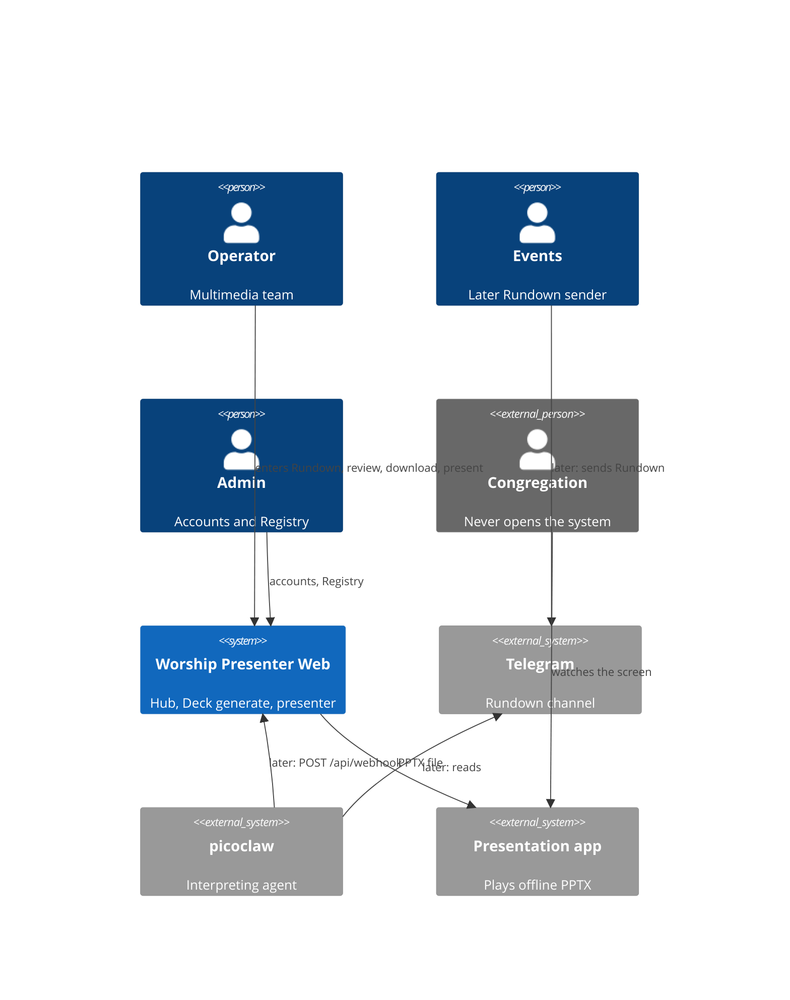

# C4 L1 — System context

Provenance: as-built `src/` + EXPERIENCE IA. Amended DEC-003 (not regenerated from scratch).

This phase: Operator enters the Rundown in Hub. Telegram and picoclaw remain on the diagram as last-phase intake (CAP-11). External systems: Telegram, picoclaw, PPTX player. Inside the boundary (L2): `api`, `spa`, `pptx-worker` (DEC-003 / AD-30).
