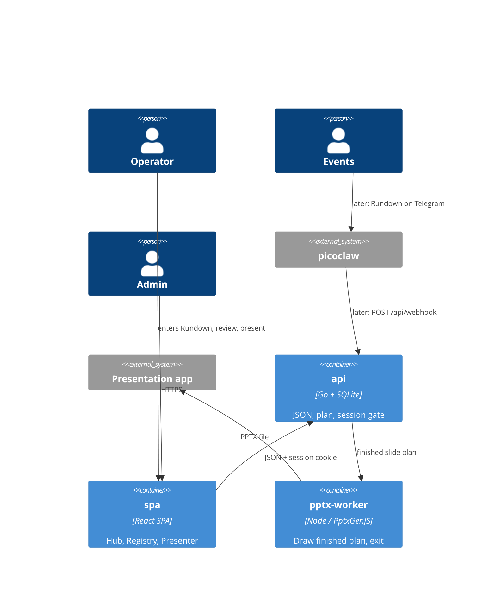

# C4 L2 — Containers

SSOT for the container list: `components.yaml` `containers:`. The matrix below renders `product_components[].containers`.

Amended DEC-003 / AD-30. SQLite is a file inside the `api` process, not a container. Retired name `web` (one Next.js process) is not a container.

## Elements

| Element | What it is | Notes |
| --- | --- | --- |
| `api` | Go process; `built: true` | Always-on. Owns SQLite. AD-5 gate. Production also serves SPA files. |
| `spa` | React SPA; `built: true` | Browser only. MUST NOT open SQLite (AD-30). |
| `pptx-worker` | Node child; `built: true` | On-demand. MUST NOT stay up or open SQLite (AD-30). One PC (Hub), so no L3. |
| picoclaw | External system | L1; we do not deploy its runtime |
| Presentation app | External system | Plays offline PPTX (AD-1) |

## Relationships

| From | To | Purpose | Over |
| --- | --- | --- | --- |
| picoclaw | api | Later intake / Rundown correction (CAP-11) | HTTP JSON, `WEBHOOK_SECRET` |
| Operator / Admin | spa | Create Rundown, review, generate, present, Registry | HTTPS + session |
| spa | api | CRUD, plan, scripture | JSON + cookie |
| api | pptx-worker | Generate PPTX | exec + finished plan on stdin/argv; no SQLite |
| pptx-worker | Presentation app | Sabbath guarantee | PPTX file on the laptop |

## Product Components per container

| Container | Product Components living in it |
| --- | --- |
| api | hub, presenter, registry |
| spa | hub, presenter, registry |
| pptx-worker | hub |

## What is deliberately not shown

- SQLite file, PPTX cache, `UPLOADS_DIR` — durable AD-4 paths, not L2 boxes.
- Cloudflare Tunnel — a deploy channel, not our container.
- Operator vs projected shells — SPA internals (AD-24), drawn at L3 `spa`.
