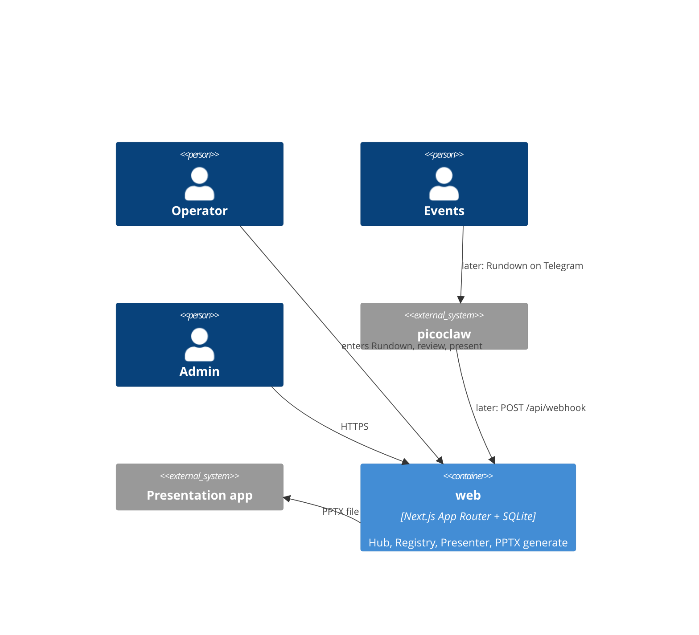

# C4 L2 — Containers

As-built 2026-08-18. SSOT for the container list: `components.yaml` `containers:`. The matrix below renders `product_components[].containers`.

A Go API + React SPA + Node worker (brief addendum) is **not** a container here. That would invert AD-2/AD-4; it waits on a `DEC-` (OQ-6). SQLite is a file inside the `web` process, not a container.

## Elements

| Element | What it is | Notes |
| --- | --- | --- |
| `web` | One Next.js process; `built: true` | `src/`; Docker/standalone. Entry: `src/proxy.ts` (AD-5) |
| picoclaw | External system | L1; we do not deploy its runtime |
| Presentation app | External system | Plays offline PPTX (AD-1) |

## Relationships

| From | To | Purpose | Over |
| --- | --- | --- | --- |
| picoclaw | web | Later intake / Rundown correction (CAP-11) | HTTP JSON, `WEBHOOK_SECRET` |
| Operator / Admin | web | Create Rundown, review, generate, present, Registry | HTTPS + session |
| web | Presentation app | Sabbath guarantee | PPTX file on the laptop |

## Product Components per container

| Container | Product Components living in it |
| --- | --- |
| web | hub, presenter, registry |

## What is deliberately not shown

- SQLite file, PPTX cache, `UPLOADS_DIR` — durable AD-4 paths, not L2 boxes.
- Cloudflare Tunnel — a deploy channel, not our container.
- The two App Router roots `(operator)` / `(projected)` — those are LCs inside `web` (AD-24), drawn at L3.
