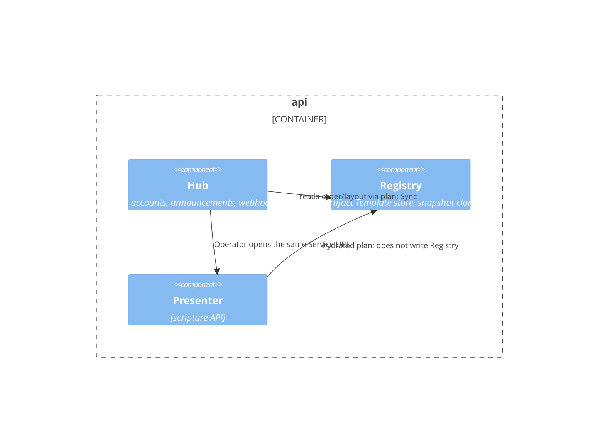

# C4 L3 — api

Boxes = Product Component. Container `api` holds all three, so L3 is required. Amended from the retired `web` L3 (DEC-003); that drawing was not regenerated from scratch.

## Elements

| Element | What it is | Notes |
| --- | --- | --- |
| Hub | Operator door; Hub-form intake this phase; webhook later (CAP-11); owns LC-16 plan | rundown-to-service FRs + operator-turn Hub |
| Registry | Deck structure in SQLite | Not the week's payload |
| Presenter | Verse lookup API (LC-9) | Screens live on `spa` |

## Relationships

| From | To | Purpose | Over |
| --- | --- | --- | --- |
| Hub | Registry | `buildSlidePlan` + Sync Artifact | Modules in the Go process |
| Hub | Presenter | Operator moves to slideshow/presenter | URL navigation (SPA) |
| Presenter | Registry | Hydrated slide plan | Plan built in Hub LC-16 (AD-7, AD-12); Presenter does not write templates |

## What is deliberately not shown

- Gateway LCs (`LC-1`…`LC-11` except LC-10) — listed in `components.yaml` and the SDD.
- PptxGenJS — `pptx-worker` (LC-13), not inside `api`.
