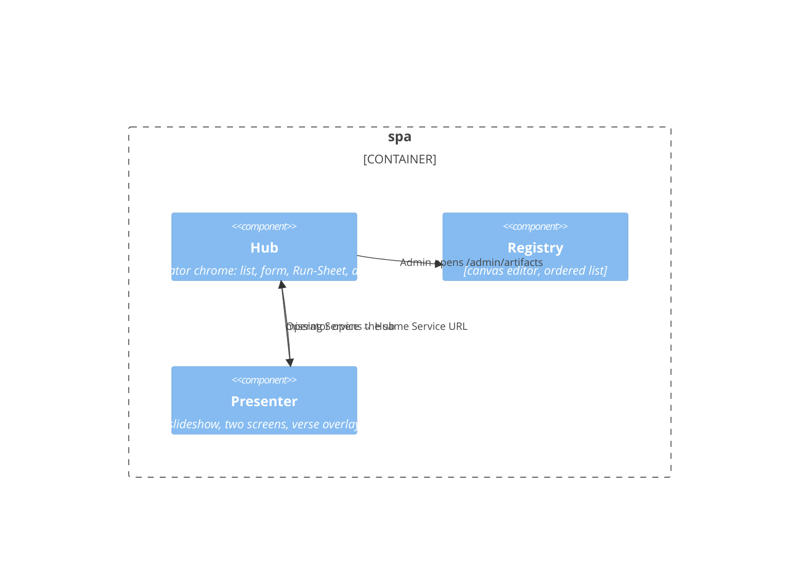

# C4 L3 — spa

Boxes = Product Component. Container `spa` holds all three, so L3 is required. DEC-003.

## Elements

| Element | What it is | Notes |
| --- | --- | --- |
| Hub | Operator shell | AD-24 theme / `ui_locale` |
| Registry | Admin editor | Fabric in the browser (AD-13) |
| Presenter | Operator controls + projected shell | LC-10 / LC-14 live here; projected URLs closed to chrome (AD-24) |

## Relationships

| From | To | Purpose | Over |
| --- | --- | --- | --- |
| Hub | Presenter | Present this Service | client navigation |
| Hub | Registry | Author templates | client navigation |
| Presenter | Hub | UC-11 missing Service | client navigation |

## What is deliberately not shown

- JSON calls to `api` — L2.
- BroadcastChannel internals — LC-10 in the SDD.
