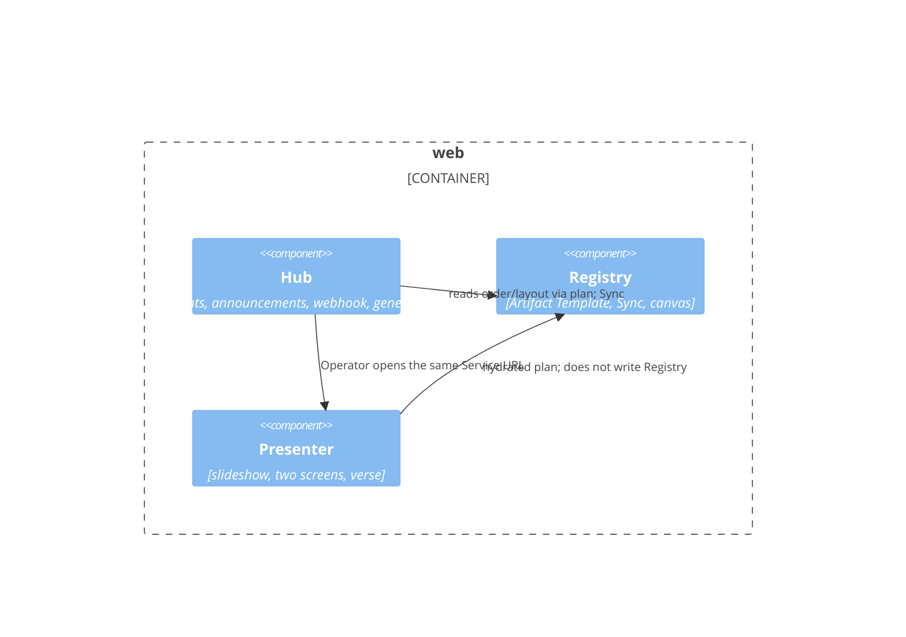

# C4 L3 — web

Boxes = Product Component. One `web` container holds all three, so L3 is required.

## Elements

| Element | What it is | Notes |
| --- | --- | --- |
| Hub | Operator door + Events intake | rundown-to-service FRs + operator-turn Hub |
| Registry | Deck structure | Not the week's payload |
| Presenter | In-browser present | Offline guarantee remains PPTX on Hub |

## Relationships

| From | To | Purpose | Over |
| --- | --- | --- | --- |
| Hub | Registry | `buildSlidePlan` + Sync Artifact | Server modules in the same process |
| Hub | Presenter | Operator moves to slideshow/presenter | URL navigation |
| Presenter | Registry | Hydrated slide plan | `buildSlidePlan` (AD-7, AD-12); Presenter does not write templates |

## What is deliberately not shown

- Gateway LCs (`LC-1`…`LC-11`) — listed in `components.yaml` and the SDD.
- PptxGenJS — called by Hub on download, still in the `web` process.
