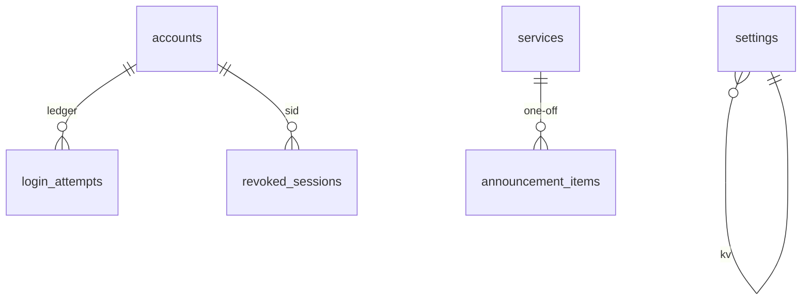

# Model — Hub (physical)

Source: `src/lib/db/index.ts` startup DDL. [verified]

## Entities

| Entity | Table | Identified by |
| --- | --- | --- |
| Service | `services` | `id` |
| AnnouncementItem | `announcement_items` | `id` |
| Account | `accounts` | `id` / `username` |
| AppSetting | `settings` | `key` |
| Hymn (corpus) | `hymns` | `(book_code, number)` |

## Relationships

One Service has zero or many uploads in the JSON payload and one-off announcement items (`service_id`). Recurring items: `service_id` null. One Account one role.

## Data dictionary

| Table | Column | Type | Meaning |
| --- | --- | --- | --- |
| services | id | INTEGER PK | Service row identity |
| services | date | TEXT | Worship date `YYYY-MM-DD` |
| services | raw_payload | TEXT | Raw Rundown |
| services | parsed_data | TEXT | Parser-result JSON |
| services | images_payload | TEXT | Events image-URL JSON |
| services | participants_payload | TEXT | Role JSON |
| services | created_at | DATETIME | Row created time |
| services | updated_at | DATETIME | AD-6 precondition |
| hymns | book_code | TEXT | Book key (AD-26) |
| hymns | number | INTEGER | Number in that book |
| hymns | title | TEXT | Hymn title in the Song Book |
| hymns | lyrics | TEXT | Verse/refrain lyrics |
| announcement_items | image_url | TEXT | Image ref (AD-8) |
| announcement_items | service_id | INTEGER NULL | null = recurring |
| announcement_items | sort_order | INTEGER | Display order |
| accounts | username | TEXT UNIQUE | Sign-in name |
| accounts | password_hash | TEXT | Password hash |
| accounts | role | TEXT | `admin` \| `operator` |
| accounts | token_version | INTEGER | Revoke session |
| login_attempts | scope | TEXT | `user-ip` \| `ip` |
| login_attempts | key | TEXT | Lockout-window key |
| login_attempts | attempted_at | INTEGER | unix s |
| revoked_sessions | sid | TEXT PK | Revoked session id |
| revoked_sessions | expires_at | INTEGER | End of revocation |
| settings | key | TEXT PK | including `slide_transition`, `ui_locale`, `data_version` |
| settings | value | TEXT | Settings string value |

## Invariants

- `UNIQUE(book_code, number)`
- Deleting a Service cascades one-off announcements
- Schema only through startup DDL (AD-9)

## Physical notes

One SQLite file `DB_PATH`, WAL, `busy_timeout` 5000, FK on. Not a separate container.
