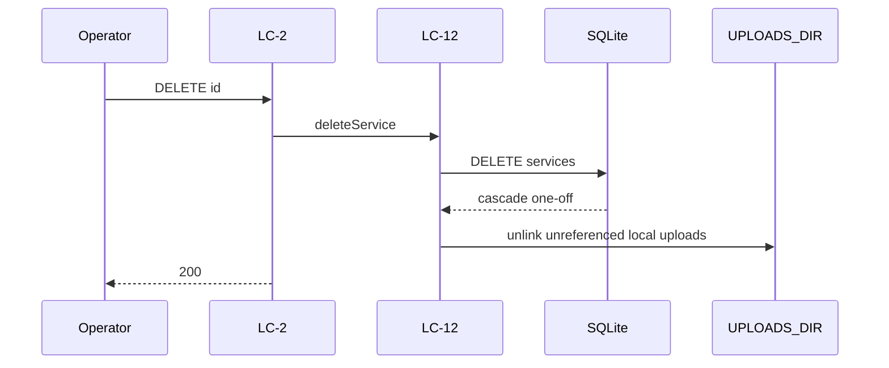

# Flow — Delete Service

## Realizes

UC-7. Irreversible.

## Participants

LC-2 → LC-12 → SQLite (cascade one-off announcements) → unlink `UPLOADS_DIR` that is no longer referenced.

## Happy path

1. Operator DELETE `/api/services/[id]` (session).
2. LC-12 collects `/api/uploads/…` refs belonging to this Service.
3. LC-12 deletes the Service row.
4. FK cascades items with that `service_id`.
5. LC-12 unlinks files that are no longer referenced (recurring announcements or another Service).
6. Items with `service_id` null remain (BR-5).

## Sequence diagram

## Failure modes

| Hop | Failure | System does | Safe to retry |
| --- | --- | --- | --- |
| id | missing | 404 | yes (idempotent after success) |
| DB | 500 mid-way | does not claim success | yes |
| File unlink | fs failed | row already gone; error in log | no via DELETE (404) |

## Guarantees

Successful DELETE then retry → 404. No undo. That week's local files leave `UPLOADS_DIR` unless still referenced by a recurring announcement.
