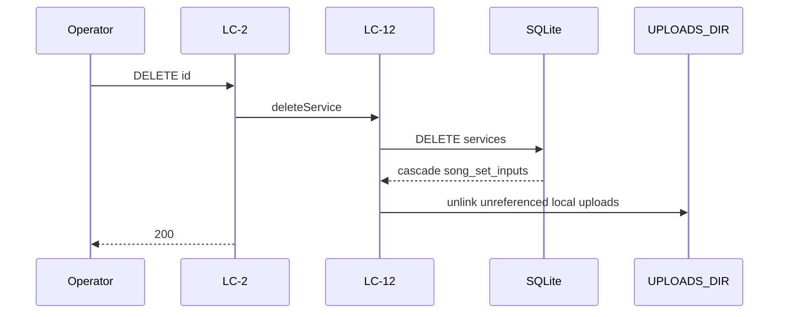

# Flow — Delete Service

## Realizes

UC-7. Irreversible.

## Participants

LC-2 → LC-12 → SQLite (cascade `song_set_inputs`, DEC-004 — see Note) → unlink `UPLOADS_DIR` that is no
longer referenced.

**DEC-004 change.** The old cascade target was `announcement_items` (one-off rows; recurring rows with
`service_id` null survived, BR-5). That table retires from Hub's write paths with `03-announcements.md`
— this flow MUST stop touching it the moment that contract retires, per the caution in
`05-model/data-model.md` § *Retirement of `announcement_items`* (an Admin has not necessarily finished
re-authoring that content into Registry Announcement Sets yet, so this flow deleting rows out from
under that migration would be a second, undocumented way to lose the same data). The new cascade
target is the planned `song_set_inputs` table (`ON DELETE CASCADE` on `service_id`).

## Happy path

1. Operator DELETE `/api/services/[id]` (session). Gate 401 if the session is expired — no unlink, no row delete (OQ-23).
2. LC-12 collects `/api/uploads/…` refs belonging to this Service.
3. LC-12 deletes the Service row.
4. FK cascades `song_set_inputs` rows with that `service_id`.
5. LC-12 unlinks files that are no longer referenced by another Service.
6. Registry Announcement Sets and their images are untouched — they are Registry-owned structure, not Service-scoped (BR-5).

## Sequence diagram

## Failure modes

| Hop | Failure | System does | Safe to retry |
| --- | --- | --- | --- |
| session | expired | 401 from `internal/gate`; no partial write (OQ-23) | yes after sign-in |
| id | missing | 404 | yes (idempotent after success) |
| DB | 500 mid-way | does not claim success | yes |
| File unlink | fs failed | row already gone; error in log | no via DELETE (404) |

## Guarantees

Successful DELETE then retry → 404. No undo. That week's local files leave `UPLOADS_DIR` unless still
referenced by another Service's upload or by an Announcement Set canvas in the Registry (image refs
are shared by reference, DEC-004 §Copy/paste — Hub's unlink check must widen from "another Service" to
also cover a live Registry reference before this cascade ships, or a delete could remove a file an
Announcement Set still points at).
