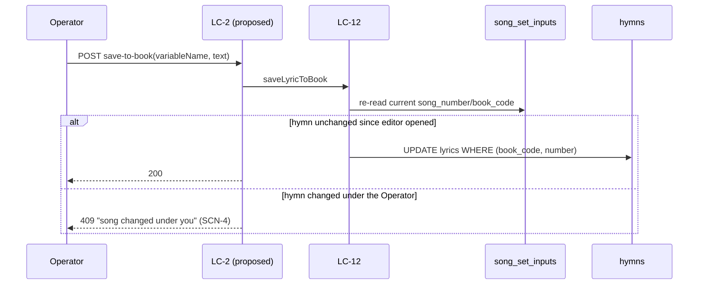

# Flow — Save lyric edit to Song Book

## Realizes

UC-28 alternate flow. BR-7. DEC-004 Supplement S12.

## Unblocked (DEC-005 / AD-36)

This flow was **blocked**: it is the one write path this document proposes into what was, until now,
a projected corpus table, and AD-25 ("A Shipped Reference Corpus Is a Projection of Its Committed
File") stated no administrator or operator write path into `hymns` existed, and that adding one
"reopens this decision before it ships." The owner ratified that the song book becomes
administrator-owned data after a one-time bootstrap (DEC-005), recorded as a living rule in AD-36,
which supersedes AD-25 in part — the song-book half only; the bible family is untouched. This flow is
therefore designed rather than blocked, with one precondition build must satisfy first: `upsertHymns`
(`src/lib/db/index.ts:63-81`) must be the bootstrap-once shape AD-36 requires (insert-if-absent,
gated by a marker, no more unconditional `title`/`lyrics` overwrite on every boot) before this write
path ships, or a restart would silently discard the very correction this flow exists to persist. See
*Migration* below for how that change reaches the running schema.

## Participants

Operator → LC-2 (new route, unnumbered — `00-inventory.md`) → LC-12 (reads current `song_set_inputs`
row for precondition) → SQLite `hymns` (the write) and `song_set_inputs` (read-only here — the
Service's own override already saved via the ordinary PUT before this button is even shown as usable,
per `05-model/form-fields.md`).

## Happy path

1. Operator has already saved the Service with an edited `lyricText` for one Song Set entry (UC-28 main flow, steps 1–4) — the ordinary override write.
2. Operator presses "Save to Song Book" beside that entry's editor.
3. LC-12 re-reads the entry's **current** resolved hymn `(song_book_code, song_number)` at the moment of the press — not trusted from the page's last-loaded state (SCN-4).
4. If the resolved hymn matches what the editor was showing, LC-12 writes the edited text into `hymns.lyrics` for that `(book_code, number)`.
5. Every future Service that has not itself overridden this hymn's lyrics now resolves to the corrected text (LC-16 resolution order, BR-7).

## Sequence diagram

## Failure modes

| Hop | Failure | System does | Safe to retry |
| --- | --- | --- | --- |
| precondition | resolved hymn moved since the editor opened | 409; the Service's own override is unaffected (already saved separately) | yes, after re-reading the current hymn |
| entry state | `variable_name` has no resolvable hymn (no song number, or unknown number) | 400; nothing to save back to | no — fix the song number first |
| corpus write | disk/DB error writing `hymns` | 500; Service-level override stands regardless — the week's Deck is correct either way | yes |
| session | expired | 401 before the handler; no partial write | yes after sign-in |

## Guarantees

A successful save-to-book never fires against a hymn number the Operator did not actually see in the
editor at the moment of the press (SCN-4). A failed save-to-book never touches the Service's own
Lyric Override — that field's correctness for *this week's* Deck never depends on whether the corpus
write succeeds.

## Migration (AD-21) — landing the bootstrap-once shape before this write path ships

Two changes travel together in one numbered `data_version` step (AD-18, AD-21), because the second is
unsafe without the first:

1. **`upsertHymns` becomes a bootstrap.** Replace the unconditional `ON CONFLICT DO UPDATE SET title =
   excluded.title, lyrics = excluded.lyrics` with an insert-only-if-absent write (`ON CONFLICT DO
   NOTHING`, or an existence check before insert), gated by a per-book-code marker in `settings`
   (parallel to `ARTIFACT_REGISTRY_BOOTSTRAP_KEY`, AD-17) so a book already seeded is never
   re-bootstrapped and a book seen for the first time still seeds every row with no operator step
   (AD-36).
2. **This route ships.** `POST /api/services/[id]/song-sets/[variableName]/save-to-book` goes live
   only in the same release as (1) — landing the write path first, with the old reconcile still
   running, would let the very next restart silently discard the Operator's correction, exactly the
   hazard AD-36 exists to close.

Both land at the next `data_version` bump. No column changes: the existing `hymns(book_code, number,
title, lyrics)` shape is unchanged — only the write discipline around it changes, which is why this is
a behavioural migration on the boot path rather than a schema migration on `hymns` itself.
