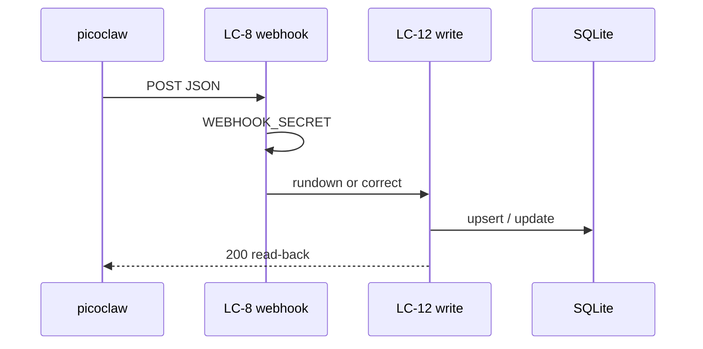

# Flow — Webhook intake and correction

Later **CAP-11**. As-built in `src/app/api/webhook/route.ts`. Not this phase's handover (that is UC-2 / `/services/new`). Do not delete this flow.

## Realizes

UC-1 new rundown/upsert; UC-17 `action: correct` — both CAP-11 later. Third party: picoclaw.

## Participants

LC-8 → LC-12 → SQLite. Read-back to picoclaw.

## Happy path

1. picoclaw POST LC-8 with the secret.
2. LC-8 refuses 503/401 if the secret fails.
3. LC-12 parse + resolve hymns. Specified: no readable date → no insert (OQ-21). As-built rundown still uses `localIsoDate()` — SDD Evidence BUG.
4. LC-12 upserts `services` by date, or corrects an existing row. Correction with a named date and no Service does not create and does not fall back to nearest Sabbath (OQ-21, SCN-3). Images: specified attach or fail visibly (OQ-22); as-built `coerceImageUrls` filters — SDD Evidence BUG.
5. JSON read-back (titles, `failedHymnNumbers`).

## Sequence diagram

## Failure modes

| Hop | Failure | System does | Safe to retry |
| --- | --- | --- | --- |
| Secret | wrong / unset | 401 / 503 | yes after the secret is correct |
| Parse | no date | specified: no insert (OQ-21). As-built: `localIsoDate()` insert | yes after a dated body |
| Parse | bad text with a date | failure visible; row saved (NFR-5) | yes |
| Write | 500 mid-way | does not claim success | yes for same-date upsert |
| Correction | target missing | error, not insert; no nearest-Sabbath fallback (OQ-21) | no as correct |
| Images | unsafe URL | specified: fail visibly (OQ-22). As-built: dropped by `coerceImageUrls` | yes after a usable URL |

## Guarantees

Per-date upsert is safe at-least-once. Correction is not create and does not fall back to nearest Sabbath (OQ-21). Specified: no readable date → no insert. No Hub timeout toward picoclaw.
