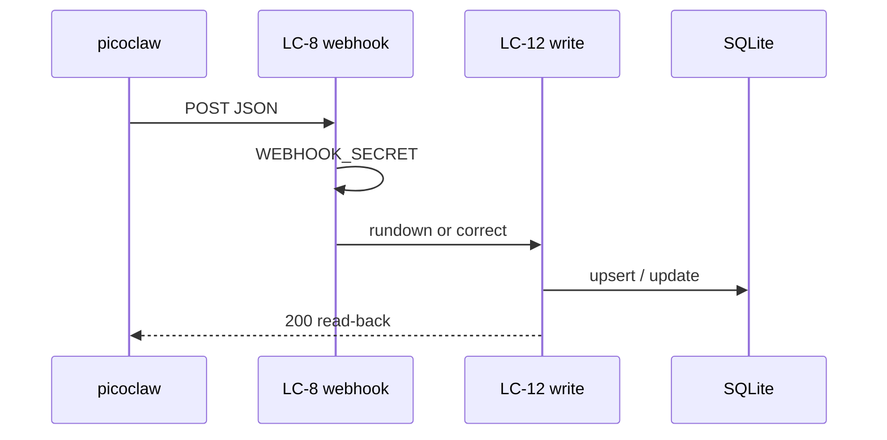

# Flow — Webhook intake and correction

## Realizes

UC-1 new rundown/upsert; UC-17 `action: correct`. Third party: picoclaw.

## Participants

LC-8 → LC-12 → SQLite. Read-back to picoclaw.

## Happy path

1. picoclaw POST LC-8 with the secret.
2. LC-8 refuses 503/401 if the secret fails.
3. LC-12 parse + resolve hymns.
4. LC-12 upserts `services` by date, or corrects an existing row.
5. JSON read-back (titles, `failedHymnNumbers`).

## Sequence diagram

## Failure modes

| Hop | Failure | System does | Safe to retry |
| --- | --- | --- | --- |
| Secret | wrong / unset | 401 / 503 | yes after the secret is correct |
| Parse | bad text | failure visible | yes |
| Write | 500 mid-way | does not claim success | yes for same-date upsert |
| Correction | target missing | error, not insert | no as correct |

## Guarantees

Per-date upsert is safe at-least-once. Correction is not create. No Hub timeout toward picoclaw.
