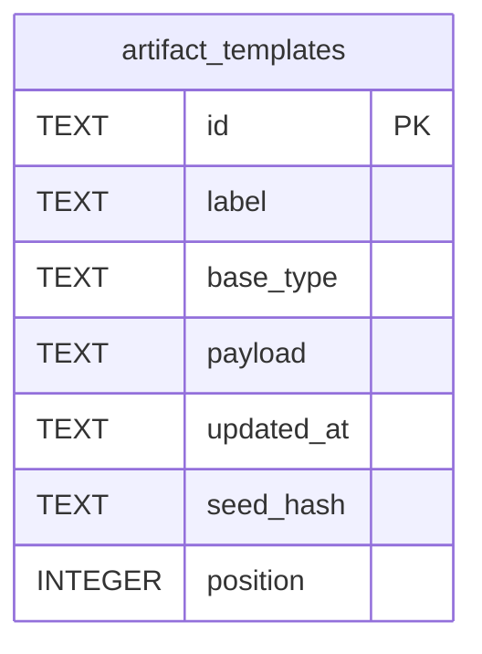

# Model — Registry (physical)

Diagram columns match the dictionary.

## Entities

| Entity | Table | Identified by |
| --- | --- | --- |
| ArtifactTemplate | `artifact_templates` | `id` TEXT |
| ServiceRegistrySnapshot | — | [MISSING] table. Planned AD-16 / FR-21; do not delete this row |

## Data dictionary

| Table | Column | Type | Meaning |
| --- | --- | --- | --- |
| artifact_templates | id | TEXT PK | Stable template identity |
| artifact_templates | label | TEXT | List label; derived from payload (AD-18) |
| artifact_templates | base_type | TEXT | Slot/kind key (AD-19); payload is authoritative |
| artifact_templates | payload | TEXT | Layout JSON including baseType |
| artifact_templates | updated_at | TEXT | Optimistic-concurrency token |
| artifact_templates | seed_hash | TEXT | Whether Reset to shipped seed is available |
| artifact_templates | position | INTEGER | Order 0..N-1 with no gap |

## Invariants

- `position` unique and sequential after bootstrap
- `base_type`/`label` columns must agree with the payload on the same write (AD-18; agreement tests still debt)
- Seeder does not fill a missing id after bootstrap (AD-17)

## Physical notes

No snapshot table. `RegistrySnapshot` in code = live map per plan build, a name clash with AD-16.
