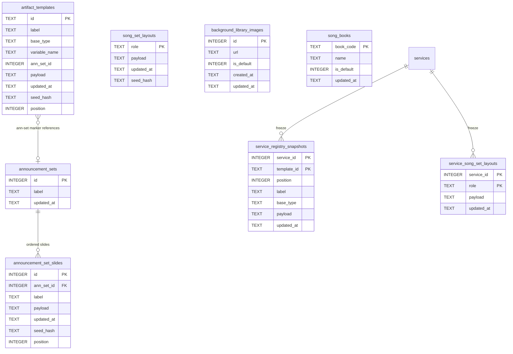

# Model — Registry (physical)

**Physical-shape decision (DEC-004, closed at G4):** own tables per new concept — not one
overloaded discriminator row on `artifact_templates`. See SDD Decision Summary for why. None of
the five new tables below exist yet ([MISSING] throughout); `artifact_templates` and
`service_registry_snapshots` are as-built.

`services` and `hymns` are Hub-owned; every table above is Registry-owned (AD-16, AD-31, AD-33).
Diagram columns match the dictionary. `hymns.book_code` (Hub-owned, S3) is not redrawn here — it
is a plain TEXT column that a Song Book's `book_code` is expected to match, never a DB foreign
key across the two components' tables (no cross-component FK; checked in code where it matters,
same discipline as AD-31's write-path uniqueness).

## Entities

| Entity | Table | Identified by |
| --- | --- | --- |
| ArtifactTemplate | `artifact_templates` | `id` TEXT |
| ServiceRegistrySnapshot | `service_registry_snapshots` | `(service_id, template_id)` |
| SongSetLayoutTrio (role) | `song_set_layouts` | `role` TEXT (`title`\|`verse`\|`reff`) — the **live** table Admin edits |
| ServiceSongSetLayoutTrio (role) | `service_song_set_layouts` | `(service_id, role)` — the **frozen** per-service copy (AD-16, reversed 2026-08-20) |
| AnnouncementSet | `announcement_sets` | `id` INTEGER |
| AnnouncementSetSlide | `announcement_set_slides` | `id` INTEGER |
| BackgroundLibraryImage | `background_library_images` | `id` INTEGER |
| SongBook | `song_books` | `book_code` TEXT |

## Data dictionary

| Table | Column | Type | Meaning |
| --- | --- | --- | --- |
| artifact_templates | id | TEXT PK | Stable spine-row identity |
| artifact_templates | label | TEXT | List label; for a Song Set entry this is its title (AD-18) |
| artifact_templates | base_type | TEXT | `general` \| `song-set-entry` \| `ann-set-marker` (AD-31; was `general`\|`song-set`\|`announcement`) |
| artifact_templates | variable_name | TEXT NULL | Set only when `base_type = 'song-set-entry'`; the entry's cross-boundary identity (AD-31). Uniqueness enforced among **live** rows only (LC-15, never a column constraint) — a `gone` row's `variable_name` MAY be reused by a later entry (owner ruling, 2026-08-20); no reservation, no tombstone |
| artifact_templates | ann_set_id | INTEGER NULL | Set only when `base_type = 'ann-set-marker'`; references `announcement_sets.id` in code (no DB `FOREIGN KEY`, same discipline) |
| artifact_templates | payload | TEXT | Canvas layout JSON; NULL for `song-set-entry` and `ann-set-marker` rows — they carry no canvas of their own (AD-33) |
| artifact_templates | updated_at | TEXT | Optimistic-concurrency token |
| artifact_templates | seed_hash | TEXT | Whether Reset to shipped seed is available; NULL for `song-set-entry`/`ann-set-marker` rows (nothing to reset — a rename is the only mutable field) |
| artifact_templates | position | INTEGER | Spine order 0..N-1 with no gap |
| song_set_layouts | role | TEXT PK | `title` \| `verse` \| `reff` — exactly 3 rows, seeded once, never added to or removed from |
| song_set_layouts | payload | TEXT | Canvas layout JSON; `verse`/`reff` are authored on a blank canvas (no background field at authoring time, AD-33) |
| song_set_layouts | updated_at | TEXT | Optimistic-concurrency token |
| song_set_layouts | seed_hash | TEXT | Reset availability, same semantics as `artifact_templates` |
| announcement_sets | id | INTEGER PK | Set identity |
| announcement_sets | label | TEXT | Admin's name for the set (e.g. "Announcement 1") |
| announcement_sets | updated_at | TEXT | Optimistic-concurrency token for set-level edits (label rename) |
| announcement_set_slides | id | INTEGER PK | Slide identity within its set |
| announcement_set_slides | ann_set_id | INTEGER | Owning set |
| announcement_set_slides | label | TEXT | List label |
| announcement_set_slides | payload | TEXT | Canvas layout JSON — same shape and validation as a General (AD-15) |
| announcement_set_slides | updated_at | TEXT | Optimistic-concurrency token |
| announcement_set_slides | seed_hash | TEXT | Reset availability for the shipped seed sets (reference deck ann-set-1/2) |
| announcement_set_slides | position | INTEGER | Order 0..N-1 within `ann_set_id`, no gap |
| background_library_images | id | INTEGER PK | Image identity |
| background_library_images | url | TEXT | Resolves through the same shared helpers as any other Registry image (AD-8); images only (S10) — no colour/gradient row shape exists |
| background_library_images | is_default | INTEGER (0/1) | At most one row is 1 at a time, enforced in LC-15, never a partial-unique-index-only design (defense in depth: a code check runs regardless) |
| background_library_images | created_at | TEXT | Add time |
| background_library_images | updated_at | TEXT | Optimistic-concurrency token |
| song_books | book_code | TEXT PK | Matches `hymns.book_code` (Hub-owned); e.g. `SDAH` |
| song_books | name | TEXT | Display name |
| song_books | is_default | INTEGER (0/1) | At most one row is 1 at a time, same discipline as Background Library default |
| song_books | updated_at | TEXT | Optimistic-concurrency token |
| service_registry_snapshots | service_id | INTEGER PK | Hub Service; CASCADE on delete |
| service_registry_snapshots | template_id | TEXT PK | Frozen spine-row identity (may be a `general` or `song-set-entry` id) |
| service_registry_snapshots | position | INTEGER | Frozen order 0..N-1 |
| service_registry_snapshots | label | TEXT | Frozen list label |
| service_registry_snapshots | base_type | TEXT | Frozen entry key; no `slot`/`kind` column (AD-19) |
| service_registry_snapshots | payload | TEXT | Frozen layout JSON |
| service_registry_snapshots | updated_at | TEXT | Token copied from the live row at clone time |
| service_song_set_layouts | service_id | INTEGER PK | Hub Service; CASCADE on delete, same discipline as `service_registry_snapshots` |
| service_song_set_layouts | role | TEXT PK | `title` \| `verse` \| `reff` — frozen copy of `song_set_layouts.role`, exactly 3 rows per Service |
| service_song_set_layouts | payload | TEXT | Frozen trio layout JSON, copied from the live `song_set_layouts` row at freeze time |
| service_song_set_layouts | updated_at | TEXT | Token copied from the live row at clone time |

**Snapshot scope, extended by AD-35 and reversed for the trio (owner ruling, 2026-08-20).**
Creating or Syncing a Service clones `artifact_templates` (the spine) into
`service_registry_snapshots` exactly as before, **and now also** clones every
`announcement_set_slides` row belonging to a set any live marker on that spine references, into a
parallel `service_announcement_set_slides` table (same shape as `service_registry_snapshots`, keyed
`(service_id, ann_set_id, slide_id)`) — [MISSING], this design's own addition, not read from code.

**The shared `song_set_layouts` trio is now snapshotted too**, into a parallel
`service_song_set_layouts` table keyed `(service_id, role)` — [MISSING], this design's own
addition. An earlier draft of this design left the trio unfrozen, read live at generate/render time
the same way the plan reads other shared, non-per-service structure (AD-12); the owner ruled
freezing is better, so the trio now follows the same clone-on-create / Sync-only-replace discipline
as every other structural piece AD-16 clones. Editing the live trio today therefore does **not**
reach any existing Service — only a new Service created after the edit, or an existing Service
after an explicit Sync Artifact, sees it. This closes the inconsistency the earlier draft flagged
against UC-20 (`04-usecases/UC-20-deck-matches-payload.md`), which already described the trio as
part of "the Service's frozen structure" — that use case was right, and this data model now
matches it.

## Invariants

- Live `artifact_templates.position` unique and sequential after bootstrap, delete, and reorder
- Live `announcement_set_slides.position` unique and sequential per `ann_set_id`
- Exactly 3 `song_set_layouts` rows exist at all times (`title`, `verse`, `reff`); no add/remove path
- Exactly 3 `service_song_set_layouts` rows exist per Service after its snapshot freezes (`title`,
  `verse`, `reff`); cloned at creation, replaced whole on Sync — same discipline as
  `service_registry_snapshots` (AD-16, reversed 2026-08-20)
- At most one live `artifact_templates` row per `variable_name` (AD-31, code-enforced); a `gone`
  row's `variable_name` does not count toward this and MAY be reused by a later live row (owner
  ruling, 2026-08-20)
- At most one `background_library_images.is_default = 1` row at a time (code-enforced)
- At most one `song_books.is_default = 1` row at a time (code-enforced)
- `ann_set_id` on a live `ann-set-marker` row must reference a live `announcement_sets.id`, checked in code (no DB `FOREIGN KEY`); a live marker referencing it blocks that set's own delete
- Snapshot `position` sequential per `service_id` (and per `ann_set_id` in the new service-side
  Announcement Set slide table) after clone/Sync
- `base_type`/`label` columns must agree with the payload on the same write (AD-18; agreement tests still debt)
- Seeder does not fill a missing live id after bootstrap, on any of the six live tables (AD-17)
- No `slot`/`kind` column on any table (AD-19)

## Physical notes

`RegistrySnapshot` in `src/lib/artifacts/registry-snapshot.ts` is the **live** map assembled per
plan build — a name clash with the `service_registry_snapshots` freeze; unchanged by this design.
Persisted Service plans read the frozen tables. Preview (no Service exists yet, so no snapshot
exists to read) reads the live tables directly, including `song_set_layouts` — the live table
itself never holds a frozen copy (that lives in `service_song_set_layouts`, see above). Every
Service that does have a snapshot reads its own `service_song_set_layouts` row, never
`song_set_layouts` directly.
