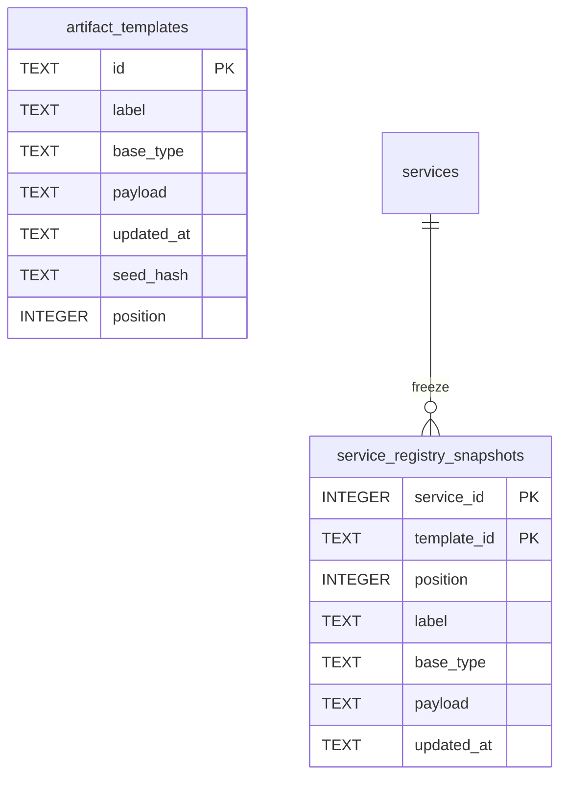

# Model — Registry (physical)

`services` is Hub-owned; the snapshot table is Registry-owned (AD-16). Diagram columns match the dictionary.

## Entities

| Entity | Table | Identified by |
| --- | --- | --- |
| ArtifactTemplate | `artifact_templates` | `id` TEXT |
| ServiceRegistrySnapshot | `service_registry_snapshots` | `(service_id, template_id)` |

## Data dictionary

| Table | Column | Type | Meaning |
| --- | --- | --- | --- |
| artifact_templates | id | TEXT PK | Stable template identity |
| artifact_templates | label | TEXT | List label; derived from payload (AD-18) |
| artifact_templates | base_type | TEXT | Slot/kind key (AD-19); payload is authoritative |
| artifact_templates | payload | TEXT | Layout JSON including baseType |
| artifact_templates | updated_at | TEXT | Optimistic-concurrency token |
| artifact_templates | seed_hash | TEXT | Whether Reset to shipped seed is available |
| artifact_templates | position | INTEGER | Order 0..N-1 with no gap |
| service_registry_snapshots | service_id | INTEGER PK | Hub Service; CASCADE on delete |
| service_registry_snapshots | template_id | TEXT PK | Frozen template identity |
| service_registry_snapshots | position | INTEGER | Frozen order 0..N-1 |
| service_registry_snapshots | label | TEXT | Frozen list label |
| service_registry_snapshots | base_type | TEXT | Frozen entry key; no `slot`/`kind` column (AD-19) |
| service_registry_snapshots | payload | TEXT | Frozen layout JSON (rendered structure, including AD-22 overrides in the payload) |
| service_registry_snapshots | updated_at | TEXT | Token copied from the live row at clone time |

Hub `services.registry_snapshot_at` records when that Service last cloned. Announcement membership is not in this table (BR-11).

## Invariants

- Live `position` unique and sequential after bootstrap, delete, and reorder
- Snapshot `position` sequential per `service_id` after clone/Sync
- `base_type`/`label` columns must agree with the payload on the same write (AD-18; agreement tests still debt)
- Seeder does not fill a missing live id after bootstrap (AD-17)
- No `slot`/`kind` column on either table

## Physical notes

`RegistrySnapshot` in `src/lib/artifacts/registry-snapshot.ts` is the **live** map assembled per plan build — a name clash with this freeze. Persisted Service plans read `service_registry_snapshots`. Preview (no Service) still reads the live map.
