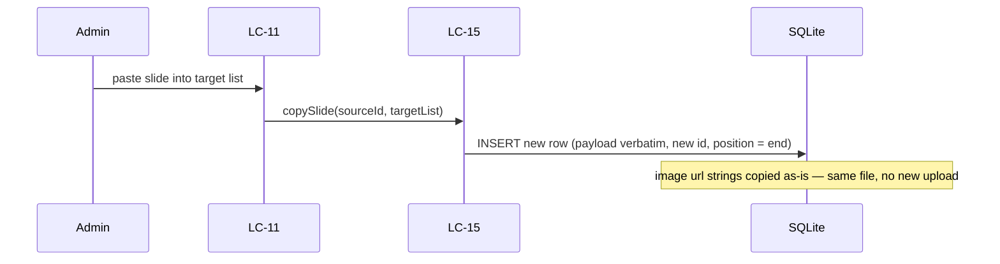

# Flow — Copy a slide between Main and an Announcement Set (or between sets)

## Realizes

UC-15's copy/paste alternate flow (BR-12, DEC-004). Full copy of text/shape/style/geometry/tokens
into a new row in the target list; an image element's reference is **shared**, never duplicated.

## Participants

LC-11 → LC-15 → `artifact_templates` / `announcement_set_slides`.

## Happy path

1. Admin copies one slide (a General on the spine, or a slide inside an Announcement Set) and
   pastes it into a target list — the spine, or any Announcement Set, including the one it came
   from.
2. LC-15 deep-copies the source `payload` JSON verbatim into a new row in the target table, with a
   **new id** and `position` appended to the target's end. Every image element's `url` string is
   copied byte-for-byte — the same file reference, not a new upload.
3. The new row is independently editable and independently deletable from that point on; editing
   or deleting it never touches the source row, and never touches the shared image file.

## Sequence diagram

## Failure modes

| Hop | Failure | System does | Safe to retry |
| --- | --- | --- | --- |
| No session / not Admin | 403 | does not write | after sign-in as Admin |
| Target list is a set that was deleted between copy and paste | 404 | does not write | re-read set list, retry |
| Source payload will not parse | Refuses to copy a corrupt row rather than propagating the corruption | no partial paste | fix the source row first |
| Later: source row is deleted | Target's copy is unaffected — it is a full independent copy, not a reference to the source row | n/a | — |
| Later: the shared image file is deleted from the Background Library or uploads | Any slide (source or copy) still holding that `url` string resolves it the same way any dangling image reference already resolves (existing AD-8 behaviour); this flow does not change that | n/a | — |

## Guarantees

Deleting a slide (source or any copy) never deletes an image another slide — anywhere in Main or
any Announcement Set — still references (BR-12). No cascade from a slide's `DELETE` to the
uploads store or the Background Library exists anywhere in this store. Finding and removing an
image nothing references any more is a **later Admin tool**, named here as deferred and not
designed further — it is not this wave's job (DEC-004 Cost section, S-series is silent on its
shape).
