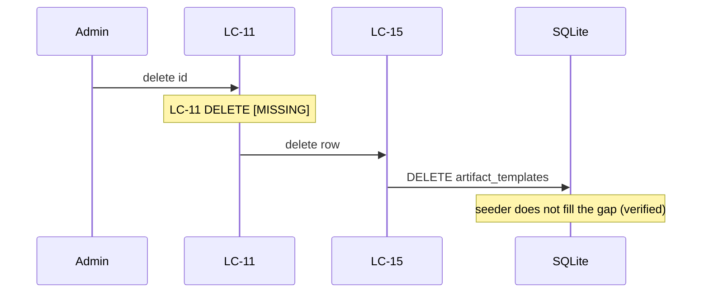

# Flow — Delete a Registry entry

## Realizes

UC-15 delete. Irreversible except Reset only for a row that is still `live` and has a seed — delete is not Reset.

## Participants

LC-11 → LC-15 → `artifact_templates`.

## Happy path

1. Admin deletes the entry. The LC-11 HTTP verb is [MISSING] — planned FR-21 / UC-15. Today the proof path is a SQL delete (`tests/registry-reseed.test.mjs`).
2. LC-15 would delete the row and close up `position`. Store function [MISSING]; same disposition.
3. The next boot does not insert that id (AD-17, SCN-5). This half is verified.

## Sequence diagram

## Failure modes

| Hop | Failure | System does | Safe to retry |
| --- | --- | --- | --- |
| LC-11 hop | no DELETE route | does not write; Admin has no HTTP verb | n/a — [MISSING] planned FR-21 |
| id | 404 | does not write | yes |
| Boot | seeder fills the gap | **defect** AD-17 | not a user retry |

## Guarantees

Delete + restart = still gone. Plan does not substitute seed for a missing id.
