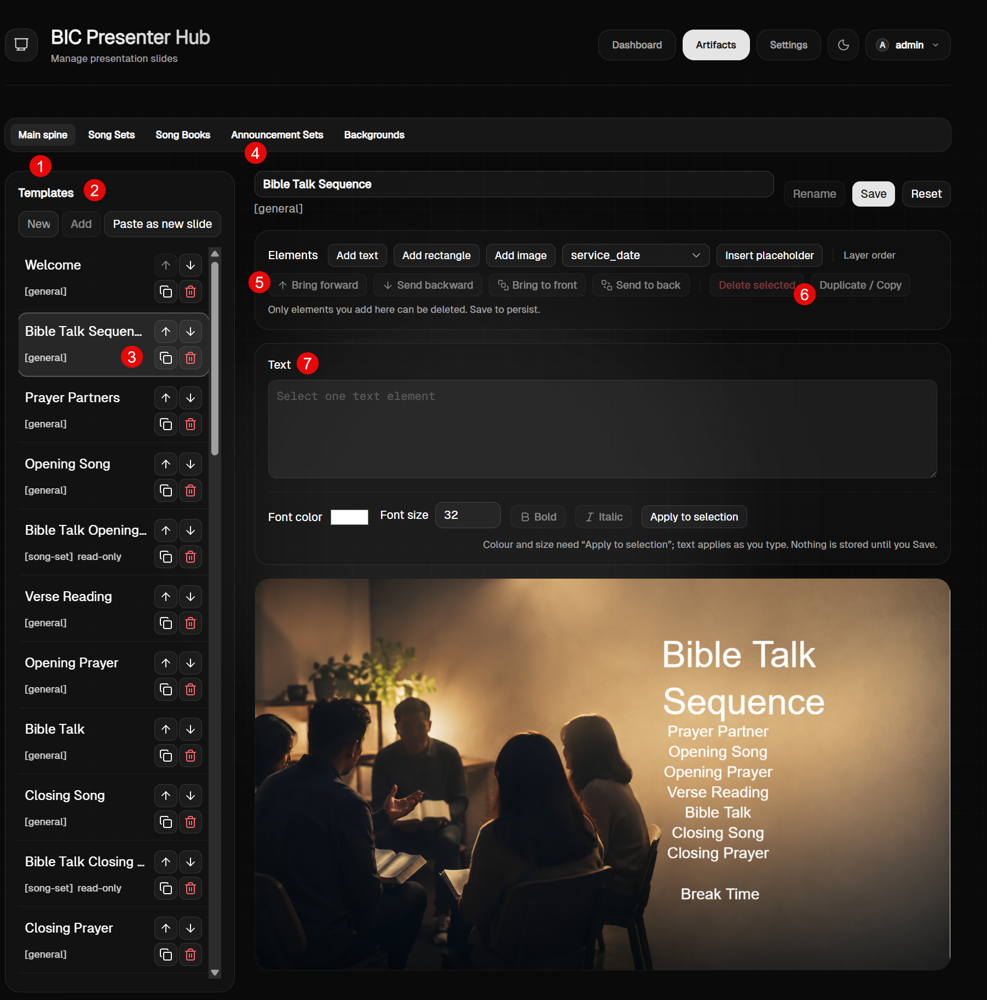

# Prompt 01 — Overhaul Menu Artifacts > Main Spine

- **Tanggal dicatat:** 2026-09-07
- **Sumber:** Prompt pengguna (mentah)
- **Gambar Referensi:** `images/prompt-01-artifacts-main-spine.png`
- **Status:** Raw Requirement (menunggu review & perumusan spek/tiket)

---

## 0. Pemetaan Nomor pada Gambar Referensi



Berdasarkan visual beranotasi merah yang diberikan:
- **Nomor 1 & 2**: Area di atas dan samping heading "Templates" (saat ini tombol `New`, `Add`, `Paste as new slide`). Direncanakan diganti dengan region **`New Slide`** selebar templates yang memuat kontrol penambahan slide/set (Dropdown jenis slide + tombol Add, atau tombol-tombol direct seperti `[General]`, `[Bible Talk Opening Song]`, `[Divine Service Opening Song]`, `[Announcement Set]`, dsb).
- **Nomor 3**: Tombol-tombol aksi pada setiap baris item template (`↑`, `↓`, icon copy, icon delete/trash). Dibuat hidden by default (hanya muncul saat hover). Behaviour copy diubah menjadi clone instan dengan penomoran judul baru, serta item list mendukung drag-and-drop reposisi (*click, drag, and release*).
- **Nomor 4**: Baris input judul slide saat ini ("Bible Talk Sequence [general]") dan aksi (`Rename`, `Save`, `Reset`). Ditata masuk ke dalam kontainer Card (Region) tersendiri agar konsisten, dengan siklus tombol: awal `[Rename]` & `[Reset]`, saat rename diklik beralih ke `[Cancel]` & `[Save]` dengan peletakan yang seragam dengan layar lainnya.
- **Nomor 5 & 6**: Tombol-tombol pengatur layer (`↑ Bring forward`, `↓ Send backward`, `Bring to front`, `Send to back`) dan aksi (`Delete selected`, `Duplicate / Copy`) pada Card Elements. Seluruhnya dipindahkan ke **Context Menu (Klik Kanan)** langsung pada objek di canvas, sehingga tombol-tombol ini dihilangkan dari card/sidebar.
- **Nomor 7**: Card "Text" dengan textarea besar ("Select one text element"), selector warna font, ukuran, bold, italic, dan tombol apply. Disederhanakan total: pengeditan teks dilakukan secara langsung melalui **double click pada objek teks di canvas (inline editing)** tanpa perlu textarea terpisah di samping. Pengaturan font/gaya dipindahkan ke Toolbar `[Element Properties]` di atas canvas.
- **Poin 8 & 9**: Penataan ulang Card Elements menjadi Toolbar elemen di atas canvas (`[Icon Text] [Icon Rectangle] [Icon Image] | [Dropdown Placeholder] [Add Placeholder]`) dengan mode drag area pada canvas untuk penentuan ukuran teks/rectangle, serta perbaikan rendering gambar agar tampil visual foto sebenarnya.

---

## 1. Teks Mentah dari Pengguna

```text
overhaul untuk menu `Artifacts` > `Main Spine`:
1. Di atas region template, harusnya ada region `New Slide`: lalu ada button [General] [Bible Talk Opening Song] Divine Service Opening Song], artinya seluruh list song-set dan announcement muncul disini, artinya disini kita bisa tambahkan slide tipe general baru, slide bible talk opening song (jadi kita bisa atur dia munculnya dimana, kita tahu ini adalah songset yang akan grow ketika pptx dan live). Intinya kita tidak hanya bisa membuat / insert slide baru tipe general, tapi menempatkan dimana slide bible talk opening song muncul atau divine service opening song, atau first announcement, etc. Dari sisi uiuxnya BT Opening Song secara sistem bisa diinsert berkali2, begitu juga announcement bisa diinsert berkali2, tidak dibatasi. Karena tidak dibatasi maka informasi `spine position` di Song Set Entries menjadi tidak relevan kalau cuma single, dia bisa multiple. Begitu juga main spine marker yang ada di Announcement Sets, apakah marker ini untuk insert announcement di main spine? harusnya gak perlu dengan cara seperti ini, harusnya pakai cara New Slide yang saya infokan di atas.
2. Jika di atas region template, dengan width yang sama dengan templates. Mungkin UIUXnya adalah: New Slide [Dropdown type] [button Add]
3. Tombol up/down, copy dan delete maunya dia hidden by default, tunggu cursor berada di atas itemnya baru muncul. Dan behaviour daripada copy itu adalah clone, jadi dia langsung cloning (baik konten maupun title - title tambahkan aja teks copy baru number). Lalu juga untuk item ini maunya bisa click, drag, dan release, untuk reposisi secara cepat. Jadi seperti dragable, flexible click drag release.
4. Untuk area detil slide, untuk slide name harusnya di dalam card (region). ini sekarang tidak di dalam region. Juga secara UI/UX saya maunya konsisten, seperti uiux lainnya, bahwa cukup ada tombol [Rename] [Reset]. Ketika Rename di klik muncul 2 tombol [Cancel] [Save] - dimana hide rename dan reset, kalau sudah selesai baru muncul lagi. Soal posisi seragamkan, baik mana deluan antara cancel save, atau soal apakah di kanan atau dikiri, karena UX harus sama di semua menu/screen.
5 dan 6. Untuk opsi bring forward/front, send backward/back, ini maunya muncul ketika klik kanan di element yang ada di canvas, sehingga opsi2 ini maunya tidak perlu ada. Click kanan ini memunculkan opsi: bring forward/front, send backward/back, delete, duplicate.
7. Untuk teks itu maunya di dobel klik teksnya (inline editing), sehingga gak perlu ada textbox terpisah
8. Canvas itu sendiri maunya punya Toolbar [Element Properties], pengganti font color, dll. Bukan diganti sebenarnya tapi ditata ulang:
- Jika yang di klik text, maka toolbarnya: [Font] [Size] [Color] [Bold] [Italic] Underline] [Paragraf style: justify, align left/right/center]. Modelnya dia langsung apply ke selected text. Text sudah pasti text area.
- Jika yang di klik adalah shape/rectangle, maka toolbarnya: [Color]. by default gak usah ada outline line
9. Card `Elements` saat ini sepertinya perlu diubah UI/UXnya. Intinya khan mirip slide, mau add new element. Maka mungkin langsung ada toolbar: [icon text] [icon rectangle] [icon image] lalu ada batas `|` [dropdown jenis placehodler] [Add Placeholder]
- ketika tambahkan element text, dia modelnya tidak langsung insert ke canvas, tapi main sistem drag area di canvas.
- Ketika tambahkan shape rectangle, dia modelnya tidak langsung insert ke canvas, tapi main sistem drag area di canvas.
- Ketika tambahkan image, dia bisa langsung insert ke canvas, tapi kenapa sekarang tidak muncul gambarnya?
10. Canvas di Main Spine harusnya ada fitur Change Background.
```

---

## 2. Struktur Pengelompokan Requirement Awal

### A. Penyusunan Slide & Penempatan Dynamic Sets (Poin 1 & 2)
- **Region "New Slide"**: Terletak di atas list template dengan lebar sama (`width: 100%`).
- **Pilihan Jenis Slide**: Dropdown tipe + tombol `Add` (atau button group):
  - Tipe `General` (slide mandiri).
  - Tipe `Song Set` dinamis (misal: *Bible Talk Opening Song*, *Divine Service Opening Song*, dll. yang akan mengembang saat PPTX & Live).
  - Tipe `Announcement Set` dinamis (misal: *First Announcement*, dll.).
- **Multiple Insertion & Posisi**:
  - Satu tipe dynamic set (Song Set / Announcement) dapat disisipkan berkali-kali pada urutan mana pun di Main Spine.
  - Implikasi model data/backend: `spine_position` tunggal pada Song Set Entries / marker di Announcement Sets ditinjau ulang atau digantikan oleh posisi item template/node di Main Spine itu sendiri.

### B. List Template & Reordering UX (Poin 3)
- **Aksi Hover**: Tombol aksi (Up/Down, Clone/Copy, Delete) tersembunyi (*hidden by default*), hanya muncul saat kursor berada di atas item baris (*hover state*).
- **Perilaku Copy**: Berupa *cloning* penuh (isi konten + title diberi postfix otomatis misalnya `(Copy 1)`, `(Copy 2)`).
- **Drag-and-Drop Reordering**: Mendukung *click, drag, release* langsung pada item list untuk reposisi cepat yang fleksibel.

### C. Detail Header Slide & Konsistensi Form (Poin 4)
- **Grouping**: Slide Name dimasukkan ke dalam Card/Region tersendiri (tidak floating di luar region).
- **Pola Rename/Reset**:
  - Awal: Tombol `[Rename]` dan `[Reset]`.
  - Mode Edit: Sembunyikan `[Rename]` dan `[Reset]`, tampilkan `[Cancel]` dan `[Save]`.
  - Konsistensi UX: Posisi tombol (urutan Cancel/Save, tata letak kiri/kanan) diseragamkan dengan standar form/kartu di layar lainnya.

### D. Manipulasi Canvas & Context Menu (Poin 5 & 6)
- **Context Menu (Klik Kanan pada Objek Canvas)**:
  - Bring to Front / Bring Forward.
  - Send to Back / Send Backward.
  - Duplicate.
  - Delete.
- Opsi z-index di panel samping ditiadakan/dipindahkan ke context menu ini agar UI lebih bersih.

### E. Inline Text Editing (Poin 7)
- Double click pada objek teks di canvas langsung mengaktifkan mode inline editing (mengedit langsung pada bidang canvas).
- Menghilangkan kebutuhan textarea/textbox terpisah di luar canvas untuk mengetik konten teks.

### F. Toolbar Properti Elemen Canvas (Poin 8)
- Toolbar adaptif kontekstual di atas canvas (`Element Properties`):
  - **Saat Teks Terpilih**: `[Font]`, `[Size]`, `[Color]`, `[Bold]`, `[Italic]`, `[Underline]`, `[Paragraph Alignment: Left / Center / Right / Justify]`. Berlaku langsung ke teks/area yang dipilih.
  - **Saat Shape/Rectangle Terpilih**: `[Color]` (warna fill; outline dimatikan/tanpa outline secara default).

### G. Toolbar Penambahan Elemen & Drag-to-Create (Poin 9)
- Card `Elements` diubah menjadi Toolbar pembuatan elemen:
  - Bagian Kiri: `[Icon Text]`, `[Icon Rectangle]`, `[Icon Image]`.
  - Separator `|`.
  - Bagian Kanan: `[Dropdown Jenis Placeholder]` + `[Button Add Placeholder]`.
- **Interaksi Pembuatan**:
  - Text & Rectangle: Dibuat dengan interaksi drag area di canvas (menentukan bounding box).
  - Image: Menambahkan gambar langsung ke canvas.
  - *Catatan teknis temuan (jawaban pertanyaan nomor 9)*: Saat ini di `src/components/admin/ArtifactEditor.tsx` baris 148–156, `element.type === 'image'` dirender sebagai placeholder kotak persegi abu-abu (`new fabric.Rect({ fill: '#333333', stroke: '#888888' })`), bukan objek `fabric.FabricImage.fromURL(...)` yang memuat gambar asli. Ini yang menyebabkan gambarnya tidak muncul sebagai visual foto di canvas.

### H. Fitur Change Background pada Canvas (Poin 10)
- Canvas editor di Main Spine harus memiliki kontrol/tombol eksplisit untuk **"Change Background"**.
- Memungkinkan operator memilih/mengganti gambar latar belakang (Background Image) slide secara langsung dan visual pada template yang sedang aktif/diedit di Main Spine.
