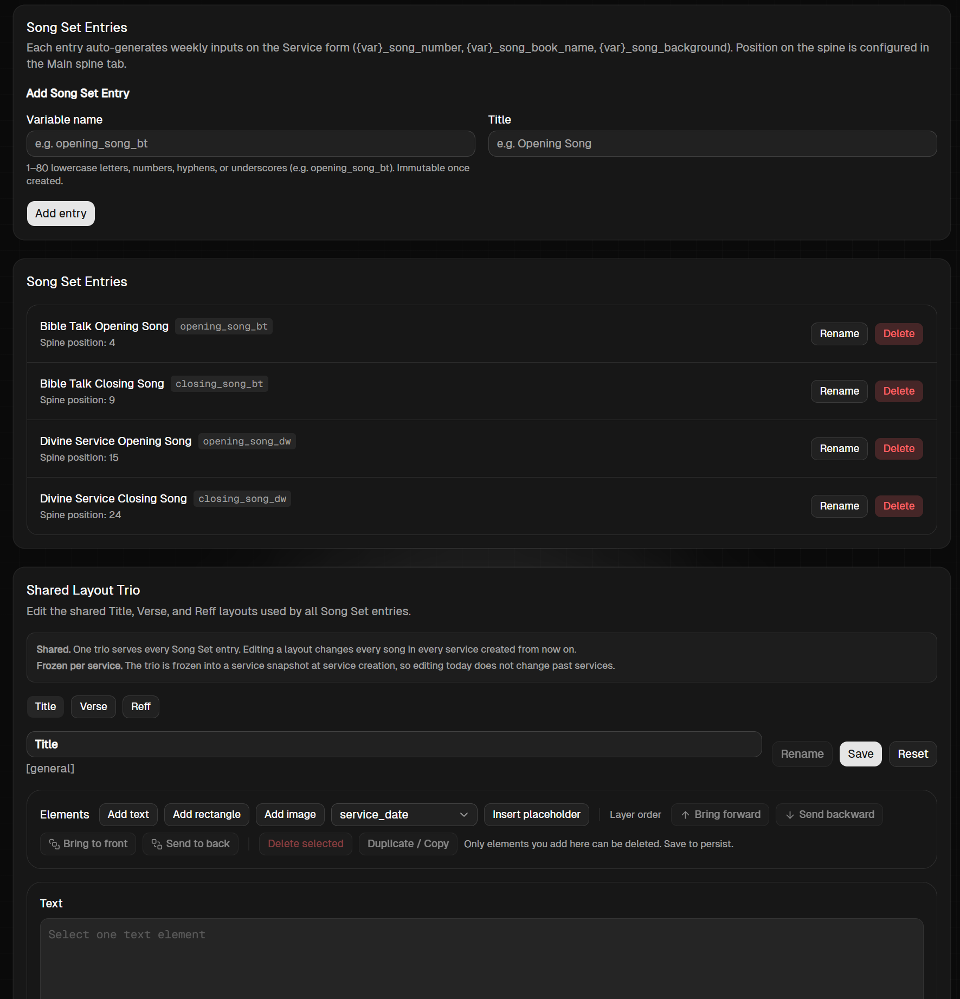

# Prompt 02 — Rombak Total Menu Artifacts > Song Sets

- **Tanggal dicatat:** 2026-09-07
- **Sumber:** Prompt pengguna (mentah)
- **Gambar Referensi:** `images/prompt-02-artifacts-song-sets.png`
- **Status:** Raw Requirement (menunggu review & perumusan spek/tiket)

---

## 0. Gambar Referensi Tampilan Saat Ini



Tampilan saat ini memiliki 3 blok bertingkat yang terpisah:
1. `Add Song Set Entry` (Variable name, Title, button Add entry).
2. `Song Set Entries` (Daftar card list dengan spine position dan tombol Rename/Delete).
3. `Shared Layout Trio` (Tabs Title/Verse/Reff dengan editor canvas jadul terpisah di bawah).

Target rombak: Mengubah layout bertingkat ini menjadi layout 2-kolom (Kiri: List Song Sets, Kanan: Editor Canvas) yang konsisten dengan desain Main Spine yang baru.

---

## 1. Teks Mentah dari Pengguna

```text
Untuk songset, rombak total.
1. Saya suka model main spine (refer ke desain terbaru yang akan dibuat)
2. Di bagian kiri atas ada button New Song Set, otomatis membuat New Song Set dengan default name. Di bawahnya ada Song Set entries, mirip apa yang ada di main spine. Tapi tidak perlu ada tombol up/down, yang ada cuma tombol delete (samakan pakai icon, dan samakan muncul ketika di hover, by default hiden)
3. Di sebelah kananya barulah juga disamakan dnegan main spine (ingat main spine yang baru hasil edit terbaru nantinya)
- Ada area nama song-set, disinilah baru bisa rename
- Baru dibawahnya mirip dengan apa yang ada di main spine, ada area toolbar, add new element, lalu canvas. Modelnya harusnya sama persis. kecuali disini ada 3 hal yang diedit: Title, Verse, Reff
- Yang berbeda adalah placeholder, placeholdernya itu bukanlah placeholder biasa, tapi mau menaruh dimana posisi judul buku, nomor lagu, judul lagi, posisi verse misal (1/2) - yang artinya verse 1 dari 2 verse, posisi verse teks, posisi reffrain teks, normalnya harusnya dia two third layar dari paling atas. Harusnya ini otomatis. Saya bebas sih kalau bisa ada formula yang baku untuk ini, biar gak perlu reposisi manual di canvas. Sehingga canvas cuma atur background, shape, dll.
4. Satu lagi, yang harusnya ada di main spine juga, canvasnya itu harusnya ada change background.
```

---

## 2. Struktur Pengelompokan Requirement Awal

### A. Konsep Layout & Pola Antarmuka (Poin 1)
- Menyelaraskan layout Song Sets menyerupai layout 2-kolom Main Spine (Split View):
  - **Sisi Kiri**: Panel navigasi / daftar Song Sets.
  - **Sisi Kanan**: Panel detail, pengaturan nama, switcher layout trio (Title / Verse / Reff), toolbar, dan canvas editor.

### B. Panel Kiri: Pembuatan & Daftar Song Set (Poin 2)
- **Tombol "New Song Set"**: Terletak di kiri atas; langsung membuat entri Song Set baru secara otomatis dengan default name (tanpa form input `variable_name` manual terpisah).
- **Daftar Song Set Entries**: Menampilkan list Song Set yang ada.
- **Interaksi List**:
  - Tidak memerlukan tombol Up/Down (urutan kemunculan di ibadah diatur di Main Spine).
  - Hanya ada tombol **Delete** (berupa ikon trash/hapus).
  - Tombol delete tersembunyi secara default (*hidden by default*) dan hanya muncul saat hover kursor di atas item.

### C. Panel Kanan: Editor & Sub-Layout Trio (Poin 3)
- **Header Song Set**:
  - Region untuk nama song-set, di mana pengguna dapat melakukan rename dengan siklus tombol `[Rename] [Reset]` → `[Cancel] [Save]` yang konsisten.
- **Sub-Layout Selector**:
  - Pilihan untuk mengedit 3 jenis tampilan slide lagu: `Title`, `Verse`, dan `Reff`.
- **Toolbar & Canvas**:
  - Mengikuti pola Main Spine baru: Toolbar Elements, Context Menu klik kanan untuk layer/duplicate/delete, inline editing teks via double-click, serta Toolbar Properties di atas canvas.
- **Placeholder Khusus Song Set & Otomasi Layout**:
  - Placeholder spesifik lagu: posisi Judul Buku, Nomor Lagu, Judul Lagu, Posisi Verse (indikator nomor bait misal `1/2`), Blok Teks Verse, dan Blok Teks Reffrain.
  - Penempatan teks lirik/konten utama diharapkan otomatis memiliki formula baku (misal: mengambil area 2/3 layar dari atas / two-thirds screen) sehingga pengguna tidak perlu lagi repot mereposisi manual tiap elemen teks lirik, dan canvas lebih difokuskan untuk mengatur background, shape, dekorasi, dsb.

### D. Fitur Change Background pada Canvas (Poin 4 - Berlaku untuk Main Spine & Song Sets)
- Menambahkan kemampuan eksplisit **"Change Background"** langsung pada canvas editor:
  - Berlaku untuk template di **Main Spine** maupun layout di **Song Sets**.
  - Memungkinkan memilih/mengganti gambar latar belakang (Background Image) slide secara langsung dan visual.
