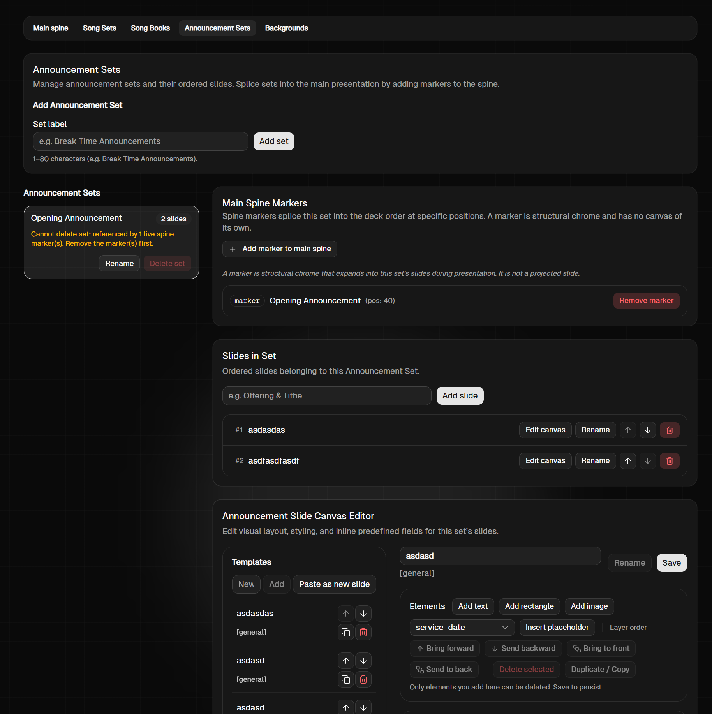

# Prompt 03 — Rombak Total Menu Artifacts > Announcement Sets

- **Tanggal dicatat:** 2026-09-07
- **Sumber:** Prompt pengguna (mentah)
- **Gambar Referensi:** `images/prompt-03-artifacts-announcement-sets.png`
- **Status:** Raw Requirement (menunggu review & perumusan spek/tiket)

---

## 0. Gambar Referensi Tampilan Saat Ini



Tampilan saat ini sangat bertumpuk dan membingungkan secara hierarki:
- Bagian atas: `Add Announcement Set` (input teks manual `Set label` + tombol `Add set`).
- Sisi kiri tengah: `Announcement Sets` list (card kecil dengan info jumlah slide).
- Sisi kanan tengah: `Main Spine Markers` (tombol dan list marker posisi spine) dan `Slides in Set` (tabel slide dengan tombol Edit canvas, Rename, Up/Down, Delete).
- Bagian bawah: `Announcement Slide Canvas Editor` yang menduplikasi list template lagi di samping canvas.
- Hirarki saat ini membingungkan: `Announcement Set` -> `Slides in set` -> `list of slide (canvas)`.

Target rombak: Mengubahnya menjadi struktur hierarki yang benar dan ramping dalam pola 2-kolom yang selaras dengan Main Spine baru:
`List of Announcement Set (Dropdown) -> Slides in set (List) -> Canvas Editor`.

---

## 1. Teks Mentah dari Pengguna

```text
Mengenai announcement sets ini pun sama, harusnya desainnya sama dengan mainspine (yang terbaru nanti).

Panel kiri ada 3: (a) action add new announcement set; (b) dropdown list; (c) list of announcement slide.
- Sebelah kiri atas ada add new announcement set. Jika di add new, maka otomatis membuat new announcement set baru dan selected.
- Persis dibawahnya ada dropdown announcement set. Jadi kita modelnya menggunakan dropdown, setiap mengganti dropdown dia mengganti announcement list (yang ada dibawahnya).
- Di bawahnya lagi ada list of announcement, sama seperti di main spine, ada action up/down/clone/delete (sama persis, hiden by default, on hover muncul)

Panel di sebelah kanannya harusnya sama seperti main spine, ada:
- Title slide
- Toolbar
- Add new element
- canvas
dengan fitur harusnya sama persis dengan spine

Maka harusnya marker ini sepertinya (kalau benar soal insert ke main spine), gak perlu lagi, karena itu harusnya sudah disolusikan dengan uiux yang ada di main spine.

Dan juga sepertinya ada yang salah di desain screen announcement set sekarang, kok seolah2 hirarkinya begini:
Announcement Set -> Slides in set -> list of slide (canvas)

Harusnya List of Announcement Set -> Slides in set (canvas)
```

---

## 2. Struktur Pengelompokan Requirement Awal

### A. Konsep & Perbaikan Hierarki Antarmuka
- **Hierarki Baru**:
  - `List of Announcement Set` (dipilih lewat Dropdown) ➔ `Slides in set` (Daftar Slide di bawah dropdown) ➔ `Canvas Editor` (Editor visual slide terpilih di panel kanan).
  - Menghilangkan duplikasi nested list dan card editor terpisah di bagian bawah.

### B. Panel Kiri (Navigasi & Pengelolaan Set/Slide)
Terdiri dari 3 elemen utama yang tersusun vertikal:
1. **(a) Action "Add New Announcement Set"**:
   - Tombol di kiri atas.
   - Mengklik tombol ini otomatis membuat entri Announcement Set baru dengan default name dan langsung otomatis terpilih (*selected*).
2. **(b) Dropdown List Announcement Set**:
   - Terletak persis di bawah tombol add new.
   - Memilih item pada dropdown akan langsung mengganti konteks dan memuat slide-slide milik Announcement Set tersebut pada list di bawahnya.
3. **(c) List of Announcement Slides**:
   - Terletak di bawah dropdown.
   - Menampilkan slide-slide yang ada di dalam set terpilih.
   - Interaksi baris identik dengan Main Spine baru: aksi `Up`, `Down`, `Clone/Copy`, dan `Delete` tersembunyi secara default (*hidden by default*), hanya muncul saat hover kursor (*on hover*).
   - Mendukung drag-and-drop reposisi slide jika diperlukan.

### C. Panel Kanan (Editor Slide Announcement)
Format dan fitur identik persis dengan editor Main Spine baru:
- **Slide Title / Rename**: Header nama slide dengan form/tombol rename konsisten (`[Rename] [Reset]` ⇄ `[Cancel] [Save]`).
- **Toolbar [Element Properties]**: Pengaturan gaya teks (font, size, color, bold, italic, underline, alignment) atau shape (color).
- **Add New Element Toolbar**: `[Icon Text] [Icon Rectangle] [Icon Image] | [Dropdown Placeholder] [Add Placeholder]` dengan interaksi drag area di canvas.
- **Canvas Visual**:
  - Context menu klik kanan untuk layer reordering (bring forward/front, send backward/back), duplicate, dan delete.
  - Inline text editing (double-click teks di canvas).
  - Fitur `Change Background` langsung pada canvas.

### D. Eliminasi "Main Spine Markers"
- Card dan konsep **`Main Spine Markers`** (`pos: 40`, tombol `Add marker to main spine`, `Remove marker`) **ditiadakan**.
- Penentuan di mana Announcement Set muncul pada ibadah sudah sepenuhnya diselesaikan di UI/UX **Main Spine** (melalui kontrol `New Slide` yang bisa memilih dan menempatkan Announcement Set dinamis secara bebas dan berulang kali pada deck utama).
