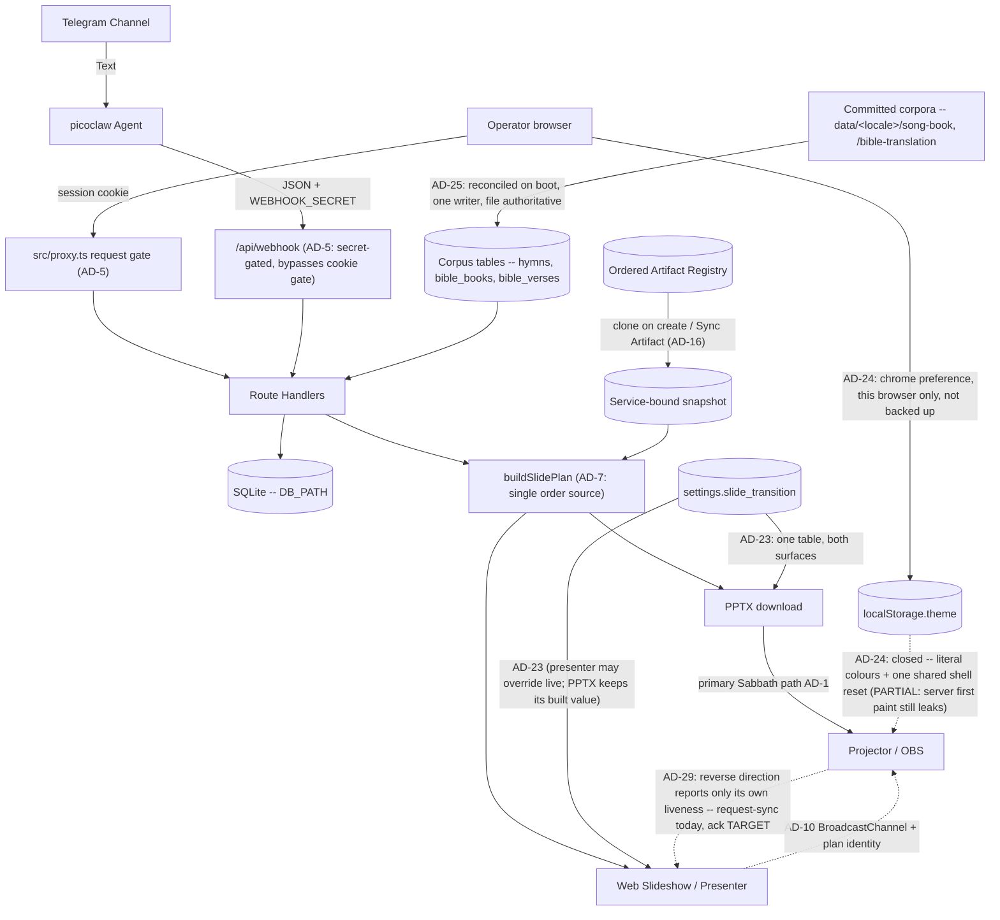
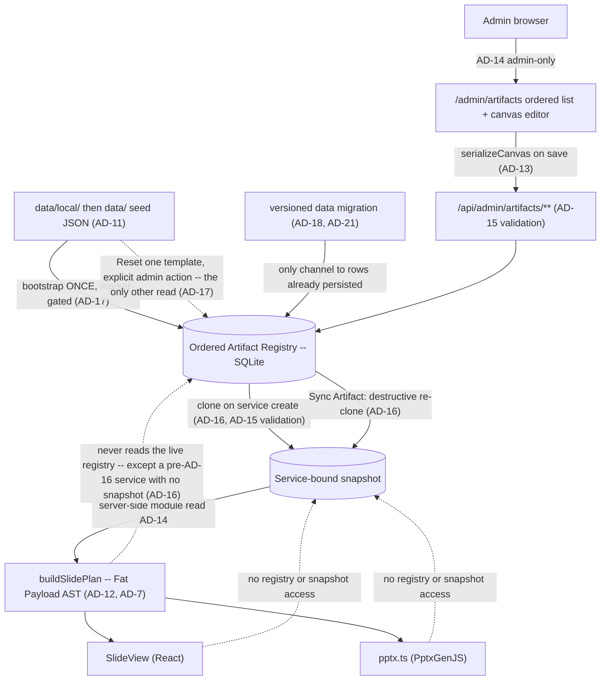

# Architecture Spine — BIC Worship Presentation Automation

**One spine per project.** This is the project's only architecture spine. The Epic 16 child spine was folded in on 2026-07-30 — see *AD map* below for the renumbering. Its run folder was moved under `archived/` the same day so that nothing sat beside this file looking like a peer spine, and **deleted on 2026-08-01** at the owner's direction. The reasoning behind AD-11..AD-19 was extracted into this spine's own `.memlog.md` **before** the deletion, as a precondition of it; what was not carried over was process record — gate runs, folder relocations, a retired citation convention — and a case study whose data-flow diagram predated AD-16 and whose AD-11 rationale still named the platform that decision's own gate had refuted.

## Design Paradigm

**Monolithic Next.js app (App Router UI + API routes)**
One deployable unit serves the operator Web Hub, JSON APIs (webhook/services), hymnal lookups, PPTX generation, web slideshow, presenter mode, and the admin Artifact Registry / canvas editor. Server Components are the default; `'use client'` is added only where hooks, browser APIs, or event handlers require it — including at the root, where one client provider wraps every route for theming without making the tree it wraps client-side (AD-24). Operators/agents follow `.claude/skills/picoclaw-webhook/` to POST the webhook JSON API (skill docs, not an in-process runtime). **Offline PPTX remains the primary Sabbath path**; in-browser slideshow / presenter are also shipped (FR-15 / FR-16).

**Within it: data-driven presentation rendering with a decoupled editor** (AD-11..AD-23). Slide layout is a JSON layout AST rather than hardcoded switch-statements; an uncontrolled canvas editor owns the design, and both renderers (React web, PptxGenJS) are dumb consumers of pre-hydrated ASTs. Epic 20 turns that registry from a template catalog into the **ordered** surface where the deck itself is authored.

## AD map — the 2026-07-30 fold-in

The Epic 16 spine numbered its own decisions from 1, so folding it in required renumbering. Old citations resolve through this table, and every affected `AD-n` heading below carries its former identity inline. `AGENTS.md`'s standing rule — never renumber an existing `AD-n` — was waived once, by the owner, for this merge only.

**What was repaired, stated precisely (corrected 2026-07-30):** the tracked planning, spec and story set. **The UX set was the one exception, and it has since been repaired — this paragraph is the record of that, not of an open item (closed 2026-08-01).** The bullet is now at `EXPERIENCE.md:185`, and it states the correction in its own voice: *"It supersedes **AD-14** and nothing else; a previous version of this bullet cited `AD-4`, which is LiveServer durable paths and an unrelated decision."* It also states the shipped global-and-immediate behaviour first and marks `AD-16` as `[TARGET]`, which is the honest ordering. Two earlier versions of this paragraph are retracted: one said the repair was *"tracked nowhere"* — true of `epics.md`, where the citation `epics.md:374` pointed at an unrelated liturgical-suppression note, and irrelevant, because `bmad-ux` made the repair in the file itself rather than through a tracked key; the other cited `EXPERIENCE.md:153`, which is a **blank line**. Recorded at length rather than deleted because the pattern is the one this spine keeps paying for in both directions: a citation that rots makes a *closed* item read as open just as easily as the reverse, and a reader who trusted this paragraph would have gone looking for work that was already done. Dated **run records** — readiness reports, review reports, the sprint change proposal — deliberately keep their contemporaneous citation form and were *not* rewritten, so several still use `INIT AD-n` / `epic-16 AD-n` or describe two live spines. An earlier version of this paragraph claimed every live citation in the repo was repaired; that was too strong, and the residue includes a case a dangling-reference check cannot catch: `sprint-change-proposal-2026-07-29.md:85` cites **bare** `AD-2..AD-5` in an epic-16 context, where those numbers now resolve to four entirely different decisions. Treat any `AD-n` citation in a document dated before 2026-07-30 as requiring this table before it can be read.

| Was | Now | Decision |
| --- | --- | --- |
| `epic-16 AD-1` | **AD-11** | Artifact Registry Storage |
| `epic-16 AD-2` | **AD-12** | Slide Plan Data Flow (Fat Payload) |
| `epic-16 AD-3` | **AD-13** | Canvas State Boundary |
| `epic-16 AD-4` | **AD-14** | Global Template Administration |
| `epic-16 AD-5` | **AD-15** | Stable Layout Identity |
| `epic-16 AD-6` | **AD-16** | Service-Bound Registry Snapshot |
| `epic-16 AD-7` | **AD-17** | The Seed Is a Bootstrap |
| `epic-16 AD-8` | **AD-18** | Vocabulary and Value Changes |
| `epic-16 AD-9` | **AD-19** | Cross-Boundary Binding Keys |

`INIT AD-n` was the old citation form for AD-1..AD-10 of this file. Those numbers did not change; drop the prefix. The fold-in also removes a real hazard: `AD-6` and `AD-9` each used to mean two different decisions depending on which document you were reading.

**Where AD-11..AD-19 were decided:** in this spine's own `.memlog.md`, under the entry dated 2026-08-01. Until that date the reasoning sat in a separate archived run folder and this line pointed there, warning that a resume reading only this memlog would not find it. That is no longer true and the warning is retired: when the folder was deleted, each decision's rationale, its declined alternative, the two operational traps AD-17 carries, and AD-18's dated waiver with its expiry were extracted into this memlog in the same change set. The extraction was the precondition for the deletion, not a follow-up to it.

## Invariants & Rules

**Every `AD` carries a status tag, and the tag is part of the decision.** Without one, a rule written
in the indicative present says two different things — *this is how the code works* and *this is how the
code will work* — and a builder cannot tell which. The three tags:

| Tag | Means |
| --- | --- |
| `[ADOPTED]` | Decided **and** ratified against shipped code. The Rule describes `src/` as it is. |
| `[ADOPTED, partial]` | The mechanism ships, but a named gap remains. The gap is recorded in *Deferred*, never left for a reader to discover. |
| `[TARGET]` | Decided, **not yet built.** The Rule binds the story that builds it; its present tense describes intended state, and `src/` does not match it yet. |

A `[TARGET]` rule is no less binding than an `[ADOPTED]` one — the difference is only whether you can
verify it by reading the code today. AD-16, AD-18, AD-19 and AD-22 still land with Epic 20,
AD-26..AD-28 with Epics 21 and 22, and AD-29 with Epic 17's Story 17.5. Of the remaining 21, **six
are `[ADOPTED, partial]` and each names its own gap** — AD-6, AD-10, AD-17, AD-20, AD-24, AD-25 —
so *"everything else is shipped"* would be the wrong summary and is deliberately not made here:
`partial` is now the second-largest class, and a reader who skims this line is exactly the reader the
tag table above is written for. **Story 20.1 moved four tags on 2026-08-07** and it is recorded
here because the census line is the one place a reader checks before trusting a tag: AD-11 partial →
`[ADOPTED]` (its read-time gap closed), AD-21 `[TARGET]` → `[ADOPTED]`, and AD-17 and AD-20
`[TARGET]` → `[ADOPTED, partial]`, each with its remaining gap named below. That story was forbidden
to flip a tag from inside its own change set, which is why the flips are dated a day after it merged.

### AD-1 — Web Hub + Offline PPTX (Phase sequencing) [ADOPTED]
- **Binds:** Presentation rendering, Operator experience
- **Prevents:** Dependency on venue internet during Sabbath services
- **Rule:** Operators use a zero-install **Web Hub** for review/run-sheet. **Phase 1** presents on Sabbath from a downloadable offline **PPTX**. In-browser Web Slideshow / Presenter Mode are **shipped** (FR-15 / FR-16) but are **not** the hard offline Sabbath guarantee; PPTX download remains primary for venue reliability. A registry or layout change may not make Sabbath rendering depend on hub connectivity.

### AD-2 — Single Repository Monolith [ADOPTED]
- **Binds:** Code organization, deployment
- **Prevents:** Operational complexity and synchronization issues for a solo developer
- **Rule:** The picoclaw skill integration logic, API backend, and App Router web UI must reside in a single repository and be deployable as a cohesive unit. Registry storage, the admin editor UI, and both renderers are part of that unit; there is no separate editor service.

### AD-3 — Decoupled Ingestion and Presentation [ADOPTED]
- **Binds:** Data boundaries, external integrations
- **Prevents:** Tightly coupled integrations that would make replacing the Telegram/Agent ingestion difficult
- **Rule:** The API must expose a standard JSON interface for service generation that is agnostic to the input mechanism (Telegram/picoclaw). The presentation layer consumes this same API. Artifact templates are a presentation-layer concern; webhook/service intake JSON stays agnostic of layout templates.

### AD-4 — LiveServer durable paths (home PC production) [ADOPTED]
- **Binds:** Deployment, SQLite, announcement uploads
- **Prevents:** Ephemeral container-only data loss
- **Rule:** Production is deployed as one Docker/standalone unit on the home-PC LiveServer (`presenter.example.org` via Cloudflare Tunnel). Host-durable paths for `DB_PATH`, PPTX cache, and `UPLOADS_DIR` (compose bind-mounts). Operator details: `docs/deployment-guide.md` / `docs/deploy.md`. **As of 2026-07-30 no deployment exists** — the tooling ships and is configured, and nothing is running (`prd.md:552`, owner-corrected 2026-07-29). That date is load-bearing rather than trivia: AD-18's total-replacement licence and AD-21's released-version freeze both hinge on *until first deploy*, so they need an anchor stated here instead of inferred from this rule's tense. Announcement image refs are remote http(s) (SSRF-hardened) **or** hub-local `/api/uploads/<32-hex>.(jpg|jpeg|png|gif|webp)` resolved from disk for PPTX. Registry rows and per-service registry snapshots live in that same durable `DB_PATH`; editor image references resolve through the existing `UPLOADS_DIR` / allowlist rules, never new ad-hoc paths.

### AD-5 — Single request gate in `src/proxy.ts` [ADOPTED]
- **Binds:** every route and page; authentication and authorization
- **Prevents:** per-route authorization drift, and privilege that survives demotion, logout, or password change
- **Rule:** `src/proxy.ts` is the one request gate, and its `config.matcher` regex **is** the authorization boundary — anything it does not match is served with no session check at all, so a new exclusion ships together with its assertion in `tests/proxy-matcher.test.mjs` in the same change set. The gate re-checks every session against SQLite (deleted account, role demotion, stale `token_version`, revoked `sid`) and **fails closed** if that lookup throws. Privileged routes additionally call `requireSession` / `requireAdminSession`; the cookie's `role` claim is never trusted alone. `/api/webhook` is gated by `WEBHOOK_SECRET` only — 503 when unset, 401 when wrong or missing — never by a cookie. Post-login `next` targets pass through `safeNextPath`. Every gated response carries `Cache-Control: private, no-store` and `Vary: Cookie`, because the hub is published through a Cloudflare Tunnel where an edge cache rule could otherwise serve a rendered private page without the origin — and therefore without this gate — ever running. Do not export `runtime` from the Proxy file (Next throws), and do not reintroduce `middleware.ts`: a `proxy.ts` entry **always** runs on Node, while a `middleware.ts` entry is compiled for the Edge runtime **unless it exports `runtime = 'nodejs'`** — so the rename is what guarantees the per-request SQLite re-check rather than leaving it to a declaration someone can drop. (Node-runtime middleware has been stable since Next 15.5.0; the flat claim that `middleware.ts` *is* Edge is false, and a rule defended by a refutable reason is a rule that gets reverted. `src/proxy.ts:5-11` states it correctly.) **Two recorded deviations from upstream guidance, both deliberate.** Next's docs advise never relying on Proxy alone for authorization (`proxy.md:217-219`), so the nine non-admin routes carrying no in-route `requireSession` are a standing deviation rather than merely unfinished work — see *Deferred*. And Next advises avoiding a database check in this position for performance (`authentication.md`), which this rule requires on **every** gated request: accepted knowingly, because a signature-only check cannot see a deleted account, a demotion, or a revoked session, and for one congregation on a home server the cost of a local SQLite read is not the constraint the guidance assumes. If this hub ever serves traffic where it is, that is the trade-off to revisit — not the fail-closed behaviour. A Server Function POST inherits its route's matcher outcome, so a new matcher exclusion removes coverage from Server Functions on that path too.

### AD-6 — Optimistic concurrency on service edits [ADOPTED, partial]
- **Binds:** service mutation APIs, hub edit UI, agent/webhook corrections, registry template writes, Sync Artifact
- **Prevents:** an operator's edit silently erased by a late correction (last-write-wins)
- **Rule:** every service mutation carries the client's `updated_at` as a precondition; a stale value is rejected with HTTP 409 and the client re-reads before retrying. No write path may bypass the precondition. This covers registry writes and the **Sync Artifact** action of AD-16 — the shipped shape is `expectedUpdatedAt` / `RegistryStaleError` in `src/lib/registry/store.ts`.
- **The gap, named rather than left to be discovered (2026-07-30):** four shipped paths bypass it — the webhook correction and intake writes (`src/app/api/webhook/route.ts`), `DELETE /api/services/[id]`, and `PATCH`/`DELETE /api/announcements/[id]`, whose table has no `updated_at` at all. The rule is deliberately **not** narrowed to cookie-authenticated mutations to make this document self-consistent: the unguarded path is the *agent* path, which is precisely the late correction this decision's *Prevents* describes, so scoping the rule would abandon the hazard rather than record it. See *Deferred* for the closing work and for the second-granularity weakness in `updated_at` itself.

### AD-7 — `buildSlidePlan` is the only slide-order source [ADOPTED]
- **Binds:** PPTX generation, web slideshow, presenter + projector
- **Prevents:** divergent slide order or content between what the operator controls and what the congregation sees
- **Rule:** `buildSlidePlan` is the single source of slide order and content for every surface. No surface recomputes order from service fields or keeps its own ordering logic; a rendering or ordering change lands in the plan, never per-surface. AD-12's Fat Payload specializes this rule; AD-16 changes only where the plan reads its templates from, never that there is one order source.

### AD-8 — Image references resolve only through shared safety helpers [ADOPTED]
- **Binds:** announcement images, hub uploads, registry/asset references, PPTX embedding
- **Prevents:** a new surface reintroducing SSRF or unsafe content through its own laxer resolver
- **Rule:** image references resolve only through the shared helpers in `src/lib` — allowlisted remote http(s) and hub-local `/api/uploads/<32-hex>.(jpg|jpeg|png|gif|webp)` for announcements, and registry `/assets/...` refs for Artifact templates. A new reference vocabulary extends an existing helper or adds one alongside them with the same fail-closed default; no unit ships an inline resolver. The canvas editor introduces no second resolver and admits no `data:` or arbitrary remote URI.

### AD-9 — Schema evolution through startup DDL only [ADOPTED]
- **Binds:** SQLite schema, and the bootstrap path it shares with AD-18
- **Prevents:** two sources of schema truth between a developer machine and a fresh production container
- **Rule:** schema changes go through the app's startup DDL on the `getDb` path. No migration framework (Prisma or otherwise) is introduced without an explicit product decision recorded in this spine. Registry tables are created on that same path. **The bootstrap path is shared, and the division is fixed:** this rule owns *schema* — the shape, e.g. adding a column — while **AD-18** owns *value* migration — the contents, e.g. rewriting every row's `base_type`. Neither licenses the other's mechanism: a value change is not a reason to add a framework, and a schema change is not a reason to rewrite data.

### AD-10 — One presenter sync channel, client-side only [ADOPTED, partial]
- **Binds:** presenter, projector, web slideshow
- **Prevents:** a split sync topology where the projector follows one controller and ignores another
- **Rule:** presenter↔projector sync goes through the single `@/lib/present-channel` `BroadcastChannel` module; no surface opens its own channel name or message shape. No server realtime channel (WebSocket/SSE) is introduced unless product direction changes — keeping the venue path independent of hub connectivity, per AD-1. A registry edit must not add a second channel to push template changes to a live projector. **Every message carries a plan identity** — a fingerprint of the snapshot and resolved announcement set that produced the deck — and a receiver whose own identity differs **refuses to follow the index** and says so on the room-facing screen rather than rendering a slide it cannot vouch for. Presenter and projector are two independent `force-dynamic` renders, each calling `buildSlidePlan` at its own moment, so a bare `index` silently means different slides on the two screens the instant anything structural changes underneath them; since this rule forbids a surface inventing its own message shape, the identity has to live in the shared shape.
- **The gap (2026-07-30):** the plan-identity clause is `[TARGET]`. `PresentMessage` (`src/lib/present-channel.ts`) carries no identity field today, and the fingerprint is defined partly over AD-16's snapshot, which does not exist yet either. The single-channel rule above is `[ADOPTED]` and fully ratified; only the identity is unbuilt. See *Deferred* — the offset-slide hazard is live now, so this is not a wait-for-Epic-20 item by accident.
- **Extended by AD-29 (2026-08-05), and nothing here is narrowed.** This channel also carries a **projector→presenter** message, and it always has — `request-sync` travels that way — which the *Prevents* above can be misread as forbidding. AD-29 fixes what the reverse direction may carry: **the sender's own condition and nothing else**, so the single-controller property above is unchanged by the addition. It also states that the plan-identity clause is not partly implemented while a new variant is added to `PresentMessage`.

### AD-11 — Artifact Registry Storage *(was `epic-16 AD-1`)* [ADOPTED]
- **Binds:** Database schema, the Canvas Editor's save API, and the startup seed path.
- **Prevents:** Data loss on ephemeral container filesystems, file-lock concurrency issues, and a seeder that overwrites administrator edits or leaks private seed content.
- **Rule:** The live Artifact Registry is stored in SQLite on the durable `DB_PATH` (AD-4). Filesystem JSON serves exclusively as a startup seed: startup inserts missing template IDs and **never** overwrites persisted administrator edits. Reset restores one selected template from that seed. The seed is two-layered — `data/local/default-registry.json` is git-ignored and **takes precedence over the shipped `data/default-registry.json` example whenever present**; a seeder that reads only the shipped example breaks the mechanism that keeps congregation data out of a public repository.
- **Superseded in part by AD-17 (2026-07-30):** the *"startup inserts missing template IDs"* clause only. Storage target, the two-layer seed precedence, Reset-from-seed, and "never overwrites administrator edits" all stand as written.
- ~~**The gap in *"exclusively a startup seed"* (2026-07-30):** `registry-snapshot.ts:85-90` reads the seed at **plan-build** time and substitutes shipped content for any row the database does not hold, so a deleted template still reaches the deck.~~ **Closed 2026-08-07 (Story 20.1, AC-7), and this decision is `[ADOPTED]` for the first time.** `loadRegistrySnapshot` (`registry-snapshot.ts:76-92`) is now `SELECT` → `parseRow` → `set` with **no substitution loop at all**, so the seed is read at exactly the two moments AD-17 permits and a deleted row stays deleted through a plan build. Verified in this worktree rather than taken from the story. Kept rather than deleted for the reason the entry itself turned out to demonstrate: this rule carried the word *"exclusively"* the whole time the read path was contradicting it, and what closed the gap was **naming the read path** — the prose was never the thing that was wrong. **The story's own Gate did not list this among the four statements it staled** — it named the *Deferred* bullet that tracked the same code and not the `AD` clause above it — which is why an Update run reads the change set rather than the hand-off list. The two-layer precedence still has one shipped override: `WPW_USE_SHIPPED_REGISTRY=1` inverts it (`seed.ts:48`, cited as `:39` until this run) for tests and fidelity smokes, and nothing else may.

### AD-12 — Slide Plan Data Flow (Fat Payload) *(was `epic-16 AD-2`)* [ADOPTED]
- **Binds:** The `buildSlidePlan` return type and all downstream renderers.
- **Prevents:** The Web (`SlideView`) and PPTX renderers from performing independent database lookups or maintaining their own diverging layout logic.
- **Rule:** `buildSlidePlan` outputs a fully hydrated AST (Fat Payload) with exact rendering coordinates, fonts, colors, and resolved text content. Specializes AD-7: the plan is the single order *and* layout source, so a renderer never **reads data from** the registry itself. Importing a shared *helper* that happens to live under `src/lib/registry/` is not such a read — `pptx.ts` importing `isBundledAssetRef` from `registry/asset-safety` is the AD-8 resolver this spine requires, not a data path.

### AD-13 — Canvas State Boundary *(was `epic-16 AD-3`)* [ADOPTED]
- **Binds:** The React-Fabric integration layer (`src/components/admin/ArtifactEditor.tsx`).
- **Prevents:** Two-way data binding lag, stuttering drags, and unnecessary React re-renders.
- **Rule:** The Canvas Editor uses an Uncontrolled Wrapper pattern. Fabric.js owns the canvas state exclusively; React reads it **only on save**, through `serializeCanvas` over `canvas.getObjects()`, projecting into the registry's own element schema. Not `canvas.toJSON()`: Fabric's serialization format is **not** `ArtifactLayout.elements`, so a second editor surface built on `toJSON()` would fail AD-15's validator on every write. The projection into the registry schema is the boundary, not the canvas library's own format.

### AD-14 — Global Template Administration *(was `epic-16 AD-4`)* [ADOPTED]
- **Binds:** `/admin/artifacts`, `/api/admin/artifacts/**`, and the registry access layer.
- **Prevents:** Per-service template drift and operator-level mutation of every service's visual contract.
- **Rule:** Artifact templates are global across services. Registry management UI and APIs are admin-only and re-check the current account role from SQLite — a specialization of AD-5, not a separate authorization scheme. `/admin/artifacts` and `/api/admin/artifacts/**` are inside the AD-5 matcher, and adding a registry route outside it requires the same-change-set test update AD-5 demands. Downstream planners and renderers read the registry through server-side modules rather than the management API.
- **Superseded in part by AD-16 (2026-07-30):** the *"global across services"* clause only — a service now reads its own cloned snapshot. The admin-only authorization clause and the read-through-server-side-modules clause are **untouched** and still bind; the second now points at the snapshot instead of the live registry. Not to be confused with AD-4 (LiveServer durable paths), which is a different decision and is not affected.

### AD-15 — Stable Layout Identity *(was `epic-16 AD-5`)* [ADOPTED]
- **Binds:** Seed data, every write path into the registry, hydration, and both renderers.
- **Prevents:** Unit-specific renderer drift, required-placeholder deletion, and unsafe image references reaching a renderer through an unvalidated back door.
- **Rule:** Layouts use a fixed 16:9 canvas with normalized percentage coordinates and stable template/layout/element/placeholder IDs. Coordinates may extend beyond the canvas to preserve intentional source-deck clipping. **Every** write into the registry is untrusted and must pass the same structural and image-reference validation before persistence — the canvas save API, the startup seeder, and any import or asset-extraction script alike. Image refs validate through the shared helper required by AD-8; no write path ships its own check.

### AD-16 — Service-Bound Registry Snapshot *(was `epic-16 AD-6`)* [TARGET]
- **Supersedes:** the *"global across services"* clause of AD-14, and nothing else in it. Recorded as a separate decision so the reversal stays visible.
- **Binds:** service creation, the Sync Artifact action, `buildSlidePlan`'s template input, and every read path a service surface uses.
- **Prevents:** a live registry edit shifting the structure under a service an operator is preparing right now, and a weekly value entered against one structure being orphaned by a later structural change — and, in the other direction, a service with no way to be brought up to date.
- **Rule:** Creating a worship service **clones** the ordered live registry — order, kinds, labels, layouts, placeholder bindings, **and the administrator override records of AD-22** — into a **service-bound snapshot** on the durable `DB_PATH` (AD-4); creation is the only freeze event. The clone is of the *rendered* structure, so anything AD-22 keeps outside the layout travels with it; an override left out of the clone would either never reach the deck or reach it from outside the freeze, and both defeat this decision. A service's plan, Presenter, slideshow and PPTX read that snapshot; a live registry edit reaches an existing service **only** through the explicit **Sync Artifact** action, which replaces the snapshot destructively. Sync is permitted on **any** service, carries the service's `updated_at` precondition (AD-6), and may not alter the service's entered data (*State* convention) — "destructive" means it replaces the snapshot, never that it may overwrite a service someone else has moved underneath it. **Sync is a structural write and is therefore admin-only**, re-checking the role from SQLite exactly as AD-14 requires of every registry management surface, even though it is reached on a service route that `src/proxy.ts` gates for any signed-in account; its route ships with the `tests/proxy-matcher.test.mjs` assertion AD-5 demands and an in-route `requireAdminSession`. An operator may see that their snapshot is stale and *request* a sync; they may not perform one. Without this, "permitted on any service" and AD-14's surviving admin-only clause read as licence for an operator to freeze a half-authored layout into the service that presents in fourteen hours — this decision's own *Prevents*, arrived at from the other direction. The clone and the re-clone are write paths and validate under AD-15 like every other. **Announcement membership is not cloned:** the Announcements master list stays live and reaches an existing service at render time (CAP-7). **It is nonetheless scoped per service (`service_id`), matching the clone boundary everywhere else in this decision** — "not cloned" means this week's flyers may still change after the structure is frozen, never that one list is shared across services. The distinction is invisible while only one service is being prepared and decisive the moment two are open at once — a stale service reopened for a correction while next week's is being built — at which point an unscoped list bleeds one service's images onto another's deck. The shipped `announcement_items.service_id` is nullable, so both readings are currently expressible; this rule picks the scoped one. **A later structural change obliges nobody to keep an older snapshot renderable** — what the snapshot protects is the service's entered supporting data, not its ability to regenerate a past deck. The snapshot is the sequence *input*: `buildSlidePlan` remains the single source of order and layout (AD-7, AD-12), and no renderer reads a snapshot directly any more than it read the registry. **One bounded exception, stated as an exception rather than argued away — pre-existing services.** A service created *before* this model ships has no snapshot and renders from the live registry until its first Sync, which is a clone-in-place; from that moment the rule above governs it without qualification. So *"creation is the only freeze event"* holds for every service created under this decision, and the no-snapshot state is a **one-way migration path into** the decision rather than a second mode inside it: nothing may create a new service without a snapshot, and no code may re-enter the state once left. It is called out because every service in the database on day one is in it — `spec-artifact-registry-authoring/SPEC.md:89` assumed exactly this and an earlier draft of this rule forbade it, which would have left three stories free to answer it three ways. The Epic 20 data transition (AD-21) may instead clone a snapshot for every existing service and close the exception outright; that is the preferred landing, and either way the state is finite and dated. **Naming caution:** the shipped `RegistrySnapshot` type (`src/lib/artifacts/registry-snapshot.ts`) means *"the live-registry map assembled for one plan build"* — a different thing from this decision's per-service durable freeze, and the two must not be conflated when the second is built.

### AD-17 — The Seed Is a Bootstrap, Not a Correction Channel *(was `epic-16 AD-7`)* [ADOPTED, partial]
- **Supersedes:** the *"startup inserts missing template IDs"* clause of AD-11, and — as of 2026-07-30 — the *"exclusively a startup seed"* clause too, which the read path already contradicts.
- **Binds:** the `getDb` startup path, the registry store's insert path, **every read path that assembles the registry**, the delete verb, the Reset verb, and the registry's ordering column.
- **Prevents:** an administrator's delete, rename or reorder being silently undone by an unrelated restart. A deleted row leaves no evidence behind, so anything that supplies "missing" IDs cannot tell *deleted on purpose* from *never existed here* — it resurrects the row forever.
- **Rule:** The seeder initialises data **from zero only** — first install, first run — and is gated by a marker in `settings`. It is never a gap-filler: after it has run, the administrator owns every row that exists, and the ordered registry is authored data rather than shipped data kept in sync. A gap in a database that already holds data travels as a versioned data migration (AD-18, AD-21), never as a re-seed. **The filesystem seed is read at exactly two moments — the first-boot bootstrap, and an explicit per-template Reset — and at no other.** In particular **no read path may substitute a seed template for a row the database does not hold, and none may substitute one for a row it holds but cannot parse.** An ordered registry of N rows produces a deck built from those N rows and no others; a template id the database does not hold does not exist, and a row whose payload will not validate **fails closed** — no layout, logged with the id and the reason, the same posture AD-5 and AD-8 already take. Both halves matter and the second is the easier one to leave open: `registry-snapshot.ts` substitutes seed content in **one** loop for absent and corrupt rows alike (`parseRow` merely returns `null`, so a corrupt row reaches that loop indistinguishable from a missing one), so a rule that closes only the *absent* case leaves shipped example content silently standing in for an administrator's real layout the moment one row is malformed. Closing only the boot door is what let a deleted slide re-materialise into the deck on every plan build, with `rejected.delete(seed.id)` suppressing even the log line. `tests/registry-reseed.test.mjs`'s assertion that a missing row is re-inserted is **inverted, not deleted**, and a second assertion pins that a deleted row does not reappear in a built plan. Restoring shipped content stays possible as an **explicit administrator action** — Reset-from-seed per template, per AD-11 — never as a side effect of a restart, and never as a bulk re-seed of a live database.
- **An authored row has no seed, and is validated against itself.** The stability baseline for a save is the row's currently persisted state; the shipped seed is a baseline only for rows the bootstrap wrote. A row with no seed origin therefore **exposes no Reset** — Reset is defined only where shipped content exists to restore — and the registry records, per row, whether it originated from the bootstrap or from an administrator, because three verbs (save validation, Reset, and any future re-seed) all need that answer and none can infer it. Without this, the shipped `assertStableAgainstSeed` path answers a brand-new General with `404 Unknown template` on a row the administrator is looking at, and Story 20.4's *"a rejected Save names the property"* cannot be met, because the failure is not about a property.
- **This clause, and only this clause, is why the tag says `partial` (2026-08-07).** Everything above it ships: the bootstrap is marker-gated and runs from zero (`seed.ts:96-133`), the read path substitutes nothing (see AD-11), a corrupt row fails closed, and the reseed test is **inverted rather than deleted** — `registry-reseed.test.mjs:105` now asserts that a row deleted directly in SQL stays deleted through a restart, through the store *and* through a built plan. What did not ship is the per-row origin: `artifact_templates` has no such column (`db/index.ts:438-446`), and `assertStableAgainstSeed` (`store.ts:129-133`) still opens with `getSeedTemplateById(incoming.id)`, which throws on an id the seed lacks. **The gap is unreachable today and that is a sequencing fact, not a defence** — no create verb exists, so no row without a seed origin can exist to hit it. It becomes reachable in the same change set that adds one, which is why it is filed against the create verb rather than left to be discovered by the first administrator who authors a General. See *Deferred* for the owner.

### AD-18 — Vocabulary and Value Changes Travel as Explicit One-Time Migrations *(was `epic-16 AD-8`)* [TARGET]
- **Superseded in part by AD-21 (2026-07-30):** the *"marker-gated"* mechanism clause only — one version counter replaces the per-change boolean. Everything else stands: values reach persisted rows only through an explicit migration on the startup path, and no framework arrives with it.
- **Binds:** the `base_type` value set, `ARTIFACT_BASE_TYPES` and the `isCanvasAuthorable` predicate derived from it, the registry validator, and any future change to persisted registry values.
- **Prevents:** a shipped vocabulary change reaching persisted rows through boot-time re-seed (which AD-17 removed) or not reaching them at all — and the opposite failure, a migration framework arriving by the back door.
- **Rule:** AD-9 fixes *schema* evolution on the startup DDL path and is silent on **value** migration; this decision fills that silence rather than weakening it. A shipped change that must reach rows already persisted travels as an **explicit, one-time migration** on the startup path, versioned per AD-21. It is not a migration framework and AD-9's prohibition stands: no Prisma, no versioned migration directory, without an explicit product decision recorded in this spine. **Until first deploy** no production rows exist, so Epic 20's seven-`base_type`-to-three-kind collapse ships as a **total replacement** — no backward compatibility, no migration over live rows — folding into production data version 1 (AD-21); at first deploy that licence ends, and the same change would need a migration over live `artifact_templates` rows. A migration operates on the **live registry** and does **not** rewrite service snapshots — structure reaches an existing service only through Sync Artifact (AD-16), so a migration that rewrote snapshots would be a second structural channel. An older snapshot may therefore stop being renderable, which AD-16 accepts; what must survive is the **entered data**.
- **A value persisted in more than one place has exactly one authoritative copy, and it is named here:** the row's `payload` JSON is authoritative for every template field, and any column duplicating a payload field — `label`, `base_type`, and any slot discriminator — is a **derived index** maintained by the same write. A value migration therefore rewrites the payload and re-derives the columns **in the same statement**, and a migration that writes a column alone is refused by a test asserting column and payload agree for every row. This is not pedantry about storage: the admin list reads the column (`store.ts:74-92`, and derives `editable` from it) while the plan and the editor read the payload (`store.ts:35-38`, `registry-snapshot.ts:41-64`), so a column-only migration leaves the administrator's screen and the congregation's screen disagreeing about what kind every row is — with nothing logged and nothing to 409.

### AD-19 — A Cross-Boundary Key Is a Server-Owned Value the Administrator Cannot Edit *(was `epic-16 AD-9`)* [TARGET]
- **Binds:** the `base_type` enumeration, the four predefined SongSet slots, the Placeholder Catalog key set, the worship-service settings form, and every write path into the registry.
- **Prevents:** two independently-built units agreeing to disagree about a key — the registry surface and the worship-service settings form picking different handles for the same SongSet slot, and the canvas editor's insert list drifting from what the validator actually admits.
- **Rule — the kind vocabulary and the SongSet slot key:** the kind vocabulary is exactly the three the SPEC fixes — `general`, `song-set`, `announcement`. `text-placeholder`, `image-placeholder`, `mix-placeholder` and `fullscreen-image` are **gone rather than renamed**: a placeholder stops being a kind and becomes an element inserted onto a General from the Placeholder Catalog. Only `song-set` expands, into four slot identities — `songset-bt-open`, `songset-bt-close`, `songset-ds-open`, `songset-ds-close` — and that identity **is** the key the worship-service settings form binds a hymnal number to. `song-set` names the kind, never an entry: an entry carries one of the four slot identities. **The recognized set is therefore closed and complete** — `general`, the four `songset-*` slots, `announcement`: six keys over three kinds, and no write path admits a seventh. Reordering rows changes the presented sequence (CAP-8) without touching a binding; renaming a label cannot touch one either. Three requirements make the scheme unambiguous rather than merely convenient: the slot identity is **never administrator-editable**, **at most one registry row may carry each slot identity**, and the identity is a **semantic name, never an ordinal** (`songset1` re-imports the positional reading this decision exists to remove). The chosen spelling is a persisted binding key, so changing it later is the versioned data migration AD-18 and AD-21 govern. A binding whose slot row has been deleted is **inert**, not an error: the slot does not appear, because the administrator removed that song from the order — and the entered hymnal number survives in the service's own data, which AD-16 requires regardless. Extending the vocabulary — a fifth slot, a fourth kind — is a code-plus-tests change, never administrator configuration.
- **Rule — one home for the value the key names:** a weekly value a slot binding names has exactly **one persisted home**, and it is the service's own entered data; the slot identity is a *key into* that data, never a second copy of it. The four `songset-*` identities therefore **replace** the shipped ordinal field names `song1Number..song4Number` (`worship-form-fields.ts:6-9`, mapped positionally at `parsed-fields.ts:418-421`) in the same change set that introduces them — deleted, not aliased — and no code path may hold a hymn number `buildSlidePlan` does not read. Otherwise a webhook correction (which AD-3 forbids knowing slot keys) rewrites one home while the settings surface owns the other, and the deck renders 245 while the run sheet and the edit form both show 312, with no 409, no log, and no screen on which both values appear.
- **Rule — the closed set is a statement about the registry, not about the rundown:** a hymn in the service's entered data that no slot identity claims is **surfaced, never silently dropped and never fatal**. `buildSlidePlan` emits no slide for it and the service surface reports it as unclaimed weekly data. The mapping from each `songset-*` identity to its position in the parsed rundown is fixed in **one table in one module**, because the shipped planner renders an unbounded number of middle Divine Service songs (`slide-plan.ts:399`, `:464-466`) and reads the closing song as the last element while the shipped form maps `song4Number` to the second — two defensible readings of the same four slots, which with three hymns are different songs.
- **Rule — Placeholder Catalog:** the admitted key set is server-side vocabulary enforced on **every** write path, the same treatment AD-8 and AD-15 gave image references, so *"the UI cannot invent a catalog key"* (CAP-4) is a property of the registry rather than of one client. Its key spelling is persisted into saved layouts, so that spelling too falls under AD-18 and AD-21 once chosen. Independent of the SongSet clause above. **The catalog is one server-side module holding both the admitted key and its resolver** from the parsed rundown — so a key cannot be admitted without a filler, and CAP-4's *"the same catalog key on multiple Generals with different styling"* is key-addressed rather than call-site-addressed. Today the planner supplies values as hardcoded literals at ten separate call sites in `slide-plan.ts`, spelled differently from `placeholder-catalog.md`; a catalog that fixes only the write side admits a key nothing can fill, and `hydrate.ts` fails closed on a required binding — on a Sabbath. That resolver map is the one map the planner still legitimately owns, and AD-20's prohibition does not reach it. Nothing named `ALLOWED_PLACEHOLDER_KEYS` exists for this purpose: the shipped constant of that name is an unrelated object-key whitelist, and the resemblance makes a grep look like confirmation.

### AD-20 — The Planner Injects Nothing the Registry Did Not Ask For [ADOPTED, partial]
- **Binds:** `buildSlidePlan`, the registry seed, the ordered registry, and every liturgical rule about which slides exist.
- **Prevents:** a liturgical decision requiring a code change and a deploy, and the planner keeping a second, invisible source of deck content alongside the registry.
- **Rule:** every slide in the deck originates from an ordered registry entry. `buildSlidePlan` **applies** rules; it does not **hold** them. Fixed liturgical content — the standing responses `#671` and `#684`, the closing *We Have This Hope* — is authored as **General** entries and edited by hand, never injected by the planner and never computed from the hymnal. Because a General generates no title slide, the `skipTitle` mechanism is **removed rather than migrated**: there is nothing left to suppress. It shipped at five sites and Story 20.1 deleted them — a removal, not a compatibility shim, and `slide-plan.test.mjs:231` greps the tree to keep it deleted. Changing or adding a liturgical song is a registry edit.
- **Adopted in part 2026-08-07 (Story 20.1), and the two halves of *Prevents* separated — which is the whole reason this tag is not `[TARGET]` and not `[ADOPTED]`.** The **second** half is closed: `buildRequestPlan` walks `orderedTemplateIds` — the snapshot's own `position` order — and looks each row up in a handler table, so swapping two positions in the database changes the deck and the planner holds no sequence of its own (`slide-plan.ts:296-302`, `:724-731`, `:834-836`). The four liturgical lyric pages are General rows in the seed (`intercessory-671-lyric-1`, `intercessory-684-lyric-1`, `hope-lyric-1`, `hope-lyric-2`), so nothing is injected and nothing is computed from the hymnal.
- **The gap — the *first* half of *Prevents* is still live (2026-08-07).** Five handlers are keyed on hardcoded row ids and still decide **which hymn** from the parsed rundown fills each slot, all five cited because the gap is defined by them: `bt-opening-song` (`slide-plan.ts:357`), `bt-closing-song` (`:413`), `ds-opening-song` (`:478`), `song-set` (`:514`, the unbounded middle Divine Service set) and `ds-closing-song` (`:578`). So *"every slide originates from a registry entry"* holds while *"a liturgical decision does not require a code change"* does not — adding a fifth song position is still a code change and a deploy. **This is AD-19's ordered-entry model arriving late rather than a defect in Story 20.1**, which was scoped in writing against closing it: the `songset-*` slot identities appear nowhere in `src/`, and until they do, the mapping from a slot to its position in the rundown lives in this handler table instead of in the one table AD-19's third rule requires. Owned by **Story 20.7**, which also deletes `song1Number..song4Number` in the same change set. The distinction matters to a reader deciding what is safe to build on: the *order* is data today and may be relied on; the *choice of song* is not, and a story that treats it as data will find five ids in a lookup table.

### AD-21 — Persisted Data Carries One Version Number, and Unreleased Transitions Compact Into One [ADOPTED]
- **Supersedes:** the mechanism clause of AD-18 — the per-change boolean marker, precedent `artifact_seed_hash_backfilled`. AD-18's rule that persisted rows change only through an explicit migration, and its prohibition on a migration framework, stand untouched.
- **Binds:** the persisted data version in `settings`, every data migration on the `getDb` startup path, the release procedure, and the developer database lifecycle.
- **Prevents:** two builders keying the same change incompatibly — one adding a per-change boolean, another bumping a counter — and a production database accumulating one transition per code change, so that its version history tracks development activity instead of releases.
- **Rule:** All persisted data shares **one monotonic version number** in `settings` — one counter for the whole database, never one per table or per domain, so that "which version is production on" has a single answer. A change that must reach data already persisted is declared **explicitly while it is being coded**, as the transition from version *n* to *n+1*; it is never inferred at deploy time. **An unreleased transition is not yet history and may be rewritten:** the whole batch of unreleased transitions is compacted into a single transition before it reaches production, and developer databases are **reset** to the compacted version rather than migrated through the steps it replaces. **A released version is frozen** — once a version has reached production it is never renumbered, re-cut, or folded into another. Small steps are a development convenience and stop at the merge; production sees one transition per release. AD-17's seeding marker and this counter are **distinct**, and neither substitutes for the other: the marker records that bootstrap ran, the counter records which data version is persisted. This is a counter and a convention, not a framework: AD-9's prohibition stands.
- **The counter's absence is not version 0.** A database created by the AD-17 bootstrap is stamped with the current data version **by the bootstrap itself, in the same transaction as the seeding marker**, and declares itself already migrated; a database holding registry rows and no version key is a *pre-counter* database and takes exactly one recorded repair transition. Because this decision insists the marker and the counter are distinct, nothing else would make writing the counter anybody's job on a fresh install — and a fresh install that reports version 0 re-runs history it was never part of.
- **The order on the `getDb` path is fixed, and asserted by a test:** startup DDL (AD-9) → data migrations (AD-18) → first-boot bootstrap (AD-17). A migration never observes rows the bootstrap wrote in the same boot. Left unstated, the reverse order is equally compliant and strictly worse: the Epic 20 collapse, whose mapping table is keyed on the seven retired `base_type` values, would run *over freshly seeded `songset-*` rows* and either refuse to boot — at 08:40 on a Sabbath — or fall through to a default that rewrites all four slots to `general`, destroying AD-19's one-row-per-slot uniqueness by migration and dropping three songs from the deck.
- **`schemaVersion` is not this counter and never answers for it.** The per-row payload discriminator (`types.ts:83`, pinned at `validate.ts:449-450`, re-stamped at `:505`) describes the *shape* of one template and a transition may raise it; *"which version is production on"* has exactly one answer and it is the `settings` counter. A change that bumps one without deciding about the other is the ambiguity this decision's *Prevents* names, one level further in than it first looked.
- **Adopted 2026-08-07 (Story 20.1, AC-9 / AC-10), and every clause above was ratified against `src/` rather than against the story's own record.** The counter is `data_version` in `settings` (`seed.ts:16`) at `CURRENT_DATA_VERSION = 1` (`:19`), stamped by the bootstrap **in the same transaction** as the bootstrap marker (`:115` and `:118`) — so *"the marker and the counter are distinct"* is a property of two keys written together, not of two mechanisms. *"The counter's absence is not version 0"* is `repairPreCounterArtifactRegistry` (`db/index.ts:300-318`), which returns early once `data_version` exists and therefore runs **at most once**, and everything in development compacted into version **1** rather than accumulating a transition per change. The fixed step order is asserted by four tests, in both directions (`registry-reseed.test.mjs:304`, `:319`, `:363`, `:386`) — including the malformed-registry rollback, so a failed bootstrap stamps neither key. **`[ADOPTED]` rather than `[ADOPTED, partial]`, and the reason is worth stating because it looks like a gap:** *"a released version is frozen"* and *"unreleased transitions compact before release"* describe a **release event this project has never had** (AD-4: no deployment exists), so they are unenforceable — but that is a missing *release procedure*, not a missing mechanism, and *Deferred* already owns it as the one dimension this `AD` binds by name and no decision owns. AD-5 carries its two named deviations the same way. What would make this `partial` is a *code* clause `src/` does not meet, and there is none.

### AD-22 — Authoring Authority Is Fixed per Kind: Free Canvas, Bounded Config, or Bound to a Set [TARGET]
- **Binds:** the canvas editor, the SongSet configuration surface, the registry validator, and the plan's expansion of one entry into N slides.
- **Prevents:** the canvas editor and the validator disagreeing about what an administrator may author on a non-General entry — one opening a free canvas on a SongSet row and admitting an extra or rebound placeholder, the other refusing it — and CAP-3's *"General only"* living nowhere but in a capability statement.
- **Rule:** authoring authority is fixed per kind, and no surface widens it. **`general` is free canvas:** the administrator composes it from anything, including Placeholder Catalog keys (AD-19). **A `songset-*` row gets a bounded configuration surface, not a canvas:** exactly two background images — one for its title layout, one for its lyric layout, which verse and refrain share — plus font style and font size. Both background references resolve through the shared helper AD-8 requires: this surface is not the canvas editor and introduces no second resolver of its own. Layout composition itself is developer-owned seed data and is not exposed there; it stays registry data hydrated into the plan (AD-11, AD-12), never a coordinate held by a renderer. **Administrator-configured values persist outside the layout**, as an **override record keyed by row and field**, re-applied over the developer layout at hydration: the layout JSON stays developer-owned in full and a migration may replace it wholesale, the override record stays administrator-owned in full and no migration, Reset, or re-seed writes it, and a bounded surface that writes *into* the layout is refused by the validator on every write path (AD-15). An earlier draft left the encoding as "a schema call, not an invariant" — an override record beside the layout *or* a marked field inside it. The two were never equally available: the shipped validator rejects unknown keys against a closed `ALLOWED_LAYOUT_KEYS`, so the in-layout marker cannot ship without a registry-contract change this decision does not authorise, leaving only the unmarked shape — background written straight into `layouts.*.backgroundImage`, font into element `style`, indistinguishable from developer output. Then this decision's own migration clause replaces those layouts and **every background and font size the administrator chose reverts to the shipped default, on all four slots, silently, before anyone opens the hub** — AD-11 keeps no second copy and Reset would discard them too, so the only record of them was the layout just overwritten. The row's placeholder set and its SDAH slot binding are server-defined: nothing may be added, removed or rebound, and the validator refuses it on every write path (AD-15). **An `announcement` row is bound to the Announcements master set**, whose membership is not registry-authored at all (AD-16, CAP-7). Only those two kinds **expand** — a SongSet row into its title and lyric slides, an `announcement` row into N full-bleed images; a General is one slide. Because AD-17 reads the seed once, a developer's later change to a SongSet layout reaches a deployed database only as a versioned data migration (AD-21) — never by restart, and not by Reset. **Reset restores the shipped *layout* and leaves the override record untouched**, which is the whole point of keeping the two apart: before the override record existed, Reset would have discarded the administrator's backgrounds and font sizes along with the layout, and there would have been nowhere to recover them from. A Reset that also cleared administrator configuration would need to say so and does not.

### AD-23 — Transition Style Is One Value, Described Once, Consumed Identically [ADOPTED]
- **Binds:** PPTX generation, web slideshow, presenter, projector, the admin settings surface
- **Prevents:** a deck that fades in PowerPoint and cuts on the projector — the same slide sequence behaving differently on the two surfaces the congregation and the operator each watch
- **Rule:** transition style is **one app-wide value** in `settings` (`slide_transition`), and each style is described **exactly once**, in `src/lib/transitions.ts`, carrying both its PowerPoint element and its browser animation parameters. Neither renderer holds either half: `pptx.ts` and the browser surfaces all import that table, and **no surface keeps a default of its own** — that, not immutability, is the invariant. The value reaches each surface directly from `settings`, never through the plan (`buildSlidePlan` has no transition concept at all). There is no per-service override. The presenter **may** override the style for the **live browser session**, and that override travels through AD-10's channel so presenter and projector never disagree with each other (`PresenterOperator.tsx`); a PPTX already generated keeps the `settings` value it was built with, because a downloaded file cannot be re-styled after the fact. Adding a style means adding a row in that one table — and only styles that survive a plain `<p:transition>` child without the `p14` extension namespace qualify, so nothing silently degrades to "no transition" when the deck is opened elsewhere. This ratifies a convention the code already states in its own header; it is recorded here because FR-7 (`prd.md:179-180`) makes it a requirement and `prd.md:304` states the cross-surface obligation in as many words — *"the browser transition matches the Deck's configured transition style (FR-7); the two are chosen once and never diverge"* and `docs/architecture.md:61` — a declared source of this spine — used to contradict it by hardcoding a crossfade. That source was reconciled on 2026-07-30 and now states the configured value and cites this `AD`, so the contradiction is closed; the decision stays because FR-7 still needs an owner and because two renderers plus two browser surfaces is exactly the shape that diverges without one.

### AD-24 — Operator Chrome State Is Browser-Local, and the Room-Facing Surface Is Closed to It [ADOPTED, partial]
- **Binds:** the root layout's client boundary, every browser-persisted operator preference, the choice between `settings` and `localStorage` as a storage target, and every full-screen room-facing surface
- **Prevents:** one hazard with three faces — a preference landing in `settings`, where it silently becomes *every* operator's, or a deck-affecting value landing in `localStorage`, where AD-4's durability, AD-6's concurrency and AD-18/AD-21's migration rules cannot reach it; the root client boundary migrating upward until the whole app is a client tree; and a client-persisted value that **paints** becoming a third structural channel to the congregation's screen, alongside `buildSlidePlan` (AD-7) and the BroadcastChannel (AD-10)
- **Rule — three tiers, and the question that picks one.** **Application** state — anything the product decides to remember — reaches one of three homes, and *who must agree on it* decides which. **Persisted-shared** lives in SQLite on the durable `DB_PATH` (AD-4), an app-wide value in `settings`, as AD-23 already does for `slide_transition`. **Persisted-local** lives in that browser's `localStorage` and nowhere else: not in SQLite, not under `DB_PATH`, and therefore **not backed up**. **Ephemeral-shared** is not persisted at all and travels over AD-10's channel, which is what AD-23's live presenter override already does. `slide_transition` is in `settings` because both renderers and both screens must agree on it; the theme is in `localStorage` because nothing but this operator's own eyes depends on it. The tiers are not interchangeable in either direction — a preference in `settings` becomes every operator's, and a value the deck depends on in `localStorage` sits outside every durability, concurrency and migration rule this spine has. `next-themes` owns the `theme` key and the `attribute="class"` contract that `globals.css:5`'s `@custom-variant dark (&:is(.dark *))` is keyed on; a second browser-persisted preference extends that mechanism rather than standing one up beside it.
- **The session cookie is not a fourth tier, and saying so is what keeps it from becoming one.** `src/lib/auth/session.ts` persists a signed session cookie in the browser, which is why the clause above says *application* state rather than *persisted* state. That cookie is **credential transport governed by AD-5**, not a place to keep application state, and the distinction is load-bearing rather than pedantic: a cookie is the one browser-persisted home the **server** can read, so moving a chrome preference there — the standard fix for a first-paint theme flash — would hand a room-facing server render access to operator chrome and quietly demote the closure below from *structural* to *enforced*. A chrome preference does not go in a cookie.
- **Persisted-local holds a view preference and nothing else.** No registry payload, no service data, no unsaved domain draft — `localStorage` is outside AD-15's validation, AD-6's precondition and AD-21's counter, all three of which are defined over SQLite and cannot follow a value into a browser. The *who must agree* question alone does not catch this, because the honest answer for an unsaved draft is *nobody yet*: Story 17.4's canvas dirty-state guard is the live instance, and an `ArtifactLayout` parked in `localStorage` would pass every word of the tier test while escaping the entire registry write contract. Unsaved editor state stays in memory, per AD-13.
- **`localStorage` is a cross-window channel, and that does not make it AD-10's.** Writing a key fires a `storage` event in every other same-origin window, so persisted-local propagates between windows without opening a `BroadcastChannel` or inventing a message shape — which means it slips past both of AD-10's prohibitions while doing AD-10's job. Presenter↔projector coordination — anything one surface writes so that *another surface* will act on it — travels over AD-10's channel and carries its plan identity. Persisted-local is for state a browser keeps for **itself**; that it happens to reach a sibling window is a property to contain, never a transport to use.
- **Rule — the client boundary mounts at the narrowest layout that covers its consumers, and never on `layout.tsx` itself.** `src/app/layout.tsx` stays a Server Component; today it reaches the client through one child, `src/components/ThemeProvider.tsx`, which is at the root because theming's consumers are every route. **Passing `children` through a client provider does not make them client components** — they are server-rendered and arrive as an already-rendered tree — so the paradigm's *Server Components are the default* survives this provider and would survive another. That is stated rather than assumed because both wrong readings cost something: a reader who thinks the boundary is contagious concludes the app went client-side in Story 17.1, and one who thinks it is free puts app state at the root. The test for a new provider is **decidable rather than a matter of taste — enumerate its consumers and mount at the narrowest layout that contains all of them.** Root is the answer only when that enumeration is *every route*, and "it is simpler at the root" is not that enumeration. What must never happen is the boundary moving **upward**: `'use client'` on `layout.tsx` converts the whole app, and no provider requires it — a provider that seems to need it needs a narrower mount instead. `<html>`'s `suppressHydrationWarning` is part of this boundary rather than incidental markup: next-themes writes the class before React hydrates, so the attribute mismatch is expected by design.
- **Rule — the room-facing surface is closed to operator chrome, and a test is what keeps it closed.** The projector, the web slideshow and the PPTX never read operator chrome state, in any form, under any setting — the constraint AD-1 and FR-20 already imply, which AD-12's Fat Payload makes *possible* by resolving every colour into the plan, and which nothing enforced until Story 17.1. Three mechanisms, each carrying a share the others cannot: the projected render tree paints in **literal colours**, carrying no theme token and no theme-coloured edge (`ArtifactSlide` resolves every colour from the registry through inline `style`, falling back to literals — `#FFFFFF`, `#000000`, `transparent` — never a token); a full-screen room-facing **client** surface **neutralises the app shell it inherits** — `html`/`body` background, `overflow`, and `scrollbar-gutter` — through **one shared implementation, never its own copy** (the DOM half is `src/lib/projected-shell.ts` — `claimProjectedShell`, **reference-counted**, only the first claim snapshots and only the last release restores — and `src/lib/use-projected-shell.ts` is a nineteen-line React binding over it); and `tests/theme-chrome.test.mjs` is the gate, with **four hardcoded lists** that must all be maintained — `PROJECTED` for the token, edge and closure guards, `ROUTE_SHELLS` for the scroll guard, `FULL_SCREEN` for the shell reset, and an inline pair for the `className` props guard — so a new room-facing surface joins **every one that applies, in the same change set** — the discipline AD-5 asks of a new matcher exclusion, but weaker in kind, knowingly: AD-5's assertion reads the real `config.matcher`, so an unlisted route is *detectable*, while these four lists have no structural anchor to compare themselves against and an unregistered surface is invisible to them. *(This clause said **two** sets until 2026-08-01, naming only `PROJECTED` and `FULL_SCREEN`. An implementer obeying it exactly would have registered a new room-facing failure branch in both and still missed the scroll guard, which is the failure the clause exists to prevent, committed by the clause itself. `ROUTE_SHELLS` hand-duplicates two of `PROJECTED`'s entries and the inline pair duplicates two more, so **deriving all three from `PROJECTED`** would retire the undercount rather than restate it — see *Deferred*.)* The *"never its own copy"* half is likewise convention rather than assertion — nothing fails when a surface resets the shell by some other means. Both ceilings are recorded in *Deferred*; neither is a claim of parity with AD-5. Every write into that tree validates under AD-15 like any other. The PPTX is closed *structurally* rather than by enforcement — it is generated on the server and cannot read browser state at all — which is why the enforcement above names only the browser surfaces. **The reference counting in that shared implementation is an invariant of it, not an optimisation:** a snapshot/restore pair written for one consumer hands the *second* surface's black back to the operator's whole app shell permanently, and Story 17.1 already took the callers from one to two with Story 17.7's layout queued as a third over the same URLs. What the split does **not** buy is Server-Component reach — see the gap below.
- **Why the shell clause is separate from the token clause, and where it is still open (2026-07-31).** Both halves trace to one mechanism: `globals.css` paints `body` with the theme background and reserves `scrollbar-gutter: stable` on `html`, so a `fixed inset-0` surface sizes to the viewport *minus* that gutter and the shell shows as a strip down the edge of the projected screen. A token scan cannot see it, twice over — the class that arms the gutter is a **width** utility carrying no token name, and the paint lands on `html`/`body`, outside any client tree a component-level check can enumerate, which is why Story 17.1's first verification pass was thorough inside exactly the wrong boundary. Permanently white was wrong but not *variable*; the moment a theme existed that strip followed the operator's choice **live, mid-service**. **The gap:** the clause says **client** surface, and the two room-facing **route shells** are Server Components — `projector/page.tsx:85` and `slideshow/page.tsx:88`, the branches a `buildSlidePlan` throw renders. Both paint `bg-black` on their own element and carry no theme token, so the token half holds; neither resets `html`/`body`, so the strip is live there, and `FULL_SCREEN` lists only the two Clients so nothing catches it. **The reason that word is there is not "a React hook cannot run in a Server Component"** — that reading is true, refutable in the wrong direction, and was the earlier text here. A reader who then learns `claimProjectedShell` is plain DOM with no React in it concludes the route shells can simply call it, and they cannot: a Server Component never executes in the browser and has no `document` at all. **The constraint is a timing one rather than a browser-side one.** The paint that leaks is the **server's own first paint**, so nothing inside React's client lifecycle reaches it — not `useEffect`, not `useLayoutEffect`, not a direct DOM call from a Client Component. What reaches it is anything taking effect *before* that paint, and there are **three** such mechanisms, not the two an earlier version of this clause named: a route-segment stylesheet, a class the server sets on the element, and **a pre-paint inline `<script>`** — which Next documents for exactly this problem (`node_modules/next/dist/docs/01-app/02-guides/preventing-flash-before-hydration.md:15`) and which is how `next-themes`, the package this decision already rests on, avoids the theme flash. Naming only the first two was itself a rule defended by a refutable reason — the failure this paragraph exists to fix, committed one level deeper (the AD-5 precedent) — and it excluded the framework's own answer. *Deferred* records what separates the three, because they are **not** interchangeable. Deliberately **not** resolved by narrowing the rule to *client surfaces are closed* — the surface a registry failure puts in front of the congregation is precisely the one this decision exists to protect. See *Deferred* for the closing work.

  **Owned by Story 17.7 — *The Room-Facing Shell Belongs to the Route, Not to the App*.** That is the key that takes this decision from `[ADOPTED, partial]` to `[ADOPTED]`, and it is named here because a partial tag with no owner is a dead end: the gap was filed on 2026-07-31 with no key at all. The owner chose the route-group layout on 2026-07-31 — one layout owning every room-facing URL, with `FULL_SCREEN` widened to it — from the three candidates in *Deferred*. Story 17.1 closed the token half and is scoped in writing to it; nothing else in Epic 17 depends on this. Code review round 2 then found the gap is **four holes, not the one recorded above** — the first server paint on every projected load, the two Server-Component error branches, `notFound()` at six reachable sites with no `not-found.tsx` anywhere in `src/`, and `PROJECTED` being closed downward but never upward — all four the same defect at different depths, which is what decided the shape. Note for whoever implements it: `useLayoutEffect` is not a shortcut, because the paint that leaks is the **server's**; the closure has to take effect before that paint — a route-segment stylesheet, a server-set class, or a pre-paint inline `<script>` — and *Deferred* records why those three are not interchangeable.

  *(**Ratified as an amendment of this file by the `bmad-architecture` Update run of 2026-07-31**, at the owner's direction. The paragraph was written inline by `bmad-dev-story` and self-certified as a citation repair on the ground that no clause changed, no `AD-n` was added and nothing was renumbered. Round 3 of Story 17.1's code review disputed that — naming a chosen design and re-scoping a partial-adoption gap from one hole to four is more than repairing a citation — and the owner declined the alternative of accepting it with a recorded waiver. Ratified rather than restated because every claim in it verified at this run: Story 17.7 is registered in `epics.md` and `sprint-status.yaml`, the route-group layout is the owner's 2026-07-31 choice, and the four holes are the four round 2 found. What changed is authority, not content — the paragraph now carries this file's, and the precedent is explicit: two workflows in a row declined to substitute for this gate, and accepting the waiver would have made the third refusal harder to justify.)*
- **The two surfaces that pin `.dark` on their own wrapper are operator surfaces, not room-facing.** `PresenterOperator.tsx` and `SlideGridDialog.tsx` — both under `src/app/services/[id]/present/`, not `src/components/` — opt out of the operator's choice deliberately and win for their own subtree. That is not a violation of this rule, and this rule does not license removing those wrappers.
- **`ui_locale` is persisted-shared, and the tier question above returns the wrong answer for it unless this says so (added 2026-08-01, FR-25).** Asked naively, *who must agree on the language of the interface?* answers *nobody but this operator* — which routes it to persisted-local, exactly where the theme went, and a builder applying this rule faithfully would reach for `localStorage`. The product decided otherwise: FR-25 makes `ui_locale` an **Admin** setting and PRD §4.12 names it as one of four `settings` keys, so the hub has one language rather than one per browser. The override is recorded here rather than left to be re-derived, and it carries one consequence worth seeing before it surprises somebody: every write path into `settings` is `requireAdminSession` (`src/app/api/admin/settings/route.ts:17,29`), so an Operator cannot change the interface language at all — which is what FR-25 intends, and which is also the *Deferred* item below about there being no per-account persisted tier, arriving from a second direction. What does **not** change is the closure: `ui_locale` reaches the operator's screen and the document `lang` attribute, and never a room-facing surface. There is deliberately no `projection_locale` (PRD §4.12) — projected text is authored registry data (AD-20, AD-22), so a language setting reaching the deck would be a fourth structural channel to the congregation's screen, which the *Prevents* above already forbids.

### AD-25 — A Shipped Reference Corpus Is a Projection of Its Committed File [ADOPTED, partial]
- **Supersedes nothing, and that has to be said rather than inferred from a `Binds` list.** AD-17's *"a gap in a database that already holds data travels as a versioned data migration, never as a re-seed"* is written without a qualifier, and this decision does precisely what that sentence forbids. It is not a conflict: AD-17 is scoped to the registry by its own `Binds`, and every word of it is about rows **an administrator owns**. Nothing in AD-17 is narrowed, weakened or carved out here. A reader who takes that sentence as universal will think otherwise, which is the entire reason this line exists.
- **Binds:** every table whose content is derived from a committed corpus file — `hymns`, `bible_verses`, the two registries and the per-translation names AD-26 and AD-27 add, and any later corpus's tables — plus the loaders in `src/lib/corpus.ts` and the boot path in `src/lib/db/index.ts`. Stated by that test rather than as today's table list, because the list is about to grow and a rule enumerated against the current schema would silently not reach the new rows. `bible_books` is the one exception and AD-27 says why: the canonical identity is application-fixed, not corpus-derived
- **Prevents:** two corpus families answering one architectural question two different ways — and, in the two directions that question fails, a corrected corpus that cannot reach the table at all, or one that reaches it and leaves the withdrawn rows standing
- **Rule:** A **shipped reference corpus** — a committed data file the product carries so that a fresh clone resolves a verse and a hymn offline — is **developer-owned data with exactly one writer**, and the committed file is authoritative. Its tables are a **projection** of that file: startup reconciles each table to the corpora it ships, and the reconcile is **complete within the corpus code it names** — a row carrying that code and absent from the file is removed, and a row belonging to a sibling corpus is never touched. Whether startup detects a difference before doing the work — a per-corpus fingerprint, on the `artifact_templates.seed_hash` precedent — or simply reconciles every boot is a story-level call, bounded by the two properties this rule does fix: **a corrected corpus reaches the table with no operator step, and the table does not outlive the file.** That call is also where a growing corpus set is paid for, and the cost lands at **boot**: the first KJV seed writes 31,102 rows in ~258 ms, so reconciling several translations unconditionally on every start is the shape that turns a restart into a wait — on the morning AD-1 exists to protect. **Rebuilding rows is safe to consider, which is not obvious and was checked rather than assumed:** nothing anywhere references the surrogate `hymns.id` or `bible_verses.id` (grepped across `src/` and `tests/`, 2026-08-01), because a service persists a hymn *number* and a passage a *reference*. A reconcile may therefore delete and re-insert without dangling anything — and if that ever stops being true, this sentence is the one to come back to. This is a **third channel, and it is neither of the two it sits between.** It is not AD-17's bootstrap: a bootstrap runs once precisely because an administrator owns what comes after it, and nobody owns a corpus row. It is not AD-18/AD-21's value migration either: a migration exists to carry a change into values somebody persisted deliberately, and every value here is derived from a file already in the commit. AD-9 still owns the **shape** of these tables and AD-18 still owns **value** migration everywhere else; what this decision claims is narrower than it may look — a table whose entire content is derived from a committed file has no values of its own to migrate. **One consequence to take rather than rediscover: a rename inside a projected table is a rebuild, not a migration**, which is what makes AD-26's three renames cheap. **The closure is what makes all of this safe, and it is a property of today's code rather than a promise.** No administrator or operator write path into a corpus table exists — verified 2026-08-01, zero `INSERT` / `UPDATE` / `DELETE` against `hymns`, `bible_verses` or `bible_books` anywhere outside `src/lib/db/index.ts`. **Adding one reopens this decision before it ships**, because from that moment the reconcile is exactly the resurrection AD-17 forbids and a corpus becomes authored data carrying AD-17's, AD-6's and AD-21's obligations in full. A corpus row is therefore never where a choice is persisted; a choice *about* a corpus — which one is the default — is a `settings` value under AD-24, keyed by the corpus code AD-26 fixes. **Where it runs on the `getDb` path:** after data migrations, so a migration never observes rows the reconcile wrote in the same boot — AD-21's own reasoning for placing the bootstrap last, applied to a fourth step AD-21 could not have named. Its order relative to AD-17's bootstrap is free, because the two touch disjoint tables; that is stated so the fixed sequence in AD-21 is not read as forbidding a fourth step.
- **What is not a corpus, because "a committed data file with a locale in its path" is about to describe something else entirely.** FR-25's UI string catalogue is **not** a reference corpus and does not go into the database at all: it is interface text read at render and versioned with the code that renders it, with no row, no reconcile and no registry entry. A corpus is *lookup data a service resolves against* — a verse by reference, a hymn by number — and that is the test, not the file extension or the directory shape. Named because Epic 24 lands beside Epics 21 and 22 and will ship `<locale>`-keyed data files within weeks of this decision; persisting them would give the same string two homes and hand a redeploy the job of a migration.
- **A missing or unreadable corpus file is not an empty corpus, and this clause is the whole reason the rule above is safe to state as bluntly as it is.** *"Rows absent from the file are removed"* has a literal reading in which a file that fails to open contributes no rows and the reconcile therefore deletes every hymn in the book — 695 rows, on a boot, from one corrupted download or one bad merge. That reading is **forbidden**. A corpus whose file is missing, unparseable, or refused by validation **does not reconcile at all**: the table is left exactly as it stands, and the failure is loud — named corpus, named reason — the same fail-closed posture AD-5, AD-8 and AD-17 already take, and the one the shipped loader already reaches for by throwing (`src/lib/corpus.ts:64-79`). Removal is what the reconcile does when it has **read a good file and that file does not contain the row**; it is never what it does when it has read nothing. **The corpus is the atomic unit:** its registry row (AD-26) and its content rows are reconciled in one transaction, so a boot that fails partway leaves neither half applied and never a content row whose corpus is not registered.
- **The gap (2026-08-01, narrowed 2026-08-09):** the channel is complete for the bible family and absent for the song book. `reconcileBibleCorpus` (`src/lib/db/index.ts:122`) reconciles on every boot with no early return, removes the rows carrying its own corpus code that the file no longer holds, and writes the registry row with the content rows in one transaction (Story 21.2). `upsertHymns` (`:63-81`) still re-applies `title` and `lyrics` from the corpus on every boot — the reconcile without the removal — and no song-book registry exists. See *Deferred*.

### AD-26 — A Corpus Is a Registered Entity: Its Code Is the Key, Its Locale Is an Attribute [TARGET]
- **Binds:** the `bible_translations` and `song_books` registries, `bible_verses.translation_code`, `hymns.song_book_code`, the corpus loaders and their paths, the three `default_*` settings keys, and every endpoint that lists corpora
- **Prevents:** one corpus code meaning two different books depending on which locale directory it was found in — and the mirror failure, a locale reaching a `WHERE` clause and quietly turning a view default into a data filter
- **Rule:** Every installed corpus is a **registered entity** — one row in `bible_translations` or `song_books`, carrying its code, display name, **locale**, licence and provenance. **The corpus code is globally unique across locales, and it is the cross-boundary key**: the class of value AD-19 governs, server-owned and never administrator-editable. `bible_verses.translation_code`, `hymns.song_book_code`, `default_bible_translation`, `default_song_book` and the corpus filename all carry that one code. **Locale is an attribute of the corpus, never part of a key and never part of a lookup.** That is what makes FR-24's never-filter rule **structural rather than disciplinary**: because no key contains a locale, no read path can *need* one, so a `WHERE locale = …` on a corpus lookup is not merely a product violation but a predicate that cannot be necessary. A listing endpoint returns every installed corpus with its locale; `default_data_locale` decides only what a picker opens on. **The file declares; the path merely locates.** A registry row is derived from the corpus file's own declared metadata under AD-25, never from its directory — the loader already refuses a file whose declared code disagrees with the code it was loaded as (`src/lib/corpus.ts:91`, `:176`), and it refuses on the same terms a file whose declared locale disagrees with the directory holding it. Without that second check, copying `data/en/song-book/sdah.json` to `data/id/` gives one code two locales and the registry keeps whichever booted last. **The declared field is spelled `locale`**, matching the path segment, the settings keys and this rule; both committed files ship it as `language` today and are corrected in the same change set, because a persisted cross-boundary key gets one spelling chosen once (AD-19) and the files are the source of record, so it is free now and a migration later. **The renames belong to this decision rather than to housekeeping:** `bible_verses.translation` → `translation_code`, and `hymns.book_code` → `song_book_code` because `book_code` names a *song* book in one table while `bible_books` makes *book* mean a Bible book in another — one word, two entities, ambiguous the moment one person reads both families. `isKjvCorpusEmpty()` → `isBibleTranslationEmpty(code)` is the same rule reaching a function signature: **no corpus code survives as a literal in a read path.** All three are rebuilds rather than migrations, per AD-25. **Terminology is fixed, and it stops deliberately at one place:** *bible-translation* and *song-book* are the container terms in paths, tables and prose, while **`hymn` stays the entry term** — the `hymns` table, `/api/hymns`, and the `resolvedHymns` / `failedHymnNumbers` webhook fields keep their names, that last pair being an external contract an outside caller owns and AD-3 keeps agnostic.
- **Two things a rule saying *"globally unique"* leaves to be answered twice unless it names them.** **Who enforces the uniqueness:** two corpus files declaring the same code make the boot **refuse**, naming both paths — not last-wins, which is precisely what AD-19 forbids for the slot identity it calls the same class of key. The locale-directory check above catches the common case (a file copied between locales keeps its declared locale and is refused for disagreeing with its new directory) and does not catch two files that each honestly declare their own; only the uniqueness check does. **And what a `default_*` setting naming a corpus that is not installed means:** it is **inert, not an error** — the surface falls back to the shipped default and says the configured corpus is not installed, and **the setting is not rewritten**, so re-installing the corpus restores the choice instead of having silently lost it. That is AD-19's *"a binding whose slot row has been deleted is inert, not an error"* applied to the other end of the same kind of key, and it matters here because AD-25 makes removing a corpus as easy as deleting a file.
- **Most of this registry already exists as data and none of it as schema, which is smaller than it reads.** Both corpus files already declare their code, name, `language`, licence, and provenance or attribution; `scripts/verify-corpora.mjs:49-54,133-138` and `tests/corpus.test.mjs:77-104` assert the licence half. `src/lib/corpus.ts` reads only code and name, so nothing else reaches a table. The registry is therefore a projection of metadata the corpus already carries rather than a second place to maintain it — and `locale`, the one attribute the whole axis rests on, is the only declared field nothing currently asserts.

### AD-27 — Book Identity Is Canonical and Translation-Independent; Every Name Belongs to a Translation [TARGET]
- **Binds:** `bible_books`, `bible_verses.book_id`, book-name resolution and display, the bible corpus loader, Story 21.4
- **Prevents:** one table with two owners — the last translation seeded renaming every book for every reader — and *"the same passage in another translation"* ceasing to be one query
- **Rule:** A book has **one canonical identity, stable across every translation, carrying no display text at all.** Every name and short name **belongs to a translation** and is stored against it. `bible_verses.book_id` points at the identity, which is what keeps a passage one lookup in any translation and lets a translation be added or removed without touching a verse's identity. **A corpus file maps its books onto that identity; it does not define it.** The canonical set is fixed by the application, and a corpus naming a book the canon does not hold is **refused, with the book named** — the fail-closed posture AD-5, AD-8 and AD-17 already take, chosen over a silent partial import because a translation missing four books resolves nothing for them while saying nothing about why. **Two consequences, stated rather than left to be discovered.** The canon that ships is the 66-book Protestant one, so a translation carrying deuterocanonical books is refused rather than truncated, and admitting one is a code-plus-migration change (AD-18, AD-21) rather than dropping a file into `data/`. And **input tolerance is the matcher's concern, never the corpus's**: a translation owns its *names*, while how forgivingly an operator's typing is compared against them — case, punctuation, abbreviation, singular against plural — is the matcher's. The two collapse easily and the collapse is one-way: the moment a corpus file is where an alias goes, names are corpus-owned in name only, and every translation added afterwards inherits the job of listing every way somebody might type its books. **Two things this clause originally said are superseded by AD-28 (2026-08-01), and they are struck here rather than quietly edited out, because this decision is `[TARGET]` and unbuilt — which is exactly the condition under which a half-reversed rule reads as a whole one.** It said the matcher was ~~one server-side matcher **shared by every translation**~~; it is one implementation carrying a **scope**, and on an operator surface that scope is the chosen translation alone. And it treated the four kinds of tolerance as uniform; ~~abbreviation~~ is not — it carries a language and is scoped to a translation, while the other three do not. **The prohibition itself is untouched and AD-28 rests on it:** an alias still never lives in a corpus file.
- **The canonical list is not a corpus, and it does not travel through AD-25's channel.** It is application-fixed data, so it arrives by whatever route AD-9 already governs for schema and seed — never by dropping a file into `data/`, and never reconciled away when a translation is uninstalled. Changing it once verses reference it is a code change plus the versioned migration AD-18 and AD-21 govern. Said explicitly because the two neighbouring decisions pull the other way: everything else a bible corpus supplies *is* a projection, and a builder halfway through AD-25 will reach for the same mechanism here. **One tension worth naming rather than letting a reviewer find it:** the identity is an **ordinal** (1..66), which AD-19 refuses for the slot identity it calls the same class of cross-boundary key, on the ground that an ordinal re-imports a positional reading. The exception is deliberate and narrow — book order is canonical rather than a layout an administrator arranges, nobody may reorder it, and no surface exposes it — but a stable non-display handle beside the number is what a citation or a test should name, because `book_id = 22` is not a thing a human can check.
- **What this replaces, measured 2026-08-01.** `bible_books` is `(id, name, short_name)` — one global row per book — while `name` and `short_name` are per-translation values, so the table has two owners and the arbitration is `reconcileBibleCorpus`'s `ON CONFLICT(id) DO UPDATE SET name = excluded.name` (`src/lib/db/index.ts:157-161`): whichever translation reconciles last owns every book name for every reader. Story 21.2 has shipped, so it is no longer the from-zero guard that holds this off — it cannot fire only because one corpus ships, which `tests/corpus-closure.test.mjs` pins and the reconcile itself warns about (`:129-137`); installing an Indonesian translation is what arms it. Book ids are supplied **by the corpus file** (`src/lib/corpus.ts:106`), so a second file may also renumber the identity `bible_verses.book_id` points at. `BOOK_ALIASES` (`src/lib/scripture.ts:65`) is what per-translation names replace. **It is also the thing that caught the shipped corpus misnaming a book** — three of its entries target `Song of Solomon`, which is what the KJV actually calls book 22, while the corpus says `Song of Songs`. That is this decision's *output is exact* clause already being violated on the default translation, before a second translation exists to make it interesting. See *Deferred* for the correction and for the parser cap, which is the half a corpus fix does not reach.

### AD-28 — The Reference Matcher Is One Implementation Carrying a Scope, and Tolerance Carries a Language [TARGET]
- **Supersedes two clauses of AD-27 and nothing else.** AD-27's *"input tolerance is the matcher's concern, never the corpus's"* **survives in full and is what this decision is built on**; what it said next — that the matcher is *"one server-side matcher shared by every translation"*, and that its four kinds of tolerance are uniform across translations — is reversed, along with the *input is generous* consequence FR-24 carried when AD-27 was written hours earlier the same day. **Everything else AD-27 fixes is untouched and is not re-litigated here:** the canonical translation-independent identity, names owned by the translation, output exact, and a book outside the canon refused with the book named. The reversal is an owner direction that went through `bmad-correct-course` rather than being absorbed by an architecture run, and it **changed the PRD first** (`sprint-change-proposal-2026-08-01-input-model.md`, approved 2026-08-01; PRD §4.12 FR-24) — so this decision follows its source instead of standing ahead of it, which is the failure this file's memlog repeatedly records.
- **Binds:** book-name resolution in `src/lib/scripture.ts`, the two scripture-split sites in `src/lib/parser.ts`, the suggestion endpoint Story 21.5 consumes, per-translation aliases, `bible_books.short_name`, and Stories 21.4 and 21.5
- **Prevents:** cross-language input returning **through the matcher** once the corpus door is shut — and the mirror failure, the operator surface and the rundown drifting into two resolution rules because their scopes differ
- **Rule — one implementation, two scopes, and the scope is an argument rather than a fork.** On an **operator surface** the scope is the **chosen translation alone**: inside KJV an operator types `1 Kings`, inside TB they type `1 Raja-raja`, and neither reaches the other's names. On the **rundown** the scope is **every installed translation**, because a Telegram sender picks none. Two scopes, never two implementations. Resolution compares against **corpus-supplied names** rather than a regex guessing where a book name ends — which is what makes the two-word cap and the hyphen **stop being concepts** instead of limits to widen, and what lets a single free-text field survive a paste. *(A book picker plus separate chapter/verse fields was the recommendation and the owner declined it. Recorded because the declined option is the one that would have needed a **second** mechanism for the rundown — one matcher is available here as a consequence of that choice, not independently of it.)*
- **On an operator surface the matcher's scope *is* the translation being read — one value, not two that agree.** Story 21.2 threads a translation through the read path and Story 21.4 gives the matcher a scope; they arrive separately, under different names, into the same module, and nothing else says they are the same thing. A caller that scopes to `TB` while reading from `KJV` gets Indonesian book names resolving to English verse text while satisfying every other clause here and in AD-27. That is the owner direction restated as a rule: you search inside the translation you are reading. **On the rundown they legitimately differ** — the matcher spans every installed translation, and the passage is read from whichever one matched.
- **Rule — the prefix relation runs in both directions, and the disambiguation rule is what makes that safe.** *Prefix* is a relation between two strings, and this decision needs it **both ways** — a builder who implements one reading satisfies half the rule and breaks a stated requirement of the other half. The **corpus name is a prefix of the input** when the matcher is finding where the book name ends (`Kisah Para Rasul` in `Kisah Para Rasul 1:8`), which is what retires the cap and the hyphen. The **typed text is a prefix of a corpus name** when a partial is being completed or resolved (`Ps` → `Psalms`), which is the entire justification for dropping `shortName`. Implement only the first and the server **refuses `Ps 23:1`** while the autocomplete beside it offers `Psalms` — on paste, which is the feature the single field was chosen for. So: **the book name is the longest leading span of the input that is a name in scope, a translation-scoped alias, or an unambiguous prefix of exactly one name in scope.** Two rules keep that decidable. **An exact full-name match always wins over a prefix extension** — no pair in the shipped KJV needs this (checked all 66×66: no book name is a prefix of another, and `Judges` is not a prefix of `Jude`), which is a property of one corpus rather than an invariant, so the rule is fixed now at the cost of a clause instead of after the corpus that breaks it. And **a partial matching more than one name in scope does not resolve** — measured against the shipped corpus, `Ps`, `Song` and `1 Co` each match exactly one book while **`Phil` matches two and `Jo` matches five**, so ambiguity is ordinary rather than exotic and is governed by the clause below.
- **The scope is supplied per request, is validated, and an absent one is refused — this is the hole the two-unit test finds.** Stories 21.4 and 21.5 are cut to be built independently in separate worktrees, so this is a live divergence rather than a constructed one. Obeying every clause above, 21.5 may reasonably send no scope and expect the server to read `default_bible_translation`, while 21.4 may reasonably read an absent scope as *all installed translations* — the other scope this same decision names. That compiles, satisfies both stories' acceptance criteria, and **reinstates cross-language operator input through a default**, by the one route nobody is watching. So: on an operator surface the scope is a **required, registry-validated corpus code**, and an unrecognised or absent one is **refused** — *all-installed* is a property of the rundown surface and never a fallback. It is a **per-request parameter rather than the `settings` default**, because FR-24's never-filter rule lets an operator browse a corpus outside the default locale, so the chosen translation legitimately differs from `default_bible_translation`. That code is AD-26's cross-boundary key and therefore AD-19's class, which is what makes *validated against the registry* the rule rather than *accepted as a string*.
- **Rule — the tolerance enumeration splits, because three of its four members are language-free and one is not.** **Case, punctuation and singular-against-plural are comparison rules**: they carry no language, belong to the matcher, and are unscoped. **Abbreviation is not** — `Jn` is English tolerance, so an unscoped alias list reintroduces exactly the cross-language input this decision removes, entering **through the matcher instead of through a corpus file**: the door AD-27 was watching, approached from the other side. A **non-prefix alias therefore belongs to a translation** and is scoped to it, so `Kej` does not resolve while KJV is chosen. And it is **matcher-owned data keyed by translation code, never a corpus-file field** — which is how AD-27's prohibition and this decision's finding hold at the same time rather than trading off. Put a corpus file in charge of aliases and every translation added afterwards inherits the job of listing every way somebody might type its books, which is the one-way collapse AD-27 already named.
- **Rule — an ambiguous reference is unmapped input, never a guess, and *ambiguous* is not scoped to the cross-translation case.** Where one string resolves to more than one book, the reference is surfaced as **unmapped (NFR-5)** with nothing chosen — the fail-closed posture AD-5, AD-8, AD-17, AD-25 and AD-27 already take. It belongs with those rather than being an error-handling preference because of where the cost lands: a guess here is **silent**, and it reaches the congregation's screen mid-service. **Two translations' tolerance colliding in rundown scope is the illustrating case, not the definition** — and writing it as the definition would have been a live defect, because the measured ambiguity is *intra*-translation and present with the single corpus that ships today (`Phil` → `Philippians`/`Philemon`; `Jo` → five books). A builder reading a cross-translation-only rule in a single-corpus install reasonably concludes it does not apply yet and takes the first match, which is exactly the mis-split the rule exists to prevent. **One consequence to expect rather than discover:** because rundown scope widens as corpora are installed, **adding a translation is not purely additive on that surface** — a reference that resolved unambiguously against one translation can become ambiguous against two and start arriving as unmapped. That is correct behaviour and it has AD-1's shape, surfacing on a Sabbath morning on a rundown nobody edited; how an operator is told *why* a previously-fine reference stopped resolving is an affordance question for `EXPERIENCE.md`, recorded in *Deferred*.
- **Rule — a resolved reference is rendered from the scoped translation's corpus name, never echoed from what was typed. This is where AD-27's *output is exact* meets this decision's *input is tolerant*, and it is a live violation today.** `src/lib/scripture.ts:139-142` builds the returned reference from `parsed.book` — the operator's own string — so `ps 23:1` comes back as `ps 23:1`. That is already an AD-27 violation on the shipped default translation, **a second and separate one from the `Song of Songs` corpus misnaming** in *Deferred*, and nothing had recorded it. This decision is what makes it acute rather than untidy: AD-28 deliberately widens what input is accepted, and the whole case for dropping `shortName` is that `Ps` survives as a typing shortcut — so every tolerance granted here becomes another way for an abbreviation to reach the rendered reference, and that reference is displayed with the passage rather than confined to an operator's screen. The matcher returns a **book identity**; the reference is composed from the corpus name that identity carries in the scope that matched. Resolution therefore happens **once, on the server** — a suggestion is a resolution result rather than a hint the client re-submits for a second, possibly different, resolution.
- **Rule — `shortName` leaves the model, and nothing recreates it per-translation.** It leaves AD-27's Rule and the `bible_books` column. **The route matters, the approved proposal took the wrong one, and it is corrected here rather than inherited:** that proposal makes the drop free on the ground that *under AD-25 a corpus table is a projection of its committed file*, but `bible_books` is **the one table AD-25 excepts from itself** — its `Binds` says so in as many words, and AD-27 gives the reason, that the canonical identity is application-fixed rather than corpus-derived and does not travel through AD-25's channel at all. **The conclusion survives on a different leg:** `bible_books` is AD-9's startup DDL, and the drop is free **because AD-4 records that no deployment exists** — the same pre-first-deploy licence AD-18 carries and AD-25's removal half already leans on, expiring on the same event. Written down because a builder following the proposal's reasoning goes looking for a reconcile that does not govern this table. **And no per-translation short name replaces it:** prefix matching over full names absorbs the conventional abbreviations for free — `Ps` prefixes `Psalms`, `1 Cor` prefixes `1 Corinthians`, `Kis` prefixes `Kisah Para Rasul`, `Song` prefixes `Song of Solomon` — so what remains is the scoped alias list above, and a second short-name column would be that list with a schema bolted to it.
- **Rule — one rule, one implementation, and this is the *Boundaries* convention's live violation.** Measured at this run rather than inherited from the proposal: the book-name group `((?:[1-3]\s+)?[A-Za-z]+(?:\s+[A-Za-z]+)?)` appears at **`src/lib/scripture.ts:42`, `src/lib/parser.ts:152` and `src/lib/parser.ts:162`, and nowhere else** in `src/`, `tests/` or `scripts/`. **No regex survives at any of the three.** Two consequences worth stating. Story 21.4 **legitimately reaches into `src/lib/parser.ts`**, which belongs to Epics 2 and 5 rather than to Epic 21 — a **replacement that crosses an epic boundary**, which is a different thing from an epic quietly growing, and is named here so a reviewer does not read it as scope creep. And the rundown half is not a follow-on to the operator half: it is the *same* implementation at a wider scope, so a change set that rewrites `scripture.ts` and leaves `parser.ts` standing has not satisfied this decision.
- **What a guard can hold here, and what it cannot — because this file's standing position is that an unasserted rule is honour-system and should say so.** AD-24's gate is four hand-maintained lists with no structural anchor; AD-25's closure is *"a grep somebody ran once"*; AD-5's matcher assertion is the good case because an unlisted route is **detectable**. **The one-matcher clause is squarely in AD-5's class rather than AD-24's:** the forbidden thing is a *source pattern*, the pattern is known exactly, and a scan over `src/` either finds it or does not — so *"no regex survives at any of the three sites"* is machine-checkable in a way *"never its own copy"* never was, and it should ship asserted rather than reviewed. The scoped-alias clause has an anchor one level weaker: an alias store can be asserted to hold no unkeyed entry, and the corpus loader can be asserted to **refuse a corpus file carrying an `aliases` field** — which is the AD-27 prohibition this decision rests on, turned into a check. What a guard **cannot** hold is the scope semantics: whether an absent scope is refused, and whether an ambiguous partial resolves, are runtime behaviours for the matcher's own tests rather than a source scan. Assigned in *Deferred* to whichever story lands the matcher, on the AD-25 precedent that a guard belongs with the thing it guards; and per this repository's standing rule it is proved to react by reintroducing the regex and watching the suite go red.
- **The matcher may hold the name set in memory, and the reason is worth one line rather than a rediscovery.** The names are an AD-25 projection rebuilt at boot, and AD-26 lets a corpus arrive or leave by adding or deleting a file — which makes *may I cache this?* a fair question with a non-obvious answer. Yes: the reconcile runs on the `getDb` boot path before anything serves, and AD-25's closure means **no runtime write path into a corpus table exists**, so a set loaded after boot cannot go stale while the process lives. The hazard is the inverse — building an invalidation mechanism with no trigger, or assuming a corpus can change under a running process. Guidance rather than an invariant: it constrains no unit against another.
- **No `src/proxy.ts` change, and the absence is a finding rather than a silence.** AD-5 makes the matcher regex the authorization boundary, and a new endpoint is precisely when somebody reaches for it. Verified 2026-08-01 at `src/proxy.ts:122` (the regex; the comment block above it starts at `:101`): the exclusions are `api/webhook`, `api/auth/login`, `api/auth/logout`, `login`, `assets`, `_next/static`, `_next/image` and `favicon.ico`, so `/api/scripture` and `/api/hymns` are **gated by default** and a suggestion endpoint beneath either inherits that gate. Adding an exclusion for it would be the AD-5 violation; adding nothing is correct.

### AD-29 — The Projector Reports Its Own Liveness and Nothing Else, and One Predicate Decides It [TARGET]
- **Extends AD-10 and supersedes nothing, and that is said here rather than left to be inferred.** AD-10 already requires that *"no surface opens its own channel name or message shape"*, so putting a new variant in `@/lib/present-channel` is obedience to it rather than a carve-out from it. What AD-10 does not say is that the channel carries a **projector→presenter** message at all, who may emit one, and what keeps that from making the projector a second controller — and its *Prevents*, *"a split sync topology where the projector follows one controller and ignores another"*, reads easily as forbidding the reverse direction outright. It does not: `request-sync` has travelled that way since presenter mode shipped (`ProjectorClient.tsx:83`). Nothing in AD-10 is narrowed, weakened or carved out here, and its `[TARGET]` plan-identity clause is untouched — see the last two bullets.
- **Binds:** the `PresentMessage` union in `src/lib/present-channel.ts`, the projector's channel effect, the presenter's message listener and its retained window handle, the liveness verdict and whatever surfaces it, and Story 17.5
- **Prevents:** the reverse direction on AD-10's channel becoming a second controller — a projector whose messages the presenter *follows* rather than merely observes — and the mirror failure, two liveness mechanisms with two verdicts, so the operator's surface reports *lost* while acknowledgements are arriving, or *live* while the window is shut, with nothing saying which of them was authoritative
- **Rule — one acknowledgement variant, carrying no shared state, sent by the projector and only observed by the presenter.** Exactly **one** new `PresentMessage` variant is added, in `@/lib/present-channel` and nowhere else. It carries **no shared state of any kind** — no `index`, no `blank`, no `transition`, nothing the presenter could adopt. The **projector window** sends it, unprompted, for as long as it is mounted; the presenter **observes it and never emits it**. Being state-free is what puts it *outside* the header contract at `src/lib/present-channel.ts:3-18` rather than in tension with it: that contract governs *"every message that touches shared state"*, and this one touches none — which is the answer to a reviewer asking why an acknowledgement carries no index. It is **idempotent by construction** — two in one window, or one arriving late, both mean *something was alive at that moment* — so no sequence number and no request/response pairing may be designed over it; a pairing would make this the one message on the wire whose meaning depends on delivery order, which is the property the header contract exists to keep. Both readers resolve it to *says nothing about it*: `blankStateOf` returns `null` (`:50-53`) and `liveTransitionOf` returns `null` (`:71-77`), which the shipped shapes already give it and which is therefore pinned rather than built.
- **Rule — exactly one *kind* of sender, because a state-free message cannot say for itself who sent it.** AD-10's `Binds` names the **web slideshow** alongside presenter and projector, and the slideshow does not open the channel today — verified at this run: `openPresentChannel` has exactly two call sites, `PresenterOperator.tsx:347` and `ProjectorClient.tsx:57`, so that entry is an invitation rather than a description. A later surface that reasonably emits the *same* acknowledgement would satisfy every word of the clause above and make the presenter report a live projector when what answered was a slideshow tab on the same machine: the operator is told the room is fine while the second screen is dark. **The projector window is the only sender, and admitting a second is a new decision rather than an implementation choice.** Deliberately **not** closed by adding a sender-identity field — that is AD-10's unbuilt plan identity arriving through a side door, and a field nothing verifies leaves a recorded gap looking closed.
- **Rule — first contact is the message that already exists, and a second hello is forbidden rather than merely unnecessary.** `ProjectorClient` posts `request-sync` on mount (`ProjectorClient.tsx:83`) and the presenter's listener already receives it (`PresenterOperator.tsx:361-367`). That message **is** the projector announcing itself, so this decision starts *recording* it as evidence of life rather than adding a second announcement. Two hellos are two things to keep in step, and the one that is only *sometimes* sent is the one that rots. How `request-sync` is answered does not change: it still replies with the full surface state including `blank`, because a projector that missed a message otherwise stays stuck — the failure adjacent to the one this decision addresses.
- **Rule — the presenter remains the single authority, and this is fixed as a rule about *what the reverse direction may carry* rather than as a list of today's messages.** A projector→presenter message may report **the sender's own condition** and nothing else, ever. The moment one carries a value the presenter would adopt, the projector is a second controller and AD-10's *Prevents* is live again — whatever the message is named and however narrow the value looks. The observing side is bound the same way: receiving an acknowledgement may move the **liveness verdict** and nothing else — not the deck index, not the blank state, not the live transition. A presenter that re-asserts its own state at a projector which has just reappeared is obeying this, and is what `request-sync` is already for; a presenter that lets the projector's return *change* what it holds is not.
- **Rule — liveness is one predicate, and a new signal joins that evaluator as an input or it does not exist.** The verdict lives in **one** evaluator, and both of Story 17.5's signals are **inputs to it**: acknowledgement staleness is the **primary** signal, and the retained handle's `closed` read is a **corroborating fast path inside the same evaluator** — explicitly not a second mechanism with its own state, its own flag, its own timer or its own rendered message. The rule is stated generally rather than as those two, because an enumeration is what fails next: any later signal — a `pagehide` from the projector, a `visibilitychange` or focus check, a second retained handle — is an **event fed to the one evaluator**, and a second holder of liveness state is a defect however it is spelled. Two mechanisms with two verdicts is how a surface ends up saying *lost* while acknowledgements arrive, and how the next reader cannot tell which one was authoritative. **No evidence yet is a distinct verdict from evidence stopped**, so a presenter opened without a projector is silent rather than alarmed; that boundary is where Story 17.4's review found its one real defect — a state machine reporting the wrong thing at the edge of its own window — and this is the same class of defect one epic later.
- **Rule — the precedence is asymmetric, and the asymmetry *is* the decision rather than a tuning choice.** **Acknowledgements arriving mean `live`, whatever the handle says.** No handle at all, a `null` handle, or a stale one is **no information**, and is never evidence of death: `projectorRef.current === null` may not be read as *the projector is gone*. Three situations, each verified, produce a live projector with no usable handle — the operator opened it through the popup-blocked fallback anchor (`PresenterOperator.tsx:486-493`, `target="_blank"`, and nothing retains that window); the Presenter component remounted or its tab reloaded, which the file's own comment already names (`:105-111`, *"a Presenter reload that lost the handle"*); and the window crashed, froze or navigated away, where `closed` stays `false` while the window has stopped answering. **The handle reporting `closed` means `lost` immediately**, without waiting out the freshness window, because a clean window close is the *common* case and belongs on the operator's screen in well under a second rather than after a timeout. So: **the acknowledgement is authoritative for life and the handle is authoritative for death, and neither is authoritative for the other** — which is what makes them one predicate instead of two racing ones. What the handle is worth is bounded by where it is read: `PresenterOperator.tsx:273`, inside `openProjector`, is the only `.closed` read in the file, so it fires only when the operator clicks the button again. Making that read continuous is part of this decision's cost.
- **Rule — where the predicate cannot be certain it resolves to `lost`, and the reason is that the two errors are not each other's mirror.** A false `live` is **unrecoverable within the service**: the operator keeps advancing a deck into a dark room, reassured by the very surface built to warn them, which is the harm this decision exists to prevent. A false `lost` is **self-clearing on the next acknowledgement**, and its cost is credibility — a line that cries wolf is one the operator learns to ignore, which converts back into the first harm. So uncertainty resolves to `lost`, **and** the cadence is sized so that being wrong that way is rare rather than merely tolerated; those two obligations arrive together and neither substitutes for the other. One consequence to take rather than discover: **a receiver that has never acknowledged is indistinguishable from one that has stopped, and that is the intended reading** — a projector still running an older build, one whose timer the browser has suspended, or one this window cannot reach at all is reported `lost`, because the presenter may vouch only for what answers it.
- **Rule — the two cadence values are one pair, exported once and consumed by both windows.** The heartbeat interval and the freshness window are named constants in the evaluator's own module, imported by the emitting side and by the observing side. A projector that heartbeats slower than the presenter's patience reports a healthy second screen dead for the rest of the service, and two units that each pick an honest number independently is exactly how that ships. What the pair must **tolerate** — a throttled or suspended timer in a window the operator has stopped looking at — is a story-level call bounded by this clause rather than fixed here; see *Deferred*.
- **The tier is ephemeral-shared, and the shortcut it closes is one AD-24 already names.** Liveness is per-session and persisted nowhere, in either window: no table, no `settings` key, no schema, no route (AD-9, AD-24). It is **not** `localStorage` — AD-24 states that *"`localStorage` is a cross-window channel, and that does not make it AD-10's"*, and a last-seen timestamp written to storage so the other window can read it is precisely that: it slips past both of AD-10's prohibitions while doing AD-10's job. **And no server realtime channel:** AD-10's prohibition is untouched, and this decision is what removes the temptation, because *knowing whether the other end is still there* is the most common reason anybody reaches for a WebSocket.
- **Two things this decision deliberately does not do.** **AD-10's `[TARGET]` plan-identity clause stays exactly as written and must not be partly implemented while this variant is being added.** An identity field added because the file was open, with nothing verifying it, would leave AD-10's recorded gap and its *Deferred* entry reading as closed while the offset-slide hazard stayed live. **And there is no room-facing counterpart — forbidden rather than merely out of scope.** This decision reports the projector's health *to the operator*; a *"presenter disconnected"* notice on the congregation's screen would put an operator-console concern in front of the room, which **Epic 17's own constraint refuses outright** — *"the congregation never sees operator chrome"* (`epics.md:284`) — and which AD-24's room-facing closure reads the same way. The distinction is deliberate rather than pedantic: AD-24's *Prevents* is about a **client-persisted** value painting, and a liveness notice would travel over AD-10's channel, which is one of the two channels AD-24 names as legitimate — so AD-24 is the analogy here and the epic's constraint is the authority. A rule defended by a reason that does not reach it is a rule that gets reverted, which this file has now been bitten by three times. The projector's only change is the outbound acknowledgement, and it renders nothing about liveness. The one narrow room-facing refusal on the books is AD-10's plan-identity clause, licensed only for a receiver holding a **different plan**, and it is not this one. **What the operator is actually shown is an affordance and it already has an owner**, so nothing here files it again: `EXPERIENCE.md:153` is the *⚠ Lost sync* presenter-state row marked *Owner: Story 17.5*, and its Open Item 1 (`:310`) is the same owner. This decision fixes the verdict and what may carry it, never the wording, the placement, or whether the line clears itself.
- **What a guard can hold here, and what it cannot — because this file's standing position is that an unasserted rule is honour-system and should say so.** **The one-predicate clause is squarely in AD-5's class rather than AD-24's:** the forbidden thing is a *source shape* — a second liveness state held in the component instead of read from the evaluator — and a source scan over the presenter either finds it or does not, so it is detectable rather than reviewed. The shape clauses are assertable too, by direct call: that the new type resolves to `null` through both readers, and that the verdicts and the precedence above hold over an injected clock, which is what makes the evaluator's home a pure module rather than a preference. What a guard **cannot** hold is *who sends what* — no scan distinguishes a projector's `postMessage` from a future slideshow's — and it cannot see a real window close, because this repository has no DOM harness. Assigned to Story 17.5 on the AD-25 precedent that a guard belongs with the thing it guards, and proved to react by injecting the defect it claims to catch.

## Consistency Conventions

| Concern | Convention |
| --- | --- |
| Naming (entities, files) | kebab-case for directories/files, PascalCase for components, camelCase for variables/functions. |
| Data & formats | API responses use standard JSON envelopes (`{ error: string }` + explicit status on failure). Dates stored and transmitted in ISO 8601 UTC. |
| State | A service's **entered data is historical**: only that service's own mutation path changes it — an operator form edit (FR-11) or an authorized webhook correction (FR-12) — and never as a side effect of anything else. No registry edit, no **Sync Artifact**, and no value migration may alter a service's stored form input. Structure is the opposite: a service adopts a clone of the Artifact Registry at creation, and live structure reaches it only through Sync Artifact, permitted on any service (AD-16). A service is **not** required to regenerate a byte-identical deck later — what is kept is the entered data, not the rendering. Concurrent overwrite is arbitrated by AD-6's `updated_at` precondition, never last-write-wins. |
| Reference data | A shipped corpus is **developer-owned and file-authoritative** (AD-25): its table is a projection reconciled to the committed file, complete within the corpus code it names, and it has exactly one writer. Nothing an operator or administrator chooses is persisted in a corpus row — a choice *about* a corpus is a `settings` value keyed by the corpus code (AD-24, AD-26). That code is globally unique across locales and is the key everywhere; **locale is an attribute, never a key and never a predicate** (AD-26), which is why FR-24's *filter the view, never the query* holds structurally. A Bible book's identity is canonical and translation-independent, and every name for it belongs to a translation (AD-27), while how forgivingly typed input is compared against those names belongs to **one matcher carrying a scope** — the chosen translation on an operator surface, every installed translation on the rundown — with **non-prefix aliases scoped to a translation and comparison rules not** (AD-28). Contrast with *State* directly above: a service's entered data is historical and only its own mutation path changes it; a corpus table is the opposite — it holds nothing of its own, and rebuilding it from the file is always correct. |
| Client state | Application state gets three homes, and *who must agree on it* picks one (AD-24): **persisted-shared** → SQLite on `DB_PATH`, app-wide values in `settings`; **persisted-local** → that browser's `localStorage`, view preference only, not backed up; **ephemeral-shared** → AD-10's `BroadcastChannel`. On that channel the presenter is the single authority, and the **reverse direction carries the sender's own condition and nothing else** — a projector→presenter message reports liveness, never a value the presenter would adopt (AD-29). A value the deck, another operator, or another surface depends on is never persisted-local, and no domain data goes there at all. Room-facing surfaces read **persisted-local never** — they do read `settings` (AD-23's `slide_transition`) and the channel. The AD-5 session cookie is credential transport, not a fourth home. The closure is `[ADOPTED, partial]`: the server's first paint on a projected route still carries the operator's theme, and Story 17.7 owns it. |
| Boundaries | Route handlers stay thin; parsing, PPTX, auth, images, announcements, and DB access live in `src/lib/*`. Registry **storage and validation** live in `src/lib/registry/*`; registry **hydration and the runtime contract** — the Fat Payload of AD-12 and the shape AD-15 enforces at render time — live in `src/lib/artifacts/*`; the service-mutation paths that carry AD-6's precondition live in `src/lib/services/*`, and the registry's own precondition (`expectedUpdatedAt` / `RegistryStaleError`) in `src/lib/registry/store.ts` — one rule, two enforcement sites, and a third must not appear. Those two sites signal a stale write differently (a returned result vs a thrown error); a new write path adopts the shape of the layer it lives in rather than inventing a third. None of these belongs in a route handler. better-sqlite3 is synchronous and server-only. |
| Testing | `node:test` with `--experimental-strip-types`, resolved through the loader `tests/register-ts-resolve.mjs`, over an **explicit file list** in `package.json` `scripts.test`. A new suite is registered in that list **in the same change set** — an unregistered test file never runs, locally or in CI, and nothing detects the omission. No second runner without a decision recorded in this spine. This convention is here because AD-5, AD-15 and AD-17 each delegate their enforcement to a suite the spine otherwise never described. |

## Stack

| Name | Version |
| --- | --- |
| Node.js | **22.x (`>=22.12`)** — what `Dockerfile` and CI already run. Node 20 reached **EOL 2026-04-30**; Next 16.2.10 requires `>=20.9.0`. Note 22 is now *Maintenance* LTS and 24 is *Active*, so the same reasoning that retired 20 will retire this row — see *Deferred* |
| Next.js | 16.2.10 (App Router, `output: "standalone"`) |
| React / React DOM | 19.2.4 |
| TypeScript | ^5 (strict) |
| Tailwind CSS | ^4 |
| better-sqlite3 (SQLite, WAL) | ^12.11.1 |
| pptxgenjs | ^4.0.1 |
| jszip | ^3.10.1 |
| fabric | ^6.6.1 (canvas editor) |
| @base-ui/react (the primitive library under shadcn base-nova) | ^1.6.0 |
| shadcn | ^4.13.0 — a **runtime** dependency, not just a generator: `globals.css:3` does `@import "shadcn/tailwind.css"`, so it feeds the same palette file AD-24 cites. Listed on its own row because the `@base-ui/react` row above used to name shadcn while pinning a different package's version, which made an auditor read this as already covered |
| next-themes | ^0.4.6 (resolved `0.4.6`) — earns a row because AD-24 rests on it: it owns the `localStorage` key *and* the `attribute="class"` contract the `.dark` palette is keyed on. Web-verified 2026-07-31: `0.4.6` **is** the latest release (2025-03-11), so this row is both undrifted and at head — see *Deferred*, because that is not the same as active |
| ESLint / eslint-config-next | ^9 / 16.2.10 |
| fast-xml-parser | ^5.10.1 (dev — the parser inside the enforced privacy filter, `scripts/extract-pptx-assets.mjs`) |
| Test runner | `node:test` + `--experimental-strip-types` (no vitest/jest — see *Testing* above) |

`package.json` pins every library row and this table mirrors it — last mirrored 2026-07-30, zero drift. **Two things that mirroring does not cover, stated so their absence is not read as a clean bill:** the Node.js row has no `engines` field to mirror *from* (adding one is tracked in *Deferred*), and drift-vs-`package.json` says nothing about currency-vs-upstream — four rows now sit a major behind (see *Deferred*). Storage target, PPTX generator, and canvas library are fixed — the registry adds no parallel mechanism.

## Structural Seed

System-level dependency direction. The `Service-bound snapshot` node and its two inbound edges are
**Epic 20 target** (AD-16); everything else in this graph ships today.



Registry detail — read *through* the plan, never by a renderer, and never through the management API.
**Partly shipped as of 2026-08-07, and the split is not where it was.** The registry is ordered and the
bootstrap is marker-gated and once-only (Story 20.1, AD-11 / AD-17 / AD-21). What is still **Epic 20
target** is the per-service snapshot and its two inbound edges (AD-16): today `buildSlidePlan` reads
the live registry directly, so the `Snap` node stands for the clone that does not exist yet.



```text
worship-presenter-web/
  src/proxy.ts       # THE request gate (AD-5). Not middleware.ts -- Next 16, always Node runtime
  src/app/           # App Router UI + API routes (hub, webhook, services, slideshow, presenter, announcements, login, admin/artifacts)
  src/lib/           # parser, pptx, slide-plan, lyrics, db, images, uploads, scripture, transitions (AD-23), auth/, present-channel
                     #   + corpus.ts -- the ONE owner of both corpus paths and loaders (AD-25, AD-26)
                     #   + projected-shell.ts -- the ONE app-shell reset (AD-24), reference-counted DOM, no React
                     #   + use-projected-shell.ts -- its React binding; the Server-Component shells reach neither (AD-24 partial)
  src/lib/registry/  # registry storage + validation (AD-11, AD-15); asset-safety is the AD-8 helper
  src/lib/artifacts/ # hydration + runtime contract: the AD-12 Fat Payload, registry-snapshot, render/preview models
  src/lib/services/  # service mutation paths -- the only home of AD-6's updated_at precondition
  src/components/    # Header, SlideView + admin/ArtifactEditor.tsx (the AD-13 canvas editor)
                     #   + artifacts/ArtifactSlide.tsx (the AD-12 renderer -- NOT the editor) + ui/ shadcn
                     #   + ThemeProvider.tsx -- the ONE root client boundary (AD-24) -- and ThemeToggle.tsx
  public/            # bundled registry assets: the /assets/... resolution root (AD-8)
  data/              # default-registry.json seed; asset-map.json; SQLite via DB_PATH
  data/bible/ song-book/  # the two committed corpora (AD-25). Shipped flat today; FR-24 moves both
                     #   under data/<locale>/bible-translation/ and data/<locale>/song-book/ (Stories 21.2, 22.3)
  data/local/        # git-ignored private seed overrides (preferred over the shipped example)
  data/uploads/      # default UPLOADS_DIR (durable host volume in LiveServer prod)
  tests/             # node:test suites incl. proxy-matcher, public-repo-guard, asset-map-evidence, theme-chrome (enforced gates)
  docs/              # deployment-guide, deploy, cloudflare-tunnel, PRIVATE-DATA
  .constitution/     # hard repository rules (public-repository.md)
  Dockerfile / docker-compose.yml  # LiveServer prod/dev profiles (standalone)
  scripts/           # verify-corpora (both corpora are the source of record -- no importer survives),
                     #   registry-doctor, extract-pptx-assets, setup, auth + smoke helpers
  .claude/skills/picoclaw-webhook/  # agent skill docs for webhook intake/readback (FR-1); not a runtime server
```

## Capability → Architecture Map

Present because two specs drove this spine. Read the right-hand column downward: a capability with no governing decision is a hole, and this table is where it shows.

**Epic 20 — `spec-artifact-registry-authoring`**

| Capability | Lives in | Governed by |
| --- | --- | --- |
| CAP-1 — one ordered registry defines which slides exist and in what sequence | `src/lib/registry/*` → `buildSlidePlan` | AD-7, AD-16, **AD-20** (the planner holds no rule of its own — *shipped for the sequence, still code for the choice of song; see AD-20's gap*) |
| CAP-2 — add, delete, rename, reorder entries | `/admin/artifacts`, `/api/admin/artifacts/**` | AD-14 (admin-only), AD-17 (a delete stays deleted — *shipped; the create verb still needs AD-17's per-row seed origin*), AD-6 (precondition on every write) |
| CAP-3 — full canvas authoring, General only | `src/components/admin/ArtifactEditor.tsx` | **AD-22** (free canvas is General's alone), AD-13 (Fabric owns canvas state), AD-15 (every write validated) |
| CAP-4 — Placeholder Catalog inserted and styled locally | `src/lib/registry/validate.ts`, catalog vocabulary | AD-19 (key set is server-owned), **AD-22** (*locally* means on a General), AD-15 |
| CAP-5 — three kinds plus editable label, shown as `[kind] label` | registry types, ordered list UI | AD-19 (six recognized keys over exactly three kinds; label is admin-owned) |
| CAP-6 — service clones the registry; Sync Artifact re-clones | service create / Sync, service-bound snapshot | AD-16, AD-6 (Sync carries the precondition), AD-15 (clone is a validated write) |
| CAP-7 — Announcement is one entry expanding to N full-bleed images | `src/lib/announcements.ts` → plan | AD-16 (membership deliberately not frozen), AD-8 (image refs resolve through shared helpers) |
| CAP-8 — four SongSet slots with backgrounds and per-slot hymn numbers | registry rows + worship-service settings | AD-19 (slot identity is the binding key, immutable and unique), **AD-22** (two backgrounds per slot, on a bounded surface), AD-12 (expansion is hydrated into the plan) |

**Epic 16 — `spec-slide-artifact-model`**

| Area | Lives in | Governed by |
| --- | --- | --- |
| Registry storage and its seed | `src/lib/registry/store.ts`, `seed.ts` | AD-11, AD-17, AD-4 (durable `DB_PATH`) |
| Hydrated layout AST reaching both renderers | `slide-plan.ts` → `SlideView`, `pptx.ts` | AD-12, AD-7 |
| Canvas editor boundary | `src/components/admin/ArtifactEditor.tsx` (not `components/artifacts/`, which is the AD-12 renderer) | AD-13 |
| Layout identity and write validation | `src/lib/registry/validate.ts` | AD-15, AD-8 |
| Registry administration authorization | `src/proxy.ts` + admin routes | AD-5, AD-14 |
| Value and vocabulary evolution | `src/lib/db/index.ts` startup path | AD-9 (schema), AD-18 (values), AD-21 (one version counter, compacted per release) |

**Epics 21, 22 and 24 — corpora and the locale axis** *(no SPEC drove these; the contract is PRD §4.11–§4.12)*

| Requirement | Lives in | Governed by |
| --- | --- | --- |
| FR-22 — scripture from a configurable translation | `src/lib/scripture.ts`, `/api/scripture`, `bible_verses` | AD-26 (the code is the key and no corpus code survives as a literal), AD-25 (how the corpus reaches the table), AD-27, **AD-28** (input is scoped to that same translation) |
| FR-23 — hymns from a configurable song book | `src/lib/lyrics.ts`, `parser.ts`, `/api/hymns`, `hymns` | AD-26, AD-25 |
| FR-24 — Data Locale: filter the view, never the query | the two corpus registries, every corpus listing endpoint, the matcher and its suggestion endpoint | **AD-26** — locale is an attribute, so no key and therefore no predicate can carry it; **AD-27** (output is exact); **AD-28** — input is **scoped**, not generous, and the scope is a validated corpus code an absent value may not widen; AD-24 (the three `default_*` keys are `settings`) |
| FR-25 — UI Locale | string catalogue, `src/lib/settings.ts`, `<html lang>` | **AD-24** and no new decision — its `ui_locale` clause fixes the tier and restates the room-facing closure. Recorded here because a capability with no governing decision is supposed to look like a hole, and this one is not |

## Deferred

**Shipped (no longer deferred):** Per-person Admin/Operator auth (FR-18 / Story 6.2); Web Slideshow (FR-9/15); Telegram corrections (FR-12 — the correction path ships; **its concurrency guard, FR-13b, does not**, see AD-6's named gap below); PPTX retention (FR-10b); Presenter Mode (FR-16); KJV scripture display path (FR-19 UI/import — corpus commit still open below); **Auth hardening** (login rate-limit/lockout + session revocation on logout/password change — see `spec-auth-hardening-rate-limit-and-revocation.md`, now folded into AD-5); **Artifact Registry + canvas editor** (Epic 16 — AD-11..AD-15); **both default corpora** (Stories 21.1 / 22.1 / 22.2 — KJV and SDAH ship committed, with licence and provenance stated in the files; see the two struck entries below).

**Still deferred / open leftovers:**

- ~~**FR-19 corpus ops:** KJV text not committed under `data/`; import from `.work/` / `import:kjv` remains an ops step.~~ **Closed 2026-08-01 (Story 21.1), and the closure went further than the entry asked.** `data/bible/kjv.json` is committed and seeds an empty database on first boot; completeness is asserted structurally rather than sampled — 66 books, 1,189 chapters, 31,102 verses. `import:kjv` is **retired rather than repointed**: its `.work/` export was deleted once the committed file was verified green, in that order, so the file is the source of record and nothing can regenerate it. `npm run corpus:verify` replaces the importer. Kept rather than deleted because the entry recorded a two-week gap in which FR-19's UI, its route and its empty-corpus message all shipped and the corpus did not — and because AD-25 is the decision that gap eventually produced.
- **Defence-in-depth on non-admin APIs:** nine routes rely on the AD-5 proxy gate as their only enforcement layer, with no in-route `requireSession`. Tracked in `_bmad-output/implementation-artifacts/deferred-work.md` and as Epic 18. This is a **standing deviation from Next's own guidance**, not merely unfinished work — `proxy.md:217-219` says never to rely on Proxy alone for authorization — so it is recorded in AD-5 as well; revisit when a route becomes reachable outside the matcher, or when a Server Function is added under one of the nine.
- **Multi-Church Configuration:** BIC-only until v1 is proven; multi-tenant deferred.
- ~~**SDAH lyric license/attribution:** Document church copyright status for `data/hymns.json`.~~ **Closed 2026-08-01 (Story 22.1) by an owner decision, and it is an accepted risk rather than a cleared licence — which is the part a summary would lose.** `data/song-book/sdah.json` carries its own `attribution` naming the copyright holder and a `licence` field stating plainly that no permission was sought or granted, that the text ships only so the software can resolve a hymn number offline, and that any rights holder may have it removed on request. Verified in the file rather than taken from the story. `scripts/verify-corpora.mjs:133-138` refuses a song-book corpus carrying neither, and `tests/corpus.test.mjs:102-104` pins both, so the statement travels with any corpus added later instead of being a fact about one file. The path in the original entry is stale twice over: `data/hymns.json` no longer exists, and FR-24 moves its successor again (Story 22.3).
- **Observability:** no logging/metrics/alerting strategy is fixed at this altitude — `console.error` on the server is the current floor. Named here rather than left silent; revisit if the hub gains users beyond one congregation.
- Exact Canvas UI component layout (sidebar vs topbar) is a UX concern, not a structural invariant.
- **Where the snapshot lives physically** — a table keyed by service, or a payload column on `services` — is a Story 20.8 design call. AD-16 fixes only that it exists per service, is durable (AD-4), and is what the plan reads.
- **Where a SongSet slot identity is persisted** — in the `base_type` column itself, or in a discriminator beside it — is a Story 20.2 / 20.7 schema call. AD-19 fixes only that the identity exists, is unique, is server-owned, and is a semantic name.
- **Whether a stale snapshot is surfaced to the operator, and how**, is a UX concern owned by `EXPERIENCE.md`. AD-16 makes staleness possible by design and therefore makes the state real; it does not decide the affordance.
- **Reset now reverts a rename.** AD-17 gives the administrator `label`, and AD-11's Reset restores the shipped template including its label. Defensible — Reset means restore what we shipped — but it is a new operator-visible surprise, and it is an affordance question for `EXPERIENCE.md`, not an invariant.
- ~~**AD-21's counter does not exist yet, and no story owns introducing it.**~~ **Closed 2026-08-07 — Story 20.1 owned it and shipped it (AC-9, AC-10), and AD-21 is now `[ADOPTED]`.** `data_version` is in `settings` at version 1, stamped with the bootstrap marker in one transaction, with the pre-counter repair and the fixed step order both asserted; the evidence is in AD-21's own ratification bullet rather than repeated here. `artifact_seed_hash_backfilled` — named in this entry as *"the shipped mechanism"* — **is gone from the tree entirely**, so the entry had become wrong about the present as well as the future. **Kept rather than deleted for the part that was right and is easy to lose:** this bullet said *"deferred as sequencing, not as an open question — the decision is made, only its landing story is unassigned"*, and that is exactly how it resolved. A decision with no owner is not the same shape of debt as a decision with no answer, and the two are worth keeping apart because they resolve by different means: the first needs a story, the second needs a gate. The 2026-08-01 epic-22 action item below is the recorded instance of confusing them. **Two things this entry tracked that are *not* closed and now stand on their own.** First, `isCanvasAuthorable` (`types.ts:41`) still refuses every administrator edit to a `song-set` or `announcement` row (`ArtifactEditor.tsx:113` and `:842`, `registry/store.ts:240`), and loosening it is still AD-22's bounded surface at Epic 20's first release — unchanged by Story 20.1, which added no write verb. *(This entry cited `ArtifactEditor.tsx:104` until this run; that line is now `normalizeFontSize` and the two real sites are the ones above — a citation that had rotted into pointing at unrelated code, which is the failure mode the AD map paragraph opens on.)* Second, the 2026-08-01 answer stands as recorded: **AD-25 was never what introduced the counter**, because correcting 695 hymn titles is not AD-21's case — a corpus table holds no value anybody persisted deliberately. That question is now settled from both ends.
- ~~**`seed_hash` and the self-healing reseed path become work without a job** once AD-17 lands.~~ **Closed 2026-08-07 (Story 20.1, AC-7 / AC-8) — and the prediction was right about the *path* and wrong about `seed_hash` itself, which is the half worth keeping.** What was retired: `reseedArtifactTemplateIfUntouched` in full, `artifact_seed_hash_backfilled`, `insertArtifactTemplateIfMissing`'s gap-filling *use* (the function survives as the bootstrap's inserter, which is the only caller AD-17 permits), and the read-time gap-fill in `registry-snapshot.ts`. The test was **inverted, not deleted**, exactly as this entry demanded: `registry-reseed.test.mjs:105` now asserts a row deleted directly in SQL stays deleted through a restart, through the store *and* through a built plan, and `:152` pins the fail-closed case. **What did *not* become work without a job — the correction:** `seed_hash` is still a column (`db/index.ts:444`) and still has one, because an explicit **Reset** stamps it so a row records which seed it now holds (`store.ts:289`), and `npm run registry:doctor` survives **repurposed rather than mostly deleted** — it no longer diagnoses drift for a self-heal to fix, it reports one plain fact per template (`missing` / `current` / `edited`) and `--apply` resets the edited ones through the same `resetArtifactTemplate` the admin button calls (`scripts/registry-doctor.mjs:1-35`, and it *cannot* reinsert a `missing` row — Story 20.3 owns the create verb that would). So the entry over-predicted: what AD-17 removed was the *automatic* channel, and the seed-provenance column and the diagnostic tool both remained useful once the automation was gone. **The trap this entry named was walked into deliberately and recorded as a decision, which is what it asked for:** absent and corrupt rows were substituted by the same loop, removing it removed both, and `loadRegistrySnapshot`'s own header now states that the two cases are no longer conflated and that both are logged and both make the planner omit the slide. `parseRow`'s validation and its two `console.error` branches are untouched.
- **AD-10's plan identity does not exist yet, and the hazard it closes is live now.** `PresentMessage` carries a bare slide index; presenter and projector each build their own plan. Any structural change while a projector window is open — an admin saving a template today, a Sync once AD-16 lands — offsets every slide after it, so the operator's screen and the room disagree with nothing to signal it. The identity's *full* form depends on AD-16's snapshot, but a first version does not: fingerprinting the resolved plan itself is available today and closes the live case. Sequencing, not an open question. **AD-29 makes this entry more exposed rather than less, which is why it is restated here (2026-08-05):** Story 17.5 opens `PresentMessage` to add a liveness variant, so the identity field becomes a two-line addition somebody can make *while the file is open* — and a field nothing verifies would leave this bullet and AD-10's own gap reading as closed while every slide after a mid-service structural change stayed offset. AD-29 forbids that half-close explicitly. Adding the variant is not progress against this item and must not be recorded as any.
- **What AD-29's cadence pair must tolerate is a story-level call, and the browser is the thing that decides it.** AD-29 fixes that the heartbeat interval and the freshness window are **one pair exported once and consumed by both windows**; it does not fix the numbers, because what they have to survive is a runtime behaviour rather than a divergence between units. Web-verified 2026-08-05 rather than asserted, because the vague version of this sentence named the wrong case: browsers throttle timers in a window they consider **hidden**, which means *another tab is active or the window is minimized* — not merely unfocused — grouping background timers to about once per second, and Chrome 88 added *intensive* throttling to **once per minute after five minutes hidden**. That distinction is what decides whether the hazard is real here. The projector is a **popup window on a second screen** (`PROJECTOR_FEATURES`, `PresenterOperator.tsx:103`), so it is ordinarily visible and standard background throttling does not reach it; the cases that do are narrow and nameable — the operator minimises or fully obscures the projector, or the presenter's own tab is switched away while they read the run sheet. Where one of those bites, the failure is a **false `lost`**, which the clause above already says is the direction to fail in — but a once-per-minute heartbeat against a several-second freshness window would make it routine rather than rare, and routine is what costs the line its credibility. Two properties bound the call — the pair is shared, so the two windows cannot disagree, and the handle's `closed` read is the fast path for the *common* case, so tolerance costs nothing on a clean close. Story 17.5 owns sizing them against a **stated** assumption and recording the outcome; if the assumption does not hold, the gap belongs in `deferred-work.md` with a reason and an owner rather than in silence. **Related and deliberately outside AD-29 rather than an omission in it:** a projector in another browser profile or on another machine is not on AD-10's channel at all and no acknowledgement can reach the presenter from it, so it is an AD-10 scope boundary rather than a liveness gap — and closing it is the server realtime channel AD-10 forbids.
- **AD-6's four bypass paths need a closing story.** The webhook correction and intake writes, `DELETE /api/services/[id]`, and `PATCH`/`DELETE /api/announcements/[id]` all write without the precondition AD-6 states absolutely; the announcements table has no `updated_at` column to check. Separately, `updated_at` is second-granularity (`deferred-work.md:116`), so even the enforced paths admit two edits inside one second. The decision is not in question — only which story lands it, and whether the webhook gets a token or an explicit trusted-single-writer carve-out with the cost written down.
- **Data durability and recovery: no invariant, and the stakes just rose.** AD-4 fixes durable *paths* against ephemeral-container loss and nothing addresses backup cadence or disk-failure recovery for that same path. That was tolerable while the registry was a seed-recoverable catalog; AD-17 makes it *"authored data rather than shipped data"* and removes the seed as a recovery channel, so **losing `DB_PATH` loses the whole ordered deck** with no second copy anywhere. Current floor: the manual step at `docs/deploy.md:79`. Revisit before first deploy — the same milestone AD-4 now dates.
- **Secrets: fail-closed is proven but not generalized.** AD-5 fixes `WEBHOOK_SECRET` semantics (503 unset, 401 wrong) and the pattern already recurs — `AUTH_SECRET` fails closed below 16 chars in `src/lib/auth/session.ts`. Unnamed by any decision: `IMAGE_URL_ALLOWLIST`, `PPTX_CACHE_DIR`, `PPTX_RETENTION_DAYS`, `AUTH_BOOTSTRAP_*`. No rule says a new secret fails closed when unset. Current floor: whatever each reader does. Revisit when the next one is added.
- **Performance envelope: no budget at this altitude**, while AD-20 and AD-22 hand deck size to the administrator and AD-12 makes the plan a fully hydrated AST. Current floor: `tests/pptx-ceiling.test.mjs`. Revisit if an authored registry starts producing decks materially larger than today's. This is also where **NFR-2** (generation ≤ 5 min) lands: measured by that test, fixed by no decision.
- **Fonts (NFR-7) are governed by nothing here.** The Stack table names no font, and `epics.md:56` flags Story 7-4's Arial as not freely licensed. A font is a cross-surface binding — PPTX embeds one, the browser resolves another — so it has the shape of an invariant; it is deferred rather than decided because the licence question has to be answered before the binding is worth fixing. `binds:` therefore claims only `NFR-1` and `NFR-6`.
- **`package.json` has no `engines` field**, so the Stack table's Node row has no manifest to be authoritative *from* — the one row where *"`package.json` is the version authority"* cannot be true. Adding `"engines": {"node": ">=22.12.0"}` and correcting the five docs that still say "Node 20" (`README.md`, `docs/QUICKSTART.md`, `docs/deploy.md`, `docs/development-guide-monolith.md`, and `README.md`'s prerequisites) is a code change, not a spine change. **The same change set has to fix `@types/node`, which is the one Node-20 commitment that is machine-enforced rather than prose:** it is pinned `^20` and resolves `20.19.43`, so the type-checker is validating against the EOL runtime the Stack row retired, and no amount of doc editing reaches it.
- **Four Stack rows sit at least a major behind current stable, and the pins mean none will move on its own:** TypeScript `^5` (resolved `5.9.3`, **two** majors behind — `latest` is 7.0.2, and `^5` can never resolve 6 or 7), better-sqlite3 12 (13 current, and it requires `node >=22`, so it is gated behind the Node floor above), fabric 6 (7 current; `ArtifactEditor.tsx` carries two explicit v6 workarounds, so it is a real migration), ESLint `^9` (resolved `9.39.5` is the *maintenance* tag). Named here so that "no drift against `package.json`" is never mistaken for "current".
- **The pinned `next@16.2.10` predates a security release, and this one is not a housekeeping item.** Next's [July 2026 security release](https://nextjs.org/blog/july-2026-security-release) shipped **16.2.11** on 2026-07-21 patching **nine CVEs — four High**. (An earlier version of this bullet added *"and Next has stated that earlier minors are not back-patched"*; that was **refuted** at the 2026-07-31 gate — no such statement exists, the support policy says the opposite, and `15.5.21` was patched the same day. The bullet never needed it: `16.2.10` is pinned exact, so it does not move on its own whatever the upstream policy is.) Two of the four bear directly on decisions in this spine: an SSRF through request-controlled rewrite/redirect destinations (CVE-2026-64645, CVSS 8.3), which is the class AD-8 exists to contain and which AD-5's `safeNextPath` touches; and a middleware bypass (CVE-2026-64642, CVSS 8.3) whose stated precondition is a Turbopack + single-locale i18n configuration. **That non-applicability argument was half wrong and is corrected here (2026-08-01):** Turbopack is the *default* for `next dev` and `next build` in Next 16 and `next.config.ts` carries no opt-out, so this project **does** have the Turbopack half — only the `config.i18n.locales` half is absent, and the whole conclusion now rests on that one leg. The conclusion survives; the reason it was given for does not, which is the same refutable-reason failure the AD-5 precedent names and the third time this file has been bitten by it. The remaining CVEs are unassessed here. `next` and `eslint-config-next` are pinned exact and move as a set (16.2.12 was current when this was written). **Bumping them is a code change, and it belongs before first deploy** — AD-1 makes Sabbath reliability the point and AD-4 publishes this hub to the open internet through a tunnel, so shipping a known-vulnerable framework minor is not a deferred nicety. React 19.2.4 → 19.2.8 rides along.
- **The Node row will need this again.** Node 22 is *Maintenance* LTS; 24 is *Active*. The row moved off 20 because EOL made it indefensible, and the same argument reaches 22 on a schedule. Revisit with the `engines` change above rather than separately.
- **`next-themes` is at head, and its release cadence is the thing to watch rather than its version.** `0.4.6`, released 2025-03-11, is still the latest — ~16 months without a release — but the repository is not dormant (last push 2026-02-25, not archived, not deprecated), so *unreleased activity* is the accurate reading and "abandoned" would be wrong. Recorded because the currency check above compares versions and a version match says nothing about cadence: this is the one row where *undrifted* and *at head* are simultaneously true while the gap between the newest commit and the newest release keeps growing, and AD-24 rests on this package for two contracts (the `theme` storage key and `attribute="class"`). Revisit if a React or Next major breaks it — the AD-24 mechanism survives a replacement, because the decision names the tiers and the closure rather than the library. Not a defect today; named so nobody re-derives it as one.
- **Epic-20 surfaces the AD text describes and the database does not have yet** — called out because the ADs are written in the present tense even under `[TARGET]`, and **narrowed from three to two on 2026-08-07**, which is the whole reason this entry is worth re-reading rather than skimming. ~~`artifact_templates` has **no ordering column** (`store.ts` orders by `label COLLATE NOCASE`)~~ — **false since Story 20.1:** `position INTEGER NOT NULL DEFAULT 0` exists (`db/index.ts:445`), every read is `ORDER BY position` (`store.ts:62`, `registry-snapshot.ts:79`), and the `0..N-1` no-gap-no-duplicate invariant is asserted over the **persisted set** (`store.ts:76-96`) rather than by a database constraint, deliberately, so a whole-list renumber can pass through a transient duplicate inside one transaction. What is still absent, verified in this worktree at this run: `/api/admin/artifacts` is **GET only** — per-id `GET`, `PUT` and `reset` exist, and **no create, delete or reorder verb does**, which is Story 20.3's; the **Placeholder Catalog** does not exist in any form (`ALLOWED_PLACEHOLDER_KEYS` is an unrelated object-key whitelist, and the name resemblance makes a grep look like confirmation); the four `songset-*` slot identities appear nowhere in `src/`, `tests/`, `data/` or `scripts/`; and `ARTIFACT_BASE_TYPES` still carries all seven retired values (`types.ts:1-10`), which is Story 20.2's collapse. **The ordering column landing without any of the verbs is the state to hold in mind:** the sequence is data and may be relied on, and nothing an administrator can click changes it yet.
- **AD-17 is `[ADOPTED, partial]` and this is the gap: the registry records no per-row seed origin, so the create verb cannot ship without it (filed 2026-08-07).** `artifact_templates` has no origin column (`db/index.ts:438-446`) and `assertStableAgainstSeed` still opens with `getSeedTemplateById(incoming.id)` (`store.ts:129-133`), which throws on an id the shipped seed lacks. **Unreachable today, and that is sequencing rather than safety:** no create verb exists, so no row without a seed origin can exist to hit it. It becomes reachable in the *same change set* that adds one — **Story 20.3** — which is the only sequencing that works, because a create verb shipped without the origin answers a brand-new General with `404 Unknown template` on a row the administrator is looking at, and **Story 20.4's *"a rejected Save names the property"* then cannot be met at all**, since the failure is not about a property. Two further verbs need the same answer and neither can infer it: Reset must be **absent** on an authored row (there is no shipped content to restore), so two rows sit side by side offering different verbs — already received as `EXPERIENCE.md` *Open Item 7*, owned by Story 20.3 — and any future re-seed needs it too.
  **The shape is the story's schema call; how many answers there are is not — and this is the correction the 2026-08-07 gate's adversarial lens forced, because the entry first read as though nothing encoded the origin yet.** There are **two** sound encodings and one of them already ships: an explicit column, or **`seed_hash IS NULL`**. The second works today, and the reason has to be read rather than assumed — `insertArtifactTemplateIfMissing` stamps `seed_hash` on every bootstrap row (`store.ts:323`), `resetArtifactTemplate` re-stamps it (`:289`), and a **normal administrator save preserves it**, because `updateArtifactTemplate`'s non-`markAsSeeded` branch omits the column from its `UPDATE` list entirely (`store.ts:263-268`). So a seeded row keeps a hash through every edit and an authored row can never acquire one. **What that soundness rests on is invisible where it needs to be read:** `NULL` means *authored* only because `repairPreCounterArtifactRegistry` (`db/index.ts:300-318`) wipes every row predating the counter — without that wipe, `NULL` would also mean *predates the `seed_hash` column* (`:484`) and the encoding would be wrong on precisely the oldest rows. So Story 20.3 may pick either, and what it may **not** do is add a column beside a signal that already answers: two homes for one fact is the hazard AD-18's second bullet forbids one level up, arriving here through a schema call left wider than it looked.
- **AD-20 is `[ADOPTED, partial]` and this is the gap: the order is data, the choice of song is still code (filed 2026-08-07).** Five handlers in `slide-plan.ts` are keyed on hardcoded row ids — `bt-opening-song` (`:357`), `ds-opening-song` (`:478`), `song-set` (`:514`) and the two closing counterparts — and still decide which hymn from the parsed rundown fills each slot, so adding a fifth song position is a code change and a deploy: the first half of AD-20's *Prevents*, live. **Owned by Story 20.7**, which lands AD-19's four `songset-*` slot identities, the one-table identity→rundown-position mapping AD-19's third rule requires, and the deletion of `song1Number..song4Number` in the same change set. Recorded here rather than only in the `AD` because the two halves fail differently and a builder needs to know which one they are standing on: a story may rely on the **sequence** being registry data today, and a story that assumes the **song assignment** is data will find five ids in a lookup table. This is also why AD-20 was not closed by the story that made it half true — Story 20.1 was scoped in writing against closing it, and the five transitional SongSet rows are the named residue.
- **What AD-20 cost the three liturgical songs is no longer a forecast — the seed is authored, and every consequence this entry predicted is now shipped (2026-08-07).** ~~Revisit when that seed is authored.~~ Four General rows carry the lyrics as canvas text in the committed `data/default-registry.json` — `intercessory-671-lyric-1`, `intercessory-684-lyric-1`, `hope-lyric-1`, `hope-lyric-2`, so *We Have This Hope* took two pages and the two standing responses one each, confirming *"one General row per lyric page rather than one row per song"*. **What follows is now live rather than anticipated. (1) and (2) are accepted consequences with no owner by design; (3) had none until Correct Course 2026-08-08 gave it one.** (1) Those lyrics no longer pass through the FR-5 verse/Reff splitter and no longer track a corpus correction, by design. (2) They **are** a second source of truth for text the SDAH corpus already holds — the entry's path is stale twice over (`data/hymns.json` no longer exists; the corpus is `data/song-book/sdah.json`, whose licence entry above records an *accepted risk* rather than a cleared licence), and the duplication now exists in a **public** repository as committed template copy rather than as a week's payload, which is the reading `AGENTS.md` permits and the reason the guard is green. (3) **NFR-3 for those four slides is weaker than the PRD's decision assumes, and the mechanism that decision names cannot see the gap — this is the part that was acted on.** The PRD *did* give NFR-3 a mechanism for hand-authored pages (`prd.md:413`, `:630`, `:652`, decided 2026-07-30): *the Admin's own eye, at authoring time, on the surface that will project them.* Two things break it here. **First, no Admin authored these four rows** — they ship committed in `data/default-registry.json`, written by the seed work itself, so the named mechanism never ran and no AC required it to; the decision covers the *edit* path, not the *shipped seed* path. **Second, and worse, the surface it names cannot reveal the failure.** `fontSize` is not a final size: `render-model.ts` runs a shared shrink-to-fit policy whose floor (`MIN_TEXT_FIT_SCALE = 0.35`) is justified explicitly by legibility from the back of the hall. But only the **web** half measures glyphs. The PPTX half — `estimateTextFitScale` (`render-model.ts:253`) — pins `contentWidth: 0` and counts only authored `\n`, so **wrapping can never force a shrink there**. Measured on this seed: `intercessory-671-lyric-1` is 305 characters with **zero** line breaks in a 920×283 box at `fontSize` 46.67, so the estimator sees one 56 px line and bakes scale **1.0** while the web path shrinks to ≈0.77; `hope-lyric-1` bakes 1.0 against ≈0.87. Live Preview *is* the web renderer, so an Admin doing exactly what the decision asks sees a slide that fits while the PPTX handed to the operator does not — and AD-1 / NFR-1 make that PPTX the load-bearing artifact. The two code comments disagree about who covers the remainder (`render-model.ts:250` says PowerPoint's own autofit does; `pptx.ts:236` says PowerPoint computes none until the shape is edited, *which is why the scale is baked at all*), and both cannot be true. **Owned by Story 20.9**, registered by Correct Course 2026-08-08, which also registered Story 20.10 for the closed font set the guarantee rests on (proposed AD-30). **Two citations in the previous version of this bullet were dead and are repaired here:** NFR-3's binding on registry edits is `prd.md:381` (FR-20) and `:412` (FR-21), not `prd.md:563`; NFR-3's epic-ownership row is `epics.md:59`, not `:52` — both previously-cited lines are blank.
- **Two affordance questions this spine hands to `EXPERIENCE.md` ~~have not been received there~~ — both have now been received, with owners (closed 2026-08-01).** The stale-snapshot affordance is `EXPERIENCE.md` *Open Item 6*, owned by **Story 20.8**; Reset-reverts-a-rename is *Open Item 7*, owned by **Story 20.3**. Both go further than acknowledgement — Open Item 6 records the three constraints already fixed elsewhere that bound the answer (Sync is admin-only per AD-16, a stale service is correct rather than broken so it cannot borrow the `destructive` vocabulary, and *"nothing"* must be chosen rather than reached by omission), and Open Item 7 found a **second face** this spine had not named: under AD-17 an administrator-authored row has no seed to restore and therefore exposes no Reset at all, so two rows side by side offer different verbs. The entry is kept rather than deleted because it was making a false claim about a sibling artifact in the direction that wastes work — the receiving edit belonged to `bmad-ux` and `bmad-ux` had already made it.
- Vocabulary additions the shipped validator does not admit — element rotation, layout-background opacity, image-element opacity — are deferred with evidence in `deferred-work.md`. Adding one is a registry-contract change, not a seed edit.
- Asset extraction for deck elements that have no registry element yet (e.g. the `offering-tithe` QR) is deferred; when it lands it is a *second* writer into the registry and is bound by AD-15.
- **The second root-level client provider was a live question, and it is now answered — the answer being that this candidate is not a root-level provider at all.** *(Repaired 2026-08-05 by a `bmad-architecture` Update run, from Story 17.6's AC-9. This entry posed the question that story closed, so all of it was stale rather than one clause of it.)* The owner ratified a **combined inline + toast** confirmation design on 2026-08-05 and **deferred the wiring**. The rule itself is a reporting contract rather than a structural invariant, so it lives once in `EXPERIENCE.md` → *Component Patterns* → *The transient-confirmation channel: ratified, not wired* and is cited from here rather than restated: `AGENTS.md`'s authority map gives that file behavioural channel rules, and AD-24's `Binds` does not reach them. **The speculative *no* branch is retracted rather than left standing as an alternative** — ~~if the answer is no the story deletes two documentation rows and a dependency rather than mounting anything~~ is the branch the owner **declined**. `sonner` stays declared (`package.json:33`, `^2.0.7`), `src/components/ui/sonner.tsx` keeps exporting `Toaster`, and the two documentation rows now describe a decided-not-wired channel instead of a shipped one. **AD-24 needed no amendment to decide the mount, and this run added, renumbered and retagged nothing.** `:212`'s test is decidable, and running it disqualifies the root: the toast provider's consumers enumerate to operator routes only — never the projector, never the web slideshow — and root is the answer only when that enumeration is *every route*. So this entry's own premise dissolved rather than resolving, and AD-24's *every route* bar is **applied** here rather than tested. **The hazard a root mount would create is reached by a different clause of this decision than the mount rule, and the distinction is not pedantic** — `:213` closes the room-facing surface to operator chrome *"in any form, under any setting"*, and a root-mounted `<Toaster />` is exactly that, because (re-verified in this worktree 2026-08-05) `sonner.tsx:3` and `:8` call `useTheme()` and `:33-36` paint `--normal-bg` / `--normal-text` / `--normal-border` / `--border-radius` from `var(--popover)` / `var(--popover-foreground)` / `var(--border)` / `var(--radius)`, while `Toaster` appears only inside that file (`:4`, `:7`, `:12`, `:49`) and `toast(` appears nowhere in `src/`. The mount rule says where a provider goes; the closure clause is what forbids the outcome, and citing the first for the second would be support by resemblance rather than by content — the failure the AD-5 precedent names and the one this file keeps being bitten by. **What stays deferred is the wiring, and its precondition does not exist yet.** `find src/app -name layout.tsx` returns one file and `src/app` contains **no route group at all** (both measured this run), so today the narrowest layout containing the operator routes *is* the root. A per-page mount across the eight `page.tsx` files that are not room-facing (ten under `src/app`, two of them room-facing) is not the alternative it looks like: `:212` fixes the mount at a **layout**, and eight page-level mounts are not the narrowest one — they are not a layout. *(The ceiling entry below asks for a criterion to be encoded rather than a list widened, which is the same instinct one level down, about that guard's four leaf lists rather than about a mount. It is the analogy; `:212` is the authority.)* Owner: **`17-9-toast-channel-wiring`**, registered 2026-08-05 as `#### Story 17.9` after Story 17.8 in `epics.md` and as a row in `sprint-status.yaml` — both read before being cited here — and declared in both as dependent on Story 17.7. **One seam that dependency leaves open, named because a builder walks into it rather than around it:** Story 17.7's registered shape is *one route-group layout owning every room-facing URL* (`:216`), which is the room-facing half, so whether its split also yields the **operator**-scoped layout `:212` points the toast provider at is 17.7's own design call and not something 17.7 has promised. 17-9's real precondition is that such a segment exists, whoever creates it; if 17.7 leaves the operator routes directly under `src/app`, then 17-9 is *creating* a route segment rather than wiring into one, and carries the `EXPERIENCE.md` IA obligation that follows. **The enumeration `:212` asks for is 17-9's to perform, and performed today it would return nothing** — `toast(` has zero call sites, so *operator routes only* is the ceiling `:213` imposes rather than a measured consumer list, and the case that decides the segment's edge is `src/app/login/page.tsx`: ungated and not room-facing, so a segment scoped to *gated* routes and one scoped to *every non-room-facing* route are different sets, and which one the mount needs follows from where 17-9 decides a toast may fire. **And the half of `:212` all of this rests on is asserted by nothing.** `tests/theme-chrome.test.mjs:1940-1944` enforces only that the root layout carries no `'use client'` — the boundary-never-moves-upward half; nothing fails when a second client provider is added *beneath* it, and the closure gate would not catch the resulting paint either, because its walk is downward-only from the projected roots (the third of the live ceilings in the entry below) and a root-mounted provider renders *above* them. A root mount would therefore be wrong under AD-24, invisible to the suite, and visible to the congregation — which is why the missing assertion is filed in `deferred-work.md` under this run with `17-9-toast-channel-wiring` as its owner, on AD-25's precedent that a guard belongs with the thing it guards. Recorded rather than fixed, because an architecture Update run does not patch production code. **What the decision does *not* do is earn `sonner` a Stack row, and that is worth stating because the previous answer was explicitly conditional on this story.** It was left out on the ground that 17.6 would decide whether it had a structural role; it now has a decided *behavioural* role and still no structural one — no `AD` names it, and the contract it obeys belongs to `EXPERIENCE.md`. `next-themes` earns its row by owning contracts AD-24 cites; `sonner` owns none, wired or not. Still tracked as `EXPERIENCE.md` *Open Item 4*, now an answered item there.
- **AD-24's closure gate is a static source scan, and what it enforces has to be stated per guard rather than per gate (rewritten 2026-08-01; synchronized with completed Story 17.8 on 2026-08-03).** `tests/theme-chrome.test.mjs` reads the projected files' source text — it strips comments, matches directional and arbitrary edge widths, follows relative / `@/app/…` / `dynamic(() => import(…))` specifiers, and asserts that `SlideView` and `ArtifactSlide` take **no `className` at all**, which makes a direct or fresh typed caller's `className` a *compile* error; the wider-variable/runtime-forwarding ceiling is stated below. **The earlier closures remain closed, and Story 17.8 closed the three additional gaps handed off here**, listed because a stale ceiling is worse than none — it teaches a reader not to trust a guarantee that holds. The `.tsx`-only enqueue is gone: `projectedTree()` (`:1031`) applies no extension filter after resolution and asserts a **floor of 27 reached modules** (`:1157-1162`) so the walk cannot quietly stop early again, with `src/lib/projected-shell.ts` among them. `moduleImports` (`:990`) reads `export … from` and bare side-effect imports as the module edges they are. The composed-props spelling is closed: `exportedPropsShape` (`:1468`) resolves the parameter list, the whole local declaration of a named props type — through its terminating `;`, or its `interface` body, not merely the first balanced block — and every locally-declared type that one composes, failing **loudly** on anything the file does not declare, with `React.ComponentProps<'div'>` named in the message as carrying `className` by definition. Story 17.8 then closed the handed-off **shape** and **reach** holes: `assertClosedPropsStructure` (`:1367-1436`) rejects top-level index and mapped signatures plus a rest binding in the exported function parameter, while the caller belt scans JSX in every `.tsx` and direct `React.createElement` calls in both `.tsx` and `.ts` (`:1222-1245`). Finally, the edge-width guard now sweeps every non-root module returned by that current `.ts` / `.tsx` resolver (`:1050-1062`), with erased type declarations excluded by `edgeUtilities` (`:678-700`). *(The wholesale `@/lib` directory exemption, and the walk helper that held it, went in round 2 — the walk is `moduleImports` above; this entry repeats that only for continuity, not as a fifth closure.)*
  **The `className` clause now asserts a closed top-level props type and parameter binding, not the absence of one word.** `SlideView` and `ArtifactSlide` may use nested metadata types with their own index signatures, arrays, tuples and object spreads; their top-level type may not admit an unnamed `className`, and the exported function parameter may not collect a rest object. The AST guard proves those two boundaries and its focused controls pin the distinction (`:1510-1537`). The separate call-site belt remains defence in depth: JSX spreads or `className` props under the exact component names are scanned in `.tsx`, and direct `React.createElement` calls under those names are scanned in `.tsx` **and `.ts`**, including opaque props expressions (`:1185-1219`, `:1235-1245`). It does not prove every runtime forwarding path safe; that limit is explicit below.
  **What remains genuinely live, seven things — the five handed off here, plus two found by this run's Reviewer Gate.** First, a class name **composed at runtime** (`cn('bg-' + tone)`) — `themeReferences` is a set of regexes over source text (`:585-590`) and there is nothing there to match. Second, a theme token arriving through a **non-TypeScript module**: `moduleImports` resolves only `.tsx` / `.ts` / `/index.tsx` / `/index.ts` (`:1003-1011`), so CSS is dropped, as are the `.js`, `.jsx` and `.json` modules the project permits (`tsconfig.json:5,12`). CSS is the live architectural case: `globals.css:124-129` paints `body` with `bg-background`, reserves the gutter on `html`, and a route-segment stylesheet is one of the three mechanisms that could *close* AD-24's gap, so **the gate is structurally blind to a fix it would be asked to guarantee**. No non-TypeScript module is reachable from the shipped projected roots today; revisit that latent half at the first such import. Third, the walk goes **downward only**; what renders *above* a projected route is Story 17.7's contract and deliberately unasserted (`:1120-1133`). Fourth, *"never its own copy"* is asserted by nothing: the `FULL_SCREEN` loop (`:1564-1577`) asserts the string `useProjectedShell()` is present, never that a second shell implementation is absent. Fifth, **the roots are lists, and there are four of them**: `PROJECTED` (six entries, `:595-606`), `ROUTE_SHELLS` (`:946-949`), `FULL_SCREEN` (`:1559-1562`), and the inline pair at `:1546`; Story 17.7 owns their derivation through its route-group segment, tracked by the carried-forward owner record in `deferred-work.md`. Sixth, a component can keep a closed identifier props type, destructure `...rest` **inside its body**, and spread it onto the wrapper; a caller importing that component under another name can pass a structurally wider variable with `className`. TypeScript accepts the variable, the parameter-rest check sees no rest, and the exact-name caller belt sees no named target. This is latent on the shipped components and unassigned pending Correct Course or a new Epic 17 story; it does not silently reopen done Story 17.8 or attach itself to Story 17.2.
  **Seventh, Story 17.8 replaced the outline exception list with a positive vocabulary classifier, not a complete CSS colour parser.** `LITERAL_OUTLINE_COLOUR` only extracts the value (`:803`); `localColour` recognises listed named, Tailwind, hex and colour-function spellings and rejects the recorded unresolved and zero-alpha cases (`:828-869`), while `hasVisibleLocalOutlineColour` applies that same classifier to bare and bracketed values (`:895-902`). `current` remains deliberate, but only when the focusable states its own visible local text colour. The focused controls pin the seven handed-off bypasses and representative accepted colours (`:1064-1096`), and the finite named-colour vocabulary is explicit (`:770-788`). A malformed value using a recognised function name can still pass this shallow grammar and then be ignored by CSS, exposing the inherited themed outline; that debt is unassigned on the same terms as the props ceiling above. The general instruction therefore survives: **treat the next list-widening as a signal to encode the criterion instead.** Widening `FULL_SCREEN` to a route-group layout is the *encoding*, not list widening: every page under that segment inherits with no leaf registration step. What must be refused is adding another **leaf file** to any of the four lists. A gate named by an `AD` is load-bearing, so its remaining failure modes belong here rather than only in a story record.
- **AD-24's shell clause is `[ADOPTED, partial]`, and this is the gap. Owned by Story 17.7; the owner chose the third candidate below on 2026-07-31.** *(This entry is the second of the two inline `bmad-dev-story` edits the owner routed through the 2026-07-31 Update run — **ratified here on the same terms as the `AD-24` paragraph**, with the two additions that run found appended below.)* Round 2 of Story 17.1's code review widened the gap from one hole to **four** — add to the two shells named here the server's **first paint on every projected load** (a `useEffect` cannot reach it, and neither can `useLayoutEffect`), and `notFound()` at six reachable sites with **no `not-found.tsx`, `error.tsx` or `global-error.tsx` anywhere under `src/`**, which renders Next's default 404 inside the themed root layout at a room-facing URL. A fourth is in the test rather than the app: the closure guard walks imports *out of* the projected files, so nothing checks what renders *above* them. All four are one defect at different depths, which is why the point-fixes were rejected. The two room-facing route shells — `projector/page.tsx:85` and `slideshow/page.tsx:88`, the `fixed inset-0` branches a `buildSlidePlan` throw renders — are **Server Components** and therefore cannot call `useProjectedShell()`, so `html`/`body` keep the themed background and the reserved scrollbar gutter on exactly the surface a registry failure puts in front of the congregation. Not a wait-for-Epic-20 item: the trigger is a template that will not build, which is a Sabbath-morning event, and the leak is live now. The closing work is a code change with a real design call inside it — the reset has to become something the **server** can emit, so the candidates are a tiny client component the shells render, a `<style>` element they emit, or hoisting the reset into a route-segment layout that owns both surfaces; the third is the only one that also catches a future shell nobody remembers to annotate, and it is the owner's choice. **Four things to carry into it, all from the 2026-07-31 Update run's Reviewer Gate.**

  **(i) The route-group mount is chosen; the mechanism inside it remains constrained, and the three candidates differ on the one property this `AD` calls an invariant — release.** Each closes first paint (see `AD-24`'s gap clause). Only one also gives the shell back. The reference-counted DOM claim releases, which is why the operator's hub returns to their theme on *Exit*. **A stylesheet has no release at all**, and Next's own docs state that stylesheets are *not* removed as you navigate between routes (`node_modules/next/dist/docs/01-app/01-getting-started/11-css.md:294`) — so a CSS-only closure leaves the whole hub pinned at black with no scrollbar gutter after the operator leaves a projected route, which fails on the *opposite* screen from the one being protected. A **server-set class** has one reachable encoding, because only the **root** layout may render `<html>`: closing there needs route knowledge at the root, so it means `headers()` plus a marker, and the only marker-setter this app has is `src/proxy.ts` — that route quietly makes `AD-24`'s paint closure a consumer of `AD-5`'s matcher, which is a coupling to decide deliberately rather than discover. The **pre-paint inline `<script>`** is the only candidate that is both pre-paint and releasable, and it is what `next-themes` already does here. Story 17.7 picks one and says which; what it may **not** do is take a non-releasing mechanism and leave `claimProjectedShell` mounted as though the pair still had a single release path.

  **(ii) The guard cannot simply gain the two shells, so the closing change set has to rewrite the assertion, not extend the list — and it fails for *two* reasons, only one of which is the gap.** `FULL_SCREEN` (`tests/theme-chrome.test.mjs:1559-1562`) feeds two loops (`:1564`, `:1580`), so adding the two route shells adds four tests, and **all four fail**. Measured on 2026-08-01 by making that edit and running the suite — 48 green becomes **52 tests, 4 failures**, probe reverted — rather than derived, because this sentence has now carried a wrong count twice. Two failures are the gap itself: the operative assertion is at `:1567-1576`, behind a `fixed inset-0` precondition at `:1566`, and it requires every member to call `useProjectedShell()`, which a Server Component cannot. **The other two are a mechanism this entry never named:** the branch-root text-colour guard reaches `exportedProps` (`:1282-1286`), which matches the literal string `export default function`, and both shells are `export default async function` — so it fails with *"expected a default-exported function"* before it ever reads a class name. That failure is **loud rather than silent**, so it is safe where the guard is applied today; it is recorded because an implementer who adds the shells and sees four reds will otherwise read two of them as noise, and because reaching an async component is part of the closing change set.
  **The conclusion that measurement supports, which an earlier draft of this entry stopped short of: the assertion `FULL_SCREEN` makes is *specific to the current mechanism*, so changing the mechanism invalidates the set rather than extending it.** None of the three pre-paint mechanisms in (i) calls `useProjectedShell()`, and the gate can see none of them — a route-segment stylesheet because no stylesheet is token-scanned, and a server-set class or a pre-paint inline `<script>` because both live in a layout that renders *above* the projected routes, which the downward-only walk never reaches and which is in none of the four root lists. So AD-24's *"a test is what keeps it closed"* is false precisely where AD-24 is partial, and the widening it prescribes does not guard the new layout — it fails on it. The trap that follows is concrete: if 17.7 rewrites the assertion to match whatever it built, and the `notFound()` closure later picks a different mechanism (which *Deferred* permits), the gate ends up asserting two mechanism-shaped facts and no property at all, and a third surface using neither is green. **What 17.7 should assert is the property, not the spelling** — that every room-facing URL resolves through a segment which emits the shell reset before first paint — with the roots derived from that segment rather than listed. That is the same move the ceiling entry above asks for, and it is what would make its standing instruction satisfiable rather than merely correct.

  **(iii) `src/lib/projected-shell.ts`'s own header comment (`:34-36`) says *"a Server-Component layout can reach it without a hook."*** False as written — a Server Component never executes in the browser and has no `document` — and it sits two lines below the correct reasoning, in the module a 17.7 implementer opens first. Filed in `deferred-work.md` under this story; not fixed here, because an architecture Update run does not patch production code.

  **(iv) `claimProjectedShell` ignores its `doc` argument after the first claim**, so a claim against a *second* document silently gets neither the reset nor a working restore. Unreachable today — both callers pass the same `document`, and the projector window has its own module instance — and deferred to 17.7 by round 3, because that layout is the third caller over the same URLs and is also what decides whether the contract becomes per-document or is written down as single-document.

  Whichever mount lands, the fix should be reproduced-then-verified in the browser the way Story 17.1's was.
- **There is no per-account persisted tier, and AD-24's *who must agree* question cannot answer for one.** `settings` is the only persisted-shared home and every write path into it is `requireAdminSession` (`src/app/api/admin/settings/route.ts:17,29`), so an *operator's* preference cannot be stored server-side at all — persisted-local is not merely the better choice for the theme, it is the only available one. That is fine while the answer is "the browser remembers it", and it stops being fine the moment a preference should follow an operator to a different machine, or two operators share the sanctuary laptop and inherit each other's chrome. Current floor: whatever browser they sit at. Revisit when a preference needs to travel with an account rather than with a browser — that is a schema decision (a per-user settings table) plus a non-admin write path, not a tier reassignment.
- **A `notFound()` at a projected URL renders Next's default 404 inside the themed root shell.** No `not-found.tsx`, `error.tsx` or `global-error.tsx` exists anywhere under `src/`, so the framework's own page paints full-viewport in the operator's theme at the same room-facing URLs whose deliberate failure branches were just repainted in literals. Same class as the shell gap above and cheaper to close — a route-segment `not-found.tsx` and `error.tsx` beside the two projected routes — but it is a code change, and worth landing with that gap rather than separately. **One coordination note from the 2026-07-31 gate:** this closure and 17.7's are free to pick *different* encodings from the three mechanisms above, and if they do, the same hazard is closed twice by two rules. Land them together or state which one owns the shell.
- **The shared shell reset has one colour, and its queued third consumer needs a different one.** `claimProjectedShell` pins the literal `#000000` these room-facing surfaces already paint themselves — correct for them, and asserted. But `deferred-work.md` records `PresenterOperator` as the obvious third consumer of a route-group shell (it pins `.dark` on its own wrapper and leaves `html`/`body` on the operator's theme, so a light-theme operator gets a white canvas and a white gutter framing the dark Presenter), and AD-24's own last clause classes that surface as an **operator** surface rather than room-facing. Black is the wrong reset for it. The natural fix — a colour parameter — passes `tests/theme-chrome.test.mjs`, which reads only the module's default. Deferred rather than decided because it is not yet clear whether the presenter should share this mechanism at all or get its own; what must not happen is the parameter arriving with the guard still checking the default and nothing checking the call sites. Revisit with Story 17.7, which is where a shared shell would acquire that consumer.
- **CI and release are the one dimension `AD-21` binds by name and no decision owns.** AD-21 says unreleased data-version transitions are compacted into one *before release* and that a version reaching production is frozen — both of which are statements about a release event, while AD-4 dates the first deployment as not yet having happened. Nothing here fixes what a release *is* for this project: what CI gates (today: `npm test` over the explicit file list, plus the build-before-test ordering added 2026-07-31), what marks a version released, or who compacts. Current floor: the maintainer's judgement, with the test suite as the only automated gate. Named rather than left silent because AD-21's freeze rule is unenforceable without it. Revisit at first deploy — the same milestone AD-4 and the Next security bump already point at.
- **AD-25's reconcile exists in one family of the two — this is the gap that makes it `[ADOPTED, partial]` (narrowed 2026-08-09).** The bible half landed with **Story 21.2** (`done`): `reconcileBibleCorpus` no longer early-returns, deletes the rows carrying its own corpus code that the file no longer holds, and writes registry and content rows in one transaction, leaving the table untouched when the file will not load. The song-book half is still owed and is **Story 22.3's**: `upsertHymns` re-applies `title` and `lyrics` every boot and removes nothing, there is no `song_books` registry row for it to be atomic with, and it loads the default song book rather than what is installed. **The removal half carries a consequence that must be a decision rather than a side effect, so it is written here before anyone implements it:** rows stamped `SDAH` by Story 22.1's boot migration that are *not* among the corpus's 695 disappear at the next boot, and that migration deliberately preserved them. That is correct under this decision — the table is the file — and it is free today only because AD-4 records that no deployment exists. It is the same pre-first-deploy licence AD-18 carries and it expires on the same event; after first deploy, removing rows from a live database is a decision with a congregation attached to it. Owned by Story 22.3, which already touches that path for the locale move; Story 21.2 discharged the bible side of it. **A note for whoever writes the guard, from this repository's own history:** prove it reacts. A reconcile test that only checks the 695 expected rows are present passes on a table holding 700.
- **The shipped default corpus misnames one book, and it is the alias map that was right.** *(Recorded 2026-08-01, then **corrected the same day** — the first version of this entry had the blame the wrong way round, and the fix direction depends entirely on which side is wrong.)* `BOOK_ALIASES` maps `song of solomon`, `songofsolomon` and `sos` onto **`Song of Solomon`**, and `data/bible/kjv.json` names book 22 **`Song of Songs`**, so those three resolve to nothing. The map is not the error: **the KJV's own title for book 22 is `Song of Solomon`**, verified against Project Gutenberg's KJV text, where the book heading reads *Song of Solomon* and *"the song of songs"* is a phrase **inside verse 1** — `The song of songs, which is Solomon's` — not the book's name. `Song of Songs` is the Hebrew-derived title other translations use, and it reached this file through the SQL export the corpus was normalised from; the corpus's own `provenance` note is accurate about *verse text* and silent about book names. **So this is a live AD-27 violation on the shipped default translation** — *output is exact, the chosen translation's own name* — rather than a stale alias list, and it is a **one-word data fix in the corpus**, after which two of the three "broken" entries become merely redundant and `sos` starts working. Checked across all 66 books rather than stopping at the one that surfaced: **exactly one mismatch against conventional KJV titles**, and this is it. Of the remaining entries, `psalms` and `ps` are **redundant** — they already match the corpus's own `name` and `shortName` — leaving `psalm` as the only one doing work that per-translation names would not do. **The parser is the harder half, and correcting the corpus does not reach it.** `parseScriptureRef` caps a book name at **two words** and ASCII letters, so `Song of Songs 2:1` is rejected before resolution is ever reached — and so is `Song of Solomon 2:1`, which means the fix above makes book 22's *correct* name untypeable exactly as its wrong one was. Book 22 is reachable only by abbreviation either way; it is also the **only** book in the corpus whose name runs past two words, which is why one cap has hidden for this long. **And the cap is two limits rather than one, which only shows on a second language.** Probed against the shipped `parseScriptureRef` using Indonesian *Terjemahan Baru* names verified at `sabda.org`: **four of eight cannot be typed at all.** `Kisah Para Rasul 1:8` fails the word cap — but `Hakim-hakim 2:16`, `1 Raja-raja 3:5` and `2 Raja-raja 2:11` fail for a **different reason nobody had named: the hyphen.** `[A-Za-z]+` does not match `-`, so the pattern stops at `Hakim` and then requires whitespace it does not find. Reduplication is ordinary Indonesian morphology and shows up across that book list, so this is not a long-tail case — it is a standing fraction of every translation in the language FR-24 exists to serve. `Kidung Agung 2:1`, `1 Tawarikh 4:10`, `2 Tawarikh 7:14` and `Wahyu 3:20` pass. Sizing note for Story 21.4: the fix is a matcher that compares against **corpus-supplied names** rather than a widened regex — a regex that admits hyphens and three words is the same list-widening this file keeps refusing, and the next language brings a fourth shape. **That sizing note is now a rule rather than advice (AD-28, 2026-08-01):** longest-prefix match against corpus-supplied names, so the two-word cap and the hyphen stop being concepts instead of limits to raise. AD-28 also settles what *"retire `BOOK_ALIASES`"* left open, entry by entry — `psalm` is intra-language tolerance and survives as a **translation-scoped** alias, `song of solomon` and `songofsolomon` are subsumed by prefix matching once the corpus name is corrected, and `sos` is a non-prefix abbreviation and therefore a scoped alias if it is kept at all. The same cap rejects `Kisah Para Rasul 1:8`, which is what FR-24's input half walked into on the first Indonesian translation before AD-28 scoped it. Recorded here rather than fixed, because an architecture Update run does not patch production code — the precedent is the `projected-shell.ts` header comment filed under Story 17.7. **Owned by Story 21.4, whose acceptance criteria the input-model Correct Course rewrote on 2026-08-01; the corpus correction survived that rewrite and is still owed** (`epics.md:531`, `:535`) — and correcting the name is what makes `Song` prefix the right book, so the data fix and the matcher land in the same story rather than merely near each other.
- **Where the two corpus registries and the per-translation book names physically live is a Story 21.2 / 21.4 / 22.3 schema call**, deliberately, on the precedent this file already set for AD-19's slot identity two entries above. AD-26 fixes only that a registry row exists per corpus, that the code is globally unique and is the key, and that locale is an attribute; AD-27 fixes only that the book identity is canonical, translation-independent and carries no display text; **AD-28 fixes only that a non-prefix alias is keyed by translation code and lives with the matcher rather than in a corpus file.** Whether the names are a `bible_book_names(translation_code, book_id, …)` table or a payload column, whether the canonical book list is a seeded table or a module constant, and whether the scoped alias list is a table, a per-translation module map or a column beside the names, are shapes the stories choose. **One constraint the alias shape does inherit, because it is easy to lose in the choosing:** wherever it lands it is matcher-owned, so a corpus file gaining an `aliases` field is the AD-27 violation AD-28 rests on refusing — the shape is open, the owner is not.

- **How large the per-translation alias list should be for English is deliberately open, and Story 21.4 is where it closes.** Prefix matching over full names covers most conventional abbreviations for free; the residue is `Jn`, `Mt` and their kind — non-prefix forms a rundown sender may write and an operator never has to, because autocomplete carries them. AD-28 fixes **where an alias lives and what scopes it**, and deliberately not **how many there are**: the count is a product judgement about what Telegram senders actually type, it is testable, and it belongs in the story that writes and tests the list rather than in an invariant. Named here so the silence reads as a decision. **The failure mode to watch while sizing it** is the one AD-28's collision clause already answers rather than a new one: every alias added to one translation is a chance for two installed translations to resolve one string differently in rundown scope, so a longer list buys tolerance at the cost of more unmapped references — which is the correct trade, and it is only correct because the collision surfaces instead of guessing.

- **A second live *output is exact* violation, found at the 2026-08-01 AD-28 gate and distinct from the corpus misnaming above.** `src/lib/scripture.ts:139-142` composes the returned reference from `parsed.book`, the operator's typed string, so `ps 23:1` is echoed back as `ps 23:1` rather than as `Psalms 23:1`. Both defects sit on the shipped default translation and they are independent: one is a wrong name **in the corpus**, this one is the **right name never being read**. Correcting the corpus does not touch it, and it is the one that gets *worse* under AD-28 — every tolerance that decision grants is another abbreviation that can reach a reference the congregation sees. AD-28 states the rule (a reference is rendered from the scoped translation's corpus name); the code change is Story 21.4's, and it is small — the matcher already has to return an identity, so the fix is composing from that identity instead of from the input. Recorded rather than fixed, because an architecture Update run does not patch production code.
- **AD-28's one-matcher clause should ship asserted, and nothing assigns the guard yet.** It is the rare rule in this spine with an AD-5-class anchor — a known source pattern that a scan either finds or does not — so *"no regex survives at `scripture.ts:42`, `parser.ts:152` or `parser.ts:162`"* is checkable rather than reviewable, and the scoped-alias half adds two more: no unkeyed alias, and a corpus loader that **refuses an `aliases` field** in a corpus file. Assigned to whichever of Stories 21.4 / 21.5 lands the matcher rather than filed separately, on the AD-25 precedent that a guard belongs with the thing it guards; the suite it joins is registered in `package.json` `scripts.test` in the same change set (*Testing* convention), and per this repository's standing rule it is proved to react by reintroducing the regex and watching the suite go red. **What it cannot cover, named so a green suite is not over-read:** the scope semantics — an absent scope being refused, an ambiguous partial not resolving — are runtime behaviours for the matcher's own tests, not a source scan.
- **Installing a translation can un-resolve a rundown reference that worked last week, and no artifact says how an operator learns why.** Rundown scope is every installed translation and ambiguity is refused rather than guessed (AD-28), so adding a corpus is not purely additive on that surface. The behaviour is correct and NFR-5 already makes unmapped input visible; what is missing is the *explanation* — an operator sees a reference that resolved fine last Sabbath arrive unmapped, with nothing connecting it to an install nobody associated with the rundown. An affordance question owned by `EXPERIENCE.md`, on the same footing as the stale-snapshot and Reset-reverts-a-rename items above. It is not a blocker for Story 21.4 or 21.5, and it is worth reaching `bmad-ux` with the three clauses already queued there rather than as a fourth separate run.
- **AD-25's closure is asserted by nothing, and the decision rests entirely on it.** *"No administrator or operator write path into a corpus table exists"* is what makes a boot-time reconcile safe rather than AD-17's resurrection — and it is a grep somebody ran once on 2026-08-01, not a gate. A second writer would arrive silently, and the reconcile would begin erasing it on every boot with nothing logged. Unlike `tests/theme-chrome.test.mjs`'s four hand-maintained lists, this one **has a structural anchor**: the table names are in the startup DDL, so a guard can enumerate them from there and assert that no `INSERT` / `UPDATE` / `DELETE` against any of them occurs outside the single owning module — the `tests/proxy-matcher.test.mjs` shape, where an unlisted case is *detectable*, rather than the theme-chrome shape, where it is invisible. Named here rather than assigned, because the reconcile itself is unbuilt and the guard belongs with it: whichever of Stories 21.2 / 22.3 lands the reconcile first should land this, and per this repository's standing rule it should be proved to react by adding a write and watching the suite go red. **The same guard is where AD-26's never-filter rule stops being honour-system too.** That rule is *structural* — no key holds a locale, so no lookup can need one — which is a strong argument and not an assertion: a picker endpoint can still be written with `WHERE locale = ?` in it, and PRD §4.12 states in as many words that it must never be. One scan over the corpus read paths answers both questions, so they are one piece of work rather than two.
- **Per-locale template identity is not an open item, and this entry exists so nobody files it as one.** `artifact_templates.id` is a global primary key, so exactly one template set exists; a congregation changing its projected language edits all 28 canvases by hand, and a ready-made template pack in another language cannot ship. Both follow from rejecting `projection_locale`, and both are an **accepted trade** recorded by the owner on 2026-08-01 (PRD §4.12), not work awaiting a decision. Named here because it has the exact shape of a gap — a capability the locale axis appears to imply and nothing provides — and the next reader to notice it deserves to find the answer instead of re-raising it.
