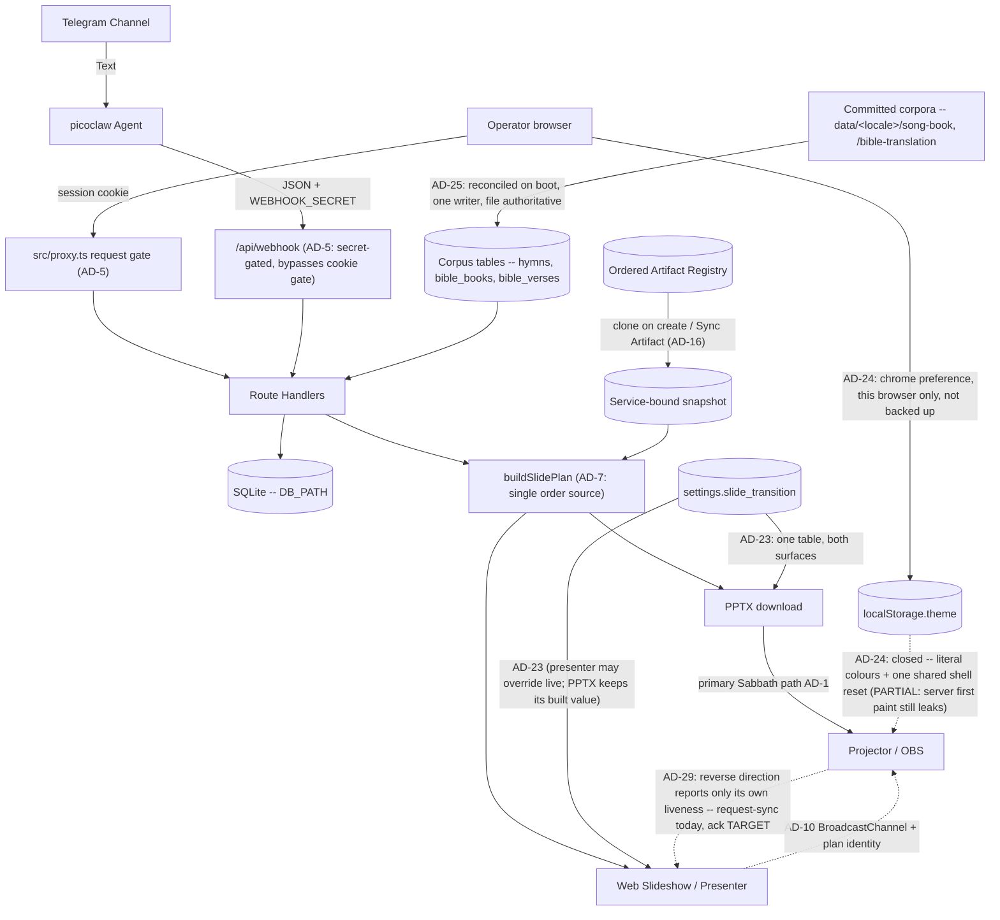
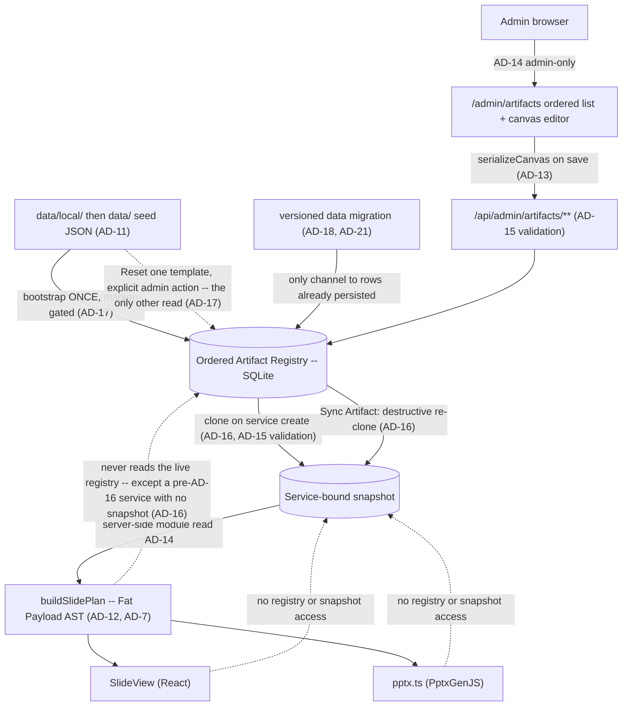

# Architecture Spine — BIC Worship Presentation Automation

**One spine per project.** This is the project's only architecture spine. The Epic 16 child spine was folded in on 2026-07-30 — see *AD map* below for the renumbering. Its reasoning was extracted into this spine's `.memlog.md` before the child run folder was deleted, so the memlog is where the rationale for AD-11..AD-19 lives.

## Design Paradigm

**Monolithic Next.js app (App Router UI + API routes)**
One deployable unit serves the operator Web Hub, JSON APIs (webhook/services), hymnal lookups, PPTX generation, web slideshow, presenter mode, and the admin Artifact Registry / canvas editor. Server Components are the default; `'use client'` is added only where hooks, browser APIs, or event handlers require it — including at the root, where one client provider wraps every route for theming without making the tree it wraps client-side (AD-24). Operators/agents follow `.claude/skills/picoclaw-webhook/` to POST the webhook JSON API (skill docs, not an in-process runtime). **Offline PPTX remains the primary Sabbath path**; in-browser slideshow / presenter are also shipped (FR-15 / FR-16).

**Within it: data-driven presentation rendering with a decoupled editor** (AD-11..AD-23). Slide layout is a JSON layout AST rather than hardcoded switch-statements; an uncontrolled canvas editor owns the design, and both renderers (React web, PptxGenJS) are dumb consumers of pre-hydrated ASTs. Epic 20 turns that registry from a template catalog into the **ordered** surface where the deck itself is authored.

## AD map — the 2026-07-30 fold-in

The Epic 16 spine numbered its own decisions from 1, so folding it in required renumbering. Old citations resolve through this table, and every affected `AD-n` heading below carries its former identity inline. `AGENTS.md`'s standing rule — never renumber an existing `AD-n` — was waived once, by the owner, for this merge only.

**Reading an old citation.** Treat any `AD-n` citation in a document dated before 2026-07-30 as requiring this table before it can be read. Dated run records — readiness reports, review reports, sprint change proposals — keep their contemporaneous citation form and were deliberately not rewritten, so several still use `INIT AD-n` / `epic-16 AD-n`. One case a dangling-reference check cannot catch: `sprint-change-proposal-2026-07-29.md:85` cites **bare** `AD-2..AD-5` in an epic-16 context, where those numbers now resolve to four entirely different decisions.

| Was | Now | Decision |
| --- | --- | --- |
| `epic-16 AD-1` | **AD-11** | Artifact Registry Storage |
| `epic-16 AD-2` | **AD-12** | Slide Plan Data Flow (Fat Payload) |
| `epic-16 AD-3` | **AD-13** | Canvas State Boundary |
| `epic-16 AD-4` | **AD-14** | Global Template Administration |
| `epic-16 AD-5` | **AD-15** | Stable Layout Identity |
| `epic-16 AD-6` | **AD-16** | Service-Bound Registry Snapshot |
| `epic-16 AD-7` | **AD-17** | The Seed Is a Bootstrap |
| `epic-16 AD-8` | **AD-18** | Vocabulary and Value Changes |
| `epic-16 AD-9` | **AD-19** | Cross-Boundary Binding Keys |

`INIT AD-n` was the old citation form for AD-1..AD-10 of this file. Those numbers did not change; drop the prefix. The fold-in also removes a real hazard: `AD-6` and `AD-9` each used to mean two different decisions depending on which document you were reading.


## Invariants & Rules

`[ADOPTED]` means the mechanism this decision fixes exists in `src/` and governs it, with any
unclosed half named in the block and tracked as debt in `deferred-work.md`; an untagged `AD` is
equally binding but has **no** mechanism in the code yet, so there is nothing to read and nothing to
build against until the story that lands it ships.

### AD-1 — Web Hub + Offline PPTX (Phase sequencing) [ADOPTED]
- **Binds:** Presentation rendering, Operator experience
- **Prevents:** Dependency on venue internet during Sabbath services
- **Rule:** Operators use a zero-install **Web Hub** for review/run-sheet. **Phase 1** presents on Sabbath from a downloadable offline **PPTX**. In-browser Web Slideshow / Presenter Mode are **shipped** (FR-15 / FR-16) but are **not** the hard offline Sabbath guarantee; PPTX download remains primary for venue reliability. A registry or layout change may not make Sabbath rendering depend on hub connectivity.

### AD-2 — Single Repository Monolith [ADOPTED]
- **Binds:** Code organization, deployment
- **Prevents:** Operational complexity and synchronization issues for a solo developer
- **Rule:** The picoclaw skill integration logic, API backend, and App Router web UI must reside in a single repository and be deployable as a cohesive unit. Registry storage, the admin editor UI, and both renderers are part of that unit; there is no separate editor service.

### AD-3 — Decoupled Ingestion and Presentation [ADOPTED]
- **Binds:** Data boundaries, external integrations
- **Prevents:** Tightly coupled integrations that would make replacing the Telegram/Agent ingestion difficult
- **Rule:** The API must expose a standard JSON interface for service generation that is agnostic to the input mechanism (Telegram/picoclaw). The presentation layer consumes this same API. Artifact templates are a presentation-layer concern; webhook/service intake JSON stays agnostic of layout templates.

### AD-4 — LiveServer durable paths (home PC production) [ADOPTED]
- **Binds:** Deployment, SQLite, announcement uploads
- **Prevents:** Ephemeral container-only data loss
- **Rule:** Production is deployed as one Docker/standalone unit on the home-PC LiveServer (`presenter.example.org` via Cloudflare Tunnel). Host-durable paths for `DB_PATH`, PPTX cache, and `UPLOADS_DIR` (compose bind-mounts). Operator details: `docs/deployment-guide.md` / `docs/deploy.md`. **As of 2026-07-30 no deployment exists** — the tooling ships and is configured, and nothing is running (`prd.md:552`, owner-corrected 2026-07-29). That date is load-bearing rather than trivia: AD-18's total-replacement licence and AD-21's released-version freeze both hinge on *until first deploy*, so they need an anchor stated here instead of inferred from this rule's tense. Announcement image refs are remote http(s) (SSRF-hardened) **or** hub-local `/api/uploads/<32-hex>.(jpg|jpeg|png|gif|webp)` resolved from disk for PPTX. Registry rows and per-service registry snapshots live in that same durable `DB_PATH`; editor image references resolve through the existing `UPLOADS_DIR` / allowlist rules, never new ad-hoc paths.

### AD-5 — Single request gate in `src/proxy.ts` [ADOPTED]
- **Binds:** every route and page; authentication and authorization
- **Prevents:** per-route authorization drift, and privilege that survives demotion, logout, or password change
- **Rule:** `src/proxy.ts` is the one request gate, and its `config.matcher` regex **is** the authorization boundary — anything it does not match is served with no session check at all, so a new exclusion ships together with its assertion in `tests/proxy-matcher.test.mjs` in the same change set. The gate re-checks every session against SQLite (deleted account, role demotion, stale `token_version`, revoked `sid`) and **fails closed** if that lookup throws. Privileged routes additionally call `requireSession` / `requireAdminSession`; the cookie's `role` claim is never trusted alone. `/api/webhook` is gated by `WEBHOOK_SECRET` only — 503 when unset, 401 when wrong or missing — never by a cookie. Post-login `next` targets pass through `safeNextPath`. Every gated response carries `Cache-Control: private, no-store` and `Vary: Cookie`, because the hub is published through a Cloudflare Tunnel where an edge cache rule could otherwise serve a rendered private page without the origin — and therefore without this gate — ever running. Do not export `runtime` from the Proxy file (Next throws), and do not reintroduce `middleware.ts`: a `proxy.ts` entry **always** runs on Node, while a `middleware.ts` entry is compiled for the Edge runtime **unless it exports `runtime = 'nodejs'`** — so the rename is what guarantees the per-request SQLite re-check rather than leaving it to a declaration someone can drop. (Node-runtime middleware has been stable since Next 15.5.0; the flat claim that `middleware.ts` *is* Edge is false, and a rule defended by a refutable reason is a rule that gets reverted. `src/proxy.ts:5-11` states it correctly.) **Two recorded deviations from upstream guidance, both deliberate.** Next's docs advise never relying on Proxy alone for authorization (`proxy.md:217-219`), so the nine non-admin routes carrying no in-route `requireSession` are a standing deviation rather than merely unfinished work — see *Deferred*. And Next advises avoiding a database check in this position for performance (`authentication.md`), which this rule requires on **every** gated request: accepted knowingly, because a signature-only check cannot see a deleted account, a demotion, or a revoked session, and for one congregation on a home server the cost of a local SQLite read is not the constraint the guidance assumes. If this hub ever serves traffic where it is, that is the trade-off to revisit — not the fail-closed behaviour. A Server Function POST inherits its route's matcher outcome, so a new matcher exclusion removes coverage from Server Functions on that path too.

### AD-6 — Optimistic concurrency on service edits [ADOPTED]
- **Binds:** service mutation APIs, hub edit UI, agent/webhook corrections, registry template writes, Sync Artifact
- **Prevents:** an operator's edit silently erased by a late correction (last-write-wins)
- **Rule:** every service mutation carries the client's `updated_at` as a precondition; a stale value is rejected with HTTP 409 and the client re-reads before retrying. No write path may bypass the precondition. This covers registry writes and the **Sync Artifact** action of AD-16 — the shipped shape is `expectedUpdatedAt` / `RegistryStaleError` in `src/lib/registry/store.ts`.
- **Not yet closed:** four shipped paths bypass the precondition. The rule is deliberately **not** narrowed to cookie-authenticated mutations — the unguarded path is the *agent* path, which is precisely the late correction this decision's *Prevents* describes, so scoping the rule would abandon the hazard rather than record it. Tracked in `deferred-work.md`.

### AD-7 — `buildSlidePlan` is the only slide-order source [ADOPTED]
- **Binds:** PPTX generation, web slideshow, presenter + projector
- **Prevents:** divergent slide order or content between what the operator controls and what the congregation sees
- **Rule:** `buildSlidePlan` is the single source of slide order and content for every surface. No surface recomputes order from service fields or keeps its own ordering logic; a rendering or ordering change lands in the plan, never per-surface. AD-12's Fat Payload specializes this rule; AD-16 changes only where the plan reads its templates from, never that there is one order source.

### AD-8 — Image references resolve only through shared safety helpers [ADOPTED]
- **Binds:** announcement images, hub uploads, registry/asset references, PPTX embedding
- **Prevents:** a new surface reintroducing SSRF or unsafe content through its own laxer resolver
- **Rule:** image references resolve only through the shared helpers in `src/lib` — allowlisted remote http(s) and hub-local `/api/uploads/<32-hex>.(jpg|jpeg|png|gif|webp)` for announcements, and registry `/assets/...` refs for Artifact templates. A new reference vocabulary extends an existing helper or adds one alongside them with the same fail-closed default; no unit ships an inline resolver. The canvas editor introduces no second resolver and admits no `data:` or arbitrary remote URI.

### AD-9 — Schema evolution through startup DDL only [ADOPTED]
- **Binds:** SQLite schema, and the bootstrap path it shares with AD-18
- **Prevents:** two sources of schema truth between a developer machine and a fresh production container
- **Rule:** schema changes go through the app's startup DDL on the `getDb` path. No migration framework (Prisma or otherwise) is introduced without an explicit product decision recorded in this spine. Registry tables are created on that same path. **The bootstrap path is shared, and the division is fixed:** this rule owns *schema* — the shape, e.g. adding a column — while **AD-18** owns *value* migration — the contents, e.g. rewriting every row's `base_type`. Neither licenses the other's mechanism: a value change is not a reason to add a framework, and a schema change is not a reason to rewrite data.

### AD-10 — One presenter sync channel, client-side only [ADOPTED]
- **Binds:** presenter, projector, web slideshow
- **Prevents:** a split sync topology where the projector follows one controller and ignores another
- **Rule:** presenter↔projector sync goes through the single `@/lib/present-channel` `BroadcastChannel` module; no surface opens its own channel name or message shape. No server realtime channel (WebSocket/SSE) is introduced unless product direction changes — keeping the venue path independent of hub connectivity, per AD-1. A registry edit must not add a second channel to push template changes to a live projector. **Every message carries a plan identity** — a fingerprint of the snapshot and resolved announcement set that produced the deck — and a receiver whose own identity differs **refuses to follow the index** and says so on the room-facing screen rather than rendering a slide it cannot vouch for. Presenter and projector are two independent `force-dynamic` renders, each calling `buildSlidePlan` at its own moment, so a bare `index` silently means different slides on the two screens the instant anything structural changes underneath them; since this rule forbids a surface inventing its own message shape, the identity has to live in the shared shape.
- **Not yet closed:** the plan-identity clause is unbuilt. `PresentMessage` (`src/lib/present-channel.ts`) carries no identity field, and the fingerprint is defined partly over AD-16's snapshot, which does not exist yet either. The single-channel rule above is settled and fully ratified; only the identity is missing, and its offset-slide hazard is live now rather than waiting on Epic 20. Tracked in `deferred-work.md`.
- **Extended by AD-29 (2026-08-05), and nothing here is narrowed.** This channel also carries a **projector→presenter** message, and it always has — `request-sync` travels that way — which the *Prevents* above can be misread as forbidding. AD-29 fixes what the reverse direction may carry: **the sender's own condition and nothing else**, so the single-controller property above is unchanged by the addition. It also states that the plan-identity clause is not partly implemented while a new variant is added to `PresentMessage`.

### AD-11 — Artifact Registry Storage *(was `epic-16 AD-1`)* [ADOPTED]
- **Binds:** Database schema, the Canvas Editor's save API, and the startup seed path.
- **Prevents:** Data loss on ephemeral container filesystems, file-lock concurrency issues, and a seeder that overwrites administrator edits or leaks private seed content.
- **Rule:** The live Artifact Registry is stored in SQLite on the durable `DB_PATH` (AD-4). Filesystem JSON serves exclusively as a startup seed: startup inserts missing template IDs and **never** overwrites persisted administrator edits. Reset restores one selected template from that seed. The seed is two-layered — `data/local/default-registry.json` is git-ignored and **takes precedence over the shipped `data/default-registry.json` example whenever present**; a seeder that reads only the shipped example breaks the mechanism that keeps congregation data out of a public repository.
- **Superseded in part by AD-17 (2026-07-30):** the *"startup inserts missing template IDs"* clause only. Storage target, the two-layer seed precedence, Reset-from-seed, and "never overwrites administrator edits" all stand as written.
- ~~**The gap in *"exclusively a startup seed"* (2026-07-30):** `registry-snapshot.ts:85-90` reads the seed at **plan-build** time and substitutes shipped content for any row the database does not hold, so a deleted template still reaches the deck.~~ **Closed 2026-08-07 (Story 20.1, AC-7), and this decision is `[ADOPTED]` for the first time.** `loadRegistrySnapshot` (`registry-snapshot.ts:76-92`) is now `SELECT` → `parseRow` → `set` with **no substitution loop at all**, so the seed is read at exactly the two moments AD-17 permits and a deleted row stays deleted through a plan build. Verified in this worktree rather than taken from the story. Kept rather than deleted for the reason the entry itself turned out to demonstrate: this rule carried the word *"exclusively"* the whole time the read path was contradicting it, and what closed the gap was **naming the read path** — the prose was never the thing that was wrong. **The story's own Gate did not list this among the four statements it staled** — it named the *Deferred* bullet that tracked the same code and not the `AD` clause above it — which is why an Update run reads the change set rather than the hand-off list. The two-layer precedence still has one shipped override: `WPW_USE_SHIPPED_REGISTRY=1` inverts it (`seed.ts:48`, cited as `:39` until this run) for tests and fidelity smokes, and nothing else may.

### AD-12 — Slide Plan Data Flow (Fat Payload) *(was `epic-16 AD-2`)* [ADOPTED]
- **Binds:** The `buildSlidePlan` return type and all downstream renderers.
- **Prevents:** The Web (`SlideView`) and PPTX renderers from performing independent database lookups or maintaining their own diverging layout logic.
- **Rule:** `buildSlidePlan` outputs a fully hydrated AST (Fat Payload) with exact rendering coordinates, fonts, colors, and resolved text content. Specializes AD-7: the plan is the single order *and* layout source, so a renderer never **reads data from** the registry itself. Importing a shared *helper* that happens to live under `src/lib/registry/` is not such a read — `pptx.ts` importing `isBundledAssetRef` from `registry/asset-safety` is the AD-8 resolver this spine requires, not a data path.

### AD-13 — Canvas State Boundary *(was `epic-16 AD-3`)* [ADOPTED]
- **Binds:** The React-Fabric integration layer (`src/components/admin/ArtifactEditor.tsx`).
- **Prevents:** Two-way data binding lag, stuttering drags, and unnecessary React re-renders.
- **Rule:** The Canvas Editor uses an Uncontrolled Wrapper pattern. Fabric.js owns the canvas state exclusively; React reads it **only on save**, through `serializeCanvas` over `canvas.getObjects()`, projecting into the registry's own element schema. Not `canvas.toJSON()`: Fabric's serialization format is **not** `ArtifactLayout.elements`, so a second editor surface built on `toJSON()` would fail AD-15's validator on every write. The projection into the registry schema is the boundary, not the canvas library's own format.

### AD-14 — Global Template Administration *(was `epic-16 AD-4`)* [ADOPTED]
- **Binds:** `/admin/artifacts`, `/api/admin/artifacts/**`, and the registry access layer.
- **Prevents:** Per-service template drift and operator-level mutation of every service's visual contract.
- **Rule:** Artifact templates are global across services. Registry management UI and APIs are admin-only and re-check the current account role from SQLite — a specialization of AD-5, not a separate authorization scheme. `/admin/artifacts` and `/api/admin/artifacts/**` are inside the AD-5 matcher, and adding a registry route outside it requires the same-change-set test update AD-5 demands. Downstream planners and renderers read the registry through server-side modules rather than the management API.
- **Superseded in part by AD-16 (2026-07-30):** the *"global across services"* clause only — a service now reads its own cloned snapshot. The admin-only authorization clause and the read-through-server-side-modules clause are **untouched** and still bind; the second now points at the snapshot instead of the live registry. Not to be confused with AD-4 (LiveServer durable paths), which is a different decision and is not affected.

### AD-15 — Stable Layout Identity *(was `epic-16 AD-5`)* [ADOPTED]
- **Binds:** Seed data, every write path into the registry, hydration, and both renderers.
- **Prevents:** Unit-specific renderer drift, required-placeholder deletion, and unsafe image references reaching a renderer through an unvalidated back door.
- **Rule:** Layouts use a fixed 16:9 canvas with normalized percentage coordinates and stable template/layout/element/placeholder IDs. Coordinates may extend beyond the canvas to preserve intentional source-deck clipping. **Every** write into the registry is untrusted and must pass the same structural and image-reference validation before persistence — the canvas save API, the startup seeder, and any import or asset-extraction script alike. Image refs validate through the shared helper required by AD-8; no write path ships its own check.

### AD-16 — Service-Bound Registry Snapshot *(was `epic-16 AD-6`)*
- **Supersedes:** the *"global across services"* clause of AD-14, and nothing else in it. Recorded as a separate decision so the reversal stays visible.
- **Binds:** service creation, the Sync Artifact action, `buildSlidePlan`'s template input, and every read path a service surface uses.
- **Prevents:** a live registry edit shifting the structure under a service an operator is preparing right now, and a weekly value entered against one structure being orphaned by a later structural change — and, in the other direction, a service with no way to be brought up to date.
- **Rule:** Creating a worship service **clones** the ordered live registry — order, kinds, labels, layouts, placeholder bindings, **and the administrator override records of AD-22** — into a **service-bound snapshot** on the durable `DB_PATH` (AD-4); creation is the only freeze event. The clone is of the *rendered* structure, so anything AD-22 keeps outside the layout travels with it; an override left out of the clone would either never reach the deck or reach it from outside the freeze, and both defeat this decision. A service's plan, Presenter, slideshow and PPTX read that snapshot; a live registry edit reaches an existing service **only** through the explicit **Sync Artifact** action, which replaces the snapshot destructively. Sync is permitted on **any** service, carries the service's `updated_at` precondition (AD-6), and may not alter the service's entered data (*State* convention) — "destructive" means it replaces the snapshot, never that it may overwrite a service someone else has moved underneath it. **Sync is a structural write and is therefore admin-only**, re-checking the role from SQLite exactly as AD-14 requires of every registry management surface, even though it is reached on a service route that `src/proxy.ts` gates for any signed-in account; its route ships with the `tests/proxy-matcher.test.mjs` assertion AD-5 demands and an in-route `requireAdminSession`. An operator may see that their snapshot is stale and *request* a sync; they may not perform one. Without this, "permitted on any service" and AD-14's surviving admin-only clause read as licence for an operator to freeze a half-authored layout into the service that presents in fourteen hours — this decision's own *Prevents*, arrived at from the other direction. The clone and the re-clone are write paths and validate under AD-15 like every other. **Announcement membership is not cloned:** the Announcements master list stays live and reaches an existing service at render time (CAP-7). **It is nonetheless scoped per service (`service_id`), matching the clone boundary everywhere else in this decision** — "not cloned" means this week's flyers may still change after the structure is frozen, never that one list is shared across services. The distinction is invisible while only one service is being prepared and decisive the moment two are open at once — a stale service reopened for a correction while next week's is being built — at which point an unscoped list bleeds one service's images onto another's deck. The shipped `announcement_items.service_id` is nullable, so both readings are currently expressible; this rule picks the scoped one. **A later structural change obliges nobody to keep an older snapshot renderable** — what the snapshot protects is the service's entered supporting data, not its ability to regenerate a past deck. The snapshot is the sequence *input*: `buildSlidePlan` remains the single source of order and layout (AD-7, AD-12), and no renderer reads a snapshot directly any more than it read the registry. **One bounded exception, stated as an exception rather than argued away — pre-existing services.** A service created *before* this model ships has no snapshot and renders from the live registry until its first Sync, which is a clone-in-place; from that moment the rule above governs it without qualification. So *"creation is the only freeze event"* holds for every service created under this decision, and the no-snapshot state is a **one-way migration path into** the decision rather than a second mode inside it: nothing may create a new service without a snapshot, and no code may re-enter the state once left. It is called out because every service in the database on day one is in it — `spec-artifact-registry-authoring/SPEC.md:89` assumed exactly this and an earlier draft of this rule forbade it, which would have left three stories free to answer it three ways. The Epic 20 data transition (AD-21) may instead clone a snapshot for every existing service and close the exception outright; that is the preferred landing, and either way the state is finite and dated. **Naming caution:** the shipped `RegistrySnapshot` type (`src/lib/artifacts/registry-snapshot.ts`) means *"the live-registry map assembled for one plan build"* — a different thing from this decision's per-service durable freeze, and the two must not be conflated when the second is built.

### AD-17 — The Seed Is a Bootstrap, Not a Correction Channel *(was `epic-16 AD-7`)* [ADOPTED]
- **Supersedes:** the *"startup inserts missing template IDs"* clause of AD-11, and — as of 2026-07-30 — the *"exclusively a startup seed"* clause too, which the read path already contradicts.
- **Binds:** the `getDb` startup path, the registry store's insert path, **every read path that assembles the registry**, the delete verb, the Reset verb, and the registry's ordering column.
- **Prevents:** an administrator's delete, rename or reorder being silently undone by an unrelated restart. A deleted row leaves no evidence behind, so anything that supplies "missing" IDs cannot tell *deleted on purpose* from *never existed here* — it resurrects the row forever.
- **Rule:** The seeder initialises data **from zero only** — first install, first run — and is gated by a marker in `settings`. It is never a gap-filler: after it has run, the administrator owns every row that exists, and the ordered registry is authored data rather than shipped data kept in sync. A gap in a database that already holds data travels as a versioned data migration (AD-18, AD-21), never as a re-seed. **The filesystem seed is read at exactly two moments — the first-boot bootstrap, and an explicit per-template Reset — and at no other.** In particular **no read path may substitute a seed template for a row the database does not hold, and none may substitute one for a row it holds but cannot parse.** An ordered registry of N rows produces a deck built from those N rows and no others; a template id the database does not hold does not exist, and a row whose payload will not validate **fails closed** — no layout, logged with the id and the reason, the same posture AD-5 and AD-8 already take. Both halves matter and the second is the easier one to leave open: `registry-snapshot.ts` substitutes seed content in **one** loop for absent and corrupt rows alike (`parseRow` merely returns `null`, so a corrupt row reaches that loop indistinguishable from a missing one), so a rule that closes only the *absent* case leaves shipped example content silently standing in for an administrator's real layout the moment one row is malformed. Closing only the boot door is what let a deleted slide re-materialise into the deck on every plan build, with `rejected.delete(seed.id)` suppressing even the log line. `tests/registry-reseed.test.mjs`'s assertion that a missing row is re-inserted is **inverted, not deleted**, and a second assertion pins that a deleted row does not reappear in a built plan. Restoring shipped content stays possible as an **explicit administrator action** — Reset-from-seed per template, per AD-11 — never as a side effect of a restart, and never as a bulk re-seed of a live database.
- **An authored row has no seed, and is validated against itself.** The stability baseline for a save is the row's currently persisted state; the shipped seed is a baseline only for rows the bootstrap wrote. A row with no seed origin therefore **exposes no Reset** — Reset is defined only where shipped content exists to restore — and the registry records, per row, whether it originated from the bootstrap or from an administrator, because three verbs (save validation, Reset, and any future re-seed) all need that answer and none can infer it. Without this, the shipped `assertStableAgainstSeed` path answers a brand-new General with `404 Unknown template` on a row the administrator is looking at, and Story 20.4's *"a rejected Save names the property"* cannot be met, because the failure is not about a property.
- **Not yet closed — the per-row seed origin.** `artifact_templates` has no origin column (`db/index.ts:438-446`) and `assertStableAgainstSeed` (`store.ts:129-133`) still opens with `getSeedTemplateById(incoming.id)`, which throws on an id the seed lacks. **The gap is unreachable today and that is a sequencing fact, not a defence** — no create verb exists, so no row without a seed origin can exist to hit it, and it becomes reachable in the same change set that adds one. Tracked in `deferred-work.md`.

### AD-18 — Vocabulary and Value Changes Travel as Explicit One-Time Migrations *(was `epic-16 AD-8`)* [ADOPTED]
- **Superseded in part by AD-21 (2026-07-30):** the *"marker-gated"* mechanism clause only — one version counter replaces the per-change boolean. Everything else stands: values reach persisted rows only through an explicit migration on the startup path, and no framework arrives with it.
- **Binds:** the `base_type` value set, `ARTIFACT_BASE_TYPES` and the `isCanvasAuthorable` predicate derived from it, the registry validator, and any future change to persisted registry values.
- **Prevents:** a shipped vocabulary change reaching persisted rows through boot-time re-seed (which AD-17 removed) or not reaching them at all — and the opposite failure, a migration framework arriving by the back door.
- **Rule:** AD-9 fixes *schema* evolution on the startup DDL path and is silent on **value** migration; this decision fills that silence rather than weakening it. A shipped change that must reach rows already persisted travels as an **explicit, one-time migration** on the startup path, versioned per AD-21. It is not a migration framework and AD-9's prohibition stands: no Prisma, no versioned migration directory, without an explicit product decision recorded in this spine. **Until first deploy** no production rows exist, so Epic 20's seven-`base_type`-to-three-kind collapse ships as a **total replacement** — no backward compatibility, no migration over live rows — folding into production data version 1 (AD-21); at first deploy that licence ends, and the same change would need a migration over live `artifact_templates` rows. A migration operates on the **live registry** and does **not** rewrite service snapshots — structure reaches an existing service only through Sync Artifact (AD-16), so a migration that rewrote snapshots would be a second structural channel. An older snapshot may therefore stop being renderable, which AD-16 accepts; what must survive is the **entered data**.
- **A value persisted in more than one place has exactly one authoritative copy, and it is named here:** the row's `payload` JSON is authoritative for every template field, and any column duplicating a payload field — `label`, `base_type`, and any slot discriminator — is a **derived index** maintained by the same write. A value migration therefore rewrites the payload and re-derives the columns **in the same statement**, and a migration that writes a column alone is refused by a test asserting column and payload agree for every row. This is not pedantry about storage: the admin list reads the column (`store.ts:74-92`, and derives `editable` from it) while the plan and the editor read the payload (`store.ts:35-38`, `registry-snapshot.ts:41-64`), so a column-only migration leaves the administrator's screen and the congregation's screen disagreeing about what kind every row is — with nothing logged and nothing to 409.
- **Not yet closed — the agreement guard.** Every shipped write does set the column and the payload in one statement (`src/lib/registry/store.ts:268-291`, `:341-349`), so the derived-index rule holds in code; the **test** this clause requires, asserting column and payload agree for every row, does not exist. Tracked in `deferred-work.md`.

### AD-19 — A Cross-Boundary Key Is a Server-Owned Value the Administrator Cannot Edit *(was `epic-16 AD-9`)*
- **Binds:** the `base_type` enumeration, the four predefined SongSet slots, the Placeholder Catalog key set, the worship-service settings form, and every write path into the registry.
- **Prevents:** two independently-built units agreeing to disagree about a key — the registry surface and the worship-service settings form picking different handles for the same SongSet slot, and the canvas editor's insert list drifting from what the validator actually admits.
- **Rule — the kind vocabulary and the SongSet slot key:** the kind vocabulary is exactly the three the SPEC fixes — `general`, `song-set`, `announcement`. `text-placeholder`, `image-placeholder`, `mix-placeholder` and `fullscreen-image` are **gone rather than renamed**: a placeholder stops being a kind and becomes an element inserted onto a General from the Placeholder Catalog. Only `song-set` expands, into four slot identities — `songset-bt-open`, `songset-bt-close`, `songset-ds-open`, `songset-ds-close` — and that identity **is** the key the worship-service settings form binds a hymnal number to. `song-set` names the kind, never an entry: an entry carries one of the four slot identities. **The recognized set is therefore closed and complete** — `general`, the four `songset-*` slots, `announcement`: six keys over three kinds, and no write path admits a seventh. Reordering rows changes the presented sequence (CAP-8) without touching a binding; renaming a label cannot touch one either. Three requirements make the scheme unambiguous rather than merely convenient: the slot identity is **never administrator-editable**, **at most one registry row may carry each slot identity**, and the identity is a **semantic name, never an ordinal** (`songset1` re-imports the positional reading this decision exists to remove). The chosen spelling is a persisted binding key, so changing it later is the versioned data migration AD-18 and AD-21 govern. A binding whose slot row has been deleted is **inert**, not an error: the slot does not appear, because the administrator removed that song from the order — and the entered hymnal number survives in the service's own data, which AD-16 requires regardless. Extending the vocabulary — a fifth slot, a fourth kind — is a code-plus-tests change, never administrator configuration.
- **Rule — one home for the value the key names:** a weekly value a slot binding names has exactly **one persisted home**, and it is the service's own entered data; the slot identity is a *key into* that data, never a second copy of it. The four `songset-*` identities therefore **replace** the shipped ordinal field names `song1Number..song4Number` (`worship-form-fields.ts:6-9`, mapped positionally at `parsed-fields.ts:418-421`) in the same change set that introduces them — deleted, not aliased — and no code path may hold a hymn number `buildSlidePlan` does not read. Otherwise a webhook correction (which AD-3 forbids knowing slot keys) rewrites one home while the settings surface owns the other, and the deck renders 245 while the run sheet and the edit form both show 312, with no 409, no log, and no screen on which both values appear.
- **Rule — the closed set is a statement about the registry, not about the rundown:** a hymn in the service's entered data that no slot identity claims is **surfaced, never silently dropped and never fatal**. `buildSlidePlan` emits no slide for it and the service surface reports it as unclaimed weekly data. The mapping from each `songset-*` identity to its position in the parsed rundown is fixed in **one table in one module**, because the shipped planner renders an unbounded number of middle Divine Service songs (`slide-plan.ts:399`, `:464-466`) and reads the closing song as the last element while the shipped form maps `song4Number` to the second — two defensible readings of the same four slots, which with three hymns are different songs.
- **Rule — Placeholder Catalog:** the admitted key set is server-side vocabulary enforced on **every** write path, the same treatment AD-8 and AD-15 gave image references, so *"the UI cannot invent a catalog key"* (CAP-4) is a property of the registry rather than of one client. Its key spelling is persisted into saved layouts, so that spelling too falls under AD-18 and AD-21 once chosen. Independent of the SongSet clause above. **The catalog is one server-side module holding both the admitted key and its resolver** from the parsed rundown — so a key cannot be admitted without a filler, and CAP-4's *"the same catalog key on multiple Generals with different styling"* is key-addressed rather than call-site-addressed. Today the planner supplies values as hardcoded literals at ten separate call sites in `slide-plan.ts`, spelled differently from `placeholder-catalog.md`; a catalog that fixes only the write side admits a key nothing can fill, and `hydrate.ts` fails closed on a required binding — on a Sabbath. That resolver map is the one map the planner still legitimately owns, and AD-20's prohibition does not reach it. Nothing named `ALLOWED_PLACEHOLDER_KEYS` exists for this purpose: the shipped constant of that name is an unrelated object-key whitelist, and the resemblance makes a grep look like confirmation.

### AD-20 — The Planner Injects Nothing the Registry Did Not Ask For [ADOPTED]
- **Binds:** `buildSlidePlan`, the registry seed, the ordered registry, and every liturgical rule about which slides exist.
- **Prevents:** a liturgical decision requiring a code change and a deploy, and the planner keeping a second, invisible source of deck content alongside the registry.
- **Rule:** every slide in the deck originates from an ordered registry entry. `buildSlidePlan` **applies** rules; it does not **hold** them. Fixed liturgical content — the standing responses `#671` and `#684`, the closing *We Have This Hope* — is authored as **General** entries and edited by hand, never injected by the planner and never computed from the hymnal. Because a General generates no title slide, the `skipTitle` mechanism is **removed rather than migrated**: there is nothing left to suppress. It shipped at five sites and Story 20.1 deleted them — a removal, not a compatibility shim, and `slide-plan.test.mjs:231` greps the tree to keep it deleted. Changing or adding a liturgical song is a registry edit.
- **The two halves of *Prevents* are separated, and only the second is closed.** `buildRequestPlan` walks `orderedTemplateIds` — the snapshot's own `position` order — and looks each row up in a handler table, so swapping two positions in the database changes the deck and the planner holds no sequence of its own (`slide-plan.ts:296-302`, `:724-731`, `:834-836`). The four liturgical lyric pages are General rows in the seed (`intercessory-671-lyric-1`, `intercessory-684-lyric-1`, `hope-lyric-1`, `hope-lyric-2`), so nothing is injected and nothing is computed from the hymnal.
- **Not yet closed — the *first* half of *Prevents* is still live.** Five handlers keyed on hardcoded row ids still decide **which hymn** from the parsed rundown fills each slot, so *"every slide originates from a registry entry"* holds while *"a liturgical decision does not require a code change"* does not. The distinction matters to a reader deciding what is safe to build on: the *order* is data today and may be relied on; the *choice of song* is not, and a story that treats it as data will find five ids in a lookup table. Tracked in `deferred-work.md`.

### AD-21 — Persisted Data Carries One Version Number, and Unreleased Transitions Compact Into One [ADOPTED]
- **Supersedes:** the mechanism clause of AD-18 — the per-change boolean marker, precedent `artifact_seed_hash_backfilled`. AD-18's rule that persisted rows change only through an explicit migration, and its prohibition on a migration framework, stand untouched.
- **Binds:** the persisted data version in `settings`, every data migration on the `getDb` startup path, the release procedure, and the developer database lifecycle.
- **Prevents:** two builders keying the same change incompatibly — one adding a per-change boolean, another bumping a counter — and a production database accumulating one transition per code change, so that its version history tracks development activity instead of releases.
- **Rule:** All persisted data shares **one monotonic version number** in `settings` — one counter for the whole database, never one per table or per domain, so that "which version is production on" has a single answer. A change that must reach data already persisted is declared **explicitly while it is being coded**, as the transition from version *n* to *n+1*; it is never inferred at deploy time. **An unreleased transition is not yet history and may be rewritten:** the whole batch of unreleased transitions is compacted into a single transition before it reaches production, and developer databases are **reset** to the compacted version rather than migrated through the steps it replaces. **A released version is frozen** — once a version has reached production it is never renumbered, re-cut, or folded into another. Small steps are a development convenience and stop at the merge; production sees one transition per release. AD-17's seeding marker and this counter are **distinct**, and neither substitutes for the other: the marker records that bootstrap ran, the counter records which data version is persisted. This is a counter and a convention, not a framework: AD-9's prohibition stands.
- **The counter's absence is not version 0.** A database created by the AD-17 bootstrap is stamped with the current data version **by the bootstrap itself, in the same transaction as the seeding marker**, and declares itself already migrated; a database holding registry rows and no version key is a *pre-counter* database and takes exactly one recorded repair transition. Because this decision insists the marker and the counter are distinct, nothing else would make writing the counter anybody's job on a fresh install — and a fresh install that reports version 0 re-runs history it was never part of.
- **The order on the `getDb` path is fixed, and asserted by a test:** startup DDL (AD-9) → data migrations (AD-18) → first-boot bootstrap (AD-17). A migration never observes rows the bootstrap wrote in the same boot. Left unstated, the reverse order is equally compliant and strictly worse: the Epic 20 collapse, whose mapping table is keyed on the seven retired `base_type` values, would run *over freshly seeded `songset-*` rows* and either refuse to boot — at 08:40 on a Sabbath — or fall through to a default that rewrites all four slots to `general`, destroying AD-19's one-row-per-slot uniqueness by migration and dropping three songs from the deck.
- **`schemaVersion` is not this counter and never answers for it.** The per-row payload discriminator (`types.ts:83`, pinned at `validate.ts:449-450`, re-stamped at `:505`) describes the *shape* of one template and a transition may raise it; *"which version is production on"* has exactly one answer and it is the `settings` counter. A change that bumps one without deciding about the other is the ambiguity this decision's *Prevents* names, one level further in than it first looked.
- **Ratified against `src/` (Story 20.1, AC-9 / AC-10).** The counter is `data_version` in `settings` (`seed.ts:16`) at `CURRENT_DATA_VERSION = 1` (`:19`), stamped by the bootstrap **in the same transaction** as the bootstrap marker (`:115`, `:118`), with `repairPreCounterArtifactRegistry` (`db/index.ts:300-318`) running at most once and the fixed step order asserted in both directions (`registry-reseed.test.mjs:304`, `:319`, `:363`, `:386`). *"A released version is frozen"* and *"unreleased transitions compact before release"* describe a **release event this project has never had** (AD-4), so they are unenforceable — that is a missing release procedure, which *Deferred* owns as a dimension, not a missing mechanism.

### AD-22 — Authoring Authority Is Fixed per Kind: Free Canvas, Bounded Config, or Bound to a Set
- **Binds:** the canvas editor, the SongSet configuration surface, the registry validator, and the plan's expansion of one entry into N slides.
- **Prevents:** the canvas editor and the validator disagreeing about what an administrator may author on a non-General entry — one opening a free canvas on a SongSet row and admitting an extra or rebound placeholder, the other refusing it — and CAP-3's *"General only"* living nowhere but in a capability statement.
- **Rule:** authoring authority is fixed per kind, and no surface widens it. **`general` is free canvas:** the administrator composes it from anything, including Placeholder Catalog keys (AD-19). **A `songset-*` row gets a bounded configuration surface, not a canvas:** exactly two background images — one for its title layout, one for its lyric layout, which verse and refrain share — plus font style and font size. Both background references resolve through the shared helper AD-8 requires: this surface is not the canvas editor and introduces no second resolver of its own. Layout composition itself is developer-owned seed data and is not exposed there; it stays registry data hydrated into the plan (AD-11, AD-12), never a coordinate held by a renderer. **Administrator-configured values persist outside the layout**, as an **override record keyed by row and field**, re-applied over the developer layout at hydration: the layout JSON stays developer-owned in full and a migration may replace it wholesale, the override record stays administrator-owned in full and no migration, Reset, or re-seed writes it, and a bounded surface that writes *into* the layout is refused by the validator on every write path (AD-15). An earlier draft left the encoding as "a schema call, not an invariant" — an override record beside the layout *or* a marked field inside it. The two were never equally available: the shipped validator rejects unknown keys against a closed `ALLOWED_LAYOUT_KEYS`, so the in-layout marker cannot ship without a registry-contract change this decision does not authorise, leaving only the unmarked shape — background written straight into `layouts.*.backgroundImage`, font into element `style`, indistinguishable from developer output. Then this decision's own migration clause replaces those layouts and **every background and font size the administrator chose reverts to the shipped default, on all four slots, silently, before anyone opens the hub** — AD-11 keeps no second copy and Reset would discard them too, so the only record of them was the layout just overwritten. The row's placeholder set and its SDAH slot binding are server-defined: nothing may be added, removed or rebound, and the validator refuses it on every write path (AD-15). **An `announcement` row is bound to the Announcements master set**, whose membership is not registry-authored at all (AD-16, CAP-7). Only those two kinds **expand** — a SongSet row into its title and lyric slides, an `announcement` row into N full-bleed images; a General is one slide. Because AD-17 reads the seed once, a developer's later change to a SongSet layout reaches a deployed database only as a versioned data migration (AD-21) — never by restart, and not by Reset. **Reset restores the shipped *layout* and leaves the override record untouched**, which is the whole point of keeping the two apart: before the override record existed, Reset would have discarded the administrator's backgrounds and font sizes along with the layout, and there would have been nowhere to recover them from. A Reset that also cleared administrator configuration would need to say so and does not.

### AD-23 — Transition Style Is One Value, Described Once, Consumed Identically [ADOPTED]
- **Binds:** PPTX generation, web slideshow, presenter, projector, the admin settings surface
- **Prevents:** a deck that fades in PowerPoint and cuts on the projector — the same slide sequence behaving differently on the two surfaces the congregation and the operator each watch
- **Rule:** transition style is **one app-wide value** in `settings` (`slide_transition`), and each style is described **exactly once**, in `src/lib/transitions.ts`, carrying both its PowerPoint element and its browser animation parameters. Neither renderer holds either half: `pptx.ts` and the browser surfaces all import that table, and **no surface keeps a default of its own** — that, not immutability, is the invariant. The value reaches each surface directly from `settings`, never through the plan (`buildSlidePlan` has no transition concept at all). There is no per-service override. The presenter **may** override the style for the **live browser session**, and that override travels through AD-10's channel so presenter and projector never disagree with each other (`PresenterOperator.tsx`); a PPTX already generated keeps the `settings` value it was built with, because a downloaded file cannot be re-styled after the fact. Adding a style means adding a row in that one table — and only styles that survive a plain `<p:transition>` child without the `p14` extension namespace qualify, so nothing silently degrades to "no transition" when the deck is opened elsewhere. This ratifies a convention the code already states in its own header; it is recorded here because FR-7 (`prd.md:179-180`) makes it a requirement and `prd.md:304` states the cross-surface obligation in as many words — *"the browser transition matches the Deck's configured transition style (FR-7); the two are chosen once and never diverge"* and `docs/architecture.md:61` — a declared source of this spine — used to contradict it by hardcoding a crossfade. That source was reconciled on 2026-07-30 and now states the configured value and cites this `AD`, so the contradiction is closed; the decision stays because FR-7 still needs an owner and because two renderers plus two browser surfaces is exactly the shape that diverges without one.

### AD-24 — Operator Chrome State Is Browser-Local, and the Room-Facing Surface Is Closed to It [ADOPTED]
- **Binds:** the root layout's client boundary, every browser-persisted operator preference, the choice between `settings` and `localStorage` as a storage target, and every full-screen room-facing surface
- **Prevents:** one hazard with three faces — a preference landing in `settings`, where it silently becomes *every* operator's, or a deck-affecting value landing in `localStorage`, where AD-4's durability, AD-6's concurrency and AD-18/AD-21's migration rules cannot reach it; the root client boundary migrating upward until the whole app is a client tree; and a client-persisted value that **paints** becoming a third structural channel to the congregation's screen, alongside `buildSlidePlan` (AD-7) and the BroadcastChannel (AD-10)
- **Rule — three tiers, and the question that picks one.** **Application** state — anything the product decides to remember — reaches one of three homes, and *who must agree on it* decides which. **Persisted-shared** lives in SQLite on the durable `DB_PATH` (AD-4), an app-wide value in `settings`, as AD-23 already does for `slide_transition`. **Persisted-local** lives in that browser's `localStorage` and nowhere else: not in SQLite, not under `DB_PATH`, and therefore **not backed up**. **Ephemeral-shared** is not persisted at all and travels over AD-10's channel, which is what AD-23's live presenter override already does. `slide_transition` is in `settings` because both renderers and both screens must agree on it; the theme is in `localStorage` because nothing but this operator's own eyes depends on it. The tiers are not interchangeable in either direction — a preference in `settings` becomes every operator's, and a value the deck depends on in `localStorage` sits outside every durability, concurrency and migration rule this spine has. `next-themes` owns the `theme` key and the `attribute="class"` contract that `globals.css:5`'s `@custom-variant dark (&:is(.dark *))` is keyed on; a second browser-persisted preference extends that mechanism rather than standing one up beside it.
- **The session cookie is not a fourth tier, and saying so is what keeps it from becoming one.** `src/lib/auth/session.ts` persists a signed session cookie in the browser, which is why the clause above says *application* state rather than *persisted* state. That cookie is **credential transport governed by AD-5**, not a place to keep application state, and the distinction is load-bearing rather than pedantic: a cookie is the one browser-persisted home the **server** can read, so moving a chrome preference there — the standard fix for a first-paint theme flash — would hand a room-facing server render access to operator chrome and quietly demote the closure below from *structural* to *enforced*. A chrome preference does not go in a cookie.
- **Persisted-local holds a view preference and nothing else.** No registry payload, no service data, no unsaved domain draft — `localStorage` is outside AD-15's validation, AD-6's precondition and AD-21's counter, all three of which are defined over SQLite and cannot follow a value into a browser. The *who must agree* question alone does not catch this, because the honest answer for an unsaved draft is *nobody yet*: Story 17.4's canvas dirty-state guard is the live instance, and an `ArtifactLayout` parked in `localStorage` would pass every word of the tier test while escaping the entire registry write contract. Unsaved editor state stays in memory, per AD-13.
- **`localStorage` is a cross-window channel, and that does not make it AD-10's.** Writing a key fires a `storage` event in every other same-origin window, so persisted-local propagates between windows without opening a `BroadcastChannel` or inventing a message shape — which means it slips past both of AD-10's prohibitions while doing AD-10's job. Presenter↔projector coordination — anything one surface writes so that *another surface* will act on it — travels over AD-10's channel and carries its plan identity. Persisted-local is for state a browser keeps for **itself**; that it happens to reach a sibling window is a property to contain, never a transport to use.
- **Rule — the client boundary mounts at the narrowest layout that covers its consumers, and never on `layout.tsx` itself.** `src/app/layout.tsx` stays a Server Component; today it reaches the client through one child, `src/components/ThemeProvider.tsx`, which is at the root because theming's consumers are every route. **Passing `children` through a client provider does not make them client components** — they are server-rendered and arrive as an already-rendered tree — so the paradigm's *Server Components are the default* survives this provider and would survive another. That is stated rather than assumed because both wrong readings cost something: a reader who thinks the boundary is contagious concludes the app went client-side in Story 17.1, and one who thinks it is free puts app state at the root. The test for a new provider is **decidable rather than a matter of taste — enumerate its consumers and mount at the narrowest layout that contains all of them.** Root is the answer only when that enumeration is *every route*, and "it is simpler at the root" is not that enumeration. What must never happen is the boundary moving **upward**: `'use client'` on `layout.tsx` converts the whole app, and no provider requires it — a provider that seems to need it needs a narrower mount instead. `<html>`'s `suppressHydrationWarning` is part of this boundary rather than incidental markup: next-themes writes the class before React hydrates, so the attribute mismatch is expected by design.
- **Rule — the room-facing surface is closed to operator chrome, and a test is what keeps it closed.** The projector, the web slideshow and the PPTX never read operator chrome state, in any form, under any setting — the constraint AD-1 and FR-20 already imply, which AD-12's Fat Payload makes *possible* by resolving every colour into the plan, and which nothing enforced until Story 17.1. Three mechanisms, each carrying a share the others cannot: the projected render tree paints in **literal colours**, carrying no theme token and no theme-coloured edge (`ArtifactSlide` resolves every colour from the registry through inline `style`, falling back to literals — `#FFFFFF`, `#000000`, `transparent` — never a token); a full-screen room-facing **client** surface **neutralises the app shell it inherits** — `html`/`body` background, `overflow`, and `scrollbar-gutter` — through **one shared implementation, never its own copy** (the DOM half is `src/lib/projected-shell.ts` — `claimProjectedShell`, **reference-counted**, only the first claim snapshots and only the last release restores — and `src/lib/use-projected-shell.ts` is a nineteen-line React binding over it); and `tests/theme-chrome.test.mjs` is the gate, with **four hardcoded lists** that must all be maintained — `PROJECTED` for the token, edge and closure guards, `ROUTE_SHELLS` for the scroll guard, `FULL_SCREEN` for the shell reset, and an inline pair for the `className` props guard — so a new room-facing surface joins **every one that applies, in the same change set** — the discipline AD-5 asks of a new matcher exclusion, but weaker in kind, knowingly: AD-5's assertion reads the real `config.matcher`, so an unlisted route is *detectable*, while these four lists have no structural anchor to compare themselves against and an unregistered surface is invisible to them. *(This clause said **two** sets until 2026-08-01, naming only `PROJECTED` and `FULL_SCREEN`. An implementer obeying it exactly would have registered a new room-facing failure branch in both and still missed the scroll guard, which is the failure the clause exists to prevent, committed by the clause itself. `ROUTE_SHELLS` hand-duplicates two of `PROJECTED`'s entries and the inline pair duplicates two more, so **deriving all three from `PROJECTED`** would retire the undercount rather than restate it — see *Deferred*.)* The *"never its own copy"* half is likewise convention rather than assertion — nothing fails when a surface resets the shell by some other means. Both ceilings are recorded in *Deferred*; neither is a claim of parity with AD-5. Every write into that tree validates under AD-15 like any other. The PPTX is closed *structurally* rather than by enforcement — it is generated on the server and cannot read browser state at all — which is why the enforcement above names only the browser surfaces. **The reference counting in that shared implementation is an invariant of it, not an optimisation:** a snapshot/restore pair written for one consumer hands the *second* surface's black back to the operator's whole app shell permanently, and Story 17.1 already took the callers from one to two with Story 17.7's layout queued as a third over the same URLs. What the split does **not** buy is Server-Component reach — see the gap below.
- **Why the shell clause is separate from the token clause, and where it is still open (2026-07-31).** Both halves trace to one mechanism: `globals.css` paints `body` with the theme background and reserves `scrollbar-gutter: stable` on `html`, so a `fixed inset-0` surface sizes to the viewport *minus* that gutter and the shell shows as a strip down the edge of the projected screen. A token scan cannot see it, twice over — the class that arms the gutter is a **width** utility carrying no token name, and the paint lands on `html`/`body`, outside any client tree a component-level check can enumerate, which is why Story 17.1's first verification pass was thorough inside exactly the wrong boundary. Permanently white was wrong but not *variable*; the moment a theme existed that strip followed the operator's choice **live, mid-service**. **The gap:** the clause says **client** surface, and the two room-facing **route shells** are Server Components — `projector/page.tsx:85` and `slideshow/page.tsx:88`, the branches a `buildSlidePlan` throw renders. Both paint `bg-black` on their own element and carry no theme token, so the token half holds; neither resets `html`/`body`, so the strip is live there, and `FULL_SCREEN` lists only the two Clients so nothing catches it. **The reason that word is there is not "a React hook cannot run in a Server Component"** — that reading is true, refutable in the wrong direction, and was the earlier text here. A reader who then learns `claimProjectedShell` is plain DOM with no React in it concludes the route shells can simply call it, and they cannot: a Server Component never executes in the browser and has no `document` at all. **The constraint is a timing one rather than a browser-side one.** The paint that leaks is the **server's own first paint**, so nothing inside React's client lifecycle reaches it — not `useEffect`, not `useLayoutEffect`, not a direct DOM call from a Client Component. What reaches it is anything taking effect *before* that paint, and there are **three** such mechanisms, not the two an earlier version of this clause named: a route-segment stylesheet, a class the server sets on the element, and **a pre-paint inline `<script>`** — which Next documents for exactly this problem (`node_modules/next/dist/docs/01-app/02-guides/preventing-flash-before-hydration.md:15`) and which is how `next-themes`, the package this decision already rests on, avoids the theme flash. Naming only the first two was itself a rule defended by a refutable reason — the failure this paragraph exists to fix, committed one level deeper (the AD-5 precedent) — and it excluded the framework's own answer. *Deferred* records what separates the three, because they are **not** interchangeable. Deliberately **not** resolved by narrowing the rule to *client surfaces are closed* — the surface a registry failure puts in front of the congregation is precisely the one this decision exists to protect. See *Deferred* for the closing work.

  **Not yet closed — owned by Story 17.7, *The Room-Facing Shell Belongs to the Route, Not to the App*.** The owner chose the route-group layout on 2026-07-31 — one layout owning every room-facing URL, with `FULL_SCREEN` widened to it — over a tiny client component or an emitted `<style>` element, because it is the only candidate that also catches a future shell nobody remembers to annotate. Note for whoever implements it: `useLayoutEffect` is not a shortcut, because the paint that leaks is the **server's**; the closure has to take effect before that paint. Tracked in `deferred-work.md`.

- **The two surfaces that pin `.dark` on their own wrapper are operator surfaces, not room-facing.** `PresenterOperator.tsx` and `SlideGridDialog.tsx` — both under `src/app/services/[id]/present/`, not `src/components/` — opt out of the operator's choice deliberately and win for their own subtree. That is not a violation of this rule, and this rule does not license removing those wrappers.
- **`ui_locale` is persisted-shared, and the tier question above returns the wrong answer for it unless this says so (added 2026-08-01, FR-25).** Asked naively, *who must agree on the language of the interface?* answers *nobody but this operator* — which routes it to persisted-local, exactly where the theme went, and a builder applying this rule faithfully would reach for `localStorage`. The product decided otherwise: FR-25 makes `ui_locale` an **Admin** setting and PRD §4.12 names it as one of four `settings` keys, so the hub has one language rather than one per browser. The override is recorded here rather than left to be re-derived, and it carries one consequence worth seeing before it surprises somebody: every write path into `settings` is `requireAdminSession` (`src/app/api/admin/settings/route.ts:17,29`), so an Operator cannot change the interface language at all — which is what FR-25 intends, and which is also the *Deferred* item below about there being no per-account persisted tier, arriving from a second direction. What does **not** change is the closure: `ui_locale` reaches the operator's screen and the document `lang` attribute, and never a room-facing surface. There is deliberately no `projection_locale` (PRD §4.12) — projected text is authored registry data (AD-20, AD-22), so a language setting reaching the deck would be a fourth structural channel to the congregation's screen, which the *Prevents* above already forbids.

### AD-25 — A Shipped Reference Corpus Is a Projection of Its Committed File [ADOPTED]
- **Supersedes nothing, and that has to be said rather than inferred from a `Binds` list.** AD-17's *"a gap in a database that already holds data travels as a versioned data migration, never as a re-seed"* is written without a qualifier, and this decision does precisely what that sentence forbids. It is not a conflict: AD-17 is scoped to the registry by its own `Binds`, and every word of it is about rows **an administrator owns**. Nothing in AD-17 is narrowed, weakened or carved out here. A reader who takes that sentence as universal will think otherwise, which is the entire reason this line exists.
- **Binds:** every table whose content is derived from a committed corpus file — `hymns`, `bible_verses`, the two registries and the per-translation names AD-26 and AD-27 add, and any later corpus's tables — plus the loaders in `src/lib/corpus.ts` and the boot path in `src/lib/db/index.ts`. Stated by that test rather than as today's table list, because the list is about to grow and a rule enumerated against the current schema would silently not reach the new rows. `bible_books` is the one exception and AD-27 says why: the canonical identity is application-fixed, not corpus-derived
- **Prevents:** two corpus families answering one architectural question two different ways — and, in the two directions that question fails, a corrected corpus that cannot reach the table at all, or one that reaches it and leaves the withdrawn rows standing
- **Rule:** A **shipped reference corpus** — a committed data file the product carries so that a fresh clone resolves a verse and a hymn offline — is **developer-owned data with exactly one writer**, and the committed file is authoritative. Its tables are a **projection** of that file: startup reconciles each table to the corpora it ships, and the reconcile is **complete within the corpus code it names** — a row carrying that code and absent from the file is removed, and a row belonging to a sibling corpus is never touched. Whether startup detects a difference before doing the work — a per-corpus fingerprint, on the `artifact_templates.seed_hash` precedent — or simply reconciles every boot is a story-level call, bounded by the two properties this rule does fix: **a corrected corpus reaches the table with no operator step, and the table does not outlive the file.** That call is also where a growing corpus set is paid for, and the cost lands at **boot**: the first KJV seed writes 31,102 rows in ~258 ms, so reconciling several translations unconditionally on every start is the shape that turns a restart into a wait — on the morning AD-1 exists to protect. **Rebuilding rows is safe to consider, which is not obvious and was checked rather than assumed:** nothing anywhere references the surrogate `hymns.id` or `bible_verses.id` (grepped across `src/` and `tests/`, 2026-08-01), because a service persists a hymn *number* and a passage a *reference*. A reconcile may therefore delete and re-insert without dangling anything — and if that ever stops being true, this sentence is the one to come back to. This is a **third channel, and it is neither of the two it sits between.** It is not AD-17's bootstrap: a bootstrap runs once precisely because an administrator owns what comes after it, and nobody owns a corpus row. It is not AD-18/AD-21's value migration either: a migration exists to carry a change into values somebody persisted deliberately, and every value here is derived from a file already in the commit. AD-9 still owns the **shape** of these tables and AD-18 still owns **value** migration everywhere else; what this decision claims is narrower than it may look — a table whose entire content is derived from a committed file has no values of its own to migrate. **One consequence to take rather than rediscover: a rename inside a projected table is a rebuild, not a migration**, which is what makes AD-26's three renames cheap. **The closure is what makes all of this safe, and it is a property of today's code rather than a promise.** No administrator or operator write path into a corpus table exists — verified 2026-08-01, zero `INSERT` / `UPDATE` / `DELETE` against `hymns`, `bible_verses` or `bible_books` anywhere outside `src/lib/db/index.ts`. **Adding one reopens this decision before it ships**, because from that moment the reconcile is exactly the resurrection AD-17 forbids and a corpus becomes authored data carrying AD-17's, AD-6's and AD-21's obligations in full. A corpus row is therefore never where a choice is persisted; a choice *about* a corpus — which one is the default — is a `settings` value under AD-24, keyed by the corpus code AD-26 fixes. **Where it runs on the `getDb` path:** after data migrations, so a migration never observes rows the reconcile wrote in the same boot — AD-21's own reasoning for placing the bootstrap last, applied to a fourth step AD-21 could not have named. Its order relative to AD-17's bootstrap is free, because the two touch disjoint tables; that is stated so the fixed sequence in AD-21 is not read as forbidding a fourth step.
- **What is not a corpus, because "a committed data file with a locale in its path" is about to describe something else entirely.** FR-25's UI string catalogue is **not** a reference corpus and does not go into the database at all: it is interface text read at render and versioned with the code that renders it, with no row, no reconcile and no registry entry. A corpus is *lookup data a service resolves against* — a verse by reference, a hymn by number — and that is the test, not the file extension or the directory shape. Named because Epic 24 lands beside Epics 21 and 22 and will ship `<locale>`-keyed data files within weeks of this decision; persisting them would give the same string two homes and hand a redeploy the job of a migration.
- **A missing or unreadable corpus file is not an empty corpus, and this clause is the whole reason the rule above is safe to state as bluntly as it is.** *"Rows absent from the file are removed"* has a literal reading in which a file that fails to open contributes no rows and the reconcile therefore deletes every hymn in the book — 695 rows, on a boot, from one corrupted download or one bad merge. That reading is **forbidden**. A corpus whose file is missing, unparseable, or refused by validation **does not reconcile at all**: the table is left exactly as it stands, and the failure is loud — named corpus, named reason — the same fail-closed posture AD-5, AD-8 and AD-17 already take, and the one the shipped loader already reaches for by throwing (`src/lib/corpus.ts:64-79`). Removal is what the reconcile does when it has **read a good file and that file does not contain the row**; it is never what it does when it has read nothing. **The corpus is the atomic unit:** its registry row (AD-26) and its content rows are reconciled in one transaction, so a boot that fails partway leaves neither half applied and never a content row whose corpus is not registered.
- **Not yet closed — the song-book half.** The channel is complete for the bible family and absent for the song book. `reconcileBibleCorpus` (`src/lib/db/index.ts:122`) reconciles on every boot with no early return, removes the rows carrying its own corpus code that the file no longer holds, and writes the registry row with the content rows in one transaction (Story 21.2). `upsertHymns` (`:63-81`) still re-applies `title` and `lyrics` from the corpus on every boot — the reconcile without the removal — and no song-book registry exists. See *Deferred*.

### AD-26 — A Corpus Is a Registered Entity: Its Code Is the Key, Its Locale Is an Attribute
- **Binds:** the `bible_translations` and `song_books` registries, `bible_verses.translation_code`, `hymns.song_book_code`, the corpus loaders and their paths, the three `default_*` settings keys, and every endpoint that lists corpora
- **Prevents:** one corpus code meaning two different books depending on which locale directory it was found in — and the mirror failure, a locale reaching a `WHERE` clause and quietly turning a view default into a data filter
- **Rule:** Every installed corpus is a **registered entity** — one row in `bible_translations` or `song_books`, carrying its code, display name, **locale**, licence and provenance. **The corpus code is globally unique across locales, and it is the cross-boundary key**: the class of value AD-19 governs, server-owned and never administrator-editable. `bible_verses.translation_code`, `hymns.song_book_code`, `default_bible_translation`, `default_song_book` and the corpus filename all carry that one code. **Locale is an attribute of the corpus, never part of a key and never part of a lookup.** That is what makes FR-24's never-filter rule **structural rather than disciplinary**: because no key contains a locale, no read path can *need* one, so a `WHERE locale = …` on a corpus lookup is not merely a product violation but a predicate that cannot be necessary. A listing endpoint returns every installed corpus with its locale; `default_data_locale` decides only what a picker opens on. **The file declares; the path merely locates.** A registry row is derived from the corpus file's own declared metadata under AD-25, never from its directory — the loader already refuses a file whose declared code disagrees with the code it was loaded as (`src/lib/corpus.ts:91`, `:176`), and it refuses on the same terms a file whose declared locale disagrees with the directory holding it. Without that second check, copying `data/en/song-book/sdah.json` to `data/id/` gives one code two locales and the registry keeps whichever booted last. **The declared field is spelled `locale`**, matching the path segment, the settings keys and this rule; both committed files ship it as `language` today and are corrected in the same change set, because a persisted cross-boundary key gets one spelling chosen once (AD-19) and the files are the source of record, so it is free now and a migration later. **The renames belong to this decision rather than to housekeeping:** `bible_verses.translation` → `translation_code`, and `hymns.book_code` → `song_book_code` because `book_code` names a *song* book in one table while `bible_books` makes *book* mean a Bible book in another — one word, two entities, ambiguous the moment one person reads both families. `isKjvCorpusEmpty()` → `isBibleTranslationEmpty(code)` is the same rule reaching a function signature: **no corpus code survives as a literal in a read path.** All three are rebuilds rather than migrations, per AD-25. **Terminology is fixed, and it stops deliberately at one place:** *bible-translation* and *song-book* are the container terms in paths, tables and prose, while **`hymn` stays the entry term** — the `hymns` table, `/api/hymns`, and the `resolvedHymns` / `failedHymnNumbers` webhook fields keep their names, that last pair being an external contract an outside caller owns and AD-3 keeps agnostic.
- **Two things a rule saying *"globally unique"* leaves to be answered twice unless it names them.** **Who enforces the uniqueness:** two corpus files declaring the same code make the boot **refuse**, naming both paths — not last-wins, which is precisely what AD-19 forbids for the slot identity it calls the same class of key. The locale-directory check above catches the common case (a file copied between locales keeps its declared locale and is refused for disagreeing with its new directory) and does not catch two files that each honestly declare their own; only the uniqueness check does. **And what a `default_*` setting naming a corpus that is not installed means:** it is **inert, not an error** — the surface falls back to the shipped default and says the configured corpus is not installed, and **the setting is not rewritten**, so re-installing the corpus restores the choice instead of having silently lost it. That is AD-19's *"a binding whose slot row has been deleted is inert, not an error"* applied to the other end of the same kind of key, and it matters here because AD-25 makes removing a corpus as easy as deleting a file.
- **Most of this registry already exists as data and none of it as schema, which is smaller than it reads.** Both corpus files already declare their code, name, `language`, licence, and provenance or attribution; `scripts/verify-corpora.mjs:49-54,133-138` and `tests/corpus.test.mjs:77-104` assert the licence half. `src/lib/corpus.ts` reads only code and name, so nothing else reaches a table. The registry is therefore a projection of metadata the corpus already carries rather than a second place to maintain it — and `locale`, the one attribute the whole axis rests on, is the only declared field nothing currently asserts.

### AD-27 — Book Identity Is Canonical and Translation-Independent; Every Name Belongs to a Translation
- **Binds:** `bible_books`, `bible_verses.book_id`, book-name resolution and display, the bible corpus loader, Story 21.4
- **Prevents:** one table with two owners — the last translation seeded renaming every book for every reader — and *"the same passage in another translation"* ceasing to be one query
- **Rule:** A book has **one canonical identity, stable across every translation, carrying no display text at all.** Every name and short name **belongs to a translation** and is stored against it. `bible_verses.book_id` points at the identity, which is what keeps a passage one lookup in any translation and lets a translation be added or removed without touching a verse's identity. **A corpus file maps its books onto that identity; it does not define it.** The canonical set is fixed by the application, and a corpus naming a book the canon does not hold is **refused, with the book named** — the fail-closed posture AD-5, AD-8 and AD-17 already take, chosen over a silent partial import because a translation missing four books resolves nothing for them while saying nothing about why. **Two consequences, stated rather than left to be discovered.** The canon that ships is the 66-book Protestant one, so a translation carrying deuterocanonical books is refused rather than truncated, and admitting one is a code-plus-migration change (AD-18, AD-21) rather than dropping a file into `data/`. And **input tolerance is the matcher's concern, never the corpus's**: a translation owns its *names*, while how forgivingly an operator's typing is compared against them — case, punctuation, abbreviation, singular against plural — is the matcher's. The two collapse easily and the collapse is one-way: the moment a corpus file is where an alias goes, names are corpus-owned in name only, and every translation added afterwards inherits the job of listing every way somebody might type its books. **Two things this clause originally said are superseded by AD-28 (2026-08-01), and they are struck here rather than quietly edited out, because this decision is unbuilt — which is exactly the condition under which a half-reversed rule reads as a whole one.** It said the matcher was ~~one server-side matcher **shared by every translation**~~; it is one implementation carrying a **scope**, and on an operator surface that scope is the chosen translation alone. And it treated the four kinds of tolerance as uniform; ~~abbreviation~~ is not — it carries a language and is scoped to a translation, while the other three do not. **The prohibition itself is untouched and AD-28 rests on it:** an alias still never lives in a corpus file.
- **The canonical list is not a corpus, and it does not travel through AD-25's channel.** It is application-fixed data, so it arrives by whatever route AD-9 already governs for schema and seed — never by dropping a file into `data/`, and never reconciled away when a translation is uninstalled. Changing it once verses reference it is a code change plus the versioned migration AD-18 and AD-21 govern. Said explicitly because the two neighbouring decisions pull the other way: everything else a bible corpus supplies *is* a projection, and a builder halfway through AD-25 will reach for the same mechanism here. **One tension worth naming rather than letting a reviewer find it:** the identity is an **ordinal** (1..66), which AD-19 refuses for the slot identity it calls the same class of cross-boundary key, on the ground that an ordinal re-imports a positional reading. The exception is deliberate and narrow — book order is canonical rather than a layout an administrator arranges, nobody may reorder it, and no surface exposes it — but a stable non-display handle beside the number is what a citation or a test should name, because `book_id = 22` is not a thing a human can check.
- **What this replaces, measured 2026-08-01.** `bible_books` is `(id, name, short_name)` — one global row per book — while `name` and `short_name` are per-translation values, so the table has two owners and the arbitration is `reconcileBibleCorpus`'s `ON CONFLICT(id) DO UPDATE SET name = excluded.name` (`src/lib/db/index.ts:157-161`): whichever translation reconciles last owns every book name for every reader. Story 21.2 has shipped, so it is no longer the from-zero guard that holds this off — it cannot fire only because one corpus ships, which `tests/corpus-closure.test.mjs` pins and the reconcile itself warns about (`:129-137`); installing an Indonesian translation is what arms it. Book ids are supplied **by the corpus file** (`src/lib/corpus.ts:106`), so a second file may also renumber the identity `bible_verses.book_id` points at. `BOOK_ALIASES` (`src/lib/scripture.ts:65`) is what per-translation names replace. **It is also the thing that caught the shipped corpus misnaming a book** — three of its entries target `Song of Solomon`, which is what the KJV actually calls book 22, while the corpus says `Song of Songs`. That is this decision's *output is exact* clause already being violated on the default translation, before a second translation exists to make it interesting. See *Deferred* for the correction and for the parser cap, which is the half a corpus fix does not reach.

### AD-28 — The Reference Matcher Is One Implementation Carrying a Scope, and Tolerance Carries a Language
- **Supersedes two clauses of AD-27 and nothing else.** AD-27's *"input tolerance is the matcher's concern, never the corpus's"* **survives in full and is what this decision is built on**; what it said next — that the matcher is *"one server-side matcher shared by every translation"*, and that its four kinds of tolerance are uniform across translations — is reversed, along with the *input is generous* consequence FR-24 carried when AD-27 was written hours earlier the same day. **Everything else AD-27 fixes is untouched and is not re-litigated here:** the canonical translation-independent identity, names owned by the translation, output exact, and a book outside the canon refused with the book named. The reversal is an owner direction that went through `bmad-correct-course` rather than being absorbed by an architecture run, and it **changed the PRD first** (`sprint-change-proposal-2026-08-01-input-model.md`, approved 2026-08-01; PRD §4.12 FR-24) — so this decision follows its source instead of standing ahead of it, which is the failure this file's memlog repeatedly records.
- **Binds:** book-name resolution in `src/lib/scripture.ts`, the two scripture-split sites in `src/lib/parser.ts`, the suggestion endpoint Story 21.5 consumes, per-translation aliases, `bible_books.short_name`, and Stories 21.4 and 21.5
- **Prevents:** cross-language input returning **through the matcher** once the corpus door is shut — and the mirror failure, the operator surface and the rundown drifting into two resolution rules because their scopes differ
- **Rule — one implementation, two scopes, and the scope is an argument rather than a fork.** On an **operator surface** the scope is the **chosen translation alone**: inside KJV an operator types `1 Kings`, inside TB they type `1 Raja-raja`, and neither reaches the other's names. On the **rundown** the scope is **every installed translation**, because a Telegram sender picks none. Two scopes, never two implementations. Resolution compares against **corpus-supplied names** rather than a regex guessing where a book name ends — which is what makes the two-word cap and the hyphen **stop being concepts** instead of limits to widen, and what lets a single free-text field survive a paste. *(A book picker plus separate chapter/verse fields was the recommendation and the owner declined it. Recorded because the declined option is the one that would have needed a **second** mechanism for the rundown — one matcher is available here as a consequence of that choice, not independently of it.)*
- **On an operator surface the matcher's scope *is* the translation being read — one value, not two that agree.** Story 21.2 threads a translation through the read path and Story 21.4 gives the matcher a scope; they arrive separately, under different names, into the same module, and nothing else says they are the same thing. A caller that scopes to `TB` while reading from `KJV` gets Indonesian book names resolving to English verse text while satisfying every other clause here and in AD-27. That is the owner direction restated as a rule: you search inside the translation you are reading. **On the rundown they legitimately differ** — the matcher spans every installed translation, and the passage is read from whichever one matched.
- **Rule — the prefix relation runs in both directions, and the disambiguation rule is what makes that safe.** *Prefix* is a relation between two strings, and this decision needs it **both ways** — a builder who implements one reading satisfies half the rule and breaks a stated requirement of the other half. The **corpus name is a prefix of the input** when the matcher is finding where the book name ends (`Kisah Para Rasul` in `Kisah Para Rasul 1:8`), which is what retires the cap and the hyphen. The **typed text is a prefix of a corpus name** when a partial is being completed or resolved (`Ps` → `Psalms`), which is the entire justification for dropping `shortName`. Implement only the first and the server **refuses `Ps 23:1`** while the autocomplete beside it offers `Psalms` — on paste, which is the feature the single field was chosen for. So: **the book name is the longest leading span of the input that is a name in scope, a translation-scoped alias, or an unambiguous prefix of exactly one name in scope.** Two rules keep that decidable. **An exact full-name match always wins over a prefix extension** — no pair in the shipped KJV needs this (checked all 66×66: no book name is a prefix of another, and `Judges` is not a prefix of `Jude`), which is a property of one corpus rather than an invariant, so the rule is fixed now at the cost of a clause instead of after the corpus that breaks it. And **a partial matching more than one name in scope does not resolve** — measured against the shipped corpus, `Ps`, `Song` and `1 Co` each match exactly one book while **`Phil` matches two and `Jo` matches five**, so ambiguity is ordinary rather than exotic and is governed by the clause below.
- **The scope is supplied per request, is validated, and an absent one is refused — this is the hole the two-unit test finds.** Stories 21.4 and 21.5 are cut to be built independently in separate worktrees, so this is a live divergence rather than a constructed one. Obeying every clause above, 21.5 may reasonably send no scope and expect the server to read `default_bible_translation`, while 21.4 may reasonably read an absent scope as *all installed translations* — the other scope this same decision names. That compiles, satisfies both stories' acceptance criteria, and **reinstates cross-language operator input through a default**, by the one route nobody is watching. So: on an operator surface the scope is a **required, registry-validated corpus code**, and an unrecognised or absent one is **refused** — *all-installed* is a property of the rundown surface and never a fallback. It is a **per-request parameter rather than the `settings` default**, because FR-24's never-filter rule lets an operator browse a corpus outside the default locale, so the chosen translation legitimately differs from `default_bible_translation`. That code is AD-26's cross-boundary key and therefore AD-19's class, which is what makes *validated against the registry* the rule rather than *accepted as a string*.
- **Rule — the tolerance enumeration splits, because three of its four members are language-free and one is not.** **Case, punctuation and singular-against-plural are comparison rules**: they carry no language, belong to the matcher, and are unscoped. **Abbreviation is not** — `Jn` is English tolerance, so an unscoped alias list reintroduces exactly the cross-language input this decision removes, entering **through the matcher instead of through a corpus file**: the door AD-27 was watching, approached from the other side. A **non-prefix alias therefore belongs to a translation** and is scoped to it, so `Kej` does not resolve while KJV is chosen. And it is **matcher-owned data keyed by translation code, never a corpus-file field** — which is how AD-27's prohibition and this decision's finding hold at the same time rather than trading off. Put a corpus file in charge of aliases and every translation added afterwards inherits the job of listing every way somebody might type its books, which is the one-way collapse AD-27 already named.
- **Rule — an ambiguous reference is unmapped input, never a guess, and *ambiguous* is not scoped to the cross-translation case.** Where one string resolves to more than one book, the reference is surfaced as **unmapped (NFR-5)** with nothing chosen — the fail-closed posture AD-5, AD-8, AD-17, AD-25 and AD-27 already take. It belongs with those rather than being an error-handling preference because of where the cost lands: a guess here is **silent**, and it reaches the congregation's screen mid-service. **Two translations' tolerance colliding in rundown scope is the illustrating case, not the definition** — and writing it as the definition would have been a live defect, because the measured ambiguity is *intra*-translation and present with the single corpus that ships today (`Phil` → `Philippians`/`Philemon`; `Jo` → five books). A builder reading a cross-translation-only rule in a single-corpus install reasonably concludes it does not apply yet and takes the first match, which is exactly the mis-split the rule exists to prevent. **One consequence to expect rather than discover:** because rundown scope widens as corpora are installed, **adding a translation is not purely additive on that surface** — a reference that resolved unambiguously against one translation can become ambiguous against two and start arriving as unmapped. That is correct behaviour and it has AD-1's shape, surfacing on a Sabbath morning on a rundown nobody edited; how an operator is told *why* a previously-fine reference stopped resolving is an affordance question for `EXPERIENCE.md`, recorded in *Deferred*.
- **Rule — a resolved reference is rendered from the scoped translation's corpus name, never echoed from what was typed. This is where AD-27's *output is exact* meets this decision's *input is tolerant*, and it is a live violation today.** `src/lib/scripture.ts:139-142` builds the returned reference from `parsed.book` — the operator's own string — so `ps 23:1` comes back as `ps 23:1`. That is already an AD-27 violation on the shipped default translation, **a second and separate one from the `Song of Songs` corpus misnaming** in *Deferred*, and nothing had recorded it. This decision is what makes it acute rather than untidy: AD-28 deliberately widens what input is accepted, and the whole case for dropping `shortName` is that `Ps` survives as a typing shortcut — so every tolerance granted here becomes another way for an abbreviation to reach the rendered reference, and that reference is displayed with the passage rather than confined to an operator's screen. The matcher returns a **book identity**; the reference is composed from the corpus name that identity carries in the scope that matched. Resolution therefore happens **once, on the server** — a suggestion is a resolution result rather than a hint the client re-submits for a second, possibly different, resolution.
- **Rule — `shortName` leaves the model, and nothing recreates it per-translation.** It leaves AD-27's Rule and the `bible_books` column. **The route matters, the approved proposal took the wrong one, and it is corrected here rather than inherited:** that proposal makes the drop free on the ground that *under AD-25 a corpus table is a projection of its committed file*, but `bible_books` is **the one table AD-25 excepts from itself** — its `Binds` says so in as many words, and AD-27 gives the reason, that the canonical identity is application-fixed rather than corpus-derived and does not travel through AD-25's channel at all. **The conclusion survives on a different leg:** `bible_books` is AD-9's startup DDL, and the drop is free **because AD-4 records that no deployment exists** — the same pre-first-deploy licence AD-18 carries and AD-25's removal half already leans on, expiring on the same event. Written down because a builder following the proposal's reasoning goes looking for a reconcile that does not govern this table. **And no per-translation short name replaces it:** prefix matching over full names absorbs the conventional abbreviations for free — `Ps` prefixes `Psalms`, `1 Cor` prefixes `1 Corinthians`, `Kis` prefixes `Kisah Para Rasul`, `Song` prefixes `Song of Solomon` — so what remains is the scoped alias list above, and a second short-name column would be that list with a schema bolted to it.
- **Rule — one rule, one implementation, and this is the *Boundaries* convention's live violation.** Measured at this run rather than inherited from the proposal: the book-name group `((?:[1-3]\s+)?[A-Za-z]+(?:\s+[A-Za-z]+)?)` appears at **`src/lib/scripture.ts:42`, `src/lib/parser.ts:152` and `src/lib/parser.ts:162`, and nowhere else** in `src/`, `tests/` or `scripts/`. **No regex survives at any of the three.** Two consequences worth stating. Story 21.4 **legitimately reaches into `src/lib/parser.ts`**, which belongs to Epics 2 and 5 rather than to Epic 21 — a **replacement that crosses an epic boundary**, which is a different thing from an epic quietly growing, and is named here so a reviewer does not read it as scope creep. And the rundown half is not a follow-on to the operator half: it is the *same* implementation at a wider scope, so a change set that rewrites `scripture.ts` and leaves `parser.ts` standing has not satisfied this decision.
- **What a guard can hold here, and what it cannot — because this file's standing position is that an unasserted rule is honour-system and should say so.** AD-24's gate is four hand-maintained lists with no structural anchor; AD-25's closure is *"a grep somebody ran once"*; AD-5's matcher assertion is the good case because an unlisted route is **detectable**. **The one-matcher clause is squarely in AD-5's class rather than AD-24's:** the forbidden thing is a *source pattern*, the pattern is known exactly, and a scan over `src/` either finds it or does not — so *"no regex survives at any of the three sites"* is machine-checkable in a way *"never its own copy"* never was, and it should ship asserted rather than reviewed. The scoped-alias clause has an anchor one level weaker: an alias store can be asserted to hold no unkeyed entry, and the corpus loader can be asserted to **refuse a corpus file carrying an `aliases` field** — which is the AD-27 prohibition this decision rests on, turned into a check. What a guard **cannot** hold is the scope semantics: whether an absent scope is refused, and whether an ambiguous partial resolves, are runtime behaviours for the matcher's own tests rather than a source scan. Assigned in *Deferred* to whichever story lands the matcher, on the AD-25 precedent that a guard belongs with the thing it guards; and per this repository's standing rule it is proved to react by reintroducing the regex and watching the suite go red.
- **The matcher may hold the name set in memory, and the reason is worth one line rather than a rediscovery.** The names are an AD-25 projection rebuilt at boot, and AD-26 lets a corpus arrive or leave by adding or deleting a file — which makes *may I cache this?* a fair question with a non-obvious answer. Yes: the reconcile runs on the `getDb` boot path before anything serves, and AD-25's closure means **no runtime write path into a corpus table exists**, so a set loaded after boot cannot go stale while the process lives. The hazard is the inverse — building an invalidation mechanism with no trigger, or assuming a corpus can change under a running process. Guidance rather than an invariant: it constrains no unit against another.
- **No `src/proxy.ts` change, and the absence is a finding rather than a silence.** AD-5 makes the matcher regex the authorization boundary, and a new endpoint is precisely when somebody reaches for it. Verified 2026-08-01 at `src/proxy.ts:122` (the regex; the comment block above it starts at `:101`): the exclusions are `api/webhook`, `api/auth/login`, `api/auth/logout`, `login`, `assets`, `_next/static`, `_next/image` and `favicon.ico`, so `/api/scripture` and `/api/hymns` are **gated by default** and a suggestion endpoint beneath either inherits that gate. Adding an exclusion for it would be the AD-5 violation; adding nothing is correct.

### AD-29 — The Projector Reports Its Own Liveness and Nothing Else, and One Predicate Decides It [ADOPTED]
- **Extends AD-10 and supersedes nothing, and that is said here rather than left to be inferred.** AD-10 already requires that *"no surface opens its own channel name or message shape"*, so putting a new variant in `@/lib/present-channel` is obedience to it rather than a carve-out from it. What AD-10 does not say is that the channel carries a **projector→presenter** message at all, who may emit one, and what keeps that from making the projector a second controller — and its *Prevents*, *"a split sync topology where the projector follows one controller and ignores another"*, reads easily as forbidding the reverse direction outright. It does not: `request-sync` has travelled that way since presenter mode shipped (`ProjectorClient.tsx:83`). Nothing in AD-10 is narrowed, weakened or carved out here, and its unbuilt plan-identity clause is untouched — see the last two bullets.
- **Binds:** the `PresentMessage` union in `src/lib/present-channel.ts`, the projector's channel effect, the presenter's message listener and its retained window handle, the liveness verdict and whatever surfaces it, and Story 17.5
- **Prevents:** the reverse direction on AD-10's channel becoming a second controller — a projector whose messages the presenter *follows* rather than merely observes — and the mirror failure, two liveness mechanisms with two verdicts, so the operator's surface reports *lost* while acknowledgements are arriving, or *live* while the window is shut, with nothing saying which of them was authoritative
- **Rule — one acknowledgement variant, carrying no shared state, sent by the projector and only observed by the presenter.** Exactly **one** new `PresentMessage` variant is added, in `@/lib/present-channel` and nowhere else. It carries **no shared state of any kind** — no `index`, no `blank`, no `transition`, nothing the presenter could adopt. The **projector window** sends it, unprompted, for as long as it is mounted; the presenter **observes it and never emits it**. Being state-free is what puts it *outside* the header contract at `src/lib/present-channel.ts:3-18` rather than in tension with it: that contract governs *"every message that touches shared state"*, and this one touches none — which is the answer to a reviewer asking why an acknowledgement carries no index. It is **idempotent by construction** — two in one window, or one arriving late, both mean *something was alive at that moment* — so no sequence number and no request/response pairing may be designed over it; a pairing would make this the one message on the wire whose meaning depends on delivery order, which is the property the header contract exists to keep. Both readers resolve it to *says nothing about it*: `blankStateOf` returns `null` (`:65-68`) and `liveTransitionOf` returns `null` (`:86-92`), which the shipped shapes already give it and which is therefore pinned rather than built.
- **Rule — exactly one *kind* of sender, because a state-free message cannot say for itself who sent it.** AD-10's `Binds` names the **web slideshow** alongside presenter and projector, and the slideshow does not open the channel today — verified at this run: `openPresentChannel` has exactly two call sites, `PresenterOperator.tsx:347` and `ProjectorClient.tsx:57`, so that entry is an invitation rather than a description. A later surface that reasonably emits the *same* acknowledgement would satisfy every word of the clause above and make the presenter report a live projector when what answered was a slideshow tab on the same machine: the operator is told the room is fine while the second screen is dark. **The projector window is the only sender, and admitting a second is a new decision rather than an implementation choice.** Deliberately **not** closed by adding a sender-identity field — that is AD-10's unbuilt plan identity arriving through a side door, and a field nothing verifies leaves a recorded gap looking closed.
- **Rule — first contact is the message that already exists, and a second hello is forbidden rather than merely unnecessary.** `ProjectorClient` posts `request-sync` on mount (`ProjectorClient.tsx:83`) and the presenter's listener already receives it (`PresenterOperator.tsx:361-367`). That message **is** the projector announcing itself, so this decision starts *recording* it as evidence of life rather than adding a second announcement. Two hellos are two things to keep in step, and the one that is only *sometimes* sent is the one that rots. How `request-sync` is answered does not change: it still replies with the full surface state including `blank`, because a projector that missed a message otherwise stays stuck — the failure adjacent to the one this decision addresses.
- **Rule — the presenter remains the single authority, and this is fixed as a rule about *what the reverse direction may carry* rather than as a list of today's messages.** A projector→presenter message may report **the sender's own condition** and nothing else, ever. The moment one carries a value the presenter would adopt, the projector is a second controller and AD-10's *Prevents* is live again — whatever the message is named and however narrow the value looks. The observing side is bound the same way: receiving an acknowledgement may move the **liveness verdict** and nothing else — not the deck index, not the blank state, not the live transition. A presenter that re-asserts its own state at a projector which has just reappeared is obeying this, and is what `request-sync` is already for; a presenter that lets the projector's return *change* what it holds is not.
- **Rule — liveness is one predicate, and a new signal joins that evaluator as an input or it does not exist.** The verdict lives in **one** evaluator, and both of Story 17.5's signals are **inputs to it**: acknowledgement staleness is the **primary** signal, and the retained handle's `closed` read is a **corroborating fast path inside the same evaluator** — explicitly not a second mechanism with its own state, its own flag, its own timer or its own rendered message. The rule is stated generally rather than as those two, because an enumeration is what fails next: any later signal — a `pagehide` from the projector, a `visibilitychange` or focus check, a second retained handle — is an **event fed to the one evaluator**, and a second holder of liveness state is a defect however it is spelled. Two mechanisms with two verdicts is how a surface ends up saying *lost* while acknowledgements arrive, and how the next reader cannot tell which one was authoritative. **No evidence yet is a distinct verdict from evidence stopped**, so a presenter opened without a projector is silent rather than alarmed; that boundary is where Story 17.4's review found its one real defect — a state machine reporting the wrong thing at the edge of its own window — and this is the same class of defect one epic later.
- **Rule — the precedence is asymmetric, and the asymmetry *is* the decision rather than a tuning choice.** **Acknowledgements arriving mean `live`, whatever the handle says.** No handle at all, a `null` handle, or a stale one is **no information**, and is never evidence of death: `projectorRef.current === null` may not be read as *the projector is gone*. Three situations, each verified, produce a live projector with no usable handle — the operator opened it through the popup-blocked fallback anchor (`PresenterOperator.tsx:486-493`, `target="_blank"`, and nothing retains that window); the Presenter component remounted or its tab reloaded, which the file's own comment already names (`:105-111`, *"a Presenter reload that lost the handle"*); and the window crashed, froze or navigated away, where `closed` stays `false` while the window has stopped answering. **The handle reporting `closed` means `lost` immediately**, without waiting out the freshness window, because a clean window close is the *common* case and belongs on the operator's screen in well under a second rather than after a timeout. So: **the acknowledgement is authoritative for life and the handle is authoritative for death, and neither is authoritative for the other** — which is what makes them one predicate instead of two racing ones. What the handle is worth is bounded by where it is read: `PresenterOperator.tsx:273`, inside `openProjector`, is the only `.closed` read in the file, so it fires only when the operator clicks the button again. Making that read continuous is part of this decision's cost.
- **Rule — where the predicate cannot be certain it resolves to `lost`, and the reason is that the two errors are not each other's mirror.** A false `live` is **unrecoverable within the service**: the operator keeps advancing a deck into a dark room, reassured by the very surface built to warn them, which is the harm this decision exists to prevent. A false `lost` is **self-clearing on the next acknowledgement**, and its cost is credibility — a line that cries wolf is one the operator learns to ignore, which converts back into the first harm. So uncertainty resolves to `lost`, **and** the cadence is sized so that being wrong that way is rare rather than merely tolerated; those two obligations arrive together and neither substitutes for the other. One consequence to take rather than discover: **a receiver that has never acknowledged is indistinguishable from one that has stopped, and that is the intended reading** — a projector still running an older build, one whose timer the browser has suspended, or one this window cannot reach at all is reported `lost`, because the presenter may vouch only for what answers it.
- **Rule — the two cadence values are one pair, exported once and consumed by both windows.** The heartbeat interval and the freshness window are named constants in the evaluator's own module, imported by the emitting side and by the observing side. A projector that heartbeats slower than the presenter's patience reports a healthy second screen dead for the rest of the service, and two units that each pick an honest number independently is exactly how that ships. What the pair must **tolerate** — a throttled or suspended timer in a window the operator has stopped looking at — is a story-level call bounded by this clause rather than fixed here; see *Deferred*.
- **The tier is ephemeral-shared, and the shortcut it closes is one AD-24 already names.** Liveness is per-session and persisted nowhere, in either window: no table, no `settings` key, no schema, no route (AD-9, AD-24). It is **not** `localStorage` — AD-24 states that *"`localStorage` is a cross-window channel, and that does not make it AD-10's"*, and a last-seen timestamp written to storage so the other window can read it is precisely that: it slips past both of AD-10's prohibitions while doing AD-10's job. **And no server realtime channel:** AD-10's prohibition is untouched, and this decision is what removes the temptation, because *knowing whether the other end is still there* is the most common reason anybody reaches for a WebSocket.
- **Two things this decision deliberately does not do.** **AD-10's plan-identity clause stays exactly as written and must not be partly implemented while this variant is being added.** An identity field added because the file was open, with nothing verifying it, would leave AD-10's recorded gap and its *Deferred* entry reading as closed while the offset-slide hazard stayed live. **And there is no room-facing counterpart — forbidden rather than merely out of scope.** This decision reports the projector's health *to the operator*; a *"presenter disconnected"* notice on the congregation's screen would put an operator-console concern in front of the room, which **Epic 17's own constraint refuses outright** — *"the congregation never sees operator chrome"* (`epics.md:284`) — and which AD-24's room-facing closure reads the same way. The distinction is deliberate rather than pedantic: AD-24's *Prevents* is about a **client-persisted** value painting, and a liveness notice would travel over AD-10's channel, which is one of the two channels AD-24 names as legitimate — so AD-24 is the analogy here and the epic's constraint is the authority. A rule defended by a reason that does not reach it is a rule that gets reverted, which this file has now been bitten by three times. The projector's only change is the outbound acknowledgement, and it renders nothing about liveness. The one narrow room-facing refusal on the books is AD-10's plan-identity clause, licensed only for a receiver holding a **different plan**, and it is not this one. **What the operator is actually shown is an affordance and it already has an owner**, so nothing here files it again: `EXPERIENCE.md:153` is the *⚠ Lost sync* presenter-state row marked *Owner: Story 17.5*, and its Open Item 1 (`:310`) is the same owner. This decision fixes the verdict and what may carry it, never the wording, the placement, or whether the line clears itself.
- **What a guard can hold here, and what it cannot — because this file's standing position is that an unasserted rule is honour-system and should say so.** **The one-predicate clause is squarely in AD-5's class rather than AD-24's:** the forbidden thing is a *source shape* — a second liveness state held in the component instead of read from the evaluator — and a source scan over the presenter either finds it or does not, so it is detectable rather than reviewed. The shape clauses are assertable too, by direct call: that the new type resolves to `null` through both readers, and that the verdicts and the precedence above hold over an injected clock, which is what makes the evaluator's home a pure module rather than a preference. What a guard **cannot** hold is *who sends what* — no scan distinguishes a projector's `postMessage` from a future slideshow's — and it cannot see a real window close, because this repository has no DOM harness. Assigned to Story 17.5 on the AD-25 precedent that a guard belongs with the thing it guards, and proved to react by injecting the defect it claims to catch.

## Consistency Conventions

| Concern | Convention |
| --- | --- |
| Naming (entities, files) | kebab-case for directories/files, PascalCase for components, camelCase for variables/functions. |
| Data & formats | API responses use standard JSON envelopes (`{ error: string }` + explicit status on failure). Dates stored and transmitted in ISO 8601 UTC. |
| State | A service's **entered data is historical**: only that service's own mutation path changes it — an operator form edit (FR-11) or an authorized webhook correction (FR-12) — and never as a side effect of anything else. No registry edit, no **Sync Artifact**, and no value migration may alter a service's stored form input. Structure is the opposite: a service adopts a clone of the Artifact Registry at creation, and live structure reaches it only through Sync Artifact, permitted on any service (AD-16). A service is **not** required to regenerate a byte-identical deck later — what is kept is the entered data, not the rendering. Concurrent overwrite is arbitrated by AD-6's `updated_at` precondition, never last-write-wins. |
| Reference data | A shipped corpus is **developer-owned and file-authoritative** (AD-25): its table is a projection reconciled to the committed file, complete within the corpus code it names, and it has exactly one writer. Nothing an operator or administrator chooses is persisted in a corpus row — a choice *about* a corpus is a `settings` value keyed by the corpus code (AD-24, AD-26). That code is globally unique across locales and is the key everywhere; **locale is an attribute, never a key and never a predicate** (AD-26), which is why FR-24's *filter the view, never the query* holds structurally. A Bible book's identity is canonical and translation-independent, and every name for it belongs to a translation (AD-27), while how forgivingly typed input is compared against those names belongs to **one matcher carrying a scope** — the chosen translation on an operator surface, every installed translation on the rundown — with **non-prefix aliases scoped to a translation and comparison rules not** (AD-28). Contrast with *State* directly above: a service's entered data is historical and only its own mutation path changes it; a corpus table is the opposite — it holds nothing of its own, and rebuilding it from the file is always correct. |
| Client state | Application state gets three homes, and *who must agree on it* picks one (AD-24): **persisted-shared** → SQLite on `DB_PATH`, app-wide values in `settings`; **persisted-local** → that browser's `localStorage`, view preference only, not backed up; **ephemeral-shared** → AD-10's `BroadcastChannel`. On that channel the presenter is the single authority, and the **reverse direction carries the sender's own condition and nothing else** — a projector→presenter message reports liveness, never a value the presenter would adopt (AD-29). A value the deck, another operator, or another surface depends on is never persisted-local, and no domain data goes there at all. Room-facing surfaces read **persisted-local never** — they do read `settings` (AD-23's `slide_transition`) and the channel. The AD-5 session cookie is credential transport, not a fourth home. The closure is not complete: the server's first paint on a projected route still carries the operator's theme, and Story 17.7 owns it. |
| Boundaries | Route handlers stay thin; parsing, PPTX, auth, images, announcements, and DB access live in `src/lib/*`. Registry **storage and validation** live in `src/lib/registry/*`; registry **hydration and the runtime contract** — the Fat Payload of AD-12 and the shape AD-15 enforces at render time — live in `src/lib/artifacts/*`; the service-mutation paths that carry AD-6's precondition live in `src/lib/services/*`, and the registry's own precondition (`expectedUpdatedAt` / `RegistryStaleError`) in `src/lib/registry/store.ts` — one rule, two enforcement sites, and a third must not appear. Those two sites signal a stale write differently (a returned result vs a thrown error); a new write path adopts the shape of the layer it lives in rather than inventing a third. None of these belongs in a route handler. better-sqlite3 is synchronous and server-only. |
| Testing | `node:test` with `--experimental-strip-types`, resolved through the loader `tests/register-ts-resolve.mjs`, over an **explicit file list** in `package.json` `scripts.test`. A new suite is registered in that list **in the same change set** — an unregistered test file never runs, locally or in CI, and nothing detects the omission. No second runner without a decision recorded in this spine. This convention is here because AD-5, AD-15 and AD-17 each delegate their enforcement to a suite the spine otherwise never described. |

## Stack

| Name | Version |
| --- | --- |
| Node.js | **22.x (`>=22.12`)** — what `Dockerfile` and CI already run. Node 20 reached **EOL 2026-04-30**; Next 16.2.10 requires `>=20.9.0`. Note 22 is now *Maintenance* LTS and 24 is *Active*, so the same reasoning that retired 20 will retire this row — see *Deferred* |
| Next.js | 16.2.10 (App Router, `output: "standalone"`) |
| React / React DOM | 19.2.4 |
| TypeScript | ^5 (strict) |
| Tailwind CSS | ^4 |
| better-sqlite3 (SQLite, WAL) | ^12.11.1 |
| pptxgenjs | ^4.0.1 |
| jszip | ^3.10.1 |
| fabric | ^6.6.1 (canvas editor) |
| @base-ui/react (the primitive library under shadcn base-nova) | ^1.6.0 |
| shadcn | ^4.13.0 — a **runtime** dependency, not just a generator: `globals.css:3` does `@import "shadcn/tailwind.css"`, so it feeds the same palette file AD-24 cites. Listed on its own row because the `@base-ui/react` row above used to name shadcn while pinning a different package's version, which made an auditor read this as already covered |
| next-themes | ^0.4.6 (resolved `0.4.6`) — earns a row because AD-24 rests on it: it owns the `localStorage` key *and* the `attribute="class"` contract the `.dark` palette is keyed on. Web-verified 2026-07-31: `0.4.6` **is** the latest release (2025-03-11), so this row is both undrifted and at head — see *Deferred*, because that is not the same as active |
| ESLint / eslint-config-next | ^9 / 16.2.10 |
| fast-xml-parser | ^5.10.1 (dev — the parser inside the enforced privacy filter, `scripts/extract-pptx-assets.mjs`) |
| Test runner | `node:test` + `--experimental-strip-types` (no vitest/jest — see *Testing* above) |

`package.json` pins every library row and this table mirrors it — last mirrored 2026-07-30, zero drift. **Two things that mirroring does not cover, stated so their absence is not read as a clean bill:** the Node.js row has no `engines` field to mirror *from* (adding one is tracked in *Deferred*), and drift-vs-`package.json` says nothing about currency-vs-upstream — four rows now sit a major behind (see *Deferred*). Storage target, PPTX generator, and canvas library are fixed — the registry adds no parallel mechanism.

## Structural Seed

System-level dependency direction. The `Service-bound snapshot` node and its two inbound edges are
**Epic 20 target** (AD-16); everything else in this graph ships today.



Registry detail — read *through* the plan, never by a renderer, and never through the management API.
**Partly shipped as of 2026-08-07, and the split is not where it was.** The registry is ordered and the
bootstrap is marker-gated and once-only (Story 20.1, AD-11 / AD-17 / AD-21). What is still **Epic 20
target** is the per-service snapshot and its two inbound edges (AD-16): today `buildSlidePlan` reads
the live registry directly, so the `Snap` node stands for the clone that does not exist yet.



```text
worship-presenter-web/
  src/proxy.ts       # THE request gate (AD-5). Not middleware.ts -- Next 16, always Node runtime
  src/app/           # App Router UI + API routes (hub, webhook, services, slideshow, presenter, announcements, login, admin/artifacts)
  src/lib/           # parser, pptx, slide-plan, lyrics, db, images, uploads, scripture, transitions (AD-23), auth/, present-channel
                     #   + corpus.ts -- the ONE owner of both corpus paths and loaders (AD-25, AD-26)
                     #   + projected-shell.ts -- the ONE app-shell reset (AD-24), reference-counted DOM, no React
                     #   + use-projected-shell.ts -- its React binding; the Server-Component shells reach neither (AD-24 partial)
  src/lib/registry/  # registry storage + validation (AD-11, AD-15); asset-safety is the AD-8 helper
  src/lib/artifacts/ # hydration + runtime contract: the AD-12 Fat Payload, registry-snapshot, render/preview models
  src/lib/services/  # service mutation paths -- the only home of AD-6's updated_at precondition
  src/components/    # Header, SlideView + admin/ArtifactEditor.tsx (the AD-13 canvas editor)
                     #   + artifacts/ArtifactSlide.tsx (the AD-12 renderer -- NOT the editor) + ui/ shadcn
                     #   + ThemeProvider.tsx -- the ONE root client boundary (AD-24) -- and ThemeToggle.tsx
  public/            # bundled registry assets: the /assets/... resolution root (AD-8)
  data/              # default-registry.json seed; asset-map.json; SQLite via DB_PATH
  data/bible/ song-book/  # the two committed corpora (AD-25). Shipped flat today; FR-24 moves both
                     #   under data/<locale>/bible-translation/ and data/<locale>/song-book/ (Stories 21.2, 22.3)
  data/local/        # git-ignored private seed overrides (preferred over the shipped example)
  data/uploads/      # default UPLOADS_DIR (durable host volume in LiveServer prod)
  tests/             # node:test suites incl. proxy-matcher, public-repo-guard, asset-map-evidence, theme-chrome (enforced gates)
  docs/              # deployment-guide, deploy, cloudflare-tunnel, PRIVATE-DATA
  .constitution/     # hard repository rules (public-repository.md)
  Dockerfile / docker-compose.yml  # LiveServer prod/dev profiles (standalone)
  scripts/           # verify-corpora (both corpora are the source of record -- no importer survives),
                     #   registry-doctor, extract-pptx-assets, setup, auth + smoke helpers
  .claude/skills/picoclaw-webhook/  # agent skill docs for webhook intake/readback (FR-1); not a runtime server
```

## Capability → Architecture Map

Present because two specs drove this spine. Read the right-hand column downward: a capability with no governing decision is a hole, and this table is where it shows.

**Epic 20 — `spec-artifact-registry-authoring`**

| Capability | Lives in | Governed by |
| --- | --- | --- |
| CAP-1 — one ordered registry defines which slides exist and in what sequence | `src/lib/registry/*` → `buildSlidePlan` | AD-7, AD-16, **AD-20** (the planner holds no rule of its own — *shipped for the sequence, still code for the choice of song; see AD-20's gap*) |
| CAP-2 — add, delete, rename, reorder entries | `/admin/artifacts`, `/api/admin/artifacts/**` | AD-14 (admin-only), AD-17 (a delete stays deleted — *shipped; the create verb still needs AD-17's per-row seed origin*), AD-6 (precondition on every write) |
| CAP-3 — full canvas authoring, General only | `src/components/admin/ArtifactEditor.tsx` | **AD-22** (free canvas is General's alone), AD-13 (Fabric owns canvas state), AD-15 (every write validated) |
| CAP-4 — Placeholder Catalog inserted and styled locally | `src/lib/registry/validate.ts`, catalog vocabulary | AD-19 (key set is server-owned), **AD-22** (*locally* means on a General), AD-15 |
| CAP-5 — three kinds plus editable label, shown as `[kind] label` | registry types, ordered list UI | AD-19 (six recognized keys over exactly three kinds; label is admin-owned) |
| CAP-6 — service clones the registry; Sync Artifact re-clones | service create / Sync, service-bound snapshot | AD-16, AD-6 (Sync carries the precondition), AD-15 (clone is a validated write) |
| CAP-7 — Announcement is one entry expanding to N full-bleed images | `src/lib/announcements.ts` → plan | AD-16 (membership deliberately not frozen), AD-8 (image refs resolve through shared helpers) |
| CAP-8 — four SongSet slots with backgrounds and per-slot hymn numbers | registry rows + worship-service settings | AD-19 (slot identity is the binding key, immutable and unique), **AD-22** (two backgrounds per slot, on a bounded surface), AD-12 (expansion is hydrated into the plan) |

**Epic 16 — `spec-slide-artifact-model`**

| Area | Lives in | Governed by |
| --- | --- | --- |
| Registry storage and its seed | `src/lib/registry/store.ts`, `seed.ts` | AD-11, AD-17, AD-4 (durable `DB_PATH`) |
| Hydrated layout AST reaching both renderers | `slide-plan.ts` → `SlideView`, `pptx.ts` | AD-12, AD-7 |
| Canvas editor boundary | `src/components/admin/ArtifactEditor.tsx` (not `components/artifacts/`, which is the AD-12 renderer) | AD-13 |
| Layout identity and write validation | `src/lib/registry/validate.ts` | AD-15, AD-8 |
| Registry administration authorization | `src/proxy.ts` + admin routes | AD-5, AD-14 |
| Value and vocabulary evolution | `src/lib/db/index.ts` startup path | AD-9 (schema), AD-18 (values), AD-21 (one version counter, compacted per release) |

**Epics 21, 22 and 24 — corpora and the locale axis** *(no SPEC drove these; the contract is PRD §4.11–§4.12)*

| Requirement | Lives in | Governed by |
| --- | --- | --- |
| FR-22 — scripture from a configurable translation | `src/lib/scripture.ts`, `/api/scripture`, `bible_verses` | AD-26 (the code is the key and no corpus code survives as a literal), AD-25 (how the corpus reaches the table), AD-27, **AD-28** (input is scoped to that same translation) |
| FR-23 — hymns from a configurable song book | `src/lib/lyrics.ts`, `parser.ts`, `/api/hymns`, `hymns` | AD-26, AD-25 |
| FR-24 — Data Locale: filter the view, never the query | the two corpus registries, every corpus listing endpoint, the matcher and its suggestion endpoint | **AD-26** — locale is an attribute, so no key and therefore no predicate can carry it; **AD-27** (output is exact); **AD-28** — input is **scoped**, not generous, and the scope is a validated corpus code an absent value may not widen; AD-24 (the three `default_*` keys are `settings`) |
| FR-25 — UI Locale | string catalogue, `src/lib/settings.ts`, `<html lang>` | **AD-24** and no new decision — its `ui_locale` clause fixes the tier and restates the room-facing closure. Recorded here because a capability with no governing decision is supposed to look like a hole, and this one is not |

## Deferred

Decisions this altitude declines to make, and dimensions it does not own yet.

**Open implementation debt is not here.** It has one home — `_bmad-output/implementation-artifacts/deferred-work.md` — and that includes the unclosed half of AD-6, AD-10, AD-17, AD-20, AD-24 and AD-25, each of which says so in its own block above. This section carries only what this spine chose *not* to decide.

**Shipped, no longer deferred:** per-person Admin/Operator auth (FR-18); Web Slideshow (FR-9/15); Telegram corrections (FR-12 — its concurrency guard FR-13b is not, see AD-6); PPTX retention (FR-10b); Presenter Mode (FR-16); auth hardening (login rate-limit/lockout, session revocation — folded into AD-5); Artifact Registry + canvas editor (AD-11..AD-15); both default corpora (Stories 21.1 / 22.1 / 22.2, committed with licence and provenance in the files).

### Dimensions this spine does not own yet

| Deferred | Owner | Why it can wait |
| --- | --- | --- |
| **Observability** — no logging, metrics or alerting strategy | none | `console.error` on the server is the floor. Revisit if the hub gains users beyond one congregation. |
| **CI and release** — what CI gates, what marks a version released, who compacts | none | AD-21 binds this by name and no decision owns it, so its *"a released version is frozen"* rule is unenforceable. But AD-4 records that no deployment exists, so there is nothing to freeze yet. Floor: the maintainer's judgement, with `npm test` as the only automated gate. Revisit at first deploy. |
| **Data durability and recovery** — backup cadence, disk-failure recovery | none | AD-4 fixes durable *paths* against ephemeral-container loss and nothing addresses the rest. The stakes rose when AD-17 made the registry authored data and removed the seed as a recovery channel: **losing `DB_PATH` now loses the whole ordered deck** with no second copy. Floor: the manual step at `docs/deploy.md:79`. Revisit before first deploy. |
| **Performance envelope** — no budget, and NFR-2 (generation ≤ 5 min) lands here | none | AD-20 and AD-22 hand deck size to the administrator and AD-12 makes the plan a fully hydrated AST, but no authored registry exists to produce a large deck yet. Floor: `tests/pptx-ceiling.test.mjs`. Revisit if decks grow materially beyond today's. |
| **Secrets** — no rule that a new secret fails closed when unset | none | The pattern is proven but not generalized: AD-5 fixes `WEBHOOK_SECRET` (503 unset, 401 wrong) and `AUTH_SECRET` fails closed below 16 chars, while `IMAGE_URL_ALLOWLIST`, `PPTX_CACHE_DIR`, `PPTX_RETENTION_DAYS` and `AUTH_BOOTSTRAP_*` are named by no decision. Floor: whatever each reader does. Revisit when the next one is added. |
| **Fonts (NFR-7)** — the Stack table names no font | none | A font is a cross-surface binding — PPTX embeds one, the browser resolves another — so it has the shape of an invariant. It is deferred rather than decided because the licence question has to be answered first (`epics.md:56` flags Story 7-4's Arial as not freely licensed). `binds:` therefore claims only NFR-1 and NFR-6. |
| **Multi-church configuration** | none | BIC-only until v1 is proven; multi-tenant is not a v1 question. |
| **Accessibility floor** | `EXPERIENCE.md` | Needs a scoping decision before a story can be written. The canvas editor is the sharp end: a pointer-first surface with no known keyboard equivalent. |

### Decisions pushed down to a story

| Deferred | Owner | Why it can wait |
| --- | --- | --- |
| **Where the service snapshot lives physically** — a table keyed by service, or a payload column on `services` | Story 20.8 | AD-16 fixes only that it exists per service, is durable (AD-4), and is what the plan reads. Nothing above the story depends on the shape. |
| **Where a SongSet slot identity is persisted** — in the `base_type` column, or a discriminator beside it | Story 20.2 / 20.7 | AD-19 fixes only that the identity exists, is unique, is server-owned and is a semantic name. |
| **How the per-row seed origin is encoded** | Story 20.3 | Two encodings are sound and one already ships, so the choice is genuinely free — but **the constraint is the invariant, not the choice**. `seed_hash IS NULL` already answers: `insertArtifactTemplateIfMissing` stamps it on every bootstrap row (`store.ts:323`), `resetArtifactTemplate` re-stamps it (`:289`), and a normal save preserves it because `updateArtifactTemplate`'s non-`markAsSeeded` branch omits the column entirely (`store.ts:263-268`). That soundness rests on something invisible where it must be read: `NULL` means *authored* only because `repairPreCounterArtifactRegistry` (`db/index.ts:300-318`) wiped every pre-counter row — without it, `NULL` would also mean *predates the column*. So Story 20.3 may pick either; it may **not** add a column beside a signal that already answers, because two homes for one fact is what AD-18 forbids. |
| **Where the corpus registries, per-translation book names and the scoped alias list physically live** | Story 21.2 / 21.4 / 22.3 | AD-26 fixes that a registry row exists per corpus and that the code is the key; AD-27 that book identity is canonical and carries no display text; AD-28 that a non-prefix alias is keyed by translation code and lives with the matcher. Table-or-column is the story's call. **One constraint the alias shape inherits:** wherever it lands it is matcher-owned, so a corpus file gaining an `aliases` field is the AD-27 violation AD-28 rests on refusing. |
| **How large the per-translation alias list should be for English** | Story 21.4 | AD-28 fixes where an alias lives and what scopes it, deliberately not how many there are. Prefix matching over full names covers most conventional abbreviations for free; the residue is `Jn`, `Mt` and their kind, which a rundown sender may write and an operator never has to. The count is a product judgement about what senders actually type and it is testable, so it belongs in the story that writes and tests the list. |
| **AD-29's heartbeat interval and freshness window** | Story 17.5 | AD-29 fixes that they are **one pair exported once and consumed by both windows**; the numbers have to survive a runtime behaviour rather than a divergence between units. **Measured 2026-08-05 rather than assumed, because the vague version named the wrong case:** browsers throttle timers in a window they consider *hidden* — another tab active or the window minimized, **not** merely unfocused — to about once per second, and Chrome 88 added *intensive* throttling to once per minute after five minutes hidden. The projector is a popup on a second screen (`PROJECTOR_FEATURES`, `PresenterOperator.tsx:103`), so it is ordinarily visible and standard throttling does not reach it; the cases that bite are narrow — the operator minimises or fully obscures the projector, or the presenter switches tabs to read the run sheet. The failure direction is a false `lost`, which AD-29 already prefers, but a once-per-minute heartbeat against a several-second window would make it routine, and routine costs the line its credibility. |
| **Exact Canvas UI component layout** (sidebar vs topbar) | `EXPERIENCE.md` | A UX concern, not a structural invariant. |
| **Three affordances this spine makes real and does not design** — how a stale snapshot is surfaced; whether Reset reverting a rename needs a warning, and what an authored row with no Reset at all shows instead; how an operator learns that installing a translation un-resolved a reference that worked last Sabbath | `EXPERIENCE.md` | Each is a state this spine creates by design (AD-16, AD-17, AD-28) and none is an invariant. The third is not a blocker for Story 21.4 or 21.5. |
| **Asset extraction for deck elements with no registry element yet** (e.g. the `offering-tithe` QR) | unassigned | When it lands it is a *second* writer into the registry and is bound by AD-15, which is the only part that had to be fixed now. |
| **Registry vocabulary the shipped validator does not admit** — element rotation, layout-background opacity, image-element opacity | unassigned | Adding one is a registry-contract change, not a seed edit. Evidence in `deferred-work.md`. |

### Waivers and accepted risks

Recorded so they are not re-litigated, and so their expiry is visible.

| Waiver | Risk accepted | Expires |
| --- | --- | --- |
| **The pre-first-deploy licence.** AD-18's seven-to-three collapse ships as a total replacement with no migration over live rows, and AD-25's reconcile may delete rows a boot migration deliberately preserved. | Neither change is reversible against real data, and an older service snapshot may stop being renderable — which AD-16 accepts, since what must survive is the entered data. | **First deploy.** After it, the same change needs a migration over live data with a congregation attached to it. AD-4 dates the milestone. |
| **SDAH lyrics ship as an accepted risk, not a cleared licence.** Owner decision 2026-08-01. | No permission was sought or granted. `data/song-book/sdah.json` carries an `attribution` naming the copyright holder and a `licence` stating plainly that the text ships only so the software can resolve a hymn number offline, and that any rights holder may have it removed on request. `scripts/verify-corpora.mjs:133-138` refuses a song-book corpus carrying neither and `tests/corpus.test.mjs:102-104` pins both, so the statement travels with any corpus added later rather than being a fact about one file. | On request by a rights holder. |
| **Nine non-admin routes rely on the AD-5 proxy gate as their only enforcement layer**, with no in-route `requireSession`. | A standing deviation from Next's own guidance — `proxy.md:217-219` says never to rely on Proxy alone for authorization — rather than merely unfinished work, which is why AD-5 records it too. | Revisit when a route becomes reachable outside the matcher, or when a Server Function is added under one of the nine. Closing work is Epic 18, in `deferred-work.md`. |
| **Per-locale template identity is rejected, and this is not an open item.** `artifact_templates.id` is a global primary key, so exactly one template set exists. Recorded by the owner 2026-08-01 (PRD §4.12). | A congregation changing its projected language edits all 28 canvases by hand, and a ready-made template pack in another language cannot ship. Both follow from rejecting `projection_locale`. | Not expected to. Named because it has the exact shape of a gap, so the next reader finds the answer instead of re-raising it. |
