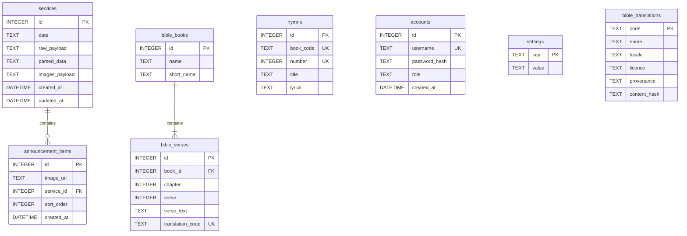

# Data Models - Monolith

This document describes the database schema, data relationships, and seed data structures of the monolithic `bic-pptx-workflow` project.

## Database Engine

The system uses **SQLite** (via the `better-sqlite3` driver) for lightweight, single-node file-based storage.
The database file is located at `data.db` in the project root by default, or configured via the `DB_PATH` environment variable.
Database settings optimize for reliability and concurrency using the following SQLite pragmas:
- `journal_mode = WAL` (Write-Ahead Logging)
- `busy_timeout = 5000` (Handles lock contentions up to 5s)
- `foreign_keys = ON` (Enforces referential integrity)

---

## Schema Relationship Diagram

---

## Table Definitions

### 1. `services`
Stores incoming service rundown records and their parsed structural formats.

| Column Name | SQLite Type | Constraints | Description |
|---|---|---|---|
| `id` | `INTEGER` | PRIMARY KEY AUTOINCREMENT | Unique ID of the service record. |
| `date` | `TEXT` | NOT NULL | Service date formatted as `YYYY-MM-DD`. |
| `raw_payload` | `TEXT` | NOT NULL | Original unparsed rundown text sent by the bot. |
| `parsed_data` | `TEXT` | | JSON string representing parsed items (roles, hymns, section headers). |
| `images_payload` | `TEXT` | | JSON array string listing attached media URLs. |
| `created_at` | `DATETIME` | DEFAULT CURRENT_TIMESTAMP | Record creation timestamp. |
| `updated_at` | `DATETIME` | DEFAULT CURRENT_TIMESTAMP | Record last modification timestamp. |

### 2. `announcement_items`
Lists individual slide flyers mapped to services, allowing specific ordering.

| Column Name | SQLite Type | Constraints | Description |
|---|---|---|---|
| `id` | `INTEGER` | PRIMARY KEY AUTOINCREMENT | Unique ID of the announcement slide. |
| `image_url` | `TEXT` | NOT NULL | Path or HTTP URL of the image flyer. |
| `service_id` | `INTEGER` | FOREIGN KEY -> `services(id)` ON DELETE CASCADE | Associated service ID. |
| `sort_order` | `INTEGER` | NOT NULL DEFAULT 0 | Ordering index for slide rendering. |
| `created_at` | `DATETIME` | DEFAULT CURRENT_TIMESTAMP | Timestamp of creation. |

### 3. `hymns`
Maintains the song-book lyrics library. Ships with the Seventh-day Adventist
Hymnal (`SDAH`); a second book is an addition, not a replacement.

| Column Name | SQLite Type | Constraints | Description |
|---|---|---|---|
| `id` | `INTEGER` | PRIMARY KEY AUTOINCREMENT | Unique record ID. |
| `book_code` | `TEXT` | NOT NULL DEFAULT `'SDAH'` | Which song book the number belongs to. Matches the corpus file at `data/song-book/<book_code>.json`. |
| `number` | `INTEGER` | NOT NULL | Hymn number within that book. |
| `title` | `TEXT` | NOT NULL | Title of the hymn. |
| `lyrics` | `TEXT` | NOT NULL | Full text/lyrics of the hymn. |

Keyed by `UNIQUE(book_code, number)`, never by `number` alone: every song book
has a #1, so a globally unique number cannot hold two books. Databases created
before this constraint are rebuilt once at boot, with existing rows recorded as
`SDAH` — the only corpus that ever shipped.

### 4. `accounts`
Stores administrative and operator credentials.

| Column Name | SQLite Type | Constraints | Description |
|---|---|---|---|
| `id` | `INTEGER` | PRIMARY KEY AUTOINCREMENT | Unique account ID. |
| `username` | `TEXT` | NOT NULL UNIQUE | User identification name. |
| `password_hash` | `TEXT` | NOT NULL | Password string hashed with BCrypt. |
| `role` | `TEXT` | NOT NULL CHECK(role IN ('admin', 'operator')) | System authorization role. |
| `created_at` | `DATETIME` | DEFAULT CURRENT_TIMESTAMP | Creation timestamp. |

### 5. `settings`
Key-value pair store for system preferences (e.g., presentation duration, retention configurations).

| Column Name | SQLite Type | Constraints | Description |
|---|---|---|---|
| `key` | `TEXT` | PRIMARY KEY | Unique setting config name. |
| `value` | `TEXT` | NOT NULL | Config setting value. |

### 6. `bible_translations`
Registry of installed bible translation corpora, projected from each corpus file on boot.

| Column Name | SQLite Type | Constraints | Description |
|---|---|---|---|
| `code` | `TEXT` | PRIMARY KEY | Globally unique translation code (e.g., `KJV`). |
| `name` | `TEXT` | NOT NULL | Display name from the corpus file. |
| `locale` | `TEXT` | NOT NULL | Data locale declared by the corpus file. |
| `licence` | `TEXT` | NOT NULL | Licence text from the corpus file. |
| `provenance` | `TEXT` | NOT NULL | Provenance from the corpus file. |
| `content_hash` | `TEXT` | | SHA-256 of the corpus file bytes; recorded on reconcile (not used to skip reconcile). |

### 7. `bible_books`
Index of the books of the Bible.

| Column Name | SQLite Type | Constraints | Description |
|---|---|---|---|
| `id` | `INTEGER` | PRIMARY KEY | Book index identifier (e.g., 1 for Genesis). |
| `name` | `TEXT` | NOT NULL | Full name of the book. |
| `short_name` | `TEXT` | NOT NULL | Abbreviated name (e.g., `Gen`). |

### 8. `bible_verses`
Stores Bible scripture verses.

| Column Name | SQLite Type | Constraints | Description |
|---|---|---|---|
| `id` | `INTEGER` | PRIMARY KEY AUTOINCREMENT | Unique verse record ID. |
| `book_id` | `INTEGER` | NOT NULL FOREIGN KEY -> `bible_books(id)` | Book link ID. |
| `chapter` | `INTEGER` | NOT NULL | Chapter number. |
| `verse` | `INTEGER` | NOT NULL | Verse number. |
| `verse_text` | `TEXT` | NOT NULL | Text of the verse. |
| `translation_code` | `TEXT` | NOT NULL DEFAULT 'KJV' | Bible translation code (Unique constraint combines book, chapter, verse, translation_code). |

---

## Seeding & Initialization

1. **Song Book Data:** Loaded during system initialization from `data/song-book/sdah.json` and upserted into the `hymns` table on conflict `(book_code, number)`. Title and lyrics are re-applied from the file on every boot.
2. **Bible Verses:** Reconciled during system initialization from `data/en/bible-translation/kjv.json` into `bible_translations`, `bible_books` / `bible_verses`. A corrected corpus reaches the table on the next boot; rows absent from the file for that translation are removed. An unreadable corpus file reconciles nothing and leaves existing rows untouched.
3. **Bootstrap Admin:** If the `accounts` table is empty and environment variables `AUTH_BOOTSTRAP_USER` and `AUTH_BOOTSTRAP_PASSWORD` are configured, the first admin account is automatically seeded.
